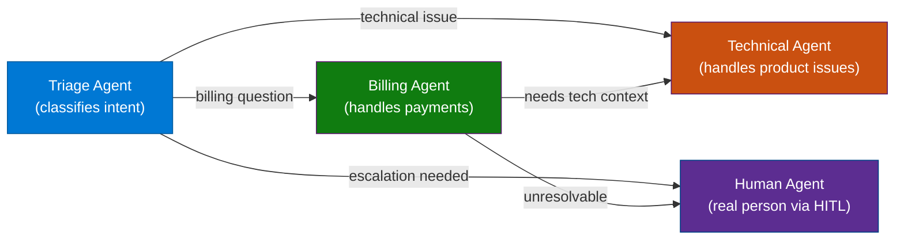
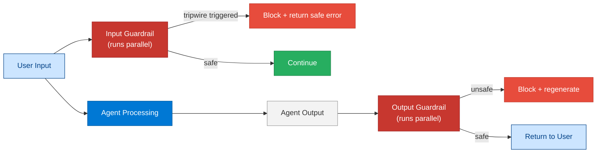

# 09 — OpenAI Agent SDK (Agents SDK / Swarm)

> **Level:** Intermediate → Advanced | **Time to complete:** 3–4 hours | **Azure services:** Azure OpenAI

---

## 1. Overview

### What Is the OpenAI Agents SDK?

The **OpenAI Agents SDK** (formerly known as "Swarm" in experimental form, now GA as `openai-agents`) is OpenAI's official lightweight Python framework for building multi-agent systems. It provides:

- **Agents** — LLM + system prompt + tools + handoffs
- **Handoffs** — mechanism for one agent to transfer conversation control to another
- **Guardrails** — input/output validation layers that run in parallel with the agent
- **Tracing** — built-in OpenTelemetry-compatible execution traces
- **Responses API** — stateful server-side conversation management (alternative to managing messages client-side)

The SDK is intentionally minimal — it adds just enough structure around the OpenAI API to enable multi-agent patterns without prescribing an opinionated framework. Works fully with Azure OpenAI.

### Design Philosophy

```mermaid
graph LR
    SIMPLE["Minimal API surface\n~5 core concepts"] --> COMPOSABLE["Composable\nAgents hand off to agents"]
    COMPOSABLE --> PYTHON["Python-first\nNo YAML / JSON config files"]
    PYTHON --> TRANSPARENT["Transparent\nBuilt-in tracing of every step"]

    classDef primary   fill:#0078d4,color:#fff,stroke:#005a9e
    classDef secondary fill:#7b2d8b,color:#fff,stroke:#5a1a6b
    classDef storage   fill:#2d7d4a,color:#fff,stroke:#1f5c35
    classDef security  fill:#c7372f,color:#fff,stroke:#a02020
    classDef monitor   fill:#e67300,color:#fff,stroke:#b35500
    classDef success   fill:#27ae60,color:#fff,stroke:#1e8449
    classDef warning   fill:#f39c12,color:#333,stroke:#d68910
    classDef neutral   fill:#f3f3f3,color:#333,stroke:#999
    classDef user      fill:#cce5ff,color:#004085,stroke:#004085
    classDef decision  fill:#fff3cd,color:#856404,stroke:#856404
    classDef highlight fill:#e74c3c,color:#fff,stroke:#c0392b

    class SIMPLE neutral
    class COMPOSABLE primary
    class PYTHON neutral
    class TRANSPARENT monitor
```



---

## 2. Core Concepts

### 2.1 Agent

An Agent is the primitive: an LLM model + system prompt + a list of tools and/or handoffs.

```python
from agents import Agent, Runner
from agents.models.openai import AzureOpenAIProvider

agent = Agent(
    name="CustomerSupportAgent",
    instructions="You are a helpful customer support agent...",
    model="gpt-4o",
    tools=[lookup_order, create_ticket],        # Tools it can call
    handoffs=[billing_agent, technical_agent],  # Agents it can transfer to
)
```

### 2.2 Handoffs — The Killer Feature

Handoffs are the mechanism that makes multi-agent systems composable. One agent transfers full conversation control to another, passing relevant context.



### 2.3 Guardrails

Guardrails run **in parallel** with the agent (not sequentially), checking inputs and outputs without adding to latency:



### 2.4 Responses API vs. Chat Completions

The Responses API is a stateful alternative to Chat Completions where conversation state is stored server-side:

| Feature | Chat Completions API | Responses API |
|---|---|---|
| State management | Client manages messages array | Server manages state |
| Multi-turn | Manual history concatenation | Automatic via `previous_response_id` |
| Tool execution | Client executes, submits results | Same (client executes) |
| File search | Not built-in | Built-in |
| Best for | Full control, stateless services | Simplified multi-turn agents |

---

## 3. Working Code Example — Customer Support Triage System

```python
# customer_support.py
import asyncio
import os
from agents import Agent, Runner, handoff, RunContextWrapper
from agents.models.openai import AzureOpenAIProvider
from agents.guardrails import InputGuardrail, GuardrailFunctionOutput
from agents import function_tool
from pydantic import BaseModel
from dotenv import load_dotenv

load_dotenv()

# Configure Azure OpenAI provider
provider = AzureOpenAIProvider(
    azure_endpoint=os.environ["AZURE_OPENAI_ENDPOINT"],
    api_key=os.environ["AZURE_OPENAI_API_KEY"],
    api_version="2024-10-21",
    azure_deployment=os.environ["AZURE_OPENAI_DEPLOYMENT_NAME"],
)


# ── Tools ────────────────────────────────────────────────────────────
@function_tool
def lookup_order(order_id: str) -> dict:
    """Look up order status and details by order ID."""
    orders = {
        "ORD-001": {"status": "delivered", "items": ["Laptop"], "amount": 1299.99, "date": "2025-06-20"},
        "ORD-002": {"status": "in_transit", "items": ["Monitor"], "amount": 449.99, "eta": "2025-07-02"},
    }
    return orders.get(order_id.upper(), {"error": "Order not found"})


@function_tool
def process_refund(order_id: str, amount: float, reason: str) -> dict:
    """Process a refund for an order. Amounts over $500 require manager approval."""
    if amount > 500:
        return {"status": "escalated", "message": "Refund > $500 requires manager approval", "ticket": "ESC-9988"}
    return {"status": "approved", "refund_id": f"REF-{order_id}", "amount": amount, "processing_days": 3}


@function_tool
def create_support_ticket(customer_id: str, issue: str, priority: str = "medium") -> dict:
    """Create a support ticket."""
    import random
    return {"ticket_id": f"TKT-{random.randint(10000, 99999)}", "priority": priority, "status": "open"}


@function_tool
def check_account_balance(customer_id: str) -> dict:
    """Check customer account balance and credits."""
    return {"customer_id": customer_id, "balance": 45.00, "credits": 20.00, "currency": "USD"}


# ── Guardrails ────────────────────────────────────────────────────────
class SafetyCheck(BaseModel):
    is_safe: bool
    reason: str


async def pii_guardrail(ctx: RunContextWrapper, agent: Agent, input: str) -> GuardrailFunctionOutput:
    """Detect PII in user input and flag for redaction."""
    import re
    pii_patterns = [
        r'\b\d{3}[-.]?\d{2}[-.]?\d{4}\b',   # SSN
        r'\b\d{4}[\s-]?\d{4}[\s-]?\d{4}[\s-]?\d{4}\b',  # Credit card
    ]
    for pattern in pii_patterns:
        if re.search(pattern, input):
            return GuardrailFunctionOutput(
                output_info=SafetyCheck(is_safe=False, reason="PII detected in input"),
                tripwire_triggered=True,
            )
    return GuardrailFunctionOutput(
        output_info=SafetyCheck(is_safe=True, reason="No PII detected"),
        tripwire_triggered=False,
    )


# ── Specialist Agents ─────────────────────────────────────────────────
billing_agent = Agent(
    name="BillingAgent",
    model="gpt-4o",
    model_provider=provider,
    instructions="""You are a billing specialist. Handle:
- Refund requests (use process_refund tool)
- Account balance queries (use check_account_balance tool)
- Billing disputes
Always verify the order before processing any refund.
If an issue requires technical support, hand off to TechnicalAgent.""",
    tools=[lookup_order, process_refund, check_account_balance],
)

technical_agent = Agent(
    name="TechnicalAgent",
    model="gpt-4o",
    model_provider=provider,
    instructions="""You are a technical support specialist. Handle:
- Product defects and quality issues
- Usage questions
- Compatibility issues
Create a support ticket for any issue that needs follow-up.
If the issue is billing-related, hand off to BillingAgent.""",
    tools=[create_support_ticket, lookup_order],
    handoffs=[billing_agent],
)

billing_agent.handoffs = [technical_agent]  # Enable cross-handoff

# ── Triage Agent (entry point) ────────────────────────────────────────
triage_agent = Agent(
    name="TriageAgent",
    model="gpt-4o",
    model_provider=provider,
    instructions="""You are a customer support triage agent. Your ONLY job is to:
1. Greet the customer
2. Understand their issue in ONE question if needed
3. Route to the correct specialist:
   - Billing issues (refunds, charges, balance) → BillingAgent
   - Technical issues (product defects, usage, compatibility) → TechnicalAgent

Do NOT attempt to resolve issues yourself. Always hand off.""",
    handoffs=[billing_agent, technical_agent],
    input_guardrails=[InputGuardrail(guardrail_function=pii_guardrail)],
)


# ── Runner ────────────────────────────────────────────────────────────
async def handle_customer_request(message: str, customer_id: str = "CUS-001") -> str:
    """Run the triage system for a customer message."""
    result = await Runner.run(
        starting_agent=triage_agent,
        input=f"[Customer ID: {customer_id}] {message}",
        max_turns=15,
    )
    return result.final_output


async def demo():
    scenarios = [
        ("I want a refund for order ORD-001, the laptop arrived damaged", "CUS-001"),
        ("My new monitor won't connect to my MacBook. Model: ORD-002", "CUS-002"),
        ("What's my account balance and do I have any credits?", "CUS-001"),
    ]

    for message, customer_id in scenarios:
        print(f"\nCustomer ({customer_id}): {message}")
        response = await handle_customer_request(message, customer_id)
        print(f"Support: {response}")
        print("-" * 60)


if __name__ == "__main__":
    asyncio.run(demo())
```

### Streaming Output

```python
# streaming.py
import asyncio
from agents import Runner, ItemHelpers

async def stream_support(message: str):
    """Stream agent responses token by token."""
    result = Runner.run_streamed(
        starting_agent=triage_agent,
        input=message,
    )

    async for event in result.stream_events():
        if event.type == "raw_response_event":
            # Stream LLM tokens
            pass
        elif event.type == "run_item_stream_event":
            if event.item.type == "tool_call_item":
                print(f"\n[Tool: {event.item.raw_item.name}]", end="")
            elif event.item.type == "message_output_item":
                print(ItemHelpers.text_message_output(event.item), end="", flush=True)
        elif event.type == "agent_updated_stream_event":
            print(f"\n[Handoff → {event.new_agent.name}]")

    print(f"\n\nFinal agent: {result.current_agent.name}")

asyncio.run(stream_support("I need a refund for my broken product"))
```

---

## 4. Enterprise Pattern Notes

### Pattern: Agents as Microservices

Each agent can be deployed as an independent service and called via HTTP, with handoffs implemented as REST calls rather than in-process Python calls. This enables:
- Independent scaling of each specialist agent
- Different teams owning different agents
- A/B testing agent implementations

### Pattern: Context Object for Session State

```python
from dataclasses import dataclass
from agents import RunContextWrapper

@dataclass
class CustomerContext:
    customer_id: str
    session_id: str
    tier: str  # "basic", "pro", "enterprise"
    authenticated: bool = False

# Pass context to runner — accessible in all tools and guardrails
result = await Runner.run(
    starting_agent=triage_agent,
    input=message,
    context=CustomerContext(customer_id="CUS-001", session_id="sess-xyz", tier="enterprise"),
)

# In a tool:
@function_tool
def get_priority_routing(wrapper: RunContextWrapper[CustomerContext]) -> str:
    if wrapper.context.tier == "enterprise":
        return "enterprise_support_queue"
    return "standard_queue"
```

---

## 5. Production Checklist

- [ ] Input guardrails check for PII, prompt injection, and policy violations
- [ ] Output guardrails check for PII leakage in agent responses
- [ ] `max_turns` always set (prevents infinite agent loops)
- [ ] Handoff cycles detected and prevented (A hands off to B which hands off to A)
- [ ] Azure OpenAI private endpoint used — agent never calls public openai.com
- [ ] All tool calls logged with customer ID and session ID for audit
- [ ] Tracing enabled: `OPENAI_AGENTS_TRACING=true` → exports to your observability stack

---

## 6. Interview Q&A

### Q1 (Beginner): What is a "handoff" in the OpenAI Agents SDK?

**Answer:** A handoff is the mechanism by which one agent transfers full conversation control to another agent. When Agent A hands off to Agent B, B receives the entire conversation history to date and continues from where A left off. The user never sees the transfer — from their perspective, it's one continuous conversation. Handoffs are how you build specialized multi-agent systems: a triage agent routes to billing or technical specialists based on the user's intent, each specialist having tools appropriate to their domain.

### Q2 (Intermediate): How do guardrails differ from just adding instructions to the system prompt?

**Answer:** System prompt instructions are processed by the same LLM call that generates the response — they can be overridden by a sufficiently clever user (prompt injection) and add to the token count for every call. Guardrails run as *separate, parallel* code paths — they don't add to the agent's token budget and can use completely different logic (regex, a separate lightweight LLM, or a deterministic rule engine). If a guardrail triggers (`tripwire_triggered=True`), the agent's response is blocked immediately, even if the agent produced a response, before it reaches the user. This makes guardrails more reliable for hard safety requirements than prompt instructions alone.

### Q3 (Advanced): When would you choose the OpenAI Agents SDK over LangGraph for a production multi-agent system?

**Answer:** Choose OpenAI Agents SDK when: (1) Your multi-agent topology is a routing/handoff tree (triage → specialists), not a complex state machine; (2) You want minimal framework overhead and prefer composing pure Python; (3) You need built-in tracing with minimal setup; (4) Your team is already OpenAI API experts and doesn't need LangGraph's graph abstraction. Choose LangGraph when: (1) Workflows need durable state that persists across process restarts; (2) Human-in-the-loop approval gates are required; (3) The workflow has complex conditional branching and loops that benefit from a visual graph model; (4) You need time-travel debugging of workflow execution. In practice, use OpenAI Agents SDK for synchronous, real-time request-response multi-agent flows; use LangGraph for long-running, stateful, durable workflows.

---

## Cross-links

- Previous: [08 — AutoGen](./08-AutoGen.md)
- Next: [10 — Multi-Agent Systems](./10-Multi-Agent-Systems.md)
- Related: [11 — Agent Orchestration](./11-Agent-Orchestration.md) | [12 — Agent-to-Agent Communication](./12-Agent-to-Agent-Communication.md)

---

*Module 09 | Series: Enterprise Agentic AI Tutorial | Last updated: June 2026*
