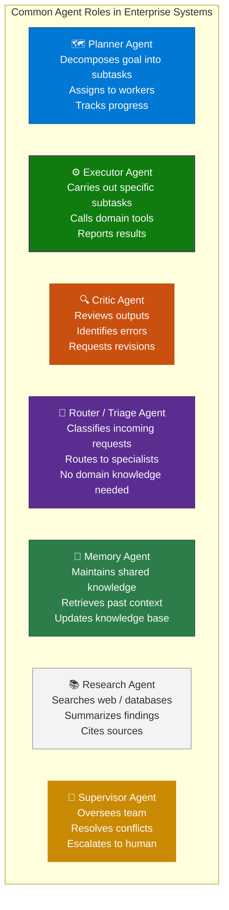
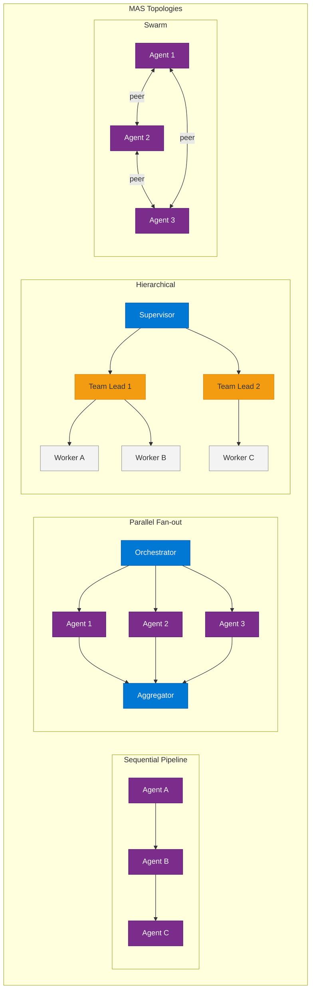
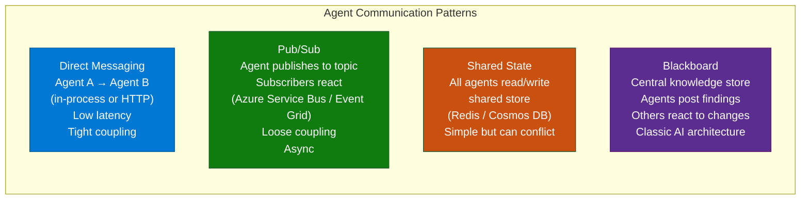
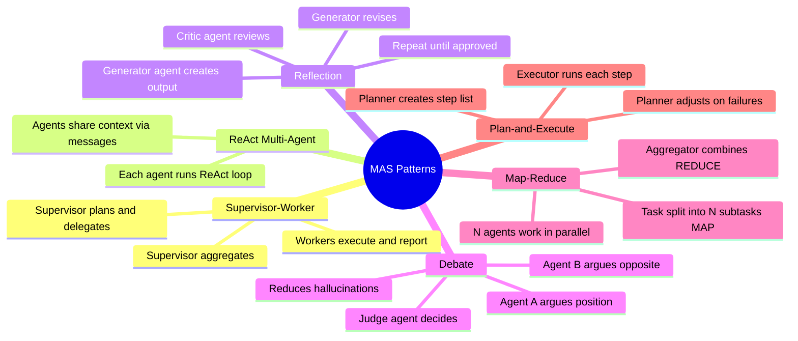
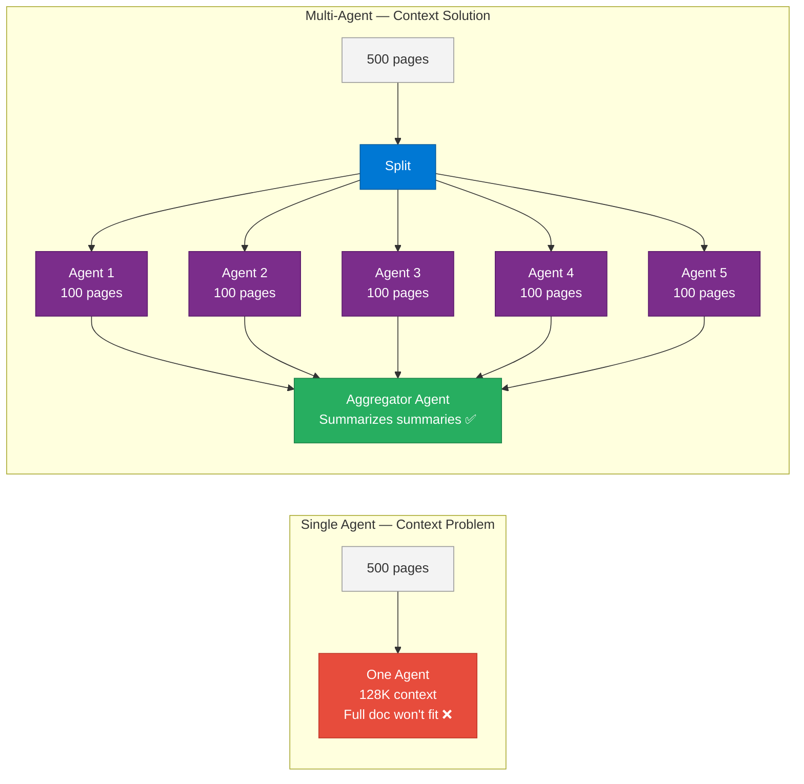
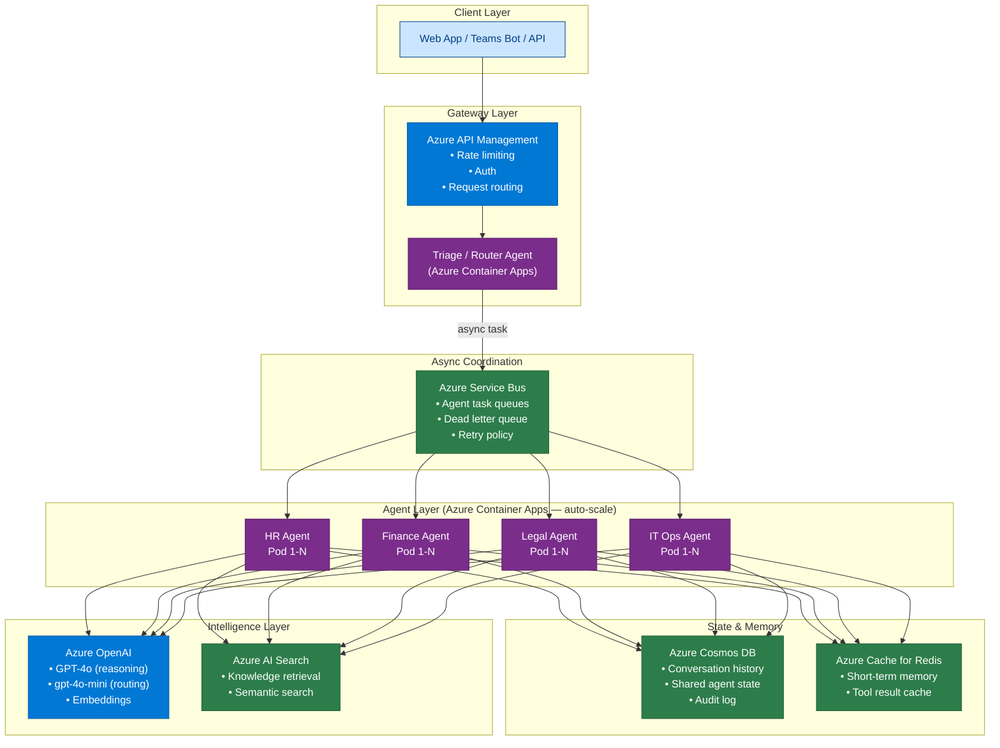

# 10 — Multi-Agent Systems

> **Level:** Advanced | **Time to complete:** 5–6 hours | **Azure services:** Azure OpenAI, Azure Service Bus, Azure Container Apps, Azure Cosmos DB

---

## 1. Overview

### What Are Multi-Agent Systems?

A **Multi-Agent System (MAS)** is an architecture where multiple autonomous AI agents collaborate — each with specialized capabilities, tools, and personas — to solve problems that are too complex, too large, or too multidisciplinary for a single agent. Each agent perceives its environment (other agents' messages, tool results, data), reasons using its LLM, and acts by calling tools or communicating with other agents.

### Why Enterprise MAS Over Single Agents?

| Dimension | Single Agent | Multi-Agent System |
|---|---|---|
| Task complexity | Bounded by context window | Distributed across agents |
| Specialization | Generalist | Deep domain experts |
| Parallelism | Sequential tool calls | Parallel agent execution |
| Reliability | Single point of failure | Redundancy via peer review |
| Context management | One growing context | Isolated contexts per agent |
| Scale | Vertical (bigger model) | Horizontal (more agents) |

---

## 2. Core Concepts

### 2.1 Agent Roles in Enterprise MAS



### 2.2 Multi-Agent Topologies



### 2.3 Communication Patterns



### 2.4 Design Patterns



---

## 3. Deep Technical Detail

### 3.1 Context Isolation — The Key MAS Benefit

One of the most underappreciated benefits of MAS: each agent has an **independent context window**. A single agent processing a 500-page document runs out of context. Five agents, each processing 100 pages in parallel, do not.



### 3.2 Coordination Mechanisms

```python
# coordination.py — shared state coordination via Azure Cosmos DB
import asyncio
import uuid
from azure.cosmos.aio import CosmosClient
from datetime import datetime

class SharedAgentState:
    """Blackboard pattern: all agents read/write shared state."""

    def __init__(self, cosmos_client: CosmosClient, db: str, container: str):
        self.container = cosmos_client.get_database_client(db).get_container_client(container)

    async def post_finding(self, agent_id: str, finding_type: str, content: dict):
        """Agent posts a finding to the shared blackboard."""
        doc = {
            "id": str(uuid.uuid4()),
            "agent_id": agent_id,
            "finding_type": finding_type,
            "content": content,
            "timestamp": datetime.utcnow().isoformat(),
            "status": "pending_review",
        }
        await self.container.create_item(doc)
        return doc["id"]

    async def get_findings(self, finding_type: str = None) -> list:
        """Retrieve all findings, optionally filtered by type."""
        query = "SELECT * FROM c WHERE c.status = 'pending_review'"
        if finding_type:
            query += f" AND c.finding_type = '{finding_type}'"
        return [item async for item in self.container.query_items(query, enable_cross_partition_query=True)]

    async def mark_processed(self, finding_id: str):
        """Mark a finding as processed."""
        item = await self.container.read_item(finding_id, partition_key=finding_id)
        item["status"] = "processed"
        await self.container.replace_item(finding_id, item)
```

### 3.3 Parallel Execution with asyncio

```python
# parallel_agents.py
import asyncio
from langchain_openai import AzureChatOpenAI
from langchain_core.prompts import ChatPromptTemplate

llm = AzureChatOpenAI(...)

ANALYSIS_PROMPT = ChatPromptTemplate.from_messages([
    ("system", "You are a {role} expert. Analyze the following from your perspective. Be specific."),
    ("human", "{content}"),
])

async def run_specialist(role: str, content: str) -> dict:
    chain = ANALYSIS_PROMPT | llm
    response = await chain.ainvoke({"role": role, "content": content})
    return {"role": role, "analysis": response.content}

async def parallel_analysis(document: str) -> dict:
    """Run multiple specialist agents in parallel on the same document."""
    specialists = ["legal", "financial", "technical", "risk", "compliance"]

    results = await asyncio.gather(
        *[run_specialist(role, document) for role in specialists],
        return_exceptions=True,
    )

    # Filter out errors
    successful = [r for r in results if isinstance(r, dict)]
    errors = [str(r) for r in results if isinstance(r, Exception)]

    return {"analyses": successful, "errors": errors, "document_length": len(document)}
```

### 3.4 Supervisor Pattern — Full Implementation

```python
# supervisor_mas.py
import asyncio
import json
from langchain_openai import AzureChatOpenAI
from langchain_core.prompts import ChatPromptTemplate
from langchain_core.messages import HumanMessage, SystemMessage, AIMessage
from typing import Literal

llm = AzureChatOpenAI(
    azure_deployment="gpt-4o",
    temperature=0,
    # ... auth config
)

WORKERS = {
    "researcher": {
        "description": "Searches for factual information and data",
        "prompt": "You are a research analyst. Search for and synthesize factual information on: {task}",
    },
    "analyst": {
        "description": "Analyzes data and identifies patterns",
        "prompt": "You are a data analyst. Analyze the following and identify key insights: {task}",
    },
    "writer": {
        "description": "Drafts professional reports and summaries",
        "prompt": "You are a professional writer. Create a clear, concise report on: {task}",
    },
}

async def run_worker(worker_name: str, task: str) -> str:
    prompt = WORKERS[worker_name]["prompt"].format(task=task)
    response = await llm.ainvoke([HumanMessage(content=prompt)])
    return response.content

async def supervisor_loop(user_request: str, max_rounds: int = 5) -> str:
    """Supervisor decides which worker to use and aggregates results."""
    results = []
    history = []

    supervisor_prompt = SystemMessage(content=f"""You are a supervisor orchestrating a team.
Workers available: {json.dumps({k: v['description'] for k, v in WORKERS.items()}, indent=2)}

For each turn, respond with JSON:
{{"next": "<worker_name> or FINISH", "task": "<specific task for that worker>", "reason": "<why>"}}

When you have enough information, respond with {{"next": "FINISH", "summary": "<final answer>"}}""")

    history.append(HumanMessage(content=f"User request: {user_request}"))

    for round_num in range(max_rounds):
        response = await llm.ainvoke([supervisor_prompt] + history)
        decision = json.loads(response.content)

        if decision.get("next") == "FINISH":
            return decision.get("summary", "\n".join(results))

        worker_name = decision["next"]
        worker_task = decision["task"]

        print(f"Round {round_num+1}: Supervisor → {worker_name}: '{worker_task[:60]}...'")
        worker_result = await run_worker(worker_name, worker_task)
        results.append(f"[{worker_name}]: {worker_result}")

        history.append(AIMessage(content=response.content))
        history.append(HumanMessage(content=f"Worker {worker_name} completed:\n{worker_result}"))

    return "\n\n".join(results)
```

---

## 4. Enterprise Reference Architecture



---

## 5. Production Checklist

### Architecture
- [ ] Agent responsibilities clearly defined — no overlapping tool sets
- [ ] Communication protocol documented (in-process vs. HTTP vs. message bus)
- [ ] Context isolation enforced — agents don't share raw LLM context
- [ ] Aggregator/supervisor agent responsible for final coherence check

### Reliability
- [ ] Each agent has independent retry logic
- [ ] Dead letter queue for failed agent tasks (Azure Service Bus)
- [ ] Circuit breaker between agents (if Agent B is down, Supervisor routes differently)
- [ ] Timeout per agent-to-agent call (prevents cascading failures)

### Observability
- [ ] Correlation ID threaded through all agent calls (trace full multi-agent request)
- [ ] Each agent logs: task received, tools called, response sent, latency
- [ ] LangSmith / Azure Monitor traces stitched into one distributed trace per user request

---

## 6. Interview Q&A

### Q1 (Beginner): What is a multi-agent system and when is it better than a single agent?

**Answer:** A multi-agent system is an architecture where multiple AI agents collaborate to solve a problem, each with a specialized role, tools, and independent context. Single agents are better for focused, well-scoped tasks that fit in one context window. Multi-agent systems are better when: (1) Tasks are too large for one context window (e.g., processing 1,000-page documents); (2) Different subtasks need different tools or expertise (legal review + financial analysis + technical assessment need different specialist knowledge); (3) Quality improves from peer review (one agent generates, another critiques); (4) Parallelism is needed for throughput (process 10 documents simultaneously with 10 agents).

### Q2 (Intermediate): Explain the Supervisor-Worker pattern and its failure modes.

**Answer:** The Supervisor-Worker pattern has one LLM-powered supervisor that: (1) Decomposes the user's goal into subtasks; (2) Assigns each subtask to a specialized worker agent; (3) Aggregates worker results; (4) Decides when the overall task is complete or needs more work. It mirrors how a human team lead operates.

Failure modes: (1) **Supervisor gets confused** — after many rounds, the supervisor loses track of the original goal (fix: pin original goal in every supervisor prompt); (2) **Worker loop** — supervisor keeps sending to the same worker with incrementally different instructions (fix: track which workers have been called and cap at N uses per worker); (3) **Result inconsistency** — workers contradict each other (fix: add a synthesis node or prompt supervisor to explicitly reconcile conflicts); (4) **Cost explosion** — each supervisor "turn" costs one GPT-4o call (fix: use gpt-4o-mini for supervisor routing decisions; reserve GPT-4o for worker reasoning).

### Q3 (Advanced): How do you design a MAS that handles 10,000 concurrent enterprise workflows reliably?

**Answer:** Architecture for 10K concurrent workflows: (1) **Message-driven decomposition** — incoming requests land in an Azure Service Bus queue; KEDA-triggered Container Apps workers pull and process tasks independently; (2) **Stateless agents** — each agent execution is stateless; all state lives in Cosmos DB keyed by `workflow_id`; (3) **Agent pool sizing** — for each agent type, estimate tokens/second needed and size AOAI PTU accordingly; scale CA replicas based on queue depth; (4) **Priority queues** — enterprise-tier workflows get a dedicated Service Bus queue with higher priority; (5) **Circuit breaker** — if a specialist agent returns errors > 5% of requests, route to a fallback or queue for retry; (6) **Distributed tracing** — every agent call carries a `correlation_id` that spans the entire 10K-workflow set; Azure Monitor + Application Insights correlate traces across agents; (7) **Chaos testing** — run synthetic failure injections monthly to validate fault tolerance.

---

## Cross-links

- Previous: [09 — OpenAI Agent SDK](./09-OpenAI-Agent-SDK.md)
- Next: [11 — Agent Orchestration](./11-Agent-Orchestration.md)
- Related: [12 — Agent-to-Agent Communication](./12-Agent-to-Agent-Communication.md) | [22 — Planning and Reasoning](./22-Planning-and-Reasoning.md)
- Infrastructure: [27 — Cloud Native AI](./27-Cloud-Native-AI.md) | [30 — Kubernetes](./30-Kubernetes.md)

---

*Module 10 | Series: Enterprise Agentic AI Tutorial | Last updated: June 2026*
