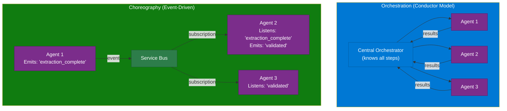
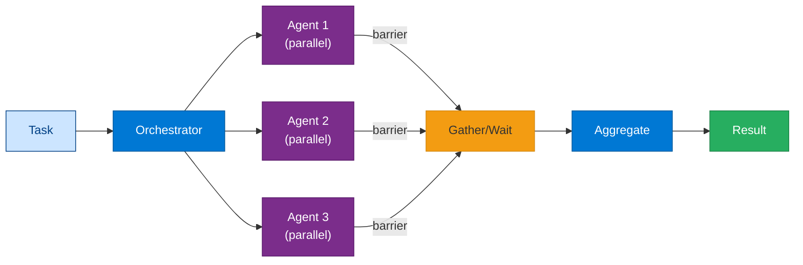
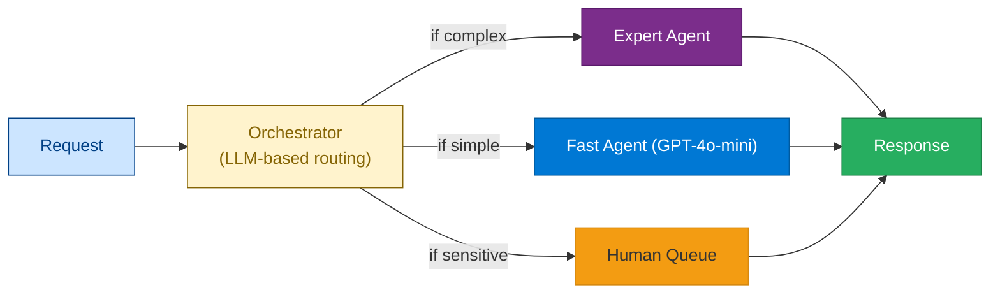
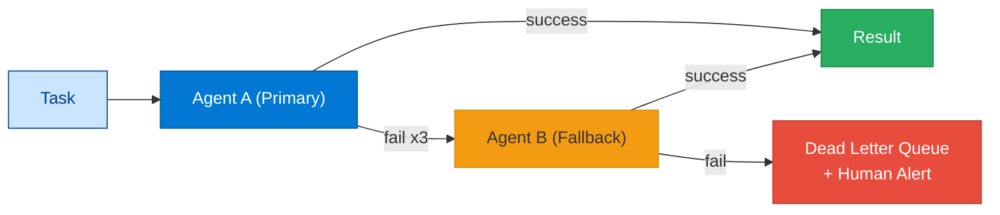
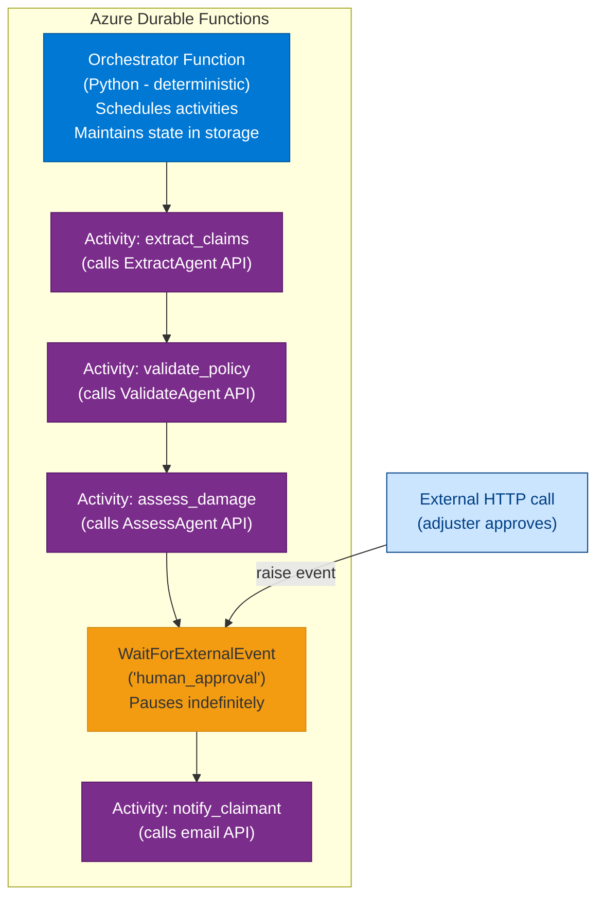
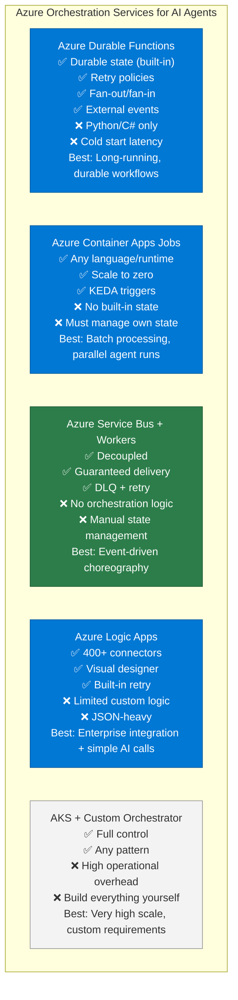

# 11 — Agent Orchestration

> **Level:** Advanced | **Time to complete:** 4–5 hours | **Azure services:** Azure Service Bus, Azure Container Apps, Azure Durable Functions, Azure API Management

---

## 1. Overview

### What Is Agent Orchestration?

**Agent Orchestration** is the set of patterns, protocols, and infrastructure for coordinating how multiple agents interact — determining which agent runs when, how results flow between agents, how failures are handled, and how the overall system maintains coherence toward a goal.

Orchestration sits above the agent framework (LangChain, LangGraph, SK) and concerns itself with: task scheduling, state management, agent lifecycle, routing, and cross-agent communication.

### Orchestration vs. Choreography



| Dimension | Orchestration | Choreography |
|---|---|---|
| Control | Centralized | Decentralized |
| Coupling | Tight (orchestrator knows all) | Loose (agents only know their events) |
| Visibility | Easy (orchestrator has full view) | Hard (must aggregate logs) |
| Failure handling | Orchestrator retries | Each agent retries independently |
| Adding new agents | Change orchestrator | Add new subscriber |

---

## 2. Core Concepts

### 2.1 Orchestration Patterns

#### Pattern 1: Sequential Pipeline

```mermaid
graph LR
    IN["Input"] --> E["Extract"] --> V["Validate"] --> A["Assess"] --> N["Notify"] --> OUT["Output"]
    style IN fill:#0078d4,color:#ffffff
    style OUT fill:#107c10,color:#ffffff

    classDef primary   fill:#0078d4,color:#fff,stroke:#005a9e
    classDef secondary fill:#7b2d8b,color:#fff,stroke:#5a1a6b
    classDef storage   fill:#2d7d4a,color:#fff,stroke:#1f5c35
    classDef security  fill:#c7372f,color:#fff,stroke:#a02020
    classDef monitor   fill:#e67300,color:#fff,stroke:#b35500
    classDef success   fill:#27ae60,color:#fff,stroke:#1e8449
    classDef warning   fill:#f39c12,color:#333,stroke:#d68910
    classDef neutral   fill:#f3f3f3,color:#333,stroke:#999
    classDef user      fill:#cce5ff,color:#004085,stroke:#004085
    classDef decision  fill:#fff3cd,color:#856404,stroke:#856404
    classDef highlight fill:#e74c3c,color:#fff,stroke:#c0392b

    class IN user
    class E primary
    class V neutral
    class A secondary
    class N monitor
    class OUT success
```



Best for: linear workflows with clear dependency ordering.

#### Pattern 2: Fan-Out / Fan-In (Parallel)



Best for: independent subtasks that can run simultaneously (e.g., legal + financial + technical review in parallel).

#### Pattern 3: Dynamic Routing



#### Pattern 4: Retry and Fallback



### 2.2 Durable Orchestration with Azure Durable Functions

For long-running multi-agent workflows (hours to days), Azure Durable Functions provides built-in orchestration with durable state, retry policies, and fan-out/fan-in:



```python
# durable_orchestrator.py
import azure.durable_functions as df

def orchestrator_function(context: df.DurableOrchestrationContext):
    """
    Durable orchestrator for multi-agent claims processing.
    This function MUST be deterministic — no random, no time calls, no I/O.
    All I/O goes in Activity functions.
    """
    claim_data = context.get_input()

    # Sequential: extract → validate
    extracted = yield context.call_activity("ExtractClaimActivity", claim_data)
    validated = yield context.call_activity("ValidatePolicyActivity", extracted)

    if not validated["coverage_confirmed"]:
        yield context.call_activity("SendRejectionActivity", validated)
        return {"status": "rejected"}

    # Parallel: assess + fraud check simultaneously
    assess_task = context.call_activity("AssessDamageActivity", validated)
    fraud_task = context.call_activity("CheckFraudActivity", validated)
    results = yield context.task_all([assess_task, fraud_task])
    assessment, fraud_check = results

    # Human approval gate for high-value claims
    if assessment["amount"] > 5000:
        approval_event = context.wait_for_external_event("HumanApproval")
        timeout_event = context.create_timer(
            context.current_utc_datetime + df.timedelta(hours=48)
        )
        winner = yield context.task_any([approval_event, timeout_event])

        if winner == timeout_event:
            yield context.call_activity("EscalateActivity", assessment)
            return {"status": "escalated_timeout"}

        human_decision = winner.result
        if human_decision["decision"] != "approved":
            return {"status": "rejected_by_human"}

    # Final notification
    yield context.call_activity("NotifyClaimantActivity", {
        "claim_id": claim_data["claim_id"],
        "amount": assessment["amount"],
        "status": "approved",
    })

    return {"status": "approved", "amount": assessment["amount"]}

main = df.Orchestrator.create(orchestrator_function)
```

---

## 3. Azure Orchestration Services Comparison



---

## 4. Working Code Example — Orchestrated Research Pipeline

```python
# research_orchestrator.py
import asyncio
import uuid
from dataclasses import dataclass, field
from datetime import datetime
from langchain_openai import AzureChatOpenAI
from langchain_core.prompts import ChatPromptTemplate
from azure.servicebus.aio import ServiceBusClient
from azure.cosmos.aio import CosmosClient
import json, os

@dataclass
class TaskState:
    task_id: str = field(default_factory=lambda: str(uuid.uuid4()))
    status: str = "pending"
    steps_completed: list = field(default_factory=list)
    results: dict = field(default_factory=dict)
    errors: list = field(default_factory=list)
    created_at: str = field(default_factory=lambda: datetime.utcnow().isoformat())

class ResearchOrchestrator:
    """Orchestrates a multi-agent research pipeline."""

    def __init__(self, llm: AzureChatOpenAI):
        self.llm = llm
        self.tasks: dict[str, TaskState] = {}

    async def _run_agent(self, agent_name: str, agent_prompt: str, task: str) -> str:
        """Run a single agent and return its output."""
        chain = ChatPromptTemplate.from_messages([
            ("system", agent_prompt),
            ("human", "{task}"),
        ]) | self.llm
        response = await chain.ainvoke({"task": task})
        return response.content

    async def run_research_pipeline(self, research_question: str) -> TaskState:
        state = TaskState()
        self.tasks[state.task_id] = state
        state.status = "in_progress"

        try:
            # Step 1: Plan the research approach
            print(f"[{state.task_id[:8]}] Step 1: Planning...")
            plan = await self._run_agent(
                "Planner",
                "You are a research planner. Break down the research question into 3 focused sub-questions that together would answer the main question. Return as JSON: {sub_questions: [str]}",
                research_question,
            )
            sub_questions = json.loads(plan).get("sub_questions", [research_question])
            state.results["plan"] = sub_questions
            state.steps_completed.append("planning")

            # Step 2: Research each sub-question in parallel
            print(f"[{state.task_id[:8]}] Step 2: Researching {len(sub_questions)} sub-questions in parallel...")
            research_tasks = [
                self._run_agent(
                    "Researcher",
                    "You are a research analyst. Provide a comprehensive, factual answer to the question. Cite specific examples, numbers, and patterns. Be concrete.",
                    q
                )
                for q in sub_questions
            ]
            research_results = await asyncio.gather(*research_tasks, return_exceptions=True)
            state.results["research"] = {
                q: r for q, r in zip(sub_questions, research_results)
                if not isinstance(r, Exception)
            }
            state.errors.extend([str(e) for e in research_results if isinstance(e, Exception)])
            state.steps_completed.append("research")

            # Step 3: Critique and identify gaps
            print(f"[{state.task_id[:8]}] Step 3: Critiquing...")
            critique = await self._run_agent(
                "Critic",
                "Review these research findings and identify: gaps, contradictions, or areas needing more evidence. Be specific.",
                f"Question: {research_question}\n\nFindings:\n" + json.dumps(state.results["research"], indent=2),
            )
            state.results["critique"] = critique
            state.steps_completed.append("critique")

            # Step 4: Synthesize final report
            print(f"[{state.task_id[:8]}] Step 4: Synthesizing...")
            synthesis = await self._run_agent(
                "Synthesizer",
                "Write a comprehensive, well-structured research report. Include an executive summary, key findings, evidence, and recommendations. Professional tone.",
                f"Question: {research_question}\n\nResearch findings: {json.dumps(state.results['research'])}\n\nCritique notes: {critique}",
            )
            state.results["final_report"] = synthesis
            state.steps_completed.append("synthesis")

            state.status = "completed"

        except Exception as e:
            state.status = "failed"
            state.errors.append(str(e))

        return state


async def main():
    llm = AzureChatOpenAI(
        azure_deployment=os.environ.get("AZURE_OPENAI_DEPLOYMENT_NAME", "gpt-4o"),
        azure_endpoint=os.environ["AZURE_OPENAI_ENDPOINT"],
        api_key=os.environ["AZURE_OPENAI_API_KEY"],
        api_version="2024-10-21",
        temperature=0.1,
    )

    orchestrator = ResearchOrchestrator(llm)
    state = await orchestrator.run_research_pipeline(
        "What are the key architectural patterns for deploying multi-agent AI systems in enterprise cloud environments?"
    )

    print(f"\n=== Research Complete ===")
    print(f"Status: {state.status}")
    print(f"Steps: {' → '.join(state.steps_completed)}")
    if state.results.get("final_report"):
        print(f"\nReport Preview:\n{state.results['final_report'][:500]}...")


if __name__ == "__main__":
    from dotenv import load_dotenv
    load_dotenv()
    asyncio.run(main())
```

---

## 5. Production Checklist

- [ ] Orchestration strategy chosen: centralized vs. choreography (document the decision)
- [ ] Task state persisted to durable store — never in-process memory only
- [ ] Retry policy per agent call: max 3 retries, exponential backoff, DLQ on failure
- [ ] Timeout per agent + per full workflow (protect against stuck orchestrations)
- [ ] Fan-out result handling: `gather(..., return_exceptions=True)` — partial failures don't kill the whole pipeline
- [ ] Correlation ID propagated through all orchestration steps
- [ ] Dead letter queue monitored: alerts on any DLQ message (signals systematic agent failure)
- [ ] Circuit breaker: if an agent fails > 20% of calls in 5 minutes, route to fallback

---

## 6. Interview Q&A

### Q1 (Beginner): What is the difference between agent orchestration and agent choreography?

**Answer:** Orchestration uses a central coordinator (the orchestrator) that explicitly tells each agent what to do and when. The orchestrator knows the full workflow and maintains the plan. Think of a conductor directing an orchestra. Choreography has no central coordinator — agents react to events (messages on a queue, state changes in a shared store) and decide independently what to do. Think of a flash mob where everyone knows the routine but no one directs it. Orchestration is easier to reason about and debug; choreography is more scalable and loosely coupled. Most enterprise AI systems use orchestration for complex workflows and choreography for simple event-driven triggers.

### Q2 (Intermediate): When would you use Azure Durable Functions vs. Azure Service Bus for orchestrating AI agents?

**Answer:** Azure Durable Functions is the right choice when: (1) The workflow has sequential steps with shared state (step B needs the output of step A); (2) You need human-in-the-loop pauses via `WaitForExternalEvent`; (3) Fan-out/fan-in parallelism with a barrier (wait for all parallel agents to complete before continuing); (4) Retry and timeout logic should be managed by the framework. Use Azure Service Bus when: (1) Agents are completely independent (the output of one does NOT feed the next); (2) You need guaranteed delivery and dead-letter processing; (3) Multiple consumers need to react to the same event (pub/sub); (4) You want to decouple producers and consumers for independent scaling. In practice, many enterprise systems combine both: Durable Functions orchestrates the workflow logic, and Service Bus handles the async communication between Durable Functions and the agent microservices.

### Q3 (Advanced): Design an orchestration architecture for a multi-agent financial report generation system that must process 1,000 company reports nightly within a 4-hour window.

**Answer:** Architecture: (1) **Trigger**: Azure Data Factory pipeline at 11pm triggers an Azure Function that enqueues 1,000 items to Service Bus; (2) **Worker pool**: KEDA-scaled Container Apps workers pull from the queue — with 250 workers processing 4 items each = 1,000 reports; (3) **Per-report orchestration**: Each worker runs a local LangGraph workflow: DataExtractor → FinancialAnalyst → RiskAssessor → ReportWriter → QualityChecker; (4) **State**: Each workflow checkpoints to Cosmos DB (key: `report_id`); (5) **LLM**: 10 AOAI PTU deployments shared across workers (size for 250 concurrent × 3K tokens/request = 750K TPM needed); (6) **Parallelism within each report**: DataExtractor runs 3 parallel sub-agents for P&L, balance sheet, and cash flow; (7) **Error handling**: Failed reports go to DLQ; a recovery job runs at 2am to retry; (8) **Monitoring**: Azure Monitor alert if queue depth hasn't cleared to zero by 3am.

---

## Cross-links

- Previous: [10 — Multi-Agent Systems](./10-Multi-Agent-Systems.md)
- Next: [12 — Agent-to-Agent Communication](./12-Agent-to-Agent-Communication.md)
- Related: [07 — LangGraph](./07-LangGraph.md) | [23 — Workflow Automation](./23-Workflow-Automation.md)

---

*Module 11 | Series: Enterprise Agentic AI Tutorial | Last updated: June 2026*
