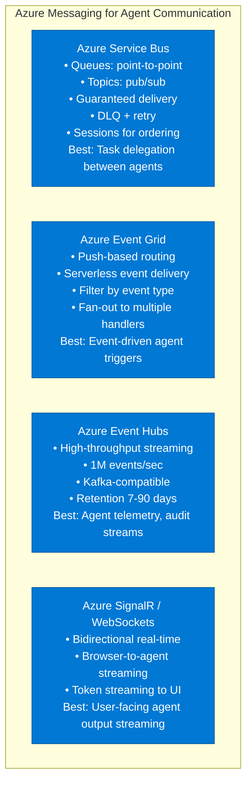
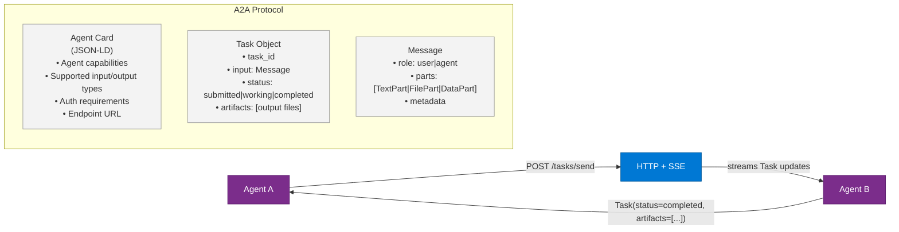
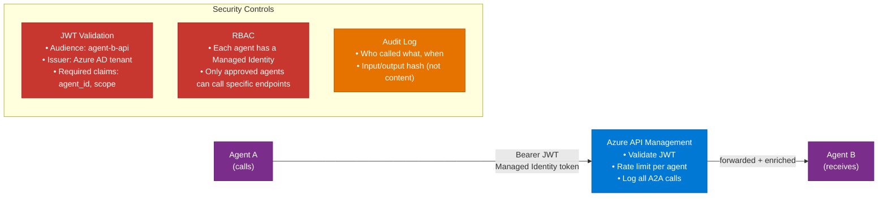

# 12 — Agent-to-Agent Communication

> **Level:** Advanced | **Time to complete:** 4 hours | **Azure services:** Azure Service Bus, Azure Event Grid, Azure API Management, Azure SignalR

---

## 1. Overview

### What Is Agent-to-Agent (A2A) Communication?

Agent-to-Agent communication refers to the protocols, patterns, and infrastructure through which AI agents exchange information, delegate tasks, and coordinate behavior. As multi-agent systems grow from 2-agent pairs to dozens of agents across microservices and even organizations, communication becomes a first-class architectural concern.

Key dimensions:
- **Synchronous vs. Asynchronous**: Does the calling agent wait for a response?
- **Direct vs. Mediated**: Do agents call each other directly or through a broker?
- **In-process vs. Over-the-wire**: Same Python runtime or separate services?
- **Push vs. Pull**: Does the agent push results or wait to be polled?

---

## 2. Communication Patterns

### 2.1 Pattern Comparison

```mermaid
graph TB
    subgraph Sync["Synchronous (Request-Response)"]
        direction LR
        A1["Agent A"] -->|"HTTP/gRPC call"| A2["Agent B"]
        A2 -->|"response (blocking)"| A1
        A1_N["✅ Simple\n✅ Immediate result\n❌ Tight coupling\n❌ Caller blocked\n❌ Cascading failures"]
    end

    subgraph Async["Asynchronous (Message-Based)"]
        direction LR
        B1["Agent A"] -->|"publish message"| Q["Queue / Topic"]
        Q -->|"deliver"| B2["Agent B"]
        B2 -->|"publish result"| Q2["Result Topic"]
        Q2 -->|"callback"| B1
        B1_N["✅ Decoupled\n✅ Retry/DLQ built-in\n✅ Backpressure\n❌ Complex correlation\n❌ Eventual consistency"]
    end

    subgraph Stream["Streaming (Real-time)"]
        direction LR
        C1["Agent A"] -->|"SSE/WebSocket"| C2["Agent B"]
        C2 -->|"token stream"| C1
        C1_N["✅ Low perceived latency\n✅ Progressive results\n❌ Connection management\n❌ Resume on disconnect"]
    end

    classDef primary   fill:#0078d4,color:#fff,stroke:#005a9e
    classDef secondary fill:#7b2d8b,color:#fff,stroke:#5a1a6b
    classDef storage   fill:#2d7d4a,color:#fff,stroke:#1f5c35
    classDef security  fill:#c7372f,color:#fff,stroke:#a02020
    classDef monitor   fill:#e67300,color:#fff,stroke:#b35500
    classDef success   fill:#27ae60,color:#fff,stroke:#1e8449
    classDef warning   fill:#f39c12,color:#333,stroke:#d68910
    classDef neutral   fill:#f3f3f3,color:#333,stroke:#999
    classDef user      fill:#cce5ff,color:#004085,stroke:#004085
    classDef decision  fill:#fff3cd,color:#856404,stroke:#856404
    classDef highlight fill:#e74c3c,color:#fff,stroke:#c0392b

    class A1 secondary
    class A2 secondary
    class B1 secondary
    class Q storage
    class B2 secondary
    class Q2 storage
    class C1 secondary
    class C2 secondary
    class A1_N neutral
    class B1_N neutral
    class C1_N neutral
```



### 2.2 Azure Messaging Services for A2A



### 2.3 The A2A Protocol (Google / Open Standard)

Google's **Agent-to-Agent (A2A) Protocol** is an open standard (2025) for interoperable communication between agents from different vendors and frameworks:



**A2A enables:** Cross-company agent interoperability — a Microsoft-built agent can delegate to a Google-built agent, a Salesforce-built agent, or a custom enterprise agent, using the same protocol.

---

## 3. Deep Technical Detail

### 3.1 Azure Service Bus for A2A Task Delegation

```python
# a2a_service_bus.py — agent delegates tasks via Service Bus
import asyncio
import json
import uuid
from datetime import timedelta
from azure.servicebus.aio import ServiceBusClient, ServiceBusSender
from azure.servicebus import ServiceBusMessage
from azure.identity.aio import DefaultAzureCredential
import os

NAMESPACE = os.environ["SERVICEBUS_NAMESPACE"]  # e.g. "sb-agents-prod.servicebus.windows.net"
TASK_QUEUE = "agent-tasks"
RESULT_TOPIC = "agent-results"


class AgentTaskClient:
    """Send tasks to other agents via Service Bus."""

    def __init__(self, agent_id: str):
        self.agent_id = agent_id
        self.credential = DefaultAzureCredential()
        self._client: ServiceBusClient | None = None

    async def __aenter__(self):
        self._client = ServiceBusClient(NAMESPACE, self.credential)
        return self

    async def __aexit__(self, *args):
        if self._client:
            await self._client.close()

    async def delegate_task(
        self,
        target_agent: str,
        task_type: str,
        payload: dict,
        timeout_seconds: int = 300,
    ) -> str:
        """Send a task to another agent and return the correlation_id."""
        correlation_id = str(uuid.uuid4())

        message_body = json.dumps({
            "correlation_id": correlation_id,
            "source_agent": self.agent_id,
            "target_agent": target_agent,
            "task_type": task_type,
            "payload": payload,
            "timeout_seconds": timeout_seconds,
        })

        msg = ServiceBusMessage(
            body=message_body,
            correlation_id=correlation_id,
            subject=task_type,
            to=target_agent,
            time_to_live=timedelta(seconds=timeout_seconds),
            application_properties={
                "source_agent": self.agent_id,
                "target_agent": target_agent,
            },
        )

        async with self._client.get_queue_sender(TASK_QUEUE) as sender:
            await sender.send_messages(msg)

        return correlation_id

    async def wait_for_result(self, correlation_id: str, timeout_seconds: int = 300) -> dict:
        """Poll result topic for a specific correlation_id."""
        deadline = asyncio.get_event_loop().time() + timeout_seconds

        async with self._client.get_subscription_receiver(
            topic_name=RESULT_TOPIC,
            subscription_name=f"agent-{self.agent_id}",
        ) as receiver:
            while asyncio.get_event_loop().time() < deadline:
                msgs = await receiver.receive_messages(max_message_count=10, max_wait_time=5)
                for msg in msgs:
                    body = json.loads(str(msg))
                    if body.get("correlation_id") == correlation_id:
                        await receiver.complete_message(msg)
                        return body
                    # Abandon — another receiver might want it
                    await receiver.abandon_message(msg)

        raise TimeoutError(f"No result for correlation_id {correlation_id} within {timeout_seconds}s")


class AgentTaskWorker:
    """Receive and process tasks from Service Bus."""

    def __init__(self, agent_id: str, task_handlers: dict):
        self.agent_id = agent_id
        self.task_handlers = task_handlers
        self.credential = DefaultAzureCredential()

    async def start(self):
        """Start consuming tasks from the queue."""
        async with ServiceBusClient(NAMESPACE, self.credential) as client:
            async with client.get_queue_receiver(TASK_QUEUE) as receiver:
                print(f"Agent {self.agent_id} listening for tasks...")
                async with receiver:
                    async for msg in receiver:
                        body = json.loads(str(msg))

                        if body.get("target_agent") != self.agent_id:
                            await receiver.abandon_message(msg)
                            continue

                        task_type = body.get("task_type")
                        handler = self.task_handlers.get(task_type)

                        if not handler:
                            await receiver.dead_letter_message(msg, reason=f"No handler for {task_type}")
                            continue

                        try:
                            result = await handler(body["payload"])
                            await self._publish_result(client, body["correlation_id"], result)
                            await receiver.complete_message(msg)
                        except Exception as e:
                            await receiver.abandon_message(msg)
                            print(f"Error processing task: {e}")

    async def _publish_result(self, client: ServiceBusClient, correlation_id: str, result: dict):
        result_body = json.dumps({
            "correlation_id": correlation_id,
            "agent_id": self.agent_id,
            "result": result,
            "status": "completed",
        })
        async with client.get_topic_sender(RESULT_TOPIC) as sender:
            await sender.send_messages(ServiceBusMessage(result_body, correlation_id=correlation_id))


# ── Usage Example ────────────────────────────────────────────────────
async def demo_delegation():
    # Orchestrator agent delegates to research agent
    async with AgentTaskClient("orchestrator-agent") as client:
        print("Delegating research task to research-agent...")
        correlation_id = await client.delegate_task(
            target_agent="research-agent",
            task_type="web_research",
            payload={"query": "Azure AI Foundry Agent Service GA release date 2025"},
        )

        print(f"Task submitted: {correlation_id}")
        result = await client.wait_for_result(correlation_id, timeout_seconds=60)
        print(f"Result received: {result}")
```

### 3.2 Direct HTTP A2A Communication

```python
# http_a2a.py — agents call each other via FastAPI + httpx
import asyncio
import httpx
from fastapi import FastAPI, HTTPException
from pydantic import BaseModel
import os

app = FastAPI(title="ResearchAgent API")


class AgentTask(BaseModel):
    task_id: str
    task_type: str
    payload: dict
    caller_agent: str


class AgentResult(BaseModel):
    task_id: str
    status: str
    result: dict


# Agent endpoint — receives tasks from other agents
@app.post("/tasks/execute", response_model=AgentResult)
async def execute_task(task: AgentTask):
    """Execute a delegated task from another agent."""
    if task.task_type == "summarize":
        # Call our LLM to summarize
        summary = f"Summary of: {task.payload.get('text', '')[:50]}..."
        return AgentResult(task_id=task.task_id, status="completed", result={"summary": summary})

    raise HTTPException(400, f"Unknown task type: {task.task_type}")


# Client that calls other agents
class AgentHTTPClient:
    def __init__(self, agent_registry: dict[str, str]):
        """agent_registry: {agent_name: base_url}"""
        self.registry = agent_registry

    async def call_agent(self, agent_name: str, task_type: str, payload: dict) -> dict:
        base_url = self.registry.get(agent_name)
        if not base_url:
            raise ValueError(f"Unknown agent: {agent_name}")

        import uuid
        task = {
            "task_id": str(uuid.uuid4()),
            "task_type": task_type,
            "payload": payload,
            "caller_agent": "orchestrator",
        }

        async with httpx.AsyncClient(timeout=60.0) as http:
            response = await http.post(f"{base_url}/tasks/execute", json=task)
            response.raise_for_status()
            return response.json()

    async def call_agents_parallel(self, calls: list[dict]) -> list[dict]:
        """Call multiple agents in parallel."""
        tasks = [
            self.call_agent(c["agent"], c["task_type"], c["payload"])
            for c in calls
        ]
        results = await asyncio.gather(*tasks, return_exceptions=True)
        return [r if not isinstance(r, Exception) else {"error": str(r)} for r in results]
```

### 3.3 Token Streaming Between Agents

```python
# streaming_a2a.py — stream LLM output from one agent to another
import asyncio
import httpx
from fastapi import FastAPI
from fastapi.responses import StreamingResponse

app = FastAPI()

@app.post("/agents/generate/stream")
async def stream_generation(request: dict):
    """Agent endpoint that streams LLM tokens to callers."""
    from langchain_openai import AzureChatOpenAI
    llm = AzureChatOpenAI(...)

    async def generate():
        async for chunk in llm.astream(request["prompt"]):
            if chunk.content:
                yield f"data: {chunk.content}\n\n"
        yield "data: [DONE]\n\n"

    return StreamingResponse(generate(), media_type="text/event-stream")


# Caller — consumes the stream
async def consume_agent_stream(agent_url: str, prompt: str):
    """Consume a streaming response from another agent."""
    full_response = ""
    async with httpx.AsyncClient(timeout=120.0) as client:
        async with client.stream("POST", f"{agent_url}/agents/generate/stream", json={"prompt": prompt}) as resp:
            async for line in resp.aiter_lines():
                if line.startswith("data: ") and not line.endswith("[DONE]"):
                    token = line[6:]
                    full_response += token
                    print(token, end="", flush=True)
    return full_response
```

---

## 4. Security for A2A Communication



```python
# secure_a2a.py — Managed Identity token for A2A calls
from azure.identity.aio import DefaultAzureCredential
import httpx

async def call_agent_with_mi(agent_url: str, payload: dict) -> dict:
    """Call another agent using Managed Identity for authentication."""
    credential = DefaultAzureCredential()
    # The audience is the App Registration of the target agent
    token = await credential.get_token(f"api://{os.environ['TARGET_AGENT_APP_ID']}/.default")

    async with httpx.AsyncClient() as client:
        response = await client.post(
            f"{agent_url}/tasks/execute",
            json=payload,
            headers={"Authorization": f"Bearer {token.token}"},
            timeout=60,
        )
        response.raise_for_status()
        return response.json()
```

---

## 5. Production Checklist

- [ ] A2A authentication: Managed Identity tokens — never shared API keys between agents
- [ ] All A2A calls go through Azure API Management (rate limiting, logging, auth validation)
- [ ] Async communication (Service Bus) for tasks > 5 seconds — avoids HTTP timeout failures
- [ ] Dead Letter Queue monitored for every agent queue
- [ ] Correlation ID passed in all messages, HTTP headers, and logs
- [ ] A2A call timeout set: short (5s) for routing/classification, long (120s) for reasoning
- [ ] Circuit breaker: if Agent B fails 5 consecutive calls, route to fallback for 60 seconds
- [ ] A2A traffic encrypted in transit (HTTPS/TLS 1.3 minimum)

---

## 6. Interview Q&A

### Q1 (Beginner): What is the difference between synchronous and asynchronous agent communication?

**Answer:** Synchronous communication (HTTP, gRPC) means the calling agent blocks and waits for a response before continuing. Simple, but if the called agent is slow or fails, the caller is stuck. Asynchronous communication (Service Bus, Event Grid) means the calling agent publishes a message and continues; when the result is ready, it's delivered via a separate channel. Async is better for enterprise AI because: (1) LLM calls can take 10–60 seconds; blocking for that time wastes resources; (2) If Agent B crashes mid-task, Service Bus retries delivery without the caller's involvement; (3) Backpressure is natural — the queue absorbs spikes without overwhelming agents.

### Q2 (Intermediate): How does Azure Service Bus guarantee message delivery between agents?

**Answer:** Azure Service Bus uses a three-phase acknowledgment: (1) Message is **locked** when a receiver receives it (visible to only that receiver); (2) Receiver calls `complete_message()` after successfully processing — message is permanently deleted from the queue; (3) If the receiver fails or times out (lock expires), the message becomes **visible again** and another worker can pick it up. After N delivery attempts (configurable, default 10), the message moves to the **Dead Letter Queue (DLQ)** where it stays until manually investigated. Enterprises should monitor DLQ depth with Azure Monitor alerts — any DLQ message means an agent task systematically failed and needs investigation.

### Q3 (Advanced): Design a secure A2A communication architecture for a multi-tenant enterprise where Agent A (owned by HR team) calls Agent B (owned by Finance team) but they should never share credentials.

**Answer:** Use Azure Managed Identity + Azure AD App Registrations with resource-based authorization: (1) **Agent A** runs in a Container App with a **User-Assigned Managed Identity** (UAI-HR-Agent-A); (2) **Agent B** has an **Azure AD App Registration** (app-finance-agent-b) with custom roles defined: `tasks.submit`, `tasks.read`; (3) HR team grants UAI-HR-Agent-A the `tasks.submit` role on app-finance-agent-b via Azure portal — Finance team controls who can call their agent; (4) When Agent A calls Agent B, it gets a token for `api://app-finance-agent-b/.default` using DefaultAzureCredential — the token contains Agent A's managed identity claims; (5) Agent B's FastAPI validates the JWT: correct audience, issuer = Azure AD tenant, has `tasks.submit` claim; (6) All calls route through APIM which logs the caller identity for audit; (7) Agent B never sees Agent A's code or secrets — only the validated identity claim in the JWT. Finance team can revoke access instantly by removing the role assignment, without any code changes.

---

## Cross-links

- Previous: [11 — Agent Orchestration](./11-Agent-Orchestration.md)
- Next: [13 — MCP Protocol](./13-MCP-Protocol.md)
- Related: [10 — Multi-Agent Systems](./10-Multi-Agent-Systems.md) | [33 — Security](./33-Security.md)

---

*Module 12 | Series: Enterprise Agentic AI Tutorial | Last updated: June 2026*
