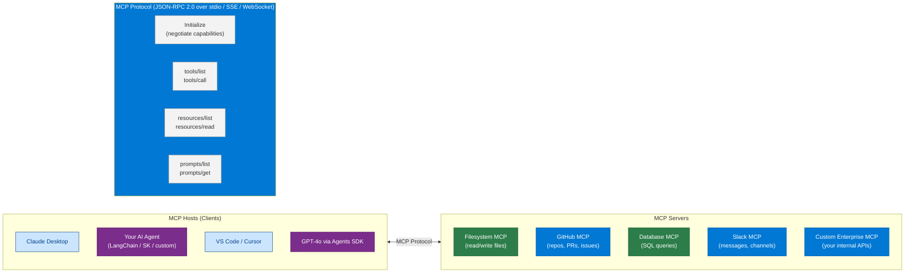
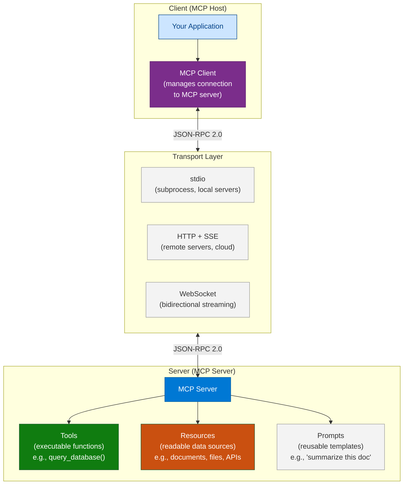
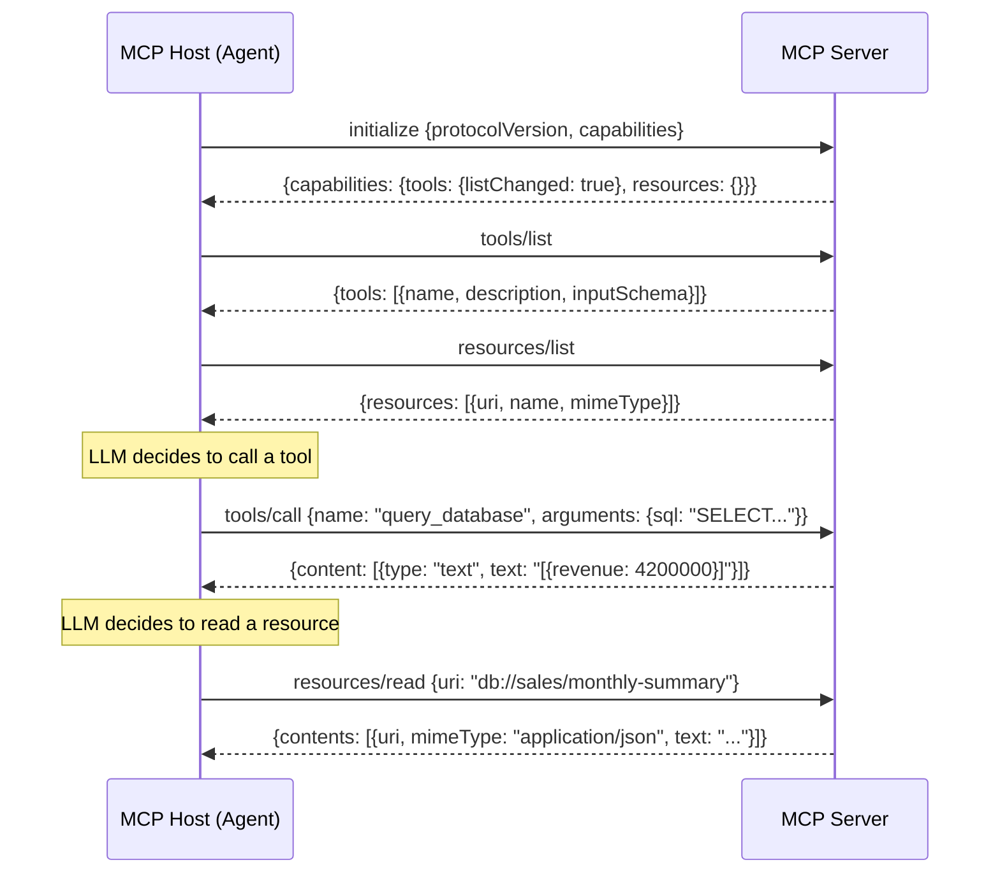
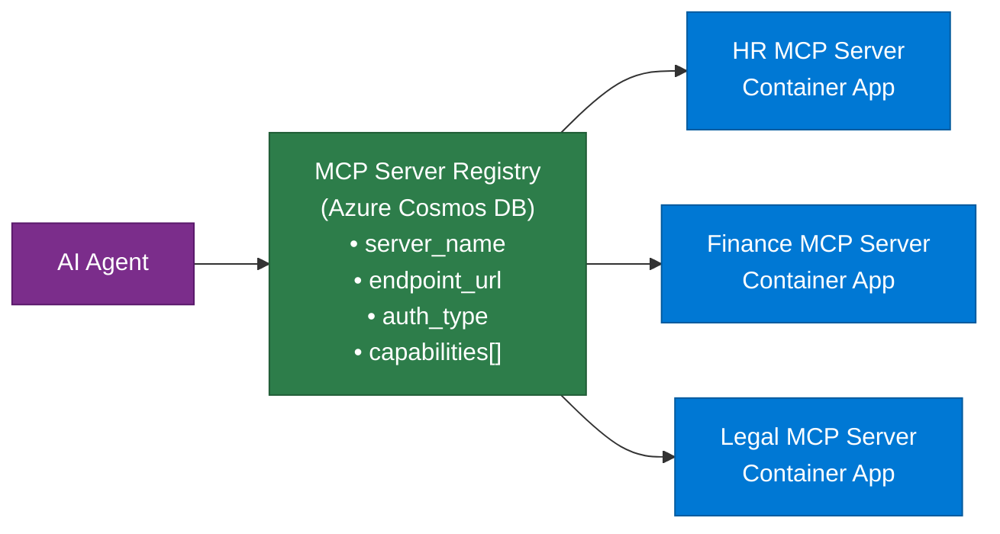
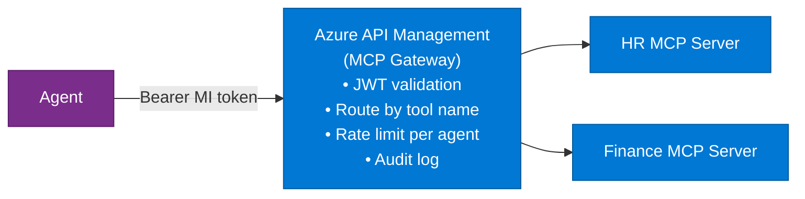

# 13 — Model Context Protocol (MCP)

> **Level:** Intermediate → Advanced | **Time to complete:** 4 hours | **Azure services:** Azure Container Apps, Azure API Management, Azure Key Vault

---

## 1. Overview

### What Is MCP?

**Model Context Protocol (MCP)** is an open standard (Anthropic, 2024) that defines how LLM-powered applications connect to external data sources and tools. It standardizes the interface between an **MCP Host** (Claude, your agent, an IDE) and **MCP Servers** (data connectors that expose resources and tools).

MCP is to AI agents what HTTP is to web browsers — a universal protocol that lets any compliant client connect to any compliant server without custom integration code.



### Why MCP Matters for Enterprise

Before MCP, every agent had custom integration code for every data source. A team building an HR agent needed custom connectors for: SAP, Workday, SharePoint, Active Directory, ServiceNow. That's 5 custom integrations, each needing auth, error handling, and maintenance.

With MCP: build one MCP Server per data source. Every agent that speaks MCP — regardless of framework — can use it immediately. Build once, use everywhere.

---

## 2. Core Concepts

### 2.1 MCP Architecture



### 2.2 MCP Primitives

| Primitive | Type | Description | Example |
|---|---|---|---|
| **Tool** | Executable | Function the LLM can call | `search_documents(query: str)` |
| **Resource** | Readable | URI-addressable data source | `file:///data/report.pdf`, `db://sales/q2` |
| **Prompt** | Template | Reusable prompt template | `"Summarize this document: {content}"` |

### 2.3 Lifecycle



---

## 3. Building an Enterprise MCP Server

### 3.1 MCP Server for Enterprise Data

```python
# enterprise_mcp_server.py
# pip install mcp[server]
import asyncio
import json
import os
from mcp.server import Server
from mcp.server.stdio import stdio_server
from mcp.types import (
    Tool, Resource, TextContent, ImageContent,
    CallToolResult, ReadResourceResult, ListResourcesResult, ListToolsResult,
)
from dotenv import load_dotenv

load_dotenv()

server = Server("enterprise-data-server")

# ── Mock data sources (replace with real DB/API calls) ───────────────
MOCK_EMPLOYEES = {
    "EMP-001": {"name": "Alice Chen", "dept": "Engineering", "manager": "Bob Lee", "salary_band": "L5"},
    "EMP-002": {"name": "Carlos Diaz", "dept": "Finance", "manager": "Sarah Kim", "salary_band": "L4"},
}

MOCK_POLICIES = {
    "annual_leave": "Employees accrue 20 days/year. Max 15 consecutive days without VP approval.",
    "remote_work": "Minimum 3 days/week in office for ICs. Managers: 4 days.",
    "expense": "Expenses under $500 self-approved. Over $500 requires manager sign-off.",
}


# ── Tools ─────────────────────────────────────────────────────────────
@server.list_tools()
async def list_tools() -> list[Tool]:
    return [
        Tool(
            name="lookup_employee",
            description="Look up employee information by employee ID. Returns name, department, manager, salary band.",
            inputSchema={
                "type": "object",
                "properties": {
                    "employee_id": {"type": "string", "description": "Employee ID in format EMP-XXX"},
                },
                "required": ["employee_id"],
            },
        ),
        Tool(
            name="query_hr_data",
            description="Query HR data with natural language. Supports: headcount by dept, manager hierarchy, department lists.",
            inputSchema={
                "type": "object",
                "properties": {
                    "query": {"type": "string", "description": "Natural language query about HR data"},
                },
                "required": ["query"],
            },
        ),
        Tool(
            name="search_policies",
            description="Search HR policies. Topics: annual_leave, remote_work, expense, benefits, performance.",
            inputSchema={
                "type": "object",
                "properties": {
                    "topic": {"type": "string", "description": "Policy topic to search"},
                },
                "required": ["topic"],
            },
        ),
    ]


@server.call_tool()
async def call_tool(name: str, arguments: dict) -> CallToolResult:
    if name == "lookup_employee":
        emp_id = arguments["employee_id"].upper()
        result = MOCK_EMPLOYEES.get(emp_id, {"error": f"Employee {emp_id} not found"})
        return CallToolResult(content=[TextContent(type="text", text=json.dumps(result, indent=2))])

    elif name == "query_hr_data":
        query = arguments["query"].lower()
        if "headcount" in query or "count" in query:
            dept_counts = {}
            for emp in MOCK_EMPLOYEES.values():
                dept = emp["dept"]
                dept_counts[dept] = dept_counts.get(dept, 0) + 1
            return CallToolResult(content=[TextContent(type="text", text=json.dumps(dept_counts))])
        return CallToolResult(content=[TextContent(type="text", text="Query not supported. Try: headcount by department")])

    elif name == "search_policies":
        topic = arguments["topic"].lower().replace(" ", "_")
        policy = MOCK_POLICIES.get(topic)
        if policy:
            return CallToolResult(content=[TextContent(type="text", text=policy)])
        available = list(MOCK_POLICIES.keys())
        return CallToolResult(content=[TextContent(type="text", text=f"Policy not found. Available: {available}")])

    return CallToolResult(content=[TextContent(type="text", text=f"Unknown tool: {name}")])


# ── Resources ─────────────────────────────────────────────────────────
@server.list_resources()
async def list_resources() -> ListResourcesResult:
    return ListResourcesResult(resources=[
        Resource(
            uri="hr://employees/directory",
            name="Employee Directory",
            description="Complete employee directory",
            mimeType="application/json",
        ),
        Resource(
            uri="hr://policies/handbook",
            name="HR Policy Handbook",
            description="All HR policies in one document",
            mimeType="text/plain",
        ),
    ])


@server.read_resource()
async def read_resource(uri: str) -> ReadResourceResult:
    from mcp.types import ResourceContents, TextResourceContents

    if uri == "hr://employees/directory":
        content = json.dumps(MOCK_EMPLOYEES, indent=2)
        return ReadResourceResult(
            contents=[TextResourceContents(uri=uri, mimeType="application/json", text=content)]
        )

    elif uri == "hr://policies/handbook":
        handbook = "\n\n".join([f"## {k.title()}\n{v}" for k, v in MOCK_POLICIES.items()])
        return ReadResourceResult(
            contents=[TextResourceContents(uri=uri, mimeType="text/plain", text=handbook)]
        )

    raise ValueError(f"Resource not found: {uri}")


# ── Start server ──────────────────────────────────────────────────────
async def main():
    async with stdio_server() as streams:
        await server.run(*streams, server.create_initialization_options())


if __name__ == "__main__":
    asyncio.run(main())
```

### 3.2 Connecting an Agent to MCP Server

```python
# mcp_agent.py — LangChain agent using MCP tools
import asyncio
import os
from mcp import ClientSession, StdioServerParameters
from mcp.client.stdio import stdio_client
from langchain_openai import AzureChatOpenAI
from langchain.agents import create_tool_calling_agent, AgentExecutor
from langchain_core.prompts import ChatPromptTemplate
from langchain_core.tools import StructuredTool
from pydantic import BaseModel, Field

llm = AzureChatOpenAI(
    azure_deployment=os.environ["AZURE_OPENAI_DEPLOYMENT_NAME"],
    azure_endpoint=os.environ["AZURE_OPENAI_ENDPOINT"],
    api_key=os.environ["AZURE_OPENAI_API_KEY"],
    api_version="2024-10-21",
    temperature=0,
)


async def load_mcp_tools(server_script: str) -> list:
    """Connect to an MCP server and load all tools as LangChain tools."""
    server_params = StdioServerParameters(
        command="python",
        args=[server_script],
    )

    mcp_tools = []

    async with stdio_client(server_params) as (read, write):
        async with ClientSession(read, write) as session:
            await session.initialize()
            tools_response = await session.list_tools()

            for mcp_tool in tools_response.tools:
                # Create a closure to capture each tool
                tool_name = mcp_tool.name
                tool_desc = mcp_tool.description
                tool_schema = mcp_tool.inputSchema

                async def call_mcp_tool(session=session, name=tool_name, **kwargs):
                    result = await session.call_tool(name, arguments=kwargs)
                    return result.content[0].text if result.content else ""

                # Convert MCP tool to LangChain StructuredTool
                lc_tool = StructuredTool.from_function(
                    coroutine=call_mcp_tool,
                    name=tool_name,
                    description=tool_desc,
                )
                mcp_tools.append(lc_tool)

    return mcp_tools


async def run_hr_agent():
    print("Loading MCP tools...")
    # In production, keep the MCP session open for the agent's lifetime
    # This simplified version loads tools once

    # For demo — use mock tools that match MCP tool signatures
    from langchain_core.tools import tool

    @tool
    def lookup_employee(employee_id: str) -> str:
        """Look up employee information by employee ID."""
        data = {"EMP-001": {"name": "Alice Chen", "dept": "Engineering"}}
        return str(data.get(employee_id.upper(), "Not found"))

    @tool
    def search_policies(topic: str) -> str:
        """Search HR policies. Topics: annual_leave, remote_work, expense."""
        policies = {"annual_leave": "20 days/year, max 15 consecutive."}
        return policies.get(topic.lower().replace(" ", "_"), "Policy not found.")

    tools = [lookup_employee, search_policies]

    prompt = ChatPromptTemplate.from_messages([
        ("system", "You are an HR assistant. Use tools to answer employee questions."),
        ("human", "{input}"),
        ("placeholder", "{agent_scratchpad}"),
    ])

    agent = create_tool_calling_agent(llm, tools, prompt)
    executor = AgentExecutor(agent=agent, tools=tools, verbose=True)

    result = await executor.ainvoke({"input": "What is the annual leave policy and how many days does EMP-001 have?"})
    print(f"\nAnswer: {result['output']}")


if __name__ == "__main__":
    from dotenv import load_dotenv
    load_dotenv()
    asyncio.run(run_hr_agent())
```

### 3.3 MCP Server as Azure Container App (HTTP + SSE Transport)

```python
# mcp_http_server.py — MCP server over HTTP+SSE for remote deployment
from mcp.server.fastmcp import FastMCP

mcp = FastMCP("enterprise-data-server")

@mcp.tool()
async def lookup_employee(employee_id: str) -> str:
    """Look up employee information by employee ID."""
    # Real implementation: query Azure SQL or Cosmos DB
    return f'{{"id": "{employee_id}", "name": "Alice Chen", "dept": "Engineering"}}'

@mcp.resource("hr://policies/{topic}")
async def get_policy(topic: str) -> str:
    """Get an HR policy by topic."""
    policies = {"annual_leave": "20 days per year..."}
    return policies.get(topic, f"Policy '{topic}' not found")

# Dockerfile:
# FROM python:3.11-slim
# RUN pip install mcp[server] fastapi uvicorn
# COPY mcp_http_server.py .
# CMD ["python", "-m", "mcp.server.fastmcp", "mcp_http_server:mcp", "--transport", "sse", "--port", "8080"]
```

---

## 4. Enterprise MCP Patterns

### Pattern: MCP Server Registry

In large enterprises, maintain a registry of available MCP servers so agents can discover capabilities:



### Pattern: Authenticated MCP Gateway



---

## 5. Production Checklist

- [ ] MCP servers deployed as Container Apps (auto-scale, managed identity)
- [ ] Authentication: Bearer token from Managed Identity validated at MCP gateway
- [ ] Tool descriptions precise and distinct (LLM uses descriptions to select tools)
- [ ] Input schemas use `required` array and `description` for every property
- [ ] Error responses follow MCP spec: `isError: true` in CallToolResult
- [ ] Resource URIs are stable (don't change on redeploy)
- [ ] MCP server version pinned; test against new versions before upgrading

---

## 6. Interview Q&A

### Q1 (Beginner): What is MCP and why was it created?

**Answer:** The Model Context Protocol is an open standard by Anthropic that defines how AI applications connect to external tools and data sources. It was created because every AI application team was writing custom, proprietary integration code for every data source — SharePoint connector, GitHub connector, database connector — and none of this code was reusable across frameworks or applications. MCP standardizes the interface: build one MCP server for your data source, and any MCP-compatible agent (Claude, your LangChain agent, Cursor IDE, any future tool) can use it without custom code. It's the universal adapter for AI.

### Q2 (Intermediate): Explain the three MCP primitives — Tools, Resources, and Prompts — and when to use each.

**Answer:** **Tools** are executable functions the LLM can invoke to take an action or retrieve data dynamically. Use Tools when the query requires arguments decided at runtime (e.g., `query_database(sql=?)` — the LLM generates the SQL). Tools run code on the server. **Resources** are URI-addressable data sources that can be read by the host. Use Resources when the data is a fixed, addressable document or dataset that can be listed and fetched (e.g., `hr://policies/handbook` — the full policy document). Resources are consumed by the host and injected into context, not invoked by the LLM directly. **Prompts** are reusable prompt templates served by the MCP server, allowing centralized management of prompt engineering across all agents. Use Prompts when you want a team to share and version prompt templates centrally rather than hardcoding them in each agent.

### Q3 (Advanced): How would you design an enterprise MCP gateway that serves 20 different internal MCP servers to 50 agent applications securely?

**Answer:** Architecture: (1) **MCP Server Registry** — each MCP server registers its capabilities (tool names, resource URIs) to a Cosmos DB registry; (2) **MCP Gateway** — Azure API Management acts as a single entry point; agents connect to the gateway, not individual servers; (3) **Routing** — the gateway routes `tools/call` requests to the correct backend server based on tool name prefix (e.g., `hr.*` → HR MCP server, `finance.*` → Finance MCP server); (4) **Auth** — agents authenticate to the gateway with Managed Identity tokens; gateway validates and rewrites the token to a service-specific identity before forwarding; (5) **Authorization** — each MCP server checks the caller's role; HR tools require `hr.read` or `hr.write` scope in the token claims; (6) **Audit** — gateway logs every tool call and resource read: agent identity, tool name, input schema hash (not content), latency; (7) **Rate limiting** — per-agent rate limits at the gateway (50K tool calls/hour per agent max); (8) **Caching** — APIM caches resource reads with TTL=60s to reduce load on MCP servers for frequently accessed static data.

---

## Cross-links

- Previous: [12 — Agent-to-Agent Communication](./12-Agent-to-Agent-Communication.md)
- Next: [14 — RAG](./14-RAG.md)
- Related: [19 — Tool Calling](./19-Tool-Calling.md) | [33 — Security](./33-Security.md)

---

*Module 13 | Series: Enterprise Agentic AI Tutorial | Last updated: June 2026*
