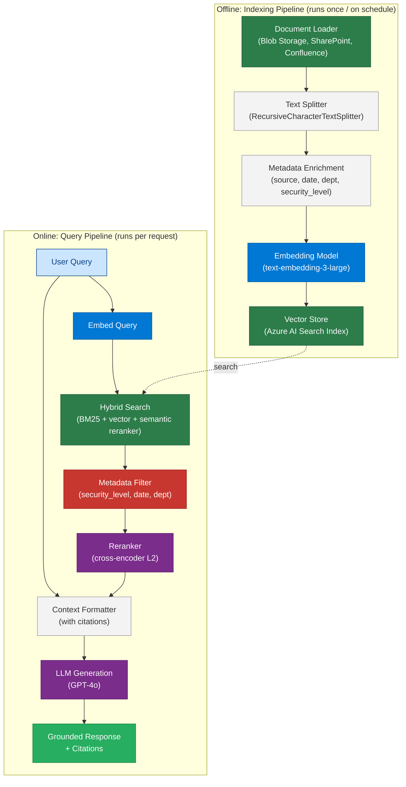
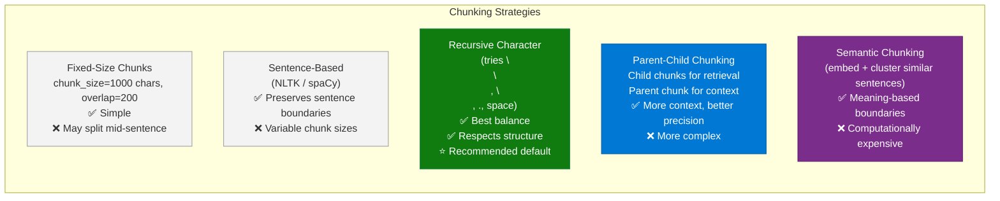
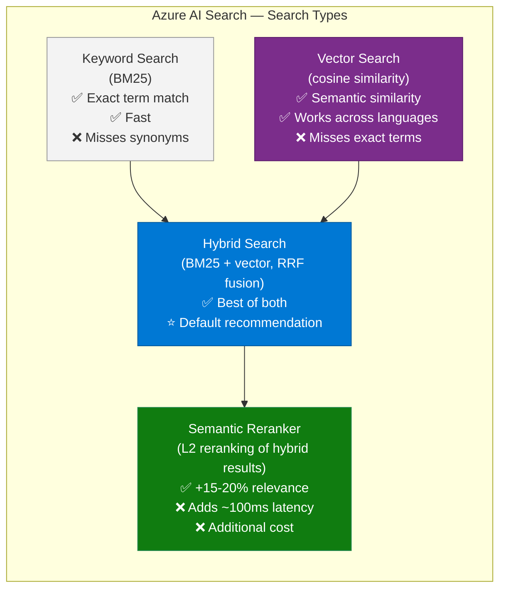
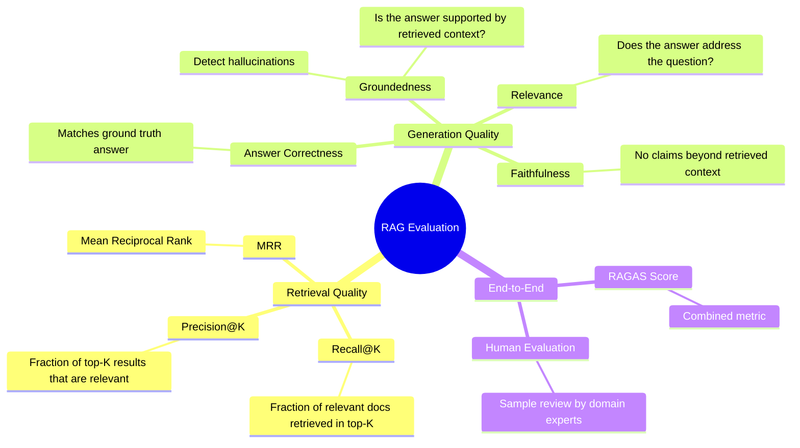

# 14 — Retrieval-Augmented Generation (RAG)

> **Level:** Intermediate → Advanced | **Time to complete:** 5–6 hours | **Azure services:** Azure AI Search, Azure OpenAI (embeddings), Azure Blob Storage, Azure Cosmos DB

---

## 1. Overview

### What Is RAG?

**Retrieval-Augmented Generation (RAG)** is an architecture pattern that enhances LLM responses by retrieving relevant information from an external knowledge base at query time and injecting it into the prompt context. Rather than relying on the model's frozen training knowledge, RAG grounds answers in up-to-date, domain-specific, or proprietary information.

```mermaid
graph LR
    Q["User Question"] --> EMBED["Embed Query\n(text-embedding-3-large)"]
    EMBED --> RETRIEVE["Retrieve\nTop-K relevant chunks\n(Azure AI Search)"]
    RETRIEVE --> CONTEXT["Format Context\n(citations + content)"]
    Q --> CONTEXT
    CONTEXT --> LLM["LLM\n(GPT-4o)"]
    LLM --> ANSWER["Grounded Answer\n+ Source Citations"]

    style EMBED fill:#0078d4,color:#ffffff
    style RETRIEVE fill:#107c10,color:#ffffff
    style LLM fill:#ca5010,color:#ffffff

    classDef primary   fill:#0078d4,color:#fff,stroke:#005a9e
    classDef secondary fill:#7b2d8b,color:#fff,stroke:#5a1a6b
    classDef storage   fill:#2d7d4a,color:#fff,stroke:#1f5c35
    classDef security  fill:#c7372f,color:#fff,stroke:#a02020
    classDef monitor   fill:#e67300,color:#fff,stroke:#b35500
    classDef success   fill:#27ae60,color:#fff,stroke:#1e8449
    classDef warning   fill:#f39c12,color:#333,stroke:#d68910
    classDef neutral   fill:#f3f3f3,color:#333,stroke:#999
    classDef user      fill:#cce5ff,color:#004085,stroke:#004085
    classDef decision  fill:#fff3cd,color:#856404,stroke:#856404
    classDef highlight fill:#e74c3c,color:#fff,stroke:#c0392b

    class Q user
    class EMBED primary
    class RETRIEVE storage
    class CONTEXT neutral
    class LLM secondary
    class ANSWER success
```



### Why RAG Beats Fine-Tuning for Most Enterprise Use Cases

| Dimension | RAG | Fine-Tuning |
|---|---|---|
| Data freshness | Real-time (update index, no retraining) | Frozen at training time |
| Cost to update | Re-index documents (minutes) | Re-train model (hours + GPU cost) |
| Transparency | Citable sources | Black box |
| Hallucination risk | Lower (grounded in retrieved text) | Higher for factual claims |
| New domain | Add documents to index | Collect 500+ labeled examples |
| Best for | Facts, policies, domain knowledge | Style, format, tone consistency |

---

## 2. Core Concepts

### 2.1 RAG Pipeline Stages



### 2.2 Chunking Strategies

Chunking is splitting documents into pieces small enough to fit in context yet large enough to contain coherent meaning.



**Enterprise recommendation:** Start with `RecursiveCharacterTextSplitter(chunk_size=1000, chunk_overlap=200)`. Evaluate with your domain data. If retrieval precision is low, try parent-child chunking.

### 2.3 Search Types



### 2.4 Evaluation Metrics



---

## 3. Deep Technical Detail

### 3.1 Embeddings Deep Dive

```python
# embedding_strategies.py
import os
import asyncio
from openai import AsyncAzureOpenAI
from dotenv import load_dotenv

load_dotenv()

client = AsyncAzureOpenAI(
    azure_endpoint=os.environ["AZURE_OPENAI_ENDPOINT"],
    api_key=os.environ["AZURE_OPENAI_API_KEY"],
    api_version="2024-10-21",
)


async def embed_with_dimensions(texts: list[str], dimensions: int = 3072) -> list[list[float]]:
    """
    text-embedding-3-large supports dimension reduction:
    - 3072 (full): best quality, largest storage
    - 1536: 94% quality, 50% storage
    - 512: 87% quality, 83% less storage — great for high-scale search
    """
    response = await client.embeddings.create(
        model="text-embedding-3-large",
        input=texts,
        dimensions=dimensions,
    )
    return [item.embedding for item in response.data]


async def embed_for_search(query: str, documents: list[str]):
    """
    Use the SAME model for query and documents.
    Mixing models gives meaningless similarity scores.
    """
    all_texts = [query] + documents
    embeddings = await embed_with_dimensions(all_texts, dimensions=1536)  # balanced
    query_emb = embeddings[0]
    doc_embs = embeddings[1:]
    return query_emb, doc_embs
```

### 3.2 Parent-Child Chunking

```python
# parent_child_chunking.py
from langchain.text_splitter import RecursiveCharacterTextSplitter
from langchain_core.documents import Document
from typing import list

def create_parent_child_chunks(
    documents: list[Document],
    parent_chunk_size: int = 2000,
    child_chunk_size: int = 400,
    child_overlap: int = 50,
) -> tuple[list[Document], list[Document]]:
    """
    Parent chunks: larger, contain full context
    Child chunks: smaller, used for retrieval (more precise matching)
    When a child is retrieved, fetch its parent for context injection.
    """
    parent_splitter = RecursiveCharacterTextSplitter(
        chunk_size=parent_chunk_size,
        chunk_overlap=200,
    )
    child_splitter = RecursiveCharacterTextSplitter(
        chunk_size=child_chunk_size,
        chunk_overlap=child_overlap,
    )

    parents = []
    children = []

    for doc in documents:
        parent_chunks = parent_splitter.split_documents([doc])

        for p_idx, parent in enumerate(parent_chunks):
            parent_id = f"{doc.metadata.get('source', 'doc')}:parent:{p_idx}"
            parent.metadata["parent_id"] = parent_id
            parent.metadata["chunk_type"] = "parent"
            parents.append(parent)

            child_chunks = child_splitter.split_documents([parent])
            for c_idx, child in enumerate(child_chunks):
                child.metadata["parent_id"] = parent_id
                child.metadata["chunk_type"] = "child"
                child.metadata["child_index"] = c_idx
                children.append(child)

    return parents, children
```

### 3.3 Hybrid Search with Azure AI Search

```python
# hybrid_rag.py — complete RAG implementation with hybrid search
import os
import asyncio
from azure.search.documents.aio import SearchClient
from azure.search.documents.models import VectorizedQuery
from azure.core.credentials import AzureKeyCredential
from openai import AsyncAzureOpenAI
from dotenv import load_dotenv

load_dotenv()

aoai_client = AsyncAzureOpenAI(
    azure_endpoint=os.environ["AZURE_OPENAI_ENDPOINT"],
    api_key=os.environ["AZURE_OPENAI_API_KEY"],
    api_version="2024-10-21",
)

search_client = SearchClient(
    endpoint=os.environ["AZURE_SEARCH_ENDPOINT"],
    index_name=os.environ["AZURE_SEARCH_INDEX_NAME"],
    credential=AzureKeyCredential(os.environ["AZURE_SEARCH_ADMIN_KEY"]),
)


async def embed_query(query: str) -> list[float]:
    response = await aoai_client.embeddings.create(
        model="text-embedding-3-large",
        input=[query],
        dimensions=1536,
    )
    return response.data[0].embedding


async def hybrid_search(
    query: str,
    k: int = 5,
    filters: str = None,
    semantic_configuration: str = "enterprise-semantic-config",
) -> list[dict]:
    """
    Hybrid search: BM25 + vector + semantic reranker.
    Returns top-k most relevant chunks with scores and metadata.
    """
    query_vector = await embed_query(query)

    vector_query = VectorizedQuery(
        vector=query_vector,
        k_nearest_neighbors=k * 2,  # Over-fetch for reranker
        fields="content_vector",
    )

    results = await search_client.search(
        search_text=query,                          # BM25
        vector_queries=[vector_query],              # Vector
        query_type="semantic",                      # Enable semantic reranker
        semantic_configuration_name=semantic_configuration,
        top=k,
        filter=filters,
        select=["id", "content", "source", "page", "section", "security_level", "date"],
        query_caption="extractive",                 # Extract relevant passage
        query_answer="extractive",                  # Extract direct answer if available
    )

    chunks = []
    async for result in results:
        chunks.append({
            "id": result.get("id"),
            "content": result.get("content"),
            "source": result.get("source"),
            "page": result.get("page"),
            "section": result.get("section"),
            "score": result.get("@search.reranker_score", result.get("@search.score")),
            "captions": [c.text for c in (result.get("@search.captions") or [])],
        })

    return chunks


def format_context_with_citations(chunks: list[dict]) -> tuple[str, list[str]]:
    """Format retrieved chunks into LLM context with citation markers."""
    context_parts = []
    citations = []

    for i, chunk in enumerate(chunks):
        citation_id = f"[{i+1}]"
        source = chunk.get("source", "Unknown")
        page = chunk.get("page")
        citation = f"{source}" + (f", p.{page}" if page else "")
        citations.append(f"{citation_id} {citation}")

        context_parts.append(
            f"{citation_id} Source: {citation}\n{chunk['content']}"
        )

    return "\n\n---\n\n".join(context_parts), citations


async def rag_query(
    question: str,
    department_filter: str = None,
    security_level: str = "internal",
) -> dict:
    """
    Full RAG pipeline: retrieve → format → generate → return with citations.
    """
    # Build filter expression
    filters = f"security_level eq '{security_level}'"
    if department_filter:
        filters += f" and department eq '{department_filter}'"

    # Retrieve
    chunks = await hybrid_search(question, k=5, filters=filters)
    if not chunks:
        return {
            "answer": "No relevant information found in the knowledge base for your question.",
            "sources": [],
            "chunks_retrieved": 0,
        }

    # Format context
    context, citations = format_context_with_citations(chunks)

    # Generate
    response = await aoai_client.chat.completions.create(
        model=os.environ["AZURE_OPENAI_DEPLOYMENT_NAME"],
        messages=[
            {
                "role": "system",
                "content": """You are an enterprise knowledge assistant.
Answer questions using ONLY the provided context.
Rules:
- Cite sources using the bracket notation [1], [2], etc.
- If the answer is not in context, say "This information is not available in our knowledge base."
- Be factual and concise
- Never invent facts or combine information from different sources without noting it""",
            },
            {
                "role": "user",
                "content": f"Context:\n{context}\n\nQuestion: {question}",
            },
        ],
        temperature=0.1,
        max_tokens=1500,
    )

    return {
        "answer": response.choices[0].message.content,
        "sources": citations,
        "chunks_retrieved": len(chunks),
        "tokens_used": response.usage.total_tokens,
    }


async def main():
    result = await rag_query(
        "What is the remote work policy for engineering managers?",
        department_filter="HR",
        security_level="internal",
    )
    print(f"Answer: {result['answer']}\n")
    print(f"Sources: {', '.join(result['sources'])}")
    print(f"Chunks: {result['chunks_retrieved']} | Tokens: {result['tokens_used']}")


if __name__ == "__main__":
    asyncio.run(main())
```

### 3.4 Indexing Pipeline

```python
# indexing_pipeline.py — ingest documents into Azure AI Search
import asyncio
import os
import hashlib
import json
from datetime import datetime
from azure.search.documents.aio import SearchClient
from azure.search.documents.indexes.aio import SearchIndexClient
from azure.search.documents.indexes.models import (
    SearchIndex, SearchField, SearchFieldDataType, VectorSearch,
    HnswAlgorithmConfiguration, VectorSearchProfile,
    SemanticConfiguration, SemanticSearch, SemanticPrioritizedFields,
    SemanticField,
)
from azure.core.credentials import AzureKeyCredential
from openai import AsyncAzureOpenAI
from langchain.text_splitter import RecursiveCharacterTextSplitter
from dotenv import load_dotenv

load_dotenv()

EMBED_DIMENSIONS = 1536


async def create_search_index(index_name: str):
    """Create Azure AI Search index with vector + semantic search support."""
    client = SearchIndexClient(
        endpoint=os.environ["AZURE_SEARCH_ENDPOINT"],
        credential=AzureKeyCredential(os.environ["AZURE_SEARCH_ADMIN_KEY"]),
    )

    fields = [
        SearchField(name="id", type=SearchFieldDataType.String, key=True, filterable=True),
        SearchField(name="content", type=SearchFieldDataType.String, searchable=True),
        SearchField(name="source", type=SearchFieldDataType.String, filterable=True, facetable=True),
        SearchField(name="page", type=SearchFieldDataType.Int32, filterable=True),
        SearchField(name="section", type=SearchFieldDataType.String, filterable=True),
        SearchField(name="department", type=SearchFieldDataType.String, filterable=True, facetable=True),
        SearchField(name="security_level", type=SearchFieldDataType.String, filterable=True),
        SearchField(name="date", type=SearchFieldDataType.DateTimeOffset, filterable=True, sortable=True),
        SearchField(name="content_hash", type=SearchFieldDataType.String, filterable=True),
        SearchField(
            name="content_vector",
            type=SearchFieldDataType.Collection(SearchFieldDataType.Single),
            searchable=True,
            vector_search_dimensions=EMBED_DIMENSIONS,
            vector_search_profile_name="hnsw-profile",
        ),
    ]

    vector_search = VectorSearch(
        algorithms=[HnswAlgorithmConfiguration(name="hnsw-algo", parameters={"m": 4, "efConstruction": 400})],
        profiles=[VectorSearchProfile(name="hnsw-profile", algorithm_configuration_name="hnsw-algo")],
    )

    semantic_search = SemanticSearch(
        configurations=[
            SemanticConfiguration(
                name="enterprise-semantic-config",
                prioritized_fields=SemanticPrioritizedFields(
                    content_fields=[SemanticField(field_name="content")],
                    title_field=SemanticField(field_name="source"),
                    keywords_fields=[SemanticField(field_name="section")],
                ),
            )
        ]
    )

    index = SearchIndex(
        name=index_name,
        fields=fields,
        vector_search=vector_search,
        semantic_search=semantic_search,
    )

    await client.create_or_update_index(index)
    print(f"Index '{index_name}' created/updated.")


async def ingest_documents(
    documents: list[dict],  # [{"text": str, "source": str, "metadata": dict}]
    index_name: str,
    batch_size: int = 50,
):
    """Chunk, embed, and index documents into Azure AI Search."""
    aoai = AsyncAzureOpenAI(
        azure_endpoint=os.environ["AZURE_OPENAI_ENDPOINT"],
        api_key=os.environ["AZURE_OPENAI_API_KEY"],
        api_version="2024-10-21",
    )
    search = SearchClient(
        endpoint=os.environ["AZURE_SEARCH_ENDPOINT"],
        index_name=index_name,
        credential=AzureKeyCredential(os.environ["AZURE_SEARCH_ADMIN_KEY"]),
    )

    splitter = RecursiveCharacterTextSplitter(
        chunk_size=1000,
        chunk_overlap=200,
        separators=["\n\n", "\n", ". ", " "],
    )

    all_docs_to_index = []

    for doc in documents:
        chunks = splitter.split_text(doc["text"])
        for i, chunk in enumerate(chunks):
            chunk_id = hashlib.md5(f"{doc['source']}::{i}::{chunk[:50]}".encode()).hexdigest()
            all_docs_to_index.append({
                "id": chunk_id,
                "content": chunk,
                "source": doc["source"],
                "page": doc["metadata"].get("page", 0),
                "section": doc["metadata"].get("section", ""),
                "department": doc["metadata"].get("department", "general"),
                "security_level": doc["metadata"].get("security_level", "internal"),
                "date": doc["metadata"].get("date", datetime.utcnow().isoformat()),
                "content_hash": hashlib.md5(chunk.encode()).hexdigest(),
                "_text_for_embedding": chunk,  # temp field
            })

    # Batch embed and index
    for i in range(0, len(all_docs_to_index), batch_size):
        batch = all_docs_to_index[i:i + batch_size]
        texts = [d["_text_for_embedding"] for d in batch]

        embed_response = await aoai.embeddings.create(
            model="text-embedding-3-large",
            input=texts,
            dimensions=EMBED_DIMENSIONS,
        )

        for doc, emb_item in zip(batch, embed_response.data):
            doc["content_vector"] = emb_item.embedding
            del doc["_text_for_embedding"]

        await search.upload_documents(documents=batch)
        print(f"Indexed batch {i//batch_size + 1}: {len(batch)} chunks")

    print(f"Total: {len(all_docs_to_index)} chunks indexed")
```

---

## 4. RAG Quality Evaluation

```python
# rag_evaluator.py — evaluate RAG pipeline quality
import asyncio
from openai import AsyncAzureOpenAI

aoai = AsyncAzureOpenAI(...)

async def evaluate_groundedness(question: str, context: str, answer: str) -> dict:
    """Check if the answer is supported by the retrieved context."""
    prompt = f"""Evaluate if the answer is grounded in the provided context.
Score from 1-5: 1=completely ungrounded/hallucinated, 5=fully supported by context.
Return JSON: {{"score": int, "reason": str, "ungrounded_claims": [str]}}

Context: {context}
Question: {question}
Answer: {answer}"""

    response = await aoai.chat.completions.create(
        model="gpt-4o",
        messages=[{"role": "user", "content": prompt}],
        response_format={"type": "json_object"},
        temperature=0,
    )
    import json
    return json.loads(response.choices[0].message.content)


GOLDEN_DATASET = [
    {
        "question": "What is the annual leave accrual rate?",
        "ground_truth": "Employees accrue 1.67 days per month (20 days per year)",
        "relevant_docs": ["hr-policies/annual-leave.pdf"],
    },
]

async def run_evaluation(rag_fn, dataset: list[dict]) -> dict:
    """Run full RAG evaluation on a dataset."""
    results = []
    for item in dataset:
        rag_result = await rag_fn(item["question"])
        groundedness = await evaluate_groundedness(
            item["question"],
            "\n".join(s for s in rag_result.get("sources", [])),
            rag_result["answer"],
        )
        results.append({
            "question": item["question"],
            "groundedness_score": groundedness["score"],
            "tokens": rag_result.get("tokens_used", 0),
        })

    avg_groundedness = sum(r["groundedness_score"] for r in results) / len(results)
    return {"average_groundedness": avg_groundedness, "results": results}
```

---

## 5. Production Checklist

### Indexing
- [ ] Chunk size validated for domain (1000 for prose, 500 for technical docs)
- [ ] Metadata fields indexed: source, date, department, security_level
- [ ] Deduplication: check `content_hash` before re-indexing unchanged documents
- [ ] Indexing pipeline scheduled (nightly for document stores that change frequently)
- [ ] Embedding model pinned (`text-embedding-3-large` v1) — don't change without re-indexing

### Retrieval
- [ ] Hybrid search enabled (BM25 + vector) — not vector-only
- [ ] Semantic reranker enabled for precision-critical queries
- [ ] Security trimming filter applied to every search (`security_level` match user's clearance)
- [ ] Retrieval quality evaluated monthly with RAGAS or Azure AI Foundry evaluation

### Generation
- [ ] RAG prompt instructs model to cite sources and not go beyond context
- [ ] Groundedness evaluation run in CI before deployment
- [ ] Context length managed: if top-5 chunks exceed 30K tokens, reduce to top-3
- [ ] Streaming enabled for user-facing responses

---

## 6. Interview Q&A

### Q1 (Beginner): What is RAG and why is it preferred over fine-tuning for enterprise knowledge bases?

**Answer:** RAG (Retrieval-Augmented Generation) retrieves relevant documents from a knowledge base at query time and injects them into the LLM's context before generating an answer. Fine-tuning bakes knowledge into the model weights during training. RAG is preferred for enterprise knowledge because: (1) **Freshness** — update the index and answers immediately reflect new policies/data; with fine-tuning, you'd retrain the model; (2) **Transparency** — answers can cite exact source documents (page number, paragraph); (3) **Cost** — adding new documents is re-indexing (minutes, $cents); fine-tuning costs hours of GPU compute; (4) **Access control** — you can filter retrieval by user permissions; the LLM only sees what the user is authorized to see; (5) **Hallucination reduction** — the LLM is constrained to speak about what's in the retrieved context, reducing invented facts.

### Q2 (Intermediate): Explain the difference between vector search, BM25, and hybrid search. Which should you use in production?

**Answer:** BM25 is a keyword matching algorithm that scores documents by term frequency and inverse document frequency — great at exact term matches but misses synonyms, paraphrases, and cross-language queries. Vector search embeds both the query and documents into a high-dimensional space and finds nearest neighbors by cosine similarity — captures semantic meaning but can miss exact terms (a query for "SOX compliance" might not match a document that says "Sarbanes-Oxley Act" depending on training). Hybrid search combines both scores using Reciprocal Rank Fusion (RRF) — documents that score well in both BM25 and vector get boosted. In production, hybrid search consistently outperforms either alone by 15–25% on enterprise benchmarks. Adding the semantic reranker on top of hybrid results provides another 10–15% quality improvement at the cost of ~100ms additional latency. **Default recommendation: hybrid + semantic reranker for precision-critical queries.**

### Q3 (Advanced): What is the "lost in the middle" problem in RAG and how do you mitigate it?

**Answer:** Research shows LLMs recall information from the beginning and end of long context windows much better than from the middle. In a RAG context with 5 retrieved chunks (each 1000 chars), the most relevant chunk may end up in position 3 (the middle) where recall is weakest. Mitigations: (1) **Reranking** — use a cross-encoder reranker to identify the single most relevant chunk; place it first in the context; (2) **Reduce chunk count** — use k=3 instead of k=5 for shorter, more focused context; quality often improves; (3) **Query-specific ordering** — sort chunks by relevance score descending; most relevant chunk first; (4) **Long-context models** — GPT-4o and Claude 3.5 show better recall at position than earlier models, but the problem persists; (5) **Position testing** — run ablation studies placing your most relevant chunk at positions 1, 3, and 5; measure downstream answer quality.

### Q4 (Architecture): Design a RAG system for a 10,000-document legal knowledge base with document-level access control (some users can see confidential documents, others can't).

**Answer:** Architecture: (1) **Index schema** — add `security_level: public|internal|confidential` and `authorized_groups: string[]` to each document's metadata in Azure AI Search; make both fields filterable; (2) **Indexing** — when ingesting a document, classify its security level (manual label or LLM classifier) and set authorized_groups from the document's access control list in SharePoint/Active Directory; (3) **Query-time security trimming** — when a user queries, first resolve their group memberships from Azure AD (`GET /me/memberOf`); construct a filter expression: `security_level eq 'public' or authorized_groups/any(g: g eq 'legal-team') or authorized_groups/any(g: g eq 'executives')`; (4) **Cache user groups** — Azure AD calls add ~50ms; cache group memberships in Redis with 5-minute TTL; (5) **Audit log** — every search logs user ID, applied filter, document IDs returned, and timestamp for legal hold compliance; (6) **Deny-by-default** — if group resolution fails, apply the most restrictive filter (`security_level eq 'public'` only) rather than failing open.

---

## Cross-links

- Previous: [13 — MCP Protocol](./13-MCP-Protocol.md)
- Next: [15 — Enterprise RAG](./15-Enterprise-RAG.md)
- Related: [16 — GraphRAG](./16-GraphRAG.md) | [17 — Vector Databases](./17-Vector-Databases.md) | [18 — Prompt Engineering](./18-Prompt-Engineering.md)

---

*Module 14 | Series: Enterprise Agentic AI Tutorial | Last updated: June 2026*
