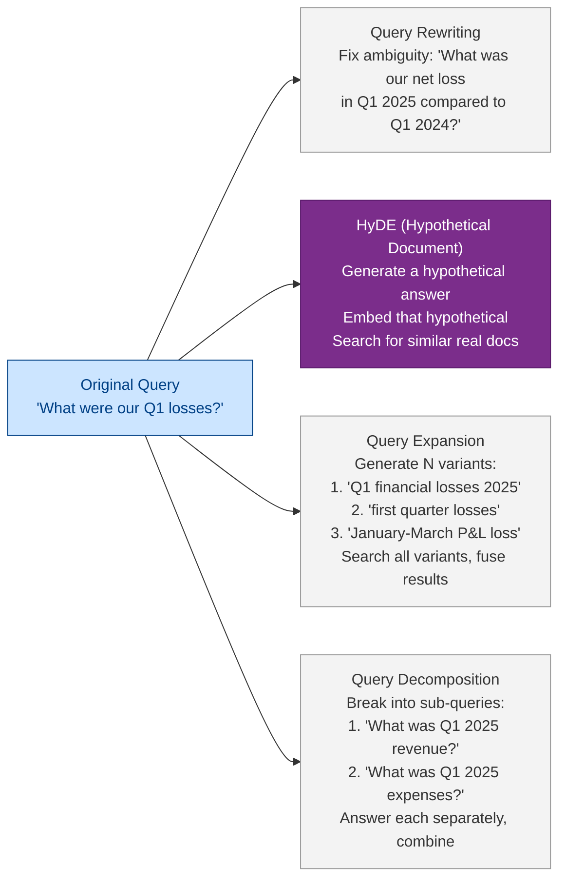
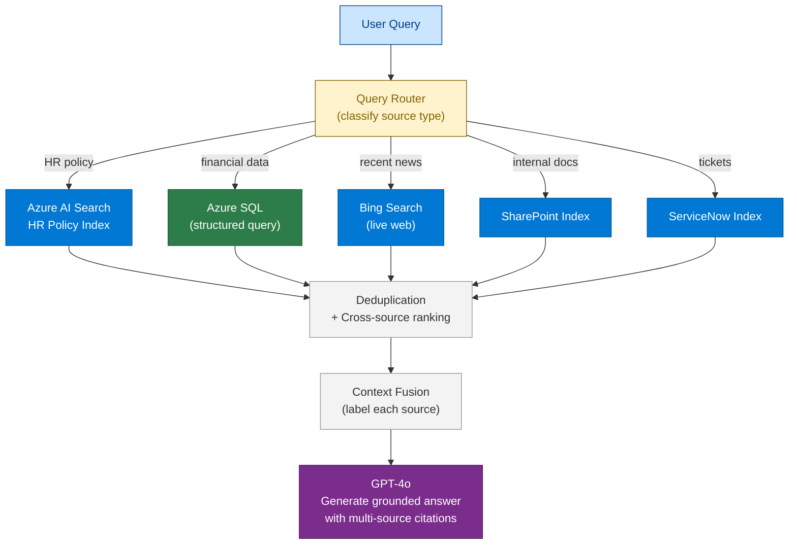
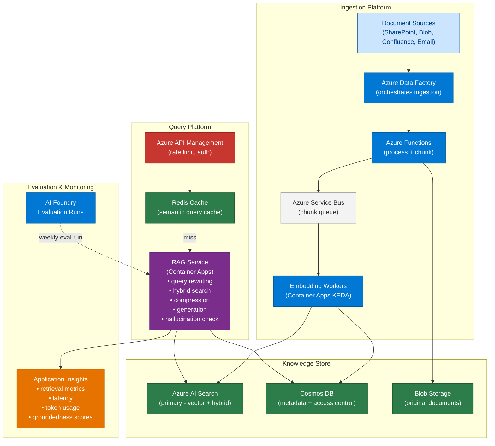

# 15 — Enterprise RAG

> **Level:** Advanced | **Time to complete:** 5 hours | **Azure services:** Azure AI Search, Azure OpenAI, Azure Cosmos DB, Azure AI Foundry, Azure Functions

---

## 1. Overview

Enterprise RAG extends basic RAG with the complexity of production deployments: multi-source ingestion, access control, evaluation pipelines, caching, observability, and multi-modal support. Where Module 14 teaches the fundamentals, this module covers what it takes to operate RAG reliably at enterprise scale.

---

## 2. Advanced RAG Architectures

### 2.1 Naive RAG vs. Advanced RAG vs. Modular RAG

```mermaid
graph TB
    subgraph Naive["Naive RAG"]
        direction LR
        Q1["Query"] --> VEC1["Embed"] --> SRCH1["Search k=5"] --> LLM1["Generate"]
    end

    subgraph Advanced["Advanced RAG"]
        direction LR
        Q2["Query"] --> QR["Query Rewriting\n(expand synonyms, fix typos)"]
        QR --> HYB["Hybrid Search"]
        HYB --> RERANK["Semantic Reranker"]
        RERANK --> COMPRESS["Context Compression\n(remove irrelevant sentences)"]
        COMPRESS --> LLM2["Generate + Citations"]
        LLM2 --> VALID["Groundedness Check\n(hallucination detection)"]
    end

    subgraph Modular["Modular RAG"]
        direction LR
        Q3["Query"] --> ROUTE["Router\n(query type classification)"]
        ROUTE -->|"factual"| SEARCH_M["Search Module"]
        ROUTE -->|"aggregation"| SQL_M["SQL Module"]
        ROUTE -->|"calculation"| CALC_M["Calculator Module"]
        ROUTE -->|"no search needed"| DIRECT["Direct LLM"]
        SEARCH_M & SQL_M & CALC_M & DIRECT --> FUSION["Response Fusion"]
        FUSION --> LLM3["Generate"]
    end

    classDef primary   fill:#0078d4,color:#fff,stroke:#005a9e
    classDef secondary fill:#7b2d8b,color:#fff,stroke:#5a1a6b
    classDef storage   fill:#2d7d4a,color:#fff,stroke:#1f5c35
    classDef security  fill:#c7372f,color:#fff,stroke:#a02020
    classDef monitor   fill:#e67300,color:#fff,stroke:#b35500
    classDef success   fill:#27ae60,color:#fff,stroke:#1e8449
    classDef warning   fill:#f39c12,color:#333,stroke:#d68910
    classDef neutral   fill:#f3f3f3,color:#333,stroke:#999
    classDef user      fill:#cce5ff,color:#004085,stroke:#004085
    classDef decision  fill:#fff3cd,color:#856404,stroke:#856404
    classDef highlight fill:#e74c3c,color:#fff,stroke:#c0392b

    class Q1,Q2,Q3 user
    class VEC1,EMBED2 primary
    class SRCH1,HYB secondary
    class RERANK,COMPRESS,FUSION neutral
    class LLM1,LLM2,LLM3 secondary
    class QR,VALID monitor
    class ROUTE decision
    class SEARCH_M,SQL_M,CALC_M,DIRECT primary
```



### 2.2 Query Transformation Techniques



### 2.3 Multi-Source RAG



---

## 3. Deep Technical Detail

### 3.1 Context Compression

After retrieval, raw chunks contain noise — headers, footers, tangential sentences. Context compression removes this before sending to the LLM:

```python
# context_compression.py
import asyncio
from langchain.retrievers import ContextualCompressionRetriever
from langchain.retrievers.document_compressors import LLMChainExtractor, EmbeddingsFilter
from langchain_openai import AzureChatOpenAI, AzureOpenAIEmbeddings

llm = AzureChatOpenAI(...)
embeddings = AzureOpenAIEmbeddings(...)

# Option 1: LLM-based extraction (extracts only relevant sentences)
compressor = LLMChainExtractor.from_llm(llm)

# Option 2: Embeddings-based filter (faster, cheaper, less accurate)
# embeddings_filter = EmbeddingsFilter(embeddings=embeddings, similarity_threshold=0.76)

compression_retriever = ContextualCompressionRetriever(
    base_compressor=compressor,
    base_retriever=base_retriever,
)

# Now chunks are compressed to only the relevant portions
compressed_docs = await compression_retriever.ainvoke("What is the annual leave policy?")
```

### 3.2 Query Rewriting with Step-Back Prompting

```python
# query_rewriting.py
import asyncio
from langchain_openai import AzureChatOpenAI
from langchain_core.prompts import ChatPromptTemplate

llm = AzureChatOpenAI(...)

REWRITE_PROMPT = ChatPromptTemplate.from_messages([
    ("system", """You are a query optimization expert. Rewrite the user's question to maximize retrieval quality.
Generate 3 alternative phrasings that might match how the information is written in documents.
Return JSON: {{"original": str, "rewrites": [str, str, str]}}"""),
    ("human", "Query: {query}"),
])

STEPBACK_PROMPT = ChatPromptTemplate.from_messages([
    ("system", "Generate a more general, higher-level question that would contain the answer to the specific question. This helps retrieve broader context."),
    ("human", "Specific: {query}\nGeneral:"),
])

async def multi_query_retrieve(query: str, retriever) -> list:
    """Retrieve using multiple query variants and fuse results."""
    # Generate rewrites
    rewrite_chain = REWRITE_PROMPT | llm
    rewrites_response = await rewrite_chain.ainvoke({"query": query})
    import json
    rewrites = json.loads(rewrites_response.content)

    # Generate step-back query
    stepback_chain = STEPBACK_PROMPT | llm
    stepback = await stepback_chain.ainvoke({"query": query})

    all_queries = [query] + rewrites.get("rewrites", []) + [stepback.content]

    # Retrieve for all queries
    all_docs = []
    seen_ids = set()
    for q in all_queries:
        docs = await retriever.ainvoke(q)
        for doc in docs:
            doc_id = doc.metadata.get("id", doc.page_content[:50])
            if doc_id not in seen_ids:
                seen_ids.add(doc_id)
                all_docs.append(doc)

    # Sort by relevance (if scores are available) and return top-k
    return all_docs[:8]
```

### 3.3 Caching for Enterprise Scale

```python
# rag_cache.py — semantic caching to reduce redundant LLM calls
import hashlib
import json
import asyncio
from redis.asyncio import Redis
from openai import AsyncAzureOpenAI

redis = Redis.from_url(os.environ["REDIS_URL"])
aoai = AsyncAzureOpenAI(...)


async def get_cache_key(query: str, filters: dict) -> str:
    """Generate a semantic cache key based on query embedding."""
    embed_response = await aoai.embeddings.create(
        model="text-embedding-3-large",
        input=[query],
        dimensions=256,  # Smaller dims for cache key comparison
    )
    embedding = embed_response.data[0].embedding
    # Quantize to reduce false positive misses
    quantized = [round(v, 3) for v in embedding]
    key_data = json.dumps({"embedding": quantized, "filters": filters})
    return hashlib.sha256(key_data.encode()).hexdigest()


async def cached_rag_query(question: str, rag_fn, ttl: int = 3600) -> dict:
    """RAG with semantic caching. Cache hit rate typically 30-40% for enterprise Q&A."""
    cache_key = f"rag:{await get_cache_key(question, {})}"

    # Check cache
    cached = await redis.get(cache_key)
    if cached:
        result = json.loads(cached)
        result["cache_hit"] = True
        return result

    # Miss — call actual RAG
    result = await rag_fn(question)
    result["cache_hit"] = False

    # Store in cache
    await redis.setex(cache_key, ttl, json.dumps(result))

    return result
```

### 3.4 Hallucination Detection

```python
# hallucination_detector.py
import asyncio
from openai import AsyncAzureOpenAI

aoai = AsyncAzureOpenAI(...)

async def detect_hallucination(
    context: str,
    answer: str,
    threshold: float = 3.5,
) -> dict:
    """
    NLI-based hallucination detection using GPT-4o as a judge.
    Returns groundedness score and specific unsupported claims.
    """
    prompt = f"""You are a fact-checking assistant. Check if the answer is supported by the context.

For each sentence in the answer:
1. Identify if it's supported, partially supported, or unsupported by the context
2. Quote the supporting context text for supported claims

Return JSON:
{{
    "groundedness_score": 1-5,
    "is_hallucination": bool,
    "unsupported_claims": [str],
    "well_supported_claims": [str],
    "verdict": "grounded|partially_grounded|hallucinated"
}}

Context:
{context}

Answer to check:
{answer}"""

    response = await aoai.chat.completions.create(
        model="gpt-4o",
        messages=[{"role": "user", "content": prompt}],
        response_format={"type": "json_object"},
        temperature=0,
    )
    import json
    result = json.loads(response.choices[0].message.content)
    result["threshold_passed"] = result.get("groundedness_score", 0) >= threshold
    return result
```

### 3.5 Evaluation with Azure AI Foundry

```python
# rag_evaluation.py
import os
from azure.identity import DefaultAzureCredential
from azure.ai.projects import AIProjectClient
from azure.ai.projects.models import Evaluation, Dataset, EvaluatorConfiguration, ConnectionType

credential = DefaultAzureCredential()
project_client = AIProjectClient.from_connection_string(
    credential=credential,
    conn_str=os.environ["AZURE_AI_PROJECT_ENDPOINT"],
)

def run_rag_evaluation(eval_data_path: str) -> str:
    """Run RAG evaluation using Azure AI Foundry built-in evaluators."""
    default_conn = project_client.connections.get_default(
        connection_type=ConnectionType.AZURE_OPEN_AI
    )

    evaluation = Evaluation(
        display_name="Enterprise RAG Evaluation",
        data=Dataset(id=eval_data_path),
        evaluators={
            "groundedness": EvaluatorConfiguration(
                id="azureml://registries/model-evaluation/models/Groundedness-Evaluator/versions/4",
                init_params={"model_config": default_conn.to_evaluator_model_config()},
            ),
            "relevance": EvaluatorConfiguration(
                id="azureml://registries/model-evaluation/models/Relevance-Evaluator/versions/4",
                init_params={"model_config": default_conn.to_evaluator_model_config()},
            ),
        },
    )
    result = project_client.evaluations.create(evaluation)
    return result.id
```

---

## 4. Enterprise RAG Reference Architecture



---

## 5. Production Checklist

- [ ] Query rewriting enabled for short/ambiguous queries (< 5 words)
- [ ] Hybrid + semantic reranker for all queries (not vector-only)
- [ ] Security trimming filter on every search request
- [ ] Context compression for chunks > 500 tokens
- [ ] Semantic cache with Redis (target 30%+ hit rate)
- [ ] Hallucination detection on final answer before returning to user
- [ ] Groundedness evaluation run weekly via Azure AI Foundry
- [ ] Stale document detection: flag docs > 90 days old in citations

---

## 6. Interview Q&A

### Q1 (Advanced): Explain Advanced RAG and how it improves on Naive RAG.

**Answer:** Naive RAG simply embeds a query, retrieves k chunks, and passes them to the LLM. Advanced RAG adds layers at every stage: at the **pre-retrieval stage**, query rewriting expands the query (fixing typos, adding synonyms, generating variants), HyDE generates a hypothetical answer and searches for real documents similar to it. At the **retrieval stage**, hybrid search (BM25 + vector) outperforms vector-only, and the semantic reranker re-scores top results for relevance. At the **post-retrieval stage**, context compression removes noise from chunks, and deduplication across multiple query results reduces redundancy. At the **generation stage**, few-shot prompting and citation-forcing reduce hallucinations, and a groundedness check validates the final answer. Each layer adds 5–15% quality improvement; combined, Advanced RAG typically doubles the quality of Naive RAG on enterprise benchmarks.

### Q2 (Advanced): What is HyDE and when would you use it?

**Answer:** Hypothetical Document Embeddings (HyDE) is a query transformation technique: instead of embedding the user's short, keyword-like query, you use the LLM to generate a hypothetical answer document ("the answer would look like..."), embed that hypothetical document, and search for real documents with similar embeddings. This works because real documents and hypothetical answers are written in similar language — much more similar than a short user query. HyDE dramatically improves retrieval for short or vague queries where the query embedding is far from the document embedding in semantic space. Use HyDE when: queries are very short (< 5 words), in a technical domain where user terminology differs from document terminology, or when baseline retrieval quality is poor despite good documents. Trade-off: adds one LLM call per query, adding ~500ms and ~200 tokens of cost.

---

## Cross-links

- Previous: [14 — RAG](./14-RAG.md)
- Next: [16 — GraphRAG](./16-GraphRAG.md)
- Related: [17 — Vector Databases](./17-Vector-Databases.md) | [03 — Azure AI Foundry](./03-Azure-AI-Foundry.md)

---

*Module 15 | Series: Enterprise Agentic AI Tutorial | Last updated: June 2026*
