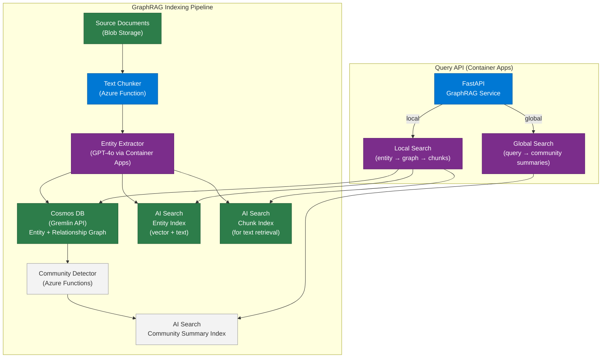

# 16 — GraphRAG

> **Level:** Advanced | **Time to complete:** 4 hours | **Azure services:** Azure AI Search, Azure OpenAI, Azure Cosmos DB (Gremlin API), Azure AI Foundry

---

## 1. Overview

GraphRAG is a retrieval-augmented generation approach that adds a **knowledge graph layer** on top of traditional vector/keyword search. Where standard RAG retrieves individual text chunks, GraphRAG traverses a graph of entities and their relationships — enabling multi-hop reasoning, relationship queries, and thematic summarization that flat chunk retrieval cannot support.

Microsoft open-sourced GraphRAG in 2024 and it has become a production pattern for enterprise knowledge management, legal document analysis, and scientific literature review.

---

## 2. Why GraphRAG?

### 2.1 Where Naive RAG Fails

```mermaid
graph TB
    subgraph Naive["Naive RAG — Cannot Answer"]
        Q1["'How is Project Apollo\nrelated to the CFO change\nin March 2023?'"]
        Q1 -->|"retrieves chunks about"| C1["Apollo chunk\n(no CFO mention)"]
        Q1 -->|"retrieves chunks about"| C2["CFO change chunk\n(no Apollo mention)"]
        C1 & C2 -->|"LLM cannot connect"| NO["Cannot answer — connection\nonly visible across documents"]
    end

    subgraph Graph["GraphRAG — Can Answer"]
        Q2["Same question"] --> ENTITY["Extract entities:\nProject Apollo, CFO, March 2023"]
        ENTITY --> TRAVERSE["Graph traversal:\nApollo → budget_cut → CFO_review → CFO_change"]
        TRAVERSE --> CONNECTED["Connected context\nacross 5 documents"]
        CONNECTED --> ANS["Grounded answer\nwith relationship chain"]
    end

    classDef primary   fill:#0078d4,color:#fff,stroke:#005a9e
    classDef secondary fill:#7b2d8b,color:#fff,stroke:#5a1a6b
    classDef storage   fill:#2d7d4a,color:#fff,stroke:#1f5c35
    classDef security  fill:#c7372f,color:#fff,stroke:#a02020
    classDef monitor   fill:#e67300,color:#fff,stroke:#b35500
    classDef success   fill:#27ae60,color:#fff,stroke:#1e8449
    classDef warning   fill:#f39c12,color:#333,stroke:#d68910
    classDef neutral   fill:#f3f3f3,color:#333,stroke:#999
    classDef user      fill:#cce5ff,color:#004085,stroke:#004085
    classDef decision  fill:#fff3cd,color:#856404,stroke:#856404
    classDef highlight fill:#e74c3c,color:#fff,stroke:#c0392b

    class Q1,Q2 user
    class C1,C2 neutral
    class NO highlight
    class ENTITY,TRAVERSE secondary
    class CONNECTED storage
    class ANS success
```



### 2.2 GraphRAG vs. Standard RAG

| Dimension | Standard RAG | GraphRAG |
|---|---|---|
| Knowledge structure | Flat chunks | Entity-relationship graph |
| Multi-hop queries | Poor | Excellent |
| Relationship queries | Not supported | Native |
| Global summarization | Poor (local chunks) | Good (community summaries) |
| Indexing cost | Low | High (entity extraction + graph build) |
| Query latency | Low (50–200ms) | Higher (200–800ms) |
| Best for | Factual Q&A from single documents | Connected knowledge, relationship queries |

---

## 3. Microsoft GraphRAG Architecture

```mermaid
graph TB
    subgraph INDEXING["Indexing Pipeline"]
        DOCS["Raw Documents"] --> CHUNK["Text Chunking"]
        CHUNK --> EXTRACT["Entity Extraction\n(GPT-4o extracts entities + relationships)"]
        EXTRACT --> ENTITY_STORE["Entity Store\n(nodes: Person, Org, Project, Date)"]
        EXTRACT --> REL_STORE["Relationship Store\n(edges: belongs_to, caused, approved)"]
        ENTITY_STORE & REL_STORE --> GRAPH["Knowledge Graph\n(Azure Cosmos DB Gremlin)"]
        ENTITY_STORE --> EMB["Embed entities"] --> VECTOR["Entity Vector Index\n(Azure AI Search)"]
        GRAPH --> COMMUNITY["Community Detection\n(Leiden algorithm — groups related entities)"]
        COMMUNITY --> SUM["Community Summaries\n(LLM summarizes each community)"]
        SUM --> COMM_IDX["Community Summary Index"]
    end

    subgraph QUERY["Query Pipeline"]
        direction LR
        Q["Query"] --> QUERY_TYPE["Query Classifier\nLocal (entity-level) vs\nGlobal (theme-level)"]
        QUERY_TYPE -->|"local"| LOCAL["Local Search:\n1. Find relevant entities (vector)\n2. Traverse graph neighbors\n3. Gather context chunks"]
        QUERY_TYPE -->|"global"| GLOBAL["Global Search:\n1. Map query to community summaries\n2. Reduce across communities\n3. Generate thematic answer"]
        LOCAL & GLOBAL --> LLM["GPT-4o → Answer"]
    end

    classDef primary   fill:#0078d4,color:#fff,stroke:#005a9e
    classDef secondary fill:#7b2d8b,color:#fff,stroke:#5a1a6b
    classDef storage   fill:#2d7d4a,color:#fff,stroke:#1f5c35
    classDef security  fill:#c7372f,color:#fff,stroke:#a02020
    classDef monitor   fill:#e67300,color:#fff,stroke:#b35500
    classDef success   fill:#27ae60,color:#fff,stroke:#1e8449
    classDef warning   fill:#f39c12,color:#333,stroke:#d68910
    classDef neutral   fill:#f3f3f3,color:#333,stroke:#999
    classDef user      fill:#cce5ff,color:#004085,stroke:#004085
    classDef decision  fill:#fff3cd,color:#856404,stroke:#856404
    classDef highlight fill:#e74c3c,color:#fff,stroke:#c0392b

    class DOCS user
    class CHUNK,EXTRACT primary
    class ENTITY_STORE,REL_STORE,VECTOR,AISEARCH_ENTITY,AISEARCH_CHUNK storage
    class GRAPH,COSMOS_GRAPH storage
    class EMB secondary
    class COMMUNITY,SUM neutral
    class COMM_IDX storage
    class Q secondary
    class QUERY_TYPE decision
    class LOCAL,GLOBAL secondary
    class LLM secondary
    class API primary
    class LOCAL_SEARCH,GLOBAL_SEARCH secondary
```



### 3.1 Local vs. Global Search

- **Local search:** "Who is John Smith and what projects is he involved in?" — finds entity John Smith, traverses graph edges to find related projects, gathers text chunks about those connections.
- **Global search:** "What are the major themes in our 2024 board meeting notes?" — maps query across all community summaries, reduces to key themes. Works even when no single chunk contains the answer.

---

## 4. Deep Technical Implementation

### 4.1 Entity Extraction from Documents

```python
# entity_extractor.py
import asyncio
import json
from openai import AsyncAzureOpenAI
from pydantic import BaseModel

aoai = AsyncAzureOpenAI(
    azure_endpoint=os.environ["AZURE_OPENAI_ENDPOINT"],
    api_key=os.environ["AZURE_OPENAI_API_KEY"],
    api_version="2024-10-21",
)

ENTITY_EXTRACTION_PROMPT = """Extract all named entities and their relationships from this text.

Entity types: PERSON, ORGANIZATION, PROJECT, LOCATION, DATE, CONCEPT, PRODUCT, FINANCIAL_FIGURE

For each entity, identify:
- name (canonical form)
- type
- description (brief, based on context)

For each relationship, identify:
- source entity
- target entity
- relationship type (verb phrase, e.g., "leads", "acquired", "reported_to", "caused")
- description

Return as JSON:
{
    "entities": [{"name": str, "type": str, "description": str}],
    "relationships": [{"source": str, "target": str, "relation": str, "description": str}]
}

Text:
"""


class Entity(BaseModel):
    name: str
    type: str
    description: str


class Relationship(BaseModel):
    source: str
    target: str
    relation: str
    description: str


class ExtractionResult(BaseModel):
    entities: list[Entity]
    relationships: list[Relationship]


async def extract_entities_from_chunk(text: str) -> ExtractionResult:
    """Extract entities and relationships from a text chunk using GPT-4o."""
    response = await aoai.chat.completions.create(
        model="gpt-4o",
        messages=[
            {"role": "system", "content": ENTITY_EXTRACTION_PROMPT},
            {"role": "user", "content": text},
        ],
        response_format={"type": "json_object"},
        temperature=0,
        max_tokens=2000,
    )
    data = json.loads(response.choices[0].message.content)
    return ExtractionResult(**data)


async def extract_from_corpus(chunks: list[str]) -> tuple[list[Entity], list[Relationship]]:
    """Extract entities from all chunks in parallel."""
    tasks = [extract_entities_from_chunk(chunk) for chunk in chunks]
    results = await asyncio.gather(*tasks, return_exceptions=True)

    all_entities: dict[str, Entity] = {}
    all_relationships: list[Relationship] = []

    for result in results:
        if isinstance(result, Exception):
            print(f"Extraction error: {result}")
            continue
        for entity in result.entities:
            if entity.name not in all_entities:
                all_entities[entity.name] = entity
        all_relationships.extend(result.relationships)

    return list(all_entities.values()), all_relationships
```

### 4.2 Graph Storage with Azure Cosmos DB (Gremlin)

```python
# graph_store.py
from gremlin_python.driver import client, serializer

class KnowledgeGraphStore:
    """Azure Cosmos DB Gremlin API for knowledge graph storage."""

    def __init__(self, endpoint: str, database: str, graph: str, password: str):
        self.client = client.Client(
            f"wss://{endpoint}:443/",
            "g",
            username=f"/dbs/{database}/colls/{graph}",
            password=password,
            message_serializer=serializer.GraphSONSerializersV2d0(),
        )

    async def upsert_entity(self, entity: dict) -> None:
        """Add or update an entity (vertex) in the graph."""
        query = (
            f"g.V().has('entity', 'name', '{entity['name']}')"
            f".fold().coalesce(unfold(),"
            f"addV('entity')"
            f".property('name', '{entity['name']}')"
            f".property('type', '{entity['type']}')"
            f".property('description', '{entity['description'][:500]}')"
            f")"
        )
        self.client.submit(query)

    async def upsert_relationship(self, relationship: dict) -> None:
        """Add or update a relationship (edge) between two entities."""
        query = (
            f"g.V().has('entity', 'name', '{relationship['source']}')"
            f".addE('{relationship['relation']}')"
            f".to(g.V().has('entity', 'name', '{relationship['target']}'))"
            f".property('description', '{relationship['description'][:300]}')"
        )
        self.client.submit(query)

    async def get_entity_neighborhood(self, entity_name: str, depth: int = 2) -> list[dict]:
        """
        Traverse graph from an entity to depth N.
        Returns all connected entities and relationships.
        """
        query = (
            f"g.V().has('entity', 'name', '{entity_name}')"
            f".repeat(both().simplePath()).times({depth})"
            f".path()"
            f".by(valueMap(true))"
        )
        result = self.client.submit(query)
        return result.all().result()
```

### 4.3 GraphRAG Query — Local Search

```python
# graph_rag_query.py
import asyncio
from azure.search.documents.aio import SearchClient
from azure.search.documents.models import VectorizedQuery
from azure.core.credentials import AzureKeyCredential
from openai import AsyncAzureOpenAI

aoai = AsyncAzureOpenAI(...)

async def embed_text(text: str) -> list[float]:
    resp = await aoai.embeddings.create(
        model="text-embedding-3-large",
        input=[text],
        dimensions=1536,
    )
    return resp.data[0].embedding


async def local_graphrag_search(
    query: str,
    graph_store: "KnowledgeGraphStore",
    entity_search_client: SearchClient,
    chunk_search_client: SearchClient,
) -> str:
    """
    Local GraphRAG search:
    1. Find entities matching query via vector search
    2. Traverse graph from those entities
    3. Gather relevant text chunks
    4. Generate grounded answer
    """
    query_embedding = await embed_text(query)

    # Step 1: Find relevant entities
    entity_results = await entity_search_client.search(
        search_text=query,
        vector_queries=[VectorizedQuery(
            vector=query_embedding,
            k_nearest_neighbors=10,
            fields="embedding",
        )],
        select=["name", "type", "description"],
        top=5,
    )
    top_entities = []
    async for r in entity_results:
        top_entities.append(r["name"])

    # Step 2: Traverse graph from top entities
    graph_contexts = []
    for entity_name in top_entities[:3]:  # Traverse top 3 entities
        neighborhood = await graph_store.get_entity_neighborhood(entity_name, depth=2)
        graph_contexts.append({
            "entity": entity_name,
            "neighborhood": neighborhood,
        })

    # Step 3: Gather related text chunks
    chunk_results = await chunk_search_client.search(
        search_text=" ".join(top_entities),
        top=8,
        select=["content", "source"],
    )
    text_chunks = []
    async for r in chunk_results:
        text_chunks.append(f"[Source: {r['source']}]\n{r['content']}")

    # Step 4: Generate answer with graph + text context
    graph_context_str = "\n".join([
        f"Entity: {ctx['entity']}\nGraph context: {str(ctx['neighborhood'])[:500]}"
        for ctx in graph_contexts
    ])
    text_context_str = "\n\n".join(text_chunks)

    response = await aoai.chat.completions.create(
        model="gpt-4o",
        messages=[
            {"role": "system", "content": """Answer the question using ONLY the provided context.
Use both the graph relationships AND text chunks to give a comprehensive, grounded answer.
If the answer requires connecting multiple entities, explicitly state the connection chain."""},
            {"role": "user", "content": f"""Question: {query}

Graph Relationships:
{graph_context_str}

Text Evidence:
{text_context_str}"""},
        ],
        temperature=0.1,
        max_tokens=1500,
    )
    return response.choices[0].message.content
```

### 4.4 Community Detection and Global Search

```python
# community_summaries.py — detect communities and generate summaries
import asyncio
import networkx as nx
from openai import AsyncAzureOpenAI

aoai = AsyncAzureOpenAI(...)


def detect_communities_leiden(entities: list[dict], relationships: list[dict]) -> dict[int, list[str]]:
    """
    Use Leiden algorithm (via python-igraph or networkx community)
    to detect entity communities (thematic groups).
    """
    G = nx.Graph()
    for e in entities:
        G.add_node(e["name"], **e)
    for r in relationships:
        G.add_edge(r["source"], r["target"], relation=r["relation"])

    # Greedy modularity is available in networkx without extra deps
    from networkx.algorithms.community import greedy_modularity_communities
    communities = greedy_modularity_communities(G)

    return {i: list(community) for i, community in enumerate(communities)}


async def generate_community_summary(
    community_id: int,
    entity_names: list[str],
    all_entities: dict[str, dict],
    all_relationships: list[dict],
) -> dict:
    """Generate an LLM summary for a community of related entities."""
    community_entities = [all_entities[n] for n in entity_names if n in all_entities]
    community_rels = [
        r for r in all_relationships
        if r["source"] in entity_names and r["target"] in entity_names
    ]

    context = f"""Entities in this cluster:
{[{'name': e['name'], 'type': e['type'], 'description': e['description']} for e in community_entities]}

Relationships:
{community_rels[:20]}"""

    response = await aoai.chat.completions.create(
        model="gpt-4o",
        messages=[
            {"role": "system", "content": "Write a concise thematic summary of this cluster of related entities. Identify the central theme, key actors, and their relationships. 2-3 paragraphs."},
            {"role": "user", "content": context},
        ],
        temperature=0.1,
        max_tokens=500,
    )

    return {
        "community_id": community_id,
        "entities": entity_names,
        "summary": response.choices[0].message.content,
        "entity_count": len(entity_names),
        "relationship_count": len(community_rels),
    }
```

---

## 5. Reference Architecture



---

## 6. Production Checklist

- [ ] Entity extraction tested on domain-specific documents — generic prompts miss domain entities
- [ ] Graph deduplication: same entity with different names merged (e.g., "Microsoft Corp" = "MSFT" = "Microsoft")
- [ ] Community summaries regenerated when > 10% of entities change
- [ ] Local search: limit graph traversal depth to 2–3 hops (deeper is slower and rarely helpful)
- [ ] Global search: limit to top 20 community summaries to stay within LLM context
- [ ] Index freshness: new documents trigger delta extraction (not full re-index)
- [ ] Cost control: GPT-4o entity extraction is expensive — batch chunks per document, parallelize across documents

---

## 7. Interview Q&A

### Q1 (Intermediate): What is GraphRAG and why is it better than standard RAG for some queries?

**Answer:** GraphRAG combines a knowledge graph (entities and their relationships) with traditional RAG. During indexing, an LLM extracts entities (people, orgs, projects) and relationships (A manages B, A caused B) from documents and stores them as a graph. During querying, instead of just retrieving similar text chunks, GraphRAG traverses the entity graph to find connected context across many documents. This is better for: (1) **Multi-hop queries** — "Who approved the project that caused the budget cut?" requires traversing two edges; (2) **Relationship queries** — "How are Person A and Person B connected?" requires graph traversal; (3) **Global summarization** — "What are the main themes in these 1,000 documents?" uses pre-computed community summaries of related entity clusters. Standard RAG is still better for simple, direct factual retrieval because it's faster and cheaper — GraphRAG's entity extraction with GPT-4o is 10–50x more expensive to index.

### Q2 (Advanced): How do you handle entity disambiguation in GraphRAG? (Same entity, different names)

**Answer:** Entity disambiguation is one of GraphRAG's hardest problems. Techniques: (1) **Canonical form extraction** — in the extraction prompt, instruct the LLM to always normalize entity names ("CEO Jane Smith", "J. Smith", "Jane" → "Jane Smith"); (2) **String similarity matching** — after extraction, use fuzzy matching (RapidFuzz) to group entities with edit distance < 2 and the same type; (3) **Embedding similarity** — embed entity names+descriptions, cluster embeddings, treat each cluster as one canonical entity; (4) **LLM-based resolution** — run a second LLM pass: "Are these the same entity? Return yes/no + canonical name." Most production systems use a pipeline of all three: canonical extraction reduces the problem, fuzzy matching handles the easy cases, and LLM resolution handles the ambiguous ones. Store aliases in each entity node so all mentions are searchable.

---

## Cross-links

- Previous: [15 — Enterprise RAG](./15-Enterprise-RAG.md)
- Next: [17 — Vector Databases](./17-Vector-Databases.md)
- Related: [14 — RAG](./14-RAG.md) | [28 — Azure Services](./28-Azure-Services.md)

---

*Module 16 | Series: Enterprise Agentic AI Tutorial | Last updated: June 2026*
