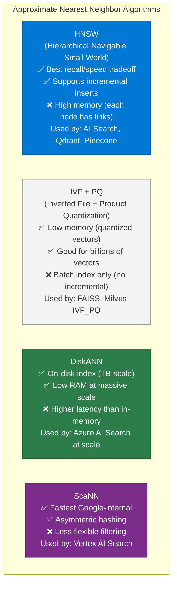
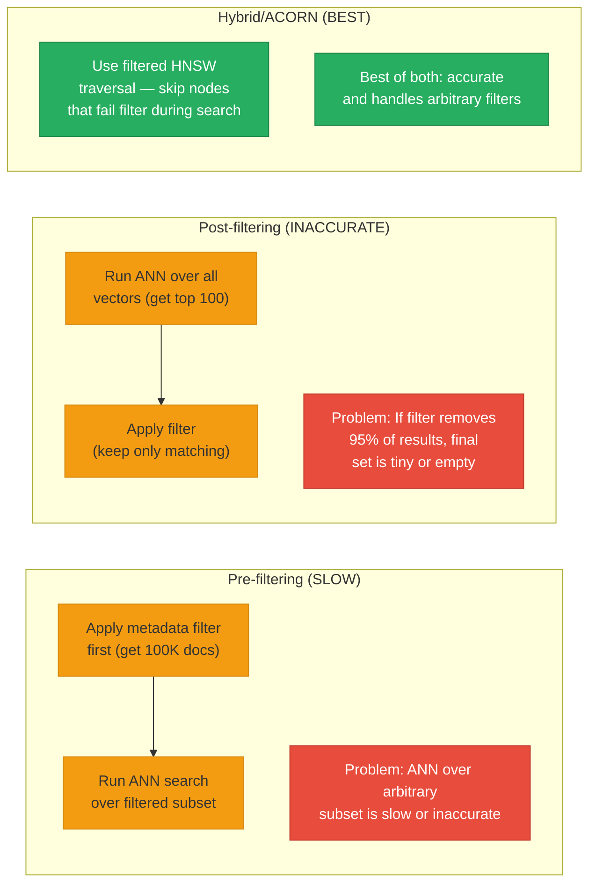
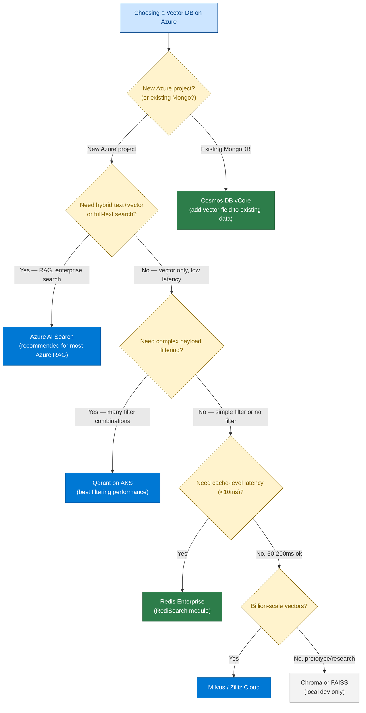
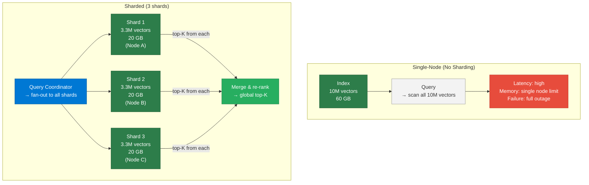

# 17 — Vector Databases

> **Level:** Intermediate | **Time to complete:** 3 hours | **Azure services:** Azure AI Search, Azure Cache for Redis (Enterprise + RediSearch), Azure Cosmos DB for MongoDB (vCore)

---

## 1. Overview

A vector database stores high-dimensional embeddings and supports approximate nearest-neighbor (ANN) search — the foundation of RAG, semantic search, recommendation, and anomaly detection in AI systems. Choosing the right vector database involves understanding ANN algorithms, filtering capabilities, enterprise security, and operational complexity.

---

## 2. How Vector Search Works

### 2.1 ANN Algorithm Comparison



### 2.2 The Filtering Problem



---

## 3. Vector Database Comparison

| Database | Best for | Hosting | Filtering | Scale | Azure integration |
|---|---|---|---|---|---|
| **Azure AI Search** | Enterprise RAG + hybrid | Managed Azure | Excellent (OData) | Up to 5M vectors/index | Native (Managed Identity, RBAC) |
| **Redis Enterprise (RediSearch)** | Low-latency cache + vector | Managed (Azure Cache) | Metadata tags | Millions | Azure Cache for Redis Enterprise |
| **Qdrant** | High-performance filtered search | Self-hosted / Cloud | Excellent (payload filters) | Hundreds of millions | Run on AKS |
| **Pinecone** | Developer-friendly managed | Fully managed SaaS | Pod-level | Billions (Enterprise) | BYOK, VPC peering |
| **Chroma** | Local dev, prototyping | Embedded / Open source | Basic | Millions (single node) | Not production on Azure |
| **FAISS** | Research, custom | Library (no server) | None (build yourself) | Billions (CPU/GPU) | Integrate with your service |
| **Milvus** | Large-scale production | Self-hosted / Zilliz Cloud | Good | Billions | Run on AKS |
| **Cosmos DB (vCore)** | Existing Mongo workloads + vector | Managed Azure | Full MongoDB queries | Millions | Native Azure, Managed Identity |
| **pgvector (PostgreSQL)** | Small-medium, existing Postgres | Azure Database for PostgreSQL | Full SQL | <10M vectors | Native Azure |

---

## 4. Azure AI Search — Deep Dive

Azure AI Search is the recommended vector database for production Azure AI workloads because it combines BM25 full-text, vector search, and semantic reranking in a single managed service with Azure RBAC and private endpoints.

### 4.1 HNSW Configuration

```python
# azure_ai_search_setup.py
from azure.search.documents.indexes import SearchIndexClient
from azure.search.documents.indexes.models import (
    SearchIndex, SearchField, SearchFieldDataType,
    SimpleField, SearchableField,
    VectorSearch, HnswAlgorithmConfiguration, HnswParameters,
    VectorSearchProfile, SemanticConfiguration, SemanticSearch,
    SemanticPrioritizedFields, SemanticField,
)
from azure.identity import DefaultAzureCredential

INDEX_NAME = "knowledge-base"

def create_search_index(endpoint: str) -> None:
    client = SearchIndexClient(endpoint, DefaultAzureCredential())

    fields = [
        SimpleField(name="id", type=SearchFieldDataType.String, key=True, filterable=True),
        SearchableField(name="content", type=SearchFieldDataType.String, analyzer_name="en.microsoft"),
        SimpleField(name="source_file", type=SearchFieldDataType.String, filterable=True, facetable=True),
        SimpleField(name="category", type=SearchFieldDataType.String, filterable=True, facetable=True),
        SimpleField(name="access_groups", type=SearchFieldDataType.Collection(SearchFieldDataType.String), filterable=True),
        SimpleField(name="last_updated", type=SearchFieldDataType.DateTimeOffset, filterable=True, sortable=True),
        SearchField(
            name="embedding",
            type=SearchFieldDataType.Collection(SearchFieldDataType.Single),
            searchable=True,
            vector_search_dimensions=1536,
            vector_search_profile_name="hnsw-profile",
        ),
    ]

    vector_search = VectorSearch(
        algorithms=[
            HnswAlgorithmConfiguration(
                name="hnsw-algo",
                parameters=HnswParameters(
                    m=4,             # Number of links per node (4-64, higher = better recall, more memory)
                    ef_construction=400,  # Size of dynamic candidate list during index build
                    ef_search=500,   # Size of dynamic candidate list during search (affects latency vs recall)
                    metric="cosine",
                ),
            )
        ],
        profiles=[VectorSearchProfile(name="hnsw-profile", algorithm_configuration_name="hnsw-algo")],
    )

    semantic_search = SemanticSearch(
        configurations=[
            SemanticConfiguration(
                name="semantic-config",
                prioritized_fields=SemanticPrioritizedFields(
                    content_fields=[SemanticField(field_name="content")],
                ),
            )
        ]
    )

    index = SearchIndex(
        name=INDEX_NAME,
        fields=fields,
        vector_search=vector_search,
        semantic_search=semantic_search,
    )

    client.create_or_update_index(index)
    print(f"Index '{INDEX_NAME}' created/updated.")
```

### 4.2 Hybrid Search with Semantic Reranker

```python
# azure_ai_search_query.py
import asyncio
from azure.search.documents.aio import SearchClient
from azure.search.documents.models import (
    VectorizedQuery,
    QueryType,
    QueryCaptionType,
    QueryAnswerType,
)
from azure.identity.aio import DefaultAzureCredential
from openai import AsyncAzureOpenAI
import os

aoai = AsyncAzureOpenAI(
    azure_endpoint=os.environ["AZURE_OPENAI_ENDPOINT"],
    api_key=os.environ["AZURE_OPENAI_API_KEY"],
    api_version="2024-10-21",
)


async def hybrid_search(
    query: str,
    user_groups: list[str],
    endpoint: str,
    index_name: str = "knowledge-base",
    top_k: int = 6,
) -> list[dict]:
    """
    Hybrid (BM25 + vector) + semantic reranker + security trimming.
    """
    credential = DefaultAzureCredential()
    search_client = SearchClient(endpoint, index_name, credential)

    # Embed the query
    embed_response = await aoai.embeddings.create(
        model="text-embedding-3-large",
        input=[query],
        dimensions=1536,
    )
    query_embedding = embed_response.data[0].embedding

    # Security filter (OData syntax)
    groups_filter = " or ".join([f"access_groups/any(g: g eq '{g}')" for g in user_groups])
    security_filter = f"({groups_filter})"

    async with search_client:
        results = await search_client.search(
            search_text=query,
            vector_queries=[
                VectorizedQuery(
                    vector=query_embedding,
                    k_nearest_neighbors=50,  # Over-fetch for reranking
                    fields="embedding",
                    exhaustive=False,  # Use ANN (HNSW) for speed
                )
            ],
            filter=security_filter,
            query_type=QueryType.SEMANTIC,
            semantic_configuration_name="semantic-config",
            query_caption=QueryCaptionType.EXTRACTIVE,
            query_answer=QueryAnswerType.EXTRACTIVE,
            top=top_k,
            select=["id", "content", "source_file", "category", "last_updated"],
        )

        hits = []
        async for result in results:
            hits.append({
                "id": result["id"],
                "content": result["content"],
                "source": result["source_file"],
                "score": result["@search.reranker_score"],
                "captions": [c.text for c in (result.get("@search.captions") or [])],
            })

    # Sort by reranker score
    hits.sort(key=lambda x: x.get("score", 0), reverse=True)
    return hits
```

### 4.3 Qdrant for Advanced Filtering

```python
# qdrant_example.py — for when you need complex payload filtering
from qdrant_client import AsyncQdrantClient
from qdrant_client.models import (
    Distance, VectorParams, PointStruct,
    Filter, FieldCondition, MatchAny, Range,
    SearchRequest, NamedVector,
)
import asyncio, os, uuid

qdrant = AsyncQdrantClient(
    url=os.environ["QDRANT_URL"],
    api_key=os.environ["QDRANT_API_KEY"],
)

COLLECTION_NAME = "documents"

async def create_collection():
    await qdrant.create_collection(
        collection_name=COLLECTION_NAME,
        vectors_config=VectorParams(size=1536, distance=Distance.COSINE),
    )

async def upsert_documents(docs: list[dict], embeddings: list[list[float]]):
    points = [
        PointStruct(
            id=str(uuid.uuid4()),
            vector=embedding,
            payload={
                "content": doc["content"],
                "source": doc["source"],
                "category": doc["category"],
                "department": doc["department"],
                "year": doc.get("year", 2024),
            },
        )
        for doc, embedding in zip(docs, embeddings)
    ]
    await qdrant.upsert(collection_name=COLLECTION_NAME, points=points)

async def filtered_vector_search(
    query_embedding: list[float],
    department: str,
    year_min: int,
    categories: list[str],
    top_k: int = 5,
) -> list[dict]:
    """Qdrant's payload filtering is evaluated DURING graph traversal — no post-filter accuracy loss."""
    results = await qdrant.search(
        collection_name=COLLECTION_NAME,
        query_vector=query_embedding,
        query_filter=Filter(
            must=[
                FieldCondition(key="department", match=MatchAny(any=[department])),
                FieldCondition(key="year", range=Range(gte=year_min)),
                FieldCondition(key="category", match=MatchAny(any=categories)),
            ]
        ),
        limit=top_k,
        with_payload=True,
        score_threshold=0.7,
    )
    return [
        {"content": r.payload["content"], "source": r.payload["source"], "score": r.score}
        for r in results
    ]
```

---

## 5. Choosing a Vector Database for Azure



---

## 5.1 Sharding and Partitioning for Vector Databases

**Sharding** (also called **partitioning**) is the strategy of splitting a large vector index across multiple nodes or storage units so that no single node holds all the data. It is the primary technique for scaling vector search beyond what a single machine can hold.



### Sharding Strategies

| Strategy | How it works | Best for | Risk |
|---|---|---|---|
| **Random / hash sharding** | Vector ID hashed → assigned to shard | Uniform distribution; simple to implement | Queries must fan-out to all shards |
| **Namespace / tenant sharding** | Each tenant or document type gets its own shard | Multi-tenant RAG; strict data isolation | Uneven shard sizes if tenants vary greatly |
| **Semantic sharding** | Cluster vectors by topic first; each cluster = a shard | Reduces fan-out — query only hits relevant shards | Complex to maintain; cluster drift over time |
| **Date / time sharding** | Chunk data by ingestion date | Log/news archives; easy shard pruning | Recent shard gets all writes (hot shard) |

### Sharding vs Replication (Vector Store Context)

| | Sharding (Partitioning) | Replication |
|---|---|---|
| **Purpose** | Scale capacity — distribute data across nodes | Scale throughput — serve more read queries |
| **Each node holds** | A subset of vectors | Full copy of all vectors |
| **Query behaviour** | Fan-out to all shards, merge results | Route to any replica |
| **Failure impact** | Shard loss = data loss (need replica per shard) | Replica loss = reduced throughput |
| **Azure AI Search term** | **Partitions** (each partition holds a slice of the index) | **Replicas** (each replica is a full copy for query scale) |

### Azure AI Search: Partitions × Replicas

Azure AI Search uses both concepts simultaneously:

```
Storage capacity  = document_count × vector_dims × 4 bytes × 1.3 (HNSW overhead)
                    ─────────────────────────────────────────────────────────────
                    partition_count

Query throughput  = base_QPS × replica_count

Example: 50M vectors × 1536 dims × 4 bytes × 1.3 = ~400 GB
  With 4 partitions: 100 GB per partition (fits on Standard S1 nodes)
  With 3 replicas: 3× query throughput, survives 1 replica failure
  
  Total SKU: S1 × 4 partitions × 3 replicas = 12 search units
```

> **Rule of thumb:** Add **partitions** when you run out of storage. Add **replicas** when you run out of query throughput. For production SLA, always have at least 2 replicas (one can fail without downtime) and 2 partitions (prevents single-partition-as-bottleneck).

---

## 6. Production Checklist

- [ ] ANN recall tested: `ef_search` tuned to achieve > 95% recall@10 on your data
- [ ] Filter selectivity analyzed: if filters select < 5% of data, use pre-filtering; if > 50%, post-filter is fine
- [ ] Private endpoint configured: vector DB not accessible over public internet
- [ ] Managed Identity authentication: no API keys in environment variables for production
- [ ] Index capacity planned: 1M vectors × 1536 dims × 4 bytes = 6GB — plan for 3x for HNSW overhead
- [ ] Incremental update tested: verify that new inserts don't degrade recall until re-index
- [ ] Deletion handled: vector DBs handle deletes differently — test tombstone behavior

---

## 7. Interview Q&A

### Q1 (Intermediate): What is the difference between HNSW and IVF for vector search, and when would you use each?

**Answer:** HNSW (Hierarchical Navigable Small World) builds a multi-layer graph where each node links to its approximate nearest neighbors. Search starts at the top layer (few nodes, long-range jumps) and drills down to the bottom layer (all nodes). HNSW supports fast incremental inserts — you can add new vectors without rebuilding the index. It uses more memory (~64 bytes per vector for the graph links in addition to the vector itself). Use HNSW for: production RAG systems where documents are added continuously, datasets up to ~100M vectors, when you need < 50ms latency.

IVF (Inverted File Index) clusters vectors into K centroids (like k-means), then during search only checks the nearest centroids and their assigned vectors. Combined with Product Quantization (IVF_PQ), the vectors are compressed to 1/4 to 1/32 their size, enabling billion-scale indexes in manageable RAM. The downside: IVF requires batch training (you must know the full dataset before building the index) and doesn't support efficient incremental inserts. Use IVF_PQ for: offline batch indexes (e.g., product catalog that's re-built nightly), datasets > 100M vectors, when memory is the constraint.

### Q2 (Advanced): Explain the filtering problem in vector databases and how modern databases solve it.

**Answer:** The filtering problem arises when you need to find the top-k most similar vectors that ALSO match a metadata filter (e.g., department=HR, year>2023). Naive approaches fail: **pre-filtering** (filter first, then ANN over the subset) requires running ANN over arbitrary non-indexed subsets — slow and inaccurate. **Post-filtering** (ANN over all vectors, then filter) means your top-k from ANN may all fail the filter, leaving an empty result set. Modern solutions: (1) **Filtered HNSW traversal** — during graph traversal, skip nodes that don't pass the filter. Qdrant implements this as ACORN. It's accurate and fast when filter selectivity is reasonable. (2) **Segment-level indexes** — partition the index into segments by filter values (e.g., one HNSW per department). Azure AI Search does this with filterable fields. (3) **Hybrid executor** — use the metadata index to narrow candidates, then use ANN within that set. This works best when the filter selects 5-50% of vectors.

---

## Cross-links

- Previous: [16 — GraphRAG](./16-GraphRAG.md)
- Next: [18 — Prompt Engineering](./18-Prompt-Engineering.md)
- Related: [14 — RAG](./14-RAG.md) | [15 — Enterprise RAG](./15-Enterprise-RAG.md)

---

*Module 17 | Series: Enterprise Agentic AI Tutorial | Last updated: June 2026*
