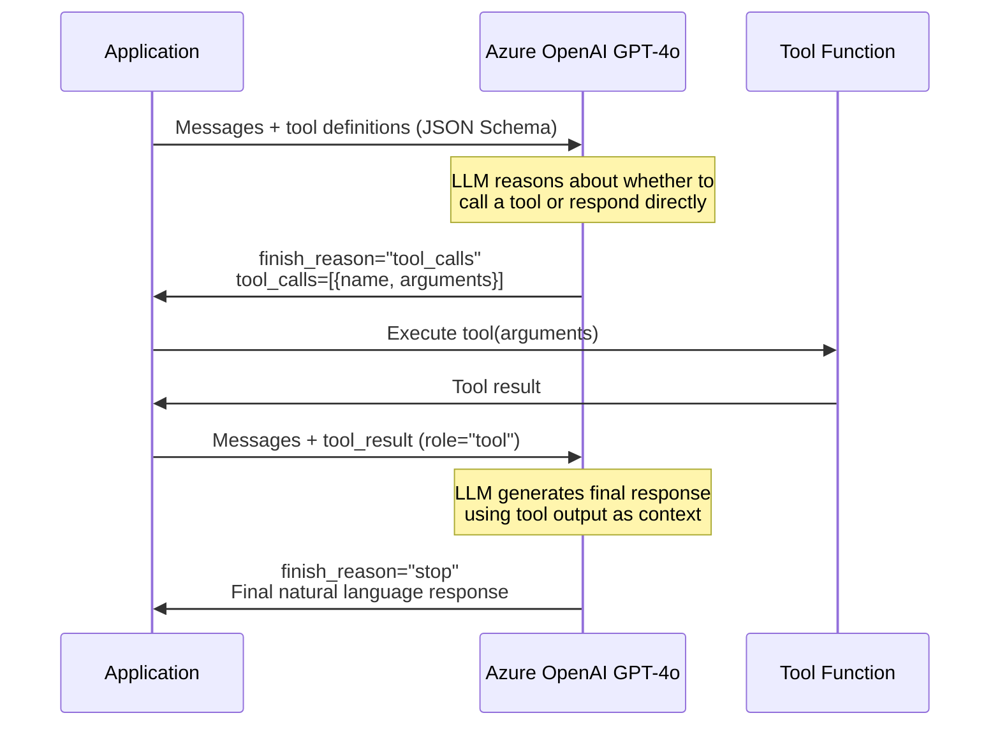
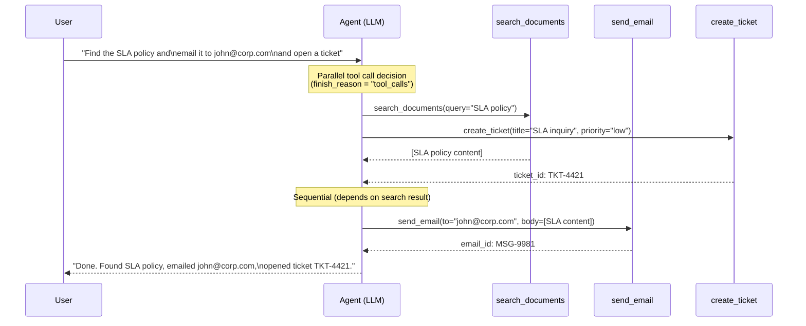
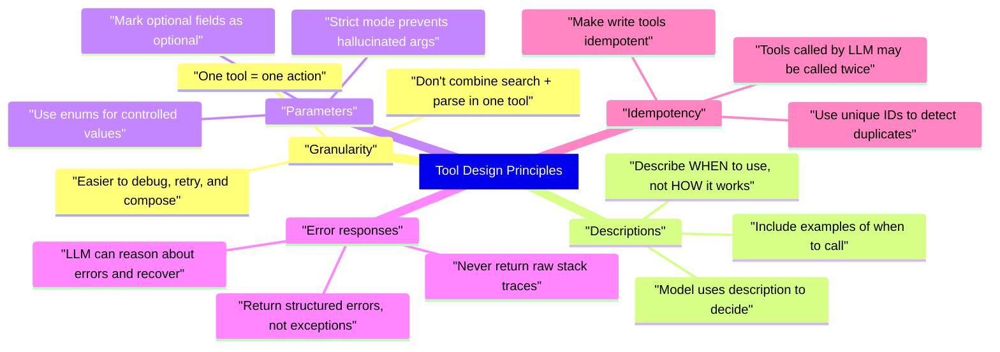
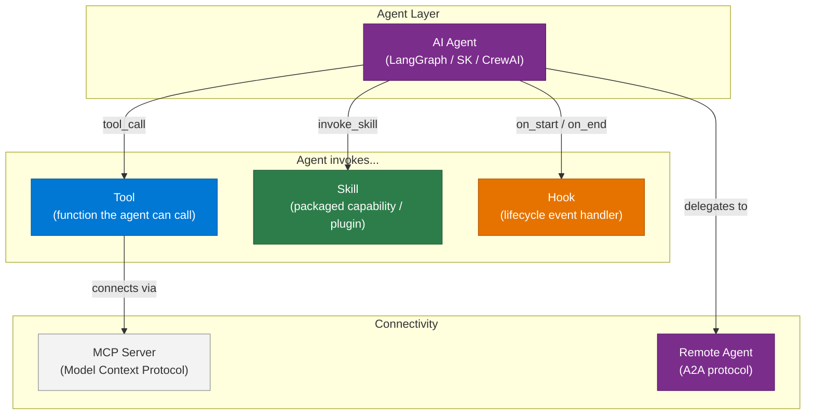

# 19 — Tool Calling

> **Level:** Intermediate | **Time to complete:** 3 hours | **Azure services:** Azure OpenAI, Azure Functions

---

## 1. Overview

Tool calling (also called function calling) is the mechanism by which an LLM signals that it wants to call an external function, providing structured arguments. The host application actually executes the function, returns the result, and continues the conversation. Tool calling is the primary way agents take actions in the world.

---

## 2. How Tool Calling Works



---

## 3. Tool Definition with JSON Schema

### 3.1 Basic Tool Definition

```python
# tools.py
import json
from openai import AzureOpenAI
import os

client = AzureOpenAI(
    azure_endpoint=os.environ["AZURE_OPENAI_ENDPOINT"],
    api_key=os.environ["AZURE_OPENAI_API_KEY"],
    api_version="2024-10-21",
)

# Define tools with JSON Schema
tools = [
    {
        "type": "function",
        "function": {
            "name": "get_stock_price",
            "description": "Get the current stock price for a ticker symbol. Use this when the user asks about stock prices.",
            "parameters": {
                "type": "object",
                "properties": {
                    "ticker": {
                        "type": "string",
                        "description": "The stock ticker symbol, e.g. MSFT, AAPL, GOOGL",
                    },
                    "currency": {
                        "type": "string",
                        "enum": ["USD", "EUR", "GBP"],
                        "description": "Currency for the price (default: USD)",
                    },
                },
                "required": ["ticker"],
                "additionalProperties": False,
            },
            "strict": True,  # Enforce schema exactly — prevents hallucinated fields
        },
    },
    {
        "type": "function",
        "function": {
            "name": "search_news",
            "description": "Search for recent news articles about a topic. Returns top 5 relevant articles.",
            "parameters": {
                "type": "object",
                "properties": {
                    "query": {
                        "type": "string",
                        "description": "Search query string",
                    },
                    "days_back": {
                        "type": "integer",
                        "description": "How many days back to search (1-30)",
                        "minimum": 1,
                        "maximum": 30,
                    },
                },
                "required": ["query"],
                "additionalProperties": False,
            },
            "strict": True,
        },
    },
]
```

### 3.2 Tool Execution Loop

```python
# tool_loop.py
import json
from openai import AzureOpenAI

client = AzureOpenAI(...)


def get_stock_price(ticker: str, currency: str = "USD") -> dict:
    """Mock implementation — replace with real API."""
    prices = {"MSFT": 420.50, "AAPL": 195.30, "GOOGL": 178.90}
    price = prices.get(ticker.upper(), 0.0)
    return {"ticker": ticker.upper(), "price": price, "currency": currency}


def search_news(query: str, days_back: int = 7) -> list[dict]:
    """Mock implementation — replace with Bing Search or NewsAPI."""
    return [
        {"title": f"News about {query}", "url": "https://example.com", "date": "2024-01-15"},
    ]


TOOL_REGISTRY = {
    "get_stock_price": get_stock_price,
    "search_news": search_news,
}


def run_agent_with_tools(user_message: str) -> str:
    """
    Run an agent that can call tools.
    Handles multiple tool calls in a single turn.
    """
    messages = [
        {"role": "system", "content": "You are a helpful financial assistant. Use tools to get current data."},
        {"role": "user", "content": user_message},
    ]

    while True:
        response = client.chat.completions.create(
            model="gpt-4o",
            messages=messages,
            tools=tools,
            tool_choice="auto",  # "auto" | "none" | "required" | specific tool
            parallel_tool_calls=True,
        )

        message = response.choices[0].message
        messages.append(message)

        if response.choices[0].finish_reason == "stop":
            return message.content

        if response.choices[0].finish_reason == "tool_calls":
            # Execute each tool call and add results to messages
            for tool_call in message.tool_calls:
                fn_name = tool_call.function.name
                fn_args = json.loads(tool_call.function.arguments)

                print(f"Calling: {fn_name}({fn_args})")

                fn = TOOL_REGISTRY.get(fn_name)
                if fn is None:
                    result = {"error": f"Unknown function: {fn_name}"}
                else:
                    try:
                        result = fn(**fn_args)
                    except Exception as e:
                        result = {"error": str(e)}

                messages.append({
                    "role": "tool",
                    "tool_call_id": tool_call.id,
                    "content": json.dumps(result),
                })

        else:
            # finish_reason = "length" or "content_filter"
            break

    return messages[-1].get("content", "")
```

### 3.3 Parallel Tool Calls

```python
# parallel_tools.py — multiple tools called in a single LLM turn
import json, asyncio
from openai import AsyncAzureOpenAI

aoai = AsyncAzureOpenAI(...)


async def execute_tool_call_async(tool_call, registry: dict) -> dict:
    """Execute a single tool call asynchronously."""
    fn_name = tool_call.function.name
    fn_args = json.loads(tool_call.function.arguments)

    fn = registry.get(fn_name)
    if fn is None:
        return {"role": "tool", "tool_call_id": tool_call.id, "content": json.dumps({"error": "Unknown function"})}

    try:
        if asyncio.iscoroutinefunction(fn):
            result = await fn(**fn_args)
        else:
            result = fn(**fn_args)
        return {"role": "tool", "tool_call_id": tool_call.id, "content": json.dumps(result)}
    except Exception as e:
        return {"role": "tool", "tool_call_id": tool_call.id, "content": json.dumps({"error": str(e)})}


async def run_agent_parallel_tools(user_message: str) -> str:
    """
    Agent with parallel tool execution.
    When LLM requests multiple tools simultaneously, run them all concurrently.
    """
    messages = [
        {"role": "system", "content": "You are a research assistant. You can look up stock prices and news simultaneously."},
        {"role": "user", "content": user_message},
    ]

    while True:
        response = await aoai.chat.completions.create(
            model="gpt-4o",
            messages=messages,
            tools=tools,
            tool_choice="auto",
            parallel_tool_calls=True,  # Allow model to request multiple tools at once
        )

        message = response.choices[0].message
        messages.append(message)

        if response.choices[0].finish_reason == "stop":
            return message.content

        if response.choices[0].finish_reason == "tool_calls":
            # Execute ALL tool calls concurrently
            tool_results = await asyncio.gather(*[
                execute_tool_call_async(tc, TOOL_REGISTRY)
                for tc in message.tool_calls
            ])
            messages.extend(tool_results)
```

---

## 4. Advanced Tool Patterns



### 4.1 Forced Tool Use and Tool Choice

```python
# Force a specific tool call — useful for structured extraction
response = client.chat.completions.create(
    model="gpt-4o",
    messages=[
        {"role": "system", "content": "Extract contract details."},
        {"role": "user", "content": contract_text},
    ],
    tools=[contract_extraction_tool],
    tool_choice={
        "type": "function",
        "function": {"name": "extract_contract_details"},
    },  # Force this specific tool — guarantees structured output
)
```

### 4.2 Tool Result Validation

```python
# tool_validation.py — validate tool results before adding to conversation
from pydantic import BaseModel, ValidationError
import json

class StockPriceResult(BaseModel):
    ticker: str
    price: float
    currency: str

def validated_tool_call(tool_call, registry: dict) -> dict:
    """Execute tool and validate result schema before returning to LLM."""
    fn_name = tool_call.function.name
    fn_args = json.loads(tool_call.function.arguments)

    try:
        raw_result = registry[fn_name](**fn_args)

        # Validate result
        VALIDATORS = {"get_stock_price": StockPriceResult}
        if fn_name in VALIDATORS:
            validated = VALIDATORS[fn_name](**raw_result)
            result = validated.model_dump()
        else:
            result = raw_result

        return {
            "role": "tool",
            "tool_call_id": tool_call.id,
            "content": json.dumps(result),
        }
    except ValidationError as e:
        return {
            "role": "tool",
            "tool_call_id": tool_call.id,
            "content": json.dumps({"error": f"Tool returned invalid data: {e}"}),
        }
    except Exception as e:
        return {
            "role": "tool",
            "tool_call_id": tool_call.id,
            "content": json.dumps({"error": str(e)}),
        }
```

### 4.3 Tool Error Handling with Retry

```python
# tool_with_retry.py
import asyncio
import time
from functools import wraps

def with_retry(max_retries: int = 3, delay: float = 1.0):
    """Decorator for tool functions that should retry on transient failure."""
    def decorator(fn):
        @wraps(fn)
        async def wrapper(*args, **kwargs):
            last_error = None
            for attempt in range(max_retries):
                try:
                    return await fn(*args, **kwargs)
                except (TimeoutError, ConnectionError) as e:
                    last_error = e
                    if attempt < max_retries - 1:
                        await asyncio.sleep(delay * (2 ** attempt))  # Exponential backoff
            return {"error": f"Tool failed after {max_retries} attempts: {last_error}"}
        return wrapper
    return decorator


@with_retry(max_retries=3)
async def get_stock_price_with_retry(ticker: str, currency: str = "USD") -> dict:
    """Stock price lookup with automatic retry on transient failures."""
    async with httpx.AsyncClient(timeout=10) as http_client:
        resp = await http_client.get(f"https://api.example.com/stocks/{ticker}")
        resp.raise_for_status()
        return resp.json()
```

---

## 5. Tool Design Principles



---

## 5.1 Tools vs Skills vs Hooks vs Agents vs MCP

These five terms are often conflated. Understanding the exact boundary between them is a frequent senior/staff interview question.



| Concept | What it is | Who defines it | When it runs | Example |
|---|---|---|---|---|
| **Tool** | A single callable function exposed to the LLM via JSON schema | Developer | When LLM emits a `tool_call` | `search_documents(query)`, `send_email(to, body)` |
| **Skill** | A packaged, reusable capability — often a collection of tools + prompts bundled together | Plugin/SDK author | When agent invokes the skill by name | Semantic Kernel `EmailPlugin`, Claude Code `code-review` skill |
| **Hook** | A lifecycle event handler that fires before/after an agent step (not called by the LLM) | Developer / platform | Automatically on lifecycle events | `on_tool_start`, `on_agent_finish`, pre-commit hook in Claude Code |
| **Agent** | An autonomous reasoning loop (LLM + tools + memory + planning) that can act over multiple steps | Developer / framework | Continuously until goal complete or max steps | LangGraph ReAct agent, CrewAI worker agent |
| **MCP** (Model Context Protocol) | A standard transport protocol for exposing tools, resources, and prompts to any MCP-compatible LLM client | Server author (any service) | When an MCP client connects to an MCP server | `filesystem` MCP server exposes `read_file` / `write_file` tools to any client |

### Key Distinctions

**Tool vs Skill:**
- A **tool** is atomic — one function, one purpose (`get_weather`)
- A **skill** is composite — multiple tools + system prompts + configuration bundled as a reusable plugin (`WeatherReportingSkill` that uses `get_weather` + `format_report` + a domain-specific system prompt)

**Tool vs Hook:**
- A **tool** is *called by the LLM* because it decided to use it
- A **hook** is *called by the framework* on lifecycle events regardless of what the LLM wants (e.g., logging every tool invocation)

**Agent vs Tool:**
- A **tool** is stateless and returns one result
- An **agent** maintains state, can invoke multiple tools over multiple turns, and can be delegated a sub-goal

**MCP vs Tool:**
- A **tool** is a local function defined in your application code
- **MCP** is a protocol that exposes tools over a network/process boundary so that *any* MCP-compatible client (Claude Desktop, VS Code Copilot, any LangChain agent) can use them without custom integration code

---

## 6. Production Checklist

- [ ] Tool definitions use `"strict": True` — enforces schema and prevents hallucinated args
- [ ] All tool calls logged: tool name, arguments, result, latency
- [ ] Tool execution timeout: max 30 seconds per tool call
- [ ] Tool errors returned as structured JSON `{"error": "..."}` — never throw exceptions back
- [ ] Parallel tool calls enabled when tools are independent
- [ ] Idempotency implemented for all write-side tools
- [ ] Max tool call rounds limited (e.g., 10) to prevent infinite loops

---

## 7. Interview Q&A

### Q1 (Intermediate): How does function/tool calling work in OpenAI/Azure OpenAI, and what is the role of `finish_reason`?

**Answer:** You send the model a list of tool definitions (as JSON Schema) along with the conversation. The model decides whether to respond with text or call a tool. If it calls a tool, `finish_reason` is `"tool_calls"` and the response includes `tool_calls` with the function name and arguments as a JSON string. Your application executes the function, then appends the result as a message with `role="tool"` and the matching `tool_call_id`. You call the model again with the updated conversation. The model uses the tool result to generate a final response, at which point `finish_reason` is `"stop"`. This continues in a loop until `finish_reason == "stop"`. Crucially, the model doesn't execute tools — it only signals intent and arguments. Your code is responsible for execution, error handling, and security.

### Q2 (Advanced): What is `parallel_tool_calls` and when should you use it?

**Answer:** With `parallel_tool_calls=True`, the model can request multiple tool calls in a single response, rather than waiting for each to complete before requesting the next. For example, a user asks "What's the stock price of MSFT and AAPL, and any news about AI today?" — the model returns three tool calls simultaneously: `get_stock_price(MSFT)`, `get_stock_price(AAPL)`, and `search_news("AI")`. Your application runs these in parallel using `asyncio.gather()`, cutting latency from 3× tool latency to 1× tool latency. Use it when: tools are independent (output of one doesn't affect input of another), tools involve I/O (network calls, DB queries), you want lowest latency. Don't use it when: tools have side effects that must be sequential (e.g., create_order → process_payment), or tools have dependencies (output of tool A is input to tool B).

---

## Cross-links

- Previous: [18 — Prompt Engineering](./18-Prompt-Engineering.md)
- Next: [20 — Function Calling](./20-Function-Calling.md)
- Related: [01 — Agentic AI Fundamentals](./01-Agentic-AI-Fundamentals.md) | [05 — Semantic Kernel](./05-Semantic-Kernel.md)

---

*Module 19 | Series: Enterprise Agentic AI Tutorial | Last updated: June 2026*
