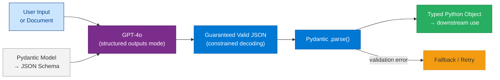
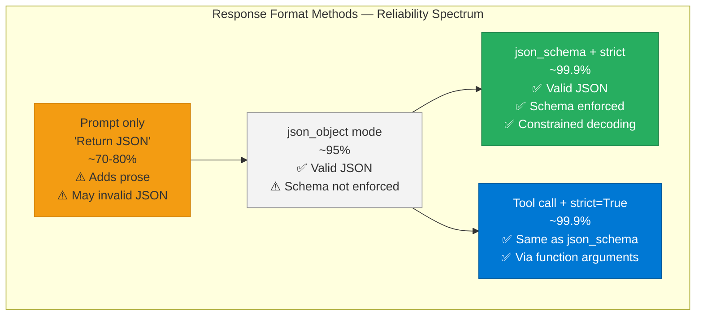
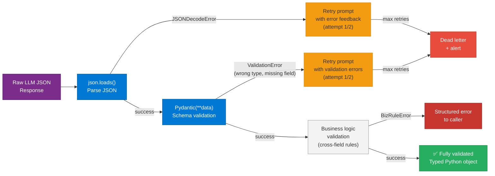

# 20 — Function Calling: Structured Outputs

> **Level:** Intermediate | **Time to complete:** 2.5 hours | **Azure services:** Azure OpenAI

---

## 1. Overview

While Module 19 covers the tool calling loop, this module focuses on **structured outputs** — using function calling as a mechanism to guarantee that LLM responses conform to a specific schema. This is the most reliable way to get machine-parseable data from LLMs in production.

---

## 2. Structured Outputs Architecture



### 2.1 Structured Output Reliability Comparison



### 2.2 Why Structured Outputs?

| Method | Reliability | Notes |
|---|---|---|
| Prompt: "Return JSON" | ~70-80% | Model occasionally adds prose or invalid JSON |
| `response_format={"type":"json_object"}` | ~95% | Valid JSON guaranteed but schema not enforced |
| `response_format={"type":"json_schema", ...}` (Structured Outputs) | ~99.9% | Exact schema enforced via constrained decoding |
| Tool calling with `"strict": True` | ~99.9% | Same as above via function call mechanism |

---

## 3. Implementation Patterns

### 3.1 Pydantic-Based Structured Output

```python
# structured_outputs.py
import json
import os
from pydantic import BaseModel, Field
from typing import Optional, Literal
from openai import AzureOpenAI

client = AzureOpenAI(
    azure_endpoint=os.environ["AZURE_OPENAI_ENDPOINT"],
    api_key=os.environ["AZURE_OPENAI_API_KEY"],
    api_version="2024-10-21",
)


class CompanyInfo(BaseModel):
    company_name: str = Field(description="Official company name")
    ticker_symbol: Optional[str] = Field(description="Stock ticker if publicly traded, else null")
    industry: str = Field(description="Primary industry sector")
    headquarters_country: str = Field(description="Country where HQ is located")
    founding_year: Optional[int] = Field(description="Year founded, if mentioned")
    is_public: bool = Field(description="Whether the company is publicly traded")
    key_products: list[str] = Field(description="Main products or services mentioned")
    sentiment: Literal["positive", "neutral", "negative"] = Field(
        description="Overall tone of the text about this company"
    )


def extract_company_info(text: str) -> CompanyInfo:
    """Extract structured company information from any text."""
    response = client.chat.completions.create(
        model="gpt-4o",
        messages=[
            {
                "role": "system",
                "content": "You are a company information extractor. Extract structured company data from the provided text.",
            },
            {"role": "user", "content": text},
        ],
        response_format={
            "type": "json_schema",
            "json_schema": {
                "name": "company_info",
                "schema": CompanyInfo.model_json_schema(),
                "strict": True,
            },
        },
        temperature=0,
    )
    return CompanyInfo(**json.loads(response.choices[0].message.content))
```

### 3.2 Nested Structured Outputs

```python
# nested_structured.py
from pydantic import BaseModel, Field
from typing import Optional

class LineItem(BaseModel):
    description: str
    quantity: int
    unit_price: float
    total: float


class Address(BaseModel):
    street: str
    city: str
    state: str
    postal_code: str
    country: str


class Invoice(BaseModel):
    invoice_number: str
    invoice_date: str
    due_date: Optional[str]
    vendor_name: str
    vendor_address: Address
    bill_to_name: str
    bill_to_address: Address
    line_items: list[LineItem]
    subtotal: float
    tax_rate: float
    tax_amount: float
    total_amount: float
    currency: str = "USD"
    payment_terms: Optional[str]


def extract_invoice(invoice_text: str) -> Invoice:
    response = client.chat.completions.create(
        model="gpt-4o",
        messages=[
            {"role": "system", "content": "Extract all information from this invoice into structured format."},
            {"role": "user", "content": invoice_text},
        ],
        response_format={
            "type": "json_schema",
            "json_schema": {
                "name": "invoice",
                "schema": Invoice.model_json_schema(),
                "strict": True,
            },
        },
        temperature=0,
    )
    data = json.loads(response.choices[0].message.content)
    return Invoice(**data)
```

### 3.3 Structured Output via Tool Calling

```python
# structured_via_tool.py — alternative approach using forced tool call
def extract_via_tool(text: str, model_class: type[BaseModel]) -> BaseModel:
    """
    Force structured extraction by defining a tool and using tool_choice to force its call.
    Preferred when you need the arguments from a tool call rather than text response.
    """
    tool_def = {
        "type": "function",
        "function": {
            "name": "store_extracted_data",
            "description": f"Store the extracted {model_class.__name__} data",
            "parameters": model_class.model_json_schema(),
            "strict": True,
        },
    }

    response = client.chat.completions.create(
        model="gpt-4o",
        messages=[
            {"role": "system", "content": f"Extract {model_class.__name__} from the text."},
            {"role": "user", "content": text},
        ],
        tools=[tool_def],
        tool_choice={"type": "function", "function": {"name": "store_extracted_data"}},
        temperature=0,
    )

    tool_call = response.choices[0].message.tool_calls[0]
    data = json.loads(tool_call.function.arguments)
    return model_class(**data)
```

### 3.4 Batch Document Extraction

```python
# batch_extraction.py
import asyncio
import json
from openai import AsyncAzureOpenAI
from pydantic import BaseModel

aoai = AsyncAzureOpenAI(...)


class ResumeExtract(BaseModel):
    full_name: str
    email: str
    phone: str
    years_of_experience: int
    skills: list[str]
    highest_education: str
    current_role: str
    previous_companies: list[str]


async def extract_resume(resume_text: str) -> ResumeExtract | None:
    try:
        response = await aoai.chat.completions.create(
            model="gpt-4o",
            messages=[
                {"role": "system", "content": "Extract structured candidate information from this resume."},
                {"role": "user", "content": resume_text[:8000]},  # Trim to context limit
            ],
            response_format={
                "type": "json_schema",
                "json_schema": {
                    "name": "resume_extract",
                    "schema": ResumeExtract.model_json_schema(),
                    "strict": True,
                },
            },
            temperature=0,
        )
        data = json.loads(response.choices[0].message.content)
        return ResumeExtract(**data)
    except Exception as e:
        print(f"Extraction failed: {e}")
        return None


async def batch_extract_resumes(resumes: list[str], concurrency: int = 10) -> list[ResumeExtract | None]:
    """Extract from many resumes with bounded concurrency."""
    semaphore = asyncio.Semaphore(concurrency)

    async def bounded_extract(resume_text: str) -> ResumeExtract | None:
        async with semaphore:
            return await extract_resume(resume_text)

    return await asyncio.gather(*[bounded_extract(r) for r in resumes])
```

---

## 4. Validation and Error Handling

### Validation Pipeline Flow




```python
# validation_pipeline.py
from pydantic import BaseModel, field_validator, model_validator
from typing import Optional
import re


class ExtractedEmail(BaseModel):
    address: str
    domain: str
    is_corporate: bool

    @field_validator("address")
    @classmethod
    def validate_email_format(cls, v: str) -> str:
        if not re.match(r"[^@]+@[^@]+\.[^@]+", v):
            raise ValueError(f"Invalid email format: {v}")
        return v.lower()

    @model_validator(mode="after")
    def validate_domain_matches(self) -> "ExtractedEmail":
        expected_domain = self.address.split("@")[1]
        if self.domain != expected_domain:
            self.domain = expected_domain  # Auto-correct mismatch
        return self


def extract_with_retry(
    text: str,
    schema_class: type[BaseModel],
    max_retries: int = 2,
) -> BaseModel:
    """Extract with retry on validation failure."""
    messages = [
        {"role": "system", "content": f"Extract {schema_class.__name__}. Be accurate."},
        {"role": "user", "content": text},
    ]

    for attempt in range(max_retries + 1):
        response = client.chat.completions.create(
            model="gpt-4o",
            messages=messages,
            response_format={
                "type": "json_schema",
                "json_schema": {
                    "name": schema_class.__name__.lower(),
                    "schema": schema_class.model_json_schema(),
                    "strict": True,
                },
            },
            temperature=0,
        )

        try:
            data = json.loads(response.choices[0].message.content)
            return schema_class(**data)
        except Exception as e:
            if attempt < max_retries:
                messages.append({"role": "assistant", "content": response.choices[0].message.content})
                messages.append({"role": "user", "content": f"The output had validation errors: {e}. Please correct and retry."})
            else:
                raise
```

---

## 5. Production Checklist

- [ ] Use `"type": "json_schema"` with `"strict": True` for all structured extraction — not `"json_object"`
- [ ] Pydantic models used for both schema generation and result validation
- [ ] `temperature=0` for all extraction tasks
- [ ] Batch extraction uses bounded concurrency (`asyncio.Semaphore`) to avoid rate limit errors
- [ ] Retry on validation error — 1-2 retries with error feedback in the message
- [ ] Schema complexity reviewed: deeply nested schemas may reduce model accuracy
- [ ] Token cost tracked: structured output prompts tend to be larger

---

## 6. Interview Q&A

### Q1 (Intermediate): What is the difference between `json_object` and `json_schema` response formats?

**Answer:** `response_format={"type":"json_object"}` guarantees valid JSON is returned but does not enforce a specific schema. The model may include extra fields, omit fields, or use different types than expected. `response_format={"type":"json_schema","json_schema":{"schema":...,"strict":true}}` uses **constrained decoding** — the model's token sampling is constrained at the tokenizer level to only ever produce tokens that keep the output valid against the schema. This means fields will always be present, types will match, and enum values will be from the allowed set. The guarantee is ~99.9% reliable (versus ~95% for json_object). Use `json_schema` for production extraction pipelines. Use `json_object` only when you need flexible/dynamic JSON output where the exact schema is unknown at call time.

### Q2 (Advanced): How do you handle optional fields and null values in structured outputs?

**Answer:** In JSON Schema strict mode, all required fields must be present. For truly optional fields, you have two options: (1) **Make them `Optional[T]` in Pydantic**, which generates a `{"anyOf": [{"type": "..."}, {"type": "null"}]}` schema — the model can then return `null` for absent values; (2) **Remove them from the schema** and use a separate, non-strict call for optional enrichment. For production, prefer Option 1 with `Optional[T]` and instruct the model to use `null` when information is not present in the source text. Critically, you must also include this in your system prompt: "Use null for any fields that are not mentioned in the text — never fabricate information." Otherwise, the model may hallucinate plausible values to satisfy the schema.

---

## Cross-links

- Previous: [19 — Tool Calling](./19-Tool-Calling.md)
- Next: [21 — Memory](./21-Memory.md)
- Related: [18 — Prompt Engineering](./18-Prompt-Engineering.md) | [06 — LangChain](./06-LangChain.md)

---

*Module 20 | Series: Enterprise Agentic AI Tutorial | Last updated: June 2026*
