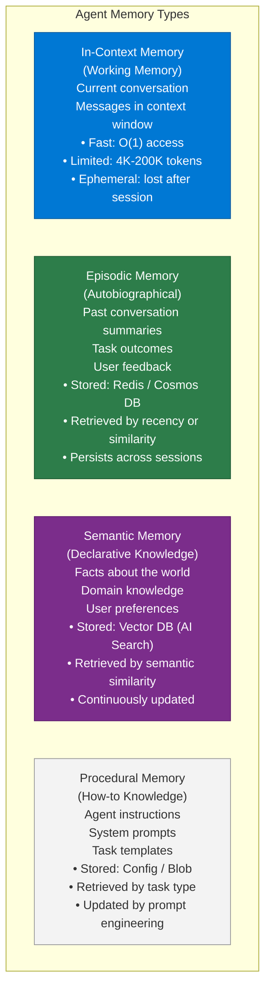
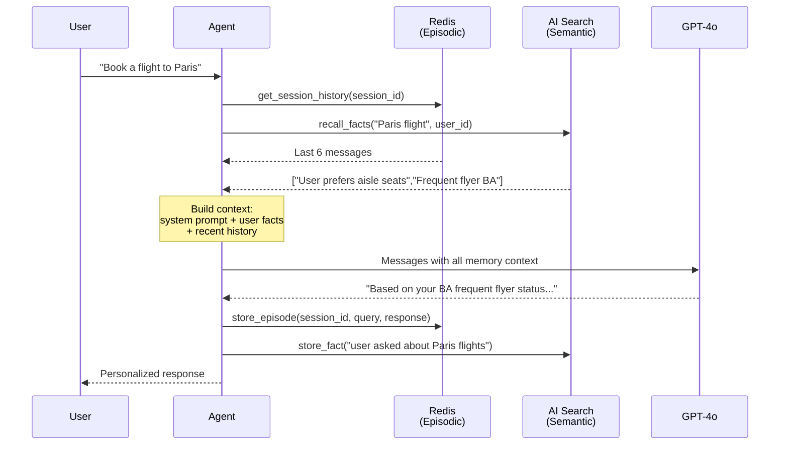

# 21 — Memory Systems for AI Agents

> **Level:** Advanced | **Time to complete:** 4 hours | **Azure services:** Azure Cache for Redis, Azure Cosmos DB, Azure AI Search, Azure Blob Storage

---

## 1. Overview

Memory is what distinguishes an agent from a stateless API call. Without memory, every agent interaction starts from zero. With a well-designed memory system, agents build up knowledge, maintain context across long conversations, learn from past interactions, and recall relevant history when needed.

---

## 2. Memory Taxonomy



---

## 2.1 Memory Access at Query Time



---

## 3. In-Context Memory Management

### 3.1 Conversation Window Strategies

```python
# context_window.py — manage conversation history within token budget
import tiktoken
from openai import AzureOpenAI

client = AzureOpenAI(...)

def count_tokens(messages: list[dict], model: str = "gpt-4o") -> int:
    """Count tokens for a message list using tiktoken."""
    enc = tiktoken.encoding_for_model("gpt-4o")
    total = 3  # Base overhead per conversation
    for message in messages:
        total += 4  # Per-message overhead
        for key, value in message.items():
            if isinstance(value, str):
                total += len(enc.encode(value))
    return total


class ConversationWindowManager:
    """Keeps conversation history within a token budget."""

    def __init__(self, max_tokens: int = 12000, model: str = "gpt-4o"):
        self.max_tokens = max_tokens
        self.model = model
        self.messages: list[dict] = []

    def add_message(self, role: str, content: str) -> None:
        self.messages.append({"role": role, "content": content})
        self._trim_to_budget()

    def _trim_to_budget(self) -> None:
        """Remove oldest messages (preserve system) when over budget."""
        system_messages = [m for m in self.messages if m["role"] == "system"]
        non_system = [m for m in self.messages if m["role"] != "system"]

        while count_tokens(system_messages + non_system) > self.max_tokens:
            if len(non_system) <= 2:
                break
            non_system.pop(0)  # Remove oldest non-system message

        self.messages = system_messages + non_system

    def get_context(self) -> list[dict]:
        return self.messages
```

### 3.2 Conversation Summarization

```python
# summarization_memory.py — summarize old history to free context space
from openai import AzureOpenAI

client = AzureOpenAI(...)


class SummaryMemory:
    """
    Running summary memory: when conversation gets long,
    summarize oldest messages and keep summary in context.
    """

    def __init__(self, summary_threshold: int = 8000, keep_recent: int = 6):
        self.summary: str = ""
        self.recent_messages: list[dict] = []
        self.summary_threshold = summary_threshold
        self.keep_recent = keep_recent

    def add_message(self, role: str, content: str) -> None:
        self.recent_messages.append({"role": role, "content": content})
        if count_tokens(self.recent_messages) > self.summary_threshold:
            self._summarize_and_compress()

    def _summarize_and_compress(self) -> None:
        """Summarize messages older than keep_recent into a rolling summary."""
        to_summarize = self.recent_messages[:-self.keep_recent]
        self.recent_messages = self.recent_messages[-self.keep_recent:]

        summary_prompt = f"""Create a concise summary of this conversation history.
Include: key topics discussed, decisions made, user preferences revealed, unresolved items.

Previous summary (if any): {self.summary}

New messages to incorporate:
{[f"{m['role']}: {m['content'][:300]}" for m in to_summarize]}"""

        response = client.chat.completions.create(
            model="gpt-4o",
            messages=[{"role": "user", "content": summary_prompt}],
            max_tokens=500,
            temperature=0,
        )
        self.summary = response.choices[0].message.content

    def get_context(self) -> list[dict]:
        messages = []
        if self.summary:
            messages.append({
                "role": "system",
                "content": f"[Previous conversation summary]: {self.summary}",
            })
        messages.extend(self.recent_messages)
        return messages
```

---

## 3.3 Conversation Window vs. Summary Memory

```mermaid
graph TB
    subgraph WINDOW["Sliding Window (simple)"]
        W1["Turn 1"] --> W2["Turn 2"] --> W3["..."] --> W_N["Turn N (keep last 10)"]
        W_EARLY["Turns 1-N-10"] -->|"DROPPED ❌"| GONE["Lost context"]
    end

    subgraph SUMMARY["Running Summary (smart)"]
        S1["Turns 1-10"] -->|"Summarize → 200 tokens"| SUM["Summary Block\n'User: engineer at Contoso,\nprefers concise answers,\nasked about Azure costs'"]
        SUM --> S11["Turn 11"] --> S12["Turn 12"] --> S_N["Turn N"]
        Note["Full context preserved\neven at turn 100"]
    end

    classDef primary   fill:#0078d4,color:#fff,stroke:#005a9e
    classDef secondary fill:#7b2d8b,color:#fff,stroke:#5a1a6b
    classDef storage   fill:#2d7d4a,color:#fff,stroke:#1f5c35
    classDef security  fill:#c7372f,color:#fff,stroke:#a02020
    classDef monitor   fill:#e67300,color:#fff,stroke:#b35500
    classDef success   fill:#27ae60,color:#fff,stroke:#1e8449
    classDef warning   fill:#f39c12,color:#333,stroke:#d68910
    classDef neutral   fill:#f3f3f3,color:#333,stroke:#999
    classDef user      fill:#cce5ff,color:#004085,stroke:#004085
    classDef decision  fill:#fff3cd,color:#856404,stroke:#856404
    classDef highlight fill:#e74c3c,color:#fff,stroke:#c0392b

    class W1 neutral
    class W2 neutral
    class W3 neutral
    class W_N primary
    class W_EARLY warning
    class GONE highlight
    class S1 neutral
    class SUM storage
    class S11 neutral
    class S12 neutral
    class S_N primary
    class Note success
```



---

## 3.4 Context Rot

**Context rot** is the gradual degradation of LLM response quality as a conversation grows long. It happens because the model's attention is spread across an ever-growing token window — earlier, highly relevant context gets "drowned out" by the sheer volume of later messages, and the model starts to contradict, forget, or ignore earlier instructions.

```mermaid
graph TB
    subgraph HEALTHY["Short Conversation (< 20 turns)"]
        H_SYS["System prompt\n(instructions, persona)"] --> H_EARLY["Turns 1–5\n(crisp, relevant)"]
        H_EARLY --> H_OUT["High-quality output\nFollows instructions precisely"]
    end

    subgraph ROT["Long Conversation (50+ turns)"]
        R_SYS["System prompt\n(instructions, persona)"] --> R_NOISE["Turns 1–40\n(redundant, off-topic noise\naccumulated over session)"]
        R_NOISE --> R_LATE["Turns 41–50"]
        R_LATE --> R_OUT["Degraded output:\n• Ignores original persona\n• Contradicts earlier answers\n• Loses formatting constraints"]
    end

    classDef primary   fill:#0078d4,color:#fff,stroke:#005a9e
    classDef secondary fill:#7b2d8b,color:#fff,stroke:#5a1a6b
    classDef storage   fill:#2d7d4a,color:#fff,stroke:#1f5c35
    classDef security  fill:#c7372f,color:#fff,stroke:#a02020
    classDef monitor   fill:#e67300,color:#fff,stroke:#b35500
    classDef success   fill:#27ae60,color:#fff,stroke:#1e8449
    classDef warning   fill:#f39c12,color:#333,stroke:#d68910
    classDef neutral   fill:#f3f3f3,color:#333,stroke:#999
    classDef user      fill:#cce5ff,color:#004085,stroke:#004085
    classDef decision  fill:#fff3cd,color:#856404,stroke:#856404
    classDef highlight fill:#e74c3c,color:#fff,stroke:#c0392b

    class H_SYS secondary
    class H_EARLY neutral
    class H_OUT success
    class R_SYS secondary
    class R_NOISE warning
    class R_LATE neutral
    class R_OUT highlight
```



### Root Causes of Context Rot

| Cause | Description | Signal |
|---|---|---|
| Token dilution | System prompt instructions lose weight as conversation grows | Model ignores formatting, persona |
| Recency bias | Model focuses on the last few messages; early constraints fade | Earlier answers contradicted |
| Noise accumulation | Irrelevant tangents fill the window and crowd signal | Off-topic tangents or drift |
| Context window overflow | Total tokens exceed the model's limit; early tokens truncated | Instructions missing from behaviour |

### Mitigation Strategies

```python
# context_rot_mitigation.py
import asyncio
from openai import AsyncAzureOpenAI
from pydantic import BaseModel

class ConversationManager:
    def __init__(self, max_turns: int = 15, summary_every: int = 10):
        self._client = AsyncAzureOpenAI(
            azure_endpoint=os.environ["AZURE_OPENAI_ENDPOINT"],
            api_key=os.environ["AZURE_OPENAI_API_KEY"],
            api_version="2024-12-01-preview",
        )
        self._system_prompt = ""
        self._history: list[dict] = []
        self._max_turns = max_turns
        self._summary_every = summary_every
        self._turn_count = 0

    async def chat(self, user_message: str) -> str:
        self._history.append({"role": "user", "content": user_message})
        self._turn_count += 1

        # Summarize and compress when window grows large
        if self._turn_count % self._summary_every == 0:
            await self._compress_history()

        messages = [{"role": "system", "content": self._system_prompt}] + self._history
        response = await self._client.chat.completions.create(
            model=os.environ["AZURE_OPENAI_DEPLOYMENT"],
            messages=messages,
        )
        reply = response.choices[0].message.content
        self._history.append({"role": "assistant", "content": reply})
        return reply

    async def _compress_history(self) -> None:
        # Summarize the oldest half of history into a single context block
        cutoff = len(self._history) // 2
        to_summarize = self._history[:cutoff]
        summary_prompt = (
            "Summarize the following conversation history into 3–5 bullet points "
            "capturing all facts, decisions, and preferences stated by the user:\n\n"
            + "\n".join(f"{m['role']}: {m['content']}" for m in to_summarize)
        )
        summary_response = await self._client.chat.completions.create(
            model=os.environ["AZURE_OPENAI_DEPLOYMENT"],
            messages=[{"role": "user", "content": summary_prompt}],
        )
        summary_text = summary_response.choices[0].message.content
        compressed = {"role": "system", "content": f"[Prior conversation summary]\n{summary_text}"}
        # Replace old turns with the compressed summary
        self._history = [compressed] + self._history[cutoff:]
```

### Context Rot vs Token Limit Overflow

| Problem | When it occurs | Symptom | Fix |
|---|---|---|---|
| **Context rot** | Long before token limit | Quality degrades; model ignores instructions | Summarize + prune history |
| **Token limit overflow** | When total tokens > model limit (128K, 200K) | API error: `context_length_exceeded` | Hard truncation or summarize |
| **Recency bias** | Any conversation length | Model prioritises last message over earlier constraints | Reinforce key constraints in each system prompt |

> **Interview answer:** *"Context rot is a quality problem, not a hard error. The model doesn't crash — it silently starts ignoring earlier instructions as the conversation grows because attention is spread too thin. The fix is proactive conversation management: summarize older turns into a compressed block every N turns, enforce a token budget in code (not just at the API), and re-inject critical constraints (e.g., output format, persona) into a pinned system message that is always at position 0 of the message list."*

---

## 4. Episodic Memory with Redis

```python
# episodic_memory.py — store and retrieve past interactions by similarity
import asyncio
import json
import uuid
from datetime import datetime
from redis.asyncio import Redis
from openai import AsyncAzureOpenAI
import numpy as np

aoai = AsyncAzureOpenAI(...)
redis = Redis.from_url(os.environ["REDIS_URL"], decode_responses=True)

EPISODE_KEY_PREFIX = "episode:"


async def embed(text: str) -> list[float]:
    resp = await aoai.embeddings.create(
        model="text-embedding-3-large",
        input=[text],
        dimensions=1536,
    )
    return resp.data[0].embedding


async def store_episode(
    session_id: str,
    user_query: str,
    agent_response: str,
    outcome: str = "completed",
) -> str:
    """Store a completed interaction as an episodic memory."""
    episode_id = str(uuid.uuid4())
    summary = f"User asked: {user_query[:200]}. Agent responded about: {agent_response[:200]}"
    embedding = await embed(summary)

    episode = {
        "id": episode_id,
        "session_id": session_id,
        "query": user_query,
        "response_summary": agent_response[:500],
        "outcome": outcome,
        "timestamp": datetime.utcnow().isoformat(),
        "embedding": embedding,
    }

    # Store episode with embedding
    await redis.setex(
        f"{EPISODE_KEY_PREFIX}{episode_id}",
        60 * 60 * 24 * 90,  # 90-day TTL
        json.dumps({k: v for k, v in episode.items() if k != "embedding"}),
    )

    # Store embedding separately as float list (for similarity search)
    await redis.setex(
        f"{EPISODE_KEY_PREFIX}{episode_id}:embedding",
        60 * 60 * 24 * 90,
        json.dumps(embedding),
    )

    # Add to session index
    await redis.lpush(f"session:{session_id}:episodes", episode_id)
    await redis.expire(f"session:{session_id}:episodes", 60 * 60 * 24 * 90)

    return episode_id


async def recall_relevant_episodes(
    query: str,
    session_id: str,
    top_k: int = 3,
    min_similarity: float = 0.75,
) -> list[dict]:
    """Retrieve past episodes most similar to the current query."""
    query_embedding = await embed(query)

    # Get all episode IDs for this session
    episode_ids = await redis.lrange(f"session:{session_id}:episodes", 0, -1)

    # Score each episode
    scored = []
    for eid in episode_ids:
        emb_data = await redis.get(f"{EPISODE_KEY_PREFIX}{eid}:embedding")
        if not emb_data:
            continue
        ep_embedding = json.loads(emb_data)

        # Cosine similarity
        a = np.array(query_embedding)
        b = np.array(ep_embedding)
        similarity = float(np.dot(a, b) / (np.linalg.norm(a) * np.linalg.norm(b)))

        if similarity >= min_similarity:
            ep_data = await redis.get(f"{EPISODE_KEY_PREFIX}{eid}")
            if ep_data:
                ep = json.loads(ep_data)
                ep["similarity"] = similarity
                scored.append(ep)

    # Sort by similarity, return top-k
    scored.sort(key=lambda x: x["similarity"], reverse=True)
    return scored[:top_k]
```

---

## 5. Semantic Memory with Azure AI Search

```python
# semantic_memory.py — long-term fact storage and retrieval
from azure.search.documents.aio import SearchClient
from azure.search.documents.models import VectorizedQuery
from azure.search.documents.indexes import SearchIndexClient
from azure.identity.aio import DefaultAzureCredential
import uuid, json, os

MEMORY_INDEX = "agent-semantic-memory"


async def store_fact(
    fact: str,
    category: str,
    agent_id: str,
    source: str = "agent",
) -> str:
    """Store a fact in semantic memory."""
    credential = DefaultAzureCredential()
    search_client = SearchClient(
        os.environ["AZURE_SEARCH_ENDPOINT"],
        MEMORY_INDEX,
        credential,
    )

    embedding = (await aoai.embeddings.create(
        model="text-embedding-3-large",
        input=[fact],
        dimensions=1536,
    )).data[0].embedding

    fact_id = str(uuid.uuid4())
    async with search_client:
        await search_client.upload_documents([{
            "id": fact_id,
            "fact": fact,
            "category": category,
            "agent_id": agent_id,
            "source": source,
            "created_at": datetime.utcnow().isoformat(),
            "embedding": embedding,
        }])

    return fact_id


async def recall_facts(
    query: str,
    agent_id: str,
    category: str | None = None,
    top_k: int = 5,
) -> list[str]:
    """Retrieve facts most relevant to the current query."""
    credential = DefaultAzureCredential()
    search_client = SearchClient(
        os.environ["AZURE_SEARCH_ENDPOINT"],
        MEMORY_INDEX,
        credential,
    )

    query_embedding = (await aoai.embeddings.create(
        model="text-embedding-3-large",
        input=[query],
        dimensions=1536,
    )).data[0].embedding

    filter_expr = f"agent_id eq '{agent_id}'"
    if category:
        filter_expr += f" and category eq '{category}'"

    async with search_client:
        results = await search_client.search(
            search_text=query,
            vector_queries=[VectorizedQuery(
                vector=query_embedding,
                k_nearest_neighbors=top_k * 2,
                fields="embedding",
            )],
            filter=filter_expr,
            select=["fact", "category", "source"],
            top=top_k,
        )
        facts = []
        async for r in results:
            facts.append(r["fact"])

    return facts
```

---

## 6. Full Agent with All Memory Types

```python
# memory_agent.py — agent using all 4 memory types
import asyncio
from openai import AsyncAzureOpenAI

aoai = AsyncAzureOpenAI(...)


async def run_memory_agent(
    user_message: str,
    session_id: str,
    user_id: str,
) -> str:
    """Agent that uses all four memory layers."""

    # 1. Retrieve relevant episodic memories
    past_episodes = await recall_relevant_episodes(user_message, session_id, top_k=2)
    episode_context = "\n".join([
        f"- Past interaction ({e['timestamp'][:10]}): {e['query'][:100]} → {e['response_summary'][:150]}"
        for e in past_episodes
    ])

    # 2. Retrieve relevant semantic facts about this user
    user_facts = await recall_facts(user_message, agent_id=f"user:{user_id}", top_k=3)
    fact_context = "\n".join([f"- {f}" for f in user_facts]) if user_facts else "No prior facts."

    # 3. Build system prompt with memory context
    system_prompt = f"""You are a personal AI assistant with memory.

What you know about this user:
{fact_context}

Relevant past conversations:
{episode_context if episode_context else 'No relevant past conversations.'}

Always be consistent with what you know about the user.
If the user mentions something new about themselves, note it.
"""

    # 4. Get in-context window (procedural: conversation window manager)
    window = ConversationWindowManager(max_tokens=12000)
    window.add_message("system", system_prompt)
    window.add_message("user", user_message)

    # 5. Generate response
    response = await aoai.chat.completions.create(
        model="gpt-4o",
        messages=window.get_context(),
        temperature=0.3,
    )
    answer = response.choices[0].message.content

    # 6. Store this interaction as episodic memory
    await store_episode(session_id, user_message, answer)

    # 7. Extract and store any new semantic facts
    facts_prompt = f"""Extract any NEW facts about the user from this exchange.
Only extract clear, persistent facts (preferences, constraints, background).
Not temporary states ("I'm tired today"). 

User message: {user_message}
Return JSON: {{"new_facts": [str]}} or {{"new_facts": []}} if none."""

    facts_response = await aoai.chat.completions.create(
        model="gpt-4o-mini",
        messages=[{"role": "user", "content": facts_prompt}],
        response_format={"type": "json_object"},
        temperature=0,
    )
    import json
    new_facts = json.loads(facts_response.choices[0].message.content).get("new_facts", [])
    for fact in new_facts:
        await store_fact(fact, category="user_preference", agent_id=f"user:{user_id}")

    return answer
```

---

## 7. Production Checklist

- [ ] Memory TTL configured: episodic memory expires (90 days), semantic memory persists
- [ ] Context window budget managed: running summary when > 70% full
- [ ] Semantic deduplication: don't store the same fact twice (embed + similarity check before insert)
- [ ] Memory access time measured: retrieval must add < 200ms to response latency
- [ ] Memory scoped by user/agent: user A cannot read user B's memories
- [ ] Memory contents subject to data governance: PII retained only if consent given

---

## 8. Interview Q&A

### Q1 (Intermediate): What are the four types of agent memory and what are they used for?

**Answer:** (1) **In-context (working) memory** — the current conversation messages within the LLM's context window. It's instantaneous but ephemeral and limited in size. Used for: the current exchange. (2) **Episodic memory** — records of past interactions: what was asked, what the agent did, and what the outcome was. Retrieved by recency or semantic similarity. Used for: learning from past mistakes, recalling what a user has previously asked. (3) **Semantic memory** — factual knowledge: domain facts, user preferences, entity information. Stored in a vector database, retrieved by semantic similarity. Used for: "Does this user prefer detailed or concise answers?", "What is our policy on returns?". (4) **Procedural memory** — how-to knowledge: system prompts, task templates, agent instructions. Stored in config files, prompt registries. Used for: giving the agent its role, behavior rules, and task-specific instructions.

### Q2 (Advanced): How do you prevent memory poisoning in an AI agent system?

**Answer:** Memory poisoning is when incorrect or adversarial information gets stored in an agent's memory and persistently degrades future behavior. Prevention strategies: (1) **Source trust scoring** — tag all memories with their source; don't auto-store facts from LLM-generated summaries of external content (wait for human confirmation); (2) **Fact validation** — before storing a new semantic fact, check if it contradicts existing high-confidence facts; flag contradictions for human review; (3) **Confidence scoring** — store memories with a confidence level (1-5); low-confidence memories are shown but not used to override instructions; (4) **Memory provenance** — log which input caused each memory to be stored; enable audit and deletion; (5) **User-controlled memory** — expose a `/memory` endpoint where users can view and delete stored facts; (6) **Hallucination prevention** — facts extracted by LLM have lower initial confidence than facts confirmed by external tools (e.g., facts from a database query are more reliable than LLM-inferred facts). Memory poisoning is especially dangerous in agentic systems where bad memories trigger wrong actions — not just bad responses.

---

## Cross-links

- Previous: [20 — Function Calling](./20-Function-Calling.md)
- Next: [22 — Planning and Reasoning](./22-Planning-and-Reasoning.md)
- Related: [07 — LangGraph](./07-LangGraph.md) | [06 — LangChain](./06-LangChain.md) | [10 — Multi-Agent Systems](./10-Multi-Agent-Systems.md)

---

*Module 21 | Series: Enterprise Agentic AI Tutorial | Last updated: June 2026*
