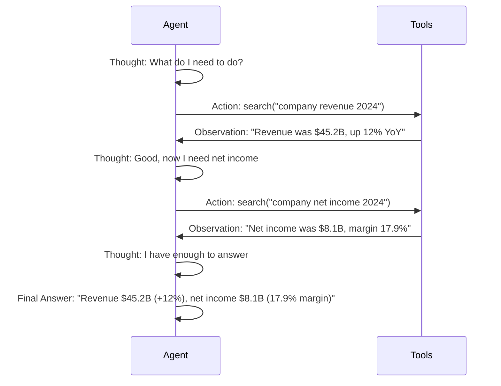
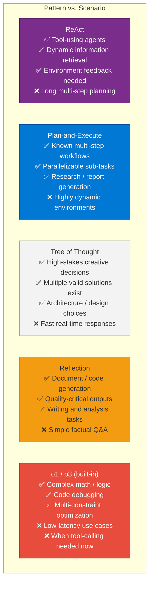

# 22 — Planning and Reasoning

> **Level:** Advanced | **Time to complete:** 4 hours | **Azure services:** Azure OpenAI (o1/o3 series)

---

## 1. Overview

Planning and reasoning are the cognitive capabilities that allow agents to decompose complex goals into steps, choose between approaches, recover from failures, and make decisions under uncertainty. This module covers the major reasoning patterns — ReAct, Tree of Thought, Plan-and-Execute, Reflection, and Self-Consistency — and how to implement them on Azure.

---

## 2. Reasoning Patterns Map

```mermaid
mindmap
    root["LLM Reasoning Patterns"]
        "Direct (Zero-hop)"
            "One prompt → answer"
            "Works for simple facts"
        "Chain of Thought (CoT)"
            "Step-by-step reasoning"
            "Show your work"
            "Self-consistency: sample N, vote"
        "ReAct"
            "Interleave Reasoning + Action"
            "Thought → Action → Observation → loop"
            "Grounded in real-world feedback"
        "Plan-and-Execute"
            "Planner: make a plan first"
            "Executor: execute each step"
            "Re-plan if step fails"
        "Tree of Thought (ToT)"
            "Generate multiple reasoning paths"
            "Score/evaluate each path"
            "Backtrack on dead ends"
        "Reflection"
            "Agent critiques its own output"
            "Identifies errors or gaps"
            "Revises and improves"
        "Debate"
            "Multiple agents argue positions"
            "Reduces sycophancy"
            "Better for controversial decisions"
```

---

## 3. ReAct — Deep Dive

ReAct (Reasoning + Acting) interleaves reasoning steps with tool calls, grounding each reasoning step in real-world observations.



```python
# react_agent.py
import asyncio
import re
from openai import AsyncAzureOpenAI

aoai = AsyncAzureOpenAI(...)

REACT_SYSTEM_PROMPT = """You are a research assistant that reasons step-by-step and uses tools.

At each step, write:
Thought: [Your reasoning about what to do next]
Action: [tool_name("argument")]

After each Observation, continue with the next Thought/Action until you have enough to answer.
When done, write:
Final Answer: [your complete answer]

Available tools:
- search("query") — web/knowledge base search
- calculator("expression") — math calculations
- lookup_database("entity_name") — look up entity in internal DB

Do not call tools that aren't listed above.
"""

TOOL_REGISTRY = {
    "search": lambda q: f"Search results for '{q}': [Relevant information found]",
    "calculator": lambda expr: str(eval(expr.replace("^", "**"))),  # Simplified — use ast.literal_eval in production
    "lookup_database": lambda entity: f"Database record for {entity}: {{status: active}}",
}


def parse_action(action_str: str) -> tuple[str, str] | None:
    """Parse 'tool_name("arg")' format."""
    match = re.match(r'(\w+)\("(.+)"\)', action_str.strip())
    if match:
        return match.group(1), match.group(2)
    return None


async def react_agent(user_query: str, max_steps: int = 8) -> str:
    messages = [
        {"role": "system", "content": REACT_SYSTEM_PROMPT},
        {"role": "user", "content": user_query},
    ]

    for step in range(max_steps):
        response = await aoai.chat.completions.create(
            model="gpt-4o",
            messages=messages,
            stop=["Observation:"],  # Stop BEFORE writing the observation — we inject it
            temperature=0,
        )

        text = response.choices[0].message.content
        messages.append({"role": "assistant", "content": text})

        # Extract Action if present
        action_match = re.search(r"Action:\s*(.+?)(?:\n|$)", text)
        final_match = re.search(r"Final Answer:\s*(.+)", text, re.DOTALL)

        if final_match:
            return final_match.group(1).strip()

        if action_match:
            action_str = action_match.group(1).strip()
            parsed = parse_action(action_str)

            if parsed:
                tool_name, tool_arg = parsed
                tool_fn = TOOL_REGISTRY.get(tool_name)
                if tool_fn:
                    try:
                        observation = tool_fn(tool_arg)
                    except Exception as e:
                        observation = f"Error: {e}"
                else:
                    observation = f"Unknown tool: {tool_name}"
            else:
                observation = "Could not parse action format."

            # Inject observation and continue
            messages.append({
                "role": "user",
                "content": f"Observation: {observation}\n",
            })
        else:
            # No action or final answer — model is stuck
            break

    return "Could not complete the task within step limit."
```

---

## 4. Plan-and-Execute

```python
# plan_and_execute.py
import asyncio
import json
from openai import AsyncAzureOpenAI

aoai = AsyncAzureOpenAI(...)


async def create_plan(goal: str) -> list[str]:
    """Generate an ordered execution plan."""
    response = await aoai.chat.completions.create(
        model="gpt-4o",
        messages=[
            {"role": "system", "content": """You are a planning expert. 
Break this goal into 3-7 concrete, sequential steps.
Each step should be atomic (one specific action), testable (clear success condition), and necessary.
Return JSON: {"steps": [str]}"""},
            {"role": "user", "content": f"Goal: {goal}"},
        ],
        response_format={"type": "json_object"},
        temperature=0,
    )
    return json.loads(response.choices[0].message.content).get("steps", [])


async def execute_step(step: str, context: str, tools: dict) -> dict:
    """Execute a single step, returning result and whether it succeeded."""
    response = await aoai.chat.completions.create(
        model="gpt-4o",
        messages=[
            {"role": "system", "content": "Execute this task step. Return JSON: {result: str, success: bool, output: str}"},
            {"role": "user", "content": f"Step: {step}\n\nContext from previous steps:\n{context}"},
        ],
        response_format={"type": "json_object"},
        temperature=0.1,
    )
    return json.loads(response.choices[0].message.content)


async def replan_if_needed(
    original_goal: str,
    completed_steps: list[str],
    failed_step: str,
    failure_reason: str,
) -> list[str]:
    """Generate a revised plan after a step failure."""
    response = await aoai.chat.completions.create(
        model="gpt-4o",
        messages=[
            {"role": "system", "content": "You are a re-planning expert. Given a failed step, create a revised plan to still achieve the goal."},
            {"role": "user", "content": f"""Goal: {original_goal}
Steps already completed: {completed_steps}
Failed step: {failed_step}
Failure reason: {failure_reason}
Create revised remaining steps. Return JSON: {{"revised_steps": [str]}}"""},
        ],
        response_format={"type": "json_object"},
        temperature=0,
    )
    return json.loads(response.choices[0].message.content).get("revised_steps", [])


async def plan_and_execute(goal: str) -> dict:
    """Full plan-and-execute loop with re-planning on failure."""
    steps = await create_plan(goal)
    print(f"Plan: {steps}")

    context = ""
    completed = []
    results = []

    remaining_steps = list(steps)
    while remaining_steps:
        step = remaining_steps.pop(0)
        print(f"\nExecuting: {step}")

        result = await execute_step(step, context, tools={})

        if result.get("success"):
            context += f"\nStep '{step}': {result.get('output', '')}"
            completed.append(step)
            results.append({"step": step, "status": "success", "output": result.get("output")})
        else:
            print(f"Step failed: {result.get('output', '')}")
            # Re-plan from this point
            revised = await replan_if_needed(goal, completed, step, result.get("output", ""))
            remaining_steps = revised  # Replace remaining steps with revised plan
            results.append({"step": step, "status": "failed", "replanned": True})

    return {"goal": goal, "steps": results, "context": context}
```

---

## 5. Tree of Thought (ToT)

```python
# tree_of_thought.py
import asyncio
from openai import AsyncAzureOpenAI

aoai = AsyncAzureOpenAI(...)


async def generate_thoughts(
    problem: str,
    current_state: str,
    n_thoughts: int = 3,
) -> list[str]:
    """Generate N candidate reasoning steps from current state."""
    response = await aoai.chat.completions.create(
        model="gpt-4o",
        messages=[
            {"role": "system", "content": f"""Generate {n_thoughts} different reasoning steps that could be taken next.
Each should be distinct and explore a different approach.
Return JSON: {{"thoughts": [str]}}"""},
            {"role": "user", "content": f"Problem: {problem}\nCurrent state: {current_state}"},
        ],
        response_format={"type": "json_object"},
        temperature=0.7,
    )
    import json
    return json.loads(response.choices[0].message.content).get("thoughts", [])


async def evaluate_thought(
    problem: str,
    thought: str,
    scoring_criteria: str,
) -> float:
    """Score a thought on how promising it is (0-10)."""
    response = await aoai.chat.completions.create(
        model="gpt-4o",
        messages=[
            {"role": "system", "content": f"""Score this reasoning step on how promising it is for solving the problem.
Criteria: {scoring_criteria}
Return JSON: {{"score": 0-10, "reasoning": str}}"""},
            {"role": "user", "content": f"Problem: {problem}\nThought: {thought}"},
        ],
        response_format={"type": "json_object"},
        temperature=0,
    )
    import json
    result = json.loads(response.choices[0].message.content)
    return float(result.get("score", 5))


async def tree_of_thought_search(
    problem: str,
    max_depth: int = 3,
    branching_factor: int = 3,
    beam_width: int = 2,
) -> str:
    """Beam search through reasoning tree, keeping top beam_width paths."""
    # Each path: list of (thought, score) tuples
    beams = [{"path": [], "state": "Initial state"}]

    for depth in range(max_depth):
        candidates = []

        for beam in beams:
            thoughts = await generate_thoughts(problem, beam["state"], branching_factor)
            scores = await asyncio.gather(*[
                evaluate_thought(problem, t, "logical consistency, relevance, progress toward solution")
                for t in thoughts
            ])

            for thought, score in zip(thoughts, scores):
                candidates.append({
                    "path": beam["path"] + [(thought, score)],
                    "state": thought,
                    "total_score": sum(s for _, s in beam["path"]) + score,
                })

        # Keep top beam_width candidates
        candidates.sort(key=lambda x: x["total_score"], reverse=True)
        beams = candidates[:beam_width]

    # Return the best path
    best_path = beams[0]["path"]
    return "\n".join([f"Step {i+1}: {thought}" for i, (thought, _) in enumerate(best_path)])
```

---

## 6. Reflection Pattern

```python
# reflection.py — agent critiques and revises its own outputs
import asyncio
from openai import AsyncAzureOpenAI

aoai = AsyncAzureOpenAI(...)


async def generate_with_reflection(
    task: str,
    max_iterations: int = 3,
    quality_threshold: float = 8.0,
) -> str:
    """Generate output, reflect on it, revise until quality threshold met."""

    draft = ""
    for iteration in range(max_iterations):
        if not draft:
            # First iteration: generate initial draft
            response = await aoai.chat.completions.create(
                model="gpt-4o",
                messages=[{"role": "user", "content": task}],
                temperature=0.3,
            )
            draft = response.choices[0].message.content
            print(f"Initial draft generated ({len(draft)} chars)")
        else:
            # Subsequent iterations: revise based on critique
            response = await aoai.chat.completions.create(
                model="gpt-4o",
                messages=[
                    {"role": "user", "content": task},
                    {"role": "assistant", "content": draft},
                    {"role": "user", "content": f"""Please revise your response based on this critique:
{critique}

Produce an improved version that addresses all the critique points."""},
                ],
                temperature=0.3,
            )
            draft = response.choices[0].message.content

        # Critique the draft
        critique_response = await aoai.chat.completions.create(
            model="gpt-4o",
            messages=[
                {"role": "system", "content": """Be a strict, honest critic. Evaluate this output and identify specific weaknesses.
Return JSON: {"quality_score": 1-10, "issues": [str], "strengths": [str], "needs_revision": bool}"""},
                {"role": "user", "content": f"Task: {task}\n\nOutput to evaluate:\n{draft}"},
            ],
            response_format={"type": "json_object"},
            temperature=0,
        )
        import json
        critique_data = json.loads(critique_response.choices[0].message.content)
        critique = "\n".join(critique_data.get("issues", []))
        quality = critique_data.get("quality_score", 5)

        print(f"Iteration {iteration + 1}: quality={quality}, issues={critique_data.get('issues', [])}")

        if quality >= quality_threshold or not critique_data.get("needs_revision", True):
            print(f"Quality threshold reached at iteration {iteration + 1}")
            break

    return draft
```

---

## 6.1 Reasoning Pattern Comparison



## 7. o1 and o3 Models — Built-in Reasoning

```python
# o1_reasoning.py — use Azure OpenAI o1/o3 for complex reasoning tasks
from openai import AzureOpenAI
import os

client = AzureOpenAI(
    azure_endpoint=os.environ["AZURE_OPENAI_ENDPOINT"],
    api_key=os.environ["AZURE_OPENAI_API_KEY"],
    api_version="2025-03-01-preview",
)


def reason_with_o1(problem: str, reasoning_effort: str = "high") -> str:
    """
    Use o1/o3 for problems requiring deep multi-step reasoning.
    o1/o3 does internal chain-of-thought — you don't need to prompt for it.
    reasoning_effort: "low" | "medium" | "high" (controls compute/cost)
    """
    response = client.chat.completions.create(
        model="o3",  # or "o1", "o1-mini"
        messages=[
            {
                "role": "user",
                "content": problem,
            }
        ],
        reasoning_effort=reasoning_effort,
        max_completion_tokens=16000,
    )
    return response.choices[0].message.content


# When to use o1/o3 vs GPT-4o:
# o1/o3: Complex multi-step math, logical deduction, code debugging, planning
# GPT-4o: Conversation, summarization, extraction, RAG, tool calling
```

---

## 8. Production Checklist

- [ ] Reasoning pattern matched to task: ReAct for tool-using, Plan-Execute for long tasks, Reflection for quality-critical
- [ ] Max step limits enforced to prevent infinite loops
- [ ] Intermediate reasoning logged (thoughts, plans) for debugging
- [ ] Re-planning triggered on step failure — not silent failure
- [ ] Self-consistency sampling used for high-stakes decisions (majority vote over N samples)
- [ ] o1/o3 used for reasoning-intensive sub-tasks; GPT-4o for all other tasks (cost/speed)

---

## 9. Interview Q&A

### Q1 (Intermediate): Explain the ReAct pattern and how it differs from Chain of Thought.

**Answer:** Chain of Thought (CoT) is a prompt technique where the model is asked to reason step-by-step before giving a final answer — it's all in one LLM call, and the reasoning is internal. ReAct (Reasoning + Acting) interleaves reasoning with external actions: Thought → Action (tool call) → Observation → Thought → Action → ... The key difference is that ReAct grounds its reasoning in real-world observations. Instead of reasoning about what the stock price might be, ReAct calls a search tool and gets the actual price. This makes ReAct better for: tasks requiring factual lookups, multi-step tasks where early results affect later steps, tasks where the agent needs to react to changing information. CoT is better for: pure reasoning tasks (math, logic), where external tools aren't available, or where speed is critical (one LLM call vs many).

### Q2 (Advanced): When would you use Tree of Thought vs. Plan-and-Execute for an agent?

**Answer:** Tree of Thought (ToT) is best for: open-ended problems where there are multiple valid approaches and it's not clear which is best (creative writing, architectural decisions, proof strategies), problems where early decisions gate later options (you need to explore and potentially backtrack), and tasks where the search space is small enough to enumerate. ToT is expensive — it generates branching_factor × depth LLM calls. Plan-and-Execute is best for: structured tasks with a clear goal where you can outline steps in advance (research pipelines, document processing, data analysis), tasks where the plan is mostly fixed (tools available make each step deterministic), and tasks where steps don't require backtracking. In practice: use Plan-and-Execute for 80% of agent tasks (it's simpler and cheaper); use ToT only when you specifically need to explore multiple reasoning paths and have a scoring function to evaluate them.

---

## Cross-links

- Previous: [21 — Memory](./21-Memory.md)
- Next: [23 — Workflow Automation](./23-Workflow-Automation.md)
- Related: [01 — Agentic AI Fundamentals](./01-Agentic-AI-Fundamentals.md) | [07 — LangGraph](./07-LangGraph.md)

---

*Module 22 | Series: Enterprise Agentic AI Tutorial | Last updated: June 2026*
