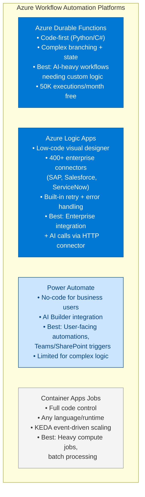
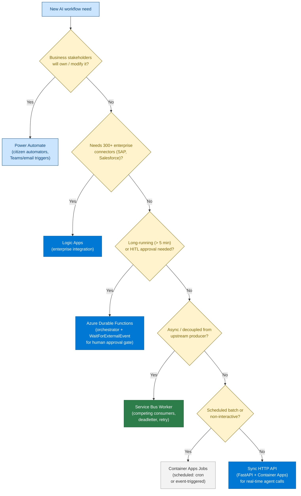

# 23 — Workflow Automation

> **Level:** Intermediate | **Time to complete:** 3 hours | **Azure services:** Azure Logic Apps, Azure Durable Functions, Azure Service Bus, Power Automate, Azure Container Apps

---

## 1. Overview

Workflow automation platforms are the connective tissue of enterprise AI — they trigger agent pipelines in response to business events, integrate AI decisions into existing enterprise workflows, and orchestrate cross-system actions. Where Module 11 covers pure agent orchestration patterns, this module covers how to connect AI agents to the broader enterprise IT landscape.

---

## 2. Azure Workflow Platforms Comparison



| Platform | Who builds | Complexity | AI integration | Cost model |
|---|---|---|---|---|
| **Durable Functions** | Developer | High | Direct SDK | Per execution |
| **Logic Apps (Standard)** | Developer | Medium | HTTP connector, built-in AI | Per workflow run |
| **Power Automate** | Business user | Low | AI Builder, HTTP call | Per-user license |
| **Container Apps Jobs** | DevOps/Developer | High | Full custom | Per vCPU-second |

---

## 3. Azure Logic Apps with AI Agents

Logic Apps can call AI agent APIs (HTTP connector) and react to enterprise events (Service Bus, SharePoint, Teams, email).

```mermaid
graph LR
    TRIGGER["Trigger: New document\nin SharePoint library"]
    HTTP1["HTTP Action:\nPOST /api/classify\n{doc_url, content}"]
    COND["Condition:\nclassification == 'invoice'"]
    HTTP2["HTTP Action:\nPOST /api/extract-invoice\n{doc_url}"]
    D365["Action: Create\nD365 Finance invoice"]
    EMAIL["Action: Send approval\nemail to manager"]
    WAIT["Trigger: HTTP callback\n(manager approves/rejects)"]
    POST["Action: Post to\nAccounts Payable queue"]

    TRIGGER --> HTTP1 --> COND
    COND -->|"yes"| HTTP2 --> D365 --> EMAIL --> WAIT --> POST
    COND -->|"no"| OTHER["Action: Move to\nGeneral folder"]

    classDef primary   fill:#0078d4,color:#fff,stroke:#005a9e
    classDef secondary fill:#7b2d8b,color:#fff,stroke:#5a1a6b
    classDef storage   fill:#2d7d4a,color:#fff,stroke:#1f5c35
    classDef security  fill:#c7372f,color:#fff,stroke:#a02020
    classDef monitor   fill:#e67300,color:#fff,stroke:#b35500
    classDef success   fill:#27ae60,color:#fff,stroke:#1e8449
    classDef warning   fill:#f39c12,color:#333,stroke:#d68910
    classDef neutral   fill:#f3f3f3,color:#333,stroke:#999
    classDef user      fill:#cce5ff,color:#004085,stroke:#004085
    classDef decision  fill:#fff3cd,color:#856404,stroke:#856404
    classDef highlight fill:#e74c3c,color:#fff,stroke:#c0392b

    class TRIGGER user
    class HTTP1 primary
    class COND decision
    class HTTP2 primary
    class D365 storage
    class EMAIL monitor
    class WAIT warning
    class POST storage
    class OTHER neutral
```



### 3.1 Logic Apps ARM/Bicep Definition (Key Parts)

```bicep
// logic_app.bicep — abbreviated example
resource logicApp 'Microsoft.Logic/workflows@2019-05-01' = {
  name: 'invoice-processing-workflow'
  location: location
  properties: {
    state: 'Enabled'
    definition: {
      '$schema': 'https://schema.management.azure.com/providers/Microsoft.Logic/schemas/2016-06-01/workflowdefinition.json#'
      triggers: {
        When_a_file_is_created: {
          type: 'ApiConnection'
          inputs: {
            host: {
              connection: {
                name: '@parameters(\'$connections\')[\'sharepointonline\'][\'connectionId\']'
              }
            }
            method: 'get'
            path: '/datasets/@{encodeURIComponent(encodeURIComponent(\'https://company.sharepoint.com\'))}/tables/@{encodeURIComponent(encodeURIComponent(\'/sites/Finance/Shared Documents/Incoming\'))}/onnewitems'
          }
        }
      }
      actions: {
        Classify_Document: {
          type: 'Http'
          inputs: {
            method: 'POST'
            uri: 'https://ai-agent.azurecontainerapps.io/api/classify'
            headers: {
              'Content-Type': 'application/json'
            }
            body: {
              doc_url: '@triggerBody()?[\'Path\']'
            }
            authentication: {
              type: 'ManagedServiceIdentity'
              audience: 'https://ai-agent.azurecontainerapps.io'
            }
          }
        }
      }
    }
  }
}
```

---

## 4. Hybrid AI Workflow with Durable Functions

```python
# hybrid_workflow.py — Durable Functions orchestrating AI + non-AI steps
import azure.durable_functions as df
import httpx
import json
import os


# === Activity Functions (the actual work) ===

async def classify_document_activity(context: df.DurableActivityContext) -> dict:
    """Call AI classification agent."""
    payload = context.get_input()
    async with httpx.AsyncClient() as client:
        resp = await client.post(
            f"{os.environ['AI_AGENT_URL']}/classify",
            json={"content": payload["content"]},
            timeout=30,
        )
        return resp.json()


async def extract_fields_activity(context: df.DurableActivityContext) -> dict:
    """Call AI field extraction agent."""
    payload = context.get_input()
    async with httpx.AsyncClient() as client:
        resp = await client.post(
            f"{os.environ['AI_AGENT_URL']}/extract",
            json={"content": payload["content"], "doc_type": payload["doc_type"]},
            timeout=60,
        )
        return resp.json()


async def update_erp_activity(context: df.DurableActivityContext) -> dict:
    """Update ERP system (non-AI step)."""
    payload = context.get_input()
    async with httpx.AsyncClient() as client:
        resp = await client.post(
            f"{os.environ['ERP_API_URL']}/api/invoices",
            json=payload,
            headers={"Authorization": f"Bearer {os.environ['ERP_API_KEY']}"},
            timeout=30,
        )
        resp.raise_for_status()
        return {"erp_id": resp.json().get("id"), "status": "created"}


async def send_notification_activity(context: df.DurableActivityContext) -> None:
    """Send Teams/Email notification."""
    payload = context.get_input()
    async with httpx.AsyncClient() as client:
        await client.post(
            os.environ["TEAMS_WEBHOOK_URL"],
            json={"text": f"Invoice {payload['erp_id']} processed: ${payload['amount']:.2f}"},
            timeout=10,
        )


# === Orchestrator ===

def document_processing_orchestrator(context: df.DurableOrchestrationContext):
    """
    Full document processing workflow:
    1. Classify document
    2. Extract fields (if invoice)
    3. Human approval gate for high-value
    4. Update ERP
    5. Send notification
    """
    payload = context.get_input()

    # Step 1: Classify
    classification = yield context.call_activity_with_retry(
        "classify_document_activity",
        input_={"content": payload["content"]},
        retry_options=df.RetryOptions(first_retry_interval_in_milliseconds=5000, max_number_of_attempts=3),
    )

    if classification.get("doc_type") not in ["invoice", "purchase_order"]:
        return {"status": "skipped", "reason": f"Not a financial document: {classification.get('doc_type')}"}

    # Step 2: Extract fields
    extracted = yield context.call_activity_with_retry(
        "extract_fields_activity",
        input_={"content": payload["content"], "doc_type": classification["doc_type"]},
        retry_options=df.RetryOptions(first_retry_interval_in_milliseconds=5000, max_number_of_attempts=3),
    )

    # Step 3: Human approval gate for invoices > $10,000
    amount = float(extracted.get("total_amount", 0))
    if amount > 10_000:
        # Send approval request
        yield context.call_activity("send_notification_activity", {
            "message": f"Invoice for ${amount:.2f} requires your approval",
            "approval_url": f"https://portal.company.com/approve/{context.instance_id}",
        })

        # Wait up to 48h for approval
        approval = context.wait_for_external_event("ApprovalDecision")
        timeout = context.create_timer(
            context.current_utc_datetime + df.timedelta(hours=48)
        )
        winner = yield context.task_any([approval, timeout])

        if winner == timeout:
            return {"status": "timeout", "instance_id": context.instance_id}

        decision = winner.result
        if decision.get("approved") is not True:
            return {"status": "rejected", "reason": decision.get("reason")}

    # Step 4: Update ERP
    erp_result = yield context.call_activity_with_retry(
        "update_erp_activity",
        input_={**extracted, "correlation_id": context.instance_id},
        retry_options=df.RetryOptions(first_retry_interval_in_milliseconds=10_000, max_number_of_attempts=5),
    )

    # Step 5: Notify
    yield context.call_activity("send_notification_activity", {
        "erp_id": erp_result["erp_id"],
        "amount": amount,
    })

    return {
        "status": "completed",
        "doc_type": classification["doc_type"],
        "erp_id": erp_result["erp_id"],
        "amount": amount,
    }


main = df.Orchestrator.create(document_processing_orchestrator)
```

---

## 5. Event-Driven AI with Azure Service Bus

```python
# event_driven_workflow.py — AI agent triggered by Service Bus events
import asyncio
import json
import os
from azure.servicebus.aio import ServiceBusClient
from azure.identity.aio import DefaultAzureCredential
from openai import AsyncAzureOpenAI

aoai = AsyncAzureOpenAI(...)
credential = DefaultAzureCredential()

QUEUE_NAME = "document-processing"
RESULT_TOPIC = "processing-results"


async def process_document(document: dict) -> dict:
    """AI processing pipeline for a single document."""
    response = await aoai.chat.completions.create(
        model="gpt-4o",
        messages=[
            {"role": "system", "content": "Summarize and classify this document. Return JSON: {summary: str, category: str, priority: 1-5}"},
            {"role": "user", "content": document.get("content", "")[:8000]},
        ],
        response_format={"type": "json_object"},
        temperature=0,
    )
    result = json.loads(response.choices[0].message.content)
    result["document_id"] = document.get("id")
    return result


async def run_worker(max_concurrent: int = 5):
    """Service Bus worker that processes messages concurrently."""
    semaphore = asyncio.Semaphore(max_concurrent)

    async with ServiceBusClient(
        fully_qualified_namespace=os.environ["SERVICEBUS_NAMESPACE"],
        credential=credential,
    ) as sb_client:
        receiver = sb_client.get_queue_receiver(QUEUE_NAME, prefetch_count=max_concurrent)
        sender = sb_client.get_topic_sender(RESULT_TOPIC)

        async with receiver, sender:
            async for message in receiver:
                async with semaphore:
                    try:
                        document = json.loads(str(message))
                        result = await process_document(document)

                        # Publish result to topic
                        from azure.servicebus import ServiceBusMessage
                        await sender.send_messages(ServiceBusMessage(json.dumps(result)))
                        await receiver.complete_message(message)

                        print(f"Processed {document.get('id')}: {result.get('category')}")

                    except Exception as e:
                        print(f"Processing failed: {e}")
                        await receiver.abandon_message(message)  # Returns to queue for retry


if __name__ == "__main__":
    asyncio.run(run_worker())
```

---

## 5.1 Workflow Platform Decision Tree



## 5.2 LLM-Native Workflow Design Patterns

These patterns describe how to structure *LLM calls themselves* into workflows — distinct from which platform runs them. Every agentic system is built from combinations of these four patterns.

```mermaid
graph TB
    subgraph P1["Pattern 1: Prompt Chaining"]
        PC1["LLM Call 1\n(extract entities)"] -->|"output"| PC2["LLM Call 2\n(summarise entities)"] -->|"output"| PC3["LLM Call 3\n(translate summary)"]
    end

    subgraph P2["Pattern 2: Routing"]
        PR_IN["User Query"] --> PR_CLS["LLM Classifier\n(billing? tech? returns?)"]
        PR_CLS -->|"billing"| PR_B["Billing Agent"]
        PR_CLS -->|"technical"| PR_T["Tech Support Agent"]
        PR_CLS -->|"returns"| PR_R["Returns Agent"]
    end

    subgraph P3["Pattern 3: Orchestrator-Workers"]
        PO["Orchestrator LLM\n(decomposes goal)"] -->|"subtask A"| PW1["Worker LLM / Tool A"]
        PO -->|"subtask B"| PW2["Worker LLM / Tool B"]
        PO -->|"subtask C"| PW3["Worker LLM / Tool C"]
        PW1 & PW2 & PW3 -->|"results"| PO2["Orchestrator LLM\n(synthesises results)"]
    end

    subgraph P4["Pattern 4: Evaluator-Optimizer (HITL)"]
        PE1["LLM Generator\n(produces draft)"] --> PE2["LLM Evaluator\nor Human Reviewer"]
        PE2 -->|"approved"| PE3["Final Output"]
        PE2 -->|"rejected + feedback"| PE1
    end

    classDef primary   fill:#0078d4,color:#fff,stroke:#005a9e
    classDef secondary fill:#7b2d8b,color:#fff,stroke:#5a1a6b
    classDef storage   fill:#2d7d4a,color:#fff,stroke:#1f5c35
    classDef security  fill:#c7372f,color:#fff,stroke:#a02020
    classDef monitor   fill:#e67300,color:#fff,stroke:#b35500
    classDef success   fill:#27ae60,color:#fff,stroke:#1e8449
    classDef warning   fill:#f39c12,color:#333,stroke:#d68910
    classDef neutral   fill:#f3f3f3,color:#333,stroke:#999
    classDef user      fill:#cce5ff,color:#004085,stroke:#004085
    classDef decision  fill:#fff3cd,color:#856404,stroke:#856404
    classDef highlight fill:#e74c3c,color:#fff,stroke:#c0392b

    class PC1,PC2,PC3 primary
    class PR_IN user
    class PR_CLS decision
    class PR_B,PR_T,PR_R secondary
    class PO,PO2 secondary
    class PW1,PW2,PW3 primary
    class PE1 primary
    class PE2 warning
    class PE3 success
```



### Pattern 1 — Prompt Chaining

The output of one LLM call becomes the input of the next. Each step is a focused, constrained task.

**When to use:** Multi-stage transformations where each step's output needs to be validated before proceeding. Increases reliability over a single monolithic prompt.

```python
# prompt_chaining.py — extract → summarise → translate pipeline
async def extract_summarise_translate(document: str, target_language: str) -> str:
    # Step 1: Extract key entities
    extraction = await llm_call(
        system="Extract all named entities (people, orgs, dates, amounts). Return JSON.",
        user=document,
        temperature=0,
    )
    # Step 2: Summarise the extracted entities
    summary = await llm_call(
        system="Summarise the following entities into 3 bullet points.",
        user=extraction,
        temperature=0,
    )
    # Step 3: Translate
    translated = await llm_call(
        system=f"Translate the following into {target_language}. Preserve bullet format.",
        user=summary,
        temperature=0,
    )
    return translated
```

### Pattern 2 — Routing

An LLM classifier determines which specialised agent or prompt to invoke next. Avoids one giant prompt trying to handle every case.

**When to use:** When the domain of the input determines which tool/agent/prompt is appropriate (e.g., customer service — billing vs technical vs returns).

```python
# routing.py — classify then dispatch
ROUTES = {
    "billing": billing_agent,
    "technical": tech_support_agent,
    "returns": returns_agent,
    "general": general_agent,
}

async def route_and_handle(user_query: str) -> str:
    route = await llm_call(
        system='Classify this query. Reply with exactly one word: billing, technical, returns, or general.',
        user=user_query,
        temperature=0,
    )
    handler = ROUTES.get(route.strip().lower(), ROUTES["general"])
    return await handler(user_query)
```

### Pattern 3 — Orchestrator-Workers

A central "orchestrator" LLM breaks a goal into subtasks, delegates to specialised workers in parallel, then synthesises results.

**When to use:** Complex tasks that can be decomposed into independent parallel subtasks (research, multi-document analysis, code review across files).

```python
# orchestrator_workers.py
async def orchestrate(goal: str) -> str:
    # Orchestrator decomposes the goal
    plan_json = await llm_call(
        system='Break this goal into 3 independent subtasks. Return JSON: {"tasks": ["...", "...", "..."]}',
        user=goal,
        temperature=0,
    )
    tasks = json.loads(plan_json)["tasks"]

    # Workers run in parallel
    worker_results = await asyncio.gather(*[
        llm_call(system="Complete this subtask thoroughly.", user=task)
        for task in tasks
    ])

    # Orchestrator synthesises
    return await llm_call(
        system="Synthesise these subtask results into a single coherent answer.",
        user="\n\n".join(worker_results),
        temperature=0,
    )
```

### Pattern 4 — Evaluator-Optimizer (Human-in-the-Loop)

An LLM generates output; a second LLM (or human) evaluates it and returns feedback if it fails quality gates. The generator retries with the feedback until approved or max iterations reached.

**When to use:** High-stakes output (legal drafts, medical summaries, financial reports) where quality gates must be enforced before delivery.

```python
# evaluator_optimizer.py
async def generate_with_eval(task: str, max_retries: int = 3) -> str:
    draft = ""
    feedback = ""
    for attempt in range(max_retries):
        draft = await llm_call(
            system=f"Complete this task. Previous feedback (if any): {feedback}",
            user=task,
        )
        evaluation = await llm_call(
            system='Evaluate this draft. Reply JSON: {"approved": true/false, "feedback": "..."}',
            user=f"Task: {task}\n\nDraft: {draft}",
            temperature=0,
        )
        result = json.loads(evaluation)
        if result["approved"]:
            return draft
        feedback = result["feedback"]
    return draft  # return best attempt after max retries
```

### Pattern Selection Guide

| If you need to... | Use pattern |
|---|---|
| Transform content in multiple sequential steps | Prompt Chaining |
| Send different inputs to different specialists | Routing |
| Tackle a complex goal with parallel independent subtasks | Orchestrator-Workers |
| Enforce quality gates with retry on failure | Evaluator-Optimizer |
| All of the above in a long-running pipeline | Combine: Routing → Orchestrator-Workers → Evaluator-Optimizer |

---

## 6. Production Checklist

- [ ] Logic Apps for enterprise connector integrations (SAP, Salesforce, SharePoint)
- [ ] Durable Functions for complex AI workflows with state, retries, and human gates
- [ ] Power Automate for business-user-owned automations (Teams, email triggers)
- [ ] Service Bus for all async agent-to-enterprise communication (guaranteed delivery)
- [ ] Idempotency keys on all workflow steps — workflows may run more than once
- [ ] Workflow execution time logged and alerted: > 2× normal runtime signals stuck workflow
- [ ] Dead letter queue monitored with automated Slack/Teams alerts

---

## 7. Interview Q&A

### Q1 (Intermediate): When would you choose Azure Logic Apps over Azure Durable Functions for an AI workflow?

**Answer:** Logic Apps is better when: (1) **Pre-built connectors** — the workflow needs to integrate with enterprise systems that have Logic Apps connectors (SAP, Salesforce, ServiceNow, Office 365) — avoiding custom API integration code; (2) **Business stakeholders need to view/modify** — Logic Apps' visual designer is readable by non-developers; (3) **Simple conditional logic** — the workflow is mostly linear with simple branching; (4) **Quick deployment** — Logic Apps can be deployed without any Python/C# code. Durable Functions is better when: (1) **Complex branching, fan-out, or loops** — Logic Apps struggles with dynamic parallelism; (2) **Custom AI integration** — you need to call Azure OpenAI SDK directly, not just HTTP; (3) **Very long waits** — Durable Functions handles 30-day waits natively; (4) **High volume** — Durable Functions scales better under load; (5) **Code review and testing** — Python code is easier to test with pytest than Logic Apps JSON. In practice: use Logic Apps for the enterprise system integration layer, and call your AI agent APIs (implemented as Durable Functions or Container Apps) via Logic Apps' HTTP connector.

---

## Cross-links

- Previous: [22 — Planning and Reasoning](./22-Planning-and-Reasoning.md)
- Next: [24 — Business Use Cases](./24-Business-Use-Cases.md)
- Related: [11 — Agent Orchestration](./11-Agent-Orchestration.md) | [12 — Agent-to-Agent Communication](./12-Agent-to-Agent-Communication.md)

---

*Module 23 | Series: Enterprise Agentic AI Tutorial | Last updated: June 2026*
