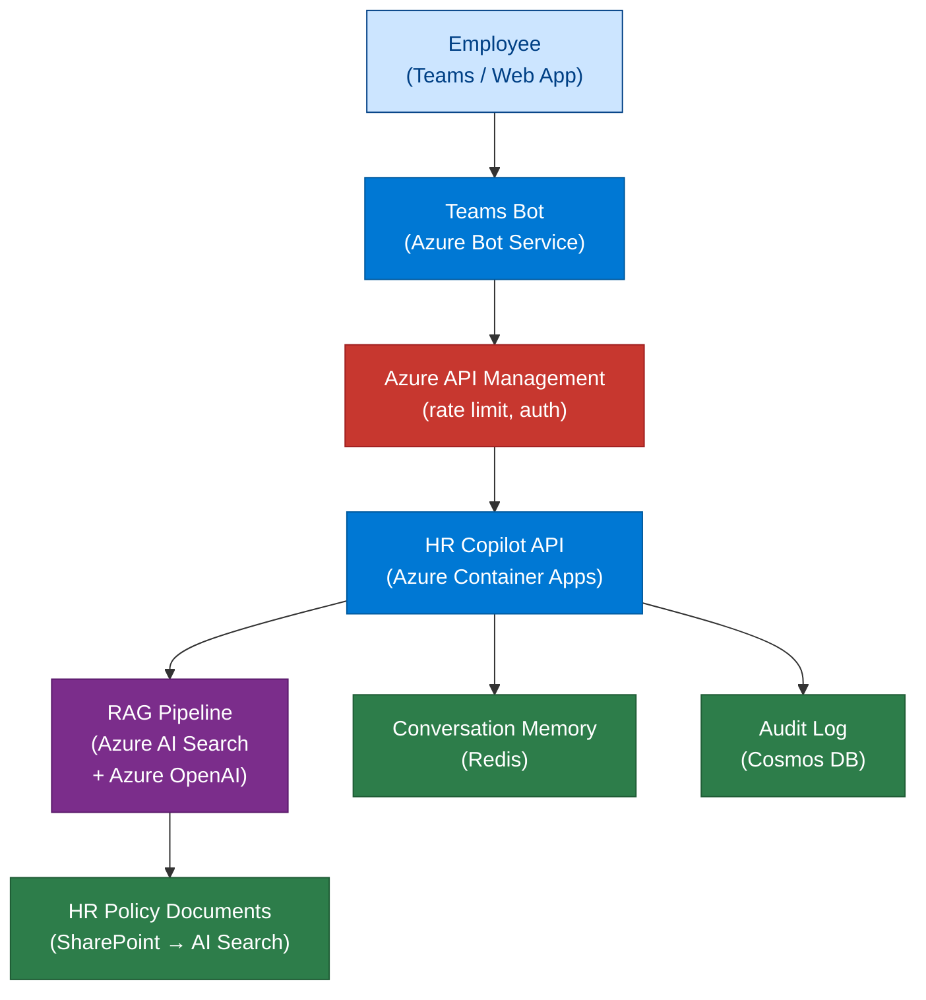
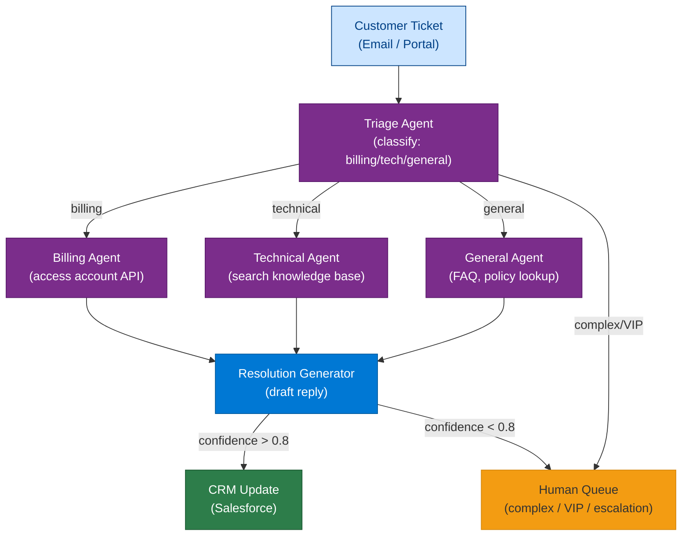
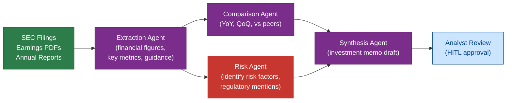

# 24 — Business Use Cases

> **Level:** Intermediate | **Time to complete:** 4 hours | **Azure services:** Full Azure AI stack

---

## 1. Overview

This module presents five complete enterprise AI use cases as reference architectures. Each illustrates how the components covered in earlier modules (RAG, agents, orchestration, memory, evaluation) combine into a deployable system.

---

## 2. Use Case 1: HR Policy Copilot

### Business Problem
HR teams spend 40% of time answering repetitive policy questions. Employees can't find answers in dense policy documents.

### Architecture



### Key Design Decisions

| Decision | Choice | Reason |
|---|---|---|
| Search | Hybrid + semantic reranker | HR policies use precise terminology (BM25 helps) |
| Memory | Redis per session | Low latency, session-scoped, auto-expire |
| LLM | GPT-4o | Nuanced policy interpretation needed |
| Chunking | Sentence-level, 400 tokens | Policy paragraphs map to individual rules |
| Guardrail | Topic classification | Block non-HR questions |

```python
# hr_copilot.py — simplified HR policy Q&A agent
import asyncio
import os
from openai import AsyncAzureOpenAI
from redis.asyncio import Redis
import json

aoai = AsyncAzureOpenAI(...)
redis = Redis.from_url(os.environ["REDIS_URL"])

SYSTEM_PROMPT = """You are the {company} HR Policy Assistant.
Your role: answer employee questions about HR policies, benefits, and procedures.
Scope: ONLY answer HR-related questions. For other topics, say "I can only help with HR questions."
Tone: Professional, empathetic, clear.
Citations: Always cite the specific policy document and section.
Escalation: For complex or personal situations, say "Please contact HR directly at hr@{company}.com"
Date awareness: Today is {date}. Some policies may have effective dates.
"""

async def hr_copilot_response(
    session_id: str,
    user_message: str,
    user_id: str,
    rag_retriever,  # The RAG function from Module 14/15
) -> str:
    # 1. Get conversation history
    history_key = f"hr:session:{session_id}"
    history_raw = await redis.get(history_key)
    history = json.loads(history_raw) if history_raw else []

    # 2. Retrieve relevant policy chunks
    context_docs = await rag_retriever(user_message, user_groups=["all_employees"])
    context = "\n\n".join([f"[{d['source']}]\n{d['content']}" for d in context_docs])

    # 3. Build messages
    messages = [
        {"role": "system", "content": SYSTEM_PROMPT.format(
            company="Contoso", date="2026-06-30"
        )},
        *history[-6:],  # Last 3 turns (6 messages)
        {"role": "user", "content": f"Context:\n{context}\n\nQuestion: {user_message}"},
    ]

    # 4. Generate response
    response = await aoai.chat.completions.create(
        model="gpt-4o",
        messages=messages,
        temperature=0.1,
        max_tokens=800,
    )
    answer = response.choices[0].message.content

    # 5. Update history
    history.append({"role": "user", "content": user_message})
    history.append({"role": "assistant", "content": answer})
    await redis.setex(history_key, 3600, json.dumps(history[-12:]))

    return answer
```

---

## 3. Use Case 2: Customer Support Automation

### Business Problem
Support team receives 10,000 tickets/day. 60% can be resolved without human intervention, but triage is manual.

### Architecture



```python
# support_triage.py
import asyncio, json
from openai import AsyncAzureOpenAI

aoai = AsyncAzureOpenAI(...)

TRIAGE_PROMPT = """You are a customer support triage agent.
Classify the ticket and extract key information.
Return JSON:
{
    "category": "billing|technical|general|escalate",
    "priority": "low|medium|high|urgent",
    "sentiment": "frustrated|neutral|happy",
    "key_issue": str,
    "account_id": str | null,
    "product": str | null,
    "requires_human": bool,
    "reason_for_human": str | null
}

Escalate to human if: VIP customer, legal threat, data breach, 3+ previous contacts."""

async def triage_ticket(ticket: dict) -> dict:
    response = await aoai.chat.completions.create(
        model="gpt-4o",
        messages=[
            {"role": "system", "content": TRIAGE_PROMPT},
            {"role": "user", "content": f"Subject: {ticket['subject']}\n\n{ticket['body']}"},
        ],
        response_format={"type": "json_object"},
        temperature=0,
    )
    return {**json.loads(response.choices[0].message.content), "ticket_id": ticket["id"]}
```

---

## 4. Use Case 3: Financial Document Analysis

### Business Problem
Investment analysts spend 6 hours/day reading earnings reports. Need to extract structured data and generate analysis summaries.

### Architecture



```python
# financial_extractor.py
from pydantic import BaseModel
from typing import Optional
import json
from openai import AzureOpenAI

client = AzureOpenAI(...)


class FinancialMetrics(BaseModel):
    company: str
    period: str  # "Q1 2025", "FY 2024"
    revenue_usd_m: float
    revenue_yoy_pct: float
    gross_margin_pct: float
    operating_income_usd_m: Optional[float]
    net_income_usd_m: Optional[float]
    eps_diluted: Optional[float]
    free_cash_flow_usd_m: Optional[float]
    guidance_revenue_low_usd_m: Optional[float]
    guidance_revenue_high_usd_m: Optional[float]
    key_risks: list[str]
    management_highlights: list[str]


def extract_financial_metrics(earnings_text: str) -> FinancialMetrics:
    response = client.chat.completions.create(
        model="gpt-4o",
        messages=[
            {"role": "system", "content": "Extract financial metrics from this earnings report. All monetary values in USD millions. If not mentioned, use null."},
            {"role": "user", "content": earnings_text[:12000]},
        ],
        response_format={
            "type": "json_schema",
            "json_schema": {
                "name": "financial_metrics",
                "schema": FinancialMetrics.model_json_schema(),
                "strict": True,
            },
        },
        temperature=0,
    )
    return FinancialMetrics(**json.loads(response.choices[0].message.content))
```

---

## 5. Use Case 4: Insurance Claims Automation

*(Full implementation in Module 07 — LangGraph. Summary here.)*

### Architecture Summary

```mermaid
graph LR
    CLAIM["Claim Submitted\n(photo + form)"]
    EXTRACT["Extraction Agent\n(damage type, amount, date)"]
    VALIDATE["Policy Validation Agent\n(check coverage, deductible)"]
    FRAUD["Fraud Detection Agent\n(ML model + LLM review)"]
    ASSESS["Damage Assessment Agent\n(estimate repair cost)"]
    APPROVE["Auto-Approve\n(if < $1000 and no fraud flag)"]
    HUMAN_Q["Human Queue\n(high value or fraud risk)"]
    PAYOUT["Payment Processing"]

    CLAIM --> EXTRACT --> VALIDATE
    VALIDATE --> FRAUD & ASSESS
    FRAUD & ASSESS --> APPROVE
    APPROVE -->|"low risk"| PAYOUT
    APPROVE -->|"high risk"| HUMAN_Q --> PAYOUT

    classDef primary   fill:#0078d4,color:#fff,stroke:#005a9e
    classDef secondary fill:#7b2d8b,color:#fff,stroke:#5a1a6b
    classDef storage   fill:#2d7d4a,color:#fff,stroke:#1f5c35
    classDef security  fill:#c7372f,color:#fff,stroke:#a02020
    classDef monitor   fill:#e67300,color:#fff,stroke:#b35500
    classDef success   fill:#27ae60,color:#fff,stroke:#1e8449
    classDef warning   fill:#f39c12,color:#333,stroke:#d68910
    classDef neutral   fill:#f3f3f3,color:#333,stroke:#999
    classDef user      fill:#cce5ff,color:#004085,stroke:#004085
    classDef decision  fill:#fff3cd,color:#856404,stroke:#856404
    classDef highlight fill:#e74c3c,color:#fff,stroke:#c0392b

    class CLAIM user
    class EXTRACT secondary
    class VALIDATE secondary
    class FRAUD security
    class ASSESS secondary
    class APPROVE decision
    class HUMAN_Q warning
    class PAYOUT success
```



**Key metrics for success:** Claims under $1,000 processed in < 5 minutes (vs. 3 days manual). Auto-approval rate: 65% of claims. Fraud flag accuracy: 94% precision.

---

## 6. Use Case 5: Code Review Assistant

### Business Problem
Developer productivity bottleneck: senior engineers spend 3+ hours/day on PR reviews.

```python
# code_review_agent.py
import asyncio
from openai import AsyncAzureOpenAI

aoai = AsyncAzureOpenAI(...)

CODE_REVIEW_SYSTEM = """You are a senior software engineer conducting a code review.
Review the code diff for:
1. Correctness: bugs, edge cases, off-by-one errors
2. Security: injection vulnerabilities, secrets in code, auth bypasses
3. Performance: N+1 queries, unnecessary loops, memory leaks
4. Maintainability: naming, complexity, missing tests
5. Azure best practices: use of Managed Identity, proper SDK patterns

Return a structured review in Markdown with sections: MUST FIX | SHOULD FIX | SUGGESTIONS | APPROVED (yes/no)
"""

async def review_pr(
    pr_diff: str,
    pr_description: str,
    changed_files: list[str],
) -> str:
    response = await aoai.chat.completions.create(
        model="gpt-4o",
        messages=[
            {"role": "system", "content": CODE_REVIEW_SYSTEM},
            {"role": "user", "content": f"""PR Description: {pr_description}

Changed files: {', '.join(changed_files)}

Diff:
```
{pr_diff[:10000]}
```"""},
        ],
        temperature=0.1,
        max_tokens=2000,
    )
    return response.choices[0].message.content
```

---

## 7. Production Checklist

- [ ] Each use case has a defined quality metric (accuracy %, latency SLA, cost/transaction)
- [ ] Evaluation dataset built for each use case: 200+ golden question/answer pairs
- [ ] Human-in-the-loop gates defined for each use case before automation goes live
- [ ] Fallback path to human operator implemented for every automated flow
- [ ] Cost per transaction tracked: total (LLM tokens + infra) / number of successful completions

---

## 8. Interview Q&A

### Q1 (Intermediate): Design an AI agent for insurance claims triage that processes 5,000 claims per day.

**Answer:** Architecture: (1) **Trigger**: claims submitted to Azure Service Bus; (2) **KEDA-scaled worker pool** on Container Apps: auto-scales 0→20 workers based on queue depth; (3) **Per-claim agent** (LangGraph StateGraph): Document Extractor (extracts claim fields using GPT-4o structured output) → Policy Validator (checks Cosmos DB for policy details) → Fraud Scorer (calls ML model endpoint + LLM review of suspicious patterns) → Amount Assessor (looks up repair cost database); (4) **Routing**: claims < $1,000 + low fraud score → auto-approve; high value or fraud flag → human queue in ServiceNow; (5) **LLM selection**: GPT-4o for fraud assessment and assessment; GPT-4o-mini for structured extraction (cost reduction); (6) **Scale**: 5,000/day = 3.5/minute at uniform load; with batching and 20 workers, each worker processes ~15/hour; (7) **SLA**: < 5 minutes for auto-approved, < 4 hours for human queue; (8) **Evaluation**: weekly evaluation run comparing auto-approved claims against human reviewer decisions.

---

## Cross-links

- Previous: [23 — Workflow Automation](./23-Workflow-Automation.md)
- Next: [25 — System Design](./25-System-Design.md)
- Related: [07 — LangGraph](./07-LangGraph.md) | [11 — Agent Orchestration](./11-Agent-Orchestration.md) | [14 — RAG](./14-RAG.md)

---

*Module 24 | Series: Enterprise Agentic AI Tutorial | Last updated: June 2026*
