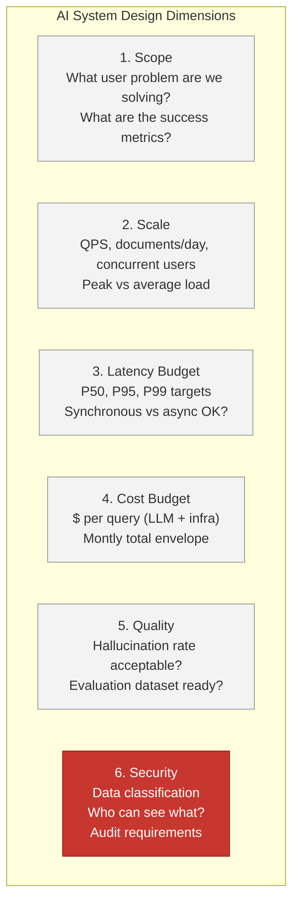
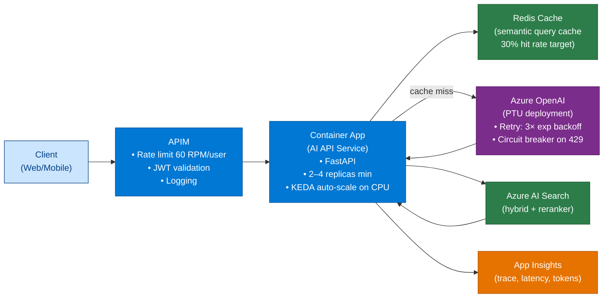
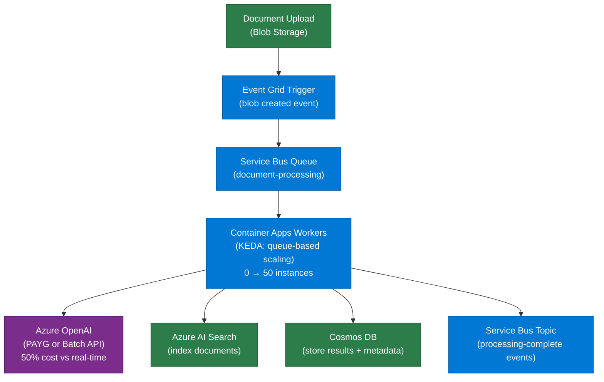
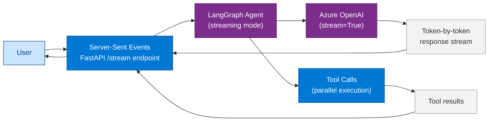
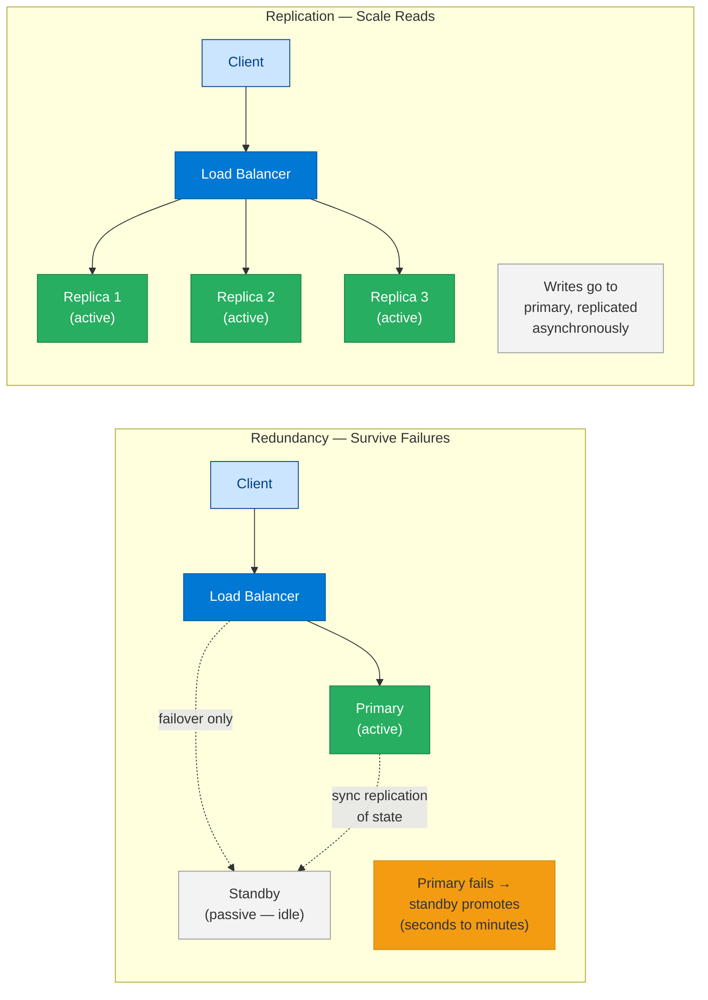
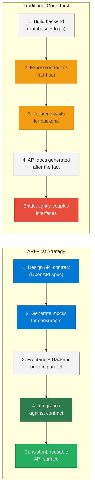
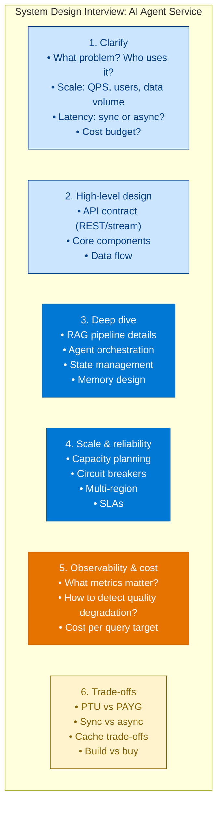

# 25 — System Design for Enterprise AI

> **Level:** Advanced | **Time to complete:** 5 hours | **Azure services:** Azure Container Apps, AKS, Azure API Management, Azure Cosmos DB, Azure Service Bus

---

## 1. Overview

System design for AI agents is distinct from traditional service design because of: unpredictable latency (LLM calls are 1–30 seconds), unpredictable token usage (response length varies), cascading failures in multi-agent chains, cost as a first-class constraint, and the need for observability at multiple levels (request, agent step, token). This module gives you the frameworks to design AI systems that are scalable, resilient, and cost-efficient.

---

## 2. AI System Design Framework



---

## 3. Capacity Planning for AI Systems

### 3.1 Token Budget Worksheet

| Component | Avg tokens | Notes |
|---|---|---|
| System prompt | 300–800 | Fixed per call |
| Few-shot examples | 0–2000 | Amortized |
| Retrieved context (RAG) | 1000–4000 | Variable |
| User input | 50–500 | Variable |
| LLM response | 200–1500 | Variable |
| **Total per call** | **1550–8800** | Budget for max, size PTU for p95 |

### 3.2 PTU Sizing Formula

```
PTU required = (Peak QPS) × (Avg tokens per call) / (PTU capacity factor)

For GPT-4o: 1 PTU ≈ 6000 TPM
Example: 10 QPS × 4000 tokens = 40,000 TPM → 40,000/6000 = 6.7 → 8 PTU (round up 20%)
Add 30% headroom: 8 × 1.3 = 10–11 PTU
```

```python
# capacity_planner.py
def calculate_ptu_requirements(
    peak_qps: float,
    avg_input_tokens: int,
    avg_output_tokens: int,
    model: str = "gpt-4o",
    headroom_pct: float = 0.3,
) -> dict:
    """Calculate PTU requirements for a production AI workload."""
    PTU_CAPACITY_TPM = {
        "gpt-4o": 6_000,
        "gpt-4o-mini": 25_000,
        "gpt-35-turbo": 60_000,
    }

    total_tokens_per_call = avg_input_tokens + avg_output_tokens
    peak_tpm = peak_qps * 60 * total_tokens_per_call
    base_ptu = peak_tpm / PTU_CAPACITY_TPM.get(model, 6_000)
    recommended_ptu = base_ptu * (1 + headroom_pct)

    return {
        "peak_qps": peak_qps,
        "total_tokens_per_call": total_tokens_per_call,
        "peak_tpm": peak_tpm,
        "base_ptu": base_ptu,
        "recommended_ptu": int(recommended_ptu) + 1,
        "monthly_cost_estimate_usd": recommended_ptu * 4.5 * 30 * 24,  # PTU $/hr × hours
    }


# Example output for enterprise RAG:
plan = calculate_ptu_requirements(
    peak_qps=5,
    avg_input_tokens=3500,
    avg_output_tokens=600,
    model="gpt-4o",
)
```

---

## 4. Reference Architectures

### 4.1 Synchronous AI API (< 5 second SLA)



### 4.2 Async Batch Processing (Background jobs)



### 4.3 Real-Time Streaming Agent



---

## 5. Resilience Patterns

### 5.1 Circuit Breaker

```python
# circuit_breaker.py
import asyncio
import time
from enum import Enum


class CircuitState(Enum):
    CLOSED = "closed"      # Normal operation
    OPEN = "open"          # Failing — reject immediately
    HALF_OPEN = "half_open"  # Testing recovery


class AICircuitBreaker:
    """
    Circuit breaker for Azure OpenAI calls.
    Prevents cascading failures when AOAI is experiencing issues.
    """

    def __init__(
        self,
        failure_threshold: int = 5,
        reset_timeout: float = 60.0,
        half_open_max_calls: int = 2,
    ):
        self.failure_threshold = failure_threshold
        self.reset_timeout = reset_timeout
        self.half_open_max_calls = half_open_max_calls

        self.state = CircuitState.CLOSED
        self.failure_count = 0
        self.last_failure_time = 0.0
        self.half_open_calls = 0

    async def call(self, fn, *args, fallback=None, **kwargs):
        if self.state == CircuitState.OPEN:
            if time.time() - self.last_failure_time > self.reset_timeout:
                self.state = CircuitState.HALF_OPEN
                self.half_open_calls = 0
            else:
                if fallback:
                    return await fallback(*args, **kwargs)
                raise RuntimeError("Circuit open — AOAI unavailable")

        if self.state == CircuitState.HALF_OPEN:
            if self.half_open_calls >= self.half_open_max_calls:
                raise RuntimeError("Circuit half-open — limited calls only")
            self.half_open_calls += 1

        try:
            result = await fn(*args, **kwargs)
            self._on_success()
            return result
        except Exception as e:
            self._on_failure()
            raise

    def _on_success(self) -> None:
        self.failure_count = 0
        self.state = CircuitState.CLOSED

    def _on_failure(self) -> None:
        self.failure_count += 1
        self.last_failure_time = time.time()
        if self.failure_count >= self.failure_threshold:
            self.state = CircuitState.OPEN


# Usage:
# breaker = AICircuitBreaker()
# result = await breaker.call(aoai.chat.completions.create, ..., fallback=use_cached_response)
```

### 5.2 Multi-Region Failover

```python
# multi_region_failover.py
import asyncio
import time
from openai import AsyncAzureOpenAI

REGIONS = [
    {"name": "eastus", "endpoint": "https://contoso-aoai-eastus.openai.azure.com/"},
    {"name": "westeurope", "endpoint": "https://contoso-aoai-westeurope.openai.azure.com/"},
    {"name": "australiaeast", "endpoint": "https://contoso-aoai-australiaeast.openai.azure.com/"},
]


async def call_with_failover(
    messages: list[dict],
    model: str = "gpt-4o",
    timeout: float = 30.0,
) -> str:
    """Try each region in order, fail over on 429/5xx."""
    last_error = None
    for region in REGIONS:
        client = AsyncAzureOpenAI(
            azure_endpoint=region["endpoint"],
            api_key=os.environ["AZURE_OPENAI_API_KEY"],
            api_version="2024-10-21",
        )
        try:
            response = await asyncio.wait_for(
                client.chat.completions.create(
                    model=model,
                    messages=messages,
                ),
                timeout=timeout,
            )
            return response.choices[0].message.content
        except Exception as e:
            last_error = e
            if "429" in str(e) or "503" in str(e) or "timeout" in str(e).lower():
                continue  # Try next region
            raise  # Don't retry on 400-level client errors

    raise RuntimeError(f"All regions failed. Last error: {last_error}")
```

---

## 5.3 Redundancy vs Replication

These two terms are frequently confused in system design interviews. They address different failure modes:

| Aspect | Redundancy | Replication |
|---|---|---|
| **Purpose** | Eliminate single points of failure | Scale reads / distribute load |
| **Primary goal** | Availability (survive failures) | Performance + durability |
| **Data relationship** | Standby may be idle until failover | All replicas actively serve traffic |
| **Consistency** | Active-passive: simple, no split-brain risk | Active-active: requires consensus or eventual consistency model |
| **Typical Azure pattern** | Zone-redundant SQL Database (primary + standby) | Cosmos DB multi-region writes / Azure AI Search replicas |



**Key rule:** Redundancy protects against **node failure**; replication protects against **load and latency**. Production AI systems need both:
- **Azure AI Search:** 3 replicas (replication for query scale) × 2 partitions (redundancy for index availability)
- **Azure OpenAI PTU:** Deploy in 2+ regions (redundancy) with APIM round-robin (replication of capacity)
- **Cosmos DB:** Multi-region writes = replication for geo-performance; availability zones = redundancy against DC failure

**Interview answer template:** *"Redundancy means having a standby that takes over when the active component fails — it's about availability. Replication means having multiple active copies serving traffic simultaneously — it's about throughput and read scale. In practice, both work together: you replicate for performance and add redundancy to ensure the replicas themselves survive zone or region failures."*

---

## 5.4 API-First vs Traditional Code-First Strategy

**API-First** means the API contract (OpenAPI/Swagger spec) is defined and agreed upon *before* any application code is written. Consumers (frontend, mobile, third-party) and producers (backend) work in parallel against the contract.

**Code-First** (traditional) means the backend is built first, and the API is whatever the code exposes — often ad-hoc.



### Comparison Table

| Feature | API-First Strategy | Traditional Code-First |
|---|---|---|
| **Starting point** | Formal API contract (OpenAPI spec) | Core application codebase + database |
| **Team workflow** | Parallel — frontend, backend, QA work simultaneously | Sequential — frontend waits for backend endpoints |
| **Reusability** | High — same API serves web, mobile, IoT, third-party | Low — features tightly coupled to one UI |
| **Integration risk** | Low — contract is the integration test | High — brittle interfaces discovered at integration time |
| **Documentation** | Auto-generated from spec; always accurate | Generated after the fact; often stale |
| **Time to first integration** | Fast — mocks available immediately | Slow — backend must be built first |
| **Technical debt** | Minimal — contract enforces discipline | High — API shaped by implementation convenience |

### When to Use API-First

- Building a platform consumed by multiple teams or clients (mobile, web, third-party partners)
- Regulated environments where the API surface must be reviewed and approved before build
- Microservices where teams work on different services that must integrate
- AI agent systems where the agent's tool definitions *are* the API contract

### AI Engineering Context

Enterprise AI agent systems are naturally API-First: the **tool definitions** (JSON Schema) and **MCP server spec** define the contract between the agent and its capabilities. The agent only knows what tools exist because of the schema — if the schema changes, the agent's behaviour changes. This makes API-First discipline critical: define the tool interface before implementing the tool, so the agent's prompts and the implementation stay synchronized.

---

## 6. AI System Design Interview Framework



---

## 7. Production Checklist

- [ ] Capacity planned: PTU sized for peak × 1.3 headroom
- [ ] Circuit breaker implemented on all Azure OpenAI calls
- [ ] Multi-region failover configured for critical workloads
- [ ] Semantic cache deployed (Redis) with 30%+ hit rate target
- [ ] Async processing used for non-interactive workloads (document processing, batch analysis)
- [ ] APIM rate limits set: 60 RPM per user, 600 RPM total for pilot
- [ ] P95 latency target defined and dashboarded (not just P50)
- [ ] Cost per query target set and alerted when exceeded by 2×

---

## 8. Interview Q&A

### Q1 (Advanced): Design a scalable enterprise document Q&A system that handles 100,000 documents and 1,000 concurrent users.

**Answer:** (1) **Ingestion pipeline**: Azure Data Factory → Azure Functions (chunking/embedding) → KEDA-scaled Container Apps workers → Azure AI Search index. Handles 100K docs with 10 parallel workers in ~2 hours. (2) **Query API**: Azure API Management → FastAPI on Container Apps (10 min replicas, auto-scale to 50 on CPU) → Redis semantic cache → Azure AI Search (hybrid + reranker) → Azure OpenAI GPT-4o (PTU). (3) **Capacity**: 1,000 concurrent users × 0.1 QPS average = 100 QPS sustained. Each query: 3,500 input tokens + 600 output = 4,100 tokens. 100 QPS × 4,100 × 60 = 24.6M TPM → need ~4,100 PTU for GPT-4o (expensive). Mitigate with: semantic cache (30% hit → 70 effective QPS), smaller model for simple queries (50% can use GPT-4o-mini), batch API for non-interactive. (4) **Resilience**: Circuit breaker on AOAI, failover to West Europe region. (5) **Latency**: P95 < 5 seconds: cache hits < 100ms, search < 300ms, LLM generation 1–4 seconds.

---

## Cross-links

- Previous: [24 — Business Use Cases](./24-Business-Use-Cases.md)
- Next: [26 — Microservices](./26-Microservices.md)
- Related: [29 — Deployment](./29-Deployment.md) | [32 — Observability](./32-Observability.md) | [37 — Cost Optimization](./37-Cost-Optimization.md)

---

*Module 25 | Series: Enterprise Agentic AI Tutorial | Last updated: June 2026*
