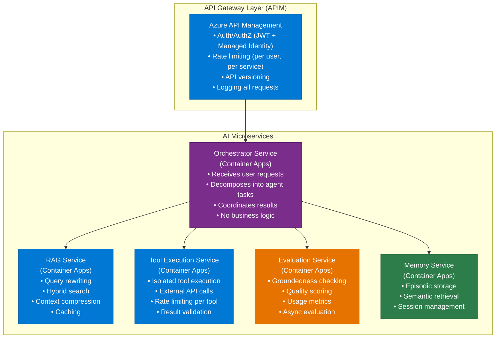
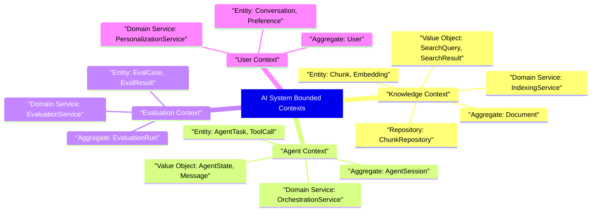
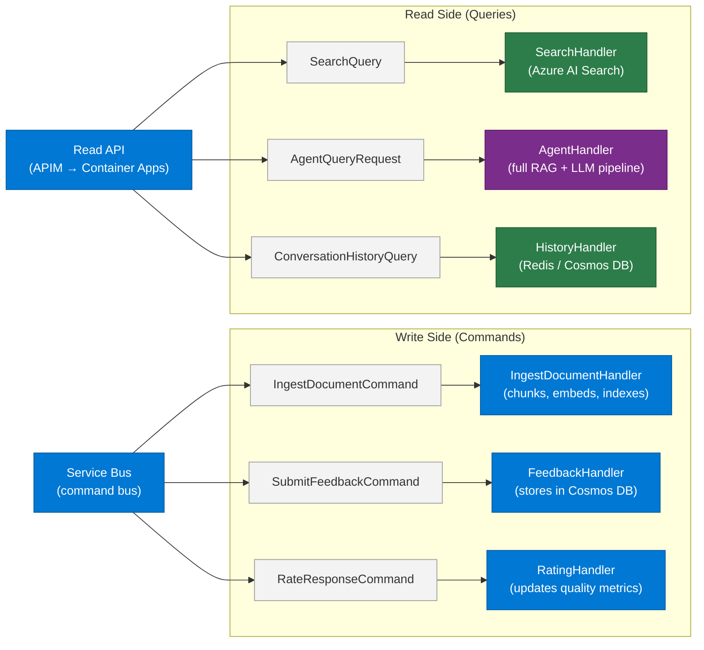
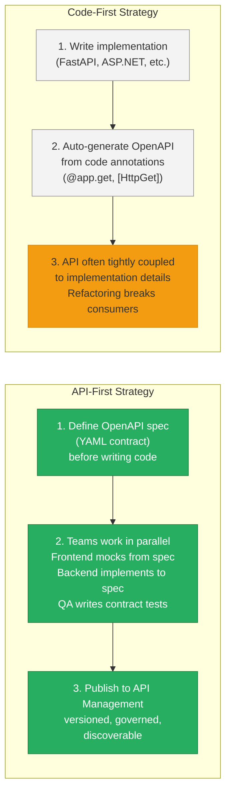

# 26 — Microservices for AI Systems

> **Level:** Advanced | **Time to complete:** 3.5 hours | **Azure services:** Azure Container Apps, Azure Service Bus, Azure API Management, Azure Cosmos DB

---

## 1. Overview

AI agent systems are naturally decomposed as microservices: a RAG service, an orchestrator service, a tool execution service, an evaluation service. This module covers how to apply Domain-Driven Design, CQRS, the Saga pattern, and API Gateway patterns specifically to AI service architectures.

---

## 2. AI Microservice Decomposition



---

## 3. Domain-Driven Design for AI



---

## 4. CQRS Pattern for AI Systems

CQRS (Command Query Responsibility Segregation) is natural for AI systems because reads (RAG queries, agent responses) have very different scaling characteristics from writes (document ingestion, feedback collection).



```python
# cqrs_pattern.py
from abc import ABC, abstractmethod
from dataclasses import dataclass
from typing import Any

# --- Commands ---

@dataclass
class IngestDocumentCommand:
    document_id: str
    blob_url: str
    category: str
    access_groups: list[str]


@dataclass
class AgentQueryRequest:
    query: str
    session_id: str
    user_id: str
    filters: dict


# --- Command Handlers ---

class CommandHandler(ABC):
    @abstractmethod
    async def handle(self, command) -> Any:
        pass


class IngestDocumentHandler(CommandHandler):
    def __init__(self, chunk_service, embed_service, search_client):
        self.chunker = chunk_service
        self.embedder = embed_service
        self.search = search_client

    async def handle(self, cmd: IngestDocumentCommand) -> dict:
        content = await download_blob(cmd.blob_url)
        chunks = self.chunker.chunk(content)
        embeddings = await self.embedder.embed_batch([c.text for c in chunks])
        await self.search.upload_documents([
            {"id": f"{cmd.document_id}-{i}", "content": c.text, "embedding": emb,
             "category": cmd.category, "access_groups": cmd.access_groups}
            for i, (c, emb) in enumerate(zip(chunks, embeddings))
        ])
        return {"document_id": cmd.document_id, "chunks_indexed": len(chunks)}


# --- Query Handlers ---

class QueryHandler(ABC):
    @abstractmethod
    async def handle(self, query) -> Any:
        pass


class AgentQueryHandler(QueryHandler):
    def __init__(self, rag_service, agent_service, memory_service):
        self.rag = rag_service
        self.agent = agent_service
        self.memory = memory_service

    async def handle(self, qry: AgentQueryRequest) -> dict:
        context = await self.rag.retrieve(qry.query, filters=qry.filters)
        history = await self.memory.get_history(qry.session_id)
        response = await self.agent.generate(qry.query, context, history)
        await self.memory.store(qry.session_id, qry.query, response)
        return {"answer": response, "sources": context}
```

---

## 5. Saga Pattern for Long-Running AI Workflows

When an AI workflow spans multiple services (ingest → embed → index → notify), the Saga pattern manages distributed transactions without distributed locks.

```python
# saga_pattern.py — compensating transaction pattern for AI pipelines
import asyncio
from dataclasses import dataclass, field
from typing import Callable

@dataclass
class SagaStep:
    name: str
    action: Callable
    compensation: Callable  # Undo action if later step fails
    args: dict = field(default_factory=dict)


class DocumentIngestionSaga:
    """
    Saga for document ingestion:
    1. Reserve index capacity
    2. Upload to blob
    3. Index document
    4. Update metadata DB
    
    If step N fails, roll back steps N-1, N-2, ...
    """

    def __init__(self):
        self.completed_steps: list[SagaStep] = []

    async def run(self, document: dict) -> dict:
        steps = [
            SagaStep(
                name="upload_to_blob",
                action=self._upload_blob,
                compensation=self._delete_blob,
                args={"document": document},
            ),
            SagaStep(
                name="index_document",
                action=self._index_document,
                compensation=self._delete_from_index,
                args={"document_id": document["id"]},
            ),
            SagaStep(
                name="update_metadata",
                action=self._update_metadata,
                compensation=self._delete_metadata,
                args={"document_id": document["id"]},
            ),
        ]

        results = {}
        for step in steps:
            try:
                result = await step.action(**step.args)
                results[step.name] = result
                self.completed_steps.append(step)
            except Exception as e:
                print(f"Step '{step.name}' failed: {e}. Rolling back...")
                await self._compensate()
                raise

        return results

    async def _compensate(self):
        """Roll back all completed steps in reverse order."""
        for step in reversed(self.completed_steps):
            try:
                await step.compensation(**step.args)
            except Exception as e:
                print(f"Compensation for '{step.name}' failed: {e} — requires manual intervention")

    async def _upload_blob(self, document: dict) -> str:
        return "blob://container/doc123"

    async def _delete_blob(self, document: dict) -> None:
        pass  # Delete from blob storage

    async def _index_document(self, document_id: str) -> dict:
        return {"doc_id": document_id, "chunks": 10}

    async def _delete_from_index(self, document_id: str) -> None:
        pass  # Delete from search index

    async def _update_metadata(self, document_id: str) -> None:
        pass  # Update Cosmos DB metadata

    async def _delete_metadata(self, document_id: str) -> None:
        pass  # Delete from Cosmos DB
```

---

## 6. API Gateway Patterns for AI Services

```python
# apim_policy.xml — APIM policy for AI API (abbreviated)
"""
<policies>
    <inbound>
        <!-- JWT validation -->
        <validate-jwt header-name="Authorization" require-expiration-time="true">
            <openid-config url="https://login.microsoftonline.com/{tenant}/v2.0/.well-known/openid-configuration"/>
            <required-claims>
                <claim name="aud" match="any">
                    <value>api://ai-service</value>
                </claim>
            </required-claims>
        </validate-jwt>

        <!-- Rate limiting per user: 60 requests/minute -->
        <rate-limit-by-key calls="60" renewal-period="60"
            counter-key="@(context.Request.Headers.GetValueOrDefault("Authorization","").Split(' ').LastOrDefault())"
            increment-condition="@(context.Response.StatusCode != 429)" />

        <!-- Semantic caching check -->
        <cache-lookup vary-by-developer="false" vary-by-developer-groups="false"/>

        <!-- Route to backend -->
        <set-backend-service base-url="https://ai-api.contoso.azurecontainerapps.io"/>
    </inbound>

    <outbound>
        <!-- Cache response for 5 minutes -->
        <cache-store duration="300"/>

        <!-- Add token usage to response headers -->
        <set-header name="X-Token-Usage" exists-action="override">
            <value>@((string)context.Variables.GetValueOrDefault("tokenUsage",""))</value>
        </set-header>
    </outbound>

    <on-error>
        <!-- Unified error format -->
        <return-response>
            <set-status code="@(context.Response.StatusCode)" reason="Error"/>
            <set-body>{"error": "@(context.LastError.Message)", "correlation_id": "@(context.RequestId)"}</set-body>
        </return-response>
    </on-error>
</policies>
"""
```

---

## 6.1 API-First vs Code-First Strategy

A fundamental architecture decision when building AI microservices: do you define the API contract before writing code, or let the API emerge from the implementation?



| Feature | API-First | Code-First |
|---|---|---|
| **Starting point** | Formal OpenAPI contract | Application code |
| **Team workflow** | Parallel — frontend, backend, QA work simultaneously | Sequential — frontend waits for backend endpoints |
| **Reusability** | High — same API consumed by web, mobile, IoT, third-party | Low — often tightly coupled to one consumer |
| **System risks** | Fewer integration bugs; contract is the source of truth | Higher risk of breaking changes and interface fragmentation |
| **Time to first mock** | Fast — generate mock server from spec immediately | Slow — need real implementation first |
| **Refactoring impact** | Safe — contract doesn't change unless spec changes | Risky — renaming a field breaks all consumers |

**For AI microservices, API-First is strongly recommended because:**
1. AI agents call many services as tools — each tool needs a stable, versioned contract
2. The same AI Search or embedding service is consumed by web apps, agents, and batch pipelines simultaneously
3. Prompt templates and tool definitions reference specific field names — a breaking schema change silently corrupts agent behaviour
4. APIM policies (rate limiting, auth, caching) are configured against the API spec

```python
# api_first_example.py — define the contract first, implement to it
# Step 1: The OpenAPI spec (openapi.yaml) defines this endpoint:
#   POST /api/v1/documents/search
#   Request: { "query": "string", "top_k": "integer", "filters": {...} }
#   Response: { "results": [...], "total": "integer", "latency_ms": "integer" }
#
# Step 2: FastAPI implements to that contract — not the other way around

from fastapi import FastAPI
from pydantic import BaseModel, Field

app = FastAPI(title="AI Search Service", version="1.0.0")


class SearchRequest(BaseModel):
    query: str       = Field(..., min_length=1, max_length=500)
    top_k: int       = Field(default=5, ge=1, le=50)
    filters: dict    = Field(default_factory=dict)


class SearchResult(BaseModel):
    id:      str
    content: str
    score:   float
    source:  str


class SearchResponse(BaseModel):
    results:    list[SearchResult]
    total:      int
    latency_ms: int


@app.post("/api/v1/documents/search", response_model=SearchResponse)
async def search_documents(req: SearchRequest) -> SearchResponse:
    # Implementation matches the contract — if it doesn't, FastAPI raises a validation error
    ...
```

**Versioning strategy for AI APIs:**
- Use URL versioning (`/api/v1/`, `/api/v2/`) — explicit and easy to route in APIM
- Never remove fields in a minor version — only add (additive changes are backward-compatible)
- Breaking changes (rename, remove, type change) require a new major version with a deprecation notice period
- AI agents should always pin to a specific version (`/api/v1/`) — never call `/api/latest/`

---

## 7. Production Checklist

- [ ] Each AI microservice has a single responsibility and can deploy independently
- [ ] Service contracts versioned in API spec (OpenAPI) before implementation
- [ ] CQRS applied: write-heavy ingestion scaled independently from read-heavy queries
- [ ] Saga pattern implemented for multi-service workflows with compensating transactions
- [ ] APIM rate limits configured per service and per user
- [ ] Health check endpoints on all services: `/health/live` and `/health/ready`
- [ ] Service-to-service auth: Managed Identity only — no API keys between services

---

## 8. Interview Q&A

### Q1 (Advanced): How do you apply the CQRS pattern to an AI RAG system?

**Answer:** In a RAG system, commands (writes) and queries (reads) have fundamentally different characteristics and scaling needs. On the **command side**: IngestDocument commands are CPU and I/O intensive (download → chunk → embed → index); they can be async and delayed; they're lower frequency (documents arrive in batches). On the **query side**: SearchQuery operations need sub-second response time, are high frequency (every user message), and are read-only. CQRS separates these: the Write Model handles ingestion asynchronously via Service Bus → Worker (Container Apps). The Read Model is the AI Search index + Redis cache — optimized purely for fast retrieval. The event bus (Service Bus) connects them: when the Write Model completes indexing, it publishes a `DocumentIndexed` event; cache invalidation and index warming can react to this event. Benefits: ingestion pipelines can scale independently for batch days without affecting query latency; different teams can own each side; read replicas can be added without changing ingestion.

---

## Cross-links

- Previous: [25 — System Design](./25-System-Design.md)
- Next: [27 — Cloud-Native AI](./27-Cloud-Native-AI.md)
- Related: [11 — Agent Orchestration](./11-Agent-Orchestration.md) | [29 — Deployment](./29-Deployment.md)

---

*Module 26 | Series: Enterprise Agentic AI Tutorial | Last updated: June 2026*
