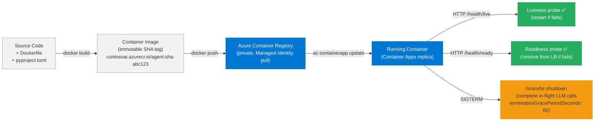

# 27 — Cloud-Native AI

> **Level:** Intermediate | **Time to complete:** 3 hours | **Azure services:** Azure Container Apps, AKS, Azure Container Registry, Azure Blob Storage, Azure Key Vault

---

## 1. Overview

Cloud-native AI applies the 12-factor app principles, container-first design, and platform-managed operations to AI systems. This module covers how to package, configure, and deploy AI agents as cloud-native workloads — portable, scalable, and infrastructure-independent at the application layer.

---

## 2. 12-Factor App Applied to AI Agents

```mermaid
graph TB
    subgraph FACTORS["12-Factor Principles for AI Agents"]
        F1["1. Codebase\nOne repo per agent service\nBranch strategy: main=prod, feature branches"]
        F2["2. Dependencies\nAll deps in pyproject.toml / requirements.txt\nNo system-level installs at runtime"]
        F3["3. Config\nALL config from environment variables\nNo hardcoded endpoints, model names, or keys"]
        F4["4. Backing Services\nAI Search, Redis, Cosmos DB, AOAI\ntreated as attached resources\nswappable via env vars"]
        F5["5. Build/Release/Run\nBuild: docker build → ACR\nRelease: ACR image + K8s config\nRun: Container Apps"]
        F6["6. Processes\nStateless agents — no local file state\nAll state in Cosmos/Redis/Blob"]
        F7["7. Port Binding\nFastAPI/uvicorn on port 8080\nContainer exposes port, not agent"]
        F8["8. Concurrency\nScale by adding replicas\nNot by adding threads per process"]
        F9["9. Disposability\nGraceful shutdown on SIGTERM\nComplete in-flight LLM calls"]
        F10["10. Dev/Prod Parity\nDocker Compose locally\nSame image in prod"]
        F11["11. Logs\nStructured JSON to stdout\nAzure Monitor collects"]
        F12["12. Admin Processes\nData migrations = one-off jobs\nNot embedded in the main service"]
    end

    classDef primary   fill:#0078d4,color:#fff,stroke:#005a9e
    classDef secondary fill:#7b2d8b,color:#fff,stroke:#5a1a6b
    classDef storage   fill:#2d7d4a,color:#fff,stroke:#1f5c35
    classDef security  fill:#c7372f,color:#fff,stroke:#a02020
    classDef monitor   fill:#e67300,color:#fff,stroke:#b35500
    classDef success   fill:#27ae60,color:#fff,stroke:#1e8449
    classDef warning   fill:#f39c12,color:#333,stroke:#d68910
    classDef neutral   fill:#f3f3f3,color:#333,stroke:#999
    classDef user      fill:#cce5ff,color:#004085,stroke:#004085
    classDef decision  fill:#fff3cd,color:#856404,stroke:#856404
    classDef highlight fill:#e74c3c,color:#fff,stroke:#c0392b

    class F1,F2,F5,F7,F8 neutral
    class F3 security
    class F4 storage
    class F6 primary
    class F9 warning
    class F10 neutral
    class F11 monitor
    class F12 neutral
```



---

## 2.1 Container Lifecycle for AI Agents



---

## 3. Containerizing an AI Agent

### 3.1 Production Dockerfile

```dockerfile
# Dockerfile — production AI agent container
# Stage 1: Build dependencies
FROM python:3.12-slim as builder

WORKDIR /app

# Install uv for fast dependency resolution
RUN pip install uv

COPY pyproject.toml uv.lock ./
RUN uv sync --frozen --no-dev

# Stage 2: Runtime
FROM python:3.12-slim as runtime

# Security: non-root user
RUN groupadd -r agent && useradd -r -g agent agent

WORKDIR /app

# Copy only the virtual environment from builder
COPY --from=builder /app/.venv /app/.venv

# Copy application code
COPY --chown=agent:agent src/ ./src/
COPY --chown=agent:agent main.py ./

# Activate virtual environment
ENV PATH="/app/.venv/bin:$PATH"
ENV PYTHONUNBUFFERED=1
ENV PYTHONDONTWRITEBYTECODE=1

# Health check
HEALTHCHECK --interval=30s --timeout=10s --start-period=60s --retries=3 \
    CMD python -c "import httpx; httpx.get('http://localhost:8080/health/live')" || exit 1

USER agent
EXPOSE 8080

# Graceful shutdown: uvicorn catches SIGTERM
CMD ["uvicorn", "main:app", "--host", "0.0.0.0", "--port", "8080", "--workers", "1"]
```

### 3.2 FastAPI Application with Graceful Shutdown

```python
# main.py — cloud-native FastAPI AI agent
import asyncio
import signal
import logging
import os
from contextlib import asynccontextmanager
from fastapi import FastAPI, HTTPException, Depends
from fastapi.responses import StreamingResponse
from pydantic import BaseModel
from openai import AsyncAzureOpenAI
from azure.identity.aio import DefaultAzureCredential

logger = logging.getLogger(__name__)
logging.basicConfig(
    level=logging.INFO,
    format='{"time":"%(asctime)s","level":"%(levelname)s","message":"%(message)s"}',  # JSON logs
)

# Global clients — initialized once at startup
aoai_client: AsyncAzureOpenAI | None = None
credential: DefaultAzureCredential | None = None


@asynccontextmanager
async def lifespan(app: FastAPI):
    """Initialize and teardown resources on app start/stop."""
    global aoai_client, credential
    logger.info("Starting AI agent service")

    credential = DefaultAzureCredential()
    aoai_client = AsyncAzureOpenAI(
        azure_endpoint=os.environ["AZURE_OPENAI_ENDPOINT"],
        azure_ad_token_provider=lambda: asyncio.run(
            credential.get_token("https://cognitiveservices.azure.com/.default")
        ),
        api_version="2024-10-21",
    )

    logger.info("Connections initialized — service ready")
    yield  # Application runs

    # Teardown: allow in-flight requests to complete
    logger.info("Shutting down — closing connections")
    await credential.close()


app = FastAPI(title="Enterprise AI Agent", lifespan=lifespan)


class QueryRequest(BaseModel):
    query: str
    session_id: str
    stream: bool = False


@app.get("/health/live")
async def liveness():
    """Kubernetes liveness probe — always 200 if process is running."""
    return {"status": "alive"}


@app.get("/health/ready")
async def readiness():
    """Kubernetes readiness probe — 200 only if all deps are available."""
    if aoai_client is None:
        raise HTTPException(status_code=503, detail="AOAI client not initialized")
    return {"status": "ready"}


@app.post("/query")
async def query(request: QueryRequest):
    if request.stream:
        return StreamingResponse(
            stream_response(request.query),
            media_type="text/event-stream",
        )

    response = await aoai_client.chat.completions.create(
        model=os.environ.get("AZURE_OPENAI_DEPLOYMENT_NAME", "gpt-4o"),
        messages=[
            {"role": "system", "content": "You are a helpful AI assistant."},
            {"role": "user", "content": request.query},
        ],
    )
    return {"answer": response.choices[0].message.content, "session_id": request.session_id}


async def stream_response(query: str):
    """Server-sent events streaming response."""
    async with aoai_client.chat.completions.stream(
        model=os.environ.get("AZURE_OPENAI_DEPLOYMENT_NAME", "gpt-4o"),
        messages=[{"role": "user", "content": query}],
    ) as stream:
        async for text in stream.text_stream:
            yield f"data: {text}\n\n"
    yield "data: [DONE]\n\n"
```

---

## 4. Azure Container Apps Configuration

### 4.1 Container Apps Bicep

```bicep
// container_app.bicep
param location string = resourceGroup().location
param acrName string
param imageName string
param imageTag string

resource containerApp 'Microsoft.App/containerApps@2024-03-01' = {
  name: 'ai-agent-service'
  location: location
  identity: {
    type: 'SystemAssigned'  // Managed Identity — no keys needed
  }
  properties: {
    managedEnvironmentId: managedEnvironment.id
    configuration: {
      ingress: {
        external: false  // Internal only — accessed via APIM
        targetPort: 8080
        traffic: [{ latestRevision: true, weight: 100 }]
      }
      registries: [
        {
          server: '${acrName}.azurecr.io'
          identity: 'system'  // Use Managed Identity for ACR pull
        }
      ]
    }
    template: {
      containers: [
        {
          name: 'ai-agent'
          image: '${acrName}.azurecr.io/${imageName}:${imageTag}'
          resources: {
            cpu: '1.0'
            memory: '2Gi'
          }
          env: [
            { name: 'AZURE_OPENAI_ENDPOINT', value: aoaiEndpoint }
            { name: 'AZURE_OPENAI_DEPLOYMENT_NAME', value: 'gpt-4o' }
            { name: 'AZURE_SEARCH_ENDPOINT', value: searchEndpoint }
            // NO KEYS — all authenticated via Managed Identity
          ]
          probes: [
            {
              type: 'Liveness'
              httpGet: { path: '/health/live', port: 8080 }
              initialDelaySeconds: 30
              periodSeconds: 30
            }
            {
              type: 'Readiness'
              httpGet: { path: '/health/ready', port: 8080 }
              initialDelaySeconds: 10
              periodSeconds: 10
            }
          ]
        }
      ]
      scale: {
        minReplicas: 2  // Always-on for low latency
        maxReplicas: 20
        rules: [
          {
            name: 'http-scaling'
            http: {
              metadata: {
                concurrentRequests: '10'  // Scale up when > 10 concurrent requests/replica
              }
            }
          }
        ]
      }
    }
  }
}
```

---

## 4.1 Container Apps Auto-Scaling Pattern

```mermaid
graph TB
    subgraph SCALING["Container Apps HTTP Scaling"]
        MIN["minReplicas: 2\n(always-on for low latency)"]
        RULE["Scale Rule:\nconcurrentRequests per replica = 10"]
        MAX["maxReplicas: 20"]

        MIN -->|"load increases"| R3["3 replicas\n(30 concurrent req)"]
        R3 -->|"load increases"| R10["10 replicas\n(100 concurrent req)"]
        R10 -->|"load drops\n(cooldown 5min)"| MIN
        R10 -->|"burst"| MAX
    end

    subgraph KEDA["KEDA Queue-Based Scaling (Workers)"]
        SB_QUEUE["Service Bus Queue\n50 pending messages"]
        KEDA_RULE["KEDA Rule:\n1 replica per 5 messages"]
        WORKERS["10 worker replicas\n(process in parallel)"]
        ZERO["0 replicas\n(queue empty, scale to zero)"]

        SB_QUEUE -->|"trigger"| KEDA_RULE --> WORKERS
        WORKERS -->|"queue drained"| ZERO
    end

    classDef primary   fill:#0078d4,color:#fff,stroke:#005a9e
    classDef secondary fill:#7b2d8b,color:#fff,stroke:#5a1a6b
    classDef storage   fill:#2d7d4a,color:#fff,stroke:#1f5c35
    classDef security  fill:#c7372f,color:#fff,stroke:#a02020
    classDef monitor   fill:#e67300,color:#fff,stroke:#b35500
    classDef success   fill:#27ae60,color:#fff,stroke:#1e8449
    classDef warning   fill:#f39c12,color:#333,stroke:#d68910
    classDef neutral   fill:#f3f3f3,color:#333,stroke:#999
    classDef user      fill:#cce5ff,color:#004085,stroke:#004085
    classDef decision  fill:#fff3cd,color:#856404,stroke:#856404
    classDef highlight fill:#e74c3c,color:#fff,stroke:#c0392b

    class MIN,MAX neutral
    class RULE decision
    class R3,R10 primary
    class SB_QUEUE primary
    class KEDA_RULE decision
    class WORKERS primary
    class ZERO neutral
```



---

## 5. Configuration Management

```python
# config.py — 12-factor config with Pydantic Settings
from pydantic_settings import BaseSettings, SettingsConfigDict
from typing import Optional

class AgentConfig(BaseSettings):
    """
    All config from environment variables.
    No defaults for required prod values — fail fast if missing.
    """
    model_config = SettingsConfigDict(env_file=".env", env_file_encoding="utf-8")

    # Azure OpenAI
    azure_openai_endpoint: str
    azure_openai_deployment_name: str = "gpt-4o"
    azure_openai_api_version: str = "2024-10-21"

    # Azure AI Search
    azure_search_endpoint: str
    azure_search_index_name: str = "knowledge-base"

    # Redis
    redis_url: Optional[str] = None  # Optional: disables caching if not set

    # Feature flags
    enable_semantic_cache: bool = True
    enable_hallucination_detection: bool = False  # Adds latency

    # Limits
    max_context_tokens: int = 12000
    max_response_tokens: int = 1500
    tool_call_timeout_seconds: int = 30

    # Service info
    service_name: str = "ai-agent"
    environment: str = "production"

    @property
    def is_development(self) -> bool:
        return self.environment == "development"


# Singleton
config = AgentConfig()
```

---

## 6. Production Checklist

- [ ] Non-root user in Dockerfile
- [ ] Multi-stage build: builder → runtime (no dev dependencies in prod image)
- [ ] Managed Identity for all Azure service authentication — zero keys in environment
- [ ] Liveness and readiness probes implemented and tested
- [ ] Graceful shutdown: SIGTERM handler completes in-flight LLM calls
- [ ] Structured JSON logging to stdout
- [ ] All config from environment variables — no hardcoded values
- [ ] Container image pushed to Azure Container Registry (private) — not Docker Hub

---

## 7. Interview Q&A

### Q1 (Intermediate): Why is statelessness important for cloud-native AI agents, and how do you achieve it?

**Answer:** Statelessness means each request can be handled by any replica, enabling horizontal scaling without sticky sessions. For AI agents, this means: no in-process conversation memory (use Redis), no local file system for documents (use Blob Storage), no locally cached embeddings (use AI Search or Redis), no agent state between requests (use Cosmos DB or LangGraph checkpointers). Why it matters: if an agent stores state locally, you can only scale by adding threads to one process (vertical scaling), which is limited and fragile. With stateless agents, adding a replica immediately increases capacity. Also, replicas can be replaced/restarted without losing user state. Practical implementation: every stateful thing gets externalized. Conversation history → Redis (with session ID as key). LangGraph checkpoints → Cosmos DB (with thread_id as key). Downloaded documents → Blob Storage. Computed embeddings → AI Search index. The agent process itself only holds: (1) SDK client objects (initialized at startup), (2) the request being processed (in-flight only), and (3) config (from environment variables).

---

## Cross-links

- Previous: [26 — Microservices](./26-Microservices.md)
- Next: [28 — Azure Services Deep Dive](./28-Azure-Services.md)
- Related: [29 — Deployment](./29-Deployment.md) | [30 — Kubernetes](./30-Kubernetes.md)

---

*Module 27 | Series: Enterprise Agentic AI Tutorial | Last updated: June 2026*
