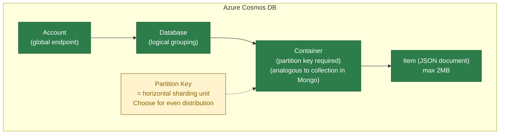
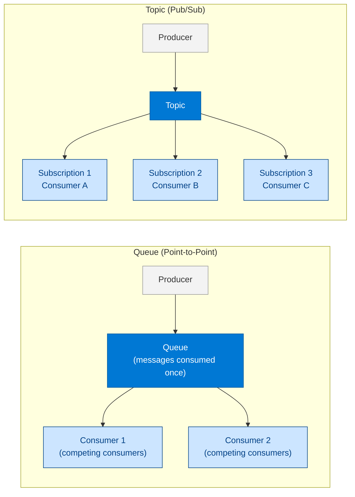
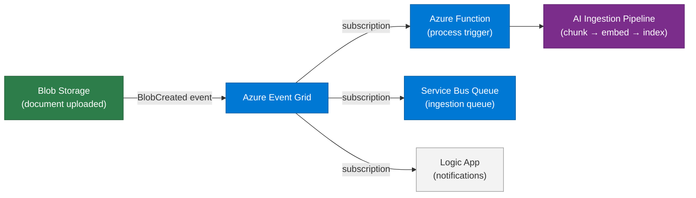
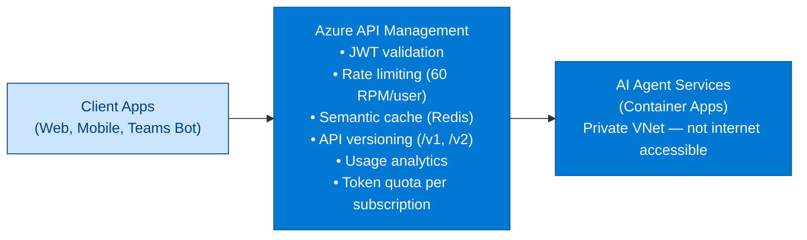

# 28 — Azure Services Deep Dive

> **Level:** Intermediate | **Time to complete:** 4 hours | **Azure services:** Azure Cosmos DB, Azure Cache for Redis, Azure Service Bus, Azure Event Grid, Azure API Management, Azure Functions

---

## 1. Overview

This module covers the Azure data and integration services most commonly used in AI agent architectures: their key features, when to use them, configuration best practices, and Python SDK patterns.

---

## 2. Azure Cosmos DB

Cosmos DB is the primary state store for AI agents: conversation history, agent task state, LangGraph checkpoints, document metadata.

### 2.1 Core Concepts



### 2.2 Partition Key Design for AI Agents

| Use case | Partition key | Reason |
|---|---|---|
| Conversation history | `session_id` | Each session isolated, no cross-partition queries needed |
| Document metadata | `category` or `department` | Queries always filter by category |
| Agent task state | `task_id` | Tasks are independent, no aggregation across tasks |
| User preferences | `user_id` | One user's data always co-located |

### 2.3 Python SDK Pattern

```python
# cosmos_db.py
import asyncio
import os
from azure.cosmos.aio import CosmosClient
from azure.identity.aio import DefaultAzureCredential

credential = DefaultAzureCredential()


async def get_container(database: str, container: str):
    client = CosmosClient(
        url=os.environ["COSMOS_ENDPOINT"],
        credential=credential,
    )
    return client.get_database_client(database).get_container_client(container)


async def save_conversation_turn(session_id: str, turn: dict) -> None:
    """Upsert a conversation turn (idempotent via id field)."""
    container = await get_container("agents", "conversations")
    item = {
        "id": f"{session_id}-{turn['timestamp']}",
        "session_id": session_id,  # partition key
        **turn,
    }
    async with CosmosClient(os.environ["COSMOS_ENDPOINT"], credential) as client:
        db = client.get_database_client("agents")
        ctr = db.get_container_client("conversations")
        await ctr.upsert_item(item)


async def get_conversation_history(session_id: str, limit: int = 20) -> list[dict]:
    """Get recent conversation turns for a session."""
    async with CosmosClient(os.environ["COSMOS_ENDPOINT"], credential) as client:
        db = client.get_database_client("agents")
        ctr = db.get_container_client("conversations")
        query = (
            "SELECT TOP @limit * FROM c WHERE c.session_id = @session_id "
            "ORDER BY c.timestamp DESC"
        )
        results = ctr.query_items(
            query=query,
            parameters=[
                {"name": "@limit", "value": limit},
                {"name": "@session_id", "value": session_id},
            ],
            partition_key=session_id,
        )
        items = [item async for item in results]
        return list(reversed(items))  # Chronological order
```

---

## 3. Azure Cache for Redis

Redis on Azure is used for: semantic query cache, session state, rate limiting counters, and pub/sub for agent events.

### 3.1 Redis Tiers for AI

| Tier | Max memory | Clustering | Use case |
|---|---|---|---|
| Basic | 250MB | No | Dev only |
| Standard | 53GB | No | Small production |
| **Premium** | 530GB | Yes | Production: persistence + VNet + geo-replication |
| **Enterprise** | 2TB | Yes | RediSearch vector module, ultra-low latency |

### 3.2 Key Patterns

```python
# redis_patterns.py
import asyncio
import json
from redis.asyncio import Redis

redis = Redis.from_url(os.environ["REDIS_URL"], decode_responses=True)


# Pattern 1: Distributed lock (prevent duplicate processing)
async def process_with_lock(task_id: str, process_fn) -> dict | None:
    """Acquire distributed lock before processing to prevent duplicates."""
    lock_key = f"lock:{task_id}"
    lock_acquired = await redis.set(lock_key, "1", ex=300, nx=True)  # 5min TTL, NX=only if not exists
    if not lock_acquired:
        return None  # Another worker is processing this task

    try:
        return await process_fn(task_id)
    finally:
        await redis.delete(lock_key)


# Pattern 2: Rate limiting per user
async def check_rate_limit(user_id: str, limit: int = 60, window: int = 60) -> bool:
    """Returns True if allowed, False if rate-limited. Sliding window."""
    key = f"rate:{user_id}:{int(asyncio.get_event_loop().time() // window)}"
    count = await redis.incr(key)
    if count == 1:
        await redis.expire(key, window)
    return count <= limit


# Pattern 3: Session cache with TTL
async def get_or_set_session(session_id: str, fetch_fn, ttl: int = 3600) -> dict:
    """Cache-aside pattern for session data."""
    cached = await redis.get(f"session:{session_id}")
    if cached:
        return json.loads(cached)
    data = await fetch_fn(session_id)
    await redis.setex(f"session:{session_id}", ttl, json.dumps(data))
    return data


# Pattern 4: Pub/Sub for agent events
async def publish_agent_event(event_type: str, payload: dict) -> None:
    await redis.publish(f"agent-events:{event_type}", json.dumps(payload))


async def subscribe_to_events(event_type: str, handler):
    async with redis.pubsub() as pubsub:
        await pubsub.subscribe(f"agent-events:{event_type}")
        async for message in pubsub.listen():
            if message["type"] == "message":
                await handler(json.loads(message["data"]))
```

---

## 4. Azure Service Bus

Service Bus provides reliable async messaging between AI agent components.

### 4.1 Queues vs. Topics



Use **queues** when: one processor should handle each message (work distribution).  
Use **topics** when: multiple processors should react to each message (events).

### 4.2 Python SDK with Managed Identity

```python
# service_bus.py
import asyncio
import json
import os
from azure.servicebus.aio import ServiceBusClient
from azure.servicebus import ServiceBusMessage
from azure.identity.aio import DefaultAzureCredential

credential = DefaultAzureCredential()
NAMESPACE = os.environ["SERVICEBUS_NAMESPACE"]  # e.g., "contoso.servicebus.windows.net"


async def send_task(queue_name: str, payload: dict, correlation_id: str | None = None) -> None:
    """Send a task message to a Service Bus queue."""
    async with ServiceBusClient(NAMESPACE, credential) as client:
        sender = client.get_queue_sender(queue_name)
        async with sender:
            message = ServiceBusMessage(
                body=json.dumps(payload).encode(),
                correlation_id=correlation_id,
                content_type="application/json",
                time_to_live=60 * 60 * 24,  # 24h TTL
            )
            await sender.send_messages(message)


async def receive_and_process(queue_name: str, handler, max_wait_time: int = 5):
    """
    Receive messages from a queue and process them.
    Messages are auto-completed on success, abandoned on failure (retry), 
    or dead-lettered after max_delivery_count.
    """
    async with ServiceBusClient(NAMESPACE, credential) as client:
        receiver = client.get_queue_receiver(
            queue_name,
            prefetch_count=10,
        )
        async with receiver:
            async for message in receiver:
                try:
                    payload = json.loads(bytes(message).decode())
                    await handler(payload)
                    await receiver.complete_message(message)  # ACK: remove from queue
                except ValueError as e:
                    # Bad message format — dead letter immediately
                    await receiver.dead_letter_message(message, reason=str(e))
                except Exception as e:
                    # Transient failure — abandon (return to queue for retry)
                    await receiver.abandon_message(message)
```

---

## 5. Azure Event Grid

Event Grid is the event routing service — it reacts to Azure resource events and custom application events.

### 5.1 AI Pipeline Event Flow



```python
# event_grid_handler.py — Azure Function triggered by Event Grid
import logging
import json
import azure.functions as func

app = func.FunctionApp()

@app.event_grid_trigger(arg_name="event")
async def on_blob_created(event: func.EventGridEvent):
    """Triggered when a new document is uploaded to Blob Storage."""
    event_data = event.get_json()
    blob_url = event_data.get("url", "")

    if not blob_url.endswith((".pdf", ".docx", ".txt", ".md")):
        logging.info(f"Skipping non-document: {blob_url}")
        return

    logging.info(f"New document for indexing: {blob_url}")

    # Publish to Service Bus for async ingestion
    from service_bus import send_task
    await send_task("document-ingestion", {
        "blob_url": blob_url,
        "event_time": event.event_time.isoformat(),
        "correlation_id": event.id,
    })
```

---

## 6. Azure API Management

APIM is the API gateway for all AI service APIs — providing auth, rate limiting, caching, versioning, and monitoring.

### 6.1 APIM for AI APIs Pattern



---

## 7. Production Checklist

- [ ] Cosmos DB partition key chosen for even distribution at target scale (> 10 partitions)
- [ ] Cosmos DB TTL set on session data items (auto-expire old sessions)
- [ ] Redis Premium tier with persistence enabled (AOF) for session data
- [ ] Service Bus dead-letter queue monitored with alert on any DLQ message
- [ ] Event Grid retry policy configured: exponential backoff, 24h deadline
- [ ] APIM rate limits tested under load before production cutover
- [ ] All services connected via private endpoints — no public internet access

---

## 8. Interview Q&A

### Q1 (Advanced): How would you choose between Azure Cosmos DB and Azure Cache for Redis for storing AI agent conversation history?

**Answer:** Both can store conversation history, but they have different strengths: **Redis** is optimal for active conversations: sub-millisecond access, automatic TTL expiry, and ability to store just recent N messages via a list data structure. It's ephemeral (data can be lost on failure without persistence), limited in size, and expensive per GB. **Cosmos DB** is optimal for durable history: multi-region replication, SQL-like queries across all sessions, unlimited storage, and built-in change feed for audit/analytics. It's slower (5–15ms) and more expensive per operation. **The right answer for most production systems: use Redis for active session data (last 20 messages, 4-hour TTL) AND Cosmos DB for durable archival (full history, replicated)**. When the Redis session expires or the user returns after a long break, load historical context from Cosmos DB. This hybrid approach gives you: low latency for active conversations, durability for compliance/audit, and cost efficiency (most read hits Redis, not Cosmos DB).

---

## Cross-links

- Previous: [27 — Cloud-Native AI](./27-Cloud-Native-AI.md)
- Next: [29 — Deployment](./29-Deployment.md)
- Related: [11 — Agent Orchestration](./11-Agent-Orchestration.md) | [12 — Agent-to-Agent Communication](./12-Agent-to-Agent-Communication.md)

---

*Module 28 | Series: Enterprise Agentic AI Tutorial | Last updated: June 2026*
