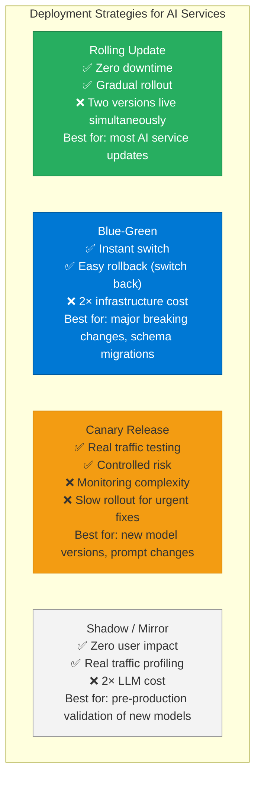
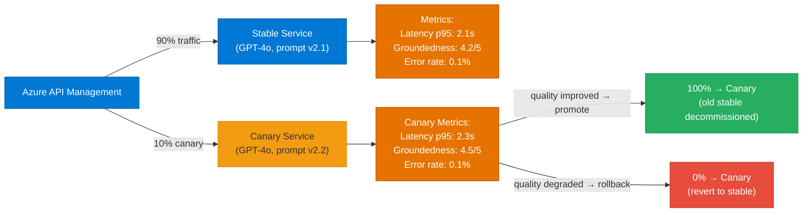
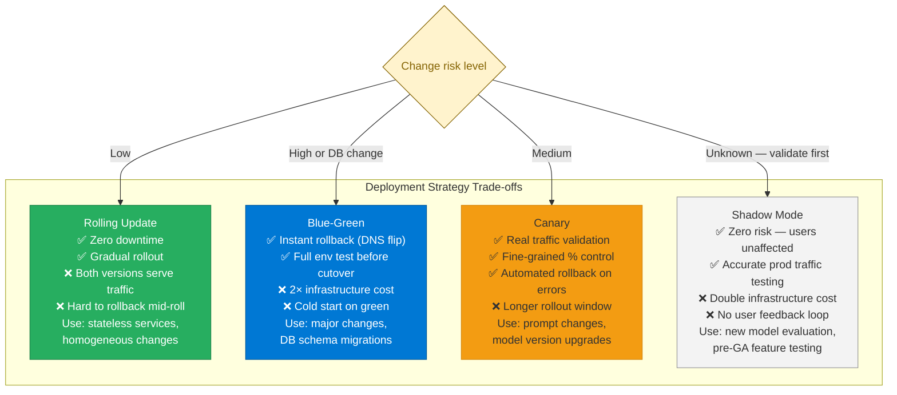

# 29 — Deployment

> **Level:** Advanced | **Time to complete:** 4 hours | **Azure services:** Azure Container Apps, AKS, Azure Container Registry, GitHub Actions, Azure DevOps

---

## 1. Overview

Deploying AI agents to production requires more than a `docker push` — it requires: immutable image tags (not `latest`), zero-downtime deployments, environment promotion pipelines, model deployment gates, and rollback capability. This module covers the full deployment lifecycle for enterprise AI systems.

---

## 2. Deployment Strategies



### 2.1 Canary Deployment for Model Updates



---

## 3. GitHub Actions CI/CD Pipeline

```yaml
# .github/workflows/deploy.yml
name: Build and Deploy AI Agent

on:
  push:
    branches: [main]
  pull_request:
    branches: [main]

env:
  REGISTRY: contosoai.azurecr.io
  IMAGE_NAME: ai-agent
  CONTAINER_APP_NAME: ai-agent-service
  RESOURCE_GROUP: rg-ai-production

jobs:
  # Job 1: Test and evaluate
  test:
    runs-on: ubuntu-latest
    steps:
      - uses: actions/checkout@v4

      - name: Set up Python
        uses: actions/setup-python@v5
        with:
          python-version: "3.12"

      - name: Install dependencies
        run: |
          pip install uv
          uv sync --frozen

      - name: Run unit tests
        run: uv run pytest tests/unit/ -v --tb=short

      - name: Run prompt evaluation
        env:
          AZURE_OPENAI_ENDPOINT: ${{ secrets.AZURE_OPENAI_ENDPOINT }}
          AZURE_OPENAI_API_KEY: ${{ secrets.AZURE_OPENAI_API_KEY }}
        run: |
          uv run python scripts/evaluate_prompts.py --threshold 0.85
          # Fails the pipeline if evaluation score < 85%

  # Job 2: Build and push container
  build:
    needs: test
    runs-on: ubuntu-latest
    outputs:
      image-tag: ${{ steps.meta.outputs.version }}

    steps:
      - uses: actions/checkout@v4

      - name: Azure login
        uses: azure/login@v2
        with:
          client-id: ${{ secrets.AZURE_CLIENT_ID }}
          tenant-id: ${{ secrets.AZURE_TENANT_ID }}
          subscription-id: ${{ secrets.AZURE_SUBSCRIPTION_ID }}

      - name: Log in to ACR
        run: az acr login --name contosoai

      - name: Docker metadata
        id: meta
        uses: docker/metadata-action@v5
        with:
          images: ${{ env.REGISTRY }}/${{ env.IMAGE_NAME }}
          tags: |
            type=sha,prefix=,suffix=,format=short
            type=ref,event=branch
            # Never use 'latest' in production

      - name: Build and push
        uses: docker/build-push-action@v5
        with:
          context: .
          push: ${{ github.event_name != 'pull_request' }}
          tags: ${{ steps.meta.outputs.tags }}
          labels: ${{ steps.meta.outputs.labels }}
          cache-from: type=registry,ref=${{ env.REGISTRY }}/${{ env.IMAGE_NAME }}:cache
          cache-to: type=registry,ref=${{ env.REGISTRY }}/${{ env.IMAGE_NAME }}:cache,mode=max

  # Job 3: Deploy to staging
  deploy-staging:
    needs: build
    runs-on: ubuntu-latest
    environment: staging

    steps:
      - uses: azure/login@v2
        with:
          client-id: ${{ secrets.AZURE_CLIENT_ID }}
          tenant-id: ${{ secrets.AZURE_TENANT_ID }}
          subscription-id: ${{ secrets.AZURE_SUBSCRIPTION_ID }}

      - name: Deploy to staging Container Apps
        run: |
          az containerapp update \
            --name ${{ env.CONTAINER_APP_NAME }}-staging \
            --resource-group rg-ai-staging \
            --image ${{ env.REGISTRY }}/${{ env.IMAGE_NAME }}:${{ needs.build.outputs.image-tag }}

      - name: Run integration tests against staging
        run: |
          sleep 30  # Wait for deployment
          python scripts/integration_tests.py --endpoint https://ai-agent-staging.azurecontainerapps.io

  # Job 4: Deploy to production (manual approval required)
  deploy-production:
    needs: [build, deploy-staging]
    runs-on: ubuntu-latest
    environment: production  # GitHub environment with required reviewers

    steps:
      - uses: azure/login@v2
        with:
          client-id: ${{ secrets.AZURE_CLIENT_ID }}
          tenant-id: ${{ secrets.AZURE_TENANT_ID }}
          subscription-id: ${{ secrets.AZURE_SUBSCRIPTION_ID }}

      - name: Deploy to production (canary — 10% traffic)
        run: |
          az containerapp ingress traffic set \
            --name ${{ env.CONTAINER_APP_NAME }} \
            --resource-group ${{ env.RESOURCE_GROUP }} \
            --revision-weight latest=10 stable=90

      - name: Monitor canary for 10 minutes
        run: |
          python scripts/monitor_canary.py \
            --duration 600 \
            --error-threshold 0.5 \
            --latency-threshold 5.0

      - name: Promote to 100% if canary healthy
        run: |
          az containerapp ingress traffic set \
            --name ${{ env.CONTAINER_APP_NAME }} \
            --resource-group ${{ env.RESOURCE_GROUP }} \
            --revision-weight latest=100
```

---

## 4. Infrastructure as Code — Bicep

```bicep
// main.bicep — complete AI agent infrastructure
targetScope = 'resourceGroup'

param location string = resourceGroup().location
param environment string  // 'staging' | 'production'
param imageTag string

// Container Registry
resource acr 'Microsoft.ContainerRegistry/registries@2023-07-01' = {
  name: 'contosoai${environment}'
  location: location
  sku: { name: 'Premium' }  // Private endpoint + geo-replication
  properties: {
    adminUserEnabled: false  // Use Managed Identity only
    publicNetworkAccess: 'Disabled'
  }
}

// Container Apps Environment
resource env 'Microsoft.App/managedEnvironments@2024-03-01' = {
  name: 'cae-ai-${environment}'
  location: location
  properties: {
    appLogsConfiguration: {
      destination: 'log-analytics'
      logAnalyticsConfiguration: {
        customerId: logAnalytics.properties.customerId
        sharedKey: logAnalytics.listKeys().primarySharedKey
      }
    }
  }
}

// AI Agent Container App
resource agentApp 'Microsoft.App/containerApps@2024-03-01' = {
  name: 'ca-ai-agent-${environment}'
  location: location
  identity: { type: 'SystemAssigned' }
  properties: {
    managedEnvironmentId: env.id
    configuration: {
      ingress: {
        external: false
        targetPort: 8080
        transport: 'http2'
        traffic: [{ latestRevision: true, weight: 100 }]
      }
    }
    template: {
      containers: [{
        name: 'ai-agent'
        image: '${acr.properties.loginServer}/ai-agent:${imageTag}'
        resources: {
          cpu: environment == 'production' ? '2.0' : '0.5'
          memory: environment == 'production' ? '4Gi' : '1Gi'
        }
        env: [
          { name: 'AZURE_OPENAI_ENDPOINT', value: aoai.properties.endpoint }
          { name: 'AZURE_SEARCH_ENDPOINT', value: search.properties.endpoint }
          { name: 'ENVIRONMENT', value: environment }
        ]
      }]
      scale: {
        minReplicas: environment == 'production' ? 2 : 0
        maxReplicas: environment == 'production' ? 20 : 3
      }
    }
  }
}
```

---

## 5. Rollback Procedures

```python
# rollback.py — automated rollback on quality degradation
import subprocess
import sys
import time
from azure.monitor.query import MetricsQueryClient
from azure.identity import DefaultAzureCredential

credential = DefaultAzureCredential()


def get_error_rate(app_name: str, resource_group: str, minutes: int = 5) -> float:
    """Get current error rate from Azure Monitor."""
    client = MetricsQueryClient(credential)
    # Simplified — real implementation uses Azure Monitor Metrics API
    return 0.0  # Placeholder


def rollback_to_previous_revision(
    app_name: str,
    resource_group: str,
    previous_revision: str,
) -> None:
    """Roll back Container App to a previous revision."""
    print(f"ROLLBACK: routing 100% traffic to {previous_revision}")
    subprocess.run([
        "az", "containerapp", "ingress", "traffic", "set",
        "--name", app_name,
        "--resource-group", resource_group,
        "--revision-weight", f"{previous_revision}=100",
    ], check=True)


def monitor_and_auto_rollback(
    app_name: str,
    resource_group: str,
    previous_revision: str,
    error_threshold: float = 0.01,  # 1%
    check_interval: int = 60,
    duration: int = 600,  # 10 minutes
) -> bool:
    """Monitor a canary deployment and auto-rollback on degradation."""
    checks = duration // check_interval
    for i in range(checks):
        time.sleep(check_interval)
        error_rate = get_error_rate(app_name, resource_group)

        print(f"[{i+1}/{checks}] Error rate: {error_rate:.2%}")

        if error_rate > error_threshold:
            print(f"ERROR RATE EXCEEDED THRESHOLD ({error_rate:.2%} > {error_threshold:.2%})")
            rollback_to_previous_revision(app_name, resource_group, previous_revision)
            return False

    print("Canary deployment healthy — promoting to 100%")
    return True
```

---

## 5.1 Deployment Strategy Comparison



## 6. Production Checklist

- [ ] Immutable image tags: SHA-based (never `latest` in production)
- [ ] Canary deployment: new versions start at 10% traffic before full rollout
- [ ] Automated rollback: error rate > 1% triggers auto-rollback within 2 minutes
- [ ] Staging environment mirrors production (same image, different config)
- [ ] Manual approval gate in CI/CD before production deployment
- [ ] Azure Container Registry geo-replicated to all deployment regions
- [ ] Bicep/Terraform for all infrastructure: no manual portal changes
- [ ] Deployment history retained for 30 days (rollback capability)

---

## 7. Interview Q&A

### Q1 (Advanced): Describe a safe deployment process for updating an LLM system prompt in production.

**Answer:** System prompt changes can dramatically affect agent behavior — they must be deployed as carefully as code. Process: (1) **Version the prompt**: store the new prompt in the prompt registry with version `v2.2.0` alongside the current `v2.1.0`; (2) **Offline evaluation**: run the full evaluation test suite (100+ golden examples) against v2.2.0 vs v2.1.0. Block deployment if any metric regresses > 5%; (3) **Shadow testing**: deploy v2.2.0 to a shadow environment that receives mirrored production traffic — compare outputs without user impact; (4) **Canary**: deploy to 5% of production traffic. Monitor groundedness score, hallucination rate, and user satisfaction signals (thumbs up/down); (5) **Progressive rollout**: 5% → 25% → 50% → 100% with 1-hour holds at each stage. Automated rollback if error rate > 0.5%; (6) **Observability**: every LLM call tagged with `prompt_version` in logs so you can query "show me all calls using v2.2.0 with a groundedness score < 3". This process applies to both prompt changes and model version upgrades.

---

## Cross-links

- Previous: [28 — Azure Services Deep Dive](./28-Azure-Services.md)
- Next: [30 — Kubernetes](./30-Kubernetes.md)
- Related: [31 — DevOps](./31-DevOps.md) | [27 — Cloud-Native AI](./27-Cloud-Native-AI.md)

---

*Module 29 | Series: Enterprise Agentic AI Tutorial | Last updated: June 2026*
