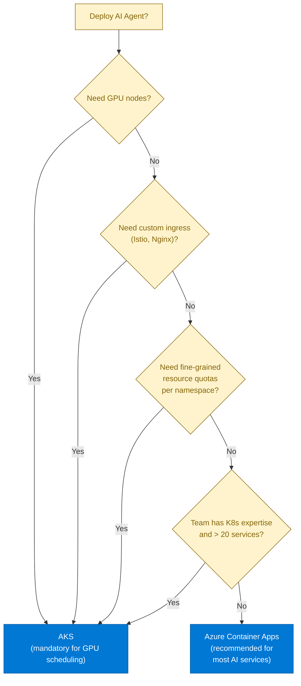
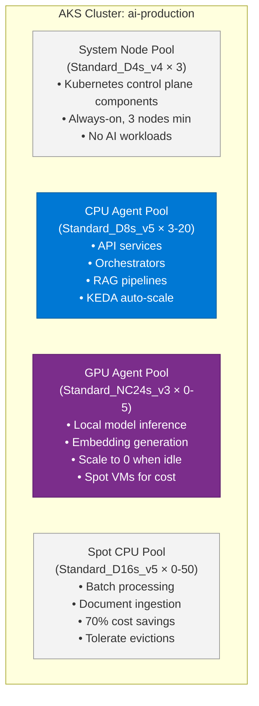
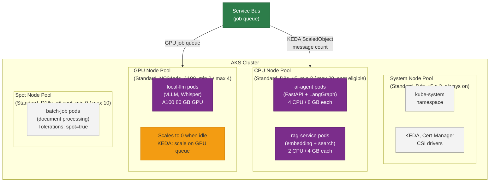

# 30 — Kubernetes for AI Systems

> **Level:** Advanced | **Time to complete:** 3.5 hours | **Azure services:** AKS, Azure Container Registry, KEDA, Azure Managed Disks, Azure GPU VMs

---

## 1. Overview

Azure Kubernetes Service (AKS) is the platform of choice for large-scale AI agent deployments that need fine-grained control over resource allocation, GPU scheduling, networking, or custom autoscaling. This module covers AKS-specific patterns for AI workloads.

---

## 2. When to Use AKS vs. Container Apps



---

## 3. AKS Cluster for AI Workloads

### 3.1 Node Pool Architecture



### 3.2 Cluster Bicep/ARM

```bicep
// aks_cluster.bicep
resource aks 'Microsoft.ContainerService/managedClusters@2024-06-02-preview' = {
  name: 'aks-ai-production'
  location: location
  identity: { type: 'SystemAssigned' }
  properties: {
    dnsPrefix: 'ai-prod'
    enableRBAC: true
    agentPoolProfiles: [
      // System pool
      {
        name: 'system'
        count: 3
        vmSize: 'Standard_D4s_v4'
        mode: 'System'
        osType: 'Linux'
        enableAutoScaling: false
      }
      // CPU pool for AI services
      {
        name: 'cpu'
        count: 3
        minCount: 3
        maxCount: 20
        vmSize: 'Standard_D8s_v5'
        mode: 'User'
        osType: 'Linux'
        enableAutoScaling: true
        availabilityZones: ['1', '2', '3']
      }
      // GPU pool for local inference
      {
        name: 'gpu'
        count: 0
        minCount: 0
        maxCount: 5
        vmSize: 'Standard_NC24s_v3'
        mode: 'User'
        osType: 'Linux'
        enableAutoScaling: true
        nodeTaints: ['nvidia.com/gpu=present:NoSchedule']  // Only GPU workloads scheduled here
        nodeLabels: { workload: 'gpu' }
      }
    ]
    oidcIssuerProfile: { enabled: true }  // Required for Workload Identity
    securityProfile: {
      workloadIdentity: { enabled: true }
    }
  }
}
```

---

## 4. AI Agent Kubernetes Deployment

### 4.1 Deployment Manifest

```yaml
# deployment.yaml
apiVersion: apps/v1
kind: Deployment
metadata:
  name: ai-agent
  namespace: ai-prod
  labels:
    app: ai-agent
    version: v2.1.0
spec:
  replicas: 3
  selector:
    matchLabels:
      app: ai-agent
  strategy:
    type: RollingUpdate
    rollingUpdate:
      maxUnavailable: 1
      maxSurge: 2  # Allow extra replicas during rollout for zero-downtime
  template:
    metadata:
      labels:
        app: ai-agent
        version: v2.1.0
        azure.workload.identity/use: "true"  # Workload Identity
    spec:
      serviceAccountName: ai-agent-sa  # Links to Azure Managed Identity
      
      topologySpreadConstraints:
        - maxSkew: 1
          topologyKey: kubernetes.io/hostname
          whenUnsatisfiable: DoNotSchedule
          labelSelector:
            matchLabels:
              app: ai-agent
      
      containers:
        - name: ai-agent
          image: contosoai.azurecr.io/ai-agent:sha-abc123  # Immutable SHA tag
          ports:
            - containerPort: 8080
          
          resources:
            requests:
              cpu: "500m"
              memory: "1Gi"
            limits:
              cpu: "2000m"
              memory: "4Gi"
          
          env:
            - name: AZURE_OPENAI_ENDPOINT
              valueFrom:
                configMapKeyRef:
                  name: ai-config
                  key: aoai_endpoint
            - name: ENVIRONMENT
              value: "production"
          
          livenessProbe:
            httpGet:
              path: /health/live
              port: 8080
            initialDelaySeconds: 30
            periodSeconds: 30
            failureThreshold: 3
          
          readinessProbe:
            httpGet:
              path: /health/ready
              port: 8080
            initialDelaySeconds: 10
            periodSeconds: 10
            failureThreshold: 3
          
          lifecycle:
            preStop:
              exec:
                command: ["/bin/sh", "-c", "sleep 5"]  # Allow load balancer to drain
      
      terminationGracePeriodSeconds: 60  # Time for in-flight LLM calls to complete
```

### 4.2 KEDA Scaling

```yaml
# keda_scaledobject.yaml — scale AI workers based on Service Bus queue depth
apiVersion: keda.sh/v1alpha1
kind: ScaledObject
metadata:
  name: ai-document-worker
  namespace: ai-prod
spec:
  scaleTargetRef:
    name: document-processing-worker
  
  minReplicaCount: 0  # Scale to zero when no messages
  maxReplicaCount: 50
  cooldownPeriod: 300  # 5 minutes before scaling down
  
  triggers:
    - type: azure-servicebus
      metadata:
        namespace: contoso.servicebus.windows.net
        queueName: document-processing
        messageCount: "5"  # 1 replica per 5 pending messages
        activationMessageCount: "1"  # Scale from 0 when any message arrives
      authenticationRef:
        name: keda-trigger-auth-servicebus
```

---

## 5. GPU Workloads on AKS

```yaml
# gpu_deployment.yaml — local embedding model on GPU node
apiVersion: apps/v1
kind: Deployment
metadata:
  name: embedding-model
  namespace: ai-prod
spec:
  replicas: 1
  template:
    spec:
      tolerations:
        - key: "nvidia.com/gpu"
          operator: "Exists"
          effect: "NoSchedule"
      
      nodeSelector:
        workload: gpu
      
      containers:
        - name: embedding-server
          image: contosoai.azurecr.io/embedding-server:latest
          resources:
            limits:
              nvidia.com/gpu: "1"  # Request 1 GPU
              memory: "16Gi"
              cpu: "4"
          
          ports:
            - containerPort: 8001
          
          volumeMounts:
            - name: model-weights
              mountPath: /models
      
      volumes:
        - name: model-weights
          persistentVolumeClaim:
            claimName: model-weights-pvc  # Azure Managed Disk (SSD)
```

---

## 6. Helm Chart for AI Agent

```yaml
# helm/ai-agent/values.yaml
replicaCount: 3
image:
  repository: contosoai.azurecr.io/ai-agent
  tag: ""  # Overridden at deploy time with SHA
  pullPolicy: IfNotPresent

serviceAccount:
  create: true
  name: ai-agent-sa
  annotations:
    azure.workload.identity/client-id: "<managed-identity-client-id>"

config:
  aoaiEndpoint: ""
  searchEndpoint: ""
  environment: "production"

resources:
  requests:
    cpu: "500m"
    memory: "1Gi"
  limits:
    cpu: "2000m"
    memory: "4Gi"

autoscaling:
  enabled: true
  minReplicas: 2
  maxReplicas: 20
  targetCPUUtilizationPercentage: 60

# Helm install: helm upgrade --install ai-agent ./helm/ai-agent \
#   --set image.tag=sha-abc123 \
#   --set config.aoaiEndpoint=https://... \
#   -f values-production.yaml
```

---

## 6.1 AKS Node Pool Architecture for AI



## 7. Production Checklist

- [ ] Node pools separated by workload type (system / CPU / GPU / spot)
- [ ] GPU node pool scales to 0 when idle (cost control)
- [ ] AKS Workload Identity configured — no service principal secrets in pods
- [ ] Pod topology spread constraints: pods distributed across nodes and AZs
- [ ] `terminationGracePeriodSeconds: 60` — allows in-flight LLM calls to complete
- [ ] KEDA configured for Service Bus / Event Hub triggered workers (scale-to-zero)
- [ ] PodDisruptionBudgets set for all AI services (min 1 available during rolling updates)
- [ ] Helm chart used for all deployments — templated, version-controlled

---

## 8. Interview Q&A

### Q1 (Advanced): Why would you use AKS instead of Azure Container Apps for an AI agent workload, and what is the cost trade-off?

**Answer:** AKS is justified over Container Apps when: (1) **GPU scheduling** — Container Apps doesn't support GPU-enabled containers, so if you're running local models (ONNX, vLLM, Whisper), you need AKS GPU node pools; (2) **Custom networking** — Istio service mesh, custom CNI plugins, or network policies more complex than Container Apps supports; (3) **Multi-team clusters** — 20+ microservices that benefit from namespace-level resource isolation and RBAC; (4) **Spot node optimizations** — complex bin-packing and spot VM handling for batch AI workloads. Cost trade-off: AKS requires a dedicated operations team (SRE or platform engineering) with Kubernetes expertise. This overhead costs $100K-400K/year in personnel. Container Apps hides all K8s complexity — you just deploy containers and set scaling rules. For most teams (< 10 microservices, no GPU, no custom networking), Container Apps is faster to market and cheaper operationally. Choose AKS when the technical requirements can't be met by Container Apps, not simply because "we want control."

---

## Cross-links

- Previous: [29 — Deployment](./29-Deployment.md)
- Next: [31 — DevOps](./31-DevOps.md)
- Related: [27 — Cloud-Native AI](./27-Cloud-Native-AI.md) | [32 — Observability](./32-Observability.md)

---

*Module 30 | Series: Enterprise Agentic AI Tutorial | Last updated: June 2026*
