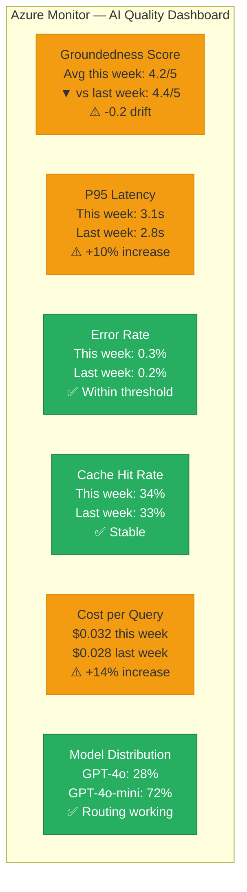
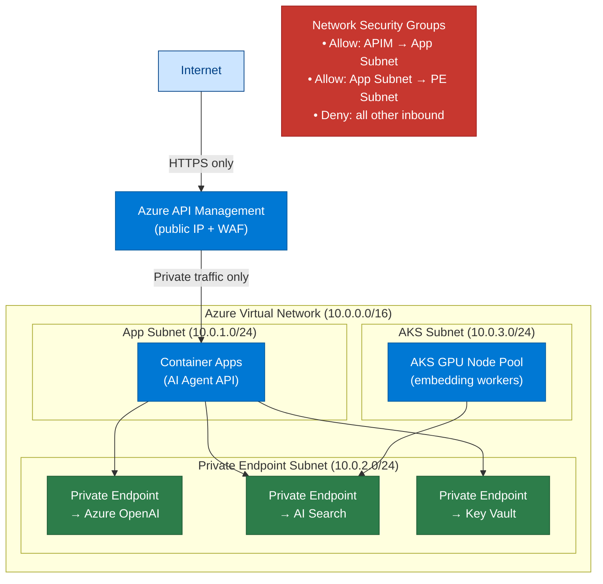
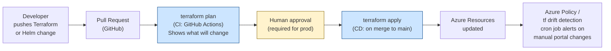

# 31 — DevOps for AI Systems

> **Level:** Intermediate | **Time to complete:** 3 hours | **Azure services:** Azure DevOps, GitHub Actions, Azure Container Registry, Azure AI Foundry, Azure Monitor

---

## 1. Overview

DevOps for AI (sometimes called MLOps or LLMOps) extends traditional DevOps with AI-specific challenges: prompt versioning, model evaluation gates, embedding freshness, and the need to validate AI quality — not just test correctness. This module covers the full CI/CD lifecycle for enterprise AI agent systems.

---

## 2. LLMOps Pipeline

```mermaid
graph LR
    subgraph DEV["Development"]
        CODE["Code\n(agent logic)"]
        PROMPT["Prompt\n(versioned)"]
        CONFIG["Config\n(model, params)"]
    end

    subgraph CI["Continuous Integration"]
        UNIT["Unit Tests\n(tool functions,\nrouting logic)"]
        EVAL["Prompt Evaluation\n(LLM-as-judge\nvs golden dataset)"]
        SECURITY["Security Scan\n(secret detection,\ncontainer CVE scan)"]
        BUILD["Container Build\n(immutable SHA tag)"]
    end

    subgraph CD["Continuous Delivery"]
        STAGING["Deploy to Staging\n(auto)"]
        INTTEST["Integration Tests\n(end-to-end\nagent scenarios)"]
        APPROVAL["Manual Approval\n(release manager)"]
        CANARY["Canary (10%)\n(auto-promote if healthy)"]
        PROD["Full Production\n(100%)"]
    end

    subgraph MONITOR["Continuous Monitoring"]
        QUALITY["Quality Drift\n(weekly eval run)"]
        PERF["Performance\n(latency, throughput)"]
        COST["Cost\n($ per query trend)"]
    end

    DEV --> CI --> CD --> MONITOR
    MONITOR -->|"degradation detected"| DEV

    classDef primary   fill:#0078d4,color:#fff,stroke:#005a9e
    classDef secondary fill:#7b2d8b,color:#fff,stroke:#5a1a6b
    classDef storage   fill:#2d7d4a,color:#fff,stroke:#1f5c35
    classDef security  fill:#c7372f,color:#fff,stroke:#a02020
    classDef monitor   fill:#e67300,color:#fff,stroke:#b35500
    classDef success   fill:#27ae60,color:#fff,stroke:#1e8449
    classDef warning   fill:#f39c12,color:#333,stroke:#d68910
    classDef neutral   fill:#f3f3f3,color:#333,stroke:#999
    classDef user      fill:#cce5ff,color:#004085,stroke:#004085
    classDef decision  fill:#fff3cd,color:#856404,stroke:#856404
    classDef highlight fill:#e74c3c,color:#fff,stroke:#c0392b

    class CODE,PROMPT,CONFIG neutral
    class UNIT,EVAL,BUILD primary
    class SECURITY security
    class STAGING,INTTEST,CANARY,PROD primary
    class APPROVAL warning
    class QUALITY,PERF,COST monitor
```



---

## 2.1 Prompt Evaluation Gate

```mermaid
graph LR
    PR["Pull Request\n(prompt change)"] --> CI["CI: Run evaluation\n100 golden test cases\nLLM-as-judge scoring"]
    CI -->|"pass rate ≥ 85%"| BUILD["✅ Allow build\nand deploy"]
    CI -->|"pass rate < 85%"| BLOCK["❌ Block deployment\nPost failure details to PR"]
    BUILD --> STAGING["Deploy to Staging"]
    STAGING --> INT["Integration tests\n(10 end-to-end scenarios)"]
    INT -->|"pass"| APPROVE["Manual approval\n(release manager)"]
    INT -->|"fail"| BLOCK2["❌ Block production\ndeploy"]
    APPROVE --> CANARY["Canary 10%\n(monitor 10 min)"]
    CANARY -->|"error rate < 1%"| FULL["100% production"]
    CANARY -->|"error rate ≥ 1%"| ROLLBACK["⚡ Auto-rollback\nto previous revision"]

    classDef primary   fill:#0078d4,color:#fff,stroke:#005a9e
    classDef secondary fill:#7b2d8b,color:#fff,stroke:#5a1a6b
    classDef storage   fill:#2d7d4a,color:#fff,stroke:#1f5c35
    classDef security  fill:#c7372f,color:#fff,stroke:#a02020
    classDef monitor   fill:#e67300,color:#fff,stroke:#b35500
    classDef success   fill:#27ae60,color:#fff,stroke:#1e8449
    classDef warning   fill:#f39c12,color:#333,stroke:#d68910
    classDef neutral   fill:#f3f3f3,color:#333,stroke:#999
    classDef user      fill:#cce5ff,color:#004085,stroke:#004085
    classDef decision  fill:#fff3cd,color:#856404,stroke:#856404
    classDef highlight fill:#e74c3c,color:#fff,stroke:#c0392b

    class PR user
    class CI primary
    class BUILD success
    class BLOCK,BLOCK2 security
    class STAGING primary
    class INT primary
    class APPROVE warning
    class CANARY warning
    class FULL success
    class ROLLBACK highlight
```



---

## 3. Prompt Evaluation in CI

The most important AI-specific CI gate: block deployment if prompt quality regresses.

```python
# scripts/evaluate_prompts.py — run before every deployment
import asyncio
import json
import sys
import os
import argparse
from openai import AsyncAzureOpenAI
from pathlib import Path

aoai = AsyncAzureOpenAI(
    azure_endpoint=os.environ["AZURE_OPENAI_ENDPOINT"],
    api_key=os.environ["AZURE_OPENAI_API_KEY"],
    api_version="2024-10-21",
)


async def evaluate_single(
    system_prompt: str,
    test_case: dict,
    judge_model: str = "gpt-4o",
) -> dict:
    """Run one test case and score with LLM-as-judge."""
    # Get model response with new prompt
    response = await aoai.chat.completions.create(
        model=os.environ.get("DEPLOYMENT_NAME", "gpt-4o"),
        messages=[
            {"role": "system", "content": system_prompt},
            {"role": "user", "content": test_case["input"]},
        ],
        temperature=0,
    )
    model_response = response.choices[0].message.content

    # Judge the response
    judge_response = await aoai.chat.completions.create(
        model=judge_model,
        messages=[
            {"role": "system", "content": """Score this AI response compared to the reference.
Return JSON: {"score": 1-5, "reason": str, "passes": bool}
passes=True if score >= 3 and response is factually correct."""},
            {"role": "user", "content": f"""Input: {test_case['input']}
Reference answer: {test_case['expected']}
Model response: {model_response}"""},
        ],
        response_format={"type": "json_object"},
        temperature=0,
    )
    judgment = json.loads(judge_response.choices[0].message.content)
    judgment["input"] = test_case["input"]
    judgment["model_response"] = model_response
    return judgment


async def run_evaluation(
    prompt_file: str,
    test_cases_file: str,
    threshold: float = 0.85,
) -> bool:
    """
    Run full evaluation. Returns True if threshold met, False if not.
    Exit code 1 on failure — blocks CI pipeline.
    """
    system_prompt = Path(prompt_file).read_text()
    test_cases = json.loads(Path(test_cases_file).read_text())

    print(f"Running evaluation: {len(test_cases)} test cases")
    results = await asyncio.gather(*[
        evaluate_single(system_prompt, tc) for tc in test_cases
    ])

    passed = sum(1 for r in results if r["passes"])
    total = len(results)
    pass_rate = passed / total

    print(f"Results: {passed}/{total} passed ({pass_rate:.1%})")
    print(f"Threshold: {threshold:.1%}")

    # Print failures for debugging
    failures = [r for r in results if not r["passes"]]
    if failures:
        print(f"\nFailed cases ({len(failures)}):")
        for f in failures[:5]:  # Show max 5
            print(f"  Input: {f['input'][:100]}")
            print(f"  Score: {f['score']}/5 — {f['reason']}")

    passed_eval = pass_rate >= threshold
    print(f"\n{'✅ EVALUATION PASSED' if passed_eval else '❌ EVALUATION FAILED'}")
    return passed_eval


if __name__ == "__main__":
    parser = argparse.ArgumentParser()
    parser.add_argument("--prompt", default="prompts/system.md")
    parser.add_argument("--tests", default="tests/eval_cases.json")
    parser.add_argument("--threshold", type=float, default=0.85)
    args = parser.parse_args()

    success = asyncio.run(run_evaluation(args.prompt, args.tests, args.threshold))
    sys.exit(0 if success else 1)
```

---

## 4. GitHub Actions for AI

```yaml
# .github/workflows/llmops.yml
name: LLMOps Pipeline

on:
  push:
    branches: [main]
    paths:
      - 'src/**'
      - 'prompts/**'
      - 'Dockerfile'
      - 'pyproject.toml'

jobs:
  unit-tests:
    runs-on: ubuntu-latest
    steps:
      - uses: actions/checkout@v4
      - uses: actions/setup-python@v5
        with: { python-version: "3.12" }
      - run: pip install uv && uv sync --frozen
      - run: uv run pytest tests/unit/ -v

  prompt-evaluation:
    runs-on: ubuntu-latest
    needs: unit-tests
    steps:
      - uses: actions/checkout@v4
      - uses: actions/setup-python@v5
        with: { python-version: "3.12" }
      - run: pip install uv && uv sync --frozen
      - name: Evaluate prompts
        env:
          AZURE_OPENAI_ENDPOINT: ${{ secrets.AZURE_OPENAI_ENDPOINT }}
          AZURE_OPENAI_API_KEY: ${{ secrets.AZURE_OPENAI_API_KEY }}
        run: |
          uv run python scripts/evaluate_prompts.py \
            --prompt prompts/hr_copilot_system.md \
            --tests tests/eval_cases/hr_copilot.json \
            --threshold 0.85

  security-scan:
    runs-on: ubuntu-latest
    needs: unit-tests
    steps:
      - uses: actions/checkout@v4
      - name: Scan for secrets
        uses: trufflesecurity/trufflehog@main
        with:
          path: ./
          base: main
      - name: Container vulnerability scan
        uses: aquasecurity/trivy-action@master
        with:
          scan-type: 'fs'
          security-checks: 'vuln,config'
          severity: 'HIGH,CRITICAL'

  build:
    runs-on: ubuntu-latest
    needs: [prompt-evaluation, security-scan]
    outputs:
      image-tag: ${{ steps.tag.outputs.tag }}
    steps:
      - uses: actions/checkout@v4
      - id: tag
        run: echo "tag=sha-$(git rev-parse --short HEAD)" >> $GITHUB_OUTPUT
      - name: Azure Login
        uses: azure/login@v2
        with:
          client-id: ${{ secrets.AZURE_CLIENT_ID }}
          tenant-id: ${{ secrets.AZURE_TENANT_ID }}
          subscription-id: ${{ secrets.AZURE_SUBSCRIPTION_ID }}
      - run: az acr login --name contosoai
      - name: Build and push
        run: |
          docker build -t contosoai.azurecr.io/ai-agent:${{ steps.tag.outputs.tag }} .
          docker push contosoai.azurecr.io/ai-agent:${{ steps.tag.outputs.tag }}
```

---

## 4.1 AI Quality Metrics Dashboard



---

## 5. Monitoring for Quality Drift

```python
# scripts/weekly_eval_monitor.py — detect quality degradation in production
import asyncio
import json
from datetime import datetime, timedelta
from azure.monitor.query.aio import LogsQueryClient
from azure.identity.aio import DefaultAzureCredential

credential = DefaultAzureCredential()


async def detect_quality_drift(
    workspace_id: str,
    lookback_hours: int = 168,  # 1 week
    degradation_threshold: float = 0.1,
) -> dict:
    """
    Compare current week's quality metrics to previous week.
    Alert if groundedness score drops > 10%.
    """
    client = LogsQueryClient(credential)

    query = """
    AppTraces
    | where TimeGenerated > ago(14d)
    | where Message contains "groundedness_score"
    | extend score = todouble(extract('"groundedness_score":(\\\\d+\\\\.?\\\\d*)', 1, Message))
    | extend week = iff(TimeGenerated > ago(7d), "current", "previous")
    | summarize avg_score = avg(score), count = count() by week
    """

    async with LogsQueryClient(credential) as client:
        result = await client.query_workspace(
            workspace_id=workspace_id,
            query=query,
            timespan=timedelta(days=14),
        )

    weeks = {row["week"]: {"avg": row["avg_score"], "count": row["count"]} for row in result.tables[0].rows}
    current = weeks.get("current", {}).get("avg", 0)
    previous = weeks.get("previous", {}).get("avg", 1)

    degradation = (previous - current) / previous if previous > 0 else 0
    is_degraded = degradation > degradation_threshold

    report = {
        "timestamp": datetime.utcnow().isoformat(),
        "current_week_avg": round(current, 3),
        "previous_week_avg": round(previous, 3),
        "degradation_pct": round(degradation * 100, 1),
        "alert": is_degraded,
        "alert_message": f"Quality degraded {degradation*100:.1f}% (threshold: {degradation_threshold*100:.0f}%)" if is_degraded else None,
    }
    return report
```

---

## 5.1 IaaS Deep Dive — Terraform and GitOps for AI Systems

Enterprise AI workloads run on IaaS (Infrastructure as a Service) — VMs, virtual networks, storage, and Kubernetes nodes managed as code. AI architects need to be fluent in Terraform and GitOps because AI infrastructure (GPU node pools, PTU quotas, Private Endpoints, Key Vault references) must be reproducible, auditable, and deployable across environments without manual portal changes.

### Terraform for Azure AI Infrastructure

```python
# main.tf — Terraform for a complete Azure AI deployment
# Provisions: Resource Group, Azure OpenAI, AI Search, Key Vault, Container App

terraform {
  required_providers {
    azurerm = { source = "hashicorp/azurerm", version = "~> 3.90" }
  }
  backend "azurerm" {
    # Remote state in Azure Blob Storage — never use local state in teams
    resource_group_name  = "rg-terraform-state"
    storage_account_name = "satfstate"
    container_name       = "tfstate"
    key                  = "agentic-ai.tfstate"
  }
}

provider "azurerm" { features {} }

variable "environment" { default = "dev" }
variable "location"    { default = "eastus" }

resource "azurerm_resource_group" "ai" {
  name     = "rg-agentic-ai-${var.environment}"
  location = var.location
}

# Azure OpenAI
resource "azurerm_cognitive_account" "aoai" {
  name                = "aoai-${var.environment}-${random_string.suffix.result}"
  resource_group_name = azurerm_resource_group.ai.name
  location            = var.location
  kind                = "OpenAI"
  sku_name            = "S0"

  custom_subdomain_name          = "aoai-${var.environment}"
  public_network_access_enabled  = false   # Private Endpoint only
}

resource "azurerm_cognitive_deployment" "gpt4o" {
  name                 = "gpt-4o"
  cognitive_account_id = azurerm_cognitive_account.aoai.id

  model {
    format  = "OpenAI"
    name    = "gpt-4o"
    version = "2024-11-20"   # Pin version — never allow auto-upgrade
  }

  sku {
    name     = "GlobalProvisionedManaged"   # PTU
    capacity = 100
  }
}

# Azure AI Search
resource "azurerm_search_service" "search" {
  name                = "search-${var.environment}"
  resource_group_name = azurerm_resource_group.ai.name
  location            = var.location
  sku                 = "standard"
  replica_count       = 2   # HA — minimum 2 replicas for production
  partition_count     = 1
}

# Key Vault for secrets
resource "azurerm_key_vault" "kv" {
  name                     = "kv-ai-${var.environment}"
  resource_group_name      = azurerm_resource_group.ai.name
  location                 = var.location
  tenant_id                = data.azurerm_client_config.current.tenant_id
  sku_name                 = "standard"
  purge_protection_enabled = true   # Prevents accidental permanent deletion
}

resource "random_string" "suffix" {
  length  = 6
  special = false
  upper   = false
}

data "azurerm_client_config" "current" {}
```

### Cloud Networking for AI — Key Concepts



**Key networking concepts for AI architects:**

| Concept | What it means | Why it matters for AI |
|---|---|---|
| **Subnets** | IP address ranges within a VNet — isolate workloads | Separate AI app, private endpoints, and GPU nodes into distinct subnets for NSG control |
| **Private Endpoints** | Give Azure PaaS services a private IP inside your VNet | Azure OpenAI, AI Search, Key Vault must never be reachable from the public internet in enterprise |
| **NSG (Network Security Group)** | Firewall rules at subnet or NIC level | Deny all inbound except from known subnets; allow only required outbound ports |
| **Load Balancer** | Distributes traffic across multiple VMs/pods | AKS uses Azure Load Balancer for service ingress; APIM provides L7 load balancing for APIs |
| **Routing** | UDR (User Defined Routes) override Azure's default routing | Force all egress through Azure Firewall for outbound traffic inspection |

### GitOps Model for AI Infrastructure



**GitOps principles for AI infrastructure:**
- **All changes via code** — no manual portal changes; Azure Policy `deny` effect on creating resources outside Terraform
- **Remote state** — Terraform state in Azure Blob with state locking (prevents concurrent `apply` operations)
- **Environment parity** — identical Terraform modules for dev/test/prod; only variable values differ (`environment = "prod"`)
- **Drift detection** — scheduled `terraform plan` in CI alerts if Azure state has drifted from the code (someone clicked in portal)
- **Secrets never in state** — Key Vault references only; `sensitive = true` on all secret outputs

---

## 6. Production Checklist

- [ ] Prompt evaluation gate in CI: blocks deployment if < 85% pass rate
- [ ] Secret scanning (TruffleHog or GitLeaks) in all PRs
- [ ] Container CVE scanning (Trivy) in build pipeline
- [ ] Weekly automated quality eval in production (cron-triggered)
- [ ] Quality drift alerts: > 10% degradation in groundedness → PagerDuty
- [ ] Rollback runbook documented and tested: < 5 minutes to rollback
- [ ] Infrastructure changes via IaC only: no manual portal changes allowed

---

## 7. Interview Q&A

### Q1 (Intermediate): What is LLMOps and how does it differ from standard DevOps?

**Answer:** LLMOps (Large Language Model Operations) is DevOps applied to AI systems, extended with AI-specific concerns. Standard DevOps tests that **code works correctly** (unit tests, integration tests). LLMOps additionally validates that **AI outputs are high quality** — which can't be done with deterministic tests because LLM outputs are probabilistic. Specific differences: (1) **Evaluation gates**: instead of just `pytest`, CI runs LLM-as-judge evaluations against a golden dataset — the pipeline fails if groundedness or accuracy drops below threshold; (2) **Prompt versioning**: prompts are first-class artifacts, versioned and tracked like code, with their own history and rollback capability; (3) **Quality monitoring**: production monitoring isn't just latency/error-rate — it tracks AI quality metrics (groundedness, relevance, hallucination rate) that can degrade without any infrastructure failure; (4) **Model updates as deployments**: when Azure upgrades a model version (GPT-4o 0613 → 1106), it's a deployment that requires evaluation and canary rollout; (5) **Cost as a quality metric**: token usage and $ per query are first-class metrics — a model that answers perfectly but uses 5× the tokens may not be production-ready.

---

## Cross-links

- Previous: [30 — Kubernetes](./30-Kubernetes.md)
- Next: [32 — Observability](./32-Observability.md)
- Related: [29 — Deployment](./29-Deployment.md) | [36 — Performance Tuning](./36-Performance-Tuning.md)

---

*Module 31 | Series: Enterprise Agentic AI Tutorial | Last updated: June 2026*
