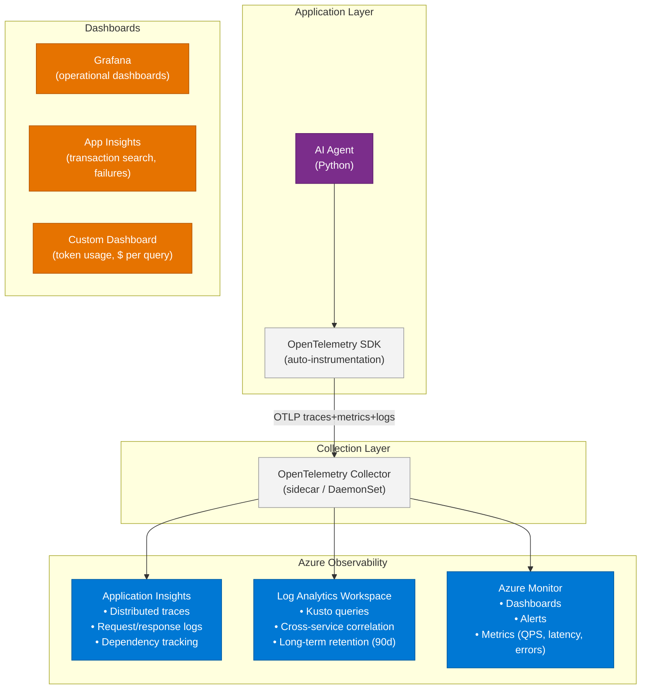
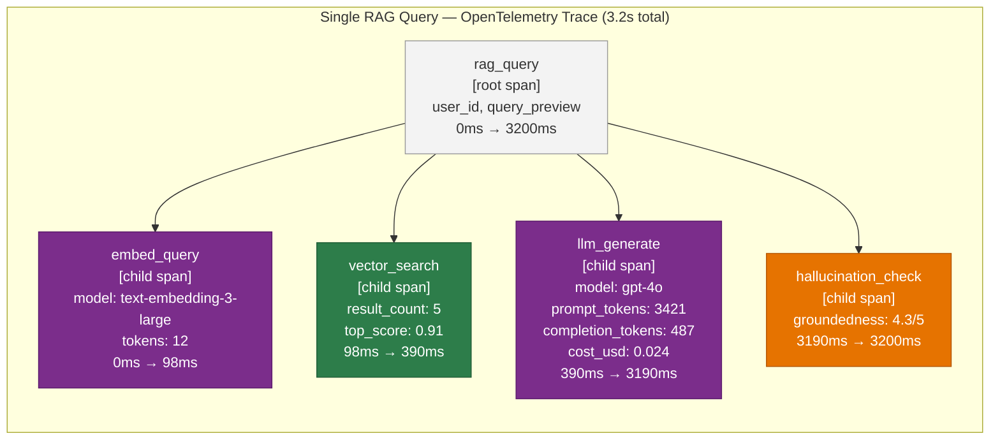
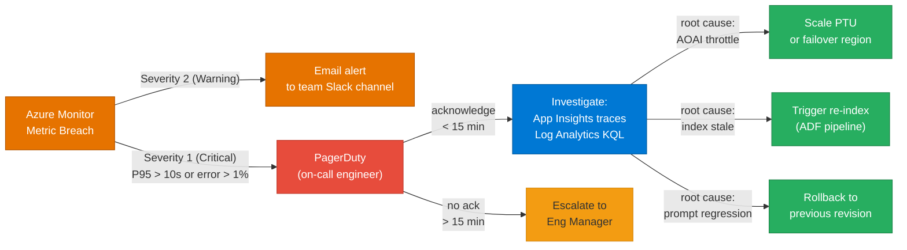

# 32 — Observability for AI Systems

> **Level:** Advanced | **Time to complete:** 4 hours | **Azure services:** Azure Monitor, Application Insights, Azure Log Analytics, OpenTelemetry

---

## 1. Overview

Observability for AI agents is more complex than traditional services because there are multiple layers to trace: HTTP requests, agent steps, LLM calls, tool executions, and RAG retrievals — each with their own latency, cost, and quality dimensions. This module covers the full observability stack for enterprise AI systems.

---

## 2. AI Observability Stack



---

## 2.1 Distributed Trace for a RAG Query



---

## 3. OpenTelemetry for AI Agents

### 3.1 Tracing Setup

```python
# telemetry.py — OpenTelemetry setup for AI agents
import os
from opentelemetry import trace
from opentelemetry.sdk.trace import TracerProvider
from opentelemetry.sdk.trace.export import BatchSpanProcessor
from opentelemetry.exporter.otlp.proto.grpc.trace_exporter import OTLPSpanExporter
from opentelemetry.instrumentation.httpx import HTTPXClientInstrumentor
from azure.monitor.opentelemetry import configure_azure_monitor


def setup_telemetry(service_name: str, service_version: str) -> trace.Tracer:
    """
    Initialize OpenTelemetry with Azure Monitor as backend.
    Auto-instruments all HTTP calls (including Azure OpenAI SDK calls).
    """
    configure_azure_monitor(
        connection_string=os.environ["APPLICATIONINSIGHTS_CONNECTION_STRING"],
        service_name=service_name,
        service_version=service_version,
    )

    # Auto-instrument HTTPX (used by Azure OpenAI SDK)
    HTTPXClientInstrumentor().instrument()

    tracer = trace.get_tracer(service_name)
    return tracer


# Usage:
tracer = setup_telemetry("ai-agent", "2.1.0")
```

### 3.2 Span Instrumentation for Agent Steps

```python
# instrumented_agent.py
import time
import json
from opentelemetry import trace
from opentelemetry.trace import Status, StatusCode
from openai import AsyncAzureOpenAI

tracer = trace.get_tracer("ai-agent")
aoai = AsyncAzureOpenAI(...)


async def instrumented_rag_query(query: str, user_id: str) -> dict:
    """Full RAG query with OpenTelemetry instrumentation at each step."""

    with tracer.start_as_current_span("rag_query") as span:
        span.set_attributes({
            "user.id": user_id,
            "query.length": len(query),
            "query.preview": query[:100],
        })

        try:
            # Step 1: Embed query
            with tracer.start_as_current_span("embed_query") as embed_span:
                t0 = time.time()
                embed_response = await aoai.embeddings.create(
                    model="text-embedding-3-large",
                    input=[query],
                    dimensions=1536,
                )
                embed_span.set_attributes({
                    "embedding.model": "text-embedding-3-large",
                    "embedding.tokens": embed_response.usage.total_tokens,
                    "embedding.latency_ms": int((time.time() - t0) * 1000),
                })
                query_embedding = embed_response.data[0].embedding

            # Step 2: Search
            with tracer.start_as_current_span("vector_search") as search_span:
                t0 = time.time()
                results = await search_documents(query, query_embedding)
                search_span.set_attributes({
                    "search.result_count": len(results),
                    "search.latency_ms": int((time.time() - t0) * 1000),
                    "search.top_score": results[0]["score"] if results else 0,
                })

            # Step 3: Generate
            with tracer.start_as_current_span("llm_generate") as llm_span:
                t0 = time.time()
                context = "\n\n".join([r["content"] for r in results[:5]])
                response = await aoai.chat.completions.create(
                    model="gpt-4o",
                    messages=[
                        {"role": "system", "content": "Answer the question using the context."},
                        {"role": "user", "content": f"Context:\n{context}\n\nQuestion: {query}"},
                    ],
                    temperature=0.1,
                )
                answer = response.choices[0].message.content

                llm_span.set_attributes({
                    "llm.model": "gpt-4o",
                    "llm.prompt_tokens": response.usage.prompt_tokens,
                    "llm.completion_tokens": response.usage.completion_tokens,
                    "llm.total_tokens": response.usage.total_tokens,
                    "llm.latency_ms": int((time.time() - t0) * 1000),
                    "llm.finish_reason": response.choices[0].finish_reason,
                    # Cost tracking (GPT-4o: $5/M input, $15/M output as of 2024)
                    "llm.cost_usd": (
                        response.usage.prompt_tokens * 5e-6 +
                        response.usage.completion_tokens * 15e-6
                    ),
                })

            span.set_attributes({
                "rag.total_tokens": (
                    embed_response.usage.total_tokens +
                    response.usage.total_tokens
                ),
                "rag.answer_length": len(answer),
            })
            span.set_status(Status(StatusCode.OK))

            return {"answer": answer, "sources": [r["source"] for r in results[:5]]}

        except Exception as e:
            span.set_status(Status(StatusCode.ERROR, str(e)))
            span.record_exception(e)
            raise
```

---

## 4. AI-Specific Metrics

```python
# metrics.py — custom metrics for AI systems
from opentelemetry import metrics
from opentelemetry.sdk.metrics import MeterProvider
from opentelemetry.exporter.otlp.proto.grpc.metric_exporter import OTLPMetricExporter

meter = metrics.get_meter("ai-agent")

# Counters
query_counter = meter.create_counter(
    "ai.queries.total",
    unit="queries",
    description="Total AI queries processed",
)

# Histograms (for latency and cost distribution)
query_latency = meter.create_histogram(
    "ai.query.latency_ms",
    unit="ms",
    description="End-to-end query latency",
)

token_usage = meter.create_histogram(
    "ai.llm.tokens",
    unit="tokens",
    description="LLM token usage per request",
)

query_cost = meter.create_histogram(
    "ai.query.cost_usd",
    unit="USD",
    description="Cost per query in USD",
)

# Gauges (for current state)
cache_hit_rate = meter.create_gauge(
    "ai.cache.hit_rate",
    unit="ratio",
    description="Semantic cache hit rate (0-1)",
)

# Usage:
def record_query_metrics(
    model: str,
    prompt_tokens: int,
    completion_tokens: int,
    latency_ms: int,
    cache_hit: bool,
    success: bool,
):
    attributes = {
        "model": model,
        "cache_hit": str(cache_hit),
        "success": str(success),
    }
    query_counter.add(1, attributes)
    query_latency.record(latency_ms, attributes)
    token_usage.record(prompt_tokens + completion_tokens, attributes)
    cost = (prompt_tokens * 5e-6) + (completion_tokens * 15e-6)
    query_cost.record(cost, attributes)
```

---

## 5. Azure Monitor Dashboards

### 5.1 Key Kusto Queries

```kusto
// KQL: AI agent latency percentiles (last 24h)
AppRequests
| where TimeGenerated > ago(24h)
| where Name startswith "rag_query"
| extend latency_ms = DurationMs
| summarize
    p50 = percentile(latency_ms, 50),
    p95 = percentile(latency_ms, 95),
    p99 = percentile(latency_ms, 99),
    avg = avg(latency_ms)
  by bin(TimeGenerated, 1h)
| render timechart

// KQL: Token usage and cost by hour
AppDependencies
| where TimeGenerated > ago(7d)
| where Name == "llm_generate"
| extend
    prompt_tokens = toint(Properties.["llm.prompt_tokens"]),
    completion_tokens = toint(Properties.["llm.completion_tokens"]),
    cost = todouble(Properties.["llm.cost_usd"])
| summarize
    total_tokens = sum(prompt_tokens + completion_tokens),
    total_cost_usd = sum(cost),
    query_count = count()
  by bin(TimeGenerated, 1h)
| render columnchart

// KQL: Quality degradation alert
AppDependencies
| where TimeGenerated > ago(1h)
| where Name == "hallucination_check"
| extend groundedness = todouble(Properties.["groundedness_score"])
| summarize avg_groundedness = avg(groundedness)
| extend alert = avg_groundedness < 3.5
| where alert == true
```

---

## 5.1 Alert Escalation Flow



---

## 6. Alerting Rules

```bicep
// alerts.bicep — Azure Monitor alert rules for AI agents
resource highLatencyAlert 'Microsoft.Insights/metricAlerts@2018-03-01' = {
  name: 'ai-agent-high-latency'
  location: 'global'
  properties: {
    description: 'Alert when P95 latency exceeds 10 seconds'
    severity: 2  // Warning
    enabled: true
    evaluationFrequency: 'PT1M'
    windowSize: 'PT5M'
    criteria: {
      'odata.type': 'Microsoft.Azure.Monitor.SingleResourceMultipleMetricCriteria'
      allOf: [
        {
          name: 'HighLatency'
          criterionType: 'StaticThresholdCriterion'
          metricName: 'ai.query.latency_ms'
          operator: 'GreaterThan'
          threshold: 10000
          aggregation: 'Percentile95'
        }
      ]
    }
    actions: [{ actionGroupId: oncallActionGroup.id }]
  }
}
```

---

## 7. Production Checklist

- [ ] OpenTelemetry auto-instrumentation enabled (HTTP calls traced automatically)
- [ ] Custom spans for each agent step: embed, search, LLM generate, tool call
- [ ] Token usage and cost recorded on every LLM call
- [ ] Azure Monitor dashboards created: latency, token usage, error rate, cost/day
- [ ] Alerts configured: P95 latency > 10s, error rate > 1%, cost/day > $X
- [ ] Log retention set to 90 days in Log Analytics
- [ ] Correlation ID propagated through all service calls (trace all hops in a request)

---

## 8. Interview Q&A

### Q1 (Advanced): What are the key observability metrics specific to AI agent systems that don't exist in traditional services?

**Answer:** In addition to standard metrics (latency, throughput, error rate), AI systems require: (1) **Token usage** — prompt tokens, completion tokens, and total per request, per model, per service. Tokens are your primary cost driver and a proxy for input/output complexity; (2) **Cost per query** — total $ per successful query (LLM tokens + embedding tokens + infra). Track this over time to catch cost regressions from prompt changes or routing changes; (3) **Groundedness/hallucination rate** — percentage of responses that are factually grounded in retrieved context. Detectable via LLM-as-judge scoring. This can degrade without any infrastructure failure (e.g., when document index gets stale); (4) **Cache hit rate** — semantic cache hit rate tells you whether your caching strategy is effective and whether query diversity is increasing; (5) **Retrieval quality** — number of results retrieved, top search score, fraction of retrieved chunks actually used in the final answer; (6) **Model-level metrics** — which model version is serving traffic, model availability %, throttle rate (429s from AOAI); (7) **Agent step breakdown** — for multi-step agents, trace each step's latency independently to find bottlenecks (is search slow, or is LLM slow?).

---

## Cross-links

- Previous: [31 — DevOps](./31-DevOps.md)
- Next: [33 — Security](./33-Security.md)
- Related: [25 — System Design](./25-System-Design.md) | [04 — Azure OpenAI](./04-Azure-OpenAI.md)

---

*Module 32 | Series: Enterprise Agentic AI Tutorial | Last updated: June 2026*
