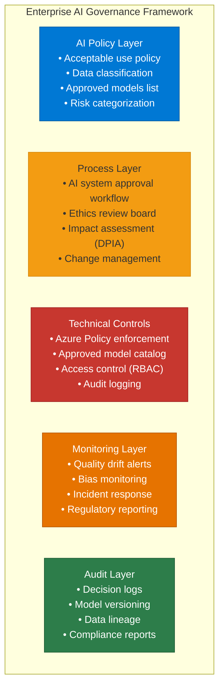
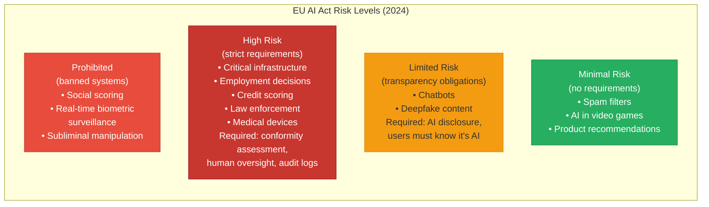
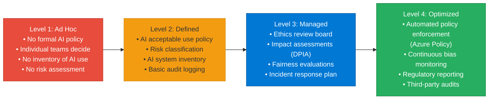

# 35 — AI Governance

> **Level:** Advanced | **Time to complete:** 3 hours | **Azure services:** Azure Policy, Azure AI Foundry, Microsoft Purview, Azure Monitor

---

## 1. Overview

AI Governance is the organizational framework of policies, processes, and controls that ensure AI systems are developed and operated responsibly, comply with regulations, and align with enterprise risk tolerance. As AI systems take on more business-critical functions, governance becomes as important as technical architecture.

---

## 2. AI Governance Framework



---

## 3. AI Risk Classification



### 3.1 Enterprise AI Risk Registry

```python
# risk_registry.py — classify and track AI system risks
from enum import Enum
from dataclasses import dataclass, field
from datetime import datetime


class RiskCategory(Enum):
    PROHIBITED = "prohibited"
    HIGH = "high"
    LIMITED = "limited"
    MINIMAL = "minimal"


class Domain(Enum):
    HR = "hr"
    FINANCE = "finance"
    HEALTHCARE = "healthcare"
    LEGAL = "legal"
    CUSTOMER_SERVICE = "customer_service"
    OPERATIONS = "operations"
    INTERNAL_TOOLS = "internal_tools"


@dataclass
class AISystem:
    name: str
    description: str
    domain: Domain
    use_cases: list[str]
    data_processed: list[str]  # Types of data
    decision_impact: str  # "advisory" | "automated" | "hybrid"
    affected_populations: list[str]
    owner: str  # Team or person responsible
    risk_level: RiskCategory = RiskCategory.MINIMAL
    approved: bool = False
    approval_date: str = ""
    review_date: str = ""  # Next review date
    controls: list[str] = field(default_factory=list)

    def assess_risk(self) -> RiskCategory:
        """Simplified risk assessment — real assessment needs human review."""
        HIGH_RISK_DOMAINS = {Domain.HR, Domain.FINANCE, Domain.HEALTHCARE, Domain.LEGAL}
        HIGH_RISK_DATA = {"PII", "financial data", "health data", "biometric"}

        if self.domain in HIGH_RISK_DOMAINS:
            return RiskCategory.HIGH

        if any(d in HIGH_RISK_DATA for d in self.data_processed):
            if self.decision_impact == "automated":
                return RiskCategory.HIGH
            elif self.decision_impact == "hybrid":
                return RiskCategory.LIMITED

        return RiskCategory.MINIMAL


# Example registry entries:
AI_SYSTEMS = [
    AISystem(
        name="HR Policy Copilot",
        description="Answers employee questions about HR policies",
        domain=Domain.HR,
        use_cases=["Policy Q&A", "Benefits explanation"],
        data_processed=["HR policies (non-personal)", "Employee questions"],
        decision_impact="advisory",
        affected_populations=["All employees"],
        owner="HR Technology Team",
        risk_level=RiskCategory.LIMITED,  # Advisory only, no decisions
        controls=["Content safety", "Human escalation path", "AI disclosure"],
    ),
    AISystem(
        name="Automated Loan Screener",
        description="Pre-screens loan applications and makes approve/reject recommendations",
        domain=Domain.FINANCE,
        use_cases=["Loan pre-screening", "Risk assessment"],
        data_processed=["PII", "financial data", "credit data"],
        decision_impact="automated",
        affected_populations=["Loan applicants"],
        owner="Credit Technology Team",
        risk_level=RiskCategory.HIGH,  # Affects financial access
        controls=["Fairness evaluation", "Human final decision", "Explainability", "Audit log", "Appeals process"],
    ),
]
```

---

## 4. Azure Policy for AI Governance

```json
// azure_policy_approved_models.json
// Deny deployment of non-approved Azure OpenAI model versions
{
    "if": {
        "allOf": [
            {
                "field": "type",
                "equals": "Microsoft.CognitiveServices/accounts/deployments"
            },
            {
                "not": {
                    "field": "Microsoft.CognitiveServices/accounts/deployments/model.name",
                    "in": [
                        "gpt-4o",
                        "gpt-4o-mini",
                        "text-embedding-3-large",
                        "text-embedding-3-small"
                    ]
                }
            }
        ]
    },
    "then": {
        "effect": "deny"
    }
}
```

```bicep
// policy_assignment.bicep — enforce AI governance at subscription level
resource policyAssignment 'Microsoft.Authorization/policyAssignments@2023-04-01' = {
  name: 'approved-ai-models-only'
  scope: subscription()
  properties: {
    policyDefinitionId: approvedModelsPolicy.id
    description: 'Only approved Azure OpenAI model versions can be deployed'
    enforcementMode: 'Default'
    parameters: {
      effect: { value: 'Deny' }
    }
  }
}
```

---

## 5. Audit Logging for Compliance

```python
# audit_logger.py — immutable audit log for AI decisions
import asyncio
import json
import hashlib
from datetime import datetime
from azure.cosmos.aio import CosmosClient
from azure.identity.aio import DefaultAzureCredential

credential = DefaultAzureCredential()


class AIAuditLogger:
    """
    Immutable audit log for AI decisions.
    Required for: EU AI Act, GDPR Article 22, SOC 2, ISO 42001
    """

    def __init__(self, cosmos_endpoint: str, database: str = "ai-audit"):
        self.cosmos_endpoint = cosmos_endpoint
        self.database = database
        self.container = "audit-log"

    async def log_ai_decision(
        self,
        system_name: str,
        user_id: str,
        request: dict,
        response: dict,
        model_version: str,
        prompt_version: str,
        decision_type: str,
        human_reviewed: bool = False,
    ) -> str:
        """Log an AI decision to the immutable audit trail."""
        # Create tamper-evident hash
        log_entry = {
            "system_name": system_name,
            "timestamp": datetime.utcnow().isoformat(),
            "user_id": user_id,
            "request_hash": hashlib.sha256(json.dumps(request, sort_keys=True).encode()).hexdigest(),
            "response_hash": hashlib.sha256(json.dumps(response, sort_keys=True).encode()).hexdigest(),
            "model_version": model_version,
            "prompt_version": prompt_version,
            "decision_type": decision_type,
            "human_reviewed": human_reviewed,
            "input_tokens": response.get("usage", {}).get("prompt_tokens"),
            "output_tokens": response.get("usage", {}).get("completion_tokens"),
        }

        # Compute chain hash (links to previous entry for tamper detection)
        # Simplified — production uses blockchain or Azure Ledger
        entry_hash = hashlib.sha256(json.dumps(log_entry, sort_keys=True).encode()).hexdigest()
        log_entry["entry_hash"] = entry_hash
        log_entry["id"] = entry_hash  # Cosmos DB item ID
        log_entry["user_id_pk"] = user_id  # Partition key

        async with CosmosClient(self.cosmos_endpoint, credential) as client:
            db = client.get_database_client(self.database)
            ctr = db.get_container_client(self.container)
            await ctr.create_item(log_entry)  # create (not upsert) — prevents overwriting

        return entry_hash

    async def get_user_decision_history(
        self,
        user_id: str,
        system_name: str | None = None,
        limit: int = 100,
    ) -> list[dict]:
        """Retrieve audit history for GDPR data subject access requests."""
        async with CosmosClient(self.cosmos_endpoint, credential) as client:
            db = client.get_database_client(self.database)
            ctr = db.get_container_client(self.container)

            query = "SELECT TOP @limit * FROM c WHERE c.user_id = @user_id ORDER BY c.timestamp DESC"
            params = [
                {"name": "@limit", "value": limit},
                {"name": "@user_id", "value": user_id},
            ]
            if system_name:
                query = query.replace("ORDER BY", "AND c.system_name = @system ORDER BY")
                params.append({"name": "@system", "value": system_name})

            results = ctr.query_items(query=query, parameters=params, partition_key=user_id)
            return [item async for item in results]
```

---

## 6. AI Governance Maturity Model



---

## 7. Production Checklist

- [ ] AI system inventory: every AI system documented in risk registry
- [ ] Risk assessment completed before any AI system goes live
- [ ] High-risk systems: human-in-the-loop, explainability, appeals process
- [ ] AI disclosure: users informed when interacting with AI
- [ ] Audit log: all AI decisions logged to immutable store
- [ ] GDPR compliance: users can request AI decision history and deletion
- [ ] Azure Policy: approved model list enforced at subscription level
- [ ] Ethics review: changes to high-risk AI systems reviewed before deployment

---

## 8. Interview Q&A

### Q1 (Advanced): What is the EU AI Act and how does it affect enterprise Azure AI deployments?

**Answer:** The EU AI Act (effective 2024) is the world's first comprehensive AI regulation. It applies to AI systems used in the EU, regardless of where the provider is located. Key implications for enterprise Azure AI: (1) **Risk classification**: enterprises must classify their AI systems by risk level (Prohibited, High, Limited, Minimal). Employment, credit scoring, and law enforcement AI are High Risk; (2) **High-risk requirements**: if your AI system is High Risk, you must: conduct a Conformity Assessment, maintain a technical file (documentation), register with the EU AI Act database, implement a risk management system, ensure human oversight, maintain logs for at least 6 months; (3) **Transparency**: any chatbot, customer-facing AI, or AI-generated content must be disclosed as such. EU users must know when they're talking to AI; (4) **General Purpose AI (GPAI)**: models like GPT-4o used in high-risk applications inherit high-risk requirements. Azure/OpenAI provide documentation under the "provider" obligations; enterprises as "deployers" have their own obligations; (5) **Timeline**: Full compliance required by August 2026 for High-Risk AI. Penalties up to €35M or 7% of global revenue. Practical steps: build an AI system inventory, classify each by EU AI Act risk level, implement governance controls for High-Risk systems, and ensure AI disclosure for all customer-facing AI.

---

## Cross-links

- Previous: [34 — Responsible AI](./34-Responsible-AI.md)
- Next: [36 — Performance Tuning](./36-Performance-Tuning.md)
- Related: [33 — Security](./33-Security.md) | [34 — Responsible AI](./34-Responsible-AI.md)

---

*Module 35 | Series: Enterprise Agentic AI Tutorial | Last updated: June 2026*
