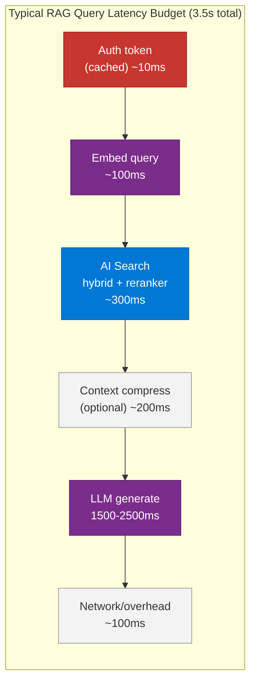
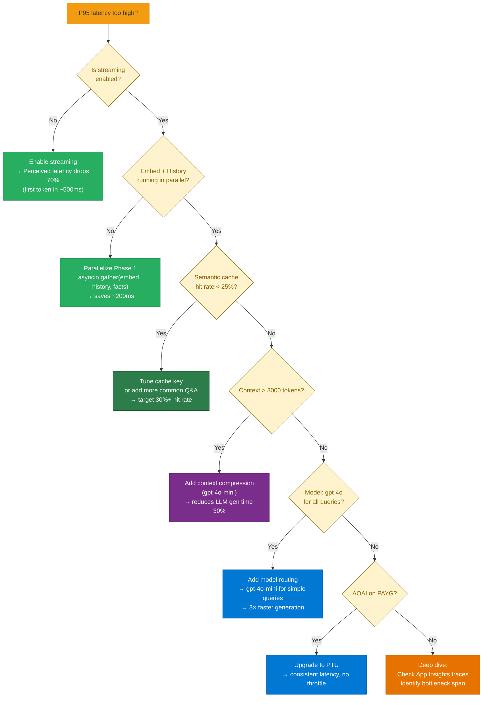
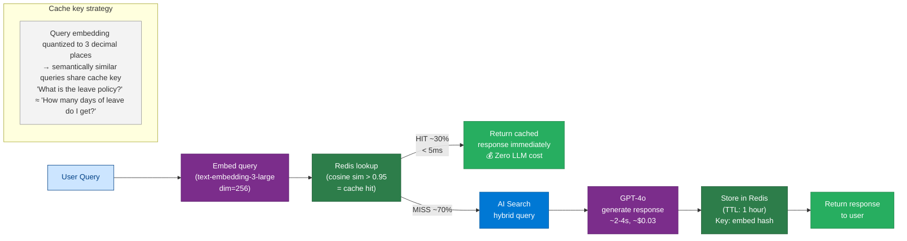

# 36 — Performance Tuning

> **Level:** Advanced | **Time to complete:** 3.5 hours | **Azure services:** Azure OpenAI, Azure Cache for Redis, Azure AI Search

---

## 1. Overview

Performance tuning for AI systems means reducing end-to-end latency, increasing throughput, and improving quality-per-dollar. The AI query path has multiple stages — each with its own tuning levers. This module covers async execution, streaming, caching, prompt compression, and model routing.

---

## 2. Latency Budget Analysis



**Where to invest tuning effort:**
- LLM generation is 60–70% of latency — streaming hides it
- Search is 10–20% — semantic reranker adds 100ms
- Embedding is 3–5% — parallelizable with search
- Auth token caching is free — 10ms vs 200ms on cache miss

---

## 2.1 Optimization Decision Tree



---

## 3. Async and Parallel Execution

```python
# async_optimization.py
import asyncio
import time
from openai import AsyncAzureOpenAI

aoai = AsyncAzureOpenAI(...)


async def optimized_rag_query(query: str, user_id: str) -> dict:
    """
    Optimized RAG: parallelize embedding + search, then generate.
    Also runs auth token refresh and history retrieval in parallel.
    """
    start = time.time()

    # Phase 1: Run ALL independent operations in parallel
    embed_task = asyncio.create_task(
        aoai.embeddings.create(model="text-embedding-3-large", input=[query], dimensions=1536)
    )
    history_task = asyncio.create_task(get_conversation_history(user_id))  # Redis lookup
    facts_task = asyncio.create_task(get_user_facts(user_id))  # Redis lookup

    # Wait for embedding before we can search (embed result needed for search)
    embed_response, history, facts = await asyncio.gather(embed_task, history_task, facts_task)
    query_embedding = embed_response.data[0].embedding

    print(f"Phase 1 (embed+history): {(time.time()-start)*1000:.0f}ms")

    # Phase 2: Hybrid search with embedding
    search_start = time.time()
    search_results = await search_with_vector(query, query_embedding, user_id)
    print(f"Phase 2 (search): {(time.time()-search_start)*1000:.0f}ms")

    # Phase 3: Generate with full context
    context = "\n\n".join([r["content"] for r in search_results[:5]])
    facts_context = "\n".join(facts) if facts else ""

    gen_start = time.time()
    response = await aoai.chat.completions.create(
        model="gpt-4o",
        messages=[
            {"role": "system", "content": f"You are a helpful assistant.\nUser facts: {facts_context}"},
            *history[-6:],
            {"role": "user", "content": f"Context:\n{context}\n\nQuestion: {query}"},
        ],
        temperature=0.1,
    )
    print(f"Phase 3 (generate): {(time.time()-gen_start)*1000:.0f}ms")
    print(f"Total: {(time.time()-start)*1000:.0f}ms")

    return {
        "answer": response.choices[0].message.content,
        "sources": [r["source"] for r in search_results[:5]],
        "tokens_used": response.usage.total_tokens,
    }
```

---

## 4. Streaming for Perceived Performance

```python
# streaming.py — stream tokens as they're generated
import asyncio
from fastapi import FastAPI
from fastapi.responses import StreamingResponse
from openai import AsyncAzureOpenAI

app = FastAPI()
aoai = AsyncAzureOpenAI(...)


async def stream_rag_response(query: str, context: str):
    """
    Stream tokens as they're generated — users see first token in ~500ms
    instead of waiting 2-3 seconds for complete response.
    """
    async with aoai.chat.completions.stream(
        model="gpt-4o",
        messages=[
            {"role": "system", "content": "Answer using the provided context."},
            {"role": "user", "content": f"Context:\n{context}\n\nQuestion: {query}"},
        ],
        temperature=0.1,
    ) as stream:
        async for text in stream.text_stream:
            # Server-Sent Events format
            yield f"data: {text}\n\n"

        # Final token usage
        final = await stream.get_final_message()
        usage = {"prompt_tokens": final.usage.prompt_tokens, "completion_tokens": final.usage.completion_tokens}
        import json
        yield f"data: {json.dumps({'usage': usage, 'done': True})}\n\n"


@app.post("/stream-query")
async def stream_query_endpoint(request: dict):
    query = request.get("query", "")
    context = await get_context(query)

    return StreamingResponse(
        stream_rag_response(query, context),
        media_type="text/event-stream",
        headers={
            "Cache-Control": "no-cache",
            "X-Accel-Buffering": "no",  # Disable Nginx buffering
        },
    )
```

---

## 5. Prompt Compression

```python
# prompt_compression.py — reduce token usage for long-context queries
import asyncio
from openai import AsyncAzureOpenAI

aoai = AsyncAzureOpenAI(...)


async def compress_retrieved_context(
    query: str,
    context_chunks: list[str],
    target_token_budget: int = 2000,
) -> str:
    """
    Extract only the relevant sentences from retrieved chunks.
    Reduces prompt tokens by 30-60% without significant quality loss.
    """
    full_context = "\n---\n".join(context_chunks)

    # Use a small, fast model for compression
    response = await aoai.chat.completions.create(
        model="gpt-4o-mini",  # 25× cheaper than GPT-4o for this task
        messages=[
            {"role": "system", "content": f"""Extract ONLY the sentences directly relevant to this question.
Remove all unrelated content. Keep exact wording.
Target: under {target_token_budget} tokens.
Return only the extracted text, no commentary."""},
            {"role": "user", "content": f"Question: {query}\n\nContext to compress:\n{full_context}"},
        ],
        temperature=0,
        max_tokens=target_token_budget + 100,
    )
    return response.choices[0].message.content


async def compress_conversation_history(
    conversation: list[dict],
    max_tokens: int = 3000,
) -> list[dict]:
    """
    Summarize old conversation turns when history is too long.
    """
    import tiktoken
    enc = tiktoken.encoding_for_model("gpt-4o")

    def count(messages: list[dict]) -> int:
        return sum(len(enc.encode(m.get("content", ""))) for m in messages)

    if count(conversation) <= max_tokens:
        return conversation

    # Keep last 4 turns verbatim, summarize the rest
    recent = conversation[-4:]
    older = conversation[:-4]

    summary_response = await aoai.chat.completions.create(
        model="gpt-4o-mini",
        messages=[
            {"role": "user", "content": f"Summarize this conversation history in 3-5 sentences:\n{str(older)}"},
        ],
        max_tokens=300,
        temperature=0,
    )
    summary = summary_response.choices[0].message.content

    return [
        {"role": "system", "content": f"[Conversation summary]: {summary}"},
        *recent,
    ]
```

---

## 6. Model Routing for Cost/Quality Optimization

```python
# model_router.py — route queries to the most cost-effective model
import asyncio
import re
from openai import AsyncAzureOpenAI

aoai = AsyncAzureOpenAI(...)


MODELS = {
    "fast_cheap": "gpt-4o-mini",     # $0.15/M input, $0.6/M output
    "balanced": "gpt-4o",             # $5/M input, $15/M output
    "reasoning": "o1-mini",           # $11/M input, $44/M output
}

# Cost multipliers (relative to gpt-4o-mini = 1.0)
MODEL_COST = {
    "gpt-4o-mini": 1.0,
    "gpt-4o": 33.0,
    "o1-mini": 73.0,
}


async def classify_query_complexity(query: str) -> str:
    """Classify query as simple/moderate/complex to route to right model."""
    # Rule-based fast path (no LLM call)
    simple_patterns = [
        r"^what is ",
        r"^define ",
        r"^what does .* mean",
        r"^when was ",
        r"^who is ",
    ]
    complex_patterns = [
        r"compare .* and .*",
        r"analyze",
        r"design .* system",
        r"calculate",
        r"(pros and cons|advantages and disadvantages)",
        r"step.by.step",
    ]

    lower_q = query.lower()
    if any(re.search(p, lower_q) for p in simple_patterns) and len(query) < 100:
        return "simple"
    if any(re.search(p, lower_q) for p in complex_patterns) or len(query) > 500:
        return "complex"
    return "moderate"


async def routed_query(query: str, context: str) -> dict:
    """Route to most cost-effective model based on query complexity."""
    complexity = await classify_query_complexity(query)

    model = {
        "simple": MODELS["fast_cheap"],
        "moderate": MODELS["fast_cheap"],  # GPT-4o-mini handles most Q&A well
        "complex": MODELS["balanced"],
    }.get(complexity, MODELS["balanced"])

    response = await aoai.chat.completions.create(
        model=model,
        messages=[
            {"role": "system", "content": "Answer using the provided context."},
            {"role": "user", "content": f"Context:\n{context}\n\nQuestion: {query}"},
        ],
        temperature=0.1,
    )

    cost_per_token_in = {"gpt-4o-mini": 0.15e-6, "gpt-4o": 5e-6, "o1-mini": 11e-6}
    cost_per_token_out = {"gpt-4o-mini": 0.6e-6, "gpt-4o": 15e-6, "o1-mini": 44e-6}
    estimated_cost = (
        response.usage.prompt_tokens * cost_per_token_in.get(model, 5e-6) +
        response.usage.completion_tokens * cost_per_token_out.get(model, 15e-6)
    )

    return {
        "answer": response.choices[0].message.content,
        "model_used": model,
        "complexity": complexity,
        "tokens": response.usage.total_tokens,
        "estimated_cost_usd": estimated_cost,
    }
```

---

## 6.1 Cache Hit / Miss Flow



---

## 7. Caching Strategy

```python
# caching_strategy.py
import hashlib
import json
from redis.asyncio import Redis

redis = Redis.from_url(os.environ["REDIS_URL"])

# Cache TTLs (seconds)
EMBEDDING_TTL = 86400 * 7   # 7 days — embeddings don't change
SEARCH_TTL = 3600            # 1 hour — search results change with index updates
LLM_RESPONSE_TTL = 1800      # 30 min — responses for common questions


async def cached_embed(text: str, model: str = "text-embedding-3-large") -> list[float]:
    """Cache embeddings — text+model → vector. No two lookups for same text."""
    cache_key = f"embed:{model}:{hashlib.sha256(text.encode()).hexdigest()}"
    cached = await redis.get(cache_key)
    if cached:
        return json.loads(cached)

    result = (await aoai.embeddings.create(model=model, input=[text], dimensions=1536)).data[0].embedding
    await redis.setex(cache_key, EMBEDDING_TTL, json.dumps(result))
    return result


async def cached_search(query: str, embedding: list[float], user_groups: list[str]) -> list[dict]:
    """Cache search results for common queries."""
    cache_key = f"search:{hashlib.sha256(f'{query}{user_groups}'.encode()).hexdigest()}"
    cached = await redis.get(cache_key)
    if cached:
        return json.loads(cached)

    results = await search_documents(query, embedding, user_groups)
    await redis.setex(cache_key, SEARCH_TTL, json.dumps(results))
    return results
```

---

## 8. Production Checklist

- [ ] Async/await used for all I/O — no blocking calls
- [ ] Embedding + history + facts retrieval parallelized in Phase 1
- [ ] Streaming enabled for all user-facing responses > 200 tokens
- [ ] Embedding cache: 7-day TTL (embedding for same text never changes)
- [ ] Model routing implemented: gpt-4o-mini for simple queries (33× cost saving)
- [ ] Prompt compression for RAG contexts > 2000 tokens
- [ ] P95 latency monitored and alerted when > 2× baseline

---

## 9. Interview Q&A

### Q1 (Advanced): How would you reduce LLM response latency in a RAG system from P95=8s to P95=3s?

**Answer:** A systematic optimization approach: (1) **Profile first** — instrument each stage (embed, search, generate, network) to identify the bottleneck. Usually LLM generation dominates. (2) **Enable streaming** — the user sees the first token in ~500ms instead of waiting 3-8s for the complete response. This doesn't reduce actual latency but dramatically improves perceived latency. (3) **Parallelize Phase 1** — embed the query while simultaneously fetching conversation history and user preferences from Redis. This saves ~150ms. (4) **Reduce context size** — if your RAG retrieves 8K tokens of context, compress to 2K using GPT-4o-mini (adds 100ms, saves 600ms in generation). (5) **Model routing** — route simple queries (definitions, factual lookups) to GPT-4o-mini. It generates ~3× faster and is 33× cheaper; quality is similar for simple queries. (6) **Semantic cache** — 30%+ of enterprise queries are repeats; serve from Redis in <10ms instead of a full LLM call. (7) **Search optimization** — reduce `k` in vector search from 50 to 20; use `exhaustive=False` (HNSW ANN) instead of exact search. (8) **PTU deployment** — if on PAYG, throttling adds unpredictable latency spikes; PTU guarantees consistent throughput and latency.

---

## Cross-links

- Previous: [35 — AI Governance](./35-AI-Governance.md)
- Next: [37 — Cost Optimization](./37-Cost-Optimization.md)
- Related: [25 — System Design](./25-System-Design.md) | [32 — Observability](./32-Observability.md)

---

*Module 36 | Series: Enterprise Agentic AI Tutorial | Last updated: June 2026*
