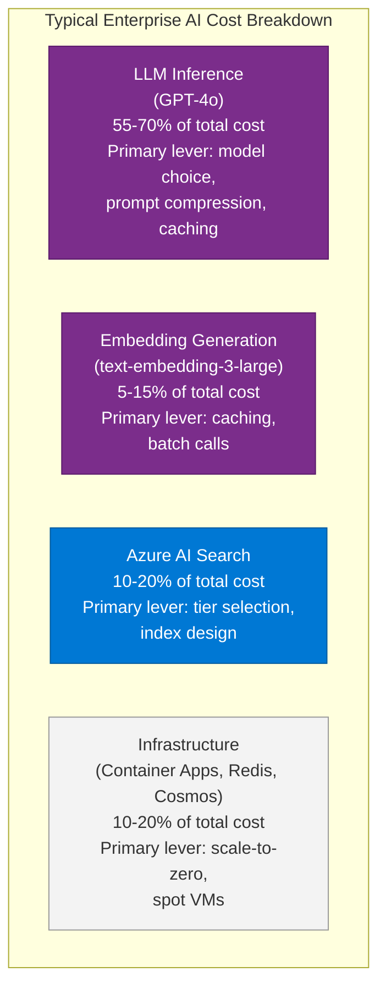
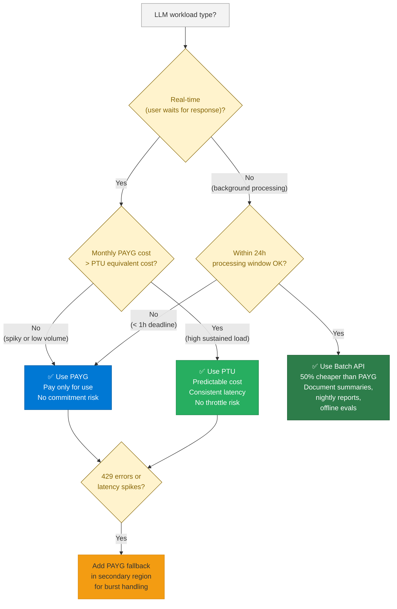
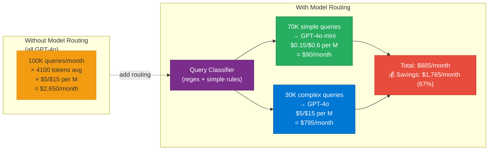

# 37 — Cost Optimization

> **Level:** Advanced | **Time to complete:** 3 hours | **Azure services:** Azure OpenAI (PTU, Batch API), Azure AI Search, Azure Container Apps

---

## 1. Overview

AI system costs are driven primarily by LLM token usage, embedding generation, and inference infrastructure. This module covers a systematic approach to cost optimization — from model selection and PTU sizing to prompt compression and the Azure Batch API.

---

## 2. Cost Structure of Enterprise AI



---

## 3. PTU vs. PAYG vs. Batch API

| Mode | Cost | Latency | Best for |
|---|---|---|---|
| **PAYG** | ~$5/M input, $15/M output (GPT-4o) | Variable (1-5s) | Spiky, unpredictable load |
| **PTU (Provisioned)** | ~$4.50/PTU/hr, ~$5K/mo for 25 PTU | Consistent (<2s) | Predictable, sustained load |
| **Batch API** | 50% discount vs PAYG | 24h window | Non-real-time bulk processing |
| **Global Deployment** | ~10-20% cheaper than regional | Global routing | Cost-sensitive real-time |

### 3.0 PTU vs PAYG vs Batch — Decision Flow



### 3.1 PTU Optimization

```python
# ptu_optimizer.py — maximize PTU utilization
import asyncio
import time
from openai import AsyncAzureOpenAI
from collections import deque

aoai = AsyncAzureOpenAI(
    azure_endpoint=os.environ["AZURE_OPENAI_ENDPOINT_PTU"],  # PTU endpoint
    api_key=os.environ["AZURE_OPENAI_API_KEY"],
    api_version="2024-10-21",
)


class PTUSaturator:
    """
    Smooths request rate to maintain high PTU utilization.
    PTU is reserved capacity — unused capacity is wasted.
    Target: 80-90% utilization.
    """

    def __init__(self, target_tpm: int, model: str = "gpt-4o"):
        self.target_tpm = target_tpm
        self.model = model
        self._request_times: deque = deque(maxlen=1000)
        self._token_counts: deque = deque(maxlen=1000)

    def get_current_tpm(self) -> float:
        """Estimate current TPM based on recent requests."""
        now = time.time()
        minute_ago = now - 60
        recent = [
            tokens for req_time, tokens in zip(self._request_times, self._token_counts)
            if req_time > minute_ago
        ]
        return sum(recent)

    async def query(self, messages: list[dict]) -> dict:
        """Make a PTU query with utilization tracking."""
        start = time.time()
        response = await aoai.chat.completions.create(
            model=self.model,
            messages=messages,
        )
        self._request_times.append(time.time())
        self._token_counts.append(response.usage.total_tokens)

        utilization = self.get_current_tpm() / self.target_tpm
        if utilization < 0.7:
            # PTU underutilized — log for capacity planning
            print(f"PTU underutilization: {utilization:.0%}")

        return {
            "response": response.choices[0].message.content,
            "tokens": response.usage.total_tokens,
            "ptu_utilization": utilization,
        }
```

### 3.2 Azure Batch API — 50% Cost Saving

```python
# batch_api.py — Azure OpenAI Batch API for non-real-time processing
import json
import time
from openai import AzureOpenAI

client = AzureOpenAI(
    azure_endpoint=os.environ["AZURE_OPENAI_ENDPOINT"],
    api_key=os.environ["AZURE_OPENAI_API_KEY"],
    api_version="2024-10-21",
)


def create_batch_from_documents(
    documents: list[dict],
    model: str = "gpt-4o",
) -> str:
    """
    Create a JSONL batch file for the Batch API.
    50% cheaper than PAYG, but takes up to 24 hours.
    """
    batch_requests = []
    for i, doc in enumerate(documents):
        batch_requests.append({
            "custom_id": f"doc-{doc['id']}",
            "method": "POST",
            "url": "/chat/completions",
            "body": {
                "model": model,
                "messages": [
                    {"role": "system", "content": "Summarize this document in 3 bullet points."},
                    {"role": "user", "content": doc["content"][:8000]},
                ],
                "temperature": 0,
                "max_tokens": 500,
            },
        })

    # Write to JSONL
    batch_file_path = f"/tmp/batch_{int(time.time())}.jsonl"
    with open(batch_file_path, "w") as f:
        for req in batch_requests:
            f.write(json.dumps(req) + "\n")

    return batch_file_path


def submit_and_monitor_batch(batch_file_path: str) -> list[dict]:
    """Submit batch and poll until complete."""
    # Upload batch file
    with open(batch_file_path, "rb") as f:
        batch_file = client.files.create(file=f, purpose="batch")

    # Create batch job
    batch_job = client.batches.create(
        input_file_id=batch_file.id,
        endpoint="/chat/completions",
        completion_window="24h",
    )

    print(f"Batch job created: {batch_job.id}")

    # Poll for completion (in production: use Event Grid or webhooks)
    while batch_job.status not in ("completed", "failed", "expired"):
        time.sleep(60)
        batch_job = client.batches.retrieve(batch_job.id)
        print(f"Status: {batch_job.status} | Progress: {batch_job.request_counts}")

    if batch_job.status != "completed":
        raise RuntimeError(f"Batch failed: {batch_job.status}")

    # Download results
    output = client.files.content(batch_job.output_file_id)
    results = [json.loads(line) for line in output.text.splitlines()]
    return results
```

---

## 4. Model Tiering Strategy

```python
# model_tiering.py — systematic model selection for cost optimization
from dataclasses import dataclass

@dataclass
class ModelProfile:
    name: str
    input_cost_per_1m: float  # USD
    output_cost_per_1m: float
    context_window: int
    strengths: list[str]
    weaknesses: list[str]


MODEL_PROFILES = {
    "gpt-4o-mini": ModelProfile(
        name="gpt-4o-mini",
        input_cost_per_1m=0.15,
        output_cost_per_1m=0.60,
        context_window=128_000,
        strengths=["Classification", "Simple Q&A", "Extraction", "Summarization", "Low cost"],
        weaknesses=["Complex reasoning", "Nuanced writing", "Multi-step math"],
    ),
    "gpt-4o": ModelProfile(
        name="gpt-4o",
        input_cost_per_1m=5.0,
        output_cost_per_1m=15.0,
        context_window=128_000,
        strengths=["Complex reasoning", "Nuanced analysis", "Code generation", "Tool calling"],
        weaknesses=["High cost", "Slower than mini"],
    ),
    "o1-mini": ModelProfile(
        name="o1-mini",
        input_cost_per_1m=11.0,
        output_cost_per_1m=44.0,
        context_window=128_000,
        strengths=["Multi-step math", "Complex code debugging", "Planning"],
        weaknesses=["Very expensive", "No tool calling", "Slow"],
    ),
    "text-embedding-3-small": ModelProfile(
        name="text-embedding-3-small",
        input_cost_per_1m=0.02,
        output_cost_per_1m=0.0,
        context_window=8_191,
        strengths=["Fast embedding", "Very low cost"],
        weaknesses=["Lower quality than large"],
    ),
    "text-embedding-3-large": ModelProfile(
        name="text-embedding-3-large",
        input_cost_per_1m=0.13,
        output_cost_per_1m=0.0,
        context_window=8_191,
        strengths=["High quality embeddings", "Best for production RAG"],
        weaknesses=["6.5× more expensive than small"],
    ),
}


# Cost comparison for a typical RAG workload:
def estimate_monthly_cost(
    monthly_queries: int,
    avg_input_tokens: int,
    avg_output_tokens: int,
    model: str,
) -> float:
    profile = MODEL_PROFILES.get(model)
    if not profile:
        raise ValueError(f"Unknown model: {model}")
    cost_per_query = (
        avg_input_tokens / 1_000_000 * profile.input_cost_per_1m +
        avg_output_tokens / 1_000_000 * profile.output_cost_per_1m
    )
    return cost_per_query * monthly_queries


# Example: 100K queries/month, 3500 input tokens, 600 output tokens
print("Monthly LLM cost comparison:")
for model in ["gpt-4o-mini", "gpt-4o"]:
    cost = estimate_monthly_cost(100_000, 3_500, 600, model)
    print(f"  {model}: ${cost:.0f}/month")
# Output:
# gpt-4o-mini: $90/month
# gpt-4o: $2650/month
# Routing 80% to mini saves ~$2K/month
```

---

## 4.1 Model Routing Cost Impact



---

## 5. Cost Monitoring and Alerting

```python
# cost_monitor.py — track and alert on AI cost anomalies
import asyncio
from datetime import datetime, timedelta
from azure.monitor.query.aio import MetricsQueryClient
from azure.identity.aio import DefaultAzureCredential

credential = DefaultAzureCredential()


async def get_daily_token_cost(
    aoai_resource_id: str,
    lookback_days: int = 30,
) -> list[dict]:
    """Get daily token usage and estimated cost from Azure Monitor."""
    async with MetricsQueryClient(credential) as client:
        result = await client.query_resource(
            resource_uri=aoai_resource_id,
            metric_names=["ProcessedPromptTokens", "GeneratedCompletionTokens"],
            timespan=timedelta(days=lookback_days),
            granularity=timedelta(days=1),
        )

    daily = []
    for metric in result.metrics:
        for ts in metric.timeseries:
            for point in ts.data:
                daily.append({
                    "date": point.timestamp.date().isoformat(),
                    "metric": metric.name,
                    "value": point.total or 0,
                })

    # Estimate cost (simplified)
    costs = {}
    for entry in daily:
        date = entry["date"]
        if date not in costs:
            costs[date] = {"date": date, "prompt_tokens": 0, "completion_tokens": 0}
        if "Prompt" in entry["metric"]:
            costs[date]["prompt_tokens"] += entry["value"]
        else:
            costs[date]["completion_tokens"] += entry["value"]

    for day in costs.values():
        day["estimated_cost_usd"] = (
            day["prompt_tokens"] / 1_000_000 * 5.0 +  # GPT-4o pricing
            day["completion_tokens"] / 1_000_000 * 15.0
        )

    return list(costs.values())
```

---

## 6. Production Checklist

- [ ] PTU sizing calculated: peak TPM × 1.3 headroom, reviewed monthly
- [ ] PAYG used for dev/staging; PTU for production sustained workloads
- [ ] Batch API used for all offline processing (document summaries, nightly reports)
- [ ] Model routing: gpt-4o-mini for classification/extraction, gpt-4o for complex reasoning
- [ ] Embedding caching: 7-day TTL, 80%+ cache hit rate for production workloads
- [ ] Dimension reduction: text-embedding-3-large with dimensions=1024 (lower cost storage)
- [ ] Cost alerts: Azure Monitor alert when daily spend > 2× baseline
- [ ] Monthly cost review: $ per query trending, cost by department

---

## 7. Interview Q&A

### Q1 (Advanced): How do you decide between PTU and PAYG for an enterprise AI deployment, and what is the break-even analysis?

**Answer:** PTU (Provisioned Throughput Units) makes financial sense when sustained usage exceeds the break-even point. Break-even analysis: PTU cost for 25 PTU ≈ 25 × $4.50/hr × 730 hr/month = $82,000/month. At GPT-4o PAYG pricing ($5/M input, $15/M output), $82K buys approximately 5.5B input tokens or 5.5M queries × 1,000 tokens. 25 PTU supports ~150K TPM, which is ~150K queries/hour × 24 × 30 = 108M queries/month. So for any workload generating < $82K/month of PAYG costs, PAYG is cheaper. Factors that shift the analysis toward PTU: (1) **Latency consistency** — PTU guarantees consistent P95 latency; PAYG throttles during peak hours, adding 429 retry overhead; (2) **Throughput ceiling** — if your workload needs more than your PAYG quota allows, PTU provides guaranteed capacity; (3) **Cost predictability** — CFO prefers fixed monthly cost over variable PAYG. Decision framework: start on PAYG; switch to PTU when (a) monthly PAYG bill exceeds PTU cost for the same capacity, OR (b) throttling is causing SLA breaches, OR (c) finance requires cost predictability.

---

## Cross-links

- Previous: [36 — Performance Tuning](./36-Performance-Tuning.md)
- Next: [38 — Reference Architecture](./38-Reference-Architecture.md)
- Related: [04 — Azure OpenAI](./04-Azure-OpenAI.md) | [25 — System Design](./25-System-Design.md)

---

*Module 37 | Series: Enterprise Agentic AI Tutorial | Last updated: June 2026*
