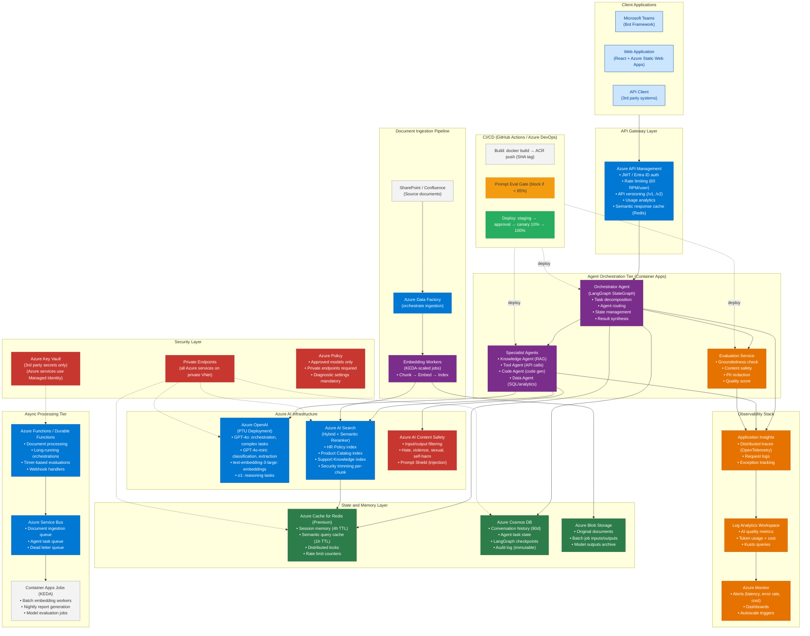
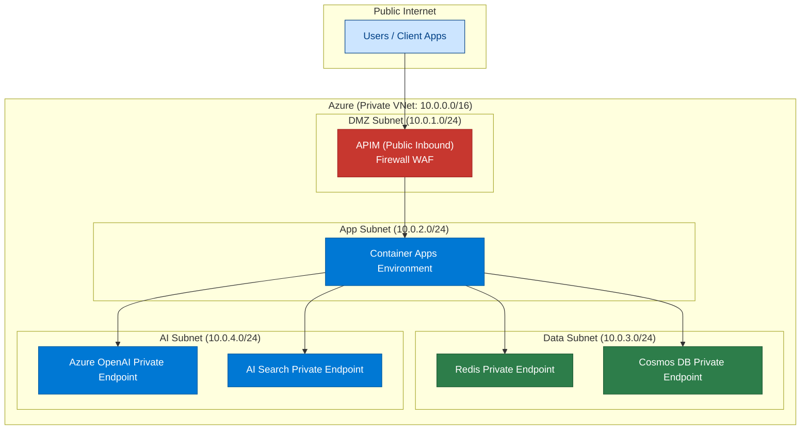
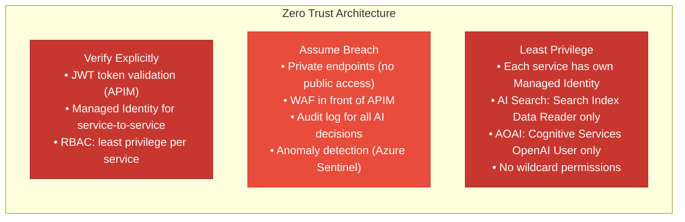

# 38 — Reference Architecture

> **Level:** Advanced | **Time to complete:** 3 hours | **Azure services:** Full enterprise Azure AI stack

---

## 1. Overview

This module presents the complete **Enterprise AI Platform Reference Architecture** — the canonical architecture for building production-grade, multi-agent AI systems on Azure. It synthesizes all prior modules into a single deployable reference.

---

## 2. Complete Enterprise AI Platform

---

## 3. Component Selection Matrix

| Tier | Component | Azure Service | Justification |
|---|---|---|---|
| API Gateway | Auth + rate limit | APIM | Enterprise-grade, 400+ connectors |
| LLM (primary) | GPT-4o | Azure OpenAI PTU | Best quality, consistent SLA |
| LLM (secondary) | GPT-4o-mini | Azure OpenAI PAYG | 33× cheaper for simple tasks |
| Embedding | text-embedding-3-large | Azure OpenAI | Best RAG quality |
| Vector search | Azure AI Search | AI Search Standard/Premium | Hybrid + semantic reranker + RBAC |
| Session state | Redis Premium | Azure Cache for Redis | <1ms access, auto-TTL |
| Durable state | Cosmos DB | Cosmos DB serverless / auto-scale | Multi-region, NoSQL, change feed |
| Async messaging | Service Bus Premium | Azure Service Bus | Guaranteed delivery, DLQ |
| Orchestration | Durable Functions | Azure Functions Premium | Long-running, external events |
| Workers | KEDA jobs | Container Apps Jobs | Scale-to-zero for batch |
| Container runtime | Container Apps | Azure Container Apps | Managed K8s, KEDA built-in |
| Observability | OpenTelemetry | App Insights + Log Analytics | Unified traces, metrics, logs |
| Content safety | Prompt Shield + filters | Azure AI Content Safety | Multi-layer defense |
| Secrets | Managed Identity | Azure Entra ID | Zero API keys in code |

---

## 4. Network Architecture

---

## 5. Deployment Topology

| Environment | Scale | Cost mode | Purpose |
|---|---|---|---|
| **Development** | 0-2 replicas | PAYG, no PTU | Local testing, feature branches |
| **Staging** | 2-5 replicas | PAYG | Integration testing, QA |
| **Production (Primary)** | 5-20 replicas | PTU | Live production traffic |
| **Production (DR)** | 2-5 replicas (warm standby) | PTU (West Europe) | Failover within 2 minutes |

---

## 6. SLA Targets

| Metric | Target | Alert threshold |
|---|---|---|
| Availability | 99.9% (8.7h downtime/year) | < 99.5% in any hour |
| P50 latency | < 1.5s (with cache) | > 3s |
| P95 latency | < 4s | > 8s |
| P99 latency | < 10s | > 20s |
| Groundedness score | ≥ 4.0/5 | < 3.5 |
| Error rate | < 0.5% | > 1% |
| Cache hit rate | ≥ 30% | < 15% |
| Cost per query | < $0.05 | > $0.15 |

---

## 7. Security Posture

---

## 8. Production Checklist

- [ ] All Azure services connected via Private Endpoints — zero public access
- [ ] Managed Identity used for all service-to-service auth — no API keys
- [ ] PTU deployment in primary region; PAYG failover in secondary region
- [ ] APIM rate limits enforced: 60 RPM/user, WAF enabled
- [ ] Disaster recovery tested: failover to West Europe in < 2 minutes
- [ ] LangGraph checkpoints in Cosmos DB: conversations survive replica restarts
- [ ] All deployments via CI/CD with prompt evaluation gate and canary rollout
- [ ] Weekly automated evaluation run; alert if quality drops > 10%

---

## 9. Interview Q&A

### Q1 (System Design): Design an enterprise AI platform that can handle 1 million conversations per day across multiple departments.

**Answer:** At 1M conversations/day = ~12 conversations/second average, with peaks at 3-5×: (1) **API tier**: APIM handles auth and rate limiting; Container Apps (auto-scale 5-100 replicas) serves as the API tier. Target P95 < 4s; (2) **LLM capacity**: 12 QPS × 4,000 tokens avg × 60 = 2.88M TPM. GPT-4o at 6K TPM/PTU = 480 PTU. Cost: 480 × $4.50/hr × 730 = $1.57M/month. Optimization: route 70% to GPT-4o-mini (reduces to ~$400K/month); (3) **Search**: Azure AI Search Standard S3 (35M docs, 36 queries/sec) with semantic reranker; (4) **State**: Redis Premium (P2, 13GB) for session state + semantic cache; Cosmos DB (autoscale, 10 regions) for durable history; (5) **Async ingestion**: KEDA workers on Container Apps Jobs, 20 parallel workers; (6) **Observability**: Application Insights + Log Analytics, alerting on P95 latency > 8s, error > 1%, cost/day > $50K; (7) **Multi-region**: primary East US, failover West Europe (warm standby); (8) **Governance**: per-department RBAC, content safety filtering, audit log for all decisions.

---

## Cross-links

- Previous: [37 — Cost Optimization](./37-Cost-Optimization.md)
- Next: [39 — End-to-End Projects](./39-End-to-End-Projects.md)
- Related: All previous modules — this is the synthesis

---

*Module 38 | Series: Enterprise Agentic AI Tutorial | Last updated: June 2026*
