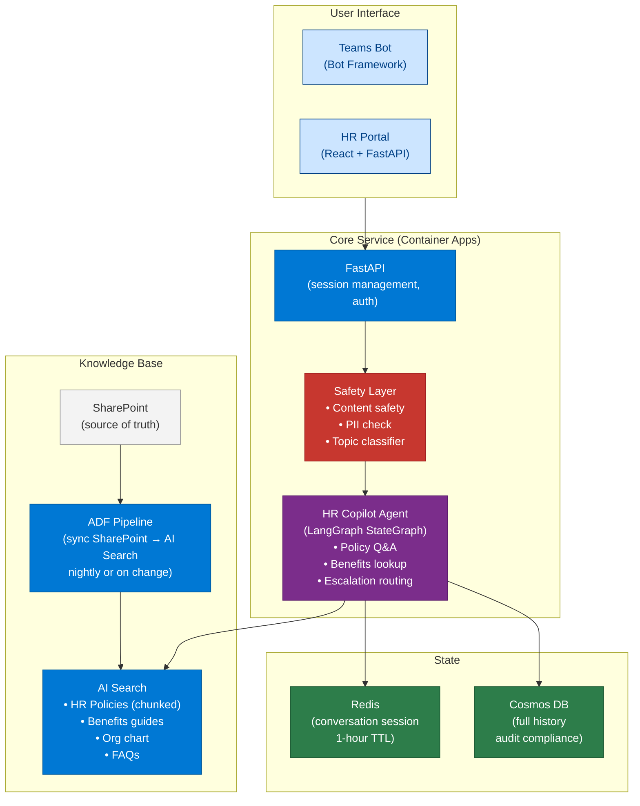
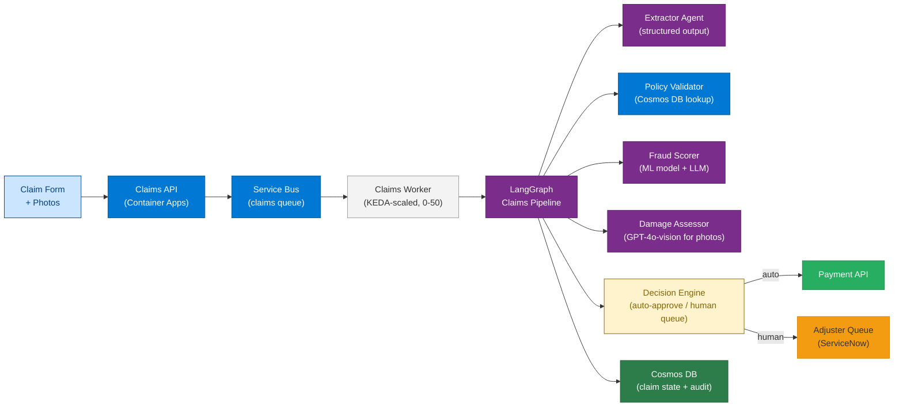
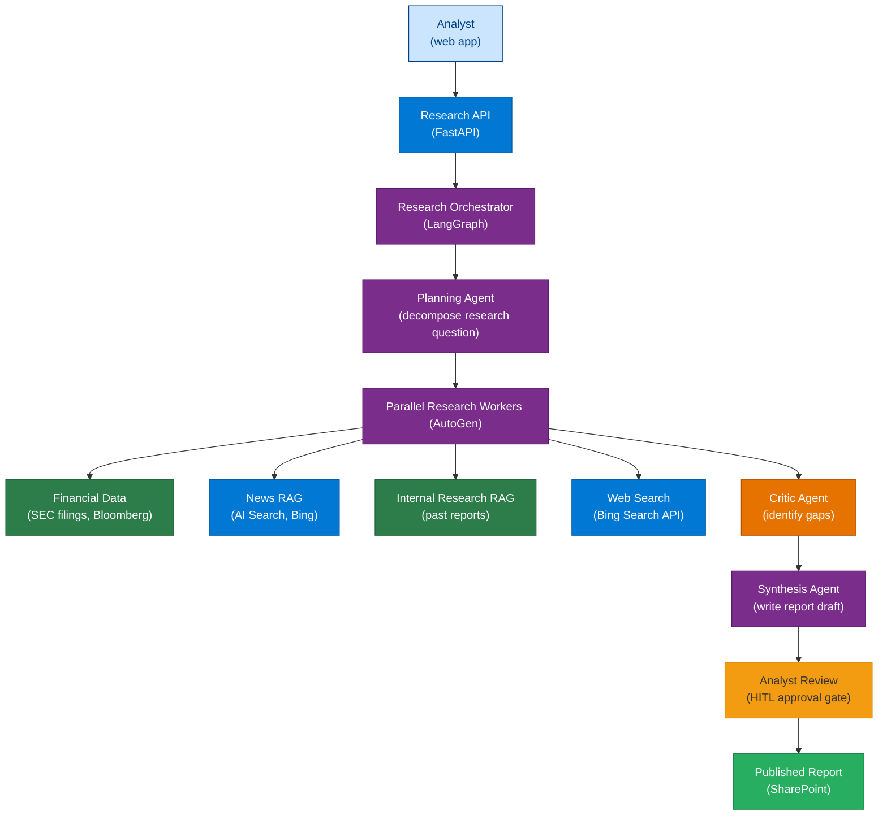

# 39 — End-to-End Projects

> **Level:** Advanced | **Time to complete:** 6 hours (choose one project) | **Azure services:** Full enterprise Azure AI stack

---

## 1. Overview

This module presents three fully specified end-to-end enterprise AI projects, each with a complete architecture, implementation guide, evaluation criteria, and deployment checklist. Choose the project most relevant to your target role.

---

## 2. Project 1: Enterprise HR Knowledge Copilot

### Business Problem
A 10,000-employee company spends $2M/year answering HR questions manually. Target: automate 70% of queries with AI while maintaining quality and compliance.

### Architecture



### Implementation Files

```
hr-copilot/
├── pyproject.toml
├── Dockerfile
├── .env.example
├── main.py              # FastAPI app
├── agent/
│   ├── state.py         # LangGraph TypedDict state
│   ├── nodes.py         # Node functions (retrieve, generate, route, safety)
│   ├── graph.py         # StateGraph definition
│   └── tools.py         # HR-specific tools (leave balance lookup, etc.)
├── memory/
│   ├── session.py       # Redis session management
│   └── history.py       # Cosmos DB history
├── retrieval/
│   ├── search.py        # Azure AI Search hybrid query
│   └── ingestion.py     # SharePoint → AI Search pipeline
├── safety/
│   ├── content_safety.py
│   └── topic_classifier.py
├── eval/
│   ├── test_cases.json  # 200 golden Q&A pairs
│   └── evaluator.py     # Groundedness evaluation runner
└── infra/
    ├── main.bicep       # Full Azure infrastructure
    └── deploy.yml       # GitHub Actions CI/CD
```

### Key Implementation: LangGraph State Machine

```python
# agent/state.py
from typing import TypedDict, Annotated
import operator

class HRCopilotState(TypedDict):
    session_id: str
    user_id: str
    user_department: str
    messages: Annotated[list[dict], operator.add]
    current_query: str
    retrieved_docs: list[dict]
    topic_classification: str  # "policy" | "benefits" | "payroll" | "other"
    is_safe: bool
    escalation_needed: bool
    final_response: str
    citations: list[str]


# agent/nodes.py
async def classify_topic(state: HRCopilotState) -> dict:
    """Classify query to route to the right knowledge domain."""
    # ... implementation
    return {"topic_classification": "policy"}

async def retrieve_hr_knowledge(state: HRCopilotState) -> dict:
    """Hybrid search in HR knowledge base."""
    # ... implementation using Module 14 patterns
    return {"retrieved_docs": results}

async def generate_response(state: HRCopilotState) -> dict:
    """Generate grounded, cited response."""
    # ... implementation
    return {"final_response": answer, "citations": sources}

async def safety_check(state: HRCopilotState) -> dict:
    """Content safety + topic scope check."""
    # ... implementation
    return {"is_safe": True, "escalation_needed": False}


# agent/graph.py
from langgraph.graph import StateGraph, END

def build_hr_copilot_graph():
    graph = StateGraph(HRCopilotState)

    graph.add_node("classify", classify_topic)
    graph.add_node("retrieve", retrieve_hr_knowledge)
    graph.add_node("generate", generate_response)
    graph.add_node("safety", safety_check)

    graph.set_entry_point("safety")
    graph.add_conditional_edges(
        "safety",
        lambda state: "blocked" if not state["is_safe"] else "classify",
        {"blocked": END, "classify": "classify"},
    )
    graph.add_edge("classify", "retrieve")
    graph.add_edge("retrieve", "generate")
    graph.add_edge("generate", END)

    return graph.compile(checkpointer=CosmosDBSaver(connection_string=...))
```

### Evaluation Criteria

| Metric | Target | Measurement |
|---|---|---|
| Policy answer accuracy | ≥ 90% | Human eval on 200 test cases |
| Groundedness score | ≥ 4.0/5 | Azure AI Foundry evaluator |
| Escalation recall | ≥ 95% | Correctly escalate sensitive cases |
| Response latency P95 | < 5s | App Insights |
| HR team time saved | 70% | Compare queries handled/agent vs. total |

---

## 3. Project 2: Automated Insurance Claims Processing

### Business Problem
Claims team receives 2,000 claims/day. Manual processing takes 3-5 days average. Goal: auto-process 60% in under 10 minutes.

### Architecture



### Key Implementation: Vision-Based Damage Assessment

```python
# agents/damage_assessor.py
import asyncio
import base64
from openai import AsyncAzureOpenAI
from pydantic import BaseModel

aoai = AsyncAzureOpenAI(...)


class DamageAssessment(BaseModel):
    damage_type: str
    severity: str  # "minor" | "moderate" | "severe" | "total_loss"
    affected_areas: list[str]
    estimated_repair_cost_usd: float
    confidence: float  # 0-1
    requires_inspection: bool
    notes: str


async def assess_vehicle_damage(
    image_urls: list[str],
    claim_description: str,
) -> DamageAssessment:
    """Use GPT-4o Vision to assess vehicle damage from photos."""

    content = [
        {"type": "text", "text": f"Assess the vehicle damage from these photos.\nClaimant description: {claim_description}\n\nProvide a structured damage assessment."},
    ]

    # Add image content
    for url in image_urls[:4]:  # Max 4 images per call
        content.append({
            "type": "image_url",
            "image_url": {"url": url, "detail": "high"},
        })

    response = await aoai.chat.completions.create(
        model="gpt-4o",
        messages=[
            {"role": "system", "content": "You are a certified auto damage assessor with 20 years of experience. Assess damage objectively and conservatively."},
            {"role": "user", "content": content},
        ],
        response_format={
            "type": "json_schema",
            "json_schema": {
                "name": "damage_assessment",
                "schema": DamageAssessment.model_json_schema(),
                "strict": True,
            },
        },
        temperature=0,
    )
    import json
    return DamageAssessment(**json.loads(response.choices[0].message.content))
```

### Processing Rate Targets

| Metric | Target |
|---|---|
| Claims auto-processed | ≥ 60% |
| Processing time (auto-approved) | < 10 minutes |
| Fraud detection precision | ≥ 90% |
| False approval rate | < 2% |
| Adjuster time saved | 50% |

---

## 4. Project 3: Multi-Source Research Intelligence Platform

### Business Problem
Investment research team produces 20 reports/week. Each takes 8 analyst-hours. Goal: AI generates first draft in 30 minutes; analyst reviews in 2 hours.

### Architecture



### Key Implementation: Parallel Research

```python
# research/parallel_workers.py
import asyncio
from openai import AsyncAzureOpenAI

aoai = AsyncAzureOpenAI(...)


async def research_question(
    sub_question: str,
    sources: list[str],
    research_agent_prompt: str,
) -> dict:
    """Research a single sub-question across specified sources."""
    context_parts = []

    # Parallel source retrieval
    source_tasks = []
    for source in sources:
        if source == "ai_search":
            source_tasks.append(search_ai_search(sub_question))
        elif source == "bing":
            source_tasks.append(search_bing(sub_question))
        elif source == "sec_filings":
            source_tasks.append(search_sec_filings(sub_question))

    results = await asyncio.gather(*source_tasks, return_exceptions=True)
    for source, result in zip(sources, results):
        if not isinstance(result, Exception):
            context_parts.append(f"[{source}]: {result}")

    context = "\n\n".join(context_parts)

    response = await aoai.chat.completions.create(
        model="gpt-4o",
        messages=[
            {"role": "system", "content": research_agent_prompt},
            {"role": "user", "content": f"Research question: {sub_question}\n\nSources:\n{context}"},
        ],
        temperature=0.1,
        max_tokens=1500,
    )
    return {
        "sub_question": sub_question,
        "findings": response.choices[0].message.content,
        "sources": [s for s, r in zip(sources, results) if not isinstance(r, Exception)],
    }


async def run_parallel_research(
    research_plan: list[dict],  # [{"question": str, "sources": list[str]}]
) -> list[dict]:
    """Execute all sub-questions in parallel."""
    tasks = [
        research_question(
            item["question"],
            item["sources"],
            "You are a senior financial research analyst. Provide accurate, cited findings.",
        )
        for item in research_plan
    ]
    return await asyncio.gather(*tasks, return_exceptions=False)
```

---

## 5. Project Submission Checklist

For each project, ensure the following are implemented:

### Code Quality
- [ ] All Python type hints complete
- [ ] Async throughout — no blocking calls
- [ ] Error handling at every external call
- [ ] Structured logging (JSON to stdout)
- [ ] Unit tests for tool functions (pytest)
- [ ] Integration tests for key flows

### Azure Infrastructure
- [ ] All resources deployed via Bicep
- [ ] Managed Identity for all auth
- [ ] Private endpoints on all services
- [ ] Monitoring: App Insights + Log Analytics
- [ ] Alerts: latency, error rate, cost

### AI Quality
- [ ] 200 golden test cases for evaluation
- [ ] LLM-as-judge evaluation script
- [ ] Hallucination detection on responses
- [ ] Groundedness score ≥ 4.0/5
- [ ] HITL gate for high-risk decisions

### DevOps
- [ ] GitHub Actions pipeline
- [ ] Prompt evaluation gate (blocks on < 85%)
- [ ] Canary deployment with auto-rollback
- [ ] Immutable image tags (SHA-based)

---

## 6. Interview Q&A

### Q1 (Capstone): Walk me through how you would design and build the HR Knowledge Copilot from scratch in 8 weeks.

**Answer:** Week-by-week plan: (1) **Week 1 — Foundation**: Set up Azure infrastructure via Bicep (Container Apps, AI Search, OpenAI, Redis, Cosmos). Configure Managed Identity. Build basic FastAPI endpoint and Azure AI Search index from a sample of HR docs. (2) **Week 2 — RAG pipeline**: Implement hybrid search with semantic reranker. Build ingestion pipeline from SharePoint. Evaluate chunking strategy on 50 policy documents. Set up 100-question evaluation dataset. (3) **Week 3 — Agent graph**: Build LangGraph StateGraph with topic classification, retrieval, and generation nodes. Implement conversation memory (Redis). Build safety check node. (4) **Week 4 — Teams integration**: Deploy Teams Bot via Azure Bot Service. Test end-to-end in a test Teams channel. Implement session management. (5) **Week 5 — Quality and safety**: Build LLM-as-judge evaluation runner. Add content safety filter. Add PII detection on outputs. Run first full evaluation (100 test cases). (6) **Week 6 — Production readiness**: Add OpenTelemetry instrumentation. Build Azure Monitor dashboards. Set up alerts. Test canary deployment procedure. (7) **Week 7 — Pilot**: Deploy to staging. Onboard 50 pilot users. Collect feedback. Fix quality issues identified in production. (8) **Week 8 — Launch**: Roll out to full employee base (canary: 10% → 50% → 100%). Monitor quality metrics daily.

---

## Cross-links

- Previous: [38 — Reference Architecture](./38-Reference-Architecture.md)
- Next: [40 — Interview Preparation](./40-Interview-Preparation.md)
- Related: All previous modules — apply here

---

*Module 39 | Series: Enterprise Agentic AI Tutorial | Last updated: June 2026*
