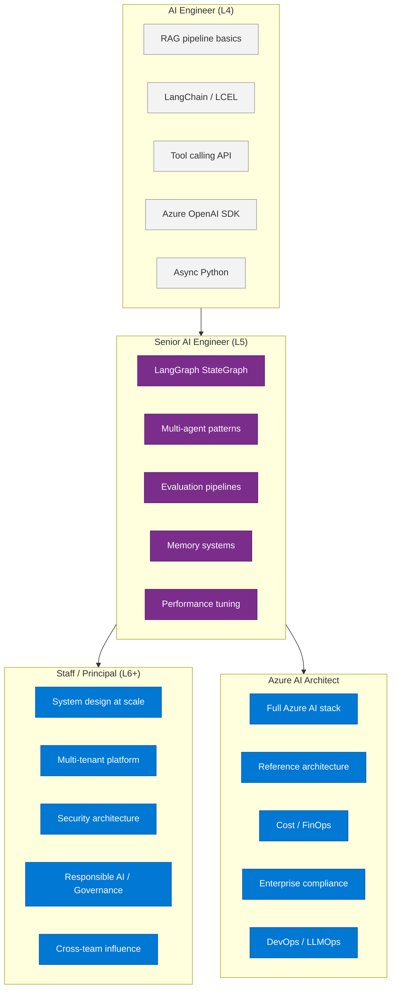
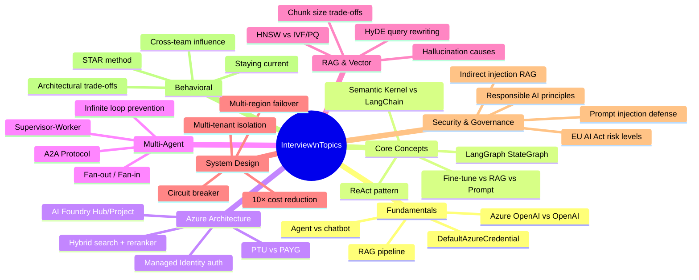

# 40 — Interview Preparation

> **Level:** All levels | **Time to complete:** 4 hours (study) | **Format:** Q&A bank with model answers

---

## 1. Overview

This module compiles 60+ interview questions across all topics in the series, organized by level and topic. Model answers are provided for the most complex questions. Use this to prepare for Principal/Staff AI Engineer, Azure AI Architect, and AI Solutions Architect interviews.

---

## 1.1 Skills Map by Role and Level

---

## 2. Fundamentals (Beginner)

**Q: What is an AI agent and how does it differ from a chatbot?**

A chatbot responds to user input with pre-defined or LLM-generated replies — it receives a message, generates a response, done. An AI agent is autonomous: it has a goal, perceives its environment (through tools), reasons about what to do, takes actions (calls APIs, searches databases, executes code), observes results, and loops until the goal is achieved. An agent has four components: LLM (reasoning), tools (actions), memory (context), and planning (goal decomposition). A chatbot is reactive; an agent is proactive.

**Q: What is RAG?**

RAG (Retrieval-Augmented Generation) combines a search system (vector database) with an LLM. Instead of relying on the LLM's training knowledge, RAG retrieves relevant documents at query time and passes them as context to the LLM. This allows the LLM to answer questions about private, recent, or domain-specific data it wasn't trained on. The pipeline: embed the query → search the vector index → retrieve top-k chunks → pass chunks + query to LLM → generate grounded answer with citations.

**Q: What is the difference between Azure OpenAI and OpenAI?**

Both provide access to the same GPT models, but via different APIs. Azure OpenAI runs the models in Microsoft's Azure datacenter, provides enterprise features (Private Endpoints, VNet integration, Managed Identity auth, content filtering, compliance certifications), and operates under your Azure data residency agreements. OpenAI.com is a direct API without Azure infrastructure integration. For enterprise production use, always use Azure OpenAI for compliance, networking, and governance.

---

## 3. Core Concepts (Intermediate)

**Q: Explain the difference between fine-tuning, RAG, and prompt engineering for customizing LLM behavior.**

| Approach | What it does | When to use | Cost |
|---|---|---|---|
| Prompt engineering | Change instructions in the system prompt | Fast iteration, behavior changes, style | No training cost; higher per-call token cost |
| RAG | Add domain knowledge at query time via retrieval | Private data, frequently updated info, reduce hallucinations on facts | Index cost; retrieval latency |
| Fine-tuning | Update model weights with domain examples | Consistent format/style, very domain-specific tasks, when prompt alone can't achieve quality | Training cost (1-time) + hosted model cost |

Rule: try prompt engineering first, then RAG, then fine-tuning only if both fail.

**Q: What is Semantic Kernel and how does it compare to LangChain?**

Both are orchestration frameworks for building LLM applications. Semantic Kernel is Microsoft's framework, tightly integrated with Azure AI Foundry, with strong .NET and Python support. It uses "Plugins" (analogous to LangChain tools) and "Kernels" (the DI container). LangChain is framework-agnostic, Python-first, with a large ecosystem (1,000+ integrations). LangChain's LCEL (pipe composition) is more Pythonic; SK is more enterprise-oriented. For Azure-native production: Semantic Kernel has better Azure integration. For flexibility and ecosystem: LangChain/LangGraph. Many teams use both: SK for Azure integrations, LangGraph for complex agent state machines.

**Q: What is the ReAct pattern?**

ReAct (Reasoning + Acting) is a prompting pattern where the agent alternates between reasoning (Thought) and action (Action + Observation). The agent writes its reasoning, calls a tool, observes the result, writes new reasoning, calls the next tool, and so on. This interleaving of reasoning and action allows the agent to adapt its approach based on tool results. Compared to pure CoT (which reasons without feedback), ReAct is grounded in real-world observations.

---

## 4. Azure Architecture (Intermediate-Advanced)

**Q: Describe the Azure AI Foundry Hub and Project hierarchy.**

Azure AI Foundry uses a two-level hierarchy: Hub and Project. The **Hub** is the enterprise governance layer: it holds the shared Azure OpenAI and Azure AI Search connections, configures centralized networking (private endpoints), stores shared compute, and defines RBAC policies. One Hub typically serves an entire organization or department. The **Project** is the team workspace: individual teams create Projects under a Hub, each inheriting the Hub's connections while maintaining isolation. Projects hold their own agent deployments, evaluation runs, prompt flows, and fine-tuning jobs. This maps to: Hub = platform team, Project = product team.

**Q: How does Managed Identity authentication work for Azure OpenAI?**

Instead of using an API key, the Azure Container App (or VM, Function, AKS Pod) is assigned a System-Assigned Managed Identity. This identity is automatically registered in Microsoft Entra ID (Azure AD). You then grant this identity the "Cognitive Services OpenAI User" role on the Azure OpenAI resource via RBAC. At runtime, the SDK calls `DefaultAzureCredential()`, which automatically requests a short-lived bearer token from the IMDS (Instance Metadata Service) endpoint. This token is used to authenticate to Azure OpenAI. No API keys are stored anywhere — the token is ephemeral and auto-rotated. This eliminates the biggest security risk: long-lived API keys in environment variables.

**Q: What is an Azure AI Search hybrid query and why is it better than vector-only?**

A hybrid query combines BM25 keyword search with vector (semantic) search, then uses a semantic reranker to re-score the top results. BM25 (Best Match 25) is a term-frequency-based algorithm — it excels at matching exact terms, product codes, names, and precise phrases. Vector search captures semantic similarity — it finds "leave of absence" even if you search for "taking time off work." Neither alone is optimal: BM25 misses semantic matches; vector search misses exact phrase matches. Hybrid combines both, then the semantic reranker applies a cross-encoder model to re-score top 50 results by contextual relevance. The combination typically outperforms either alone by 15-30% on enterprise benchmarks.

---

## 5. Multi-Agent Systems (Advanced)

**Q: How do you prevent agents from going into infinite loops in a multi-agent system?**

Multiple guardrails: (1) **Step counter**: every LangGraph or agent loop has a `max_iterations` limit (typically 10-15). The loop exits when exceeded; (2) **Completion detector**: before each loop iteration, check if the goal is achieved. If yes, exit; (3) **Termination conditions**: in AutoGen, `MaxMessageTermination`, `TextMentionTermination`, `StopMessageTermination` provide clear exit criteria; (4) **Cycle detection**: in LangGraph, `StateGraph` with proper conditional edges prevents explicit cycles. If cycles are needed (e.g., reflection loops), they have their own iteration counter; (5) **Timeout**: at the HTTP level, a 5-minute total timeout aborts any stuck workflow. Monitor for `max_iterations` exits — they indicate the agent couldn't achieve its goal and may need a better planning strategy.

**Q: Explain the Supervisor-Worker multi-agent pattern.**

A Supervisor agent receives a goal and decomposes it into sub-tasks. It then dispatches each sub-task to a specialized Worker agent, collects results, and synthesizes a final response. The Supervisor uses LLM-based routing to decide which Worker to call for each sub-task. Workers are specialists — they don't know about each other; only the Supervisor coordinates. Benefits: each Worker can be independently optimized for its domain; the system scales by adding Workers; debugging is easier (which Worker failed?). Implementation: Semantic Kernel AgentGroupChat (Supervisor mode), AutoGen SelectorGroupChat, or LangGraph Supervisor pattern (conditional edges back to Supervisor node).

**Q: What is the A2A (Agent-to-Agent) Protocol?**

A2A is an open standard proposed by Google (2024) for agent interoperability — it defines how agents from different vendors discover and communicate with each other. The protocol defines: (1) **Agent Card** — a JSON file at `/.well-known/agent.json` that describes the agent's capabilities, endpoints, and authentication requirements; (2) **Task Object** — the standard message format for sending a task between agents (task_id, type, payload, status); (3) **Transport** — typically HTTP REST or SSE (Server-Sent Events) for streaming. A2A enables: an enterprise customer to deploy agents from multiple vendors that work together; a routing agent to discover available specialist agents dynamically; multi-cloud multi-vendor agent systems without vendor lock-in. Currently in early adoption (2024-2025).

---

## 6. RAG and Vector Search (Advanced)

**Q: How do you choose chunk size for a RAG system?**

Chunk size involves a fundamental trade-off: small chunks improve retrieval precision (you retrieve only the relevant sentence) but may miss surrounding context needed to answer the question. Large chunks provide more context but reduce precision (you may retrieve a huge chunk where the relevant part is a small section). Guidelines: (1) 256-400 tokens for fact retrieval (Q&A, policy lookup); (2) 512-800 tokens for technical documentation (preserves code blocks and explanation together); (3) Parent-child chunking as the best of both: large parent chunks (1024 tokens) for context retrieval, small child chunks (256 tokens) for precise matching. Retrieval hits the small child chunk; the parent chunk is returned to the LLM. Always test chunk size on your specific data with a 100-question evaluation set.

**Q: What causes hallucinations in RAG systems and how do you mitigate them?**

Hallucinations in RAG occur when: (1) **Retrieval failure** — the LLM doesn't find the answer in the retrieved context and "completes" with training knowledge or fabrication. Mitigation: improve retrieval (hybrid search, semantic reranker), use parent-child chunking; (2) **Context overflow** — too much context causes the LLM to miss or misread the relevant portion. Mitigation: context compression, limit context to top-3 chunks; (3) **Sycophantic generation** — the LLM generates a plausible-sounding answer even when the context doesn't support it. Mitigation: explicit system prompt instruction ("say UNKNOWN if not in context"), few-shot examples of UNKNOWN responses, groundedness checking post-generation; (4) **Model limitations** — smaller/older models hallucinate more. Mitigation: use GPT-4o for RAG generation; (5) **Stale index** — retrieved docs are outdated. Mitigation: timestamp-based freshness scoring, TTL on old documents.

---

## 7. System Design (Senior/Principal Level)

**Q: Design a multi-tenant AI agent platform for 100 enterprise customers, each needing data isolation.**

Multi-tenant isolation strategy: (1) **Network isolation**: each customer gets a dedicated Azure AI Foundry Project under a shared Hub. Projects are logically isolated — customer A's documents and conversation history never comingle with customer B's; (2) **Data isolation**: per-customer AI Search indexes (or a shared index with mandatory security trimming filter `tenant_id=CustomerA` on every query); (3) **Resource isolation**: per-customer Service Bus namespace for queue isolation; per-customer Redis key prefix (`customer-A:session:*`); per-customer Cosmos DB container (or partition key `tenant_id`); (4) **Auth**: customer users have tokens scoped to their tenant ID. The API validates the tenant claim and enforces it on all queries; (5) **PTU sharing**: a shared PTU pool with per-tenant rate limiting in APIM (e.g., 1,000 TPM per tenant). Add PTU when any tenant approaches limit; (6) **Monitoring**: per-tenant dashboards for cost, quality, and usage; (7) **Compliance**: per-tenant audit log with their data only. Export available for GDPR data subject requests.

**Q: How would you handle a scenario where your LLM costs are 10× your budget?**

Systematic cost reduction: (1) **Semantic caching**: implement Redis semantic cache. If 30% of queries hit cache, immediately cut costs 30%; (2) **Model routing**: classify query complexity. Route 70% simple queries to GPT-4o-mini (33× cheaper). Only complex reasoning goes to GPT-4o; (3) **Prompt compression**: if average prompt is 4,000 tokens, compression to 1,500 tokens = 62% cost reduction. Use GPT-4o-mini for compression (negligible cost); (4) **Batch API**: for any non-real-time processing (document summarization, nightly reports), switch to Batch API (50% discount); (5) **Context window reduction**: reduce RAG context from 8K to 2K tokens via compression; reduce few-shot examples; (6) **Dimension reduction**: text-embedding-3-large with `dimensions=512` instead of 1536 → 3× smaller vectors, lower storage cost, similar quality; (7) **PTU sizing review**: if on PAYG, right-size PTU for actual sustained load; (8) **Output length control**: enforce `max_tokens` limits. Verbose responses waste money. Combined, these measures typically cut costs 60-80% without significant quality impact.

---

## 8. Behavioral and Leadership Questions (Principal/Staff)

**Q: Describe a time you had to make a significant architectural decision under uncertainty.**

(Use STAR method — Situation, Task, Action, Result. Template for AI context):
"At [company], we were designing a document processing pipeline. The team was divided between using Azure Durable Functions (complex, but durable state) vs. a simpler Service Bus + Container Apps architecture (easier to implement, but no built-in state). The uncertainty was whether our 24-hour processing SLAs were strict enough to need Durable Functions' external event HITL capability. I analyzed the business requirements: 30% of claims above $10K needed adjuster approval — a feature that Durable Functions handles natively but requires complex custom code in Service Bus. I recommended Durable Functions despite the steeper learning curve. Result: we handled the HITL requirement cleanly, and when requirements changed to add more approval tiers, we could do it without architectural changes. Key learning: optimize for expected change, not just current requirements."

**Q: How do you stay current in the rapidly evolving AI field?**

Structured approach: (1) Weekly: Microsoft Tech Community blog, Azure AI updates, LangChain/LangGraph release notes, Anthropic and OpenAI research blogs; (2) Monthly: read 2-3 papers from arXiv (cs.AI, cs.LG) on topics relevant to current projects — don't read everything, focus; (3) Hands-on: build proof-of-concepts for major new capabilities within 2 weeks of release (e.g., when GPT-4o-mini launched, run it against your eval set immediately); (4) Community: Azure AI Discord, LangChain Discord, attend Azure AI meetups; (5) Team sharing: 30-minute weekly "AI news" slot in team sync — each person brings one new thing they learned.

---

## 9. Quick Reference: Interview Topics by Role

### AI Engineer (L4-L5)
- RAG pipeline implementation
- LangChain / LangGraph fundamentals
- Tool calling and structured outputs
- Azure OpenAI API patterns
- Async Python for AI

### Senior AI Engineer (L5-L6)
- Multi-agent architectures (Supervisor, Fan-out, Swarm)
- Memory systems (episodic, semantic, procedural)
- Evaluation pipelines (LLM-as-judge, Azure AI Foundry)
- Performance tuning (caching, model routing, streaming)
- Cost optimization (PTU sizing, Batch API)

### Staff/Principal AI Engineer (L6+)
- System design at scale (1M+ users)
- Multi-tenant platform design
- Security architecture (Managed Identity, prompt injection)
- Responsible AI and governance (EU AI Act, HITL)
- Cross-team influence and architectural decision-making

### Azure AI Architect
- Full Azure AI stack (all services)
- Reference architecture design
- Enterprise security and compliance
- Cost optimization and FinOps
- DevOps/LLMOps pipelines

---

## 10. Top 10 Questions to Master

1. Design an enterprise RAG system for 100K documents and 1K concurrent users
2. Explain LangGraph StateGraph and how it manages agent state
3. How does Managed Identity authentication work in Azure?
4. What is PTU vs. PAYG and how do you decide?
5. How do you prevent prompt injection in a RAG system?
6. Explain the Supervisor-Worker multi-agent pattern with code
7. How do you evaluate AI agent quality at scale?
8. What is the EU AI Act and how does it affect your system?
9. How would you reduce RAG query latency from 8s to 3s?
10. Design a multi-tenant AI platform for 100 enterprise customers

---

## 11. AI Engineer Interview — Rapid-Fire Q&A

These questions appeared in recent AI Engineer interviews (2025). Short, sharp answers are expected — not essays.

### LLM & Model Selection

**Q: How do you choose between GPT-4o and GPT-4o-mini for a production use case?**
Route 70–80% of queries to GPT-4o-mini (simple extraction, classification, FAQ). Use GPT-4o only for complex reasoning, multi-step analysis, and code generation. Measure quality with your eval dataset — use the cheapest model that meets your quality threshold. GPT-4o-mini is 33× cheaper; the savings fund more features.

**Q: What is temperature and when do you set it to 0?**
Temperature controls randomness in token sampling. Temperature=0 makes the model deterministic (always picks the highest-probability token). Set it to 0 for structured output extraction, evaluation judges, classification, and any task where consistency matters more than variety. Set it to 0.3–0.7 for conversational Q&A, 0.7–1.0 for creative or exploratory tasks.

**Q: What is the difference between top_p and temperature?**
Both control output diversity. Temperature scales the probability distribution (hotter = more uniform = more random). Top_p (nucleus sampling) restricts the token pool to the smallest set whose cumulative probability ≥ top_p — then samples from that set. In practice: adjust temperature first; add top_p only if you need a hard ceiling on improbable tokens. Don't adjust both simultaneously.

### MCP and Tool Architecture

**Q: What is an MCP server and why does it matter?**
MCP (Model Context Protocol) is Anthropic's open standard for connecting LLMs to external tools, data sources, and services. An MCP server exposes resources (files, databases), tools (callable functions), and prompts over a standardised JSON-RPC interface. The client (Claude, or any MCP-compatible agent) discovers and calls these without per-integration custom code. It matters because it standardises the "tools" layer — any MCP-compatible agent can use any MCP server without custom integration work.

**Q: What are best practices for designing MCP tools?**
1. One tool = one action (don't combine search + parse). 2. Tool description says *when* to use it, not *how* it works internally. 3. Return structured JSON, not human-readable prose — the LLM parses the result. 4. Include error information in the return value (don't throw — return `{"error": "...", "success": false}`). 5. Tools must be idempotent where possible — agents retry on failure. 6. Validate arguments with Pydantic before executing.

### RAG

**Q: What is RAG and what problem does it solve?**
RAG (Retrieval-Augmented Generation) grounds LLM responses in real documents. The LLM alone knows only what it was trained on (potentially outdated, no private data). RAG embeds the user's query, searches a vector index of your documents, retrieves relevant chunks, and passes them to the LLM as context. The LLM then answers from those chunks rather than training memory. Solves: hallucination on domain-specific facts, stale knowledge, inability to access private data.

**Q: What is a vector embedding and why do we need them for RAG?**
An embedding is a fixed-length numerical vector (e.g., 1536 floats for `text-embedding-3-large`) that captures the semantic meaning of text. Semantically similar texts have vectors close together in vector space (high cosine similarity). RAG needs embeddings because keyword search (`BM25`) misses synonyms and paraphrases; vector search finds semantically related content even when the words differ. Hybrid search (BM25 + vectors + reranker) outperforms either alone.

### Agents and Workflows

**Q: How do you create an agent and connect it to tools?**
Define the tools as JSON Schema objects with `name`, `description`, and `parameters`. Pass them to the LLM via the `tools` parameter in the chat completion API. The LLM returns a `tool_calls` array when it wants to call a tool; you execute the call and send the result back as a `tool` role message. Repeat until `finish_reason == "stop"` (no more tool calls). Framework abstractions (LangGraph, AutoGen, CrewAI) manage this loop for you.

**Q: What is Human-in-the-Loop and when is it mandatory?**
HITL means pausing the agent workflow and requiring a human to review, approve, or correct before proceeding. Mandatory for: high-risk decisions (loan approval, medical triage, financial transactions > threshold), irreversible actions (send email, delete data, execute payment), and any AI Act High-Risk category AI system. Implement with LangGraph `interrupt_before`, Durable Functions `WaitForExternalEvent`, or any queue-based approval gate.

### CrewAI

**Q: What is CrewAI and how does it differ from AutoGen?**
CrewAI organises agents as a *role-playing team* — each agent has a role, goal, and backstory, and tasks are explicitly assigned to agents. AutoGen organises agents in a *group chat* with message-passing and configurable speaker selection. CrewAI is better for structured, role-based pipelines (researcher → analyst → writer); AutoGen is better for open-ended conversational reasoning loops. Both can use tools.

### Evaluation

**Q: What is the RICEFWID framework?**
A checklist for assessing whether an agent has everything it needs to complete a task: **R**esources (compute/token budget), **I**ntent (clear goal), **C**apabilities (right tools), **E**xperience (examples/grounding), **F**eatures (model capabilities needed), **W**orkflows (right orchestration pattern), **I**nputs (all required fields available), **D**ata (accurate knowledge base). Use it at design time to catch gaps before building.

---

## Cross-links

- Previous: [39 — End-to-End Projects](./39-End-to-End-Projects.md)
- Next: [41 — TOGAF and Enterprise Architecture](./41-TOGAF-Enterprise-Architecture.md)
- Related: [Appendix](./Appendix.md) | [38 — Reference Architecture](./38-Reference-Architecture.md)

---

*Module 40 | Series: Enterprise Agentic AI Tutorial | Last updated: June 2026*
