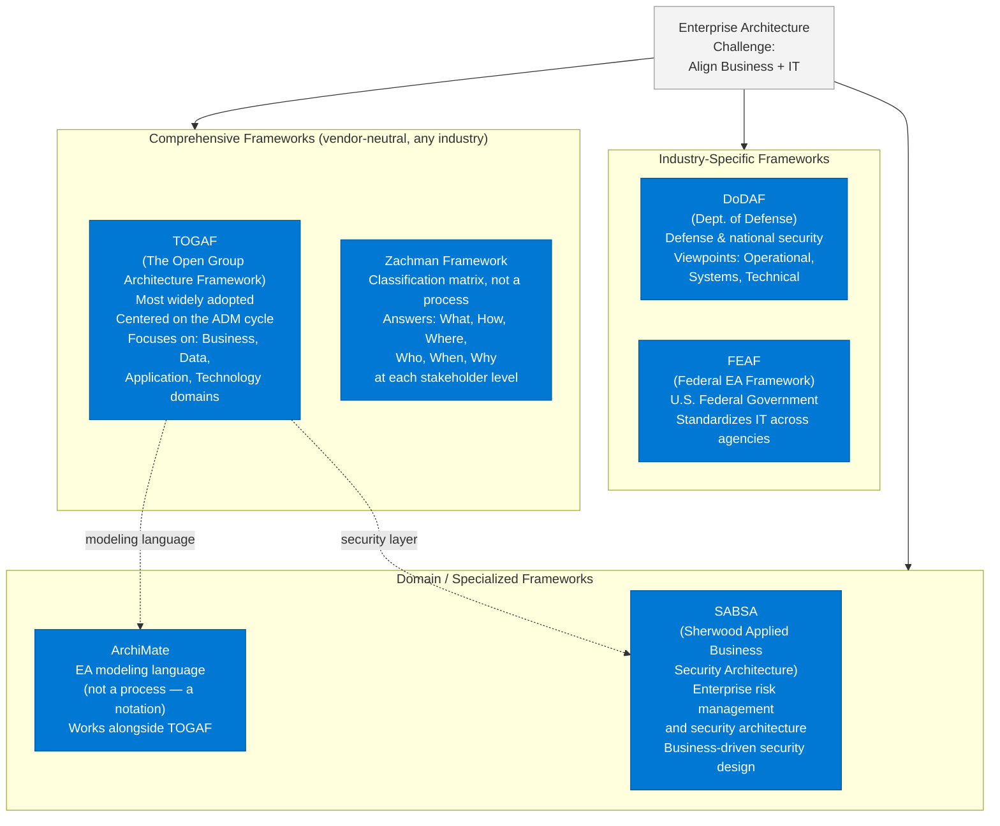
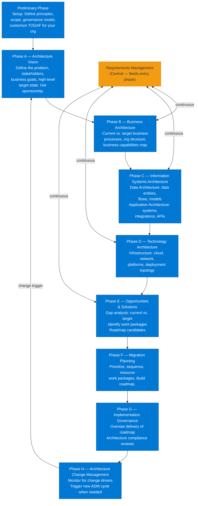
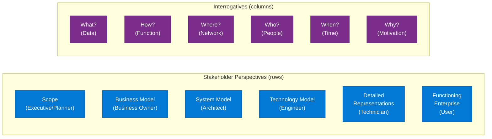

# 41 — TOGAF and Enterprise Architecture Frameworks

> **Level:** Intermediate–Advanced | **Time to complete:** 3 hours | **Technologies:** TOGAF ADM, Zachman Framework, SABSA, ArchiMate, EA tooling

---

## 1. Overview

Enterprise Architecture (EA) frameworks give organizations a structured language for aligning business goals with IT systems. Without a framework, large organizations accumulate conflicting systems, redundant capabilities, and brittle integrations that make digital transformation slow and expensive.

**Why EA matters for AI engineers and architects:**
- AI initiatives are cross-cutting — they touch data, security, integration, identity, and every business domain simultaneously. An EA framework tells you how to govern that scope without re-inventing the wheel.
- Senior interviews at large enterprises regularly test TOGAF literacy, particularly the ADM cycle and how to map AI capabilities to architecture domains.
- TOGAF is the most widely adopted EA framework globally (over 100,000 certified practitioners). If you work for a large bank, insurer, government agency, or consultancy, you will encounter it.

**When to use an EA framework:**
- Designing a multi-year digital transformation or AI strategy
- Defining how an AI platform fits into an existing enterprise landscape
- Governing AI adoption across multiple business units
- Obtaining buy-in from non-technical stakeholders using a shared vocabulary

**When NOT to apply a full EA framework:**
- Single-team product work — use simpler architectural decision records (ADRs) instead
- Startup or greenfield environments — the overhead is not justified at small scale
- Pure technical design within a bounded domain — EA operates at the enterprise level, not the service level

---

## 2. EA Framework Landscape



---

## 3. TOGAF Deep Dive — The ADM Cycle

The **Architecture Development Method (ADM)** is TOGAF's core. It is a structured, iterative cycle for developing and maintaining an enterprise architecture.



### 3.1 Four Architecture Domains (BDAT)

Every phase of the ADM is analyzed across four layers:

| Domain | Covers | AI relevance |
|---|---|---|
| **Business** | Goals, processes, capabilities, org structure | "What business problem does AI solve?" |
| **Data** | Data entities, data flows, master data, governance | Data pipelines, training data, RAG knowledge bases |
| **Application** | Software systems, APIs, integrations | AI services, model serving, agent orchestration platform |
| **Technology** | Infrastructure, cloud, networking, platforms | Azure/AWS infrastructure, GPU clusters, networking |

### 3.2 TOGAF Applied to an Enterprise AI Programme

```python
# togaf_ai_mapping.py — not runnable code, but a structured analysis template
# Use this as a checklist when presenting an AI initiative to enterprise architects

EA_ANALYSIS = {
    "phase_a_vision": {
        "business_driver": "Reduce document processing time by 70% through AI automation",
        "stakeholders": ["CTO", "COO", "Data Privacy Officer", "Business Unit Heads"],
        "constraints": ["GDPR compliance", "Data residency in EU", "Budget cap £2M Year 1"],
        "success_metrics": ["Processing time < 30s per document", "Accuracy > 95%", "Cost per document < £0.10"],
    },

    "phase_b_business": {
        "current_capability": "Manual document review by 40 FTE — 3 days average turnaround",
        "target_capability": "AI-assisted review — 30 seconds automated + human review for exceptions",
        "business_processes_impacted": ["Claims intake", "Compliance review", "Customer onboarding"],
        "organisational_change": "40 FTE redeployed to exception handling and quality assurance",
    },

    "phase_c_data": {
        "data_entities": ["Customer documents", "Policy records", "Regulatory rules corpus"],
        "data_flows": "Ingest → Chunk → Embed → Index → Retrieve → Generate → Human review",
        "data_governance": "Document classification labels, PII tagging, retention policy (7 years)",
        "master_data": "Customer ID is the authoritative key — all AI outputs tagged to customer record",
    },

    "phase_c_application": {
        "current_systems": ["Legacy DMS (SharePoint)", "CRM (Salesforce)", "Claims portal"],
        "new_components": ["Azure AI Foundry (RAG + agent)", "Azure AI Search (index)", "Human-in-loop portal"],
        "integrations": ["Salesforce API for case updates", "SharePoint for document ingestion"],
        "decommissions": [],
    },

    "phase_d_technology": {
        "cloud_platform": "Azure (existing enterprise agreement)",
        "key_services": ["Azure OpenAI GPT-4o", "Azure AI Search", "Container Apps", "Cosmos DB"],
        "security": "Private endpoints, Managed Identity, no internet egress from AI services",
        "compliance": "ISO 27001 certified region (UK South), SOC2 logging to Log Analytics",
    },

    "phase_e_gaps": [
        "No vector search capability in current DMS → add Azure AI Search",
        "No AI governance process → adopt Azure AI Content Safety + human review workflow",
        "No prompt evaluation tooling → integrate Azure AI Foundry evaluation pipeline",
    ],
}
```

---

## 4. Zachman Framework

The Zachman Framework is a **classification matrix**, not a process. It answers six fundamental questions at six stakeholder levels — producing 36 cells, each representing a distinct architecture artifact.



**Zachman vs TOGAF in practice:**
- Use **TOGAF ADM** when you need a *process* — a step-by-step method to design and govern an architecture
- Use **Zachman** when you need a *classification system* — to ensure you have documented every artifact for every stakeholder perspective
- They are complementary: TOGAF produces the artifacts; Zachman classifies and organises them

---

## 5. SABSA — Security Architecture

SABSA (Sherwood Applied Business Security Architecture) applies the same six-layer / six-interrogative matrix as Zachman, but focuses entirely on **risk and security**.

```mermaid
graph TB
    subgraph SABSA_LAYERS["SABSA Security Architecture Layers"]
        BIZ["Business Layer\n'What are the business risks?'\nRisk appetite, compliance obligations,\nbusiness impact analysis"]
        CONCEPT["Conceptual Layer\n'What security attributes protect the business?'\nConfidentiality, Integrity, Availability,\nAuthenticity, Non-repudiation"]
        LOGICAL["Logical Layer\n'What security services deliver those attributes?'\nIdentity management, encryption,\naccess control, audit logging"]
        PHYSICAL["Physical Layer\n'What mechanisms implement those services?'\nOAuth/OIDC, TLS 1.3, Azure AD,\nRole assignments, Private endpoints"]
        COMPONENT["Component Layer\n'What specific products/configs?'\nMicrosoft Entra ID, Azure Key Vault,\nAzure Firewall, NSG rules"]
        OPERATIONAL["Operational Layer\n'How is security operated daily?'\nSOC playbooks, patch schedules,\nincident response procedures"]
    end

    BIZ --> CONCEPT --> LOGICAL --> PHYSICAL --> COMPONENT --> OPERATIONAL

    classDef primary   fill:#0078d4,color:#fff,stroke:#005a9e
    classDef secondary fill:#7b2d8b,color:#fff,stroke:#5a1a6b
    classDef storage   fill:#2d7d4a,color:#fff,stroke:#1f5c35
    classDef security  fill:#c7372f,color:#fff,stroke:#a02020
    classDef monitor   fill:#e67300,color:#fff,stroke:#b35500
    classDef success   fill:#27ae60,color:#fff,stroke:#1e8449
    classDef warning   fill:#f39c12,color:#333,stroke:#d68910
    classDef neutral   fill:#f3f3f3,color:#333,stroke:#999
    classDef user      fill:#cce5ff,color:#004085,stroke:#004085
    classDef decision  fill:#fff3cd,color:#856404,stroke:#856404
    classDef highlight fill:#e74c3c,color:#fff,stroke:#c0392b

    class BIZ warning
    class CONCEPT,LOGICAL security
    class PHYSICAL,COMPONENT primary
    class OPERATIONAL monitor
```



**SABSA applied to AI systems:**

| SABSA Layer | AI-specific question | Example answer |
|---|---|---|
| Business | What business risk does AI introduce? | Hallucination causes incorrect insurance payouts |
| Conceptual | What attribute mitigates it? | Integrity (of AI outputs) + Accountability (of decisions) |
| Logical | What service enforces it? | Human-in-the-loop review + Audit logging |
| Physical | What mechanism implements it? | LangGraph HITL interrupt + Cosmos DB tamper-evident log |
| Component | What specific config? | `interrupt_before=["human_review"]` + SHA-256 hash chain |
| Operational | How is it monitored daily? | SOC alert on `groundedness_score < 3.5` in App Insights |

---

## 6. Production Checklist

- [ ] TOGAF ADM Phase A complete: executive sponsor named, business driver documented, constraints listed
- [ ] BDAT domains mapped for the AI initiative: Business process impacted, Data flows documented, Application integrations identified, Technology platform selected
- [ ] Gap analysis (Phase E) produced a prioritised roadmap, not just a wish list
- [ ] Zachman matrix used to verify all 36 cells have an owner or explicitly marked N/A
- [ ] SABSA applied to AI-specific risks: hallucination, prompt injection, data leakage — each mapped to a security control at the Logical layer
- [ ] Architecture principles documented (e.g., "Cloud-first", "Zero API keys", "AI decisions are auditable") — used in Phase G compliance reviews
- [ ] ArchiMate notation used for formal diagrams submitted to governance board (not ad-hoc boxes)
- [ ] Stakeholder communication plan: different architecture views delivered to different stakeholders (Executive summary ≠ Technical spec)

---

## 7. Interview Q&A

### Q1 (Beginner): What is TOGAF and why is it widely used in enterprise organisations?

**Answer:** TOGAF (The Open Group Architecture Framework) is a vendor-neutral framework for designing, planning, implementing, and governing enterprise IT architectures. It is widely used because it provides a repeatable, structured process (the ADM cycle) that gives organisations a common language and methodology across business, data, application, and technology layers. Over 100,000 practitioners are TOGAF-certified globally, making it a lingua franca for enterprise architects. It is particularly valuable in large organisations where multiple teams and vendors need to align on a shared architecture target state.

### Q2 (Intermediate): Explain the four architecture domains in TOGAF and how they relate to an AI programme.

**Answer:** TOGAF structures architecture work across four domains: Business (goals, processes, capabilities), Data (data entities, flows, governance), Application (software systems, APIs, integrations), and Technology (infrastructure, cloud, networking). For an AI programme: the Business domain answers *what problem AI solves and for whom*; the Data domain governs the knowledge base — document ingestion pipelines, embedding stores, data residency, and retention policies; the Application domain covers the AI agent service, orchestration framework (LangGraph/Semantic Kernel), evaluation pipeline, and human-in-loop portal; and the Technology domain specifies Azure AI Foundry, Container Apps, private networking, and GPU capacity. All four must be coherent — a technically excellent AI system that doesn't align with the business domain will fail to get adoption, while one that lacks a solid data domain will produce poor results regardless of model quality.

### Q3 (Advanced): How would you use TOGAF ADM to govern an organisation-wide AI adoption programme across ten business units?

**Answer:** Apply the ADM at two levels — an **enterprise AI platform** level and a **use-case** level. At the platform level: Phase A defines the enterprise AI strategy (single AI platform vs. federated); Phase B maps which business capabilities across all ten units benefit from AI; Phase C defines the shared data layer (centralised AI Search index with per-unit security trimming) and shared application services (Azure AI Foundry Hub with per-unit Projects); Phase D specifies the shared cloud infrastructure (shared PTU, shared observability). At the use-case level: each business unit runs a mini-ADM scoped to their use case, inheriting the Phase D technology decisions from the platform but owning their own Phase B (business process) and Phase C data (their own knowledge base partition). Phase G (Implementation Governance) is critical: establish an **AI Architecture Review Board** that reviews each use-case architecture against the enterprise principles (security, data governance, cost thresholds) before it goes to production. Phase H monitors for change drivers — a new regulation (e.g., EU AI Act) or a new model capability (e.g., GPT-5) triggers a new ADM iteration.

### Q4 (Architecture): How does SABSA complement TOGAF for AI security governance?

**Answer:** TOGAF's ADM is excellent at identifying what security *capabilities* are needed at each architecture layer, but it does not prescribe how to design those capabilities. SABSA fills this gap: it provides a risk-driven, business-aligned methodology for designing the security architecture itself. In practice: use TOGAF ADM to identify that "access control for RAG retrieval" is a required capability in Phase C (Application Architecture). Then use SABSA to design that control — starting at the Business layer (what risk does unauthorised access create?) through Conceptual (confidentiality + integrity), Logical (attribute-based access control), Physical (Azure AI Search security trimming with `filter: "user_groups/any(g: g eq @groups)"`), and Component (specific field name and RBAC role assignment). The combined approach means security controls are traceable from business risk all the way to specific configuration — the kind of evidence auditors and regulators require.

---

## Cross-links

- Previous: [40 — Interview Preparation](./40-Interview-Preparation.md)
- Next: [42 — CrewAI](./42-CrewAI.md)
- Related: [35 — AI Governance](./35-AI-Governance.md) | [38 — Reference Architecture](./38-Reference-Architecture.md) | [25 — System Design](./25-System-Design.md)

---

*Module 41 | Series: Enterprise Agentic AI Tutorial | Last updated: June 2026*
