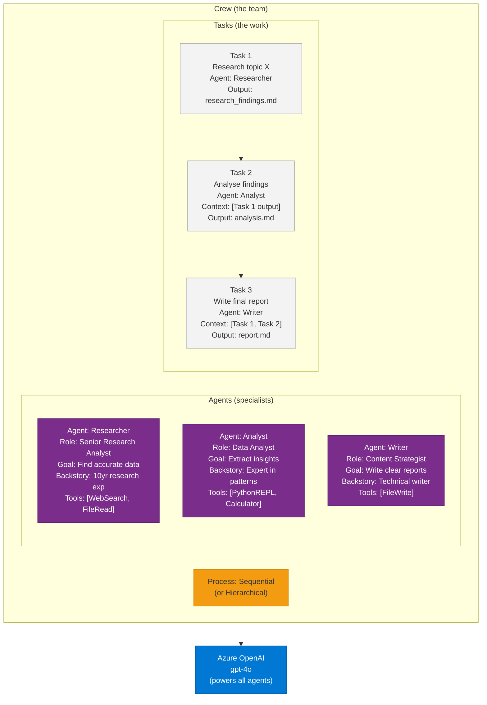
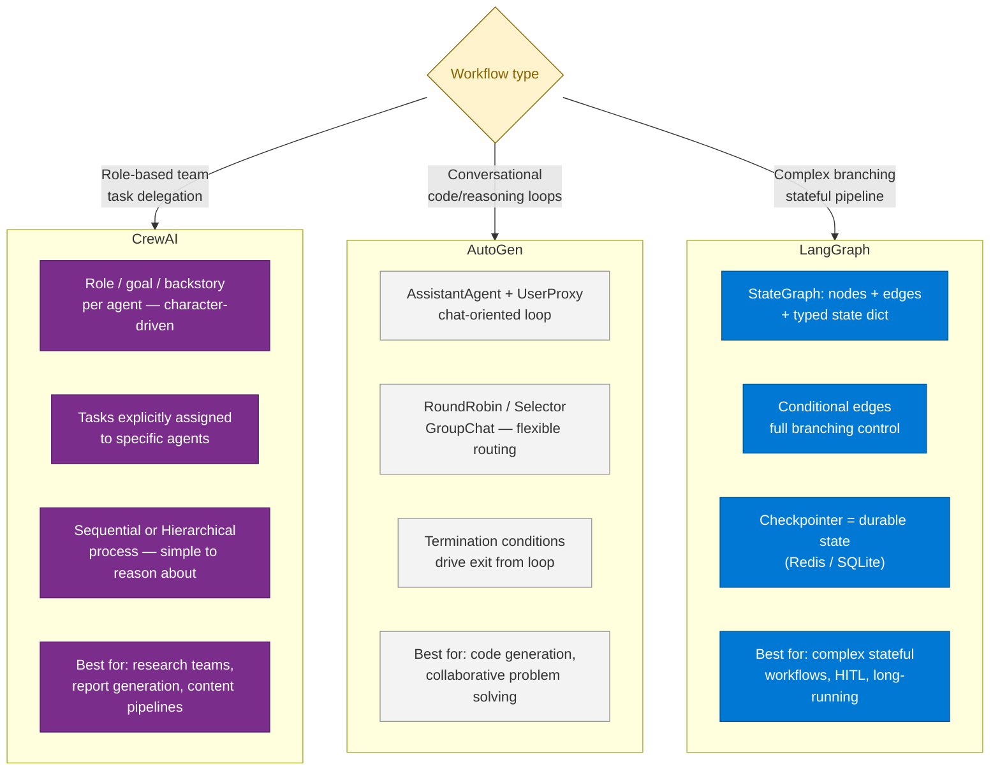

# 42 — CrewAI

> **Level:** Intermediate–Advanced | **Time to complete:** 3.5 hours | **Technologies:** CrewAI, Python, Azure OpenAI, LangChain tools

---

## 1. Overview

CrewAI is an open-source Python framework for orchestrating **role-playing multi-agent teams**. Where AutoGen focuses on conversational agent loops and LangGraph focuses on stateful graph-based workflows, CrewAI focuses on **defining agents as professionals with a job title, goal, and backstory**, then assembling them into a `Crew` that collectively works through a set of `Task` objects.

**Core metaphor:** You are building a team of specialist consultants. Each agent has a role ("Senior Data Analyst"), a defined goal ("Identify anomalies in the quarterly dataset"), and a backstory that shapes how the LLM portrays that agent's expertise. Tasks are assigned to agents — either sequentially or in parallel — and the Crew produces a final synthesised output.

**Why CrewAI is popular:**
- The role/goal/backstory pattern produces more consistent, on-character LLM responses than generic assistant agents
- Task delegation is explicit and readable — non-engineers can understand the workflow from the code
- Large ecosystem of pre-built tools and integrations
- Supports both sequential and hierarchical (manager/worker) process models

**When to choose CrewAI over alternatives:**

| Scenario | Best choice |
|---|---|
| Role-based team simulation (e.g., researcher + analyst + writer) | CrewAI |
| Complex stateful graph with branching/looping | LangGraph |
| Enterprise Azure integration with plugins | Semantic Kernel |
| Flexible conversational multi-agent with custom GroupChat | AutoGen |
| Simple sequential pipeline | LangChain LCEL |

---

## 2. Core Architecture



---

## 3. Building a CrewAI Research Pipeline

```python
# crew_research.py — multi-agent research and analysis crew
import os
from crewai import Agent, Task, Crew, Process
from crewai_tools import SerperDevTool, FileReadTool
from langchain_openai import AzureChatOpenAI

# Configure Azure OpenAI as the LLM backend for all agents
llm = AzureChatOpenAI(
    azure_endpoint=os.environ["AZURE_OPENAI_ENDPOINT"],
    azure_deployment="gpt-4o",
    api_version="2024-10-21",
    api_key=os.environ["AZURE_OPENAI_API_KEY"],
)

# Tools
search_tool = SerperDevTool()         # Web search
file_reader  = FileReadTool()         # Read local files

# ── Define Agents ──────────────────────────────────────────────────────────────

researcher = Agent(
    role="Senior Research Analyst",
    goal="Find accurate, comprehensive information on {topic} from reliable sources",
    backstory=(
        "You are a seasoned research analyst with 10 years of experience "
        "synthesising information from diverse sources. You always cite your "
        "sources and flag conflicting information rather than hiding it."
    ),
    tools=[search_tool],
    llm=llm,
    verbose=True,
    max_iter=5,           # Prevents runaway agent loops
    memory=True,          # Enables cross-task memory within the crew
)

analyst = Agent(
    role="Data & Insights Analyst",
    goal="Extract key patterns, trends, and actionable insights from research findings",
    backstory=(
        "You are a critical thinker who specialises in separating signal from "
        "noise. You structure insights by impact and always quantify claims "
        "where data allows."
    ),
    tools=[],             # This agent reasons over the researcher's output — no external tools needed
    llm=llm,
    verbose=True,
    max_iter=3,
)

writer = Agent(
    role="Technical Content Strategist",
    goal="Transform research and analysis into a clear, structured Markdown report",
    backstory=(
        "You write for a senior engineering audience. You use concrete examples, "
        "avoid buzzwords, and structure content so readers can skim headings and "
        "read details when needed."
    ),
    tools=[],
    llm=llm,
    verbose=True,
    max_iter=3,
)

# ── Define Tasks ───────────────────────────────────────────────────────────────

research_task = Task(
    description=(
        "Research the topic: {topic}. "
        "Find at least 5 authoritative sources. "
        "Extract: key facts, current state, major players, and recent developments. "
        "Output a structured summary with source citations."
    ),
    expected_output=(
        "A structured research summary (500–800 words) with: "
        "1) Key facts section, 2) Current state section, "
        "3) Source list with URLs"
    ),
    agent=researcher,
)

analysis_task = Task(
    description=(
        "Analyse the research findings. Identify: "
        "1) The 3 most important trends, "
        "2) Key risks or challenges, "
        "3) Recommended actions for a senior engineering team. "
        "Be specific — avoid vague generalisations."
    ),
    expected_output=(
        "An analysis document with: Trends (ranked by impact), "
        "Risks (with likelihood and severity), "
        "Recommendations (numbered, action-oriented)"
    ),
    agent=analyst,
    context=[research_task],   # Analyst receives researcher's output as context
)

report_task = Task(
    description=(
        "Write a professional Markdown report combining the research and analysis. "
        "Structure: Executive Summary, Background, Key Findings, Analysis, "
        "Recommendations, References. "
        "Target length: 1000–1500 words. Use clear section headers."
    ),
    expected_output=(
        "A complete Markdown report ready for publication, "
        "with proper headings, bullet points, and a references section"
    ),
    agent=writer,
    context=[research_task, analysis_task],
    output_file="report.md",   # Automatically saves to disk
)

# ── Assemble and Run the Crew ──────────────────────────────────────────────────

crew = Crew(
    agents=[researcher, analyst, writer],
    tasks=[research_task, analysis_task, report_task],
    process=Process.sequential,   # Tasks run in order
    verbose=2,                    # Show agent reasoning
    memory=True,                  # Shared crew memory
    max_rpm=10,                   # Rate limit: max 10 LLM calls per minute
)

result = crew.kickoff(inputs={"topic": "Agentic AI production deployment patterns 2025"})
print(result)
```

---

## 4. Hierarchical Process — Manager Agent Pattern

In hierarchical mode, a **manager agent** receives the overall goal, decomposes it into sub-tasks, delegates to worker agents, reviews their outputs, and synthesises the final result. This is CrewAI's equivalent of the Supervisor-Worker pattern.

```python
# hierarchical_crew.py
from crewai import Agent, Task, Crew, Process

# Manager agent — does not use tools, only coordinates
manager = Agent(
    role="Project Manager",
    goal=(
        "Coordinate the team to produce a complete, accurate, and well-written "
        "analysis of {topic}. Review all outputs before finalising."
    ),
    backstory=(
        "You are an experienced project manager who ensures quality and coherence "
        "across team deliverables. You ask clarifying questions when outputs are "
        "incomplete and request revisions when quality is insufficient."
    ),
    llm=llm,
    allow_delegation=True,   # Manager can delegate sub-tasks to other agents
    verbose=True,
)

# Worker agents
specialist_a = Agent(
    role="Domain Specialist",
    goal="Provide deep technical expertise on {topic}",
    backstory="You are a domain expert with hands-on production experience.",
    llm=llm,
    tools=[search_tool],
)

specialist_b = Agent(
    role="Business Analyst",
    goal="Translate technical findings into business impact and ROI",
    backstory="You bridge technical detail and business value.",
    llm=llm,
)

# Single high-level task — manager decomposes it internally
main_task = Task(
    description=(
        "Produce a comprehensive analysis of {topic} covering: "
        "technical landscape, business impact, and recommended roadmap. "
        "Ensure the technical and business perspectives are coherent."
    ),
    expected_output=(
        "A unified report with technical depth and clear business value articulation"
    ),
    agent=manager,   # Assigned to manager — manager delegates internally
)

hierarchical_crew = Crew(
    agents=[manager, specialist_a, specialist_b],
    tasks=[main_task],
    process=Process.hierarchical,  # Manager drives delegation
    manager_llm=llm,               # LLM for the manager agent
    verbose=2,
)
```

---

## 5. Custom Tools and Enterprise Integration

CrewAI tools follow the LangChain `BaseTool` interface — any LangChain tool works directly, and you can build custom tools for internal systems.

```python
# custom_tools.py — enterprise-grade tools for CrewAI agents
import os
from typing import Type
from pydantic import BaseModel, Field
from crewai.tools import BaseTool
from azure.search.documents import SearchClient
from azure.identity import DefaultAzureCredential

# ── Azure AI Search Tool ───────────────────────────────────────────────────────

class KnowledgeBaseInput(BaseModel):
    query: str = Field(description="Search query to find relevant documents")
    top_k: int = Field(default=5, description="Number of results to return")

class KnowledgeBaseTool(BaseTool):
    name: str = "knowledge_base_search"
    description: str = (
        "Search the company knowledge base for relevant documents, policies, and procedures. "
        "Use this before making claims about company-specific information."
    )
    args_schema: Type[BaseModel] = KnowledgeBaseInput

    def _run(self, query: str, top_k: int = 5) -> str:
        client = SearchClient(
            endpoint=os.environ["AZURE_SEARCH_ENDPOINT"],
            index_name="company-knowledge",
            credential=DefaultAzureCredential(),
        )
        results = client.search(
            search_text=query,
            top=top_k,
            query_type="semantic",
            semantic_configuration_name="default",
        )
        output_parts = []
        for r in results:
            output_parts.append(f"[{r['title']}]\n{r['content'][:500]}")
        return "\n\n---\n\n".join(output_parts) if output_parts else "No results found."


# ── Agent with Custom Tool ────────────────────────────────────────────────────

kb_tool = KnowledgeBaseTool()

policy_agent = Agent(
    role="Policy Compliance Advisor",
    goal="Answer compliance questions using only company-approved policy documents",
    backstory=(
        "You are a compliance advisor who always cites specific policy documents. "
        "You never speculate — if a policy document does not cover a case, "
        "you say so and recommend escalation to Legal."
    ),
    tools=[kb_tool],
    llm=llm,
    max_iter=4,
)
```

---

## 5.1 CrewAI vs AutoGen vs LangGraph



---

## 6. Production Checklist

- [ ] `max_iter` set on every agent — prevents runaway LLM loops
- [ ] `max_rpm` set on the Crew — prevents Azure OpenAI rate limit exhaustion (429)
- [ ] `output_file` set on final task — ensures output persists even if caller crashes
- [ ] Agent `memory=True` only when cross-task context is needed — adds latency
- [ ] Custom tools use `DefaultAzureCredential` — never hardcoded keys
- [ ] Hierarchical crews: manager agent reviewed for delegation quality in staging — managers can hallucinate sub-tasks
- [ ] Total crew cost estimated before production: researcher (high iterations × long context) is the most expensive agent
- [ ] Crew output validated with Pydantic schema before downstream consumption
- [ ] Task `context=[]` wired explicitly — don't rely on implicit ordering for context passing

---

## 7. Interview Q&A

### Q1 (Beginner): What is CrewAI and how does it differ from a single LLM call?

**Answer:** CrewAI is a Python framework for orchestrating multiple AI agents, each playing a distinct role, working together on a shared goal. A single LLM call gives you one response from one model in one context. A CrewAI crew gives you multiple specialised agents — for example, a researcher who searches the web, an analyst who interprets findings, and a writer who formats the output — each focused on their narrow task. This division of labour produces higher-quality outputs for complex tasks because each agent's prompt is tuned for a specific responsibility rather than asking one agent to do everything at once.

### Q2 (Intermediate): When would you choose CrewAI over LangGraph for a multi-agent workflow?

**Answer:** Choose CrewAI when your workflow maps naturally to a team of professionals with defined roles producing deliverables (research report, analysis, written output). The role/goal/backstory model works well for knowledge-work pipelines and is easy to understand and modify. Choose LangGraph when you need fine-grained control over state transitions — branching, looping, human-in-the-loop interrupts, or durable checkpointing for long-running workflows. LangGraph is a lower-level abstraction that gives you full control; CrewAI is higher-level and more opinionated. Many production systems combine both: CrewAI for the agent team's reasoning, LangGraph as the outer workflow orchestrator managing state and retry logic.

### Q3 (Advanced): How would you deploy a CrewAI crew in production on Azure with observability and cost controls?

**Answer:** Production CrewAI deployment on Azure requires several layers: (1) **Infrastructure** — deploy as an Azure Container Apps Job (for async/batch) or a Container App with a FastAPI wrapper (for synchronous API calls). Both inherit Managed Identity for Azure OpenAI auth; (2) **Cost control** — set `max_rpm` on the Crew to stay within your Azure OpenAI quota; set `max_iter` on each agent to cap per-agent LLM calls; use GPT-4o-mini for researcher and writer agents and GPT-4o only for the analyst; monitor cost per crew run via `crew.usage_metrics`; (3) **Observability** — wrap `crew.kickoff()` in an OpenTelemetry span; log `usage_metrics.total_tokens` and estimated cost to App Insights; alert when a crew run exceeds a token budget threshold; (4) **Reliability** — CrewAI runs are not inherently idempotent — wrap in a Service Bus queue with deduplication so retries don't trigger duplicate crew runs; store the crew output in Cosmos DB keyed by `(request_id, crew_version)` so upstream services can retrieve without re-running; (5) **Testing** — use `pytest` with a mocked Azure OpenAI client to test task decomposition and agent routing without incurring LLM costs in CI.

---

## Cross-links

- Previous: [41 — TOGAF and Enterprise Architecture](./41-TOGAF-Enterprise-Architecture.md)
- Next: [43 — Agentic AI Evaluation](./43-Agentic-Evaluation.md)
- Related: [08 — AutoGen](./08-AutoGen.md) | [07 — LangGraph](./07-LangGraph.md) | [10 — Multi-Agent Systems](./10-Multi-Agent-Systems.md)

---

*Module 42 | Series: Enterprise Agentic AI Tutorial | Last updated: June 2026*
