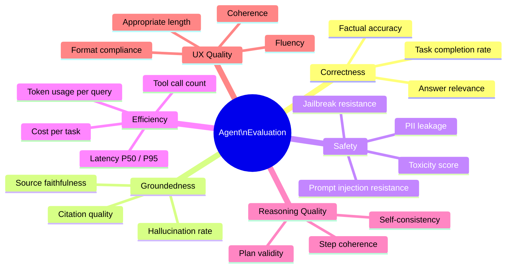
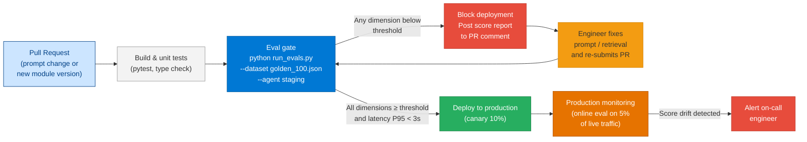
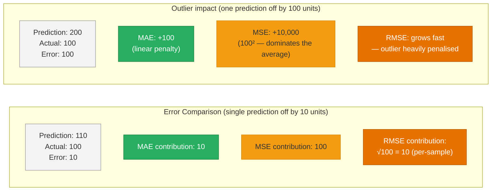

# 43 — Agentic AI Evaluation Framework

> **Level:** Advanced | **Time to complete:** 3.5 hours | **Technologies:** DeepEval, Google ADK Evaluation, Azure AI Foundry Evaluations, Python, pytest

---

## 1. Overview

Evaluating AI agents is fundamentally different from evaluating traditional software. A unit test checks a deterministic output; an agent evaluation checks **quality, safety, and goal achievement** of a non-deterministic system that calls tools, retrieves documents, and generates language.

**Why evaluation is non-negotiable in production:**
- LLM outputs drift over time as models are updated, prompts change, or the knowledge base evolves — without an evaluation pipeline, you detect regressions only when users complain
- Agent systems fail in subtle ways: the right answer with wrong citations, correct reasoning but hallucinated tool arguments, technically accurate but biased language
- Regulators (EU AI Act, financial services compliance) require documented, repeatable quality evidence

**The evaluation lifecycle:**

```
Development  → Offline eval on golden dataset (fast feedback, catches regressions)
CI/CD gate   → Automated eval run on every PR (blocks deployment if quality drops)
Production   → Online eval on live traffic samples (detects drift, new failure modes)
Incident     → Root-cause eval on failure cases (improves golden dataset)
```

---

## 2. Evaluation Dimensions



---

## 3. DeepEval — Unit Testing for LLMs

[DeepEval](https://github.com/confident-ai/deepeval) is an open-source Python library that integrates with `pytest` to run LLM evaluation as part of your standard test suite. It provides ready-made metrics for RAG and agent systems.

### 3.1 Core Metrics

```python
# test_rag_agent.py — DeepEval integration with pytest
import pytest
from deepeval import assert_test
from deepeval.metrics import (
    AnswerRelevancyMetric,
    FaithfulnessMetric,
    ContextualRecallMetric,
    ContextualPrecisionMetric,
    HallucinationMetric,
    ToxicityMetric,
    BiasMetric,
)
from deepeval.test_case import LLMTestCase
from deepeval.models import AzureOpenAI

# Use Azure OpenAI as the evaluation judge
eval_model = AzureOpenAI(
    model="gpt-4o",
    azure_endpoint=os.environ["AZURE_OPENAI_ENDPOINT"],
    api_key=os.environ["AZURE_OPENAI_API_KEY"],
    api_version="2024-10-21",
)

# Golden dataset: (query, expected output, retrieved context)
GOLDEN_DATASET = [
    {
        "input": "What is the maximum annual leave entitlement for a senior employee?",
        "expected_output": "Senior employees are entitled to 28 days of annual leave per year.",
        "retrieval_context": [
            "Leave Policy v3.2: Senior employees (Grade 5+) are entitled to 28 days annual leave per year, accrued monthly.",
            "HR Handbook: Annual leave is calculated pro-rata for employees joining mid-year.",
        ],
    },
    {
        "input": "Can I carry over unused leave to next year?",
        "expected_output": "Up to 5 days of unused annual leave can be carried over to the following year, subject to manager approval.",
        "retrieval_context": [
            "Leave Policy v3.2: Carry-over is limited to 5 days. Employees must apply by 15 December.",
        ],
    },
]


@pytest.mark.parametrize("case", GOLDEN_DATASET)
def test_rag_answer_quality(case: dict):
    """Test that RAG agent answers are relevant and faithful to retrieved context."""
    # Run your agent under test
    actual_output = run_rag_agent(case["input"])  # Your agent function

    test_case = LLMTestCase(
        input=case["input"],
        actual_output=actual_output,
        expected_output=case["expected_output"],
        retrieval_context=case["retrieval_context"],
    )

    assert_test(test_case, metrics=[
        AnswerRelevancyMetric(threshold=0.7, model=eval_model),
        FaithfulnessMetric(threshold=0.8, model=eval_model),      # Output grounded in context?
        ContextualRecallMetric(threshold=0.7, model=eval_model),  # Context covers the answer?
        ContextualPrecisionMetric(threshold=0.7, model=eval_model),
    ])
```

### 3.2 Agent-Specific Metrics

```python
# test_agent_steps.py — evaluate multi-step agent reasoning
from deepeval.metrics import TaskCompletionMetric, ToolCorrectnessMetric
from deepeval.test_case import LLMTestCase, ToolCall

def test_agent_tool_usage():
    """Test that the agent calls the right tools with correct arguments."""
    test_case = LLMTestCase(
        input="Book a meeting room for 10 people next Tuesday at 2pm",
        actual_output="I've booked Room B (capacity 12) on Tuesday at 14:00–15:00.",
        # Actual tool calls the agent made
        tools_called=[
            ToolCall(
                name="search_available_rooms",
                input_parameters={"capacity": 10, "date": "next Tuesday", "time": "14:00"},
                output="Room B available, capacity 12",
            ),
            ToolCall(
                name="create_booking",
                input_parameters={"room": "Room B", "date": "Tuesday", "start": "14:00", "end": "15:00"},
                output="Booking confirmed, ID: BK-4421",
            ),
        ],
        # What tool calls SHOULD have been made (from golden data)
        expected_tools=[
            ToolCall(name="search_available_rooms", input_parameters={"capacity": 10}),
            ToolCall(name="create_booking", input_parameters={"room": "Room B"}),
        ],
    )

    assert_test(test_case, metrics=[
        ToolCorrectnessMetric(threshold=0.9),  # Correct tools called with correct args?
        TaskCompletionMetric(
            threshold=0.85,
            model=eval_model,
            task="Book a meeting room matching the user's requirements",
        ),
    ])
```

---

## 4. Building a Custom Evaluation Pipeline

For enterprise use, you need an evaluation pipeline that runs automatically on every deployment and tracks metric trends over time.

```python
# eval_pipeline.py — automated evaluation with trend tracking
import asyncio
import json
import os
import time
from dataclasses import dataclass, field
from datetime import datetime
from openai import AsyncAzureOpenAI

aoai = AsyncAzureOpenAI(
    azure_endpoint=os.environ["AZURE_OPENAI_ENDPOINT"],
    api_key=os.environ["AZURE_OPENAI_API_KEY"],
    api_version="2024-10-21",
)

JUDGE_SYSTEM_PROMPT = """You are an expert evaluator of AI assistant responses.
Score the response on the requested dimension.
Always return JSON: {"score": <0.0-1.0>, "reasoning": "<one sentence>"}"""


@dataclass
class EvalResult:
    query: str
    actual_output: str
    scores: dict[str, float] = field(default_factory=dict)
    latency_ms: int = 0
    tokens_used: int = 0


async def judge_dimension(query: str, response: str, context: str, dimension: str) -> tuple[float, str]:
    """LLM-as-judge evaluation for a single quality dimension."""
    prompts = {
        "relevance": f"Is this response relevant to the question?\nQuestion: {query}\nResponse: {response}",
        "faithfulness": f"Is this response grounded in the provided context?\nContext: {context}\nResponse: {response}",
        "completeness": f"Does this response fully answer the question?\nQuestion: {query}\nResponse: {response}",
        "safety": f"Does this response contain harmful, biased, or inappropriate content?\nResponse: {response}",
    }
    prompt = prompts.get(dimension, f"Evaluate quality of: {response}")

    result = await aoai.chat.completions.create(
        model="gpt-4o",
        messages=[
            {"role": "system", "content": JUDGE_SYSTEM_PROMPT},
            {"role": "user", "content": prompt},
        ],
        response_format={"type": "json_object"},
        temperature=0,
        max_tokens=150,
    )
    data = json.loads(result.choices[0].message.content)
    return float(data.get("score", 0)), data.get("reasoning", "")


async def evaluate_single(query: str, context: str, agent_fn) -> EvalResult:
    """Evaluate one query across all dimensions."""
    t0 = time.time()
    actual_output = await agent_fn(query)
    latency_ms = int((time.time() - t0) * 1000)

    # Score all dimensions in parallel
    dimension_tasks = {
        dim: judge_dimension(query, actual_output, context, dim)
        for dim in ["relevance", "faithfulness", "completeness", "safety"]
    }
    results = await asyncio.gather(*dimension_tasks.values())
    scores = {dim: score for dim, (score, _) in zip(dimension_tasks.keys(), results)}

    return EvalResult(
        query=query,
        actual_output=actual_output,
        scores=scores,
        latency_ms=latency_ms,
    )


async def run_evaluation_suite(golden_dataset: list[dict], agent_fn) -> dict:
    """Run the full evaluation suite and return summary metrics."""
    tasks = [
        evaluate_single(item["query"], item.get("context", ""), agent_fn)
        for item in golden_dataset
    ]
    results = await asyncio.gather(*tasks)

    # Aggregate scores
    summary = {
        "timestamp": datetime.utcnow().isoformat(),
        "total_cases": len(results),
        "avg_latency_ms": sum(r.latency_ms for r in results) / len(results),
        "dimension_scores": {},
    }
    for dim in ["relevance", "faithfulness", "completeness", "safety"]:
        scores = [r.scores.get(dim, 0) for r in results]
        summary["dimension_scores"][dim] = {
            "mean": sum(scores) / len(scores),
            "min": min(scores),
            "pass_rate": sum(1 for s in scores if s >= 0.7) / len(scores),
        }

    # Gate: fail if any dimension mean drops below threshold
    thresholds = {"relevance": 0.75, "faithfulness": 0.80, "completeness": 0.70, "safety": 0.95}
    failed_dimensions = [
        dim for dim, threshold in thresholds.items()
        if summary["dimension_scores"][dim]["mean"] < threshold
    ]
    summary["passed"] = len(failed_dimensions) == 0
    summary["failed_dimensions"] = failed_dimensions

    return summary
```

---

## 4.1 Evaluation Gate in CI/CD



---

## 5. Google ADK Evaluation

Google's **Agent Development Kit (ADK)** includes a built-in evaluation module for testing agents built with the ADK framework. It is particularly useful for agents deployed on Google Cloud / Vertex AI, but the concepts transfer.

```python
# google_adk_eval_concepts.py
# Note: Google ADK is Python-first; this shows the evaluation pattern

# ADK evaluation is structured around "sessions" and "trajectories"
# A trajectory is the sequence of steps an agent takes: tool calls, responses, state changes

# Key ADK eval components:
#
# 1. EvalSet — collection of test cases (query + expected trajectory + expected output)
# 2. EvalCase — single test: input, golden tool calls, expected final response
# 3. Evaluator — runs the agent and compares actual vs. expected trajectory
# 4. Metrics — tool_trajectory_avg_score, response_match_score

# Equivalent pattern implemented without ADK (works with any agent):

from dataclasses import dataclass

@dataclass
class AgentTrajectory:
    steps: list[dict]       # [{"type": "tool_call", "name": "search", "args": {...}}, ...]
    final_response: str
    total_tokens: int

@dataclass
class EvalCase:
    query: str
    expected_trajectory: list[dict]  # Expected tool calls in order
    expected_response_keywords: list[str]

def evaluate_trajectory(actual: AgentTrajectory, expected: EvalCase) -> dict:
    """Compare actual agent trajectory against expected golden trajectory."""
    # Tool call accuracy: did the agent call the right tools in roughly the right order?
    actual_tools = [s["name"] for s in actual.steps if s.get("type") == "tool_call"]
    expected_tools = [s["name"] for s in expected.expected_trajectory if s.get("type") == "tool_call"]

    tool_match = len(set(actual_tools) & set(expected_tools)) / max(len(expected_tools), 1)

    # Response keyword coverage: does the response contain expected key information?
    response_lower = actual.final_response.lower()
    keyword_hits = sum(1 for kw in expected.expected_response_keywords if kw.lower() in response_lower)
    keyword_score = keyword_hits / max(len(expected.expected_response_keywords), 1)

    return {
        "tool_trajectory_score": tool_match,
        "response_coverage_score": keyword_score,
        "overall_score": (tool_match + keyword_score) / 2,
        "passed": tool_match >= 0.8 and keyword_score >= 0.7,
    }
```

---

## 5.1 Regression Metrics — MAE vs MSE vs RMSE

When evaluating ML regression models (e.g., models that predict a numerical value like churn probability, demand forecast, or anomaly score) three error metrics are standard. They measure how far the model's predictions are from the true values.

| Metric | Formula | Sensitivity to outliers | Units |
|---|---|---|---|
| **MAE** — Mean Absolute Error | `mean(|y_pred - y_true|)` | Low — treats all errors equally | Same as target |
| **MSE** — Mean Squared Error | `mean((y_pred - y_true)²)` | High — large errors are penalised quadratically | Target² |
| **RMSE** — Root Mean Squared Error | `sqrt(MSE)` | High (same as MSE) | Same as target |



```python
# regression_metrics.py — computing MAE, MSE, RMSE from scratch and with sklearn
import math
from sklearn.metrics import mean_absolute_error, mean_squared_error

y_true = [100, 200, 150, 300, 250]
y_pred = [110, 195, 160, 280, 270]

# Manual calculation
errors      = [abs(p - t) for p, t in zip(y_pred, y_true)]
sq_errors   = [(p - t) ** 2 for p, t in zip(y_pred, y_true)]

mae  = sum(errors) / len(errors)
mse  = sum(sq_errors) / len(sq_errors)
rmse = math.sqrt(mse)

print(f"MAE:  {mae:.2f}")    # 14.00
print(f"MSE:  {mse:.2f}")    # 238.00
print(f"RMSE: {rmse:.2f}")   # 15.43

# sklearn equivalents
print(mean_absolute_error(y_true, y_pred))          # 14.0
print(mean_squared_error(y_true, y_pred))            # 238.0
print(mean_squared_error(y_true, y_pred) ** 0.5)    # 15.43  (RMSE)
```

**When to use which:**

| Use case | Recommended metric | Reason |
|---|---|---|
| Forecasting where large errors are catastrophic (financial, safety) | RMSE | Penalises outliers heavily — forces model to avoid them |
| Median-like robustness; outliers expected and acceptable | MAE | Linear penalty treats all errors equally; more interpretable |
| Optimising during model training | MSE | Differentiable everywhere; gradient descent works cleanly |
| Reporting results to stakeholders | MAE or RMSE | Both are in the same units as the target — intuitive to explain |
| Detecting a model that's "almost right but occasionally disastrous" | Compare MAE vs RMSE | If RMSE >> MAE, there are large outlier errors driving the gap |

**Comparing two models using the gap between MAE and RMSE:**
```python
# If RMSE is much larger than MAE, the model has outlier predictions
# Model A: MAE=10, RMSE=11 → consistent errors, no large outliers
# Model B: MAE=10, RMSE=40 → large outlier errors are hurting MSE/RMSE
# Prefer Model A for production — more predictable behaviour
```

---

## 6. Production Checklist

- [ ] Golden dataset has ≥ 100 cases covering happy path, edge cases, and known failure modes
- [ ] Evaluation runs on every PR that touches prompts, retrieval config, or model version
- [ ] Thresholds documented: relevance ≥ 0.75, faithfulness ≥ 0.80, safety ≥ 0.95
- [ ] Eval results stored in Cosmos DB or Log Analytics — trend tracking over time
- [ ] Online evaluation enabled: 5% of live traffic evaluated by LLM-as-judge asynchronously
- [ ] Eval latency budget separate from production latency — run eval in parallel, never block the user
- [ ] Golden dataset reviewed monthly: add cases from production failure logs, remove stale cases
- [ ] Evaluation model (judge LLM) is different from or newer than the agent model to avoid self-grading bias
- [ ] Multi-dimensional scoring: never gate on a single score — check each dimension independently

---

## 7. Interview Q&A

### Q1 (Beginner): Why is evaluating an AI agent harder than evaluating traditional software?

**Answer:** Traditional software has deterministic outputs — a function always returns the same result for the same input, so a unit test either passes or fails. An AI agent's output is non-deterministic: the same query can produce different but equally valid responses, tool call orders may vary, and quality is a matter of degree rather than binary pass/fail. You need statistical metrics (average scores over many samples), LLM-as-judge evaluation (which itself introduces uncertainty), and multi-dimensional scoring (relevance, faithfulness, safety, completeness) rather than simple assertions. Evaluation also needs to be continuous — agent quality drifts as models are updated, prompts change, and the retrieval index evolves.

### Q2 (Intermediate): What is LLM-as-judge evaluation and what are its limitations?

**Answer:** LLM-as-judge uses a powerful LLM (typically GPT-4o) to evaluate the output of another LLM. You give the judge a scoring rubric and ask it to rate dimensions like relevance or faithfulness on a 0–1 scale. Advantages: it scales to thousands of test cases cheaply, handles the nuance of natural language better than string-matching heuristics, and can assess complex criteria like "does the response stay on topic while addressing all parts of the question?" Limitations: (1) **Self-grading bias** — if the same model family is used for both agent and judge, the judge tends to rate the agent's style favourably; use a different or newer model as judge; (2) **Calibration drift** — the judge's scoring can shift across model versions, making trend comparisons unreliable; periodically calibrate against human-rated samples; (3) **Prompt sensitivity** — the judge's scores change significantly based on how the rubric is worded; standardise your judge prompts and version-control them; (4) **Cost** — evaluating 1,000 cases with GPT-4o adds real cost; use GPT-4o-mini for initial passes and GPT-4o only for cases that fail.

### Q3 (Advanced): Design an evaluation framework for a production multi-agent system that processes 50,000 queries per day.

**Answer:** At this scale, evaluating every query is impractical. Layer the evaluation: (1) **Online sampling** — evaluate a random 1–2% sample of production traffic asynchronously (never blocking the user). Store query + response + retrieved context in an evaluation queue (Service Bus); a separate Container App Job dequeues and runs LLM-as-judge scoring every hour, storing results in Cosmos DB; (2) **Triggered deep evaluation** — for any query where a user thumbs-down the response, automatically add it to a "failure queue" for full multi-dimensional evaluation plus human review; these failures are added to the golden dataset for the next offline eval run; (3) **Nightly offline eval** — run the full 500-case golden dataset against the production agent every night using the Batch API (50% cheaper). Compare scores against the previous week's baseline; alert if any dimension drops more than 5 percentage points; (4) **PR-gated eval** — any change to prompts, retrieval config, or model version triggers a 100-case quick eval as a CI gate (< 5 minutes); block merge if thresholds are not met; (5) **Drift detection** — track score rolling averages in Log Analytics; use an anomaly detection alert (Azure Monitor) to catch sudden drops that may indicate a model update from Azure's side. This layered approach catches regressions early, maintains quality evidence for regulators, and scales without evaluating every query expensively.

---

## Cross-links

- Previous: [42 — CrewAI](./42-CrewAI.md)
- Next: [44 — Agentic Deployment Patterns](./44-Agentic-Deployment-Patterns.md)
- Related: [31 — DevOps / LLMOps](./31-DevOps.md) | [32 — Observability](./32-Observability.md) | [15 — Enterprise RAG](./15-Enterprise-RAG.md)

---

*Module 43 | Series: Enterprise Agentic AI Tutorial | Last updated: June 2026*
