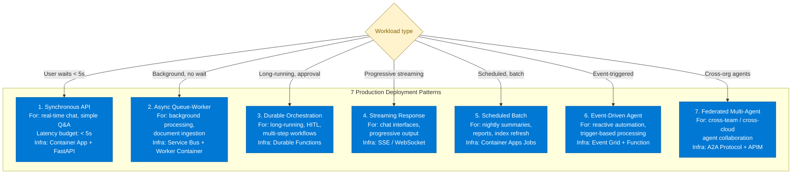
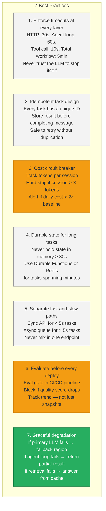
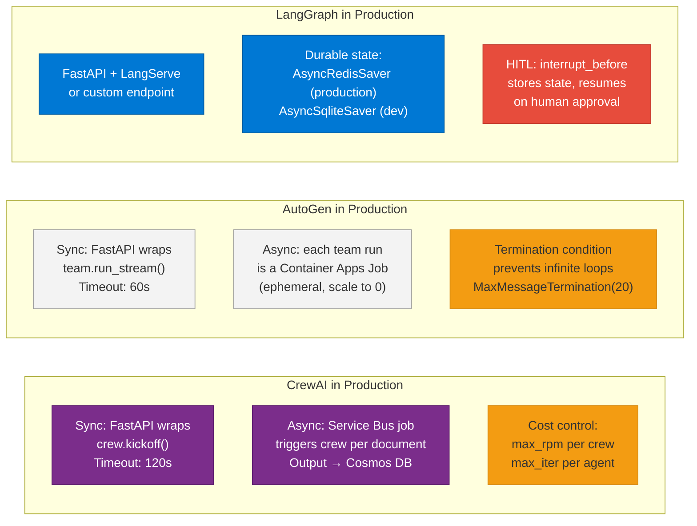

# 44 — Agentic AI Deployment Patterns

> **Level:** Advanced | **Time to complete:** 3.5 hours | **Technologies:** Azure Container Apps, Azure Durable Functions, Docker, GitHub Actions, Azure Service Bus, Kubernetes

---

## 1. Overview

Deploying a single LLM call is simple. Deploying a **production multi-agent system** — one that handles concurrent users, recovers from failures, scales cost-effectively, and maintains quality over time — requires deliberate architectural choices that differ significantly from deploying a standard microservice.

Key challenges specific to agentic AI deployment:
- **Non-determinism** — the same input can trigger different tool call sequences and response times
- **Variable latency** — a simple query completes in 2 seconds; a multi-step research task takes 3 minutes
- **Cost volatility** — a misbehaving agent can consume 100× expected tokens before the next billing cycle
- **Statefulness** — agent workflows often span minutes or hours, requiring durable state across infrastructure events
- **Cascading tool failures** — one failed tool call can stall an entire workflow if not designed for partial failure

This module covers the seven most important deployment patterns for production agentic AI systems, with implementation guidance for each.

---

## 2. Deployment Pattern Overview



---

## 3. Pattern 1 — Synchronous API Agent

The simplest deployment: a FastAPI container that receives a request, runs the agent, and returns the result.

```python
# sync_agent_api.py — production synchronous agent endpoint
import asyncio
import os
import time
import uuid
import logging
from contextlib import asynccontextmanager
from fastapi import FastAPI, HTTPException, Request
from fastapi.responses import JSONResponse
from pydantic import BaseModel
from openai import AsyncAzureOpenAI
from azure.identity.aio import DefaultAzureCredential

logger = logging.getLogger(__name__)

# ── Shared resources initialised at startup ────────────────────────────────────

@asynccontextmanager
async def lifespan(app: FastAPI):
    app.state.credential = DefaultAzureCredential()
    app.state.aoai = AsyncAzureOpenAI(
        azure_endpoint=os.environ["AZURE_OPENAI_ENDPOINT"],
        azure_ad_token_provider=lambda: app.state.credential.get_token(
            "https://cognitiveservices.azure.com/.default"
        ).token,
        api_version="2024-10-21",
    )
    logger.info("Agent API started")
    yield
    await app.state.credential.close()
    logger.info("Agent API shut down")

app = FastAPI(title="Agent API", lifespan=lifespan)


class AgentRequest(BaseModel):
    query: str
    session_id: str | None = None
    user_id: str


class AgentResponse(BaseModel):
    request_id: str
    answer: str
    sources: list[str]
    latency_ms: int
    tokens_used: int


@app.post("/agent/query", response_model=AgentResponse)
async def query_agent(req: AgentRequest, request: Request):
    request_id = str(uuid.uuid4())
    start = time.time()

    # Enforce per-request timeout — prevent runaway agent from blocking the thread
    try:
        result = await asyncio.wait_for(
            run_rag_agent(req.query, req.user_id, request.app.state.aoai),
            timeout=30.0,   # Hard 30s timeout — adjust per SLA
        )
    except asyncio.TimeoutError:
        logger.error("Agent timeout", extra={"request_id": request_id, "query": req.query[:100]})
        raise HTTPException(status_code=504, detail="Agent response timed out. Please retry.")

    latency_ms = int((time.time() - start) * 1000)
    logger.info(
        "Agent query completed",
        extra={"request_id": request_id, "latency_ms": latency_ms, "user_id": req.user_id},
    )

    return AgentResponse(
        request_id=request_id,
        answer=result["answer"],
        sources=result["sources"],
        latency_ms=latency_ms,
        tokens_used=result["tokens"],
    )


@app.get("/health")
async def health():
    return {"status": "healthy"}
```

---

## 4. Pattern 2 — Async Queue-Worker

For workloads where the user does not wait for a result (document ingestion, report generation), use a **Service Bus queue** with a worker container.

```python
# queue_worker.py — Service Bus consumer for async agent tasks
import asyncio
import json
import logging
import os
from azure.servicebus.aio import ServiceBusClient
from azure.identity.aio import DefaultAzureCredential

logger = logging.getLogger(__name__)

QUEUE_NAME    = os.environ["SERVICE_BUS_QUEUE"]
MAX_WORKERS   = int(os.environ.get("MAX_CONCURRENT_TASKS", "5"))  # Cap parallelism

async def process_task(task_payload: dict) -> None:
    """Process a single agent task from the queue."""
    task_id   = task_payload["task_id"]
    task_type = task_payload["task_type"]
    logger.info("Processing task", extra={"task_id": task_id, "type": task_type})

    try:
        if task_type == "document_summary":
            result = await summarise_document(task_payload["document_url"])
        elif task_type == "research_report":
            result = await run_research_agent(task_payload["topic"])
        else:
            raise ValueError(f"Unknown task type: {task_type}")

        await store_result(task_id, result)
        logger.info("Task completed", extra={"task_id": task_id})

    except Exception as exc:
        logger.error("Task failed", extra={"task_id": task_id, "error": str(exc)})
        raise  # Service Bus will dead-letter after max_delivery_count


async def run_worker() -> None:
    """Long-running worker: pulls from Service Bus, processes with bounded concurrency."""
    credential = DefaultAzureCredential()
    semaphore  = asyncio.Semaphore(MAX_WORKERS)

    async with ServiceBusClient(
        os.environ["SERVICE_BUS_NAMESPACE"],
        credential=credential,
    ) as sb_client:
        async with sb_client.get_queue_receiver(
            queue_name=QUEUE_NAME,
            max_wait_time=5,
            prefetch_count=MAX_WORKERS,
        ) as receiver:
            logger.info("Worker started, listening on queue: %s", QUEUE_NAME)

            async for message in receiver:
                payload = json.loads(str(message))

                async def handle(msg=message, pay=payload):
                    async with semaphore:
                        try:
                            await process_task(pay)
                            await receiver.complete_message(msg)
                        except Exception:
                            await receiver.abandon_message(msg)  # Returns to queue for retry

                asyncio.create_task(handle())


if __name__ == "__main__":
    asyncio.run(run_worker())
```

---

## 5. The 7 Best Practices for Production Agent Deployment



### 5.1 Best Practice 3 — Cost Circuit Breaker

```python
# cost_circuit_breaker.py
import asyncio
import os
from redis.asyncio import Redis

redis = Redis.from_url(os.environ["REDIS_URL"])

# Cost thresholds
SESSION_TOKEN_LIMIT  = 50_000     # Hard stop per user session
DAILY_COST_LIMIT_USD = 500.0      # Alert threshold per day
GPT4O_COST_PER_1M_INPUT  = 5.0
GPT4O_COST_PER_1M_OUTPUT = 15.0


async def check_and_record_tokens(
    session_id: str,
    prompt_tokens: int,
    completion_tokens: int,
) -> None:
    """Record token usage and raise if session limit exceeded."""
    session_key = f"tokens:session:{session_id}"
    total_this_call = prompt_tokens + completion_tokens

    # Atomic increment in Redis
    new_total = await redis.incrby(session_key, total_this_call)
    await redis.expire(session_key, 3600)  # Session expires after 1 hour of inactivity

    if new_total > SESSION_TOKEN_LIMIT:
        raise RuntimeError(
            f"Session token limit exceeded: {new_total} > {SESSION_TOKEN_LIMIT}. "
            "Start a new session or contact support."
        )

    # Estimate cost for this session
    estimated_cost = (
        prompt_tokens     / 1_000_000 * GPT4O_COST_PER_1M_INPUT +
        completion_tokens / 1_000_000 * GPT4O_COST_PER_1M_OUTPUT
    )
    await redis.incrbyfloat(f"cost:daily:{_today()}", estimated_cost)


def _today() -> str:
    from datetime import date
    return date.today().isoformat()
```

### 5.2 Best Practice 7 — Graceful Degradation

```python
# graceful_degradation.py
import asyncio
import logging
from enum import Enum

logger = logging.getLogger(__name__)


class DegradationLevel(Enum):
    FULL      = "full"       # All capabilities available
    DEGRADED  = "degraded"   # Fallback region, no streaming
    MINIMAL   = "minimal"    # Cache-only, no LLM calls
    DOWN      = "down"       # Return maintenance message


async def resilient_agent_query(query: str, user_id: str) -> dict:
    """Agent query with layered fallback."""
    # Attempt 1: Primary region, full RAG
    try:
        return await full_rag_agent(query, user_id, region="primary")
    except Exception as primary_error:
        logger.warning("Primary agent failed, trying fallback region", extra={"error": str(primary_error)})

    # Attempt 2: Fallback region, simplified RAG (no reranker)
    try:
        return await full_rag_agent(query, user_id, region="secondary")
    except Exception as secondary_error:
        logger.warning("Secondary agent failed, trying semantic cache", extra={"error": str(secondary_error)})

    # Attempt 3: Semantic cache hit only — no LLM call
    try:
        cached = await get_semantic_cache_hit(query, similarity_threshold=0.85)
        if cached:
            return {**cached, "degraded": True, "source": "cache"}
    except Exception:
        pass

    # Final fallback: static response
    logger.error("All fallback layers exhausted for query", extra={"user_id": user_id})
    return {
        "answer": (
            "I'm unable to process your request right now due to a temporary system issue. "
            "Please try again in a few minutes or contact support."
        ),
        "sources": [],
        "degraded": True,
        "source": "static_fallback",
    }
```

---

## 6. Deploying Multi-Agent Systems: Framework Comparison



---

## 7. Production Checklist

- [ ] Every agent endpoint has a hard HTTP timeout and an inner agent-loop timeout (both configured independently)
- [ ] All async tasks are idempotent — safe to deliver more than once (Service Bus `deduplication_id` set)
- [ ] Session token budget enforced in Redis — prevents runaway cost from misbehaving clients
- [ ] Graceful degradation chain implemented: primary → secondary region → cache → static message
- [ ] Sync and async paths separated — no single endpoint that sometimes takes 2s and sometimes 3 minutes
- [ ] Evaluation gate in CI/CD — deployment blocked if eval score drops below baseline
- [ ] Agent version pinned in deployment: container image SHA, not `latest`; model deployment version, not `auto`
- [ ] Dead-letter queue monitored: alert if DLQ depth > 10 (indicates systematic processing failure)
- [ ] Multi-agent system has a total workflow timeout (5–30 minutes) — not just per-step timeout
- [ ] Cost monitoring: alert if daily LLM spend exceeds 2× 7-day rolling average

---

## 8. Interview Q&A

### Q1 (Beginner): What is the difference between synchronous and asynchronous agent deployment?

**Answer:** A synchronous agent deployment processes the request immediately and holds the HTTP connection open until the result is ready — the user waits. This works for queries that complete in under 5–10 seconds (simple Q&A, retrieval-augmented responses). An asynchronous deployment accepts the request, queues it on a message bus (Service Bus, RabbitMQ), returns a `202 Accepted` with a `request_id`, and processes it in the background. The user polls or gets a webhook when done. Async is necessary for multi-step agent tasks that take minutes, document processing pipelines, and any batch workload. Using sync for a 3-minute agent task causes HTTP timeouts, exhausts connection pools, and delivers poor UX.

### Q2 (Intermediate): How do you prevent an agent from consuming unbounded tokens and cost in production?

**Answer:** Multiple overlapping controls: (1) **Agent loop limits** — set `max_iterations` on the agent (LangGraph step count, AutoGen `MaxMessageTermination`, CrewAI `max_iter`); (2) **Per-request timeout** — wrap the agent call in `asyncio.wait_for()` with a 30–60 second timeout; the process is killed if the agent hangs; (3) **Session token budget** — track cumulative tokens per user session in Redis; raise an error and stop the agent if the session exceeds a threshold (e.g., 50K tokens); (4) **Daily cost circuit breaker** — monitor Azure OpenAI's token metrics via Azure Monitor; trigger an alert (and optionally throttle new requests) if daily spend exceeds 2× baseline; (5) **Model routing** — route simpler steps to GPT-4o-mini (33× cheaper) so that only the final synthesis step uses GPT-4o.

### Q3 (Advanced): Design the deployment architecture for a multi-agent document processing system that needs to handle 10,000 documents per day with human review for high-risk extractions.

**Answer:** Use a hybrid async + durable pattern. Ingest layer: documents land in Azure Blob Storage; an Event Grid trigger fires a Container App Job per document. The job runs a LangGraph agent that classifies the document (risk score) and extracts structured data using GPT-4o with a Pydantic schema. Low-risk documents (score < 0.3): the extraction result is written directly to Cosmos DB and the job completes — fully automated, throughput of ~500 docs/hour per Container App Job scale-out. High-risk documents (score ≥ 0.3): the LangGraph graph hits an `interrupt_before=["human_review"]` node; the current state (extracted data + document reference) is saved to a Redis checkpointer; a notification is sent to the human review portal (Teams Adaptive Card via Logic Apps). The human reviewer sees the extracted data and either approves, edits, or rejects. Their action calls a webhook that resumes the LangGraph graph from the checkpoint. Final state (approved extraction) is written to Cosmos DB with the reviewer's ID in the audit trail. Cost estimate: at 10,000 docs/day with average 2,000 tokens/doc at GPT-4o-mini pricing for classification + GPT-4o for high-risk extraction (30%), total LLM cost ≈ $150/day. Scale: Container Apps Jobs auto-scale to handle peak ingestion bursts; Redis checkpointer holds up to 10,000 in-flight states concurrently.

---

## Cross-links

- Previous: [43 — Agentic Evaluation](./43-Agentic-Evaluation.md)
- Next: [Appendix](./Appendix.md)
- Related: [29 — Deployment](./29-Deployment.md) | [23 — Workflow Automation](./23-Workflow-Automation.md) | [25 — System Design](./25-System-Design.md) | [07 — LangGraph](./07-LangGraph.md)

---

*Module 44 | Series: Enterprise Agentic AI Tutorial | Last updated: June 2026*
