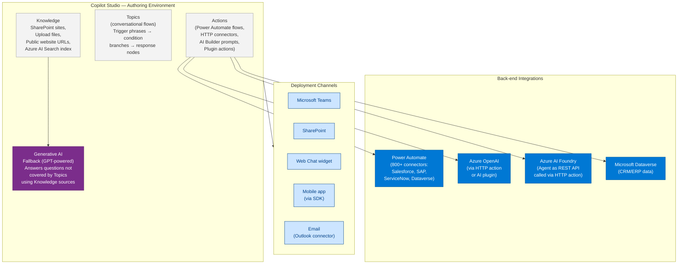
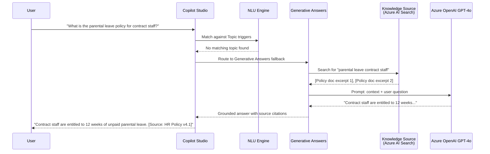
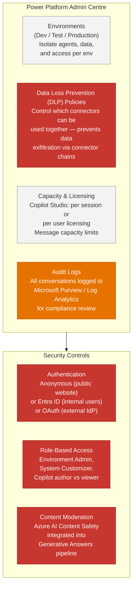
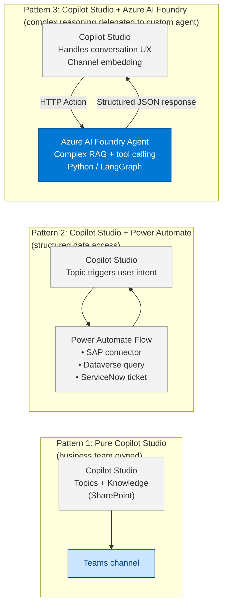

# 45 — Microsoft Copilot Studio

> **Level:** Intermediate | **Time to complete:** 3 hours | **Technologies:** Microsoft Copilot Studio, Power Platform, Azure AI Foundry, Azure OpenAI, Power Automate

---

## 1. Overview

Microsoft Copilot Studio (formerly Power Virtual Agents) is a **low-code/no-code platform** for building, testing, deploying, and managing AI-powered copilots and conversational agents. It is the primary route for non-developer teams to build AI agents in the Microsoft ecosystem without writing Python or orchestration code.

**Where it sits in the Microsoft AI stack:**

```
Azure OpenAI (raw model API)
      ↓
Azure AI Foundry (developer platform: agents, evaluation, fine-tuning)
      ↓
Copilot Studio (low-code builder: topics, actions, connectors, channels)
      ↓
Microsoft 365 Copilot (end-user productivity experience)
```

**Why architects need to know Copilot Studio:**
- Most enterprise AI rollouts for non-engineering teams (HR, Finance, Customer Service) will use Copilot Studio, not custom code
- Copilot Studio copilots can call Azure AI Foundry agents as back-end actions — the two platforms are complementary, not competing
- Governance, data loss prevention (DLP), and security policies apply through Power Platform admin centre — architects own those policies
- It is frequently featured in Azure AI Architect interview questions

**When to use Copilot Studio (vs custom code):**

| Scenario | Use Copilot Studio | Use Custom Code (Azure AI Foundry) |
|---|---|---|
| Business team builds and owns the agent | ✅ | ❌ |
| Needs to embed in Teams, SharePoint, or website widget | ✅ | Possible but more work |
| Complex stateful reasoning or multi-step LLM chains | ❌ | ✅ |
| Needs custom RAG with private vector search | Partial (via custom connector) | ✅ |
| Deep Azure SDK integration | ❌ | ✅ |
| Time to first agent: hours not weeks | ✅ | ❌ |

---

## 2. Core Architecture



---

## 3. Building a Copilot — Key Concepts

### 3.1 Topics

A **Topic** is the basic conversational unit. It consists of:
- **Trigger phrases** — example utterances that activate the topic (Copilot Studio uses NLU to match)
- **Nodes** — a visual flow: Send a Message, Ask a Question, Condition, Call an Action, Go to Another Topic
- **Variables** — typed data slots captured during conversation (`{user_name}`, `{policy_number}`)

```
Example HR Leave Policy Topic:

Trigger phrases:
  "How many days of leave do I have?"
  "What is my annual leave entitlement?"
  "Can I take a day off?"

Flow:
  [Ask Question] "Which department are you in?" → save to {department}
  [Condition] {department} == "Engineering"
    → [Send Message] "Engineering staff get 25 days annual leave."
  [Else]
    → [Call Action] "Get Leave Balance" (Power Automate flow → Workday API)
    → [Send Message] "Your current leave balance is {leave_balance} days."
  [End of conversation] Prompt for satisfaction rating
```

### 3.2 Generative AI Answers (RAG in Copilot Studio)

When a user's query does not match any Topic trigger, Copilot Studio's **Generative Answers** feature kicks in — it searches the configured **Knowledge** sources and generates a grounded answer using GPT.

**Knowledge sources supported:**
- SharePoint sites and document libraries (indexed automatically)
- Uploaded files (PDF, Word, PowerPoint)
- Public websites (crawled by Bing)
- Azure AI Search custom index (best option for enterprise private data)



### 3.3 Calling Azure AI Foundry Agents as Actions

For complex reasoning that exceeds Copilot Studio's built-in capabilities, call a custom Azure AI Foundry agent via an HTTP action:

```python
# azure_ai_foundry_agent_endpoint.py
# This FastAPI endpoint is what Copilot Studio calls as an HTTP action

import os
from fastapi import FastAPI
from pydantic import BaseModel
from azure.ai.projects import AIProjectClient
from azure.identity import DefaultAzureCredential

app = FastAPI()

project_client = AIProjectClient(
    subscription_id=os.environ["AZURE_SUBSCRIPTION_ID"],
    resource_group_name=os.environ["AZURE_RESOURCE_GROUP"],
    project_name=os.environ["AZURE_AI_PROJECT_NAME"],
    credential=DefaultAzureCredential(),
)


class CopilotActionRequest(BaseModel):
    user_query: str
    employee_id: str
    conversation_history: list[dict] = []


class CopilotActionResponse(BaseModel):
    answer: str
    sources: list[str]
    confidence: str          # "high" | "medium" | "low"


@app.post("/copilot-action/hr-agent", response_model=CopilotActionResponse)
async def hr_agent_action(req: CopilotActionRequest):
    """
    Called by Copilot Studio HTTP action when complex HR reasoning is needed.
    Copilot Studio passes the user query and conversation history;
    this endpoint runs the full Azure AI Foundry RAG agent and returns a structured response.
    """
    agent = project_client.agents.get_agent(os.environ["AGENT_ID"])
    thread = project_client.agents.create_thread()

    project_client.agents.create_message(
        thread_id=thread.id,
        role="user",
        content=req.user_query,
    )

    run = project_client.agents.create_and_process_run(
        thread_id=thread.id,
        agent_id=agent.id,
    )

    messages = project_client.agents.list_messages(thread_id=thread.id)
    answer = messages.data[0].content[0].text.value
    sources = extract_citations(messages.data[0].content[0].text.annotations)

    return CopilotActionResponse(
        answer=answer,
        sources=sources,
        confidence="high" if sources else "medium",
    )
```

---

## 4. Governance and Administration



**Key governance decisions for enterprise Copilot Studio deployments:**

| Decision | Options | Recommendation |
|---|---|---|
| Environment strategy | Single / per-department / per-use-case | Per-use-case in production — isolates DLP policies |
| Authentication | Anonymous / Entra ID | Always Entra ID for internal copilots |
| Knowledge base | SharePoint / Azure AI Search | Azure AI Search for large, frequently updated corpora |
| Connector permissions | Allow all / allowlist | Allowlist only connectors needed for the use case |
| Conversation logging | Default / Purview | Route to Purview for GDPR data subject request capability |

---

## 5. Integration Patterns



---

## 6. Production Checklist

- [ ] Entra ID authentication configured — anonymous access disabled for internal copilots
- [ ] DLP policy created: block connectors that can exfiltrate data to unapproved destinations
- [ ] Separate environments: Development, Test, Production — with promotion pipeline
- [ ] Azure AI Search used as knowledge source (not raw SharePoint for large corpora) — better relevance and update control
- [ ] Generative Answers content moderation enabled (Azure AI Content Safety)
- [ ] Conversation history logged to Log Analytics or Purview — retention policy aligned with data governance requirements
- [ ] Copilot version control: use Solutions for managing copilot lifecycle across environments
- [ ] HTTP Action endpoints (Azure AI Foundry calls) secured with Managed Identity or client credentials — not API keys
- [ ] Fallback topic configured: graceful message when Generative Answers returns low-confidence result
- [ ] Load tested: Copilot Studio has message throughput limits — validate against expected peak concurrent users

---

## 7. Interview Q&A

### Q1 (Beginner): What is Microsoft Copilot Studio and what is it used for?

**Answer:** Copilot Studio is Microsoft's low-code platform for building AI-powered conversational agents (copilots) without needing to write code. Business teams use it to build Q&A bots, HR assistants, IT helpdesks, and customer service agents that can be deployed directly into Microsoft Teams, SharePoint, websites, or mobile apps. It connects to 800+ enterprise systems via Power Automate connectors and uses Azure OpenAI's GPT models for generative fallback answers when the bot's predefined topics don't cover a question. It is the primary tool for citizen-developer AI adoption in Microsoft-stack enterprises.

### Q2 (Intermediate): How does Copilot Studio's Generative Answers feature work, and what are its limitations?

**Answer:** Generative Answers is Copilot Studio's built-in RAG capability. When a user's message doesn't match a predefined Topic, the platform searches configured Knowledge sources (SharePoint, uploaded files, Azure AI Search, or public URLs), retrieves relevant content, and uses GPT-4o to synthesise an answer. Limitations: (1) **Quality ceiling** — the retrieval and prompt are managed by Microsoft; you cannot tune the chunking, embedding model, or reranking strategy as you can with a custom RAG pipeline; (2) **Knowledge freshness** — SharePoint indexing has a delay; changes don't appear immediately; (3) **Complex reasoning** — multi-step reasoning, tool calling, or structured data retrieval from APIs requires calling out to a Power Automate flow or HTTP action, adding latency; (4) **Citation accuracy** — citations point to source documents but not specific paragraphs, making verification harder for compliance purposes. For high-stakes Q&A, connect Copilot Studio to an Azure AI Foundry agent that provides custom hybrid retrieval with precise citations.

### Q3 (Advanced): How would you architect a hybrid Copilot Studio + Azure AI Foundry solution for a large enterprise with 20,000 employees?

**Answer:** Use a two-layer architecture: Copilot Studio owns the **conversation experience** (UX, channel integration, session management, authentication via Entra ID), and Azure AI Foundry owns the **reasoning and retrieval** (custom RAG with hybrid search, tool calling, evaluation). The split: simple, high-frequency queries (leave balance, IT password reset, standard FAQ) are handled entirely within Copilot Studio Topics connecting to Power Automate flows — no LLM cost, instant response. Complex or ambiguous queries trigger an HTTP Action that calls a FastAPI endpoint wrapping an Azure AI Foundry agent. The Foundry agent runs hybrid retrieval over an Azure AI Search index (with per-user security trimming enforced via Managed Identity), performs multi-step reasoning if needed, and returns a structured JSON response to Copilot Studio. Copilot Studio renders the answer and citations. Governance: all sessions logged to Microsoft Purview; DLP policies prevent connectors from combining HR data with external services; Entra ID Conditional Access policies restrict copilot access to compliant devices. This architecture gives business teams full ownership of the conversational UX while engineering teams maintain quality control over the AI reasoning layer.

---

## Cross-links

- Previous: [44 — Agentic Deployment Patterns](./44-Agentic-Deployment-Patterns.md)
- Next: [46 — Azure AI Speech and Multimodal Services](./46-Azure-AI-Speech-Multimodal.md)
- Related: [03 — Azure AI Foundry](./03-Azure-AI-Foundry.md) | [23 — Workflow Automation](./23-Workflow-Automation.md) | [35 — AI Governance](./35-AI-Governance.md)

---

*Module 45 | Series: Enterprise Agentic AI Tutorial | Last updated: June 2026*
