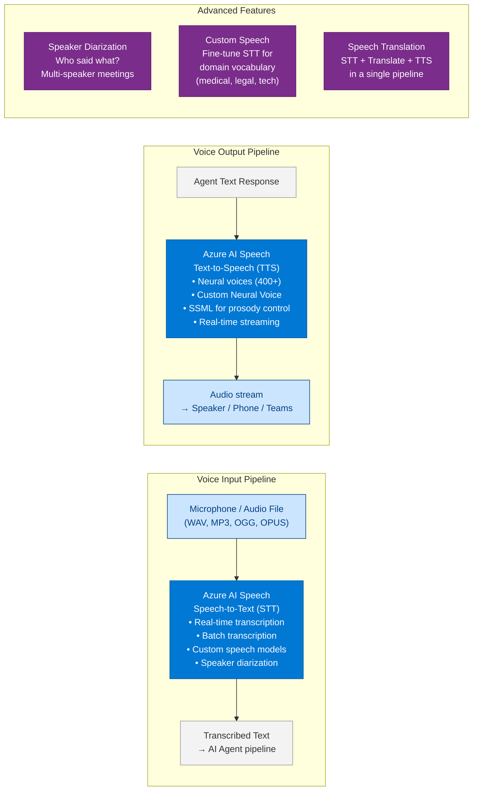
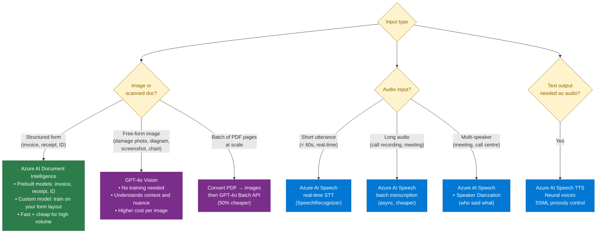

# 46 — Azure AI Speech and Multimodal Services

> **Level:** Intermediate | **Time to complete:** 2.5 hours | **Technologies:** Azure AI Speech, Azure AI Vision, Azure OpenAI (GPT-4o multimodal), Azure AI Translator, Python SDK

---

## 1. Overview

Enterprise AI agents are no longer text-only. Production systems increasingly need to **hear, speak, see, and read** — processing audio, images, and documents alongside text. Azure's multimodal AI services make this possible without building custom models.

**The multimodal AI stack on Azure:**

```
Azure AI Speech       — Speech-to-Text (STT), Text-to-Speech (TTS), Speaker Recognition
Azure AI Vision       — Image analysis, OCR, object detection, spatial analysis
Azure AI Document Intelligence — PDF/form extraction, invoice parsing, receipt reading
Azure AI Translator   — Real-time translation, 100+ languages
Azure OpenAI GPT-4o   — Native multimodal: text + image + audio input in one model call
```

**When multimodal matters:**
- Call centre AI: transcribe customer calls (STT) → run sentiment + intent analysis → respond via TTS
- Document processing: insurance claims with photos → GPT-4o vision extracts damage descriptions
- Accessibility: voice-controlled copilots for users who cannot type
- Global enterprise: real-time translation in multilingual Teams meetings
- Field service: technician photographs equipment → agent identifies fault and retrieves repair procedure

---

## 2. Azure AI Speech Architecture



---

## 3. Speech-to-Text and Text-to-Speech in Python

```python
# speech_pipeline.py — STT + Agent + TTS pipeline
import asyncio
import os
import azure.cognitiveservices.speech as speechsdk
from openai import AsyncAzureOpenAI

# Azure AI Speech configuration
speech_config = speechsdk.SpeechConfig(
    subscription=os.environ["AZURE_SPEECH_KEY"],
    region=os.environ["AZURE_SPEECH_REGION"],
)
speech_config.speech_recognition_language = "en-US"
speech_config.speech_synthesis_voice_name  = "en-US-JennyNeural"   # Natural neural voice

aoai = AsyncAzureOpenAI(
    azure_endpoint=os.environ["AZURE_OPENAI_ENDPOINT"],
    api_key=os.environ["AZURE_OPENAI_API_KEY"],
    api_version="2024-10-21",
)


def speech_to_text_from_microphone() -> str:
    """Capture one utterance from the microphone and return the transcript."""
    audio_config    = speechsdk.AudioConfig(use_default_microphone=True)
    recognizer      = speechsdk.SpeechRecognizer(speech_config=speech_config, audio_config=audio_config)

    print("Listening... speak now.")
    result = recognizer.recognize_once_async().get()

    if result.reason == speechsdk.ResultReason.RecognizedSpeech:
        return result.text
    elif result.reason == speechsdk.ResultReason.NoMatch:
        return ""
    else:
        raise RuntimeError(f"Speech recognition failed: {result.reason}")


def speech_to_text_from_file(audio_file_path: str) -> str:
    """Transcribe an audio file — use for batch/async processing."""
    audio_config = speechsdk.AudioConfig(filename=audio_file_path)
    recognizer   = speechsdk.SpeechRecognizer(speech_config=speech_config, audio_config=audio_config)
    result       = recognizer.recognize_once_async().get()
    return result.text if result.reason == speechsdk.ResultReason.RecognizedSpeech else ""


def text_to_speech(text: str, output_file: str | None = None) -> None:
    """Convert text to speech — plays through speaker or saves to file."""
    if output_file:
        audio_config = speechsdk.AudioConfig(filename=output_file)
    else:
        audio_config = speechsdk.AudioConfig(use_default_speaker=True)

    synthesizer = speechsdk.SpeechSynthesizer(speech_config=speech_config, audio_config=audio_config)

    # SSML for fine-grained prosody control
    ssml = f"""
    <speak version='1.0' xmlns='http://www.w3.org/2001/10/synthesis' xml:lang='en-US'>
        <voice name='en-US-JennyNeural'>
            <prosody rate='0%' pitch='0%'>
                {text}
            </prosody>
        </voice>
    </speak>"""

    result = synthesizer.speak_ssml_async(ssml).get()
    if result.reason != speechsdk.ResultReason.SynthesizingAudioCompleted:
        raise RuntimeError(f"TTS failed: {result.reason}")


async def voice_agent_loop() -> None:
    """Full voice interaction loop: listen → agent → speak."""
    print("Voice agent ready. Say 'exit' to quit.")
    conversation_history: list[dict] = []

    while True:
        user_text = speech_to_text_from_microphone()
        if not user_text:
            continue
        if "exit" in user_text.lower():
            text_to_speech("Goodbye!")
            break

        print(f"You said: {user_text}")
        conversation_history.append({"role": "user", "content": user_text})

        response = await aoai.chat.completions.create(
            model="gpt-4o",
            messages=[
                {"role": "system", "content": "You are a helpful voice assistant. Keep responses concise — under 3 sentences — as the user is listening, not reading."},
                *conversation_history[-10:],   # Last 5 turns
            ],
            temperature=0.3,
            max_tokens=200,   # Short responses for voice
        )
        agent_reply = response.choices[0].message.content
        conversation_history.append({"role": "assistant", "content": agent_reply})

        print(f"Agent: {agent_reply}")
        text_to_speech(agent_reply)
```

---

## 4. GPT-4o Multimodal — Vision and Document Understanding

GPT-4o natively accepts **image inputs** alongside text — no separate Vision API call needed. This enables document understanding, diagram analysis, and visual Q&A within the same agent pipeline.

```python
# multimodal_agent.py — GPT-4o vision for document and image processing
import asyncio
import base64
import os
from pathlib import Path
from pydantic import BaseModel, Field
from openai import AsyncAzureOpenAI

aoai = AsyncAzureOpenAI(
    azure_endpoint=os.environ["AZURE_OPENAI_ENDPOINT"],
    api_key=os.environ["AZURE_OPENAI_API_KEY"],
    api_version="2024-10-21",
)


def encode_image(image_path: str) -> str:
    """Base64-encode a local image for GPT-4o vision input."""
    with open(image_path, "rb") as f:
        return base64.b64encode(f.read()).decode("utf-8")


class DamageAssessment(BaseModel):
    damage_type: str = Field(description="Type of damage observed (e.g., water damage, structural crack)")
    severity: str    = Field(description="Severity level: minor / moderate / severe / total loss")
    affected_areas: list[str] = Field(description="Parts of the property/vehicle that are damaged")
    estimated_repair: str     = Field(description="Rough repair cost estimate range in GBP")
    confidence: str           = Field(description="Assessment confidence: high / medium / low")
    notes: str                = Field(description="Additional observations relevant to the claim")


async def assess_damage_from_image(image_path: str, claim_context: str) -> DamageAssessment:
    """
    Insurance claims: GPT-4o analyses a damage photo and returns structured assessment.
    Combines vision input with structured output extraction.
    """
    image_b64    = encode_image(image_path)
    image_ext    = Path(image_path).suffix.lstrip(".").lower()
    media_type   = f"image/{image_ext if image_ext != 'jpg' else 'jpeg'}"

    response = await aoai.chat.completions.create(
        model="gpt-4o",
        messages=[
            {
                "role": "system",
                "content": (
                    "You are an expert insurance claims assessor. "
                    "Analyse the provided image and return a structured damage assessment. "
                    "Be conservative with severity ratings — only rate as 'severe' if repair cost likely exceeds £10,000."
                ),
            },
            {
                "role": "user",
                "content": [
                    {
                        "type": "image_url",
                        "image_url": {
                            "url": f"data:{media_type};base64,{image_b64}",
                            "detail": "high",   # "low" for speed, "high" for fine detail
                        },
                    },
                    {
                        "type": "text",
                        "text": f"Claim context: {claim_context}\n\nProvide a damage assessment.",
                    },
                ],
            },
        ],
        response_format={"type": "json_object"},
        temperature=0,
        max_tokens=500,
    )

    import json
    data = json.loads(response.choices[0].message.content)
    return DamageAssessment(**data)


async def analyse_document_page(pdf_page_image: str, query: str) -> str:
    """
    Extract information from a scanned document page (as an image).
    Useful when Azure Document Intelligence is not available or for complex layouts.
    """
    image_b64 = encode_image(pdf_page_image)

    response = await aoai.chat.completions.create(
        model="gpt-4o",
        messages=[
            {
                "role": "user",
                "content": [
                    {"type": "image_url", "image_url": {"url": f"data:image/png;base64,{image_b64}"}},
                    {"type": "text", "text": query},
                ],
            }
        ],
        temperature=0,
        max_tokens=800,
    )
    return response.choices[0].message.content
```

---

## 5. Azure AI Document Intelligence

For structured extraction from PDFs, invoices, forms, and receipts — Azure AI Document Intelligence (formerly Form Recognizer) is faster and cheaper than using GPT-4o vision for every document.

```python
# document_intelligence.py — extract structured data from documents
import os
from azure.ai.documentintelligence import DocumentIntelligenceClient
from azure.ai.documentintelligence.models import AnalyzeDocumentRequest
from azure.core.credentials import AzureKeyCredential

doc_client = DocumentIntelligenceClient(
    endpoint=os.environ["AZURE_DOCUMENT_INTELLIGENCE_ENDPOINT"],
    credential=AzureKeyCredential(os.environ["AZURE_DOCUMENT_INTELLIGENCE_KEY"]),
)


def extract_invoice(invoice_url: str) -> dict:
    """
    Extract structured fields from an invoice using the prebuilt invoice model.
    Returns: vendor name, invoice date, line items, totals — no prompt engineering needed.
    """
    poller = doc_client.begin_analyze_document(
        model_id="prebuilt-invoice",
        analyze_request=AnalyzeDocumentRequest(url_source=invoice_url),
    )
    result = poller.result()
    invoice = result.documents[0]

    extracted = {
        "vendor_name":   _field_value(invoice, "VendorName"),
        "invoice_date":  _field_value(invoice, "InvoiceDate"),
        "invoice_total": _field_value(invoice, "InvoiceTotal"),
        "line_items": [
            {
                "description": _field_value(item, "Description"),
                "quantity":    _field_value(item, "Quantity"),
                "unit_price":  _field_value(item, "UnitPrice"),
                "amount":      _field_value(item, "Amount"),
            }
            for item in (invoice.fields.get("Items", {}).value or [])
        ],
    }
    return extracted


def _field_value(doc, field_name: str) -> str:
    field = doc.fields.get(field_name)
    return str(field.value) if field and field.value else ""
```

---

## 5.1 Choosing the Right Multimodal Tool



---

## 6. Production Checklist

- [ ] Speech key stored in Azure Key Vault — never in environment variables directly in production
- [ ] Custom Speech model trained on domain vocabulary (medical terms, product names, acronyms) if default STT accuracy < 95%
- [ ] TTS voice selected to match brand tone — tested with representative users before launch
- [ ] `max_tokens` capped for voice responses — TTS of 1,000 words takes ~90 seconds; keep voice answers < 100 words
- [ ] GPT-4o vision: `detail: "low"` for thumbnail classification, `detail: "high"` for document/receipt reading
- [ ] Document Intelligence used for structured forms (faster and 10× cheaper than GPT-4o per document)
- [ ] Audio files transcribed asynchronously (batch) rather than blocking synchronous calls for files > 60 seconds
- [ ] PII detected and redacted from transcripts before storing — Speech SDK has built-in PII redaction option
- [ ] Multimodal inputs validated at API boundary — reject unsupported file types before sending to Azure

---

## 7. Interview Q&A

### Q1 (Beginner): What is the difference between Azure AI Speech STT and TTS?

**Answer:** Speech-to-Text (STT) converts audio (microphone input, uploaded audio file) into a text transcript. It's used for voice-controlled agents, call transcription, and meeting notes. Text-to-Speech (TTS) does the reverse — converts a text string into natural-sounding audio that can be played through speakers or sent as an audio file. It's used to give agents a voice, build IVR phone systems, or make accessibility-friendly interfaces. Azure provides 400+ neural TTS voices across 140+ languages, including custom neural voices trained on a specific speaker's voice.

### Q2 (Intermediate): How does GPT-4o differ from dedicated Azure Vision services, and when would you use each?

**Answer:** GPT-4o is a general-purpose multimodal model that accepts text and image input together — it understands context, nuance, and open-ended visual questions. Use it for: damage assessment from photos, chart interpretation, diagram Q&A, OCR of complex or handwritten documents, and any task requiring reasoning about image content. Azure AI Document Intelligence is a specialised service optimised for structured document extraction — it has prebuilt models for invoices, receipts, IDs, and business cards, and supports custom model training on your specific form layouts. Use it when you need to extract known fields (invoice number, total amount, line items) reliably at high volume and low cost. Rule of thumb: Document Intelligence for structured forms, GPT-4o for unstructured or reasoning-heavy visual tasks.

### Q3 (Advanced): Design a voice-enabled AI call centre agent that handles 10,000 calls per day with multilingual support.

**Answer:** Architecture layers: (1) **Telephony integration** — Azure Communication Services connects the phone network to the AI pipeline; incoming calls arrive as audio streams; (2) **Real-time STT** — Azure AI Speech's real-time recogniser transcribes the caller's speech with speaker diarization (agent vs. caller); language auto-detection identifies the caller's language from the first utterance; (3) **Translation** — if the caller speaks a non-English language, Azure AI Translator converts the transcript to English for the agent pipeline in real time (< 100ms); (4) **AI agent** — a LangGraph agent processes the English transcript, calls tools (CRM lookup, policy retrieval via RAG, ticket creation), and generates a text response; (5) **TTS output** — the response is translated back to the caller's language and converted to speech using the appropriate neural voice (e.g., `fr-FR-DeniseNeural` for French callers); the audio is streamed back through Azure Communication Services within 500ms of the agent completing; (6) **Call recording and quality** — the full transcript (both sides, diarized) is stored in Cosmos DB with PII redacted; a post-call evaluation job scores each call for resolution, tone, and compliance; (7) **Scale** — Container Apps with min 10 / max 200 replicas handles burst traffic; Azure AI Speech is billed per audio-hour so cost scales linearly with usage. At 10,000 calls/day with average 4-minute duration: ~667 audio-hours/day of STT + TTS ≈ $200/day in Speech costs; LLM cost depends on query complexity.

---

## Cross-links

- Previous: [45 — Microsoft Copilot Studio](./45-Microsoft-Copilot-Studio.md)
- Next: [Appendix](./Appendix.md)
- Related: [04 — Azure OpenAI](./04-Azure-OpenAI.md) | [28 — Azure Services](./28-Azure-Services.md) | [39 — End-to-End Projects](./39-End-to-End-Projects.md)

---

*Module 46 | Series: Enterprise Agentic AI Tutorial | Last updated: June 2026*
