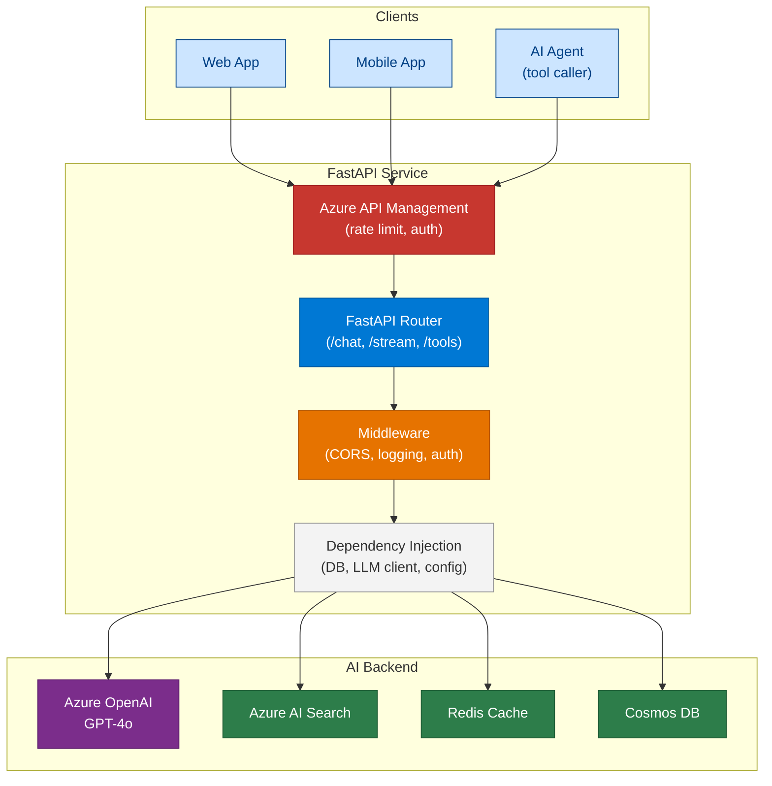
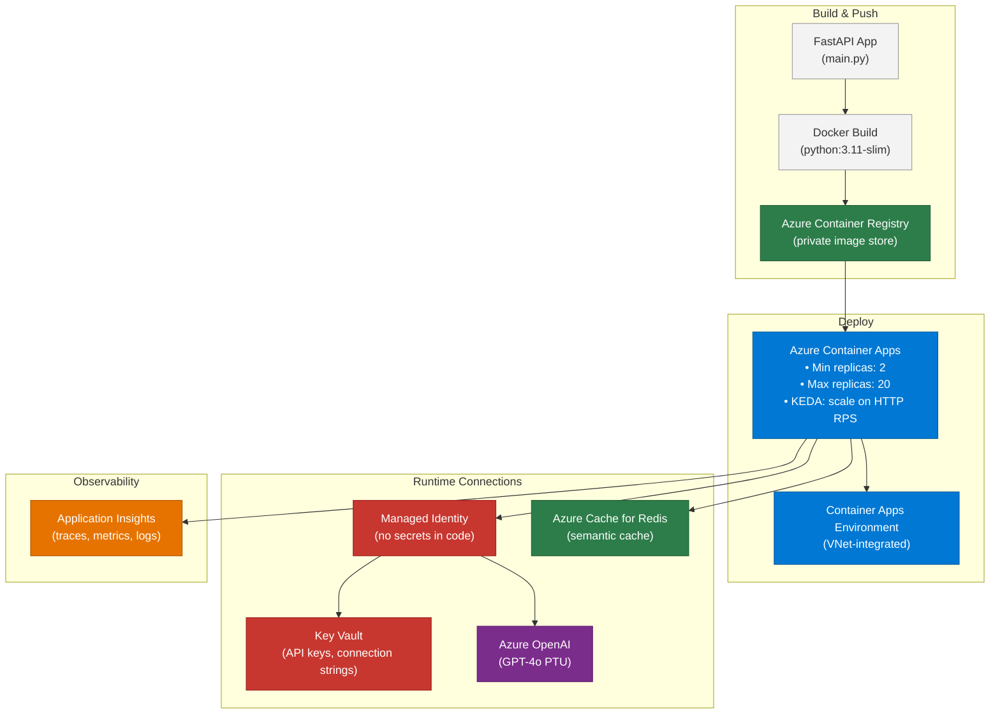

# 47 — FastAPI for AI Engineers

> **Level:** Intermediate
> **Time to complete:** 3 hours
> **Technologies:** FastAPI, Python 3.11+, Pydantic v2, Uvicorn, asyncio, Azure Container Apps

---

## 1. Overview

FastAPI is the dominant Python web framework for building AI API services. It is used throughout enterprise AI stacks — as the API layer in front of LLM pipelines, as the host for agent endpoints, as the streaming SSE server for real-time LLM output, and as the MCP server host. It is fast enough for production (async, compiled Pydantic validation), has automatic OpenAPI docs, and integrates naturally with the async-first Python AI ecosystem (openai, langchain, semantic_kernel).

**When to use FastAPI:**
- Building a REST or streaming API over an LLM or agent pipeline
- Exposing AI capabilities as microservices to other teams
- Building an MCP server (FastAPI + SSE transport)
- Any Python service that requires async I/O with automatic API docs

**When not to use FastAPI:**
- Background processing only (no HTTP API needed) — use Azure Functions or Celery instead
- Heavy ML model serving (GPU inference) — use Triton or TorchServe instead; FastAPI adds unnecessary HTTP overhead for high-frequency inference

---

## 2. FastAPI Architecture for AI Services



### Key Concepts

| Concept | FastAPI feature | Purpose |
|---|---|---|
| Route handlers | `@app.get()`, `@app.post()` | Define API endpoints |
| Request validation | Pydantic `BaseModel` | Validate and parse request bodies automatically |
| Dependency injection | `Depends()` | Share LLM clients, DB sessions, config across routes |
| Async support | `async def` route handlers | Non-blocking I/O for LLM calls and DB queries |
| Auto docs | `/docs` (Swagger), `/redoc` | OpenAPI spec generated from type annotations |
| Background tasks | `BackgroundTasks` | Fire-and-forget work after sending response |
| Streaming | `StreamingResponse` + SSE | Real-time token streaming from LLM |

---

## 3. Building a Production AI API Service

```python
# main.py — production FastAPI AI service
import asyncio
import json
import logging
import os
import uuid
from collections.abc import AsyncGenerator
from contextlib import asynccontextmanager

from fastapi import BackgroundTasks, Depends, FastAPI, Header, HTTPException, Request
from fastapi.middleware.cors import CORSMiddleware
from fastapi.responses import StreamingResponse
from openai import AsyncAzureOpenAI
from pydantic import BaseModel, Field
from pydantic_settings import BaseSettings

logger = logging.getLogger(__name__)


class Settings(BaseSettings):
    azure_openai_endpoint: str
    azure_openai_api_key: str
    azure_openai_deployment: str = "gpt-4o"
    api_secret_key: str
    environment: str = "production"

    class model_config:
        env_file = ".env"


settings = Settings()  # type: ignore[call-arg]

# Module-level client — one instance reused for all requests (connection pooling)
_openai_client: AsyncAzureOpenAI | None = None


@asynccontextmanager
async def lifespan(app: FastAPI) -> AsyncGenerator[None, None]:
    global _openai_client
    _openai_client = AsyncAzureOpenAI(
        azure_endpoint=settings.azure_openai_endpoint,
        api_key=settings.azure_openai_api_key,
        api_version="2024-12-01-preview",
    )
    logger.info("OpenAI client initialised")
    yield
    await _openai_client.close()
    logger.info("OpenAI client closed")


app = FastAPI(
    title="Enterprise AI API",
    version="1.0.0",
    lifespan=lifespan,
    docs_url="/docs" if settings.environment != "production" else None,
)

app.add_middleware(
    CORSMiddleware,
    allow_origins=["https://myapp.contoso.com"],
    allow_credentials=True,
    allow_methods=["GET", "POST"],
    allow_headers=["*"],
)


# --- Dependency Injection ---

def get_openai_client() -> AsyncAzureOpenAI:
    if _openai_client is None:
        raise RuntimeError("OpenAI client not initialised")
    return _openai_client


async def verify_api_key(x_api_key: str = Header(...)) -> None:
    if x_api_key != settings.api_secret_key:
        raise HTTPException(status_code=401, detail="Invalid API key")


# --- Request / Response Models ---

class ChatRequest(BaseModel):
    message: str = Field(..., min_length=1, max_length=8000)
    session_id: str = Field(default_factory=lambda: str(uuid.uuid4()))
    system_prompt: str = Field(default="You are a helpful AI assistant.")
    temperature: float = Field(default=0.7, ge=0.0, le=2.0)
    max_tokens: int = Field(default=1000, ge=1, le=4096)


class ChatResponse(BaseModel):
    session_id: str
    message: str
    input_tokens: int
    output_tokens: int
    model: str


# --- Routes ---

@app.get("/health")
async def health_check() -> dict[str, str]:
    return {"status": "healthy", "version": "1.0.0"}


@app.post("/chat", response_model=ChatResponse, dependencies=[Depends(verify_api_key)])
async def chat(
    request: ChatRequest,
    client: AsyncAzureOpenAI = Depends(get_openai_client),
) -> ChatResponse:
    response = await client.chat.completions.create(
        model=settings.azure_openai_deployment,
        messages=[
            {"role": "system", "content": request.system_prompt},
            {"role": "user", "content": request.message},
        ],
        temperature=request.temperature,
        max_tokens=request.max_tokens,
    )
    choice = response.choices[0]
    logger.info(
        "Chat completed",
        extra={
            "session_id": request.session_id,
            "input_tokens": response.usage.prompt_tokens,
            "output_tokens": response.usage.completion_tokens,
        },
    )
    return ChatResponse(
        session_id=request.session_id,
        message=choice.message.content or "",
        input_tokens=response.usage.prompt_tokens,
        output_tokens=response.usage.completion_tokens,
        model=response.model,
    )


@app.post("/chat/stream", dependencies=[Depends(verify_api_key)])
async def chat_stream(
    request: ChatRequest,
    client: AsyncAzureOpenAI = Depends(get_openai_client),
) -> StreamingResponse:
    async def token_generator() -> AsyncGenerator[str, None]:
        stream = await client.chat.completions.create(
            model=settings.azure_openai_deployment,
            messages=[
                {"role": "system", "content": request.system_prompt},
                {"role": "user", "content": request.message},
            ],
            temperature=request.temperature,
            max_tokens=request.max_tokens,
            stream=True,
        )
        async for chunk in stream:
            delta = chunk.choices[0].delta.content if chunk.choices else None
            if delta:
                # Server-Sent Events format
                yield f"data: {json.dumps({'token': delta})}\n\n"
        yield "data: [DONE]\n\n"

    return StreamingResponse(
        token_generator(),
        media_type="text/event-stream",
        headers={
            "Cache-Control": "no-cache",
            "X-Accel-Buffering": "no",
        },
    )
```

---

## 4. Key FastAPI Patterns for AI Engineers

### 4.1 Dependency Injection — Sharing Expensive Clients

```python
# dependencies.py — reusable dependencies for AI services
from functools import lru_cache
from redis.asyncio import Redis
from azure.search.documents.aio import SearchClient
from azure.identity.aio import DefaultAzureCredential
from fastapi import Depends


@lru_cache
def get_settings() -> Settings:
    return Settings()  # type: ignore[call-arg]


async def get_redis(settings: Settings = Depends(get_settings)) -> Redis:
    return Redis.from_url(os.environ["REDIS_URL"], decode_responses=True)


async def get_search_client(settings: Settings = Depends(get_settings)) -> SearchClient:
    credential = DefaultAzureCredential()
    return SearchClient(
        endpoint=os.environ["AZURE_SEARCH_ENDPOINT"],
        index_name=os.environ["AZURE_SEARCH_INDEX"],
        credential=credential,
    )


# Usage in a route — FastAPI resolves and injects all dependencies
@app.post("/rag/query")
async def rag_query(
    request: ChatRequest,
    openai: AsyncAzureOpenAI = Depends(get_openai_client),
    search: SearchClient = Depends(get_search_client),
    cache: Redis = Depends(get_redis),
) -> ChatResponse:
    # Check cache first
    cached = await cache.get(f"query:{request.message[:64]}")
    if cached:
        return ChatResponse(**json.loads(cached))

    # Retrieve from search and generate with LLM in parallel
    search_results, _ = await asyncio.gather(
        search.search(request.message, top=5),
        asyncio.sleep(0),  # yield to event loop
    )
    context = "\n".join([r["content"] async for r in search_results])

    response = await openai.chat.completions.create(
        model=settings.azure_openai_deployment,
        messages=[
            {"role": "system", "content": f"Answer using only this context:\n{context}"},
            {"role": "user", "content": request.message},
        ],
        temperature=0,
    )
    result = ChatResponse(
        session_id=request.session_id,
        message=response.choices[0].message.content or "",
        input_tokens=response.usage.prompt_tokens,
        output_tokens=response.usage.completion_tokens,
        model=response.model,
    )
    await cache.setex(f"query:{request.message[:64]}", 300, result.model_dump_json())
    return result
```

### 4.2 Error Handling and Middleware

```python
# error_handling.py — global exception handler + request logging middleware
import time
from fastapi import Request, Response
from fastapi.responses import JSONResponse
from openai import APIError, RateLimitError, APITimeoutError


@app.exception_handler(RateLimitError)
async def openai_rate_limit_handler(request: Request, exc: RateLimitError) -> JSONResponse:
    logger.warning("OpenAI rate limit hit", extra={"path": request.url.path})
    return JSONResponse(
        status_code=429,
        content={"error": "AI service rate limit exceeded. Please retry in 30 seconds."},
        headers={"Retry-After": "30"},
    )


@app.exception_handler(APITimeoutError)
async def openai_timeout_handler(request: Request, exc: APITimeoutError) -> JSONResponse:
    logger.error("OpenAI timeout", extra={"path": request.url.path})
    return JSONResponse(status_code=504, content={"error": "AI service timeout."})


@app.middleware("http")
async def request_logging_middleware(request: Request, call_next) -> Response:
    request_id = str(uuid.uuid4())
    start = time.monotonic()
    response = await call_next(request)
    duration_ms = (time.monotonic() - start) * 1000
    logger.info(
        "Request completed",
        extra={
            "request_id": request_id,
            "method": request.method,
            "path": request.url.path,
            "status": response.status_code,
            "duration_ms": round(duration_ms, 2),
        },
    )
    response.headers["X-Request-ID"] = request_id
    return response
```

---

## 5. Deployment — FastAPI on Azure Container Apps



### Dockerfile

```dockerfile
FROM python:3.11-slim

WORKDIR /app

COPY requirements.txt .
RUN pip install --no-cache-dir -r requirements.txt

COPY . .

# Non-root user for security
RUN adduser --disabled-password --gecos "" appuser && chown -R appuser /app
USER appuser

EXPOSE 8000

# Uvicorn: multiple workers for CPU-bound work; single worker with async for I/O-bound AI calls
CMD ["uvicorn", "main:app", "--host", "0.0.0.0", "--port", "8000", "--workers", "1"]
```

### requirements.txt

```
fastapi==0.115.0
uvicorn[standard]==0.32.0
pydantic==2.9.2
pydantic-settings==2.6.0
openai==1.54.0
azure-identity==1.19.0
azure-search-documents==11.6.0
redis==5.2.0
```

---

## 5.1 Pandas for AI Data Workflows

**Pandas** is the core Python library for tabular data manipulation. In AI engineering it is used for: cleaning and preprocessing data before embedding or fine-tuning, building evaluation datasets, analysing token usage logs, and preparing structured data for structured outputs.

```python
# pandas_ai_workflows.py — practical Pandas patterns for AI engineers
import asyncio
import json
import os

import pandas as pd
from openai import AsyncAzureOpenAI

client = AsyncAzureOpenAI(
    azure_endpoint=os.environ["AZURE_OPENAI_ENDPOINT"],
    api_key=os.environ["AZURE_OPENAI_API_KEY"],
    api_version="2024-12-01-preview",
)

# --- Pattern 1: Load and clean a Q&A evaluation dataset ---

def load_eval_dataset(path: str) -> pd.DataFrame:
    df = pd.read_csv(path)

    # Drop rows with missing questions or expected answers
    df = df.dropna(subset=["question", "expected_answer"])

    # Normalise whitespace
    df["question"] = df["question"].str.strip()
    df["expected_answer"] = df["expected_answer"].str.strip()

    # Filter out rows that are too short to be meaningful
    df = df[df["question"].str.len() > 10]

    return df.reset_index(drop=True)


# --- Pattern 2: Batch LLM evaluation with token tracking ---

async def evaluate_single(row: pd.Series) -> dict:
    response = await client.chat.completions.create(
        model=os.environ["AZURE_OPENAI_DEPLOYMENT"],
        messages=[
            {"role": "system", "content": "Answer the question concisely."},
            {"role": "user", "content": row["question"]},
        ],
        temperature=0,
        max_tokens=500,
    )
    return {
        "question": row["question"],
        "expected": row["expected_answer"],
        "actual": response.choices[0].message.content,
        "input_tokens": response.usage.prompt_tokens,
        "output_tokens": response.usage.completion_tokens,
        "cost_usd": (response.usage.prompt_tokens * 2.5 + response.usage.completion_tokens * 10) / 1_000_000,
    }


async def run_batch_evaluation(csv_path: str, sample_n: int = 50) -> pd.DataFrame:
    df = load_eval_dataset(csv_path).head(sample_n)

    # Run evaluations concurrently (respect rate limits — chunk if needed)
    tasks = [evaluate_single(row) for _, row in df.iterrows()]
    results = await asyncio.gather(*tasks)

    results_df = pd.DataFrame(results)

    # --- Analysis ---
    print(f"Total cost: ${results_df['cost_usd'].sum():.4f}")
    print(f"Avg input tokens: {results_df['input_tokens'].mean():.0f}")
    print(f"Avg output tokens: {results_df['output_tokens'].mean():.0f}")
    print(f"P95 output tokens: {results_df['output_tokens'].quantile(0.95):.0f}")

    return results_df


# --- Pattern 3: Build a JSONL fine-tuning dataset from a DataFrame ---

def df_to_finetune_jsonl(df: pd.DataFrame, output_path: str, system_prompt: str) -> None:
    records = []
    for _, row in df.iterrows():
        records.append({
            "messages": [
                {"role": "system", "content": system_prompt},
                {"role": "user", "content": row["question"]},
                {"role": "assistant", "content": row["expected_answer"]},
            ]
        })

    with open(output_path, "w") as f:
        for record in records:
            f.write(json.dumps(record) + "\n")

    print(f"Wrote {len(records)} training examples to {output_path}")


# --- Pattern 4: Token usage analysis from Application Insights export ---

def analyse_token_logs(logs_csv: str) -> None:
    df = pd.read_csv(logs_csv, parse_dates=["timestamp"])

    # Group by hour and model
    df["hour"] = df["timestamp"].dt.floor("H")
    hourly = df.groupby(["hour", "model"]).agg(
        total_input_tokens=("input_tokens", "sum"),
        total_output_tokens=("output_tokens", "sum"),
        request_count=("input_tokens", "count"),
        p95_latency_ms=("latency_ms", lambda x: x.quantile(0.95)),
    ).reset_index()

    hourly["total_cost_usd"] = (
        hourly["total_input_tokens"] * 2.5 + hourly["total_output_tokens"] * 10
    ) / 1_000_000

    print(hourly.sort_values("hour").to_string(index=False))
```

### Essential Pandas Operations for AI Engineers

| Operation | Code | Use case |
|---|---|---|
| Load CSV | `pd.read_csv("data.csv")` | Load eval datasets, logs |
| Filter rows | `df[df["col"] > 0]` | Remove empty/invalid rows |
| Drop nulls | `df.dropna(subset=["col"])` | Clean missing data |
| String clean | `df["col"].str.strip().str.lower()` | Normalise text before embedding |
| Sample rows | `df.sample(n=100, random_state=42)` | Reproducible subset for eval |
| Group + aggregate | `df.groupby("model")["tokens"].mean()` | Cost/perf analysis by model |
| Export to JSONL | `df.to_json(path, orient="records", lines=True)` | Fine-tuning dataset export |
| Percentile | `df["latency"].quantile(0.95)` | P95 latency from logs |
| Pivot table | `df.pivot_table(index="hour", columns="model", values="cost")` | Cost comparison across models |

---

## 6. Production Checklist

- [ ] All routes use `async def` — never `def` when making LLM or DB calls
- [ ] Single OpenAI client instance per application (lifespan context manager) — never create per-request
- [ ] Pydantic models validate all request bodies — no raw `dict` access
- [ ] API key or OAuth token required on all non-health endpoints (`Depends(verify_api_key)`)
- [ ] `/docs` and `/redoc` disabled in production (`docs_url=None` when `env == "production"`)
- [ ] Structured logging on every request (request ID, path, status, duration)
- [ ] `RateLimitError` and `APITimeoutError` handled with `@app.exception_handler` — never return raw 500
- [ ] `StreamingResponse` used for LLM streaming (not buffered responses)
- [ ] Managed Identity used for all Azure service connections — no API keys in code or environment vars in production
- [ ] Container runs as non-root user in Docker
- [ ] KEDA configured to scale Container Apps on HTTP request queue length
- [ ] Health endpoint `/health` responds in < 100ms and returns HTTP 200

---

## 7. Interview Q&A

### Q1 (Beginner): What is FastAPI and why is it preferred over Flask for AI services?

**Answer:** FastAPI is a modern Python web framework built on Starlette and Pydantic. It is preferred for AI services for three reasons: (1) **Async-native** — all route handlers can be `async def`, enabling non-blocking I/O with LLM APIs and databases. Flask requires extensions (aiohttp, etc.) to achieve the same. (2) **Automatic validation** — request bodies are Pydantic models; invalid requests return 422 errors with detailed messages without any extra code. (3) **Auto-generated OpenAPI docs** — `/docs` (Swagger UI) and `/redoc` are built-in and always reflect the current code. For AI services that are consumed by multiple teams or exposed as MCP tool endpoints, this matters a lot.

### Q2 (Intermediate): How do you implement real-time token streaming from Azure OpenAI in FastAPI?

**Answer:** Use `stream=True` in the OpenAI client call, then wrap an async generator in FastAPI's `StreamingResponse` with `media_type="text/event-stream"`. The generator iterates over `AsyncStream[ChatCompletionChunk]`, extracts `chunk.choices[0].delta.content`, and yields it in SSE format (`data: {json}\n\n`). Set `Cache-Control: no-cache` and `X-Accel-Buffering: no` headers so reverse proxies (nginx, APIM) don't buffer the stream. The client reads the stream as Server-Sent Events and appends each token to the UI. End the stream by yielding `data: [DONE]\n\n` after the OpenAI stream closes.

### Q3 (Advanced): A FastAPI AI service is handling 500 concurrent requests and latency has jumped from P50=2s to P95=30s. Walk through your diagnosis.

**Answer:** First, check **where** latency is accumulating: App Insights traces will show whether the time is spent in FastAPI routing, the LLM call, or the vector search. If it is the **LLM call** (most likely): (1) Check Azure OpenAI PTU utilisation — if > 85%, the model is throttling. Solution: add more PTU, or route overflow to PAYG. (2) Check if requests are queuing in the OpenAI client — the default `AsyncAzureOpenAI` client has a connection pool limit; 500 concurrent requests may be waiting for a connection. Increase `max_connections` in the `httpx.AsyncClient` config. If it is **FastAPI itself**: (3) Check if any route handlers are accidentally `def` (synchronous) instead of `async def` — FastAPI runs synchronous routes in a thread pool with a default limit of 40 threads, causing queue-ups under load. (4) Check if Pydantic validation is a bottleneck at high QPS — unlikely but observable in CPU-bound traces. If it is **Redis/Search**: (5) Check connection pool exhaustion on Redis client — `redis.asyncio.Redis` pool defaults to 10 connections; at 500 QPS this saturates. Increase pool size. Resolution path: PTU increase + connection pool tuning usually resolves 80% of high-concurrency latency issues in AI APIs.

### Q4 (Advanced): How would you structure a FastAPI service that must expose the same AI agent as both an HTTP REST API and an MCP server?

**Answer:** The key is separating the **agent logic** from the **transport layer**. Define the agent as a pure Python async function (e.g., `async def run_agent(query: str, session_id: str) -> AgentResponse`). Then mount two transport layers on the same FastAPI app: (1) **REST routes** — `POST /agent/chat` calls `run_agent()` and returns JSON; `GET /agent/stream` calls it with `stream=True` and returns `StreamingResponse`. (2) **MCP transport** — use the `fastapi-mcp` library or implement SSE + JSON-RPC 2.0 manually at `GET /mcp/sse` (server-to-client stream) and `POST /mcp/messages` (client messages). The MCP endpoint wraps each agent tool as an MCP `Tool` object with the same JSON Schema it uses for LLM tool calling. This gives you: any HTTP client can call the REST API, and any MCP-compatible client (Claude Desktop, VS Code) can use the MCP endpoint — both hitting the same underlying agent code.

---

## Cross-links

- Previous: [46 — Azure AI Speech & Multimodal](./46-Azure-AI-Speech-Multimodal.md)
- Next: [Appendix](./Appendix.md)
- Related: [25 — System Design](./25-System-Design.md) | [13 — MCP Protocol](./13-MCP-Protocol.md) | [29 — Deployment](./29-Deployment.md)

---

*Module 47 | Series: Enterprise Agentic AI Tutorial | Last updated: June 2026*
