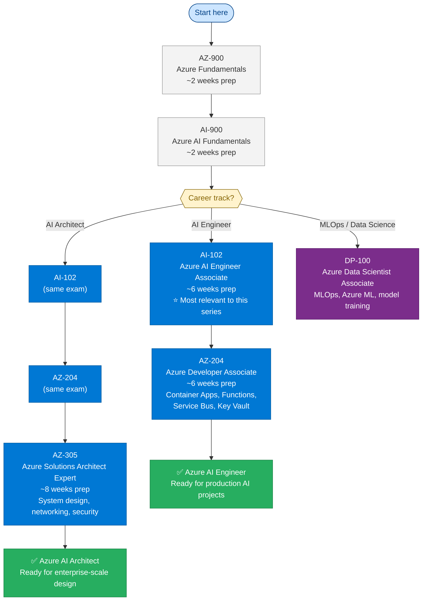
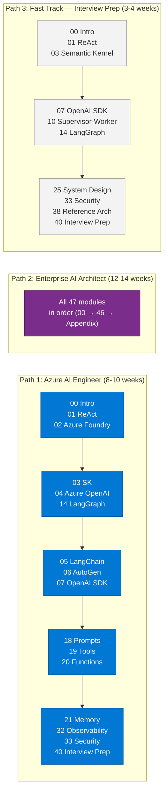

# Appendix — Reference Materials

> **Series:** Enterprise Agentic AI Tutorial | **Last updated:** June 2026

---

## A. Glossary

| Term | Definition |
|---|---|
| **Agent** | An LLM-powered system that perceives its environment, reasons, and takes autonomous actions through tools |
| **A2A Protocol** | Agent-to-Agent protocol (Google, 2024) — standard for agent interoperability and discovery |
| **AutoGen** | Microsoft's multi-agent framework supporting RoundRobin, Selector, and MagenticOne team patterns |
| **BM25** | Best Match 25 — probabilistic keyword retrieval algorithm used in Azure AI Search |
| **CQRS** | Command Query Responsibility Segregation — separates reads (queries) from writes (commands) |
| **CoT** | Chain of Thought — prompting the LLM to reason step-by-step before answering |
| **CRAG** | Corrective RAG — validates retrieval quality and corrects bad retrieval before generation |
| **DAN** | Do Anything Now — a common jailbreak prompt to be detected and blocked |
| **DLQ** | Dead Letter Queue — Service Bus queue for messages that failed processing |
| **DPIA** | Data Protection Impact Assessment — GDPR-required risk assessment for high-risk data processing |
| **Embeddings** | High-dimensional numerical representations of text that capture semantic meaning |
| **EU AI Act** | European Union regulation on AI systems (2024) classifying AI by risk level |
| **Fine-tuning** | Updating LLM weights on domain-specific data to change behavior or knowledge |
| **Function Calling** | API feature that allows LLMs to request execution of specified functions with structured arguments |
| **GraphRAG** | RAG with a knowledge graph layer for multi-hop and relationship queries |
| **HITL** | Human-in-the-Loop — requiring human review/approval for certain AI decisions |
| **HNSW** | Hierarchical Navigable Small World — graph-based ANN algorithm used in most vector databases |
| **HyDE** | Hypothetical Document Embeddings — generates a hypothetical answer, embeds it, searches for similar docs |
| **KEDA** | Kubernetes Event Driven Autoscaler — scales workloads based on event source metrics (queue depth) |
| **LangChain** | Python framework for building LLM applications with LCEL chain composition |
| **LangGraph** | Extension of LangChain for stateful, graph-based agent workflows |
| **LCEL** | LangChain Expression Language — pipe operator composition for chains |
| **LLMOps** | MLOps practices applied to LLM systems: prompt versioning, evaluation gates, quality monitoring |
| **Managed Identity** | Azure service identity authenticated via Entra ID — eliminates need for API keys |
| **MCP** | Model Context Protocol (Anthropic, 2024) — standard for connecting LLMs to external data and tools |
| **OpenTelemetry** | Open standard for distributed tracing, metrics, and logging |
| **PAYG** | Pay-As-You-Go — Azure OpenAI billing mode where you pay per token consumed |
| **PII** | Personally Identifiable Information — data that can identify an individual |
| **Prompt Injection** | Attack where malicious instructions override an LLM's system prompt |
| **PTU** | Provisioned Throughput Units — Azure OpenAI reserved capacity billed hourly |
| **RAG** | Retrieval-Augmented Generation — combines search with LLM generation |
| **ReAct** | Reasoning + Acting — agent pattern that alternates between reasoning and tool calls |
| **Responsible AI** | Set of principles and practices for building AI that is fair, safe, private, inclusive, transparent, accountable |
| **RBAC** | Role-Based Access Control — grants permissions based on roles, not individual identity |
| **Semantic Kernel** | Microsoft's LLM orchestration framework with Azure-native integrations |
| **Semantic Reranker** | Cross-encoder model that re-scores search results for contextual relevance |
| **StateGraph** | LangGraph construct: nodes (functions) + edges (transitions) + typed state |
| **ToT** | Tree of Thought — generates multiple reasoning paths and selects the best via scoring |
| **TPM** | Tokens Per Minute — Azure OpenAI rate limit unit |
| **VectorizedQuery** | Azure AI Search construct for vector similarity search |

---

## B. Azure CLI Cheat Sheet

```bash
# === Authentication ===
az login                                              # Interactive login
az account set --subscription "My Subscription"      # Set active subscription
az account show                                       # Show current account

# === Azure OpenAI ===
# List deployments
az cognitiveservices account deployment list \
  --name my-aoai-resource \
  --resource-group my-rg

# Get endpoint
az cognitiveservices account show \
  --name my-aoai-resource \
  --resource-group my-rg \
  --query properties.endpoint

# Show quota and usage
az cognitiveservices account deployment show \
  --name my-aoai-resource \
  --resource-group my-rg \
  --deployment-name gpt-4o

# === Azure AI Search ===
# Create index
az search index create \
  --service-name my-search \
  --resource-group my-rg \
  --name knowledge-base \
  --fields @index-schema.json

# List indexes
az search index list \
  --service-name my-search \
  --resource-group my-rg

# Get index stats
az search index show \
  --service-name my-search \
  --resource-group my-rg \
  --name knowledge-base

# === Container Apps ===
# Deploy new image
az containerapp update \
  --name my-agent \
  --resource-group my-rg \
  --image myacr.azurecr.io/ai-agent:sha-abc123

# View logs
az containerapp logs show \
  --name my-agent \
  --resource-group my-rg \
  --follow

# List revisions
az containerapp revision list \
  --name my-agent \
  --resource-group my-rg

# Traffic split (canary)
az containerapp ingress traffic set \
  --name my-agent \
  --resource-group my-rg \
  --revision-weight latest=10 stable=90

# === Managed Identity ===
# Assign role to Container App identity
az role assignment create \
  --role "Cognitive Services OpenAI User" \
  --assignee "$(az containerapp show --name my-agent --resource-group my-rg --query identity.principalId -o tsv)" \
  --scope "$(az cognitiveservices account show --name my-aoai --resource-group my-rg --query id -o tsv)"

# === Azure Key Vault ===
# Set secret
az keyvault secret set \
  --vault-name my-kv \
  --name "bing-api-key" \
  --value "your-key-here"

# Get secret
az keyvault secret show \
  --vault-name my-kv \
  --name "bing-api-key" \
  --query value -o tsv

# === Bicep / ARM ===
# Validate Bicep
az deployment group validate \
  --resource-group my-rg \
  --template-file main.bicep \
  --parameters @params.json

# Deploy
az deployment group create \
  --resource-group my-rg \
  --template-file main.bicep \
  --parameters @params.json \
  --mode Incremental
```

---

## C. Python SDK Quick Reference

```python
# azure-ai-projects (AI Foundry)
from azure.ai.projects import AIProjectClient

# azure-search-documents (AI Search)
from azure.search.documents import SearchClient
from azure.search.documents.aio import SearchClient  # Async
from azure.search.documents.indexes import SearchIndexClient
from azure.search.documents.models import VectorizedQuery

# openai (Azure OpenAI)
from openai import AzureOpenAI, AsyncAzureOpenAI

# azure-cosmos (Cosmos DB)
from azure.cosmos import CosmosClient
from azure.cosmos.aio import CosmosClient  # Async

# azure-servicebus (Service Bus)
from azure.servicebus import ServiceBusMessage
from azure.servicebus.aio import ServiceBusClient  # Async

# azure-identity (Managed Identity)
from azure.identity import DefaultAzureCredential
from azure.identity.aio import DefaultAzureCredential  # Async

# azure-keyvault-secrets (Key Vault)
from azure.keyvault.secrets import SecretClient

# redis (Redis)
from redis import Redis
from redis.asyncio import Redis  # Async

# langchain
from langchain_openai import AzureChatOpenAI, AzureOpenAIEmbeddings
from langchain_core.prompts import ChatPromptTemplate
from langchain_community.vectorstores import AzureSearch

# langgraph
from langgraph.graph import StateGraph, END
from langgraph.checkpoint.sqlite.aio import AsyncSqliteSaver
from langgraph.checkpoint.aioredis import AsyncRedisSaver

# semantic kernel
import semantic_kernel as sk
from semantic_kernel.agents import ChatCompletionAgent
from semantic_kernel.connectors.ai.open_ai import AzureChatCompletion

# autogen (0.4+)
from autogen_agentchat.agents import AssistantAgent
from autogen_agentchat.teams import RoundRobinGroupChat
from autogen_ext.models.openai import AzureOpenAIChatCompletionClient
```

---

## D. SDK Versions (June 2026)

| Package | Version | Notes |
|---|---|---|
| `openai` | 1.55+ | Azure OpenAI + Structured Outputs |
| `azure-ai-projects` | 1.0.0b10+ | AI Foundry SDK |
| `azure-search-documents` | 11.6+ | Hybrid + semantic reranker |
| `azure-cosmos` | 4.7+ | Async support |
| `azure-servicebus` | 7.12+ | Async client |
| `azure-identity` | 1.17+ | DefaultAzureCredential |
| `langchain` | 0.3+ | LCEL stable |
| `langchain-openai` | 0.2+ | Azure integration |
| `langgraph` | 0.2+ | StateGraph stable API |
| `semantic-kernel` | 1.14+ | Agent, Process Framework |
| `autogen-agentchat` | 0.4+ | New multi-agent API |
| `autogen-ext` | 0.4+ | AzureOpenAI provider |
| `mcp` | 1.0+ | Official Python MCP SDK |
| `pydantic` | 2.7+ | model_json_schema() for structured outputs |
| `fastapi` | 0.115+ | Async lifespan, SSE |
| `httpx` | 0.27+ | Async HTTP client |
| `redis` | 5.0+ | Async Redis support |

---

## E. Certification Guide

| Certification | Focus | Relevance to This Series |
|---|---|---|
| **AZ-900** | Azure Fundamentals | Foundation — understand Azure services |
| **AI-900** | Azure AI Fundamentals | AI concepts, Azure AI services overview |
| **AI-102** | Azure AI Engineer Associate | Azure AI Search, AOAI, Bot Service, Computer Vision — directly relevant |
| **AZ-204** | Azure Developer Associate | Container Apps, Functions, Service Bus, Key Vault — infrastructure for AI |
| **AZ-305** | Azure Solutions Architect Expert | System design, networking, security — advanced |
| **DP-100** | Azure Data Scientist Associate | MLOps, Azure ML, model training |
| **AZ-400** | Azure DevOps Engineer Expert | CI/CD, GitHub Actions for AI deployments |

### E.1 Certification Path Flowchart



**Recommended path for AI Engineers:**
`AZ-900 → AI-900 → AI-102 → AZ-204`

**Recommended path for AI Architects:**
`AI-102 → AZ-204 → AZ-305`

---

## F. Learning Path Summary



### Learning Path 1: Azure AI Engineer (8-10 weeks)
Modules: 00 → 01 → 02 → 03 → 04 → 14 → 05 → 06 → 07 → 18 → 19 → 20 → 21 → 32 → 33 → 40

### Learning Path 2: Enterprise AI Architect (12-14 weeks)
All modules 00-46 in order (includes TOGAF, CrewAI, Evaluation, Deployment Patterns, Copilot Studio, Multimodal)

### Learning Path 3: Fast Track — Interview Prep (3-4 weeks)
Modules: 00 → 01 → 03 → 07 → 10 → 14 → 25 → 33 → 38 → 40

---

## G. Quick Reference: Key Design Patterns

| Pattern | Module | When to use |
|---|---|---|
| ReAct | 01, 22 | Tool-using agents with sequential reasoning |
| Reflection | 22 | Quality-critical outputs needing self-review |
| Supervisor-Worker | 10 | Hierarchical multi-agent task decomposition |
| Fan-out/Fan-in | 11 | Parallel independent sub-tasks |
| Plan-and-Execute | 22 | Multi-step tasks with a clear plan upfront |
| RAG | 14, 15 | Domain-specific Q&A on private data |
| GraphRAG | 16 | Multi-hop and relationship queries |
| CQRS | 26 | Separate read/write scaling for AI systems |
| Saga | 26 | Multi-service workflows with compensating transactions |
| Circuit Breaker | 25 | Prevent cascading failures in LLM calls |
| Semantic Cache | 15, 36 | Reduce redundant LLM calls (30%+ hit rate target) |
| Canary Deployment | 29 | Safe rollout of new prompts/models |
| TOGAF ADM | 41 | Governing enterprise AI transformation roadmaps |
| RICEFWID | 01, 41 | Structured agent capability assessment |
| CrewAI Sequential | 42 | Linear role-based multi-agent pipelines |
| CrewAI Hierarchical | 42 | Manager-delegated multi-agent systems |
| Sync API Agent | 44 | Interactive agents with < 30s response SLA |
| Async Queue-Worker | 44 | Long-running agent tasks (document processing, analysis) |
| Cost Circuit Breaker | 44 | Cap per-session/daily LLM token spend |
| Agentic Evaluation Gate | 43 | CI/CD quality gate before agent deployment |
| LLM-as-Judge | 43 | Scalable evaluation of agent response quality |
| Copilot Studio + AI Foundry | 45 | Low-code UX + custom reasoning hybrid architecture |
| Redundancy vs Replication | 25 | Availability (standby failover) vs read scale (active replicas) |

---

*Appendix | Series: Enterprise Agentic AI Tutorial | Last updated: June 2026*
