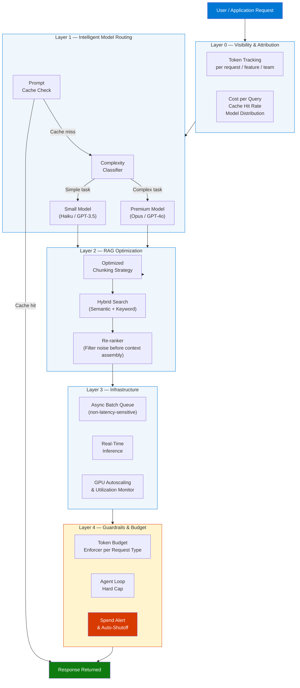
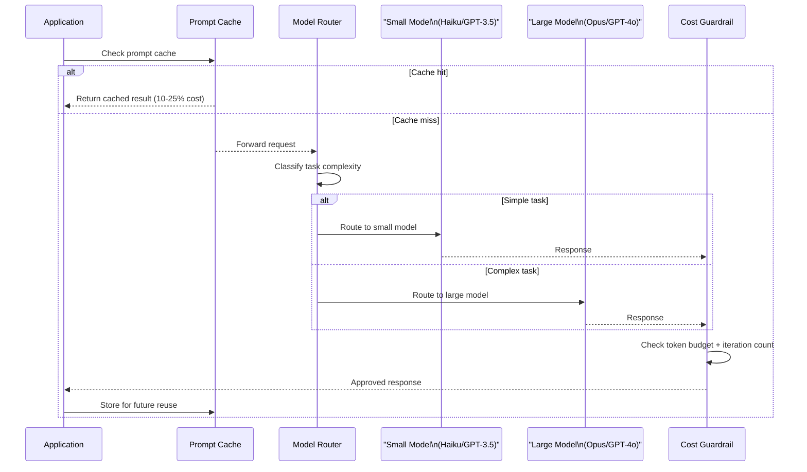

# 15 Gen AI Cost Optimization Tips for Interviews and Real-World Projects

> **Source:** [YouTube — 15 Gen AI Cost Optimization Tips for Interviews and Real-World Projects](https://www.youtube.com/watch?v=lpj9XqEyHjg)
> **Topic:** Gen AI, Cost Optimization, LLM, RAG, Prompt Engineering, FinOps, Agentic AI
> **Key Claim:** Teams achieving 30–60% cost reduction without performance degradation; Gartner: "Through 2028, at least 50% of GenAI projects will overrun their budgeted costs"

---

## Table of Contents

1. [Overview](#1-overview)
2. [Problem Statement](#2-problem-statement)
3. [Core Concepts](#3-core-concepts)
4. [Architecture — Cost Optimization Layers](#4-architecture--cost-optimization-layers)
5. [The 15 Tips by Category](#5-the-15-tips-by-category)
6. [Request Flow — Model Routing](#6-request-flow--model-routing)
7. [Comparison Table — Before vs After Optimization](#7-comparison-table--before-vs-after-optimization)
8. [Code Examples](#8-code-examples)
9. [Cost Benchmarks Reference](#9-cost-benchmarks-reference)
10. [Best Practices](#10-best-practices)
11. [Interview Talking Points](#11-interview-talking-points)
12. [Learning Resources](#12-learning-resources)

---

## 1. Overview

Generative AI costs are growing explosively — average monthly AI spend per organization hit **$85,521 in 2025**, a 36% jump from 2024. Without deliberate cost governance, agentic loops, oversized models, and bloated prompts silently drain budgets. This guide covers 15 actionable optimization tips organized across six categories: model selection, prompt engineering, RAG pipeline tuning, infrastructure, agentic guardrails, and business alignment — giving you both interview-ready talking points and production-proven techniques.

---

## 2. Problem Statement

### Why Gen AI Costs Are Hard to Control

| Problem | Impact |
|---|---|
| Costs don't scale linearly | Compound unpredictably across systems |
| Token-based billing is opaque | Teams can't see where money is going |
| All traffic routed to premium models | 10–50x overspend vs. right-sized models |
| RAG pipelines stuff full context windows | 70–80% of tokens sent are irrelevant |
| Agentic loops have no hard caps | A single runaway agent can generate catastrophic costs overnight |
| No dedicated cost ownership | ML, product, and finance all blame each other |

> **Key Insight:** "Through 2028, at least 50% of GenAI projects will overrun their budgeted costs due to poor architectural choices and lack of operational know-how." — Gartner

### Classic Approach Pain Points

| Classic Approach | Problem |
|---|---|
| Single premium model for all requests | Paying GPT-4 prices for "summarize this sentence" |
| No prompt caching | Re-processing identical system prompts millions of times |
| Naïve RAG with large chunk sizes | Sending irrelevant context, burning tokens on noise |
| Real-time inference for all workloads | Missing 50%+ batch pricing discounts |
| Reactive monitoring via monthly bills | Problems discovered weeks after they start |

---

## 3. Core Concepts

### Minimum Viable Tokens (MVT)
The discipline of achieving the same output quality with the fewest possible input + output tokens. Applied to prompts, retrieved context, and response length constraints simultaneously.

### Model Routing
Dynamically directing each inference request to the cheapest model capable of handling that task's complexity — rather than defaulting all traffic to the most powerful (and most expensive) model available.

### Prompt Caching
Storing the processed key-value (KV) state of static prompt prefixes (system messages, knowledge bases, instructions) so repeated requests skip recomputation. Most providers offer 50–90% token cost discounts on cached prefixes.

### RAG Context Efficiency
The practice of retrieving only tokens the model will actually use — through better chunking, hybrid search, metadata filtering, and re-ranking — rather than flooding the context window.

### Agentic Cost Guardrails
Hard architectural limits on agent reasoning loops, iteration counts, and token budgets that prevent runaway spend from recursive or malformed agentic execution.

### FinOps for AI
Cross-functional discipline where ML engineering, platform engineering, product, and finance share accountability for AI unit economics — measured as cost per outcome, not aggregate monthly bills.

---

## 4. Architecture — Cost Optimization Layers



---

## 5. The 15 Tips by Category

### Category A — Model Selection & Architecture (Tips 1–4)

#### Tip 1: Choose the Right Model for the Task
Simple tasks (classification, summarization, intent detection) don't require large, expensive models. Map your use cases to a model tier matrix and enforce it at the routing layer.

| Task Type | Recommended Tier |
|---|---|
| Classification, intent detection | Small (Haiku, GPT-3.5-turbo) |
| Summarization, Q&A | Mid (Sonnet, GPT-4o-mini) |
| Complex reasoning, multi-step agents | Premium (Opus, GPT-4o) |
| Code generation | Mid or Premium depending on complexity |

#### Tip 2: Use Model Routing Dynamically
Implement a routing layer that classifies each request and dispatches to the appropriate model. Can reduce costs 30–50% while maintaining quality. See code example in §8.

#### Tip 3: Apply Model Distillation
Train a smaller, specialized model using outputs from a larger teacher model. The distilled model runs at a fraction of the cost for the narrow task it was trained on. Best for high-volume, narrow use cases (e.g., sentiment, entity extraction).

#### Tip 4: Use Parameter-Efficient Fine-Tuning (PEFT)
Techniques like LoRA, QLoRA, and prefix tuning adapt a base model to your domain without full retraining — at 10–100x lower compute cost than traditional fine-tuning.

---

### Category B — Prompt & Token Optimization (Tips 5–7)

#### Tip 5: Engineer Prompts for Minimum Viable Tokens (MVT)
Audit every prompt: eliminate filler phrases, redundant context, and verbose instructions. Ask: "Can we achieve the same quality result with fewer tokens?" Discipline here yields **15–40% cost reduction** as a baseline.

**Prompt audit checklist:**
- Remove: "Please", "Could you", "I would like you to" — model doesn't need courtesy
- Remove: Repeated context already in the system prompt
- Replace: Verbose instructions → structured JSON schema or examples
- Constrain: Output length with `max_tokens` parameter

#### Tip 6: Keep Prompts Concise & Constrain Response Length
Every additional token in the prompt is charged. Every additional output token is charged. Set explicit `max_tokens` limits per request class. A customer support reply doesn't need 2,000 tokens.

#### Tip 7: Implement Prompt Caching
Static content (system instructions, knowledge bases, few-shot examples) placed at the start of the prompt qualifies for cache pricing. Most providers charge 10–25% of normal input token price for cache hits.

**Placement rule:** Static prefix → Dynamic suffix (never reversed).

```
[SYSTEM: 2000 tokens of static instructions]   ← cached
[FEW-SHOT EXAMPLES: 500 tokens of static]       ← cached
[USER QUERY: 50 tokens dynamic]                 ← not cached
```

---

### Category C — RAG Pipeline Optimization (Tips 8–9)

#### Tip 8: Optimize Your RAG Pipeline
Naïve RAG implementations stuff the full retrieved context into the prompt regardless of relevance. For many production systems, **70–80% of sent tokens are noise** — retrieved passages the model ignores or downweights. You're paying for context that doesn't improve answers.

**RAG cost levers:**
- Reduce `top_k` retrieval count — retrieve fewer, better chunks
- Add a re-ranking step before context assembly
- Use metadata filtering to pre-narrow the search corpus
- Apply late chunking or contextual retrieval for better precision

#### Tip 9: Tune Chunking Strategy
Larger chunks are not always better. Oversized chunks drag in irrelevant sentences; undersized chunks lose semantic coherence. Tune chunk size and overlap to your specific query patterns.

| Strategy | Chunk Size | Overlap | Best For |
|---|---|---|---|
| Fixed-size | 256–512 tokens | 50 tokens | General QA |
| Semantic | Variable | None | Long-form docs |
| Sentence-level | 1–3 sentences | 1 sentence | Precise fact retrieval |
| Hierarchical | Parent + child | — | Complex multi-hop queries |

---

### Category D — Infrastructure & Compute (Tips 10–11)

#### Tip 10: Manage GPU Utilization & Autoscaling
GPUs for AI workloads cost **10–20x more** than standard CPU compute. Under-utilized GPUs are pure waste; over-provisioned GPU clusters are budget sinkholes. Monitor utilization and implement autoscaling policies.

**Key metrics to track:**
- GPU utilization % (target: >70%)
- Memory bandwidth utilization
- Idle time between inference requests
- Queue depth vs. latency tradeoff

#### Tip 11: Batch Asynchronous Workloads
Non-latency-sensitive workloads (risk scoring, nightly analytics, report generation, enrichment pipelines) can be batched. Batch APIs from major providers offer **50%+ pricing discounts** over real-time inference.

| Workload Type | Inference Mode | Cost |
|---|---|---|
| Real-time chat, copilot | Synchronous | Full price |
| Nightly reports, enrichment | Async batch | ~50% discount |
| Model evaluation, fine-tune data prep | Batch | ~50% discount |

---

### Category E — Agentic Guardrails (Tips 12–14)

#### Tip 12: Set Hard Limits on Agentic Loops
Agentic systems can recurse indefinitely without explicit iteration caps. A single runaway agent triggered at 2 AM can generate thousands of dollars in API spend before anyone notices. Enforce hard `max_iterations` at the orchestration layer — not as a soft guideline but as a code-enforced ceiling.

```python
MAX_AGENT_ITERATIONS = 10  # Never exceed regardless of task

for iteration in range(MAX_AGENT_ITERATIONS):
    result = agent.step(state)
    if result.is_terminal:
        break
else:
    raise AgentLoopExceededError(f"Agent exceeded {MAX_AGENT_ITERATIONS} iterations")
```

#### Tip 13: Configure Spend Alerts & Auto-Shutoffs
Set real-time spend alerts at the API provider level AND at your application layer. Configure auto-shutoff triggers, not just notification alerts.

**Alert tiers:**
- 50% of daily budget → Slack alert to engineering
- 80% of daily budget → PagerDuty alert to on-call
- 100% of daily budget → Automatic API key rate-limit / kill switch

#### Tip 14: Establish Token Budgets Per Request Type
Assign explicit maximum token budgets to each use case class and enforce them at the API call layer. This prevents gradual prompt bloat — where prompts slowly grow over time and silently inflate costs.

| Use Case | Input Budget | Output Budget |
|---|---|---|
| Customer support reply | 1,500 tokens | 300 tokens |
| Document summarization | 4,000 tokens | 500 tokens |
| Code review | 6,000 tokens | 1,000 tokens |
| Multi-step agent task | 8,000 tokens | 2,000 tokens |

---

### Category F — Observability & Business Alignment (Tip 15)

#### Tip 15: Track Usage & Align AI to Business Goals
Measure cost per outcome (cost per successful resolution, cost per document processed) — not just aggregate monthly bills. Teams with executive-level cost alignment report **2–4x more influence** over technology selection and architectural decisions.

**Unit economics to track:**
- Cost per successful user interaction
- Cost per document processed
- Cost per agent task completed
- Cache hit rate (target: >60%)
- Model routing accuracy (% of tasks correctly tier-routed)

---

## 6. Request Flow — Model Routing



---

## 7. Comparison Table — Before vs After Optimization

| Dimension | Before Optimization | After Optimization |
|---|---|---|
| Model selection | All requests → premium model | Complexity-routed to right tier |
| Prompt caching | None — all tokens billed fresh | Static prefixes cached (50–90% discount) |
| RAG context | Top 20 chunks, full text | Top 5 re-ranked, filtered chunks |
| Agentic loops | Unlimited iterations | Hard cap at N iterations |
| Workload scheduling | All real-time inference | Async batch for non-latency tasks |
| Cost visibility | Monthly aggregate invoice | Per-request unit economics dashboard |
| Spend control | React after overrun | Proactive alerts + auto-shutoff |
| Monitoring owner | Nobody / everyone | Dedicated FinOps AI team |
| Cost trajectory | 36% YoY increase | 30–60% reduction vs. unoptimized |
| Prompt length | Grows unchecked over time | Token budgets enforced per use case |

---

## 8. Code Examples

### Python — Dynamic Model Router

```python
from enum import Enum
from anthropic import Anthropic

class TaskComplexity(Enum):
    SIMPLE = "simple"
    MEDIUM = "medium"
    COMPLEX = "complex"

MODEL_MAP = {
    TaskComplexity.SIMPLE:  "claude-haiku-4-5-20251001",
    TaskComplexity.MEDIUM:  "claude-sonnet-4-6",
    TaskComplexity.COMPLEX: "claude-opus-4-8",
}

COST_PER_MILLION = {
    "claude-haiku-4-5-20251001": {"input": 0.80,  "output": 4.00},
    "claude-sonnet-4-6":         {"input": 3.00,  "output": 15.00},
    "claude-opus-4-8":           {"input": 15.00, "output": 75.00},
}

def classify_task(prompt: str) -> TaskComplexity:
    word_count = len(prompt.split())
    if word_count < 50 and any(k in prompt.lower() for k in ["summarize", "classify", "list"]):
        return TaskComplexity.SIMPLE
    elif word_count < 200:
        return TaskComplexity.MEDIUM
    return TaskComplexity.COMPLEX

def route_request(prompt: str, system: str = "") -> dict:
    complexity = classify_task(prompt)
    model = MODEL_MAP[complexity]

    client = Anthropic()
    response = client.messages.create(
        model=model,
        max_tokens=1024,
        system=system,
        messages=[{"role": "user", "content": prompt}]
    )
    return {
        "model": model,
        "complexity": complexity.value,
        "response": response.content[0].text,
        "tokens_used": response.usage,
    }
```

---

### Python — Prompt Caching with Static Prefix

```python
import anthropic

client = anthropic.Anthropic()

# Static system prompt placed FIRST — qualifies for cache
SYSTEM_KNOWLEDGE_BASE = """
[Your 2000-token knowledge base / instructions here]
This content is identical across all requests — it gets cached after first call.
Subsequent calls pay only 10-25% of normal input token price for this section.
""".strip()

def cached_query(user_question: str) -> str:
    response = client.messages.create(
        model="claude-sonnet-4-6",
        max_tokens=512,
        system=[
            {
                "type": "text",
                "text": SYSTEM_KNOWLEDGE_BASE,
                "cache_control": {"type": "ephemeral"},  # Enable prefix caching
            }
        ],
        messages=[{"role": "user", "content": user_question}],
    )
    cache_stats = response.usage
    print(f"Cache read tokens: {cache_stats.cache_read_input_tokens}")
    print(f"Cache write tokens: {cache_stats.cache_creation_input_tokens}")
    return response.content[0].text
```

---

### Python — Token Budget Enforcer

```python
class TokenBudgetExceededError(Exception):
    pass

USE_CASE_BUDGETS = {
    "support_reply":         {"max_input": 1500, "max_output": 300},
    "doc_summarization":     {"max_input": 4000, "max_output": 500},
    "code_review":           {"max_input": 6000, "max_output": 1000},
    "agent_task":            {"max_input": 8000, "max_output": 2000},
}

def enforce_budget(use_case: str, prompt: str) -> int:
    budget = USE_CASE_BUDGETS.get(use_case)
    if not budget:
        raise ValueError(f"Unknown use case: {use_case}")

    # Rough token estimate: ~4 chars per token
    estimated_input_tokens = len(prompt) // 4
    if estimated_input_tokens > budget["max_input"]:
        raise TokenBudgetExceededError(
            f"{use_case} prompt exceeds budget: "
            f"{estimated_input_tokens} > {budget['max_input']} tokens"
        )
    return budget["max_output"]

def budgeted_inference(use_case: str, prompt: str, client) -> str:
    max_output = enforce_budget(use_case, prompt)
    response = client.messages.create(
        model="claude-haiku-4-5-20251001",
        max_tokens=max_output,   # Hard cap on output
        messages=[{"role": "user", "content": prompt}]
    )
    return response.content[0].text
```

---

### Python — Agentic Loop with Hard Cap

```python
MAX_AGENT_ITERATIONS = 10

class AgentLoopExceededError(Exception):
    pass

def run_agent_with_cap(initial_state: dict, agent_fn, max_iter: int = MAX_AGENT_ITERATIONS) -> dict:
    state = initial_state
    for i in range(max_iter):
        result = agent_fn(state)
        if result.get("done"):
            return result
        state = result
    raise AgentLoopExceededError(
        f"Agent did not terminate within {max_iter} iterations — check for loops"
    )
```

---

### RAG — Optimized Chunking with LangChain

```python
from langchain.text_splitter import RecursiveCharacterTextSplitter

# Tuned for precise fact retrieval — smaller chunks, semantic boundaries
splitter = RecursiveCharacterTextSplitter(
    chunk_size=400,           # Tokens ~400 (down from naive 1000)
    chunk_overlap=40,         # 10% overlap to preserve context at boundaries
    separators=["\n\n", "\n", ". ", " ", ""],  # Prefer semantic breaks
)

def optimized_rag_chunks(document: str) -> list[str]:
    chunks = splitter.split_text(document)
    # Filter out noise: too short = probably a heading or whitespace
    return [c for c in chunks if len(c.split()) > 20]
```

---

## 9. Cost Benchmarks Reference

| Optimization | Typical Savings | Source |
|---|---|---|
| Right-sizing models via routing | 30–50% cost reduction | CloudZero, Cloudchipr |
| Prompt optimization (MVT) | 15–40% cost reduction | Multiple sources |
| Eliminating RAG context noise | 70–80% fewer tokens sent | Cloudchipr |
| Batch API vs. real-time | 50%+ pricing discount | Provider pricing |
| Prompt caching (static prefix) | 50–90% on cached tokens | Anthropic, OpenAI |
| Combined (all tactics) | 30–60% total reduction | Cloudchipr customers |
| Average monthly AI spend (2025) | $85,521/org (+36% YoY) | Industry survey |
| FinOps teams managing AI spend | 98% (up from 31% two years ago) | Cloudchipr |

---

## 10. Best Practices

### Model Selection
- ✅ Build a model tier matrix and enforce routing at the architecture layer
- ✅ Default new features to the smallest tier; promote up only after benchmarking
- ❌ Don't let individual engineers choose models per-feature without governance
- ❌ Don't assume the newest/largest model is always necessary

### Prompts & Tokens
- ✅ Run a token audit on your top 10 highest-traffic prompts first
- ✅ Place all static content (instructions, knowledge) at the start — enable caching
- ✅ Set explicit `max_tokens` for every API call
- ❌ Don't grow prompts organically — review and prune on a regular cadence
- ❌ Don't send chat history without a sliding-window truncation policy

### RAG
- ✅ Add a re-ranking step before context assembly
- ✅ Use hybrid search (semantic + keyword) for better precision
- ✅ Profile your top queries to find the optimal `top_k` and chunk size
- ❌ Don't use default chunk sizes from tutorials — tune for your data and queries
- ❌ Don't skip metadata filtering when your corpus has a clear categorical structure

### Agentic Systems
- ✅ Enforce `max_iterations` in code, not as a comment or convention
- ✅ Wire spend alerts to auto-shutoffs, not just Slack notifications
- ✅ Log every agent step with token counts for post-mortem analysis
- ❌ Don't deploy agents to production without a tested kill switch
- ❌ Don't allow agents to spawn unbounded sub-agents

### FinOps
- ✅ Measure cost per outcome — not aggregate monthly bills
- ✅ Assign a named owner to AI cost for each product area
- ✅ Establish a cost review cadence (weekly for fast-growing systems)
- ❌ Don't treat cloud cost alerts as sufficient — AI costs need per-request granularity

---

## 11. Interview Talking Points

### "How would you reduce the cost of a high-traffic Gen AI application?"

> I'd attack it across four layers simultaneously. First, model routing — classifying each request by complexity and routing simple tasks (classification, summarization) to smaller, cheaper models like Haiku or GPT-3.5, reserving premium models only for complex reasoning. Second, prompt caching — placing static system instructions and few-shot examples at the start of every prompt so the provider caches the KV state; subsequent calls hit the cache at 10–25% of normal input token price. Third, RAG optimization — auditing how many retrieved tokens are actually relevant; naïve RAG sends 70–80% noise, so adding re-ranking and tuning chunk size can cut context tokens dramatically. Finally, batch processing for any non-latency-sensitive workloads — batch APIs typically offer 50%+ discounts. Combined, these tactics typically deliver 30–60% cost reduction without degrading output quality.

---

### "What are the biggest cost risks in agentic AI systems?"

> The biggest risk is unbounded iteration loops. An agentic system without a hard `max_iterations` cap can recurse indefinitely — a single malformed task or edge case triggered at 2 AM can generate thousands of dollars in API charges before anyone notices. The fix is architectural: enforce iteration caps in code, not as a convention; configure real-time spend alerts that trigger auto-shutoffs (not just Slack messages); and establish per-request token budgets that prevent gradual prompt bloat from inflating costs silently over time. Beyond loops, the other major risk is runaway sub-agent spawning — agents that can create other agents without a ceiling need explicit guardrails on the orchestration layer.

---

### "How does model distillation help with Gen AI cost optimization?"

> Model distillation creates a smaller, specialized model by training it on outputs from a larger "teacher" model. The distilled model learns to replicate the teacher's behavior for a narrow task — sentiment classification, entity extraction, intent detection — at a fraction of the inference cost. It's most effective when you have a high-volume, narrow use case where a premium model is overkill. The tradeoff is upfront investment: you need labeled outputs from the teacher and a fine-tuning pipeline. For applications hitting millions of requests per day on a specific task, the ROI is typically very strong — often 80–90% cost reduction per request vs. running the full teacher model.

---

### "Explain prompt caching and when to use it."

> Prompt caching works by storing the processed key-value representation of a static prompt prefix server-side, so repeat requests that share that prefix skip recomputation and are charged at a fraction of normal input token price — typically 10–25% with Anthropic, 50% with OpenAI. It's most valuable when you have a large, stable system prompt (instructions, knowledge bases, few-shot examples) that doesn't change per request. The placement rule is critical: static content must come first, dynamic user input must come last — providers only cache from the beginning of the prompt up to the first dynamic token. A system with a 2,000-token static system prompt and 100 daily active users asking an average of 10 questions each could eliminate nearly a million redundant token processings per day with caching enabled.

---

### "How do you measure the ROI of Gen AI cost optimization efforts?"

> The right unit of measurement is cost per outcome — cost per successful customer support resolution, cost per document processed, cost per agent task completed — not aggregate monthly spend. Aggregate bills hide the unit economics: spending went up because volume grew vs. because unit cost grew are two very different situations requiring different responses. I'd establish a baseline cost-per-outcome dashboard before any optimization work, then measure the delta after each intervention. For model routing, track routing accuracy (% of requests correctly tier-assigned) alongside cost. For caching, track cache hit rate — a healthy production system targeting >60% cache hit rate. For RAG, track answer relevance scores alongside retrieved token counts to ensure you're not degrading quality to save cost.

---

## 12. Learning Resources

| Resource | Link | Type |
|---|---|---|
| YouTube — 15 Gen AI Cost Optimization Tips | [Watch](https://www.youtube.com/watch?v=lpj9XqEyHjg) | Video |
| AI Cost Optimization — Practical Guide | [cloudchipr.com](https://cloudchipr.com/blog/ai-cost-optimization) | Article |
| AI Cost Optimization Strategies — CloudZero | [cloudzero.com](https://www.cloudzero.com/blog/ai-cost-optimization/) | Article |
| Reducing GenAI Cost — 5 Strategies | [caylent.com](https://caylent.com/blog/reducing-gen-ai-cost-5-strategies) | Article |
| Gartner — Real Cost of Generative AI | [truefoundry.com](https://www.truefoundry.com/blog/the-real-cost-of-generative-ai) | Analysis |
| Anthropic Prompt Caching Docs | [docs.anthropic.com](https://docs.anthropic.com/en/docs/build-with-claude/prompt-caching) | Official Docs |

---

*Last Updated: June 2026 | Source: YouTube — 15 Gen AI Cost Optimization Tips for Interviews and Real-World Projects*
