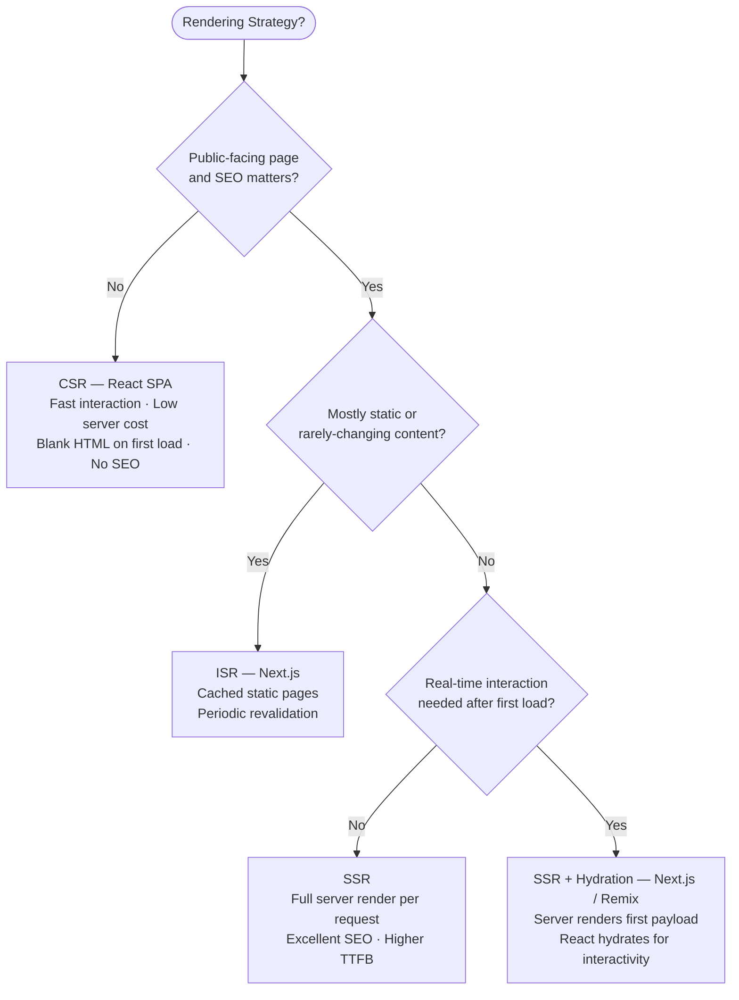
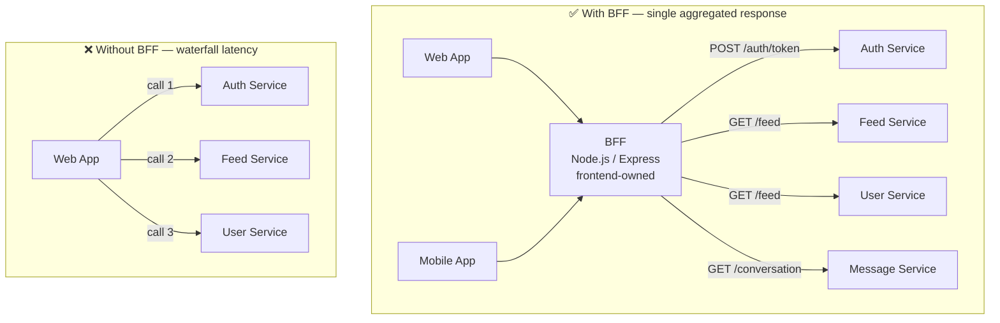
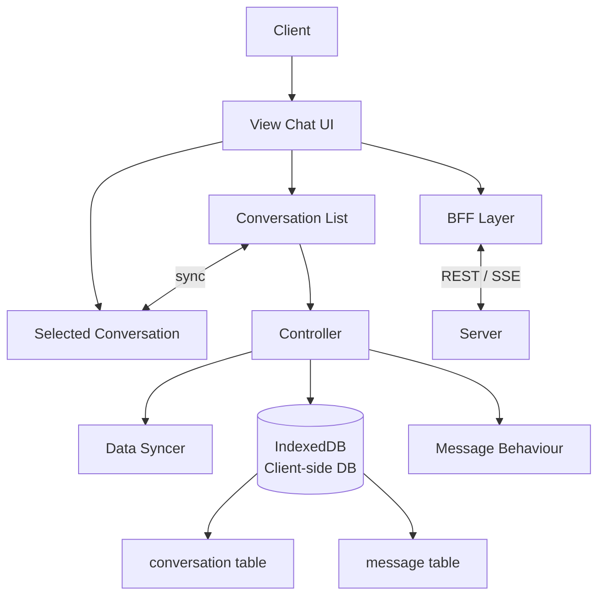
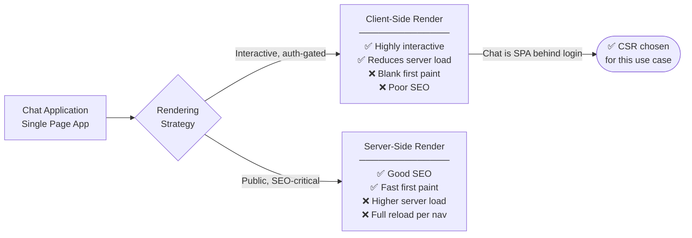
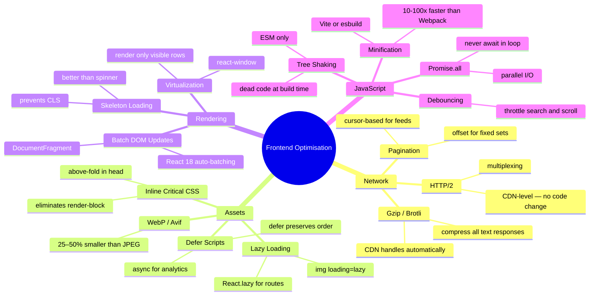

# Frontend System Design 2026 — How to Prepare

**Source:** [@dev.nd.drive](https://www.instagram.com/dev.nd.drive/)  
**Post URL:** https://www.instagram.com/p/DVgsX7SAc8K/  
**Posted:** 8 March 2026  
**Series:** [16/30] — How You Should Prepare System Design in 2026  
**Tags:** frontend, web developer, job switch  
**Likes:** 4,700+ | **Comments:** 129 | **Shares:** 126  
**Liked by:** dhruvtechbytes and 4,664 others  

---

## 📋 Video Summary

A reel by a Software Engineer @ Uber walking through **how to approach Frontend System Design interviews in 2026**. Covers key topics you need to prepare, structured as a checklist across multiple slides.

---

## 🎬 Slide 1 — Requirements

**Title: requirements**

Requirements gathering is the **first and most critical step** in a frontend system design interview. Interviewers expect you to ask clarifying questions before drawing any diagram. Requirements split into **functional** (what users can do) and **non-functional** (how the system behaves under constraints).

1. **User actions** — Define what the user can do: browsing, editing, sharing, uploading, real-time messaging. These choices drive component architecture and state management decisions (Redux for complex shared state, React Query for server state, Zustand for lightweight local state).

2. **Authentication** — Choose the identity strategy: **OAuth 2.0** (third-party login via Google/GitHub — no password stored on your server), **JWT** (stateless tokens suitable for SPAs and mobile clients — store in httpOnly cookies, never localStorage, to prevent XSS), or **Magic Links** (passwordless, email-based — higher conversion, lower friction for B2C).

3. **Rendering strategy** — The most consequential architectural decision in frontend design (see decision tree below).

4. **Accessibility** — Minimum bar: **WCAG 2.1 AA**. Covers screen reader support (ARIA roles), keyboard navigation, color contrast ≥ 4.5:1, dark/light mode via `prefers-color-scheme`, and `prefers-reduced-motion`.

5. **Internationalization (i18n)** — Locale-aware routing (`/en/`, `/ar/`), RTL layout support for Arabic and Hebrew using `dir="rtl"`, locale-specific date/number/currency formatting via the `Intl` API.

6. **Unicode** — UTF-8 encoding throughout the stack, emoji support, bidirectional text via the Unicode Bidi Algorithm (critical for mixed LTR/RTL content).

**Rendering Strategy Decision Tree:**



**Rendering Strategy Comparison:**

| Strategy | SEO | Time to First Byte | Interactivity | Best For |
|---|---|---|---|---|
| **CSR** (React SPA) | Poor | Fast | Excellent | Dashboards, admin tools behind login |
| **SSR** | Excellent | Slower | Good | E-commerce product pages |
| **SSR + Hydration** | Excellent | Moderate | Excellent post-hydration | Social feeds, news apps |
| **ISR** (Next.js) | Excellent | Fast (cached) | Good | Docs, marketing sites |

**Authentication token storage (security-critical pattern):**

```ts
// NEVER store JWT in localStorage — XSS steals it instantly
// Use httpOnly cookie — JavaScript cannot read it at all

// Server sets cookie after successful login
// Set-Cookie: token=<jwt>; HttpOnly; Secure; SameSite=Strict; Path=/

// Browser auto-sends cookie on every same-origin request
const res = await fetch('/api/profile', { credentials: 'include' });
```

> **Interview tip:** "When asked about rendering strategy, anchor your choice to the use case: 'For a public social feed I'd use SSR + Hydration — the server renders the first payload for SEO and fast paint, then React hydrates for real-time updates and infinite scroll. For an internal B2B dashboard behind login, pure CSR is fine — SEO is irrelevant, and we avoid the server cost of rendering every page on every request.'"

---

## 🎬 Slide 2 — API, Data Model

**Title: API, data model**

The API and data model layer defines **how the frontend communicates with the backend** and **what shape data takes in transit**. In a frontend system design interview you choose between API paradigms, justify the choice, and sketch the key request/response contracts — including pagination, error envelopes, and real-time strategies.

1. **REST** — Stateless HTTP endpoints (`GET /messages`, `POST /messages`). Simple, HTTP-cacheable, universally understood. Best when data entities map cleanly to resources, CDN/edge caching matters, or you're in a microservices architecture where each service already exposes REST.

2. **GraphQL** — Client specifies exactly the fields it needs; one query can fetch nested related data. Eliminates over-fetching (mobile clients don't download unused fields) and under-fetching (no waterfall of sequential calls). Best when multiple clients (mobile + web) have different data shapes, or query flexibility is more important than caching simplicity.

3. **BFF (Backend For Frontend)** — A thin Node.js/Express server owned by the frontend team that aggregates multiple downstream service calls into one shaped response. Absorbs backend API changes without touching frontend code. **Now a standard pattern at Uber, Netflix, Airbnb** — frontend teams run their own BFF.

4. **Possible endpoints** — Enumerate operations that map to user actions: `GET /feed`, `POST /message`, `GET /conversation/:id`, `PATCH /message/:id`, `DELETE /message/:id`, plus a subscription or SSE endpoint for real-time delivery.

5. **Models** — Define TypeScript interfaces or JSON schemas for core entities: `User`, `Message`, `Conversation`, `Attachment`. These become the contract between frontend and BFF.

6. **Request / Response** — Design the shape of every call: pagination cursors (`cursor`, `hasMore`), error envelopes (`{ error: { code, message } }`), and consistent HTTP status codes (200, 201, 400, 401, 404, 500).

**API Paradigm Comparison:**

| | REST | GraphQL | BFF |
|---|---|---|---|
| **Data fetching** | Fixed response shape | Client-defined shape | Server-aggregated, UI-shaped |
| **Over-fetching** | Common | Eliminated | Eliminated |
| **HTTP caching** | Easy (GET is cacheable) | Hard (POST for queries) | Easy (GET at BFF layer) |
| **Real-time** | Add SSE or WebSocket | Built-in subscriptions | Proxy SSE/WebSocket via BFF |
| **Use when** | CRUD, public APIs | Multiple clients, complex queries | Aggregating microservices for a single UI |

**BFF Architecture Pattern:**



**Data model example (chat app):**

```ts
interface Conversation {
  id: string;
  participants: User[];
  lastMessage: Message;
  unreadCount: number;
  updatedAt: string; // ISO 8601
}

interface Message {
  id: string;
  conversationId: string;
  senderId: string;
  body: string;
  attachments: Attachment[];
  createdAt: string;
  readBy: string[]; // array of participant IDs who have seen the message
}

// Paginated response envelope
interface PagedResponse<T> {
  data: T[];
  cursor: string | null; // null means no more pages
  hasMore: boolean;
}
```

> **Interview tip:** "When choosing between REST, GraphQL, and BFF, ask 'who controls the client?' If you own both client and server, a BFF gives maximum flexibility — you shape the API exactly for your UI and absorb backend changes without touching frontend code. If the API is public and consumed by third parties you don't control, REST with clear versioning wins. GraphQL shines when you have many clients with genuinely different data-shape needs — mobile vs web vs partner integrations."

---

## 🎬 Slide 3 — High Level Flow (Architecture Diagram)

**Title: high level flow**

The architecture diagram covers two main areas:

### 3. Component Architecture



### 4. High Level Design



**API Strategy:**
- Use **REST** for sending messages (reliable, seq. delivery, auto-reconn...)
- **Not WebSockets** because:
  - WebSockets are bidirectional but unnecessary for simple delivery
  - SSE is simpler, works over HTTP/2...

---

## 🎬 Slide 4 — Optimisation

**Title: optimisation**

Frontend optimisation covers four domains: **Network** (reduce bytes transferred and round trips), **Assets** (shrink bundle and image size), **Rendering** (reduce browser paint and layout work), and **JavaScript** (reduce CPU and main-thread blocking). The 14 techniques below map to these domains — knowing *when* to apply each matters as much as knowing they exist.

**Network Optimisation:**

1. **Pagination** — Never load all data upfront. Use **cursor-based pagination** (`GET /feed?after=<cursor>&limit=20`) for feeds and infinite scroll — cursors stay stable when new items are inserted. Offset-based pagination (`?page=3`) breaks when rows are added mid-query.

2. **HTTP/2** — Multiplexes multiple requests over a single TCP connection, eliminating HTTP/1.1's browser limit of 6 parallel requests per domain. Also enables server push. Enable at the CDN or NGINX level — no application code changes needed.

3. **Gzip/Brotli compression** — Compresses all text responses (HTML, JS, CSS, JSON). Brotli achieves ~20% better compression than Gzip at comparable speed. CDNs (Cloudflare, Fastly) handle this transparently; set `Accept-Encoding: br, gzip` from the client.

**Asset Optimisation:**

4. **WebP** — 25–35% smaller than JPEG at equivalent visual quality. Use `<picture>` to serve WebP with a JPEG fallback for older browsers. Avif is even smaller (~50%) but has lower browser support.

5. **Inline critical resources** — Place above-the-fold CSS directly in a `<style>` block in `<head>`. Eliminates a render-blocking HTTP round-trip for the critical path.

6. **Defer non-critical resources** — Add `defer` or `async` to non-critical `<script>` tags. `defer` downloads in parallel but executes after HTML parsing in order; `async` executes immediately on download (use for independent analytics scripts).

7. **Lazy loading** — Images below the fold: `` (native HTML, zero JS). Components: `React.lazy()` + `Suspense` for route-level code splitting — the bundle for `/settings` only loads when the user navigates there.

**Rendering Optimisation:**

8. **Batch DOM updates** — The browser reflows layout for each DOM mutation in a loop. Use `DocumentFragment` to batch inserts, or rely on React's virtual DOM reconciler which batches updates automatically in React 18+.

9. **Virtualization** — For lists with 1,000+ items, render only the ~20–30 visible rows. DOM nodes for 10,000 rows cause severe paint lag. Libraries: `react-window` (lightweight, fixed/variable size), `TanStack Virtual` (headless, framework-agnostic).

10. **Skeleton loading** — Show CSS placeholder shapes while content loads. Prevents Cumulative Layout Shift (CLS), signals progress to the user, and scores better on Lighthouse than a spinner.

**JavaScript Optimisation:**

11. **Tree shaking** — Dead code elimination at build time. Webpack, Vite, and esbuild remove unused exports. Requires ES modules (`import`/`export`) — CommonJS (`require`) cannot be statically analyzed, so unused code is never dropped.

12. **Use of async/await** — Prevents main-thread blocking for I/O. Critical rule: never `await` in a `for` loop for independent calls — use `Promise.all()` to parallelize, cutting total wait time from the sum to the maximum.

13. **Debouncing** — Throttles high-frequency events (search input, window resize, scroll) to fire only after a pause. Prevents API flooding on every keystroke.

14. **Minification with Webpack** — Removes whitespace, renames variables to single letters, and strips comments at build time. Vite + Rollup and esbuild do this faster than Webpack for large projects; esbuild is 10–100× faster due to Go concurrency.

**Optimisation Taxonomy:**



**Key code patterns:**

```ts
// Debouncing — prevent API call on every keystroke
const debouncedSearch = useMemo(
  () => debounce((query: string) => fetchResults(query), 300),
  []
);

// Virtualization — render only visible rows (react-window)
import { FixedSizeList } from 'react-window';
<FixedSizeList height={600} itemCount={10000} itemSize={50} width="100%">
  {({ index, style }) => <Row style={style} data={items[index]} />}
</FixedSizeList>

// Parallel async — not sequential (avoids sum of latencies)
const [user, messages] = await Promise.all([fetchUser(id), fetchMessages(id)]);
// Sequential (wrong): total = fetchUser time + fetchMessages time
// Parallel (right):  total = max(fetchUser time, fetchMessages time)

// Route-level code splitting — /settings bundle only loads on navigation
const SettingsPage = React.lazy(() => import('./pages/SettingsPage'));
```

> **Interview tip:** "When asked about performance, categorize your answer by domain: 'I approach it in layers — network first (pagination, HTTP/2, compression), then asset size (WebP, code splitting, tree shaking), then rendering (virtualization for long lists, skeleton screens for CLS), then runtime JS (debouncing hot paths, Promise.all for parallel calls). For a social feed with thousands of items, the single highest-impact change is list virtualization — it cuts DOM nodes from thousands to the ~30 visible rows, eliminating the main source of scroll jank.'"

---

## 🎬 Slide 5 — Accessibility

**Title: accessibility**

**Accessibility (a11y)** ensures your app is usable by people with visual, motor, auditory, and cognitive disabilities. In interviews it signals you build for production — not just the happy path. The W3C **WCAG 2.1** standard defines three levels: A (minimum), **AA** (legal standard — required by law in many countries under ADA/Section 508/EU Accessibility Act), and AAA (enhanced). Target AA.

1. **ARIA labels** — ARIA (Accessible Rich Internet Applications) attributes communicate semantics to screen readers (NVDA, JAWS, VoiceOver) when native HTML semantics are insufficient. The rule: **use native HTML elements first** (`<button>` not `<div onclick>`, `<nav>` not `<div class="nav">`). Add ARIA only when no native element conveys the semantic. A `<div role="button">` that isn't focusable by default is still broken — you also need `tabindex="0"` and keyboard handlers.

2. **Keyboard navigation** — Every interactive element must be reachable and operable via Tab, Shift+Tab, Enter, Space, and arrow keys. Focus management matters especially for modals: when a modal opens, programmatically move focus into it; when it closes, return focus to the trigger element that opened it. Without this, keyboard users lose their place in the document.

3. **Alt text in images** — Descriptive `alt` for informational images; `alt=""` for decorative images (screen readers skip them entirely). For complex images like charts, provide a nearby text description or link `aria-describedby` to a hidden summary element. Images of text must have `alt` that matches the text exactly.

4. **Support for different colors** — Minimum contrast ratio: **4.5:1** for normal text, **3:1** for large text (WCAG AA). Support system dark mode via `@media (prefers-color-scheme: dark)`. Never convey information through color alone — add a text label or icon alongside any color-coded status (e.g., red/green indicators need a word like "Error" / "Success").

**ARIA code patterns (right vs. wrong):**

```html
<!-- WRONG: div with click — invisible to screen readers, not keyboard-reachable -->
<div onclick="submitForm()">Submit</div>

<!-- RIGHT: native button — keyboard accessible + announced as "Submit, button" -->
<button type="submit">Submit</button>

<!-- Accessible custom dropdown (when native <select> won't do) -->
<div
  role="listbox"
  aria-labelledby="dropdown-label"
  aria-expanded="true"
  aria-activedescendant="option-1"
  tabindex="0"
>
  <div id="option-1" role="option" aria-selected="true">Option 1</div>
  <div id="option-2" role="option" aria-selected="false">Option 2</div>
</div>

<!-- Alt text patterns -->

  <!-- decorative: screen readers skip -->
```

**Modal focus management (React):**

```ts
const Modal = ({ isOpen, onClose, triggerRef }) => {
  const firstFocusableRef = useRef<HTMLButtonElement>(null);

  useEffect(() => {
    if (isOpen) {
      firstFocusableRef.current?.focus(); // move focus into modal on open
    }
    return () => {
      triggerRef.current?.focus(); // restore focus to trigger on close
    };
  }, [isOpen]);

  if (!isOpen) return null;
  return (
    <dialog role="dialog" aria-modal="true" aria-labelledby="modal-title">
      <h2 id="modal-title">Confirm Delete</h2>
      <p>This action cannot be undone.</p>
      <button ref={firstFocusableRef} onClick={onClose}>Cancel</button>
      <button onClick={handleDelete}>Delete</button>
    </dialog>
  );
};
```

**WCAG 2.1 AA Compliance Checklist:**

| Criterion | Level | Requirement |
|---|---|---|
| Color contrast (body text) | AA | ≥ 4.5:1 ratio |
| Color contrast (large text / UI) | AA | ≥ 3:1 ratio |
| Keyboard accessible | A | All interactive elements reachable via Tab |
| Focus visible | AA | Visible focus ring on all interactive elements |
| Alt text | A | All informational images have descriptive alt |
| No color alone | A | Info not conveyed by color only — add label/icon |
| Captions | A | All video content has captions |
| Dark mode | Best practice | `prefers-color-scheme: dark` supported |

> **Interview tip:** "When asked about accessibility, demonstrate you know the practical bar: 'WCAG 2.1 AA is the legal minimum in most markets — ADA in the US, EN 301 549 in the EU. In practice I'd enforce it at three layers: lint with eslint-plugin-jsx-a11y to catch missing ARIA and alt text in dev, run axe-core in CI for automated audits, and manually test with VoiceOver and keyboard-only navigation before release. The two most common failures I see are missing focus management in modals and interactive divs that aren't in the tab order.'"

---

## 💬 Notable Comments

| User | Comment |
|------|---------|
| **abhays122** | "Do you have any document? Of all these" *(asking for reference material)* |
| **sh_12star** | "Are companies moving away from DSA-focused interviews to System Design? Is System Design the new norm?" |
| **andfaizan313** | "How many time it take to complete system design both LLD and HLD if I give 2 hours daily and which resource do you suggest?" |

---

## 🔑 Key Takeaways

- Frontend System Design in 2026 is **increasingly important** for job interviews (especially at product companies)
- You need to cover: **Requirements → API/Data Model → High Level Flow → Optimisation → Accessibility**
- BFF (Backend For Frontend) pattern is now a standard architecture pattern to know
- Rendering strategy (CSR vs SSR vs SSR + Hydration) is a critical decision to discuss in interviews
- This is part of a **30-part series** [16/30] — follow **@dev.nd.drive** for the full series

**Frontend System Design Interview Phase Map:**

| Phase | What to Cover | Common Mistake to Avoid |
|---|---|---|
| **Requirements** | User actions, auth strategy, rendering strategy, a11y, i18n | Jumping to architecture without asking clarifying questions |
| **API / Data Model** | REST vs GraphQL vs BFF, entity schemas, pagination, error envelopes | Forgetting cursor-based pagination and error envelope design |
| **High Level Flow** | Rendering path diagram, component architecture, real-time delivery | Treating frontend as just "the UI" — missing BFF, state sync, offline |
| **Optimisation** | Network (pagination, HTTP/2), assets (WebP, lazy load), rendering (virtualization), JS (tree shaking, debouncing) | Listing techniques without explaining *when* to apply them |
| **Accessibility** | WCAG AA, ARIA roles, keyboard nav, focus management, contrast | Treating a11y as an afterthought; not mentioning legal requirements |

> **Interview tip:** "Signal senior-level thinking by leading with trade-offs, not lists. For every choice, say *why*: 'I chose SSR + Hydration because this is a public feed — SEO matters, and the content is interactive enough that pure SSR would feel sluggish after first load. BFF makes sense here because the feed aggregates data from three services and I want to own that aggregation boundary.' Interviewers remember candidates who reason out loud about constraints; they forget candidates who enumerate bullet points."

---

## 🔗 Links

- Post: https://www.instagram.com/p/DVgsX7SAc8K/
- Creator: https://www.instagram.com/dev.nd.drive/
