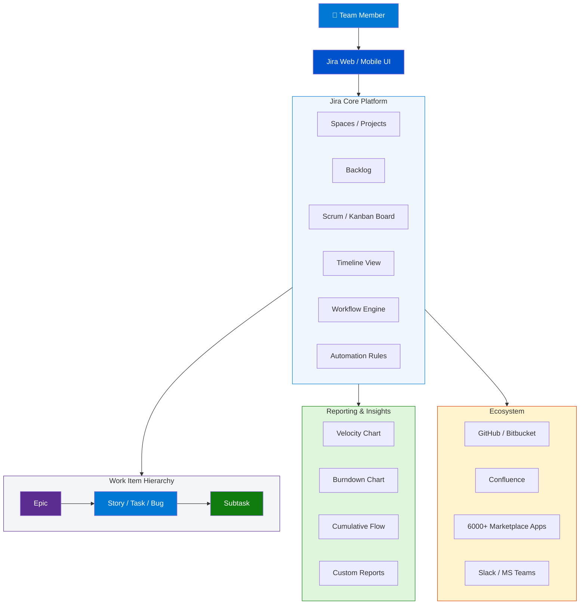
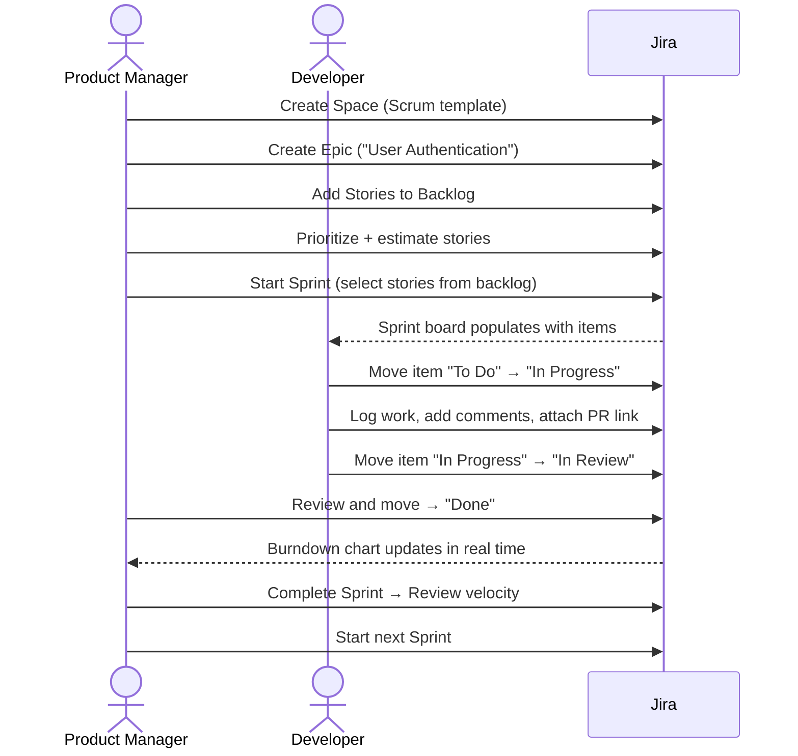

# Jira — How It Works: Complete Beginner's Reference

> **Source:** [YouTube — How Jira Works in 15 Minutes. NO EXPERIENCE Needed!](https://www.youtube.com/watch?v=8MIx4HLHljA)
> **Channel/Event:** YouTube · Beginner Tutorial
> **Topic:** Jira, Project Management, Agile, Scrum, Kanban, Atlassian
> **Key Claim:** Used by 300,000+ companies globally; supports software, marketing, ops, HR, and more

---

## Table of Contents

1. [Overview](#1-overview)
2. [Problem Statement](#2-problem-statement)
3. [Core Concepts](#3-core-concepts)
4. [Architecture](#4-architecture)
5. [Key Components](#5-key-components)
6. [How It Works — Step by Step](#6-how-it-works--step-by-step)
7. [Comparison Table — Scrum vs Kanban](#7-comparison-table--scrum-vs-kanban)
8. [Code Examples](#8-code-examples)
9. [Configuration Reference](#9-configuration-reference)
10. [Best Practices](#10-best-practices)
11. [Interview Talking Points](#11-interview-talking-points)
12. [Learning Resources](#12-learning-resources)

---

## 1. Overview

Jira is Atlassian's industry-leading project management platform used by over 300,000 companies to plan, track, and deliver work across every function — software development, marketing, operations, IT, and HR. At its core, Jira organizes work into **issues (tickets)**, places them on visual **boards** (Scrum or Kanban), and moves them through a customizable **workflow** from "To Do" to "Done."

Originally built for agile software teams, Jira has evolved into a general-purpose work management tool. Teams get shared visibility into who owns what, what the current status is, and how to report on progress — eliminating the chaos of spreadsheets and scattered emails.

The video walks a complete beginner through Jira's interface in under 15 minutes, covering project creation, board setup, issue types, sprints, and reporting with zero assumed experience.

---

## 2. Problem Statement

### Without Jira — The Classic Pain Points

| Problem | Impact |
|---|---|
| Work tracked in spreadsheets | Stale data, no real-time status, hard to filter |
| Task assignments via email | No audit trail, missed context, bottlenecks invisible |
| No sprint cadence | No delivery rhythm, scope creep unchecked |
| Status updates in meetings | Time wasted; team can't self-serve progress info |
| No single source of truth | Each team member has a different view of what "done" means |
| Dependency blind spots | Blockers discovered late, cascading delays |

> **Key Insight:** "Jira brings every team together to plan, track, and deliver any type of project with confidence — in one place."

---

## 3. Core Concepts

### Space (Project)
A container for all the work related to a team or initiative. Spaces can be based on Scrum, Kanban, or Bug Tracking templates. Formerly called "Projects" — now called **Spaces** in newer Jira versions.

### Work Item (Issue / Ticket)
The atomic unit of work in Jira. A work item can represent a story, bug, feature, task, epic, or subtask. Every item has an assignee, status, priority, and description.

### Epic
A large body of work that spans multiple sprints, broken down into smaller Stories or Tasks. Epics appear on the **Timeline** view for long-range planning.

### Story
A user-facing feature or requirement, typically written as "As a [user], I want [goal] so that [benefit]." Stories live inside Epics and are completed within a Sprint.

### Sprint
A time-boxed iteration (usually 1–2 weeks) in which the team commits to completing a set of Stories from the Backlog. Sprints are a Scrum concept — Kanban boards don't use them.

### Backlog
The ordered list of all work items not yet in a sprint. The Product Owner prioritizes it; the team pulls from the top during Sprint Planning.

### Workflow
The set of statuses a work item moves through (e.g., `To Do → In Progress → In Review → Done`). Workflows are fully customizable per project type.

### Board
The visual representation of active work. Columns on the board map to workflow statuses. Cards (work items) move left-to-right as work progresses.

---

## 4. Architecture



---

## 5. Key Components

| Component | Description | Key Capability |
|---|---|---|
| **Spaces** | Project containers (team-managed or company-managed) | Template selection: Scrum, Kanban, Bug Tracking |
| **Board** | Kanban or Scrum visual board | Drag-drop cards across status columns |
| **Backlog** | Prioritized queue of unstarted work | Sprint planning, story point estimation |
| **Timeline** | Gantt-style long-range planner | Dependency arrows, multi-sprint Epic tracking |
| **Workflow Engine** | Configures statuses + transitions per project | Custom rules (e.g., block transition if no assignee) |
| **Automation** | No-code trigger-action rules | Auto-assign, auto-close, notify on status change |
| **Insights / Reports** | Built-in agile metrics | Velocity, Burndown, Cumulative Flow, Cycle Time |
| **Marketplace** | 6,000+ apps and integrations | Time tracking, testing, GitOps, compliance |

### Boards in Detail

Jira supports two board types:

**Scrum Board** — Sprint-based. The active sprint is shown on the board. Items are pulled from the Backlog during Sprint Planning and must be completed by the sprint end date. Shows a Burndown Chart.

**Kanban Board** — Continuous flow. No sprints. Items move through columns with optional WIP (Work-In-Progress) limits per column. Shows a Cumulative Flow Diagram.

### Work Item Hierarchy

```
Epic  (quarters / months)
  └── Story / Task / Bug  (days / sprint)
        └── Subtask  (hours)
```

### Workflow Statuses (default)

```
To Do  →  In Progress  →  In Review  →  Done
```

Custom statuses example for engineering:
```
Backlog → Design → Development → Code Review → QA → Staging → Released
```

---

## 6. How It Works — Step by Step



**Step-by-step breakdown:**

1. **Create a Space** — Log in → Spaces dropdown → Choose template (Scrum / Kanban / Bug Tracking)
2. **Create Epics** — Top-level work groupings visible on the Timeline
3. **Build the Backlog** — Click Create → Add Stories, Bugs, Tasks; set priority and story points
4. **Plan a Sprint** — Drag items from Backlog into Sprint → Set start/end date → Start Sprint
5. **Work the Board** — Drag cards across columns as work progresses; assign teammates
6. **Track Progress** — Burndown Chart (Scrum) or Cumulative Flow (Kanban) auto-updates
7. **Complete Sprint** — Unfinished items roll back to Backlog; team reviews velocity

---

## 7. Comparison Table — Scrum vs Kanban

| Dimension | Scrum | Kanban |
|---|---|---|
| **Work cadence** | Time-boxed sprints (1–4 weeks) | Continuous flow, no sprints |
| **Planning** | Sprint Planning ceremony | Ongoing; pull when capacity available |
| **Board reset** | Board resets each sprint | Board is always active |
| **WIP limits** | Managed by sprint scope | Explicit column WIP limits |
| **Delivery schedule** | Predictable sprint-end releases | Whenever item reaches Done |
| **Key metric** | Velocity (story points/sprint) | Cycle Time (days from start to done) |
| **Main report** | Burndown Chart | Cumulative Flow Diagram |
| **Best for** | Product teams, feature development | Support teams, ops, maintenance work |
| **Ceremonies** | Planning, Daily Standup, Review, Retro | No mandatory ceremonies |
| **Estimation** | Story points required | Optional; size-based classes of service |

---

## 8. Code Examples

### Jira REST API — Create an Issue

```bash
curl -X POST \
  "https://your-domain.atlassian.net/rest/api/3/issue" \
  -H "Authorization: Basic $(echo -n user@example.com:API_TOKEN | base64)" \
  -H "Content-Type: application/json" \
  -d '{
    "fields": {
      "project": { "key": "MYPROJ" },
      "summary": "Fix login page redirect bug",
      "description": {
        "type": "doc",
        "version": 1,
        "content": [{
          "type": "paragraph",
          "content": [{ "type": "text", "text": "Login redirects to 404 after OAuth callback." }]
        }]
      },
      "issuetype": { "name": "Bug" },
      "priority": { "name": "High" },
      "assignee": { "accountId": "5b10a2844c20165700ede21g" }
    }
  }'
```

### Python — Jira REST API with `requests`

```python
import requests
from requests.auth import HTTPBasicAuth
import json

JIRA_URL = "https://your-domain.atlassian.net"
EMAIL = "user@example.com"
API_TOKEN = "your_api_token"

auth = HTTPBasicAuth(EMAIL, API_TOKEN)
headers = {"Accept": "application/json", "Content-Type": "application/json"}

# Create an issue
def create_issue(project_key: str, summary: str, issue_type: str = "Story") -> dict:
    payload = {
        "fields": {
            "project": {"key": project_key},
            "summary": summary,
            "issuetype": {"name": issue_type}
        }
    }
    response = requests.post(
        f"{JIRA_URL}/rest/api/3/issue",
        data=json.dumps(payload),
        headers=headers,
        auth=auth
    )
    return response.json()

# Transition an issue (e.g., move to "In Progress")
def transition_issue(issue_key: str, transition_id: str) -> int:
    payload = {"transition": {"id": transition_id}}
    response = requests.post(
        f"{JIRA_URL}/rest/api/3/issue/{issue_key}/transitions",
        data=json.dumps(payload),
        headers=headers,
        auth=auth
    )
    return response.status_code  # 204 = success

# Get all issues in a sprint
def get_sprint_issues(board_id: int, sprint_id: int) -> list:
    response = requests.get(
        f"{JIRA_URL}/rest/agile/1.0/board/{board_id}/sprint/{sprint_id}/issue",
        headers=headers,
        auth=auth
    )
    return response.json().get("issues", [])
```

### Get Available Transitions for an Issue

```bash
# Retrieve transition IDs to use in the transition call
curl -X GET \
  "https://your-domain.atlassian.net/rest/api/3/issue/MYPROJ-42/transitions" \
  -H "Authorization: Basic <base64_token>" \
  -H "Accept: application/json"
```

### Jira Automation — No-Code Rule Example

```yaml
# Auto-assign bug to QA lead when status changes to "In Review"
Trigger: Issue transitioned
  - From: In Progress
  - To: In Review
  - Issue type: Bug

Condition: Issue type = Bug

Action: Assign issue
  - Assignee: {{smart-values: project.qa_lead}}

Action: Send email
  - To: {{issue.assignee.emailAddress}}
  - Subject: "Bug ready for QA: {{issue.summary}}"
```

### Install Jira CLI (go-jira)

```bash
# macOS
brew install jira-cli

# Configure
jira init
# Enter: JIRA_URL, email, API token

# Common CLI commands
jira issue list --project MYPROJ --status "In Progress"
jira issue create --project MYPROJ --type Bug --summary "Fix login redirect"
jira sprint list --board 42
jira issue move MYPROJ-99 "Done"
```

---

## 9. Configuration Reference

### Space (Project) Settings

| Parameter | Options | Description |
|---|---|---|
| `Project type` | Team-managed / Company-managed | Controls admin access and workflow customization scope |
| `Board type` | Scrum / Kanban / Bug Tracking | Determines board behavior and available views |
| `Issue types` | Epic, Story, Task, Bug, Subtask + custom | Types of work items available in the project |
| `Workflow` | Default or custom | Statuses and allowed transitions |
| `Columns` | Mapped to workflow statuses | Visible stages on the board |
| `Sprint duration` | 1 / 2 / 3 / 4 weeks (Scrum only) | Default sprint length for new sprints |
| `Story points field` | Story Points (default) | Field used for capacity planning |
| `WIP limits` | Per-column integer (Kanban only) | Max cards in a column before flagging overflow |

### Issue Field Reference

| Field | Type | Notes |
|---|---|---|
| `summary` | String | Required; issue title |
| `issuetype` | Object `{name}` | Epic, Story, Task, Bug, Subtask |
| `priority` | Object `{name}` | Highest, High, Medium, Low, Lowest |
| `assignee` | Object `{accountId}` | Must be project member |
| `reporter` | Object `{accountId}` | Defaults to API caller |
| `labels` | Array of strings | Free-text tags |
| `story_points` | Number | Custom field; varies by instance |
| `sprint` | Object `{id}` | Agile-only field; requires board context |
| `parent` | Object `{key}` | Links Story to Epic |
| `duedate` | Date `YYYY-MM-DD` | Optional deadline |

---

## 10. Best Practices

### Backlog Management
- ✅ Keep backlog prioritized top-to-bottom at all times — highest priority items at the top
- ✅ Groom the backlog weekly: remove stale items, add detail to upcoming ones
- ❌ Don't let the backlog grow to 200+ items — it becomes noise

### Issue Hygiene
- ✅ Write clear summaries that describe the outcome, not the activity: "User can reset password via email" not "Password reset feature"
- ✅ Link related issues (blocks, is-blocked-by, relates-to) to surface dependencies early
- ❌ Don't create issues without an assignee and due date for in-flight work
- ❌ Don't use Sub-tasks when a separate Story would give better visibility

### Sprint Discipline
- ✅ Only pull what the team can realistically complete — use past velocity as the guide
- ✅ Leave 15–20% capacity buffer for unplanned bugs and interruptions
- ❌ Don't add new stories mid-sprint without removing an equivalent one ("swapping, not stuffing")
- ❌ Don't close a sprint with 40%+ incomplete — it signals broken estimation or scope creep

### Board Hygiene
- ✅ Keep "In Progress" column small — one item per person at a time (WIP limit principle)
- ✅ Review stale tickets (no activity >3 days) in daily standups
- ❌ Don't use the board as a dumping ground — unestimated or unprioritized items belong in the Backlog

### Workflow Design
- ✅ Model your actual team process — don't adopt the default statuses if they don't reflect reality
- ✅ Add a "Blocked" status or use Jira's flag feature to make impediments visible
- ❌ Don't create more than 7 workflow statuses — complexity slows adoption

---

## 11. Interview Talking Points

### "How does Jira support agile project management?"

> Jira provides two primary agile board types — Scrum and Kanban — that map directly to the two most popular agile frameworks. Scrum boards run sprint-based delivery cycles where the team commits to a time-boxed set of work items from the Backlog; Kanban boards manage continuous flow with WIP limits per column. Both give teams a shared visual workspace, eliminating status meetings and providing real-time transparency into work state. Jira also ships with built-in agile metrics — Velocity charts, Burndown charts, and Cumulative Flow Diagrams — enabling data-driven retrospectives.

---

### "What is the difference between a team-managed and company-managed project in Jira?"

> Team-managed projects (formerly "next-gen") give individual teams full control over their workflow, issue types, and board configuration without needing a Jira admin. They're fast to set up but lack some advanced configuration. Company-managed projects (formerly "classic") are administered centrally by Jira admins, allowing standardized workflows, permission schemes, and notification schemes across the organization. For enterprise environments where consistency and governance matter, company-managed is preferred; for small autonomous teams moving fast, team-managed is the practical choice.

---

### "How would you explain the Epic → Story → Task hierarchy to a non-technical stakeholder?"

> Think of Epics as large initiatives or quarterly objectives — for example, "Launch mobile app." Within that Epic, Stories represent specific user-facing capabilities: "Users can sign up with Google." Tasks are the technical sub-steps a developer takes to deliver the Story: "Integrate OAuth 2.0 library," "Write unit tests for auth flow." This hierarchy lets executives track Epic-level progress while engineers track daily task completion — everyone is looking at the same system, just at different zoom levels.

---

### "How does Jira integrate with development workflows?"

> Jira integrates natively with GitHub, GitLab, and Bitbucket. When a developer names a branch or commit with a Jira issue key (e.g., `git commit -m "PROJ-42: Fix login redirect"`), Jira automatically links that commit, branch, and pull request to the issue. This creates a full traceability chain: from the user story that motivated the change, to the code that implemented it, to the deployment that shipped it. Teams can also trigger Jira automation from CI/CD events — for example, auto-transitioning an issue to "Done" when the associated PR is merged.

---

### "What are WIP limits and why do they matter in Kanban?"

> WIP (Work-In-Progress) limits cap the number of items allowed in a board column at any given time. For example, if the "In Review" column has a WIP limit of 3 and four items arrive, Jira flags the overflow visually. The purpose is to surface bottlenecks rather than mask them — if reviews are piling up, it means the review process is the constraint, and the team should swarm on reviews rather than start new work. WIP limits enforce the lean principle "stop starting, start finishing," which reduces context switching and shortens average cycle time.

---

### "How would you use Jira's REST API in a CI/CD pipeline?"

> A common pattern is to call the Jira REST API from a CI pipeline to automatically transition issues when code ships. For example: after a successful deployment to production, the pipeline sends a `POST /rest/api/3/issue/{issueKey}/transitions` request with the "Done" transition ID. This keeps Jira in sync with actual deploy state without manual updates. Similarly, if a deployment fails, the pipeline can use the API to add a comment to the related issue and reopen it. The API uses HTTP Basic Auth with an API token, and all modern CI tools (GitHub Actions, Azure DevOps, Jenkins) support shell steps that can call it.

---

## 12. Learning Resources

| Resource | Link | Type |
|---|---|---|
| YouTube — How Jira Works in 15 Min | [Watch](https://www.youtube.com/watch?v=8MIx4HLHljA) | Video |
| Atlassian — Jira Getting Started Introduction | [Read](https://www.atlassian.com/software/jira/guides/getting-started/introduction) | Official Docs |
| Atlassian — 7 Steps to Get Started with Jira | [Read](https://www.atlassian.com/software/jira/guides/getting-started/basics) | Official Docs |
| Atlassian — Scrum with Jira | [Read](https://www.atlassian.com/agile/tutorials/how-to-do-scrum-with-jira) | Tutorial |
| Atlassian — Jira REST API Reference | [Read](https://developer.atlassian.com/cloud/jira/platform/rest/v3/intro/) | API Docs |
| Atlassian — Jira Automation | [Read](https://www.atlassian.com/software/jira/features/automation) | Feature Docs |
| Jira CLI (go-jira) | [GitHub](https://github.com/ankitpokhrel/jira-cli) | Tool |

---

*Last Updated: June 2026 | Source: YouTube — How Jira Works in 15 Minutes. NO EXPERIENCE Needed!*
