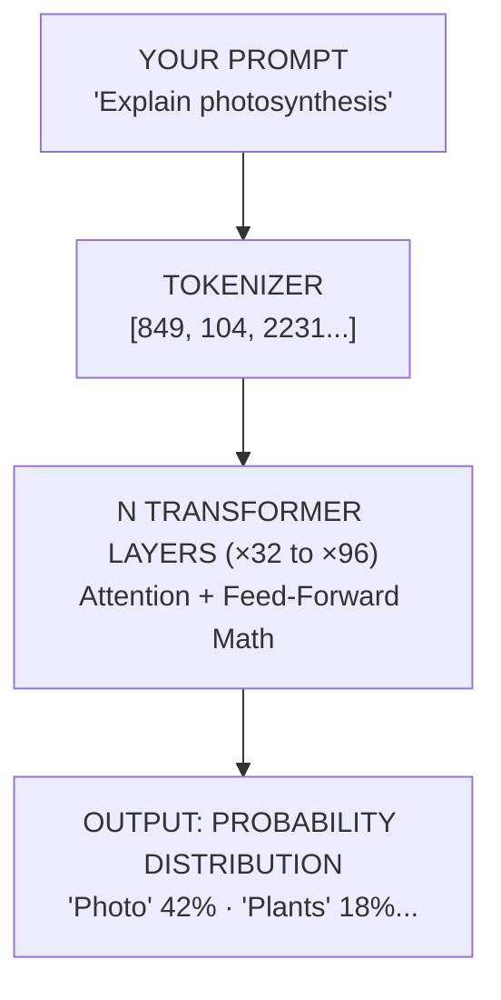
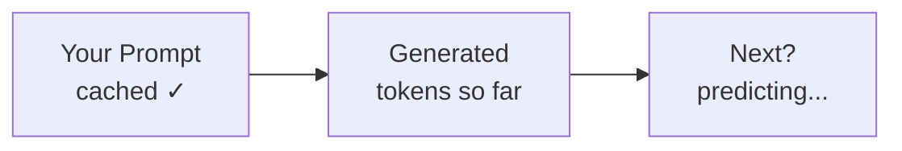
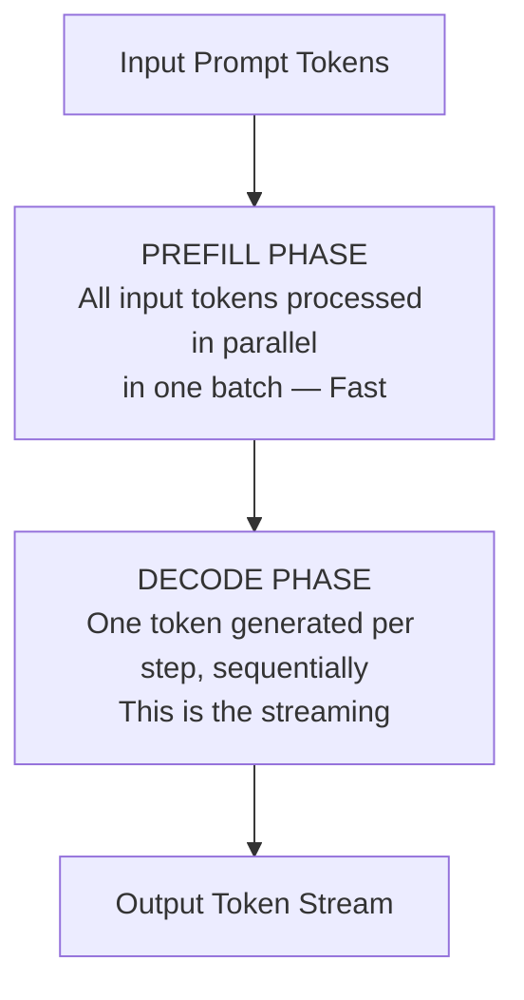
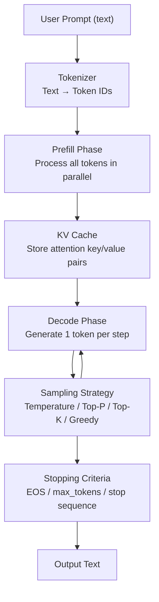

# LLM Inference Concepts

---

## Slide 02 / 10 — What is a Token?

**Q: What is a token and how do LLMs read text?**

LLMs don't read words — they read **tokens**. A token is roughly a word fragment.

> "Inference" → **"Infer"** + **"ence"**

**Tokenizing "Hello, how are you?"**

| Hello | , | how | are | you | ? | → 6 tokens |
|-------|---|-----|-----|-----|---|------------|

**Key facts:**
- ~1 token ≈ **¾ of a word** in English
- 100 tokens ≈ **75 words**
- GPT-4 has a **128k token** context window

---

## Slide 03 / 10 — Inference = Forward Pass

**Q: What happens during LLM inference at a technical level?**

Your tokens travel through **layers of math** and come out as probabilities for the next token.



---

## Slide 04 / 10 — Attention: How the Model "Focuses"

**Q: What is the attention mechanism in a transformer?**

For every token, the model asks: **"which other tokens matter most to predict the next word?"**

> **Example — "THE CAT SAT ON THE MAT":**
> Predicting after **"sat"**, the model pays strong attention to **"cat"** — the subject shapes what comes next.

**Key components:**
- **Query, Key, Value** — 3 matrices powering attention
- **Multi-head attention** — many "perspectives" in parallel
- Longer context = **more attention pairs** = more compute

---

## Slide 05 / 10 — How the Model Picks Next Words

**Q: How does a model decide which token to output next?**

The model scores every token in its ~50k vocabulary. A **sampling strategy** decides which to output.

| Strategy | Description |
|----------|-------------|
| **Temperature** | Low (0.1) = focused. High (1.5) = creative. |
| **Top-P** | Sample from tokens summing to P. `top_p=0.9` cuts unlikely tails. |
| **Top-K** | Sample from top K only. `top_k=50` = 50 candidates. |
| **Greedy** | Always picks #1 token. Deterministic, can repeat. |

---

## Slide 06 / 10 — Context Window & KV Cache

**Q: What is a context window and what is a KV Cache?**

Every token gets added back to context. A **KV Cache** saves prior attention computations so the model doesn't redo the work.



**Key facts:**
- Context window = the model's working **"memory"**
- KV Cache = **2–4× speed boost** during generation
- Bigger context = **more RAM/VRAM** required

---

## Slide 07 / 10 — Prefill vs Decode Phase

**Q: What are the two phases of LLM inference and why does streaming start slow?**

Two distinct stages with very different speeds — why your response starts slow then streams fast.



| Phase | Behaviour |
|-------|-----------|
| **Prefill** | All input tokens processed **in parallel** in one batch. Fast — the model "reads" your prompt at once. |
| **Decode** | One token generated **per step**, sequentially. Each word appearing one at a time. |

---

## Slide 08 / 10 — Why Inference Needs GPUs

**Q: Why do LLMs require GPUs and what is quantization?**

One forward pass through GPT-4 requires **trillions of operations**. CPUs take minutes. GPUs run in **parallel** — milliseconds.

| Metric | Value | Context |
|--------|-------|---------|
| **80 GB** | VRAM on A100 | Needed for 70B models |
| **312T** | FLOPs/sec | A100 peak throughput |
| **4-bit** | Quantization | 4× smaller model size |

**Quantization = Run on Your Laptop**

> Compresses weights from 16-bit to 4-bit. Small quality loss, but a **7B model can run on a MacBook**.

---

## Slide 09 / 10 — When Does Inference Stop?

**Q: How does a model know when to stop generating tokens?**

The model doesn't know when it's "done." It stops based on **stopping criteria**.

| Criteria | Description |
|----------|-------------|
| **EOS token** | A special end-of-sentence token it generates |
| **max_tokens** | A hard cap you set (e.g. 512) |
| **Stop sequences** | Custom strings like `\n\n` |
| **User interruption** | You hit stop mid-stream |

**Example — Calling inference via API:**

```python
# Calling inference via API
response = client.chat.completions.create(
    model="gpt-4o",
    messages=[{"role": "user", "content": prompt}],
    max_tokens=512, temperature=0.7,
)
```

---

## Summary — LLM Inference Pipeline


