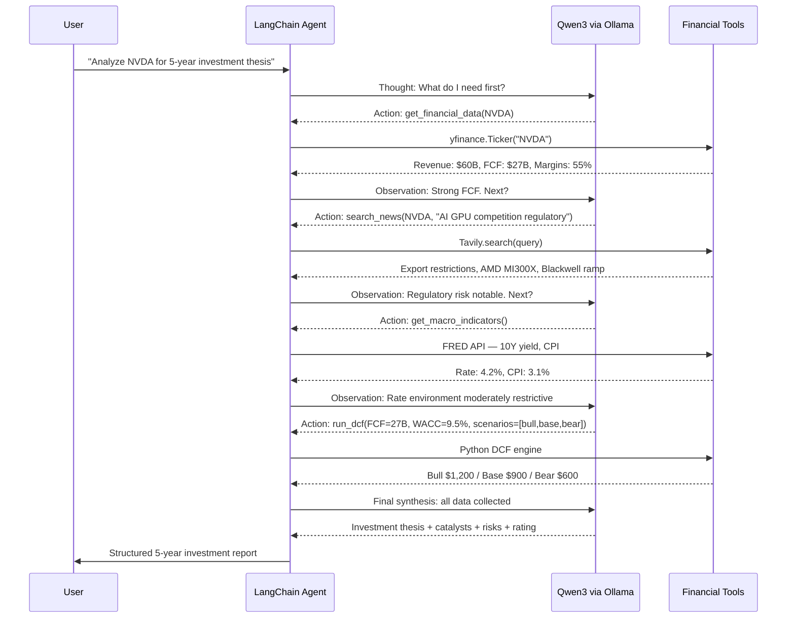
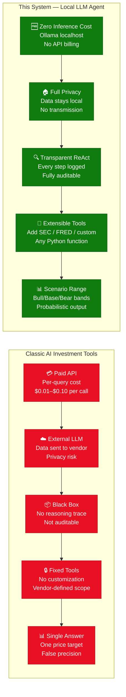
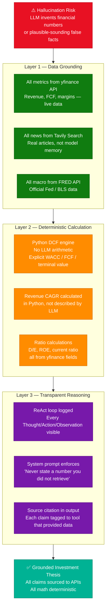

# LangChain-Powered Investment Research Agent with Ollama & Qwen3

> **Source:** [How I Built a LangChain Investment Research Agent](https://medium.com/@shahrukh.akhter486/how-i-built-a-langchain-powered-investment-research-agent-using-ollama-qwen3-financial-apis-and-1c927e9fa7e3) — Shahrukh Akhter, Medium
> **Last Updated:** July 2026

---

## Table of Contents

1. [What Is This System?](#1-what-is-this-system)
2. [Core Architecture](#2-core-architecture)
3. [Key Components and Tech Stack](#3-key-components-and-tech-stack)
4. [How It Works — 7-Stage Pipeline](#4-how-it-works--7-stage-pipeline)
5. [ReAct Agent — Technical Deep Dive](#5-react-agent--technical-deep-dive)
6. [Classic vs Local-LLM Comparison](#6-classic-vs-local-llm-comparison)
7. [Hallucination Prevention Strategy](#7-hallucination-prevention-strategy)
8. [Security and Governance](#8-security-and-governance)
9. [Getting Started](#9-getting-started)
10. [Interview Q&A Cheatsheet](#10-interview-qa-cheatsheet)

---

## 1. What Is This System?

A **locally-hosted, zero-cost investment research agent** that generates structured 5-year investment theses for publicly traded companies by combining financial APIs, news retrieval, and a local LLM (Qwen3 14B via Ollama), all orchestrated with LangChain's ReAct agent framework. It replaces opaque, per-query commercial AI investment tools with a fully transparent, auditable, privacy-preserving pipeline that runs on standard developer hardware.

**The core insight:** The LLM's role is *reasoning and synthesis*, not arithmetic. All quantitative calculations use deterministic Python code against real API data. The LLM only interprets, connects, and narrates.

### Key Value Propositions

| Feature | Description |
|---|---|
| **Zero LLM API cost** | All inference runs locally via Ollama — no per-token billing |
| **Full data privacy** | Portfolio data never leaves your machine — no third-party LLM transmission |
| **Transparent reasoning** | ReAct loop makes every inference step auditable and debuggable |
| **Grounded analysis** | All numbers from live financial APIs, not model hallucination |
| **Multi-scenario output** | Bull / Base / Bear cases with DCF valuation bands, not single price targets |
| **Extensible architecture** | Plug in new tools (SEC filings, earnings transcripts) without rewriting the agent |

---

## 2. Core Architecture

```mermaid
flowchart TD
    User(["👤 Analyst\n'Analyze AAPL'"])

    subgraph AgentLayer["LangChain Agent Layer"]
        Orchestrator["🤖 LangChain Agent\nReAct Orchestrator"]
        Memory["🗂 Conversation Memory\nContext Window"]
        Orchestrator <--> Memory
    end

    subgraph ToolLayer["Tool Layer — Deterministic Data"]
        YF["📊 yfinance\nRevenue / FCF / Margins\nROE / Debt ratios"]
        Tavily["📰 Tavily Search\nNews & Sentiment\nEarnings / Product / Regulatory"]
        FRED["🏦 FRED API\nMacroeconomic Indicators\nInterest rates / CPI / GDP"]
        DCF["🧮 Python DCF Engine\nValuation Bands\nBull / Base / Bear"]
    end

    subgraph LLMLayer["Local LLM Layer"]
        Ollama["⚙️ Ollama\nModel Server\nlocalhost:11434"]
        Qwen3["🧠 Qwen3 14B\nReasoning & Synthesis\nFinancial Chain-of-Thought"]
        Ollama --> Qwen3
    end

    subgraph OutputLayer["Output Layer"]
        Thesis["📋 Investment Thesis\n5-Year Structured Report"]
        Scenarios["📈 Scenario Valuations\nBull / Base / Bear DCF Bands"]
        Rating["⭐ Overall Rating\nCatalysts + Risk Register"]
    end

    User --> Orchestrator
    Orchestrator -->|"Tool calls"| YF
    Orchestrator -->|"Tool calls"| Tavily
    Orchestrator -->|"Tool calls"| FRED
    Orchestrator -->|"Python exec"| DCF
    YF & Tavily & FRED & DCF -->|"Retrieved data"| Orchestrator
    Orchestrator -->|"LLM chat"| Ollama
    Qwen3 -->|"Reasoning output"| Orchestrator
    Orchestrator --> Thesis
    Orchestrator --> Scenarios
    Orchestrator --> Rating

    classDef userNode    fill:#0078D4,stroke:#005A9E,color:#fff
    classDef aiNode      fill:#7719AA,stroke:#5A0E80,color:#fff
    classDef dataNode    fill:#107C10,stroke:#0A5C0A,color:#fff
    classDef processNode fill:#FF8C00,stroke:#CC7000,color:#fff
    classDef outputNode  fill:#00B294,stroke:#007D68,color:#fff
    classDef infraNode   fill:#605E5C,stroke:#3B3A39,color:#fff

    class User userNode
    class Orchestrator,Memory aiNode
    class YF,Tavily,FRED dataNode
    class DCF processNode
    class Ollama,Qwen3 infraNode
    class Thesis,Scenarios,Rating outputNode
```



### Why Qwen3 14B?

| Attribute | Detail |
|---|---|
| **Thinking mode** | Qwen3 has a built-in extended-thinking toggle (`thinking: true`) for deep multi-step reasoning |
| **Financial vocabulary** | Pre-trained on financial text including earnings reports and analyst notes |
| **Context window** | 32K tokens — sufficient to hold all tool outputs in a single synthesis pass |
| **Ollama compatibility** | `ollama pull qwen3:14b` — one command, no GGUF conversion needed |
| **Alternatives** | Llama 3.1 8B (faster, lighter), Mistral Nemo (multilingual), Phi-4 (Microsoft, efficient) |

---

## 3. Key Components and Tech Stack

| Component | Library / Service | Role |
|---|---|---|
| **Agent Framework** | LangChain `langchain-core` + `langchain-ollama` | Orchestration, tool-calling, ReAct loop |
| **Local LLM Server** | Ollama | OpenAI-compatible REST API at `localhost:11434` |
| **Language Model** | Qwen3 14B (`qwen3:14b`) | Multi-step financial reasoning and thesis synthesis |
| **Financial Data** | yfinance (`yfinance`) | Stock price, revenue, FCF, margins, balance sheet |
| **News & Sentiment** | Tavily Search API | Real-time web search with relevance ranking |
| **Macro Data** | FRED API (`fredapi`) | Interest rates (DFF), CPI, GDP growth, unemployment |
| **Valuation Engine** | Custom Python | DCF model with scenario-based terminal value |
| **Memory** | LangChain `ConversationBufferMemory` | Carries context across multi-turn analysis |

### Data Flow Per Tool

```
yfinance  → Revenue growth, FCF yield, gross/operating margins, ROE, D/E ratio
Tavily    → Top-N news articles ranked by relevance, earnings summaries
FRED      → Risk-free rate (10Y Treasury), CPI for real return calc
Python    → DCF: (FCF × growth scenarios) / (WACC - g), terminal value
Qwen3     → Interprets ALL above → generates thesis, catalysts, risks, rating
```

---

## 4. How It Works — 7-Stage Pipeline

```mermaid
flowchart LR
    S1["Stage 1\n📊 Financial\nData Retrieval\nyfinance"]
    S2["Stage 2\n🔍 Financial\nHealth Eval\nGrowth + Balance"]
    S3["Stage 3\n📰 News &\nSentiment\nTavily Search"]
    S4["Stage 4\n🏭 Industry\nAnalysis\nCAGR + Disruption"]
    S5["Stage 5\n🤖 ReAct\nIntegration\nReason+Act+Observe"]
    S6["Stage 6\n📈 Multi-Scenario\nValuation\nBull/Base/Bear"]
    S7["Stage 7\n🧮 DCF\nAnchoring\nValuation Bands"]

    S1 --> S2 --> S3 --> S4 --> S5 --> S6 --> S7

    classDef c1 fill:#0078D4,stroke:#005A9E,color:#fff
    classDef c2 fill:#7719AA,stroke:#5A0E80,color:#fff
    classDef c3 fill:#107C10,stroke:#0A5C0A,color:#fff
    classDef c4 fill:#FF8C00,stroke:#CC7000,color:#fff
    classDef c5 fill:#E81123,stroke:#B30D1A,color:#fff
    classDef c6 fill:#00B294,stroke:#007D68,color:#fff
    classDef c7 fill:#605E5C,stroke:#3B3A39,color:#fff

    class S1 c1
    class S2 c2
    class S3 c3
    class S4 c4
    class S5 c5
    class S6 c6
    class S7 c7
```



### Stage 1 — Financial Data Retrieval

**Tool:** `yfinance`  
**Principle:** Retrieve *deterministic* metrics — no LLM-generated numbers at this stage.

| Metric | yfinance Field | Purpose |
|---|---|---|
| Revenue growth (3Y CAGR) | `financials.loc["Total Revenue"]` | Growth trajectory |
| Free Cash Flow | `cashflow.loc["Free Cash Flow"]` | Capital generation quality |
| Operating Margin | `financials` derived | Profitability efficiency |
| Return on Equity | `info["returnOnEquity"]` | Capital allocation |
| Debt-to-Equity | `info["debtToEquity"]` | Balance sheet risk |
| Current Ratio | `info["currentRatio"]` | Liquidity health |

### Stage 2 — Financial Health Evaluation

**Decomposed LLM reasoning** (not raw scoring) on four sub-dimensions:

- **Growth quality:** Is revenue growth accelerating or decelerating? Is FCF tracking revenue or diverging?
- **Balance sheet strength:** Debt load vs. interest coverage; covenant risk
- **Capital allocation:** ROIC vs. WACC spread; buyback vs. reinvestment split
- **Risk flags:** Negative FCF, heavy dilution, covenant triggers

### Stage 3 — News and Sentiment Integration

**Tool:** Tavily Search  
Query pattern: `"{TICKER} {company_name} earnings product regulatory 2024 2025"`

| News Category | Captured Signal |
|---|---|
| Earnings releases | Revenue beats/misses, guidance revisions |
| Product launches | New revenue lines, addressable market expansion |
| Competitive news | Market share shifts, pricing pressure |
| Regulatory filings | Antitrust risk, compliance burden |
| Management changes | Leadership stability, strategic pivot signals |

### Stage 4 — Industry Analysis

**Tool:** Tavily + FRED + LLM synthesis

- **CAGR estimation:** Industry revenue compound growth from analyst reports
- **Structural opportunities:** Tailwinds (AI, electrification, nearshoring, etc.)
- **Structural challenges:** Commoditization, disruption vectors, regulatory headwinds
- **Macro linkage:** FRED rate environment impact on sector valuation multiples

### Stage 5 — Agent Integration via ReAct

See [Section 5](#5-react-agent--technical-deep-dive) for full deep dive.

### Stage 6 — Multi-Scenario Generation

Instead of a single price target (false precision), three probability-weighted scenarios:

| Scenario | Growth Assumption | Margin Assumption | Probability |
|---|---|---|---|
| **Bull Case** | Accelerated growth (+20–30% vs base) | Margin expansion (+200–400 bps) | 25% |
| **Base Case** | Normalized growth (historical CAGR) | Stable margins | 50% |
| **Bear Case** | Growth deceleration (−30–50% vs base) | Margin compression | 25% |

### Stage 7 — DCF Anchoring

```
Intrinsic Value = Σ (FCF_t / (1 + WACC)^t) + Terminal Value / (1 + WACC)^n

Terminal Value = FCF_n × (1 + g) / (WACC − g)

Where:
  WACC  = risk-free rate (FRED 10Y) + beta × equity risk premium
  g     = long-term GDP growth (FRED) ≈ 2.5%
  FCF_t = scenario-adjusted free cash flow per year t
```

Output is a **valuation band** across Bull/Base/Bear, not a single number.

---

## 5. ReAct Agent — Technical Deep Dive

**ReAct = Reason → Act → Observe** — a prompting pattern that interleaves thinking with tool execution in a loop.



### LangChain ReAct Implementation Pattern

```python
from langchain_ollama import ChatOllama
from langchain.agents import AgentExecutor, create_react_agent
from langchain_core.prompts import PromptTemplate
from langchain.tools import Tool

# 1. Initialize local LLM
llm = ChatOllama(
    model="qwen3:14b",
    base_url="http://localhost:11434",
    temperature=0.1,        # Low temp for factual financial reasoning
    num_ctx=32768,          # Full context window
)

# 2. Define tools
tools = [
    Tool(name="get_financial_data",
         func=get_financial_data,
         description="Retrieve revenue, FCF, margins, ROE, D/E for a stock ticker"),
    Tool(name="search_news",
         func=search_news,
         description="Search recent news about a company: earnings, products, regulatory"),
    Tool(name="get_macro_indicators",
         func=get_macro_indicators,
         description="Get FRED macro data: 10Y yield, CPI, GDP growth"),
    Tool(name="run_dcf_valuation",
         func=run_dcf,
         description="Run DCF model across Bull/Base/Bear scenarios. Returns valuation bands."),
]

# 3. ReAct prompt template
react_prompt = PromptTemplate.from_template("""
You are a professional investment analyst. Use the tools to gather data, then synthesize.
Always: retrieve real data before making claims. Never invent financial numbers.

Tools: {tools}
Tool names: {tool_names}

Question: {input}
Thought: {agent_scratchpad}
""")

# 4. Create agent + executor
agent = create_react_agent(llm, tools, react_prompt)
executor = AgentExecutor(
    agent=agent,
    tools=tools,
    verbose=True,           # Shows Thought/Action/Observation loop
    max_iterations=10,      # Safety cap on tool calls
    handle_parsing_errors=True,
)

# 5. Run
result = executor.invoke({"input": "Analyze AAPL for a 5-year investment thesis"})
print(result["output"])
```

### ReAct vs Chain vs Simple LLM

| Dimension | Simple LLM call | LangChain Chain | ReAct Agent |
|---|---|---|---|
| **Data source** | Model memory only | Fixed pipeline | Dynamic tool selection |
| **Reasoning steps** | Single pass | Predetermined | Iterative, adaptive |
| **Hallucination risk** | Very high (no grounding) | Medium (fixed grounding) | Low (data-first) |
| **New information** | Training cutoff | Tool-limited | Any tool can be added |
| **Debuggability** | Black box | Partially | Full step trace |
| **When to use** | Brainstorming | ETL pipelines | Research, analysis |

---

## 6. Classic vs Local-LLM Comparison



| Dimension | Commercial AI Tools (Bloomberg GPT, Perplexity Finance) | This Local Agent |
|---|---|---|
| **Cost** | $0.01–$0.10 per query; subscription fees | $0 (local inference) |
| **Data privacy** | Portfolio sent to vendor LLM | All data stays on-premise |
| **Reasoning transparency** | Black-box output | Full ReAct trace logged |
| **Data freshness** | Training cutoff or vendor-controlled | Live API: yfinance + Tavily |
| **Customizability** | Locked to vendor features | Add any Python tool |
| **Valuation method** | Vendor-defined (often hidden) | Explicit DCF with your WACC |
| **Output format** | Fixed templates | Configurable prompt templates |
| **Arithmetic accuracy** | LLM-generated numbers (risky) | Deterministic Python calculations |
| **Model choice** | Vendor-selected | Any Ollama model |
| **Latency** | 2–10 sec API round-trip | 5–30 sec local (GPU-dependent) |
| **Hardware needed** | None | 16 GB RAM for 14B at Q4 |
| **SEC filing support** | Partial (vendor) | Extensible via RAG + LlamaIndex |

**Use Local Agent when:** Privacy matters, cost at scale is a concern, you want full control over the valuation model.  
**Use Commercial tools when:** You need maximum accuracy on short-term price prediction, have no GPU, or need Bloomberg Terminal integration.

---

## 7. Hallucination Prevention Strategy

The three-layer defense against LLM fabrication in financial contexts:



### System Prompt Engineering for Grounding

```python
SYSTEM_PROMPT = """
You are a professional investment analyst with CFA-level expertise.

MANDATORY RULES:
1. NEVER state a financial metric (revenue, FCF, margin, price) that you did not 
   receive from a tool call in this conversation.
2. ALWAYS call get_financial_data BEFORE making any quantitative claims.
3. ALWAYS call run_dcf_valuation to produce price targets — never estimate them.
4. If a tool call fails, state: "Data unavailable — qualitative analysis only."
5. Distinguish FACT (from API) from JUDGMENT (your synthesis) using prefixes:
   - "Data shows: [metric from API]"
   - "Assessment: [your interpretation]"
"""
```

---

## 8. Security and Governance

### Data Privacy

| Control | Implementation |
|---|---|
| **On-premise inference** | Ollama runs at `localhost:11434` — no outbound LLM traffic |
| **API key isolation** | Tavily + FRED keys in `.env` — never hardcoded, never logged |
| **No persistent storage** | Agent memory is in-process only — no DB, no cloud sync |
| **Network isolation** | Can run fully air-gapped if Ollama model pre-pulled |

### Responsible AI Controls

| Risk | Mitigation |
|---|---|
| **Financial advice misuse** | Explicit disclaimer in output: "Analytical framework, not investment advice" |
| **Stale data** | All API calls made at query time — no caching beyond conversation |
| **Overconfidence** | Three-scenario output with explicit probability weights prevents single-answer bias |
| **Arithmetic errors** | All calculations delegated to Python — LLM never performs math |
| **Prompt injection** | System prompt locked; user input sanitized before tool calls |

### Compliance Notes

- This system produces **analytical output**, not regulated financial advice
- Output should be reviewed by a licensed financial advisor before acting
- FRED and yfinance data are public/open — no licensing concerns
- Tavily API usage subject to Tavily ToS (fair use for research)

---

## 9. Getting Started

### Prerequisites

```bash
# 1. Install Ollama
brew install ollama          # macOS
# or: curl -fsSL https://ollama.com/install.sh | sh  # Linux

# 2. Pull Qwen3 14B
ollama pull qwen3:14b

# 3. Verify Ollama is running
ollama serve &
curl http://localhost:11434/api/tags

# 4. Install Python dependencies
pip install langchain langchain-ollama langchain-community \
            yfinance fredapi tavily-python python-dotenv
```

### Environment Setup

```bash
# .env
TAVILY_API_KEY=tvly-xxxxxxxxxxxx
FRED_API_KEY=your_fred_api_key_here
OLLAMA_BASE_URL=http://localhost:11434
```

### Core Implementation

```python
import os
import yfinance as yf
from fredapi import Fred
from tavily import TavilyClient
from langchain_ollama import ChatOllama
from langchain.agents import AgentExecutor, create_react_agent
from langchain_core.prompts import PromptTemplate
from langchain.tools import Tool
from dotenv import load_dotenv

load_dotenv()

# --- Tool Implementations ---

def get_financial_data(ticker: str) -> dict:
    """Retrieve key financial metrics from yfinance."""
    t = yf.Ticker(ticker.upper())
    info = t.info
    return {
        "ticker": ticker.upper(),
        "revenue_ttm": info.get("totalRevenue"),
        "gross_margin": info.get("grossMargins"),
        "operating_margin": info.get("operatingMargins"),
        "roe": info.get("returnOnEquity"),
        "debt_to_equity": info.get("debtToEquity"),
        "free_cashflow": info.get("freeCashflow"),
        "current_ratio": info.get("currentRatio"),
        "market_cap": info.get("marketCap"),
        "pe_ratio": info.get("trailingPE"),
        "sector": info.get("sector"),
        "industry": info.get("industry"),
    }

def search_news(query: str) -> str:
    """Search recent news via Tavily."""
    client = TavilyClient(api_key=os.getenv("TAVILY_API_KEY"))
    results = client.search(query=query, max_results=5, search_depth="advanced")
    summaries = [f"- {r['title']}: {r['content'][:300]}" for r in results["results"]]
    return "\n".join(summaries)

def get_macro_indicators(_: str = "") -> dict:
    """Fetch key macro indicators from FRED."""
    fred = Fred(api_key=os.getenv("FRED_API_KEY"))
    return {
        "fed_funds_rate": float(fred.get_series("DFF").iloc[-1]),
        "10y_treasury": float(fred.get_series("DGS10").dropna().iloc[-1]),
        "cpi_yoy": float(fred.get_series("CPIAUCSL").pct_change(12).iloc[-1] * 100),
        "gdp_growth": float(fred.get_series("GDPC1").pct_change(4).iloc[-1] * 100),
    }

def run_dcf(params: str) -> str:
    """Run DCF across Bull/Base/Bear scenarios. Input: 'FCF=27B,WACC=9.5'"""
    # Parse simple string input from LLM
    import re
    fcf_match = re.search(r"FCF=(\d+\.?\d*)", params)
    wacc_match = re.search(r"WACC=(\d+\.?\d*)", params)
    fcf = float(fcf_match.group(1)) * 1e9 if fcf_match else 10e9
    wacc = float(wacc_match.group(1)) / 100 if wacc_match else 0.10

    scenarios = {
        "Bull":  {"growth": 0.20, "terminal_g": 0.03, "prob": 0.25},
        "Base":  {"growth": 0.12, "terminal_g": 0.025, "prob": 0.50},
        "Bear":  {"growth": 0.05, "terminal_g": 0.02, "prob": 0.25},
    }
    results = {}
    for name, s in scenarios.items():
        pv = sum(fcf * (1 + s["growth"])**t / (1 + wacc)**t for t in range(1, 6))
        terminal = (fcf * (1 + s["growth"])**5 * (1 + s["terminal_g"])
                    / (wacc - s["terminal_g"]) / (1 + wacc)**5)
        results[name] = round((pv + terminal) / 1e9, 1)
    return str(results)

# --- Agent Setup ---

llm = ChatOllama(model="qwen3:14b", base_url="http://localhost:11434", temperature=0.1)

tools = [
    Tool("get_financial_data", get_financial_data,
         "Get revenue, FCF, margins, ROE, D/E for a ticker. Input: ticker symbol"),
    Tool("search_news", search_news,
         "Search recent news for a company. Input: 'TICKER company earnings regulatory'"),
    Tool("get_macro_indicators", get_macro_indicators,
         "Get FRED macro: fed funds rate, 10Y yield, CPI, GDP. Input: empty string"),
    Tool("run_dcf_valuation", run_dcf,
         "DCF valuation. Input: 'FCF=27B,WACC=9.5' — returns Bull/Base/Bear values in $B"),
]

react_prompt = PromptTemplate.from_template("""
You are a CFA-level investment analyst. Use tools to gather data before making claims.
NEVER invent financial numbers — always retrieve them via tools.

Tools available: {tools}
Tool names: {tool_names}

Produce a structured 5-year investment thesis: financial health, catalysts, risks,
valuation scenarios, and a final rating (Strong Buy / Buy / Hold / Sell).

Question: {input}
{agent_scratchpad}
""")

agent = create_react_agent(llm, tools, react_prompt)
executor = AgentExecutor(agent=agent, tools=tools, verbose=True, max_iterations=12,
                         handle_parsing_errors=True)

if __name__ == "__main__":
    ticker = input("Enter ticker to analyze: ").strip().upper()
    result = executor.invoke({"input": f"Analyze {ticker} for a 5-year investment thesis"})
    print("\n" + "="*60)
    print(result["output"])
```

### Planned Multi-Agent Architecture

```python
# Future: supervisor + specialist agents
from langchain.agents import create_openai_tools_agent

financial_analyst  = create_react_agent(llm, [get_financial_data, run_dcf], ...)
news_researcher    = create_react_agent(llm, [search_news], ...)
risk_assessor      = create_react_agent(llm, [get_macro_indicators], ...)
supervisor         = create_react_agent(llm, [financial_analyst, news_researcher,
                                              risk_assessor], ...)
```

### Learning Resources

| Type | Resource |
|---|---|
| **Docs** | [LangChain Agents](https://python.langchain.com/docs/concepts/agents/) |
| **Docs** | [Ollama Model Library](https://ollama.com/library/qwen3) |
| **Docs** | [yfinance Reference](https://ranaroussi.github.io/yfinance/) |
| **Docs** | [FRED API Docs](https://fred.stlouisfed.org/docs/api/fred/) |
| **Docs** | [Tavily Search API](https://docs.tavily.com/) |
| **Paper** | [ReAct: Synergizing Reasoning and Acting in LLMs](https://arxiv.org/abs/2210.03629) |
| **Code** | Original Medium article by Shahrukh Akhter |

---

## 10. Interview Q&A Cheatsheet

**Q: What is the ReAct pattern and why is it used for financial analysis?**
> ReAct (Reason + Act) is an LLM prompting pattern that interleaves explicit reasoning steps with tool calls. Each iteration produces a Thought (what to do next), an Action (tool call), and an Observation (tool result), which are fed back into the LLM. For financial analysis, this is critical because it forces the model to *retrieve before reasoning*, preventing hallucination of financial metrics and making every conclusion traceable to a concrete data source.

**Q: Why use Ollama + Qwen3 instead of OpenAI GPT-4 for this use case?**
> Three reasons: (1) **Cost** — local inference has zero per-token cost; at scale (hundreds of tickers) GPT-4 would cost thousands of dollars monthly. (2) **Privacy** — portfolio positions and financial queries never leave the machine, which is critical in fund management contexts. (3) **Control** — the analyst can tune the model's system prompt, context window, and temperature without vendor restrictions. Qwen3 14B specifically offers extended thinking mode, making it strong at multi-step financial reasoning.

**Q: How does this system prevent the LLM from hallucinating financial numbers?**
> Three-layer defense: (1) All quantitative data is retrieved via APIs (yfinance, FRED) before the LLM sees it — the LLM reads retrieved numbers, it doesn't generate them. (2) All arithmetic (CAGR, DCF, ratio calculations) is delegated to Python code, not the LLM. (3) The system prompt explicitly instructs the model "never state a metric you did not receive from a tool call," and the ReAct loop logs every data source, making outputs auditable.

**Q: Why does the system produce Bull/Base/Bear scenarios instead of a single price target?**
> A single price target implies false precision — stock prices depend on outcomes that are genuinely probabilistic. The three-scenario DCF approach (Bull 25%, Base 50%, Bear 25% probability weights) produces a valuation band that reflects uncertainty honestly. Analysts can weight the scenarios differently based on their macro view, and the system shows sensitivity to growth and margin assumptions, which is more useful for risk management than a single number.

**Q: What is yfinance and what are its limitations for this use case?**
> yfinance is an open-source Python wrapper around Yahoo Finance's unofficial API. It provides historical price data, income statements, balance sheets, and cash flow statements. Limitations: (1) Data can lag official filings by hours to days; (2) Some international tickers have incomplete data; (3) The API is unofficial and can break without notice; (4) Intraday granularity is limited. For production use, replace with Bloomberg API, Refinitiv, or FactSet for guaranteed data quality and SLA coverage.

**Q: How would you extend this system to analyze 10-K SEC filings?**
> Add a RAG (Retrieval-Augmented Generation) layer using LlamaIndex or LangChain's document loaders. Pipeline: (1) Download 10-K PDFs from SEC EDGAR API (`https://efts.sec.gov/LATEST/search-index?q={ticker}&dateRange=custom`); (2) Chunk with a `RecursiveCharacterTextSplitter`; (3) Embed with a local model (e.g., `nomic-embed-text` via Ollama); (4) Store in ChromaDB or FAISS; (5) Add a `retrieval_tool` to the agent that queries this vector store. The LLM can then ask "What does the 10-K say about China revenue exposure?" and get exact quoted passages.

**Q: What is the difference between LangChain Chains and LangChain Agents?**
> A **Chain** is a fixed, predetermined sequence of LLM calls and tool invocations — the developer defines exactly what runs in what order. An **Agent** uses the LLM itself to *decide* which tools to call, in what order, and when to stop, based on the current state of the conversation. Chains are predictable and fast; agents are adaptive and can handle novel situations. For investment research — where you don't know ahead of time whether a company needs more news search or more DCF sensitivity analysis — an agent is the right choice.

**Q: How would you scale this to a production fund management system?**
> Five changes for production: (1) Replace Ollama with a self-hosted vLLM cluster for concurrent requests; (2) Add a message queue (Celery + Redis) to batch ticker analyses asynchronously; (3) Replace yfinance with a licensed data vendor (Bloomberg Terminal API); (4) Persist agent outputs to a structured DB (PostgreSQL) for audit and backtesting; (5) Add a human-in-the-loop review step where a licensed analyst approves outputs before they reach portfolio managers — required by most financial regulations.

---

*Sources: [Shahrukh Akhter — Medium, June 2026](https://medium.com/@shahrukh.akhter486/how-i-built-a-langchain-powered-investment-research-agent-using-ollama-qwen3-financial-apis-and-1c927e9fa7e3) | Enriched with LangChain agent architecture, ReAct pattern, DCF methodology, and financial AI domain knowledge | Last Updated: July 2026*
