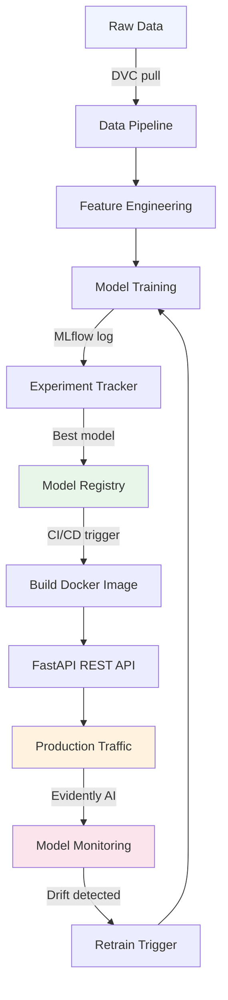
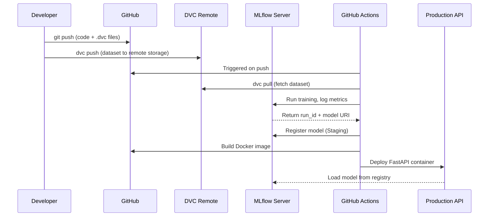

# How to Build an ML Project Using MLOps — Beginners Guide

> **Source:** [YouTube — How to build a ML project using MLOps | MLOps for Beginners](https://www.youtube.com/watch?v=eCjuoqUy8Is)
> **Channel/Event:** MLOps for Beginners
> **Topic:** MLOps, DVC, MLflow, FastAPI, Docker, GitHub Actions, Evidently AI, CI/CD, Model Registry
> **Key Claim:** Most ML models never reach production — MLOps bridges the gap between experiment notebooks and reliable, maintainable production systems.

---

## Table of Contents

1. [Overview](#1-overview)
2. [Problem Statement](#2-problem-statement)
3. [Core Concepts](#3-core-concepts)
4. [Architecture](#4-architecture)
5. [Key Components](#5-key-components)
6. [How It Works — Step by Step](#6-how-it-works--step-by-step)
7. [Comparison Table](#7-comparison-table)
8. [Code Examples](#8-code-examples)
9. [Configuration Reference](#9-configuration-reference)
10. [Best Practices](#10-best-practices)
11. [Interview Talking Points](#11-interview-talking-points)
12. [Learning Resources](#12-learning-resources)

---

## 1. Overview

MLOps (Machine Learning Operations) is a set of standardized practices for building, deploying, and governing the full lifecycle of ML models in production. This guide walks through a beginner-friendly end-to-end ML project using industry-standard MLOps tools — covering everything from data versioning and experiment tracking to model deployment and monitoring. The core idea: treat ML systems with the same engineering rigor as software systems, using automation, versioning, and reproducibility as first-class concerns.

---

## 2. Problem Statement

### Why Most ML Projects Fail in Production

| Problem | Impact |
|---|---|
| No data versioning | Experiments not reproducible; teammates can't replicate results |
| No experiment tracking | Can't compare runs; best model unknown |
| Manual deployment | Error-prone, slow, non-repeatable |
| No model monitoring | Silent failures — model degrades without anyone knowing |
| Siloed notebooks | Code works on one laptop, fails everywhere else |

> **Key Insight:** "~87% of ML models fail between the notebook and live traffic — MLOps closes the packaging-and-operations gap."

### Classic Approach Pain Points

| Classic Approach | MLOps Approach |
|---|---|
| Jupyter notebook only | Structured project with versioned code + data |
| `pickle` file emailed to ops | Model registry with metadata and versioning |
| Manual `python train.py` | Automated pipeline triggered by CI/CD |
| No monitoring | Drift detection with automated alerts |
| "It works on my machine" | Dockerized, reproducible environments |

---

## 3. Core Concepts

### MLOps
The intersection of ML, DevOps, and Data Engineering. It applies DevOps principles (CI/CD, version control, testing) to the machine learning lifecycle to make ML systems reliable and maintainable.

### Data Version Control (DVC)
An open-source tool that extends Git to track large datasets and binary files. Datasets are stored in remote storage (S3, GCS, Azure Blob) while lightweight `.dvc` pointer files are committed to Git.

### Experiment Tracking
Recording hyperparameters, metrics, artifacts, and metadata for each model training run so you can compare runs and reproduce any past result. MLflow is the standard tool.

### Model Registry
A central repository that stores versioned ML models along with their metadata, stage (Staging, Production, Archived), and lineage. Enables governance and safe rollbacks.

### Continuous Training (CT)
Automated retraining of models when new data arrives or when data drift is detected — an ML-specific addition to traditional CI/CD.

### Data Drift
The statistical change in input data distribution over time, which degrades model performance without any code change. Detected by tools like Evidently AI.

---

## 4. Architecture



---

## 5. Key Components

| Component | Tool/Service | Role |
|---|---|---|
| Source Control | Git + GitHub | Version code, configs, and DVC pointer files |
| Data Versioning | DVC | Track large datasets without bloating Git |
| Experiment Tracking | MLflow Tracking | Log metrics, params, artifacts per run |
| Model Registry | MLflow Model Registry | Store, version, and stage models |
| Model Serving | FastAPI | Expose model as a REST API endpoint |
| Containerization | Docker | Package model + dependencies reproducibly |
| CI/CD | GitHub Actions | Automate test → build → deploy on code push |
| Monitoring | Evidently AI | Detect data drift and model performance degradation |
| Orchestration | Prefect / Airflow | Schedule and manage pipeline DAGs |

### DVC
- Tracks data files, ML models, and intermediate pipeline stages
- Works as a Git plugin — `dvc add`, `dvc push`, `dvc pull`
- Remote backends: S3, GCS, Azure Blob, local NFS

### MLflow
Four core components:
- **Tracking** — log params, metrics, artifacts via `mlflow.log_param()`, `mlflow.log_metric()`
- **Projects** — packaging format for reproducible runs
- **Models** — standard model format for serving across frameworks
- **Registry** — lifecycle management (None → Staging → Production → Archived)

### FastAPI
- Async Python web framework for building REST APIs
- Auto-generates OpenAPI/Swagger docs at `/docs`
- Handles model loading at startup, predictions at `/predict`

### Evidently AI
- Generates HTML/JSON reports comparing reference data vs. current data
- Detects: data drift, data quality issues, target drift, regression/classification performance

---

## 6. How It Works — Step by Step



**Step-by-step breakdown:**

1. **Define the problem** — frame as ML task (classification, regression, etc.), identify data sources
2. **Set up project structure** — use a cookiecutter-style layout with `data/`, `models/`, `src/`, `tests/`
3. **Version data with DVC** — `dvc init`, `dvc add data/raw/`, `dvc remote add`, `dvc push`
4. **Train and track experiments** — wrap training script with `mlflow.start_run()`, log all params/metrics
5. **Register best model** — promote best run to MLflow Model Registry as "Staging"
6. **Serve with FastAPI** — load model from registry URI, expose `/predict` endpoint
7. **Containerize** — write `Dockerfile`, build image, test locally
8. **Automate with CI/CD** — GitHub Actions workflow: lint → test → train → register → deploy
9. **Monitor in production** — compare incoming request data against training distribution using Evidently

---

## 7. Comparison Table

| Dimension | Ad-Hoc ML | MLOps-Driven ML |
|---|---|---|
| Data management | Local files, manual copies | DVC-tracked, versioned, remote-backed |
| Experiment history | None / commented-out code | MLflow Tracking with full lineage |
| Model storage | `model.pkl` in a folder | MLflow Registry with stage promotions |
| Deployment | Manual `scp` or email | Automated CI/CD pipeline |
| Reproducibility | "It worked last Tuesday" | Any run reproducible from Git hash + DVC tag |
| Monitoring | None | Evidently AI drift reports |
| Collaboration | Share notebooks over email | Git-native, PR-based, team-friendly |
| Rollback | Delete file, retrain manually | Registry rollback in one command |

---

## 8. Code Examples

### Project Structure

```
ml-project/
├── data/
│   ├── raw/           # tracked by DVC
│   └── processed/     # tracked by DVC
├── models/            # tracked by DVC
├── src/
│   ├── data_prep.py
│   ├── train.py
│   └── predict.py
├── app/
│   └── main.py        # FastAPI app
├── tests/
├── Dockerfile
├── dvc.yaml           # pipeline definition
├── params.yaml        # hyperparameters
└── .github/
    └── workflows/
        └── ci.yaml
```

### DVC Setup & Data Versioning

```bash
# Initialize DVC in a Git repo
git init
dvc init

# Add dataset to DVC tracking
dvc add data/raw/dataset.csv

# Configure remote storage (S3 example)
dvc remote add -d myremote s3://my-bucket/dvc-store

# Push data to remote
dvc push

# Later: restore data on another machine
git pull
dvc pull
```

### MLflow Experiment Tracking

```python
import mlflow
import mlflow.sklearn
from sklearn.ensemble import RandomForestClassifier
from sklearn.metrics import accuracy_score

mlflow.set_experiment("churn-prediction")

with mlflow.start_run():
    # Log hyperparameters
    mlflow.log_param("n_estimators", 100)
    mlflow.log_param("max_depth", 5)

    # Train model
    model = RandomForestClassifier(n_estimators=100, max_depth=5)
    model.fit(X_train, y_train)

    # Log metrics
    accuracy = accuracy_score(y_test, model.predict(X_test))
    mlflow.log_metric("accuracy", accuracy)

    # Log model artifact
    mlflow.sklearn.log_model(model, "model", registered_model_name="ChurnModel")
```

### MLflow Model Registry — Promote to Production

```python
from mlflow.tracking import MlflowClient

client = MlflowClient()

# Transition model to Production stage
client.transition_model_version_stage(
    name="ChurnModel",
    version=3,
    stage="Production"
)
```

### FastAPI Model Server

```python
from fastapi import FastAPI
import mlflow.pyfunc
import pandas as pd

app = FastAPI()

# Load model from registry at startup
MODEL_URI = "models:/ChurnModel/Production"
model = mlflow.pyfunc.load_model(MODEL_URI)

@app.post("/predict")
def predict(data: dict):
    df = pd.DataFrame([data])
    prediction = model.predict(df)
    return {"prediction": int(prediction[0])}
```

### Dockerfile

```dockerfile
FROM python:3.10-slim

WORKDIR /app
COPY requirements.txt .
RUN pip install --no-cache-dir -r requirements.txt

COPY app/ .

CMD ["uvicorn", "main:app", "--host", "0.0.0.0", "--port", "8000"]
```

### GitHub Actions CI/CD Pipeline

```yaml
# .github/workflows/ci.yaml
name: MLOps Pipeline

on:
  push:
    branches: [main]

jobs:
  train-and-deploy:
    runs-on: ubuntu-latest
    steps:
      - uses: actions/checkout@v3

      - name: Set up Python
        uses: actions/setup-python@v4
        with:
          python-version: "3.10"

      - name: Install dependencies
        run: pip install -r requirements.txt

      - name: Pull data from DVC
        run: dvc pull
        env:
          AWS_ACCESS_KEY_ID: ${{ secrets.AWS_ACCESS_KEY_ID }}
          AWS_SECRET_ACCESS_KEY: ${{ secrets.AWS_SECRET_ACCESS_KEY }}

      - name: Run tests
        run: pytest tests/

      - name: Train model
        run: python src/train.py

      - name: Build and push Docker image
        run: |
          docker build -t my-ml-api:${{ github.sha }} .
          docker push my-registry/my-ml-api:${{ github.sha }}
```

### Evidently AI — Data Drift Report

```python
from evidently.report import Report
from evidently.metric_preset import DataDriftPreset
import pandas as pd

# reference_data = training data, current_data = production data
reference_data = pd.read_csv("data/raw/train.csv")
current_data = pd.read_csv("data/raw/production_sample.csv")

report = Report(metrics=[DataDriftPreset()])
report.run(reference_data=reference_data, current_data=current_data)

# Save HTML report
report.save_html("reports/drift_report.html")

# Check drift programmatically
result = report.as_dict()
drift_detected = result["metrics"][0]["result"]["dataset_drift"]
if drift_detected:
    print("⚠️ Drift detected — trigger retraining!")
```

---

## 9. Configuration Reference

### DVC Pipeline (`dvc.yaml`)

```yaml
stages:
  prepare:
    cmd: python src/data_prep.py
    deps:
      - src/data_prep.py
      - data/raw/dataset.csv
    outs:
      - data/processed/features.csv

  train:
    cmd: python src/train.py
    deps:
      - src/train.py
      - data/processed/features.csv
      - params.yaml
    params:
      - n_estimators
      - max_depth
    metrics:
      - metrics.json:
          cache: false
    outs:
      - models/model.pkl
```

### Hyperparameters (`params.yaml`)

```yaml
n_estimators: 100
max_depth: 5
test_size: 0.2
random_state: 42
```

### MLflow Environment Variables

| Variable | Purpose | Example |
|---|---|---|
| `MLFLOW_TRACKING_URI` | Remote tracking server URL | `http://mlflow-server:5000` |
| `MLFLOW_EXPERIMENT_NAME` | Default experiment name | `churn-prediction` |
| `MLFLOW_S3_ENDPOINT_URL` | Custom S3 endpoint for artifact storage | `https://s3.amazonaws.com` |

---

## 10. Best Practices

### Data Management
- ✅ Always version data with DVC — never commit raw CSVs to Git
- ✅ Keep a held-out test set that is never used during development
- ❌ Don't use local paths (`/home/user/data/...`) in pipeline configs

### Experiment Tracking
- ✅ Log every run — even failed ones are valuable signal
- ✅ Use tags to mark production candidates: `mlflow.set_tag("candidate", "true")`
- ❌ Don't hardcode hyperparameters in training scripts — use `params.yaml`

### Model Registry
- ✅ Always test in Staging before promoting to Production
- ✅ Document the reason for each stage transition in registry notes
- ❌ Don't delete old model versions — archive them instead for audit trail

### CI/CD
- ✅ Run unit tests on every push; run integration tests on merge to main
- ✅ Use secrets management (GitHub Secrets, Vault) — never hardcode credentials
- ❌ Don't deploy a model that hasn't been registered and staged in MLflow

### Monitoring
- ✅ Set up drift detection from day one, not as an afterthought
- ✅ Monitor both input drift AND prediction distribution drift
- ❌ Don't retrain blindly on new data — validate quality before triggering CT

---

## 11. Interview Talking Points

### "What is MLOps and why does it matter?"

> MLOps applies DevOps principles — version control, CI/CD, automated testing — to ML systems. It matters because most ML failures happen not during model training but during the operationalization phase: models that can't be reproduced, deployed, or maintained. MLOps provides the scaffolding to take a model from a notebook experiment to a reliable, monitored production service.

### "How do you version datasets in an MLOps pipeline?"

> I use DVC (Data Version Control), which works as a Git extension. Large data files are stored in a remote backend (S3, GCS, or Azure Blob) while lightweight `.dvc` pointer files are committed to Git. This means every Git commit corresponds to an exact version of both code and data, giving you full reproducibility. Running `dvc pull` on any historical commit restores the exact dataset used at that point.

### "Walk me through your experiment tracking setup."

> I use MLflow Tracking. Each training run is wrapped in an `mlflow.start_run()` context — I log all hyperparameters with `mlflow.log_param()`, metrics with `mlflow.log_metric()`, and the model artifact with `mlflow.log_model()`. The MLflow UI lets me compare runs side-by-side, filter by metric, and drill into any run's full lineage. The best run gets registered in the MLflow Model Registry and promoted through Staging before hitting Production.

### "How do you handle model drift in production?"

> I integrate Evidently AI into the monitoring pipeline. It compares the statistical distribution of production request data against the training reference data to detect data drift. I generate drift reports on a scheduled basis (daily or triggered by volume thresholds) and set up alerting when drift is detected above a threshold. This triggers a retraining pipeline that pulls fresh data, re-trains, runs through the same validation gates in CI, and promotes the new version to the registry.

### "What does your CI/CD pipeline look like for an ML project?"

> The pipeline is defined in GitHub Actions. On every push to main: (1) lint and unit tests run, (2) DVC pulls the versioned dataset, (3) the training script runs and logs to MLflow, (4) if metrics pass thresholds, the model is registered to the MLflow registry as Staging, (5) a Docker image is built and pushed to a container registry, (6) the image is deployed to the serving infrastructure. This ensures every production model has a full audit trail from Git commit to deployed artifact.

---

## 12. Learning Resources

| Resource | Link | Type |
|---|---|---|
| YouTube — MLOps for Beginners | [How to build a ML project using MLOps](https://www.youtube.com/watch?v=eCjuoqUy8Is) | Video |
| MLOps Guide (Community) | [mlops-guide.github.io](https://mlops-guide.github.io/) | Reference |
| MLflow Documentation | [mlflow.org/docs/latest](https://mlflow.org/docs/latest/index.html) | Official Docs |
| DVC Documentation | [dvc.org/doc](https://dvc.org/doc) | Official Docs |
| Evidently AI Docs | [docs.evidentlyai.com](https://docs.evidentlyai.com) | Official Docs |
| FastAPI Documentation | [fastapi.tiangolo.com](https://fastapi.tiangolo.com) | Official Docs |
| MLOps Zoomcamp (Free) | [DataTalks.Club MLOps Zoomcamp](https://github.com/DataTalks-Club/mlops-zoomcamp) | Free Course |
| ProjectPro MLOps Tutorial | [projectpro.io MLOps Python Tutorial](https://www.projectpro.io/data-science-in-python-tutorial/mlops-python-tutorial-for-beginners) | Tutorial |
| MLOps for Beginners — Medium | [Towards Data Science](https://towardsdatascience.com/machine-learning-operations-mlops-for-beginners-a5686bfe02b2/) | Article |

---

*Last Updated: June 2026 | Source: MLOps for Beginners — How to build a ML project using MLOps*
