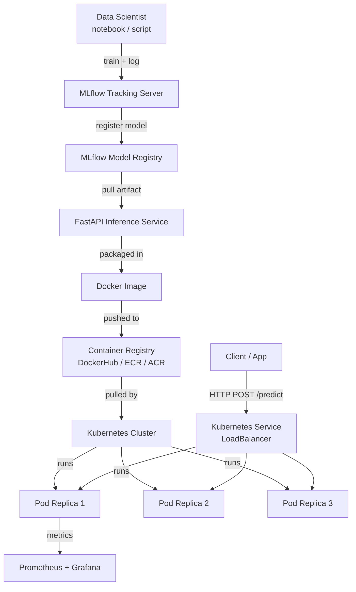
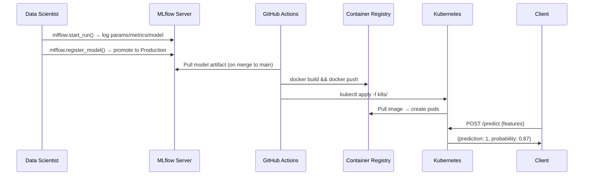

# Build and Deploy Your First MLOps Project to Kubernetes

> **Source:** [YouTube — Build and Deploy your First MLOps project in 40 minutes to Kubernetes](https://www.youtube.com/watch?v=hw17NDhjVHo)
> **Channel/Event:** Abhishek Veeramalla
> **Topic:** MLOps, Kubernetes, MLflow, FastAPI, Docker, scikit-learn, CI/CD
> **Key Claim:** ~87% of ML models fail between the notebook and live traffic — MLOps closes the packaging-and-operations gap.

---

## Table of Contents

1. [Overview](#1-overview)
2. [Problem Statement](#2-problem-statement)
3. [Core Concepts](#3-core-concepts)
4. [Architecture](#4-architecture)
5. [Key Components](#5-key-components)
6. [How It Works — Step by Step](#6-how-it-works--step-by-step)
7. [Comparison Table](#7-comparison-table)
8. [Code Examples](#8-code-examples)
9. [Configuration Reference](#9-configuration-reference)
10. [Best Practices](#10-best-practices)
11. [Interview Talking Points](#11-interview-talking-points)
12. [Learning Resources](#12-learning-resources)

---

## 1. Overview

This tutorial walks through the full lifecycle of an MLOps project: training a scikit-learn classification model, tracking experiments with MLflow, serving predictions via a FastAPI endpoint, packaging everything in Docker, and deploying to a Kubernetes cluster. The use-case is diabetes prediction from health metrics (glucose, BMI, age, etc.). The goal is to demonstrate that deploying ML to production requires the same engineering discipline as any other distributed system — version control, containerization, orchestration, and monitoring all apply.

---

## 2. Problem Statement

Most data scientists train models in Jupyter notebooks but struggle to get them running reliably in production. The gap is not the model quality — it's the lack of packaging, versioning, and operational infrastructure.

### Classic Approach Pain Points

| Problem | Impact |
|---|---|
| Model only runs on the data scientist's laptop | Not reproducible in CI or production |
| No experiment tracking | Can't compare runs or roll back to a better model version |
| Model served by ad-hoc scripts | No health checks, no scaling, no resilience |
| Manual deployment process | Slow release cycles, human error |
| No monitoring post-deployment | Model drift goes undetected |

> **Key Insight:** "The MLOps market is $4.39 billion in 2026 and projected to reach $89.91 billion by 2034 — because 87% of ML models never make it to production."

---

## 3. Core Concepts

### MLOps
The union of Machine Learning and DevOps practices. Applies CI/CD, version control, monitoring, and automation to the full ML lifecycle — from data ingestion to model serving and retraining.

### MLflow
An open-source platform for managing the ML lifecycle. Provides experiment tracking (logging metrics, parameters, artifacts), a model registry (versioning, staging), and deployment utilities.

### Model Registry
A centralized store that tracks model versions with metadata (accuracy, training date, status). Supports lifecycle stages: `None → Staging → Production → Archived`.

### Feature Store / Model Artifact
The serialized output of a training run — typically a `.pkl` (pickle) file or an MLflow-logged model directory. The artifact must be versioned alongside the code that produced it.

### Inference Server
A lightweight HTTP server (here: FastAPI) that loads a model artifact and exposes a `/predict` endpoint. Receives feature vectors, returns predictions.

---

## 4. Architecture



---

## 5. Key Components

| Component | Service/Tool | Role |
|---|---|---|
| Model Training | scikit-learn | Train RandomForestClassifier on diabetes dataset |
| Experiment Tracking | MLflow | Log params, metrics, and model artifacts per run |
| Model Registry | MLflow Registry | Version models, promote to Staging/Production |
| Inference API | FastAPI | Serve predictions over HTTP REST |
| Containerization | Docker | Package app + dependencies into a portable image |
| Local K8s Cluster | Kind / Minikube | Run Kubernetes locally for dev/testing |
| Orchestration | Kubernetes | Deploy, scale, and self-heal inference pods |
| CI/CD | GitHub Actions | Automate train → build → push → deploy pipeline |
| Monitoring | Prometheus + Grafana | Track latency, throughput, error rates post-deploy |

### MLflow Tracking Server

Runs as a server process (or SaaS via Databricks). Every training run calls `mlflow.start_run()` and logs:
- **Parameters:** `n_estimators`, `max_depth`, `test_size`
- **Metrics:** `accuracy`, `precision`, `recall`, `f1`, `roc_auc`
- **Artifacts:** serialized model, confusion matrix plot, feature importance chart

### FastAPI Inference Service

A minimal Python web application. On startup it loads the model artifact from the MLflow registry or a local path. On POST `/predict` it runs `model.predict()` and returns the result as JSON.

### Kubernetes Deployment

Three core Kubernetes objects are needed:
- **Deployment** — desired pod count, image, resource requests/limits, liveness/readiness probes
- **Service** — exposes pods via a stable DNS name and load balances traffic
- **ConfigMap / Secret** — inject MLflow tracking URI, model name, registry credentials

---

## 6. How It Works — Step by Step



**Step-by-step breakdown:**

1. **Data prep** — Load diabetes dataset (CSV or sklearn's built-in). Split into train/test (80/20). Scale features with `StandardScaler`.
2. **Training + tracking** — Wrap training in `with mlflow.start_run():`. Log all hyperparameters and evaluation metrics. Save model with `mlflow.sklearn.log_model()`.
3. **Model registration** — Promote the best run to the MLflow Model Registry. Tag it as `Production`.
4. **FastAPI service** — `app.py` loads the production model on startup. `/predict` endpoint accepts a JSON body of feature values.
5. **Dockerize** — Multi-stage `Dockerfile`: builder installs deps, final image copies app + model. Exposes port 8000.
6. **Push image** — `docker build -t <repo>/mlops-app:v1 . && docker push`.
7. **Deploy to Kubernetes** — Apply `Deployment`, `Service` manifests. Set `replicas: 3`. Configure liveness probe on `/health`.
8. **Verify** — `kubectl get pods`, `kubectl logs`, `curl http://<svc-ip>/predict`.

---

## 7. Comparison Table

| Dimension | Notebook-only (Before) | MLOps on Kubernetes (After) |
|---|---|---|
| Environment | Analyst's laptop | Reproducible Docker container |
| Model versioning | None / manual file naming | MLflow Model Registry with lifecycle stages |
| Serving | `flask run` in a terminal | Kubernetes Deployment with replicas |
| Scaling | Not possible | HPA (Horizontal Pod Autoscaler) |
| Rollback | Re-run old notebook | `kubectl rollout undo` |
| Monitoring | None | Prometheus metrics + Grafana dashboards |
| CI/CD | Manual | GitHub Actions pipeline |
| Reproducibility | Low | High (Docker + MLflow run IDs) |

---

## 8. Code Examples

### Python — Training with MLflow Tracking

```python
import mlflow
import mlflow.sklearn
from sklearn.ensemble import RandomForestClassifier
from sklearn.model_selection import train_test_split
from sklearn.metrics import accuracy_score, roc_auc_score
import pandas as pd

df = pd.read_csv("diabetes.csv")
X = df.drop("Outcome", axis=1)
y = df["Outcome"]
X_train, X_test, y_train, y_test = train_test_split(X, y, test_size=0.2, random_state=42)

with mlflow.start_run():
    params = {"n_estimators": 100, "max_depth": 5, "random_state": 42}
    mlflow.log_params(params)

    model = RandomForestClassifier(**params)
    model.fit(X_train, y_train)

    preds = model.predict(X_test)
    acc = accuracy_score(y_test, preds)
    auc = roc_auc_score(y_test, model.predict_proba(X_test)[:, 1])

    mlflow.log_metric("accuracy", acc)
    mlflow.log_metric("roc_auc", auc)
    mlflow.sklearn.log_model(model, "model", registered_model_name="DiabetesClassifier")
```

### Python — FastAPI Inference Service

```python
from fastapi import FastAPI
from pydantic import BaseModel
import mlflow.sklearn
import numpy as np

app = FastAPI(title="Diabetes Prediction API")

# Load model from MLflow registry on startup
model = mlflow.sklearn.load_model("models:/DiabetesClassifier/Production")

class Features(BaseModel):
    pregnancies: float
    glucose: float
    blood_pressure: float
    skin_thickness: float
    insulin: float
    bmi: float
    diabetes_pedigree: float
    age: float

@app.get("/health")
def health():
    return {"status": "ok"}

@app.post("/predict")
def predict(features: Features):
    X = np.array([[
        features.pregnancies, features.glucose, features.blood_pressure,
        features.skin_thickness, features.insulin, features.bmi,
        features.diabetes_pedigree, features.age
    ]])
    prediction = int(model.predict(X)[0])
    probability = float(model.predict_proba(X)[0][1])
    return {"prediction": prediction, "probability": probability}
```

### Dockerfile — Multi-Stage Build

```dockerfile
# Stage 1: build
FROM python:3.11-slim AS builder
WORKDIR /app
COPY requirements.txt .
RUN pip install --no-cache-dir -r requirements.txt

# Stage 2: runtime
FROM python:3.11-slim
WORKDIR /app
COPY --from=builder /usr/local/lib/python3.11/site-packages /usr/local/lib/python3.11/site-packages
COPY . .
EXPOSE 8000
CMD ["uvicorn", "app:app", "--host", "0.0.0.0", "--port", "8000"]
```

### Bash — Build and Push Image

```bash
docker build -t <dockerhub-user>/diabetes-mlops:v1 .
docker push <dockerhub-user>/diabetes-mlops:v1
```

### YAML — Kubernetes Deployment

```yaml
apiVersion: apps/v1
kind: Deployment
metadata:
  name: diabetes-api
spec:
  replicas: 3
  selector:
    matchLabels:
      app: diabetes-api
  template:
    metadata:
      labels:
        app: diabetes-api
    spec:
      containers:
        - name: diabetes-api
          image: <dockerhub-user>/diabetes-mlops:v1
          ports:
            - containerPort: 8000
          env:
            - name: MLFLOW_TRACKING_URI
              valueFrom:
                configMapKeyRef:
                  name: mlops-config
                  key: mlflow_uri
          livenessProbe:
            httpGet:
              path: /health
              port: 8000
            initialDelaySeconds: 15
            periodSeconds: 10
          readinessProbe:
            httpGet:
              path: /health
              port: 8000
            initialDelaySeconds: 5
            periodSeconds: 5
          resources:
            requests:
              memory: "256Mi"
              cpu: "250m"
            limits:
              memory: "512Mi"
              cpu: "500m"
---
apiVersion: v1
kind: Service
metadata:
  name: diabetes-api-svc
spec:
  selector:
    app: diabetes-api
  ports:
    - protocol: TCP
      port: 80
      targetPort: 8000
  type: LoadBalancer
```

### Bash — Deploy and Verify

```bash
# Create local cluster (Kind)
kind create cluster --name mlops-demo

# Apply manifests
kubectl apply -f k8s/deployment.yaml
kubectl apply -f k8s/service.yaml

# Check status
kubectl get pods -w
kubectl get svc diabetes-api-svc

# Test inference
curl -X POST http://<EXTERNAL-IP>/predict \
  -H "Content-Type: application/json" \
  -d '{"pregnancies":2,"glucose":130,"blood_pressure":70,"skin_thickness":28,
       "insulin":85,"bmi":30.5,"diabetes_pedigree":0.45,"age":35}'
```

---

## 9. Configuration Reference

| Parameter | Type | Default | Description |
|---|---|---|---|
| `MLFLOW_TRACKING_URI` | env var | `http://localhost:5000` | MLflow server endpoint |
| `MODEL_NAME` | env var | `DiabetesClassifier` | Registered model name in registry |
| `MODEL_STAGE` | env var | `Production` | Registry stage to load (`Staging`/`Production`) |
| `replicas` | K8s int | `1` | Number of pod replicas |
| `--port` | uvicorn | `8000` | FastAPI listening port |
| `initialDelaySeconds` | K8s probe | `15` | Seconds before first liveness check |
| `resources.requests.memory` | K8s | `256Mi` | Minimum memory guaranteed per pod |
| `resources.limits.cpu` | K8s | `500m` | Maximum CPU per pod (500 millicores = 0.5 core) |

---

## 10. Best Practices

### Model Versioning
- ✅ Always register models to the MLflow registry, never reference artifact paths directly
- ✅ Tag production models with the run ID and git commit SHA
- ❌ Don't use `latest` image tags in Kubernetes — pin to a specific version

### Containerization
- ✅ Use multi-stage Docker builds to keep final images small
- ✅ Pin all Python dependency versions in `requirements.txt`
- ❌ Don't bake secrets or credentials into the Docker image — use Kubernetes Secrets

### Kubernetes Operations
- ✅ Always define liveness and readiness probes — K8s won't route traffic to unready pods
- ✅ Set resource requests AND limits — prevents noisy-neighbor issues
- ✅ Use `kubectl rollout undo deployment/<name>` for instant rollback
- ❌ Don't run pods as root — use a non-root user in the Dockerfile

### CI/CD Pipeline
- ✅ Trigger the full pipeline (train → evaluate → build → deploy) on merge to main
- ✅ Gate deployment on a minimum accuracy threshold (e.g., accuracy > 0.85)
- ❌ Don't deploy a model that hasn't been promoted to `Production` in the registry

### Monitoring
- ✅ Instrument FastAPI with `prometheus-fastapi-instrumentator` — track request latency by endpoint
- ✅ Set alerts for prediction drift (distribution of input features shifting over time)
- ❌ Don't assume a model stays accurate — schedule periodic retraining jobs

---

## 11. Interview Talking Points

### "What is MLOps and why does it matter?"

> MLOps applies DevOps principles — version control, CI/CD, monitoring — to the machine learning lifecycle. It matters because ~87% of models fail between the notebook and production, usually not due to model quality but due to missing engineering infrastructure around packaging, reproducibility, and operations. MLflow handles experiment tracking and model versioning; Docker and Kubernetes handle packaging and deployment at scale.

---

### "How do you version ML models in production?"

> I use the MLflow Model Registry. Every training run is logged with parameters, metrics, and the model artifact. Once a run meets the accuracy threshold, I register it with `mlflow.register_model()` and promote it to `Production`. The Kubernetes deployment loads the model by stage (`models:/ModelName/Production`), so a promotion in the registry instantly governs which model gets loaded on the next pod restart — no code change required.

---

### "How does a Kubernetes Deployment differ from just running a Docker container?"

> A raw `docker run` gives you a single container with no self-healing, no scaling, and no rolling update capability. A Kubernetes Deployment defines the desired state — e.g., 3 replicas of the inference pod. If a pod crashes, Kubernetes restarts it. If I push a new image, a rolling update gradually replaces old pods without downtime. I also get liveness/readiness probes, resource quotas, and horizontal pod autoscaling — none of which exist with a bare container.

---

### "How would you do a zero-downtime model update?"

> Kubernetes rolling updates are the default strategy. I push a new Docker image tagged `v2`, update the `image:` field in the Deployment manifest, and run `kubectl apply`. Kubernetes brings up new pods running `v2`, waits for their readiness probes to pass, then terminates the old `v1` pods. No traffic interruption. If `v2` has issues, `kubectl rollout undo deployment/diabetes-api` reverts instantly. On the MLflow side, I change the Production model to the new registered version before the deploy, keeping model artifact and container image in sync.

---

### "How do you monitor an ML model in production?"

> Two layers: **infrastructure monitoring** with Prometheus + Grafana (latency, error rate, pod CPU/memory) and **model monitoring** for data drift and prediction drift. For data drift, I compare the distribution of incoming feature values against the training distribution — a significant shift (e.g., glucose values suddenly clustering differently) signals retraining is needed. For prediction drift, I track the ratio of positive predictions over time. Prometheus `fastapi-instrumentator` handles the infrastructure layer automatically; model monitoring requires logging input/output to a store (e.g., S3 or a DB) and running periodic drift checks.

---

### "What's the difference between MLflow's Tracking Server and Model Registry?"

> The Tracking Server is a logging backend — it records every experiment run's parameters, metrics, and artifacts. Think of it as the experiment history. The Model Registry is a governance layer on top — it stores versioned model artifacts with lifecycle stages (Staging, Production, Archived) and provides a named, stage-based URI for loading models. You can have a Tracking Server without a Registry, but a production setup needs both: the registry is what the inference service reads from, providing a stable reference that's independent of the run ID.

---

## 12. Learning Resources

| Resource | Link | Type |
|---|---|---|
| YouTube Tutorial (Abhishek Veeramalla) | [Watch](https://www.youtube.com/watch?v=hw17NDhjVHo) | Video |
| MLflow — Deploy to Kubernetes Tutorial | [Read](https://mlflow.org/docs/latest/ml/deployment/deploy-model-to-kubernetes/tutorial/) | Official Docs |
| MLflow — Deploy to Kubernetes Overview | [Read](https://mlflow.org/docs/latest/ml/deployment/deploy-model-to-kubernetes/) | Official Docs |
| KodeKloud — Deploy ML Models with Docker & K8s | [Read](https://kodekloud.com/blog/deploy-ml-models-with-docker-k8s/) | Tutorial |
| Google Cloud — MLOps Continuous Delivery | [Read](https://docs.cloud.google.com/architecture/mlops-continuous-delivery-and-automation-pipelines-in-machine-learning) | Architecture Guide |
| GitHub — Sample MLOps Repo (dpleus/mlops) | [Browse](https://github.com/dpleus/mlops) | Code |

---

*Last Updated: June 2026 | Source: Abhishek Veeramalla — Build and Deploy your First MLOps Project to Kubernetes*
