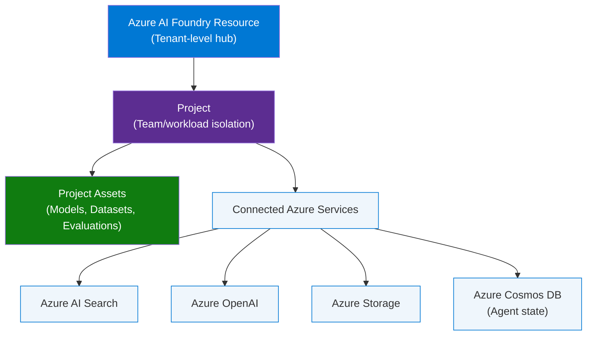
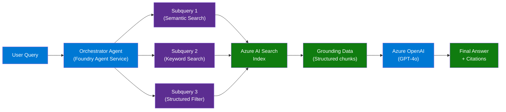
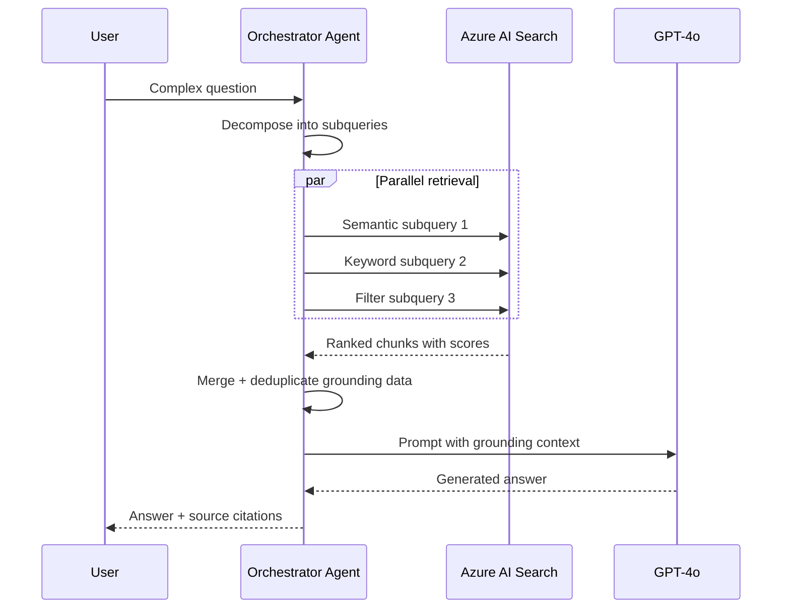

# Microsoft AI & ML Interview Questions — Real Answers That Get You Hired

> **Source:** [Top 10 Microsoft AI & ML Interview Questions](https://www.youtube.com/watch?v=sro6j0-IpiY)  
> **Published:** April 2026  
> **Topic:** Azure AI Foundry, Agentic RAG, Responsible AI, ML Evaluation

---

## 1. Overview

This video covers the top 10 interview questions asked at Microsoft for AI/ML roles, with structured answers using Microsoft's own terminology. The questions span Azure AI Foundry architecture, Responsible AI, RAG pipeline design, ML evaluation metrics, and agentic orchestration — the exact domains assessed in Principal AI Architect and Senior ML Engineer interviews.

### Classic Approach Pain Points
| Problem | Impact |
|---|---|
| Answering AI questions with generic ML theory | Screened out — Microsoft expects Azure-specific answers |
| Not knowing Foundry's resource hierarchy | Fails system design rounds |
| Treating RAI as compliance checkbox | Signals junior thinking |
| Conflating RAG with simple vector search | Misses the agentic pattern shift |

> **Key Insight:** "Microsoft doesn't just want you to know AI — they want you to know *their* AI. Every answer should reference a specific Azure service."

---

## 2. Problem Statement

Microsoft AI interviews test depth across the full Azure AI stack — from infrastructure (Foundry resource model) to application patterns (Agentic RAG) to governance (Responsible AI principles). Generic ML knowledge is insufficient; candidates must demonstrate hands-on familiarity with Azure AI Foundry, Azure AI Search, Semantic Kernel, and the RAI framework.

---

## 3. Core Concepts

### Azure AI Foundry
Microsoft's unified platform for building, deploying, and governing enterprise AI applications. Replaces Azure ML Studio + Azure OpenAI Studio with a single resource hierarchy.

### Agentic RAG
A retrieval-augmented generation pattern where an orchestrator agent decomposes queries into parallel subqueries, retrieves structured grounding data, and synthesizes a final answer — beyond simple single-vector lookup.

### Responsible AI (RAI)
Microsoft's framework of 7 principles treated as engineering constraints, not compliance checklists. Each principle maps to specific tooling (Content Safety, Fairness indicators, Transparency notes).

### Retrieval Drift
Degradation in RAG retrieval quality over time as the knowledge base grows or user query patterns shift — detected via grounding score monitoring and corrected by index tuning.

### Foundry Agent Service
A codeless orchestration layer within Azure AI Foundry that manages multi-step agent workflows, persisting state in Cosmos DB and coordinating tool calls without custom middleware.

---

## 4. Architecture

### Azure AI Foundry Resource Hierarchy



### Agentic RAG Pipeline



---

## 5. Key Components

| Component | Azure Service | Role |
|---|---|---|
| Foundry Hub | Azure AI Foundry | Tenant-wide resource, billing, governance |
| Project | Azure AI Foundry Project | Workload isolation, team access control |
| Orchestrator | Foundry Agent Service | Codeless multi-step agent coordination |
| Agent State | Azure Cosmos DB | Persists conversation turns, tool call history |
| Retrieval | Azure AI Search | Hybrid search (semantic + keyword + filter) |
| Generation | Azure OpenAI | GPT-4o / o1 model hosting |
| Evaluation | Azure AI Foundry Evals | Groundedness, coherence, relevance scoring |
| Safety | Azure AI Content Safety | RAI guardrails at inference time |

---

## 6. How It Works — Step by Step

### Agentic RAG Flow



**Steps:**
1. User submits a complex, multi-part query
2. Orchestrator agent (Foundry Agent Service) decomposes it into parallel subqueries
3. Each subquery hits Azure AI Search using different retrieval strategies simultaneously
4. Results are merged, deduplicated, and ranked by grounding score
5. Consolidated grounding data is passed to GPT-4o as context
6. Model generates a grounded answer with citations back to source chunks
7. Orchestrator returns the answer with provenance metadata

---

## 7. Comparison Table

| Dimension | Classic RAG | Agentic RAG |
|---|---|---|
| Query handling | Single vector lookup | Parallel decomposed subqueries |
| Retrieval strategy | Semantic only | Hybrid: semantic + keyword + filter |
| Orchestration | Application code | Foundry Agent Service (codeless) |
| State management | Stateless | Cosmos DB persisted state |
| Grounding data | Raw text chunks | Structured chunks with metadata |
| Drift detection | Manual / none | Grounding score monitoring |
| Multi-turn support | Limited | Native via agent memory |

---

## 8. Code Examples

### Python — Azure AI Foundry Project Connection

```python
from azure.ai.projects import AIProjectClient
from azure.identity import DefaultAzureCredential

client = AIProjectClient(
    subscription_id="<subscription-id>",
    resource_group_name="<resource-group>",
    project_name="<project-name>",
    credential=DefaultAzureCredential()
)

# List available models in this project
models = client.models.list()
for model in models:
    print(f"{model.name}: {model.deployment_name}")
```

### Python — Hybrid Search with Azure AI Search

```python
from azure.search.documents import SearchClient
from azure.search.documents.models import VectorizedQuery
from azure.core.credentials import AzureKeyCredential

search_client = SearchClient(
    endpoint="https://<service>.search.windows.net",
    index_name="<index>",
    credential=AzureKeyCredential("<api-key>")
)

# Hybrid search: semantic + keyword
results = search_client.search(
    search_text="Azure AI Foundry architecture",
    vector_queries=[
        VectorizedQuery(
            vector=embedding_vector,
            k_nearest_neighbors=5,
            fields="contentVector"
        )
    ],
    query_type="semantic",
    semantic_configuration_name="default",
    top=5
)
```

### Python — Evaluate RAG Groundedness

```python
from azure.ai.evaluation import GroundednessEvaluator
from azure.ai.projects import AIProjectClient

project_client = AIProjectClient(...)
evaluator = GroundednessEvaluator(model_config=project_client.inference.get_azure_openai_client())

score = evaluator(
    response="Azure AI Foundry uses Cosmos DB for agent state.",
    context="Foundry Agent Service persists multi-turn state in Azure Cosmos DB."
)
print(f"Groundedness: {score['groundedness']}")  # 1-5 scale
```

### Install / Setup

```bash
pip install azure-ai-projects azure-ai-evaluation azure-search-documents azure-identity

# Login
az login
az account set --subscription "<subscription-id>"

# Create Foundry resource
az cognitiveservices account create \
  --name myFoundryHub \
  --resource-group myRG \
  --kind AIServices \
  --sku S0 \
  --location eastus
```

---

## 9. Configuration Reference

| Parameter | Type | Default | Description |
|---|---|---|---|
| `k_nearest_neighbors` | int | 5 | Top-K chunks returned per vector query |
| `query_type` | string | `simple` | `semantic` enables L2 reranking |
| `semantic_configuration_name` | string | `default` | Semantic ranker config in the index |
| `groundedness_threshold` | float | 3.0 | Below this score triggers retrieval retry |
| `agent_thread_ttl` | int | 3600 | Cosmos DB session TTL in seconds |
| `max_parallel_subqueries` | int | 3 | Concurrent subquery fan-out limit |

---

## 10. Best Practices

### Azure AI Foundry Setup
- ✅ Create one Foundry Hub per organization, multiple Projects per team
- ✅ Use Managed Identity for all service-to-service auth (no API keys in code)
- ❌ Don't create a Foundry resource per project — it duplicates billing and governance overhead
- ❌ Don't use API keys for production — DefaultAzureCredential is the correct pattern

### RAG Pipeline Design
- ✅ Use hybrid search (semantic + keyword + filter) — vector-only misses exact-match queries
- ✅ Monitor groundedness scores in production; set alerts below threshold 3.0/5
- ✅ Structure index chunks with metadata fields (source, date, section) for filter subqueries
- ❌ Don't treat retrieval as a one-shot step — Agentic RAG fans out to parallel subqueries
- ❌ Don't ignore retrieval drift — index quality degrades as corpus grows without tuning

### Responsible AI
- ✅ Apply Content Safety filters at both input (prompt) and output (completion) layers
- ✅ Document model cards for every deployed model — required for enterprise governance
- ❌ Don't treat RAI as a post-deployment concern — wire guardrails at design time
- ❌ Don't conflate fairness with accuracy — they are separately measured dimensions

---

## 11. Interview Talking Points

### "How does Azure AI Foundry differ from Azure ML Studio?"

> Azure AI Foundry is Microsoft's unified platform that consolidates Azure ML Studio and Azure OpenAI Studio into a single resource hierarchy: Foundry Hub → Project → Project Assets → Connected Services. The key difference is that Foundry is purpose-built for generative AI workloads — it ships with a native Agent Service backed by Cosmos DB for state persistence, built-in evaluation frameworks, and Content Safety integration. Azure ML Studio remains relevant for classical ML workflows and MLOps pipelines, but Foundry is the answer for LLM-based application development.

### "Describe how you would build a production RAG pipeline on Azure."

> I would implement Agentic RAG using Azure AI Foundry's Agent Service as the orchestrator. When a user query arrives, the agent decomposes it into parallel subqueries — semantic, keyword, and filter-based — and fans them out to Azure AI Search simultaneously. The search index uses hybrid retrieval with semantic reranking enabled. Retrieved chunks are merged, scored by groundedness, and passed as grounding context to GPT-4o via Azure OpenAI. The agent persists multi-turn state in Cosmos DB so follow-up queries have conversation history. I would instrument groundedness scores in Azure Monitor and alert when retrieval quality degrades — that's how you catch retrieval drift before users notice.

### "How does Microsoft approach Responsible AI?"

> Microsoft's RAI framework has 7 principles: Fairness, Reliability & Safety, Privacy & Security, Inclusiveness, Transparency, Accountability, and the newer Sustainability dimension. The key thing I'd emphasize in an interview is that Microsoft treats these as engineering constraints, not compliance checkboxes. Each principle maps to specific tooling: Content Safety for safety and reliability, Fairness Indicators in Azure ML for bias measurement, Transparency Notes as required documentation for every deployed model. I have applied this by integrating Content Safety at both the prompt and completion layers of our RAG pipeline, and documenting model cards for each deployment.

### "What is retrieval drift and how do you detect it?"

> Retrieval drift is the degradation in RAG retrieval quality that occurs as the knowledge base scales or user query patterns evolve. The index that performed well at launch may return lower-relevance chunks six months later because the corpus has grown, document distributions shifted, or new query intents emerged that the semantic embeddings weren't trained for. I detect it by monitoring groundedness scores from Azure AI Foundry's evaluation framework — if the average drops below a threshold (typically 3.0/5), it signals the retrieval layer needs attention. Remediation includes re-chunking with smaller segments, refreshing embeddings, tuning the semantic ranker configuration, and adding filter-based subqueries to narrow retrieval scope.

### "How would you evaluate an LLM-based application before shipping?"

> I run a multi-dimensional evaluation using Azure AI Foundry's built-in evaluators across four axes: Groundedness (does the answer match the retrieved context?), Coherence (is the answer internally consistent?), Relevance (does it address the user's question?), and Fluency (is the language natural?). I build a golden dataset of 50-100 question/answer pairs with known correct sources, run the full pipeline against it, and set pass thresholds for each metric. Beyond automated evals, I do red-teaming with adversarial prompts to test the Content Safety layer. The evaluation suite runs on every deployment via CI/CD so regressions are caught before production.

### "What is the Foundry Agent Service and when would you use it?"

> Foundry Agent Service is the codeless orchestration layer inside Azure AI Foundry for building multi-step agentic workflows. It manages tool call sequencing, handles retries, and persists conversation state in Cosmos DB — so you get multi-turn memory without writing state management code. I use it when the task requires more than a single LLM call: for Agentic RAG with parallel retrieval, for tool-using agents that call APIs or run code, or for workflows that need human-in-the-loop approval steps. The alternative would be Semantic Kernel or LangChain for custom orchestration, but Foundry Agent Service is the right default for Azure-native workloads because it integrates natively with the rest of the Foundry resource model.

---

## 12. Learning Resources

| Resource | Link | Type |
|---|---|---|
| Azure AI Foundry Docs | https://learn.microsoft.com/azure/ai-foundry/ | Official Docs |
| Azure AI Search Hybrid Search | https://learn.microsoft.com/azure/search/hybrid-search-overview | Official Docs |
| Azure AI Evaluation SDK | https://learn.microsoft.com/azure/ai-foundry/how-to/develop/evaluate-sdk | Official Docs |
| Microsoft Responsible AI | https://www.microsoft.com/ai/responsible-ai | Official Docs |
| Foundry Agent Service | https://learn.microsoft.com/azure/ai-foundry/agents/overview | Official Docs |
| Source Video | https://www.youtube.com/watch?v=sro6j0-IpiY | Video |

---

*Last Updated: June 2026 | Source: YouTube — Top 10 Microsoft AI & ML Interview Questions*
