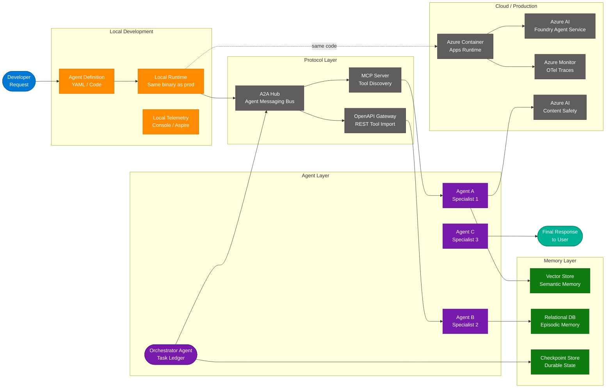
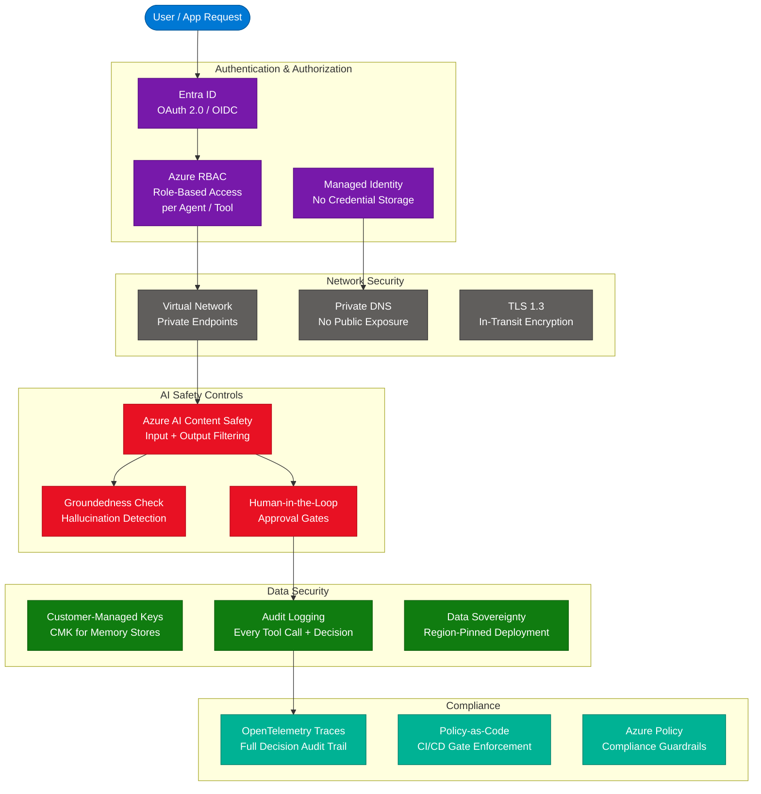

# Microsoft Agent Framework — Open-Source Engine for Agentic AI

> **Sources:** [Microsoft Foundry Blog — Introducing Microsoft Agent Framework](https://devblogs.microsoft.com/foundry/introducing-microsoft-agent-framework-the-open-source-engine-for-agentic-ai-apps/)
> **Authors:** Takuto Higuchi, Shawn Henry, Elijah Straight
> **Last Updated:** June 2026

---

## Table of Contents

1. [What is Microsoft Agent Framework?](#1-what-is-microsoft-agent-framework)
2. [Core Architecture — Four Pillars](#2-core-architecture--four-pillars)
3. [Key Components and Services](#3-key-components-and-services)
4. [How It Works — Technical Deep Dive](#4-how-it-works--technical-deep-dive)
5. [Orchestration Patterns](#5-orchestration-patterns)
6. [Classic vs New — SK & AutoGen vs Agent Framework](#6-classic-vs-new--sk--autogen-vs-agent-framework)
7. [Migration Paths](#7-migration-paths)
8. [Security and Governance](#8-security-and-governance)
9. [Getting Started](#9-getting-started)
10. [Enterprise Adoption](#10-enterprise-adoption)
11. [Interview Q&A Cheatsheet](#11-interview-qa-cheatsheet)

---

## 1. What is Microsoft Agent Framework?

Microsoft Agent Framework is a **unified open-source SDK and runtime** that consolidates capabilities from Semantic Kernel and AutoGen into a single, production-ready platform for building multi-agent AI systems. Announced in October 2025 by the Azure AI Foundry team, it bridges the gap between AI research prototyping and enterprise production deployment.

The framework addresses three core pain points that previously blocked production adoption:
- **API fragmentation** — incompatible interfaces across open-source agent frameworks
- **Dev-to-cloud gap** — local prototypes did not map cleanly to cloud deployments
- **Missing enterprise features** — observability, compliance, durability, and security were afterthoughts

Agent Framework is not a replacement for Semantic Kernel or AutoGen — both projects remain active — but it is now the primary investment focal point, unifying their strengths into a single coherent platform.

### Key Value Propositions

| Feature | Description |
|---|---|
| **Unified SDK** | Combines SK enterprise connectors + AutoGen multi-agent research patterns |
| **Protocol-first** | Native MCP, A2A, and OpenAPI support out of the box |
| **Cloud-agnostic** | Deploy to containers, on-premises, Azure, AWS, or multi-cloud |
| **Production-ready** | Durability, checkpointing, human-in-the-loop, CI/CD pipelines |
| **Declarative definitions** | YAML/JSON agent specs for version control and team templates |
| **Enterprise security** | Entra ID, RBAC, Content Safety, VNet integration |

---

## 2. Core Architecture — Four Pillars

```mermaid
flowchart TD
    User(["Developer / Enterprise App"])

    subgraph Pillar1["Pillar 1 — Open Standards"]
        MCP["MCP\nModel Context Protocol\nTool Discovery"]
        A2A["A2A\nAgent-to-Agent\nCross-Runtime Messaging"]
        OA["OpenAPI-First\nREST Integration\nNo Custom Wrappers"]
        CloudAgnostic["Cloud-Agnostic Runtime\nContainer / On-Prem / Multi-Cloud"]
    end

    subgraph Pillar2["Pillar 2 — Research-to-Production"]
        Sequential["Sequential\nOrchestration"]
        Concurrent["Concurrent\nOrchestration"]
        GroupChat["Group Chat\nOrchestration"]
        Handoff["Handoff\nOrchestration"]
        Dynamic["Dynamic Task Ledger\nAgentic Orchestration"]
    end

    subgraph Pillar3["Pillar 3 — Extensible by Design"]
        Connectors["Built-in Connectors\nAzure AI Foundry, Graph,\nFabric, SharePoint, MongoDB"]
        Memory["Pluggable Memory\nRedis, Pinecone, Qdrant,\nWeaviate, PostgreSQL"]
        Declarative["Declarative Specs\nYAML / JSON\nVersion-Controlled"]
    end

    subgraph Pillar4["Pillar 4 — Production Ready"]
        OTel["OpenTelemetry\nObservability"]
        Security["VNet + Entra ID\nRBAC + Content Safety"]
        Durability["Checkpointing\nPause / Resume\nError Recovery"]
        HITL["Human-in-the-Loop\nApproval Workflows"]
        CICD["CI/CD\nGitHub Actions\nAzure DevOps"]
    end

    Output(["Production Multi-Agent App"])

    User --> Pillar1
    Pillar1 --> Pillar2
    Pillar2 --> Pillar3
    Pillar3 --> Pillar4
    Pillar4 --> Output

    classDef userNode    fill:#0078D4,stroke:#005A9E,color:#fff
    classDef p1Node      fill:#7719AA,stroke:#5A0E80,color:#fff
    classDef p2Node      fill:#FF8C00,stroke:#CC7000,color:#fff
    classDef p3Node      fill:#107C10,stroke:#0A5C0A,color:#fff
    classDef p4Node      fill:#00B294,stroke:#007D68,color:#fff
    classDef outputNode  fill:#605E5C,stroke:#3B3A39,color:#fff

    class User userNode
    class MCP,A2A,OA,CloudAgnostic p1Node
    class Sequential,Concurrent,GroupChat,Handoff,Dynamic p2Node
    class Connectors,Memory,Declarative p3Node
    class OTel,Security,Durability,HITL,CICD p4Node
    class Output outputNode
```



### Pillar 1: Open Standards & Interoperability

- **MCP (Model Context Protocol):** Dynamic tool discovery and invocation — agents find and call tools without hardcoded bindings
- **Agent-to-Agent (A2A):** Cross-runtime collaboration via structured async messaging; agents from different runtimes can hand off tasks
- **OpenAPI-first:** Any REST API becomes an agent tool automatically through OpenAPI spec import — no custom wrapper code
- **Cloud-agnostic runtime:** Same binary runs in a Docker container locally, in Azure Container Apps, on-premises, or across clouds

### Pillar 2: Research-to-Production Pipeline

Supports five orchestration topologies, allowing developers to choose the right pattern per use case without rewriting agent logic:

- **Sequential:** Steps execute in order; output of one agent feeds the next
- **Concurrent:** Fan-out parallel execution; results merged via aggregator
- **Group Chat:** LLM-moderated multi-turn discussion between specialized agents
- **Handoff:** One agent transfers control with context to another based on topic/capability
- **Dynamic Task Ledger:** Orchestrator generates and tracks a dynamic work queue, routing tasks as they emerge

### Pillar 3: Extensible by Design

**Built-in Connectors:**
| Category | Services |
|---|---|
| Microsoft | Azure AI Foundry, Microsoft Graph, Microsoft Fabric, SharePoint, Azure Logic Apps |
| Third-party | Oracle, Amazon Bedrock, MongoDB, Elastic |
| SaaS | Thousands via Azure Logic Apps connectors |

**Memory Backends (Pluggable):**
- **Vector stores:** Redis, Pinecone, Qdrant, Weaviate, Elasticsearch
- **Relational:** PostgreSQL with pgvector extension
- **Custom:** Implement `IMemoryStore` interface for any backend

**Declarative Agent Specs:**
```yaml
name: ResearchAgent
description: Searches and summarizes technical documents
model: gpt-4o
tools:
  - type: web_search
  - type: file_search
    index: my-azure-ai-search-index
memory:
  backend: qdrant
  collection: agent-memory
instructions: |
  You are a technical research specialist. Always cite sources.
```

### Pillar 4: Production Readiness

- **OpenTelemetry:** Every agent call emits traces, spans, and metrics to Azure Monitor, Grafana, or any OTel-compatible backend
- **Durability:** Checkpointing saves agent state to durable storage — resume after failure or planned pause without replay
- **Human-in-the-Loop:** Define approval gates; agents pause and surface decisions to human reviewers before proceeding
- **CI/CD Integration:** Agent definitions are declarative files — branch, PR, test, and deploy agents just like application code

---

## 3. Key Components and Services

| Component | Layer | Role |
|---|---|---|
| **Agent** | Core | Stateful unit with tools, memory, instructions, and an LLM backbone |
| **Tool** | Core | Callable function — built-in (web search, code interpreter) or custom via MCP/OpenAPI |
| **Workflow** | Orchestration | Graph-based multi-agent topology with typed edges and checkpointing |
| **ChatAgent** | Specialization | Multi-turn conversation agent (replaces AutoGen's AssistantAgent) |
| **Memory Store** | State | Pluggable vector/relational backend for episodic and semantic memory |
| **Task Ledger** | Orchestration | Dynamic work queue managed by the orchestrator in agentic patterns |
| **@ai_function** | Python API | Decorator auto-inferring tool schema from type hints — no manual JSON schema |
| **ChatMessage** | Messaging | Unified message type replacing AutoGen's multiple message classes |
| **IMemoryStore** | Extensibility | Interface for custom memory backend plugins |
| **OTel Instrumentation** | Observability | Auto-emitted traces + spans for every agent call and tool use |

---

## 4. How It Works — Technical Deep Dive



**Step-by-step execution flow:**

1. **Developer defines the agent** — using YAML declarative spec or Python/C# code with `@ai_function` decorators on tools
2. **Local runtime starts** — identical binary to production; telemetry emits to local console or .NET Aspire dashboard
3. **Orchestrator receives task** — creates a task ledger, plans sub-tasks, assigns to specialist agents
4. **Protocol negotiation** — agents discover tools via MCP, communicate via A2A structured messages, call REST APIs via OpenAPI gateway
5. **Specialist agents execute** — each agent queries memory (vector/relational), calls tools, generates partial results
6. **State checkpoint saved** — at each milestone, state is serialized to durable store; failure at any step triggers resume, not full replay
7. **Human-in-the-loop gate** — if an approval workflow is defined, agent pauses and surfaces decision to reviewer
8. **Results aggregated** — orchestrator collects outputs, synthesizes final response, emits OTel spans
9. **Same code deploys to cloud** — `az containerapp up` deploys the same runtime image to Azure; zero code rewrites needed

---

## 5. Orchestration Patterns

```mermaid
flowchart TD
    Input(["User Task"])

    subgraph Sequential["Sequential Orchestration"]
        S1["Agent 1\nData Fetch"] --> S2["Agent 2\nAnalysis"] --> S3["Agent 3\nReport"]
    end

    subgraph Concurrent["Concurrent Orchestration"]
        C0["Splitter"] --> C1["Agent A\nPath 1"]
        C0 --> C2["Agent B\nPath 2"]
        C0 --> C3["Agent C\nPath 3"]
        C1 --> Agg["Aggregator"]
        C2 --> Agg
        C3 --> Agg
    end

    subgraph GroupChat["Group Chat Orchestration"]
        Mod["LLM Moderator"] --> GA["Domain Expert A"]
        Mod --> GB["Domain Expert B"]
        GA --> Mod
        GB --> Mod
    end

    subgraph Handoff["Handoff Orchestration"]
        H1["Triage Agent"] -->|"topic: billing"| H2["Billing Agent"]
        H1 -->|"topic: tech"| H3["Tech Support Agent"]
    end

    subgraph Dynamic["Dynamic Task Ledger"]
        DOrch["Orchestrator\nTask Ledger"] -->|"creates tasks"| DT1["Task 1"]
        DOrch --> DT2["Task 2"]
        DT1 -->|"spawns"| DT3["Task 3"]
        DT2 --> DOrch
    end

    Input --> Sequential
    Input --> Concurrent
    Input --> GroupChat
    Input --> Handoff
    Input --> Dynamic

    classDef userNode    fill:#0078D4,stroke:#005A9E,color:#fff
    classDef aiNode      fill:#7719AA,stroke:#5A0E80,color:#fff
    classDef processNode fill:#FF8C00,stroke:#CC7000,color:#fff
    classDef dataNode    fill:#107C10,stroke:#0A5C0A,color:#fff
    classDef outputNode  fill:#00B294,stroke:#007D68,color:#fff

    class Input userNode
    class S1,S2,S3 aiNode
    class C0,Agg processNode
    class C1,C2,C3 aiNode
    class Mod,GA,GB aiNode
    class H1,H2,H3 aiNode
    class DOrch processNode
    class DT1,DT2,DT3 dataNode
```



| Pattern | When to Use | Latency | Complexity |
|---|---|---|---|
| **Sequential** | Dependent pipeline steps; audit trails | Highest | Low |
| **Concurrent** | Independent parallel subtasks | Lowest | Medium |
| **Group Chat** | Debate, peer review, consensus building | Medium | Medium |
| **Handoff** | Customer service routing; topic-based delegation | Low | Low |
| **Dynamic Task Ledger** | Unknown task scope at start; emergent planning | Variable | High |

---

## 6. Classic vs New — SK & AutoGen vs Agent Framework

| Dimension | Semantic Kernel (Classic) | AutoGen (Classic) | Agent Framework (New) |
|---|---|---|---|
| **Primary Focus** | Enterprise SDK with connectors and plugins | Research-grade multi-agent orchestration | Unified: SK stability + AutoGen innovation |
| **Interoperability** | Plugins, MCP (partial), OpenAPI | Limited tool integration, no A2A | Native MCP + A2A + OpenAPI, cloud-agnostic |
| **Memory** | Multiple vector store connectors | In-memory buffer + optional external | Pluggable across all stores, persistent + adaptive |
| **Orchestration** | Deterministic + some dynamic | LLM-driven dynamic (GroupChat) | Both: deterministic, dynamic, graph-based Workflow API |
| **Enterprise Readiness** | Telemetry + observability | Minimal; research-first | Full: approvals, CI/CD, durability, VNet |
| **API Surface (Python)** | `kernel.add_plugin()`, `@kernel_function` | `AssistantAgent`, `GroupChat`, `FunctionTool` | `Agent`, `@ai_function`, `ChatMessage`, `Workflow` |
| **API Surface (.NET)** | `Microsoft.SemanticKernel.*` | Limited .NET support | `Microsoft.Extensions.AI.*` |
| **Durability** | No built-in checkpointing | No built-in checkpointing | Checkpoint store; pause/resume; error recovery |
| **Human-in-the-Loop** | Manual implementation required | Manual implementation required | Built-in approval workflow primitive |
| **Dev-to-Prod Gap** | Moderate — some rewrites for cloud | High — local ≠ cloud runtime | Zero — same binary runs locally and in production |
| **Protocol Standard** | Partial MCP support | Not supported | Full MCP + A2A specification compliance |
| **Declarative Config** | Partial (prompt templates) | None | Full YAML/JSON agent specs with version control |
| **Primary Investment** | Maintained, not primary | Maintained, not primary | Primary Microsoft investment focal point |

**Use Agent Framework when:**
- Building multi-agent systems targeting production Azure or multi-cloud
- You need human-in-the-loop approvals, durable long-running agents, or CI/CD pipelines for agents
- You want protocol-standard interoperability (MCP/A2A) with external ecosystems
- Starting a new project — the unified SDK is the recommended path

**Use Semantic Kernel directly when:**
- You have deep existing SK codebase investment with heavy kernel/plugin patterns
- Your use case is primarily .NET and uses SK-specific orchestration that isn't yet in Agent Framework

**Use AutoGen directly when:**
- Research-grade multi-agent experiments where production deployment is not the goal
- You rely on specific AutoGen research features (debate patterns, emergent orchestration) not yet ported

---

## 7. Migration Paths

### From Semantic Kernel to Agent Framework

```python
# BEFORE — Semantic Kernel
from semantic_kernel import Kernel
from semantic_kernel.connectors.ai.open_ai import AzureChatCompletion

kernel = Kernel()
kernel.add_service(AzureChatCompletion(deployment_name="gpt-4o", ...))
kernel.add_plugin(MyPlugin(), plugin_name="my_plugin")
result = await kernel.invoke("my_plugin", "my_function", input="query")
```

```python
# AFTER — Agent Framework
from agent_framework import Agent
from agent_framework.azure_ai import AzureAIFoundryConnection

agent = Agent(
    name="MyAgent",
    model="gpt-4o",
    connection=AzureAIFoundryConnection(...),
    tools=[my_tool],  # @ai_function decorated functions
)
result = await agent.run("query")
```

**Migration checklist (SK → Agent Framework):**
- `Kernel` → `Agent` (stateful, with built-in memory)
- `KernelPlugin` → `Tool` (auto-schema via `@ai_function`)
- `@kernel_function` → `@ai_function` decorator
- `Microsoft.SemanticKernel.*` → `Microsoft.Extensions.AI.*` (.NET)
- Thread management → built-in multi-turn `ChatAgent`
- External memory wiring → `memory.backend` in agent spec

### From AutoGen to Agent Framework

```python
# BEFORE — AutoGen
from autogen import AssistantAgent, UserProxyAgent, GroupChat

assistant = AssistantAgent("assistant", llm_config={"model": "gpt-4o"})
user_proxy = UserProxyAgent("user_proxy", human_input_mode="NEVER")
group_chat = GroupChat(agents=[assistant, user_proxy], messages=[])
manager = GroupChatManager(groupchat=group_chat)
user_proxy.initiate_chat(manager, message="Analyze this data")
```

```python
# AFTER — Agent Framework
from agent_framework import ChatAgent, Workflow

analyst = ChatAgent(name="DataAnalyst", model="gpt-4o", tools=[data_tool])
reviewer = ChatAgent(name="Reviewer", model="gpt-4o")

workflow = Workflow()
workflow.add_agent(analyst)
workflow.add_agent(reviewer)
workflow.add_edge(analyst, reviewer, condition="draft_ready")

result = await workflow.run("Analyze this data")
```

**Migration checklist (AutoGen → Agent Framework):**
- `AssistantAgent` → `ChatAgent` (multi-turn by default)
- `FunctionTool` → `@ai_function` decorator with automatic schema inference
- `GroupChat` / `GraphFlow` → `Workflow` abstraction with typed graph edges
- Multiple message classes → unified `ChatMessage` type
- Event-driven pattern → typed, graph-based Workflow API with checkpointing

---

## 8. Security and Governance



### Authentication & Identity
- **Entra ID:** OAuth 2.0 / OIDC authentication for all agent endpoints and tool access
- **Managed Identity:** Agents authenticate to Azure services without storing credentials — no secrets in config
- **RBAC:** Fine-grained roles per agent definition, per tool, per memory store — principle of least privilege

### Network Security
- **VNet Integration:** Deploy agents into private virtual networks with private endpoints for all Azure service calls
- **No public exposure:** Agent-to-agent A2A messaging routes through private network fabric
- **TLS 1.3:** All in-transit communication encrypted; no plaintext protocol support

### AI Safety Controls

| Control | Description |
|---|---|
| **Azure AI Content Safety** | Scans both user inputs and agent outputs for harmful content, jailbreaks, and policy violations |
| **Groundedness Check** | Validates agent responses against retrieved context to detect hallucinations before delivery |
| **Prompt Shield** | Detects and blocks prompt injection attacks in user-provided tool inputs |
| **Human-in-the-Loop** | Declarative approval gates — agent pauses, surfaces decision, waits for human confirmation |

### Data Security
- **Customer-Managed Keys (CMK):** Memory stores and checkpoint storage support CMK via Azure Key Vault
- **Audit logging:** Every tool call, agent decision, and A2A message is logged with full context for audit trails
- **Data residency:** Deploy to specific Azure regions to satisfy data sovereignty requirements
- **No training data leakage:** Agent memory and conversation history never used for model training

### Compliance
- **OpenTelemetry traces:** Every agent reasoning step emits structured spans — supports full decision audit trail for regulated industries
- **Azure Policy:** Enforce agent deployment guardrails (allowed regions, required tags, network restrictions) via policy-as-code
- **CI/CD gate enforcement:** Automated compliance checks run in GitHub Actions / Azure DevOps before agent definitions deploy to production

---

## 9. Getting Started

### Option 1: Python SDK Quickstart

```bash
# Install Agent Framework
pip install agent-framework
pip install agent-framework-azure-ai  # Azure AI Foundry connector

# Or install specific components
pip install agent-framework-memory-qdrant
pip install agent-framework-tools-web-search
```

```python
import asyncio
from agent_framework import Agent
from agent_framework.azure_ai import AzureAIFoundryConnection
from agent_framework.tools import web_search

# Define a tool using @ai_function
from agent_framework import ai_function

@ai_function
async def get_stock_price(ticker: str) -> str:
    """Fetch the current stock price for a given ticker symbol."""
    # tool implementation
    return f"Price for {ticker}: $150.00"

# Create an agent
agent = Agent(
    name="FinanceAssistant",
    description="Financial analysis agent with market data access",
    model="gpt-4o",
    connection=AzureAIFoundryConnection(
        endpoint="https://YOUR-PROJECT.services.ai.azure.com",
        credential="DefaultAzureCredential",
    ),
    tools=[get_stock_price, web_search],
    instructions="You are a financial analyst. Always cite data sources.",
    memory={"backend": "qdrant", "collection": "finance-agent"},
)

async def main():
    result = await agent.run("What is the current state of MSFT stock?")
    print(result.content)

asyncio.run(main())
```

### Option 2: Multi-Agent Workflow

```python
from agent_framework import ChatAgent, Workflow

# Define specialized agents
researcher = ChatAgent(
    name="Researcher",
    model="gpt-4o",
    tools=[web_search],
    instructions="Research the topic thoroughly and return structured findings.",
)

analyst = ChatAgent(
    name="Analyst",
    model="gpt-4o",
    instructions="Analyze research findings and produce recommendations.",
)

writer = ChatAgent(
    name="Writer",
    model="gpt-4o",
    instructions="Transform analysis into a professional report.",
)

# Wire into a workflow
workflow = Workflow(name="ResearchWorkflow")
workflow.add_agent(researcher)
workflow.add_agent(analyst)
workflow.add_agent(writer)
workflow.add_edge(researcher, analyst)
workflow.add_edge(analyst, writer)

# Run with checkpointing
result = await workflow.run(
    task="Analyze the competitive landscape of enterprise AI platforms",
    checkpoint_store="azure://my-storage-account/checkpoints",
)
print(result.final_output)
```

### Option 3: Declarative YAML Agent

```yaml
# agent.yaml
name: CustomerSupportAgent
description: Handles billing, technical, and general customer queries
model: gpt-4o
connection:
  type: azure_ai_foundry
  endpoint: https://YOUR-PROJECT.services.ai.azure.com

tools:
  - type: web_search
  - type: file_search
    index: customer-docs-index
  - type: custom
    function: lookup_customer_account

memory:
  backend: redis
  ttl_hours: 24

safety:
  content_safety: enabled
  groundedness_check: enabled

human_in_the_loop:
  triggers:
    - condition: "refund_amount > 500"
      reviewer_group: billing-supervisors

observability:
  otel_endpoint: https://YOUR-MONITOR.monitor.azure.com
  trace_level: detailed
```

```bash
# Deploy from YAML
agent-framework deploy --file agent.yaml --target azure-container-apps
```

### Option 4: CLI Quick Deploy

```bash
# Install CLI
pip install agent-framework-cli

# Initialize project
af init my-agent-project
cd my-agent-project

# Test locally
af run --agent agent.yaml --input "Hello, I need help with my account"

# Deploy to Azure
az login
af deploy --target aca --resource-group my-rg --env production
```

### Learning Resources

| Type | Resource |
|---|---|
| **SDK Docs** | aka.ms/AgentFramework/Docs |
| **SDK Repo** | aka.ms/AgentFramework |
| **Video** | AI Show — Microsoft Agent Framework deep dive |
| **Video** | Open at Microsoft — Agentic AI patterns |
| **Course** | Microsoft Learn — "AI Agents for Beginners" |
| **Community** | Azure AI Foundry Discord |
| **Demos** | GitHub Azure-Samples / agent-framework-samples |

---

## 10. Enterprise Adoption

Early production deployments as of October 2025:

| Organization | Use Case | Agent Pattern |
|---|---|---|
| **KPMG** | Clara AI — automated audit testing and documentation | Sequential + HITL approval |
| **Commerzbank** | Avatar-driven customer support | Handoff orchestration |
| **BMW** | Real-time vehicle telemetry analysis at scale | Concurrent fan-out |
| **Fujitsu** | Safe advanced orchestration (group chat, debate patterns) | Group chat |
| **Citrix** | VDI-integrated agentic AI | Dynamic task ledger |
| **TCS** | Multi-agent practice for finance, IT ops, retail | Workflow graph |
| **TeamViewer** | Real-time diagnostics in IT support | Sequential + tool calling |
| **MTech Systems** | Transactional anomaly detection with approvals | Dynamic + HITL |
| **Elastic** | Native Elasticsearch connector integration | Memory-augmented agents |
| **Weights & Biases** | Training and operationalization at scale | Concurrent + observability |

---

## 11. Interview Q&A Cheatsheet

**Q: What is Microsoft Agent Framework and how does it differ from Semantic Kernel and AutoGen?**
> Microsoft Agent Framework is a unified open-source SDK and runtime that consolidates Semantic Kernel's enterprise connector ecosystem with AutoGen's multi-agent orchestration research. The key differentiators are: (1) cloud-agnostic runtime — same binary runs locally and in production, (2) native MCP and A2A protocol support for cross-framework interoperability, (3) built-in production features like durable checkpointing, human-in-the-loop approvals, and CI/CD integration that were manual implementations in both predecessors. Both SK and AutoGen remain supported, but Agent Framework is now Microsoft's primary investment target.

**Q: Explain the five orchestration patterns supported by Agent Framework.**
> The five patterns are: (1) **Sequential** — agents execute in a fixed chain where each output feeds the next, ideal for audit-traced pipelines; (2) **Concurrent** — task is fanned out to multiple agents in parallel with an aggregator, minimizing latency for independent subtasks; (3) **Group Chat** — an LLM moderator facilitates multi-turn debate between specialist agents, useful for peer review or consensus; (4) **Handoff** — a triage agent routes the task to the appropriate specialist based on topic or capability; (5) **Dynamic Task Ledger** — an orchestrator generates and tracks a work queue dynamically, spawning tasks as they emerge — best for open-ended complex goals where scope is unknown upfront.

**Q: How does Agent Framework achieve zero dev-to-production gap?**
> The runtime binary is identical in local development and cloud deployment — the same container image runs on a developer's machine via Docker and in Azure Container Apps or any Kubernetes cluster. Observability also spans both environments: locally, OpenTelemetry traces emit to console or .NET Aspire dashboard; in production, the same traces flow to Azure Monitor or any OTel-compatible backend. Declarative YAML/JSON agent definitions are version-controlled files deployed via standard CI/CD pipelines, so there is no environment-specific rewrite or configuration drift.

**Q: What protocols does Agent Framework use for agent interoperability, and why does this matter?**
> Agent Framework natively implements MCP (Model Context Protocol) for dynamic tool discovery and invocation, and A2A (Agent-to-Agent) for cross-runtime agent messaging. MCP matters because agents can discover and call tools without hardcoded bindings — any MCP server (local or remote) becomes available automatically. A2A matters because it enables agents built on different frameworks or runtimes to collaborate via a standard structured message format, breaking vendor lock-in at the agent orchestration layer. OpenAPI-first integration means any REST API becomes an agent tool by importing its spec — zero wrapper code required.

**Q: How does Agent Framework handle long-running agent durability?**
> The framework includes a built-in checkpointing system that serializes agent state — including task ledger state, conversation history, tool call results, and memory references — to a durable storage backend (Azure Blob, Redis, or any pluggable store) at defined milestone points. If a long-running agent fails mid-execution due to an error, timeout, or infrastructure issue, it resumes from the last checkpoint rather than replaying from the beginning. Human-in-the-loop approval gates also leverage this mechanism — the agent checkpoints before a high-stakes decision, waits for human approval, and resumes only after confirmation.

**Q: Describe the security model for enterprise Agent Framework deployments.**
> The security model operates at four layers: (1) **Identity** — Entra ID for authentication, Managed Identity to eliminate credential storage, Azure RBAC per agent/tool/memory-store at the principal-of-least-privilege level; (2) **Network** — VNet integration with private endpoints routes all Azure service calls through private network fabric, no public internet exposure for agent-to-agent or agent-to-tool communication; (3) **AI Safety** — Azure AI Content Safety scans inputs and outputs, Groundedness Check detects hallucinations, Prompt Shield blocks injection attacks, and human-in-the-loop gates enforce human oversight for high-stakes decisions; (4) **Data** — Customer-Managed Keys for memory stores and checkpoint storage, full audit logging of every tool call and agent decision, and region-pinned deployment for data sovereignty compliance.

**Q: How do you migrate from AutoGen's GroupChat to Agent Framework's Workflow?**
> The conceptual mapping is: `AssistantAgent` → `ChatAgent` (which is multi-turn by default), `FunctionTool` → `@ai_function` decorator (which auto-infers JSON schema from Python type hints), `GroupChat` → `Workflow` with typed graph edges between agents, and multiple AutoGen message classes → unified `ChatMessage` type. The Workflow API adds capabilities AutoGen lacked: typed edges with conditions, checkpointing at each edge transition, and human-in-the-loop gates as first-class primitives. The event-driven paradigm of AutoGen's event bus becomes explicit, inspectable graph topology in Workflow.

**Q: What observability does Agent Framework provide and how does it support regulated industries?**
> Agent Framework auto-instruments every agent call, tool invocation, memory read/write, and A2A message with OpenTelemetry traces and spans — no manual instrumentation required. These traces emit to Azure Monitor, Grafana, Jaeger, or any OTel-compatible backend. For regulated industries, this provides a full, structured decision audit trail: every reasoning step is a traceable span with inputs, outputs, latency, and model metadata. Combined with Azure Policy enforcement (guardrails on allowed regions, required tags, network restrictions) and policy-as-code in CI/CD pipelines, the framework satisfies audit requirements for financial services (KPMG, Commerzbank), automotive (BMW), and enterprise IT (TCS, TeamViewer).

---

*Sources: [Microsoft Foundry Blog — Introducing Microsoft Agent Framework](https://devblogs.microsoft.com/foundry/introducing-microsoft-agent-framework-the-open-source-engine-for-agentic-ai-apps/) + domain knowledge enrichment | Last Updated: June 2026*
