# Building Azure AI Agents in Microsoft Foundry Portal

> **Source:** [YouTube — Build a Gift Tracker Agent in Microsoft Foundry (20 min)](https://www.youtube.com/watch?v=zKqyLB8qHeM)  
> **Presenter:** Frankie — Microsoft Azure MVP  
> **Extracted & Structured:** End-to-end walkthrough of the Microsoft Foundry portal, agent creation, file search, web search, memory, code interpreter, and deployment.

---

## Table of Contents

1. [What Is Microsoft Foundry Portal?](#1-what-is-microsoft-foundry-portal)
2. [Foundry Portal Navigation Overview](#2-foundry-portal-navigation-overview)
3. [Creating a New Project from Scratch](#3-creating-a-new-project-from-scratch)
4. [The Gift Tracker Agent — Concept](#4-the-gift-tracker-agent--concept)
5. [Agent Tools Overview](#5-agent-tools-overview)
6. [Building the Agent — Step by Step](#6-building-the-agent--step-by-step)
   - [Step 1 — System Prompt (Instructions)](#step-1--system-prompt-instructions)
   - [Step 2 — File Search (Knowledge)](#step-2--file-search-knowledge)
   - [Step 3 — Web Search Tool](#step-3--web-search-tool)
   - [Step 4 — Code Interpreter](#step-4--code-interpreter)
   - [Step 5 — Memory Store](#step-5--memory-store)
7. [Testing the Agent](#7-testing-the-agent)
8. [Operate Tab — Monitoring](#8-operate-tab--monitoring)
9. [Docs Tab & Built-in AI Chatbot](#9-docs-tab--built-in-ai-chatbot)
10. [Deployment Options](#10-deployment-options)
11. [Architecture Diagram](#11-architecture-diagram)
12. [Interview Quick Reference](#12-interview-quick-reference)

---

## 1. What Is Microsoft Foundry Portal?

**Microsoft Foundry** (accessed at [ai.azure.com](https://ai.azure.com)) is the **unified enterprise portal** for building, deploying, and monitoring Azure AI agents and AI applications. It is the successor/evolution of the Azure AI Studio interface.

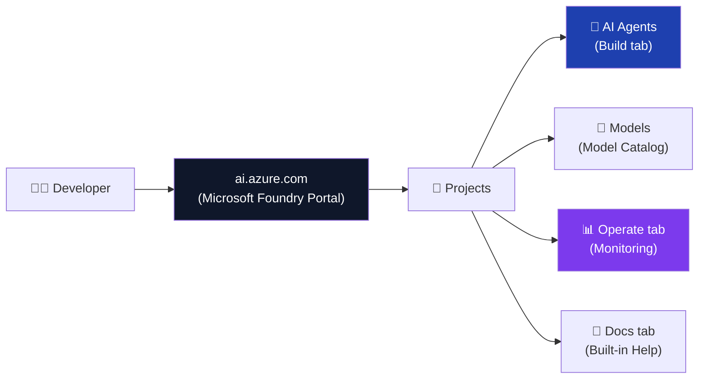

### Key Characteristics
- **Single hub** — discover models, build agents, monitor performance
- **Project-based** — each project scopes its models, agents, and resources
- **Backed by Azure** — all resources live in a linked Azure Resource Group
- **AI chatbot built-in** — ask Foundry questions about the portal itself

---

## 2. Foundry Portal Navigation Overview

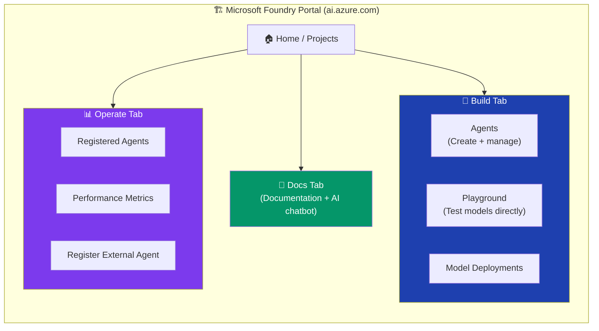

| Tab | Purpose |
|---|---|
| **Build** | Create and configure agents, add tools, set instructions |
| **Operate** | Monitor running agents, register existing agents, view metrics |
| **Docs** | Access Microsoft Foundry documentation + ask the built-in AI chatbot |

---

## 3. Creating a New Project from Scratch

### Prerequisites
- An Azure subscription
- A resource group (e.g., `rg-ais-eus2-demo-gift-tracker`)

### Steps

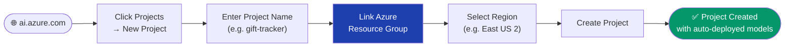

### What Gets Auto-Deployed in a New Project

When you create a new project, Microsoft Foundry **automatically deploys**:

| Resource | Purpose |
|---|---|
| **GPT-4.1** | Default LLM for your agents |
| **text-embedding-3-small** | Embedding model for vector search / file search |
| **Azure AI Search** (Microsoft-managed) | Powers file search tool for agents |

> **Note:** These auto-deployed resources are **Microsoft-managed** — you don't pay for the compute separately; they are included through the project's resource allocation. For production or large-scale use, create your own dedicated resources.

---

## 4. The Gift Tracker Agent — Concept

The demo builds a **Gift Tracker Agent** — a personal AI assistant that helps a user:

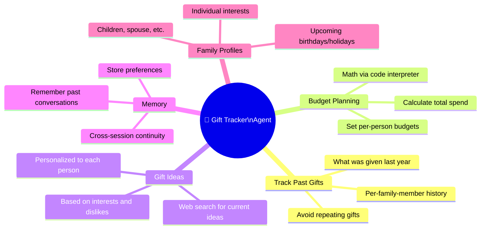

### Use Case Summary

> *"Imagine you want to plan gifts for your children ahead of time — you don't want to repeat gifts, you want to stay on budget, find things they'll love, and not be surprised when holidays arrive."*

---

## 5. Agent Tools Overview

An Azure AI Agent in Foundry can be equipped with **four types of tools**:

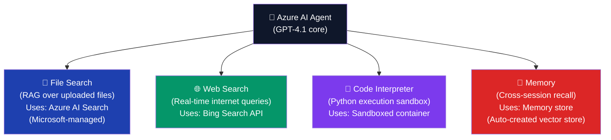

| Tool | What It Does | Best For |
|---|---|---|
| **File Search** | RAG over documents you upload (JSON, PDF, DOCX, TXT) | Private knowledge base |
| **Web Search** | Real-time Bing web search | Current events, live data, product research |
| **Code Interpreter** | Executes Python in a sandbox | Math, data analysis, charting, computation |
| **Memory** | Stores chat summaries for cross-session recall | Personalization, conversation continuity |

---

## 6. Building the Agent — Step by Step

### Step 1 — System Prompt (Instructions)

The **system prompt** defines the agent's personality, scope, and behavior rules.

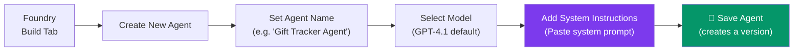

**Example System Prompt for the Gift Tracker Agent:**
```
You are a specialized Gift Tracker assistant. Your purpose is to help users:
- Track gifts given to family members across all occasions (birthdays, Christmas, etc.)
- Plan and budget future gifts based on the family member's profile and preferences
- Suggest personalized gift ideas using their interests and past gift history
- Remember past conversations and user preferences
- Use web search to find current, up-to-date gift ideas

Only answer questions related to gift tracking, planning, and suggestions.
Always cite the source of information (file search, web search, or memory).
```

> **Best Practice:** Save the agent frequently — Foundry keeps **version history**, letting you roll back to any previous version if you make a mistake.

---

### Step 2 — File Search (Knowledge)

**File Search** is the simplest way to add a **private knowledge base** to your agent. It uses a Microsoft-managed Azure AI Search instance behind the scenes.

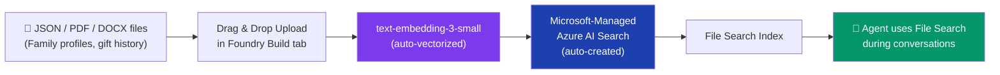

#### Files Used in the Demo
The demo uploads **JSON files** containing:
- **Family member profiles** (name, age, interests, dislikes)
- **Past gift history** (what was given on which occasion, year, cost)
- **Upcoming events** (birthday dates, holiday schedules)

#### When to Use File Search vs Azure AI Search

| Situation | Use File Search | Use Azure AI Search |
|---|---|---|
| Quick demo / prototype | ✅ | ❌ |
| Small document set (< few hundred files) | ✅ | ❌ |
| SQL Database, Cosmos DB, or Blob Storage source | ❌ | ✅ |
| Large enterprise knowledge base | ❌ | ✅ |
| Need custom indexing, filters, or hybrid search | ❌ | ✅ |

> **Quote from video:** *"File Search is quick and easy to show how you can upload information and then retrieve it quickly — we're using a Microsoft-managed Azure AI Search resource. This is a very simple and fast way to set up RAG for your Azure AI agents."*

---

### Step 3 — Web Search Tool

**Web Search** gives the agent access to **real-time Bing search** results — enabling it to find current product listings, prices, news, and more that aren't in the uploaded files.

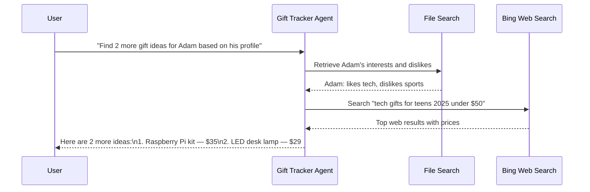

**Behaviour observed in demo:**
- Agent automatically retrieved the profile from file search first
- Then used Adam's interests/dislikes as search query context for Bing
- Results included **real-time pricing** from web

---

### Step 4 — Code Interpreter

**Code Interpreter** runs a Python sandbox allowing the agent to perform **accurate mathematical calculations**, data analysis, and show its work.

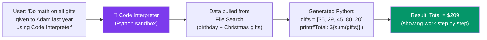

**Key capability:** Code Interpreter ensures **mathematical accuracy** — rather than having the LLM estimate totals in its response, it actually executes Python code and returns the verified result.

**Demo example query:**
```
"Do math on all of the gifts that were given to Adam last year and add them all up 
using code interpreter. Include both birthday and Christmas gifts."
```

---

### Step 5 — Memory Store

**Memory** enables the agent to **remember past conversations** across separate sessions — unlike standard chat which has no memory between conversations.

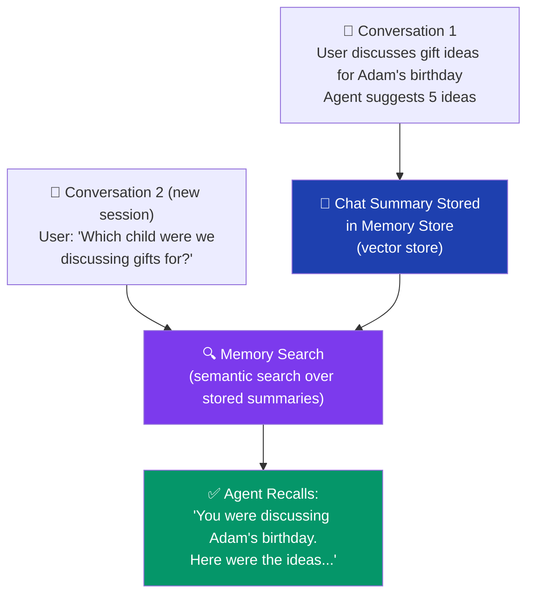

#### How to Create a Memory Store

1. In the Foundry Build tab → scroll to **Memory** section
2. Click **Add Memory → Create Memory Store**
3. A default memory store is auto-created (backed by a vector store)
4. Click **Save Agent**

> **What gets stored:** At the end of each conversation, a **summary of the chat** is automatically written to the memory store. When the agent starts a new conversation, it semantically searches past summaries to recall relevant context.

---

## 7. Testing the Agent

### Test Queries Used in Demo

| Query | Tool Invoked | Result |
|---|---|---|
| `"What can you do?"` | None | Describes its capabilities |
| `"Give me gift ideas for Adam for his birthday"` | File Search + Memory | Pulled Adam's profile from files, searched memory for past discussions |
| `"Search online for 2 more ideas based on Adam's preferences"` | Web Search + File Search | Combined profile data with live Bing results |
| `"Which child were we discussing?"` *(new session)* | Memory | Recalled "Adam" from previous session summary |
| `"Do math on all Adam's gifts last year using code interpreter"` | Code Interpreter + File Search | Pulled gift data from files, ran Python, showed calculation |

### Multi-Tool Behaviour

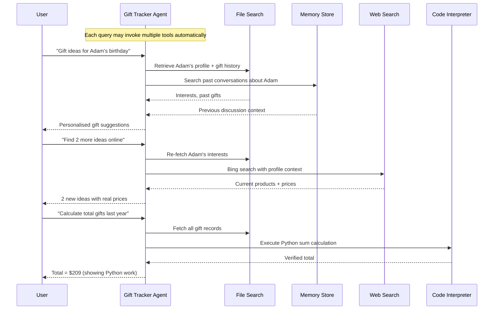

---

## 8. Operate Tab — Monitoring

The **Operate tab** in Foundry is where you monitor and manage your deployed agents.

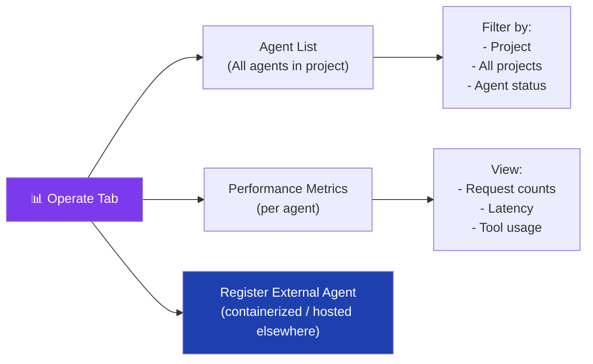

### Key Features

| Feature | Description |
|---|---|
| **Agent Dashboard** | See all running agents, their status, and usage metrics |
| **Per-Project View** | Filter metrics to a single project or view all projects |
| **Register Agent** | Add an existing externally-hosted agent to the Foundry dashboard |
| **Containerize** | Wrap an existing agent in a container and register it for unified monitoring |

> **Use case for Register Agent:** If you already have an agent running on another platform or backend, you can register it in Foundry to see its performance on the same Foundry dashboard — without migrating the agent itself.

---

## 9. Docs Tab & Built-in AI Chatbot

The **Docs tab** provides documentation and a **built-in AI chatbot** that answers questions about Foundry itself.

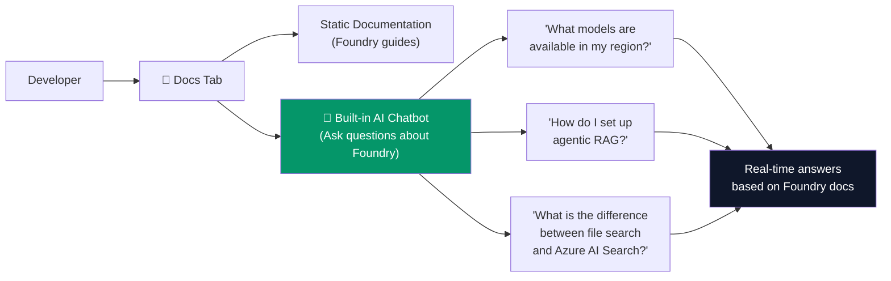

> **Practical tip:** If you're unsure where to go or what to do in Foundry, the built-in chatbot is a fast way to get contextual help — it searches the actual Foundry documentation to answer your questions.

---

## 10. Deployment Options

Once your agent is working in Foundry, you can deploy it through multiple channels:

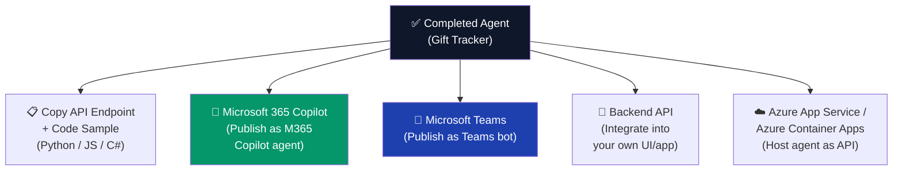

| Deployment Path | How | Best For |
|---|---|---|
| **M365 Copilot** | Foundry → Publish → M365 Copilot | Enterprise users already on Microsoft 365 |
| **Microsoft Teams** | Foundry → Publish → Teams | Internal team tool |
| **API Endpoint** | Use the auto-generated endpoint code | Custom web/mobile app |
| **Backend service** | Copy Python/JS/C# SDK code | Any custom backend |

---

## 11. Architecture Diagram

### Complete Gift Tracker Agent Architecture

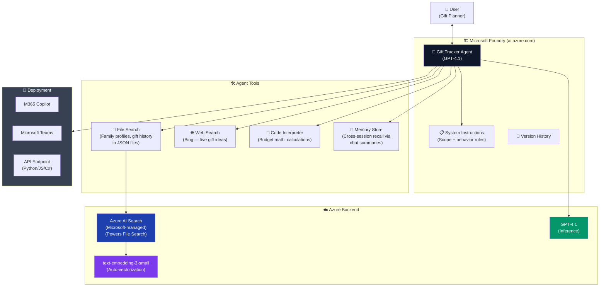

---

## 12. Interview Quick Reference

### Core Concepts from This Video

**Q: What is Microsoft Foundry and how does it differ from Azure AI Studio?**
> Microsoft Foundry (ai.azure.com) is the evolution of Azure AI Studio — the unified enterprise portal for building, testing, and monitoring Azure AI agents. It organises work into **projects**, each backed by an Azure Resource Group, and auto-provisions models like GPT-4.1 and `text-embedding-3-small` on project creation.

**Q: What is the difference between File Search and Azure AI Search for agents?**
> **File Search** is a simplified, Microsoft-managed RAG tool ideal for quickly uploading documents (PDF, JSON, DOCX) to give an agent a knowledge base. It uses a **Microsoft-managed Azure AI Search** resource behind the scenes. **Azure AI Search** (self-provisioned) should be used when your data lives in Blob Storage, SQL, or Cosmos DB; when you need large-scale indexing; or when you need custom hybrid search configurations.

**Q: How does Memory work in Azure AI Agents?**
> Memory stores **summaries of past conversations** in a vector store. When a new conversation starts, the agent semantically searches these summaries for relevant context. This enables **cross-session continuity** — the agent can remember which family member you discussed in a previous session without you repeating yourself.

**Q: What is Code Interpreter used for?**
> Code Interpreter runs a **Python sandbox** inside the agent's reasoning loop. It is used for any task requiring deterministic computation — budget calculations, data analysis, showing mathematical work step-by-step. This avoids LLM hallucination on math since the code is actually executed.

**Q: What are the four main tools available to an Azure AI Agent?**

| Tool | What It Does |
|---|---|
| **File Search** | RAG over uploaded documents via managed Azure AI Search |
| **Web Search** | Real-time Bing search for current information |
| **Code Interpreter** | Python execution sandbox for accurate computation |
| **Memory** | Cross-session vector-based recall of past conversations |

**Q: How do you deploy an Azure AI Agent built in Foundry?**
> From the Foundry Build tab, you can: (1) **Publish to M365 Copilot** as a Copilot agent, (2) **Publish to Microsoft Teams** as a bot, (3) **Copy the API endpoint** code (Python/JS/C#) for integration into any custom backend, or (4) **Register an external agent** in the Operate tab for unified monitoring.

**Q: What is the Operate tab for?**
> The Operate tab is the **monitoring dashboard** for your deployed agents. You can view performance metrics (request count, latency, tool usage), filter by project, and register externally-hosted agents so they appear in the same Foundry dashboard.

### Decision Guide — Which Tool to Add?

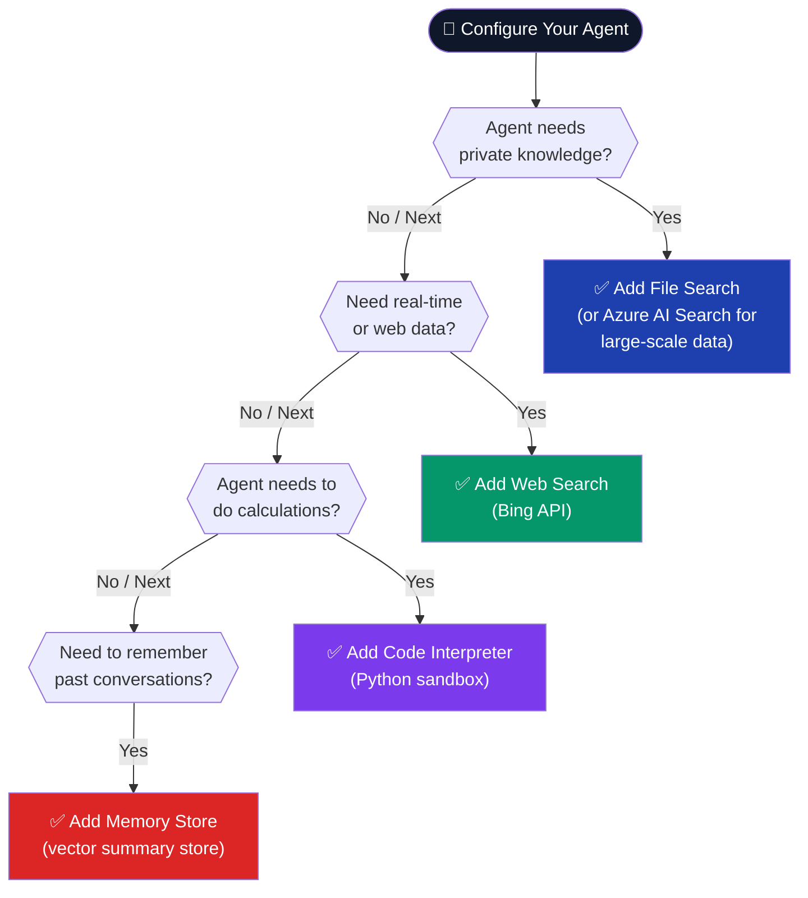

---

*Last updated: June 2026 | Microsoft Foundry Portal — ai.azure.com*
