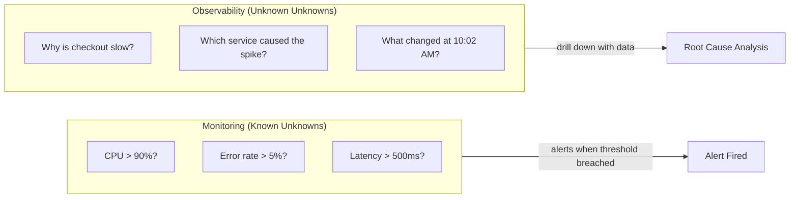
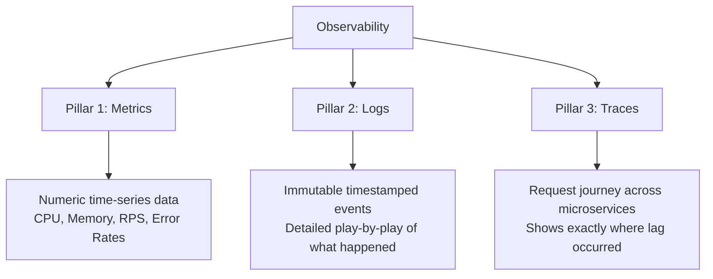
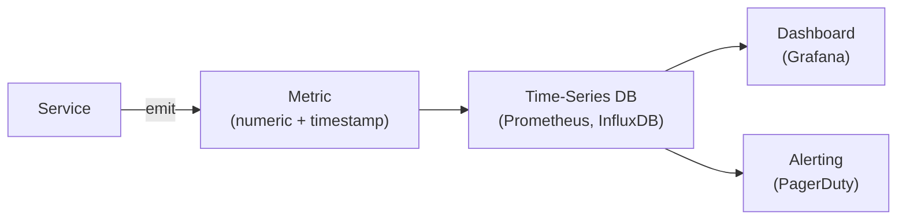
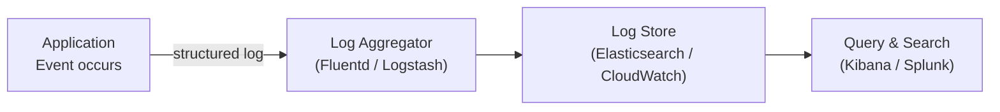
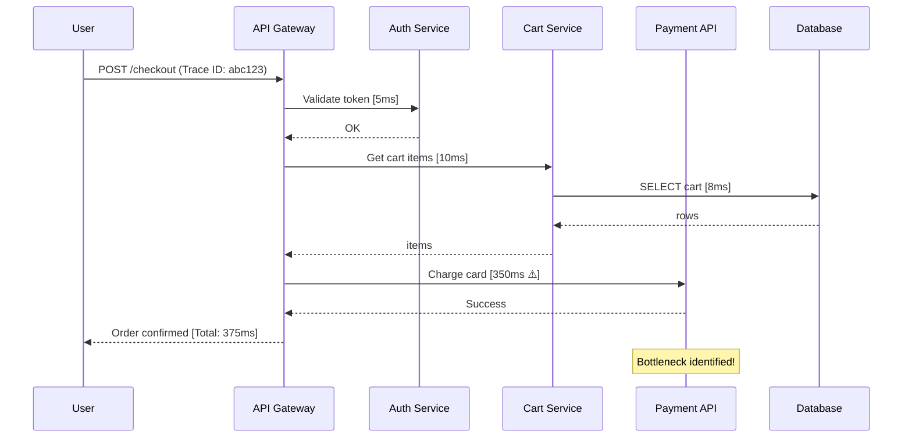
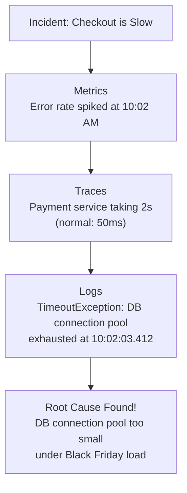

# Observability: Metrics, Logs & Traces

> Source: AlgoMap.io

---

## Monitoring vs. Observability

| | Monitoring | Observability |
|---|---|---|
| **Focus** | Pre-defined dashboards | Any question about system state |
| **Handles** | "Known Unknowns" | "Unknown Unknowns" |
| **Example** | Is CPU usage > 90%? | Why is checkout slow for some users? |
| **Tells you** | That something is wrong | **Why** it is wrong |

**Monitoring** tracks "Known Unknowns" — metrics you anticipated in advance.  
**Observability** is the ability to answer **any** question about your system by looking at the data it produces. It's for **"Unknown Unknowns."**

> Monitoring tells you that something is wrong. Observability tells you **why.**

---

## The Three Pillars of Observability

---

## Pillar 1: Metrics

**Metrics** are numeric data measured over intervals of time.

- **Examples:** CPU usage, Memory, Requests per second, Error rates
- Great for **spotting trends** and **triggering alerts**

**Interview Q: What is a metric and when would you use it?**  
**A:** A metric is a numeric measurement sampled at regular intervals (e.g., CPU %, requests/sec). Use metrics to track system health trends over time, set alert thresholds, and detect anomalies like traffic spikes or resource exhaustion. They are cheap to store and fast to query but lack context about *why* a value changed.

---

## Pillar 2: Logs

An **immutable, timestamped record of discrete events.**

- A detailed play-by-play of what happened: `"User 123 clicked 'Buy' at 10:01:05 AM."`
- Great for **deep-diving into a specific error** after it happens

**Interview Q: What is a log and how does it differ from a metric?**  
**A:** A log is an immutable, timestamped record of a discrete event (errors, state changes, user actions). Unlike metrics which are aggregated numbers, logs capture rich context — the exact error message, user ID, stack trace. The trade-off: logs are verbose and expensive to store at scale. Use structured logging (JSON) to make them queryable efficiently.

---

## Pillar 3: Traces

**Tracing** is following a single request as it travels through multiple microservices.

- In a big system, a "Slow Checkout" could be caused by the Database, the Payment API, or the Shipping service
- A Trace shows you **exactly** where the "lag" happened in the chain

**Interview Q: What is distributed tracing and why is it important in microservices?**  
**A:** Distributed tracing assigns a unique Trace ID to each request and propagates it through every service call. Each service records a "span" with its start time and duration. Combining all spans gives a complete timeline showing exactly which service introduced latency. Without tracing, isolating performance issues in a 10+ service system is nearly impossible — you'd only see the total end-to-end time at the API gateway.

---

## Why Do We Need All Three?

| Pillar | Tells You |
|---|---|
| **Metrics** | There's a spike in errors |
| **Traces** | Which specific service is failing |
| **Logs** | The exact code error in that service |

Together, you can determine **exactly why** any complex issue is happening.

**Interview Q: How do metrics, logs, and traces work together for incident response?**  
**A:**
1. **Metrics alert** you that error rate crossed 5% — the *signal* that something is wrong
2. **Traces** let you drill into affected requests to find *which service* in the call chain is slow or erroring
3. **Logs** from that specific service show the *exact error*, stack trace, and context (user ID, request payload)

This three-step drill-down from "something is wrong" → "where" → "why" is the core observability workflow. Tools like Datadog, New Relic, and Honeycomb unify all three pillars on a single platform for faster MTTR (Mean Time To Resolution).

---

## Key Tooling

| Pillar | Open Source | Cloud / SaaS |
|---|---|---|
| Metrics | Prometheus + Grafana | Datadog, CloudWatch |
| Logs | ELK Stack (Elasticsearch, Logstash, Kibana) | Splunk, CloudWatch Logs |
| Traces | Jaeger, Zipkin, OpenTelemetry | Datadog APM, AWS X-Ray, Honeycomb |
| All-in-one | OpenTelemetry (collection standard) | Datadog, New Relic, Dynatrace |

> **OpenTelemetry** is the CNCF standard for instrumenting code — it provides vendor-neutral SDKs to emit metrics, logs, and traces, and you route them to any backend.
