# RAG — 10 Core Terms: Complete Interview Guide

> **Level:** Intermediate → Advanced | **Topic:** Retrieval-Augmented Generation
> **Coverage:** Embeddings, Vector DB, Chunking, Similarity Search, Retriever, Generator (LLM), Context Window, Prompt Augmentation, Re-Ranking, Hybrid Search

---

## Table of Contents

1. [Embedding](#1-embedding)
2. [Vector DB](#2-vector-db)
3. [Chunking](#3-chunking)
4. [Similarity Search](#4-similarity-search)
5. [Retriever](#5-retriever)
6. [Generator (LLM)](#6-generator-llm)
7. [Context Window](#7-context-window)
8. [Prompt Augmentation](#8-prompt-augmentation)
9. [Re-Ranking](#9-re-ranking)
10. [Hybrid Search](#10-hybrid-search)

---

## RAG Pipeline — High-Level Overview

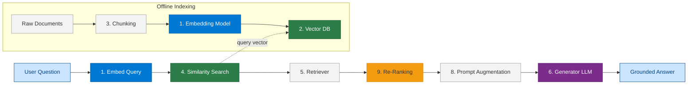

---

## 1. Embedding

### What is an Embedding?

An **embedding** is a dense numerical representation (vector) of text, image, or other data in a high-dimensional space where semantically similar content is placed close together. An embedding model converts a piece of text into a list of floating-point numbers (e.g., 1536 dimensions for `text-embedding-3-large`) that capture meaning, not just keywords.

---

### Q1. What is the difference between a word embedding and a sentence embedding?

**A:** A **word embedding** (e.g., Word2Vec, GloVe) represents a single word as a vector and cannot capture context — "bank" (financial) and "bank" (river) have the same vector. A **sentence embedding** (e.g., BERT, `text-embedding-3-large`) encodes the full sentence and is context-aware — the vector changes based on surrounding words. In RAG, sentence/chunk embeddings are used because we need semantic understanding of entire passages, not individual tokens.

---

### Q2. Why are embeddings critical to RAG?

**A:** Embeddings are the bridge between natural language and mathematical search. RAG works by:
1. Embedding all documents into vectors during indexing
2. Embedding the user's query into a vector at query time
3. Finding documents whose vectors are closest to the query vector

Without embeddings, you can only do keyword search — you cannot find "automobile" when the user typed "car." Embeddings allow **semantic search** that understands meaning, not just lexical overlap.

---

### Q3. What is embedding drift, and how does it affect a RAG system?

**A:** **Embedding drift** occurs when you switch embedding models (e.g., from `text-embedding-ada-002` to `text-embedding-3-large`). The vector space changes — old document vectors and new query vectors are no longer compatible. The fix is to **re-index all documents** with the new model before deploying the new query encoder. Mismatched embedding models silently degrade retrieval quality without throwing errors — making it a subtle but serious production risk.

---

### Q4. What are the key dimensions to consider when choosing an embedding model?

**A:**
| Dimension | Consideration |
|---|---|
| **Vector size** | Larger = more expressive but more storage and slower ANN search |
| **Context length** | Max tokens per chunk the model can encode (e.g., 8191 for ada-002) |
| **Multilingual support** | Does it handle non-English content? |
| **Latency** | Inference time at scale matters for real-time RAG |
| **Cost** | API pricing per token for hosted models |
| **MTEB benchmark** | Standardized retrieval benchmark score |

---

### Embedding Flow Diagram

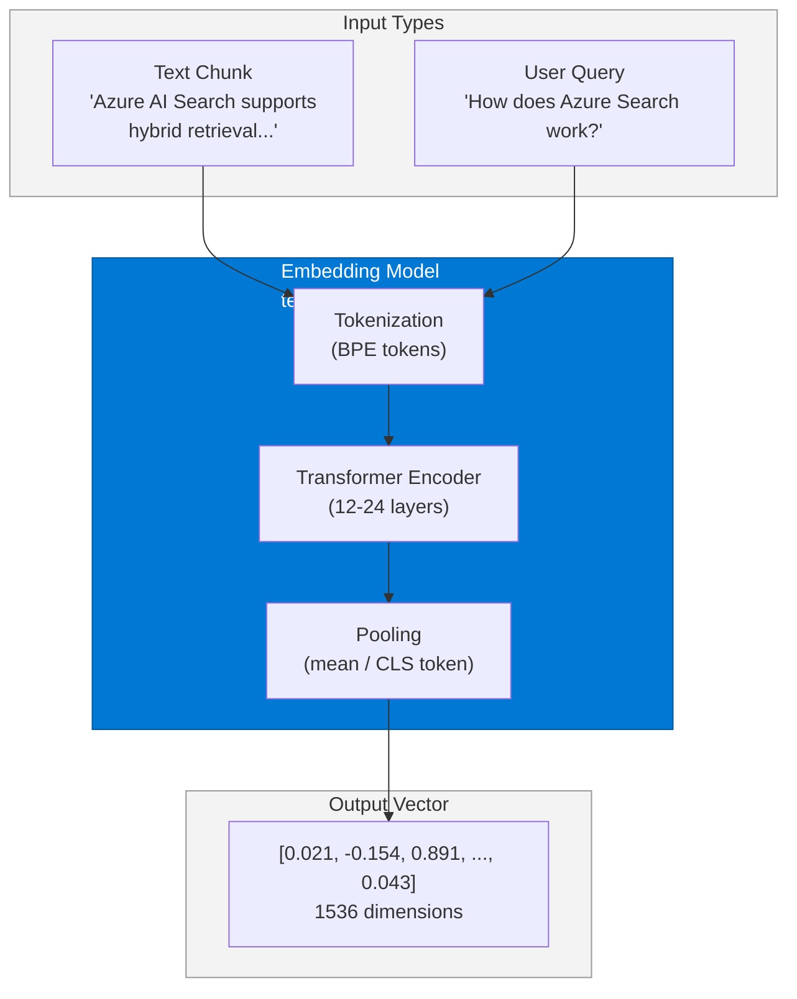

---

## 2. Vector DB

### What is a Vector Database?

A **Vector Database** (vector store) is a specialized data store designed to index, store, and query high-dimensional embedding vectors at scale. Unlike traditional databases that query on exact values, vector databases support **Approximate Nearest Neighbor (ANN)** search — finding the k vectors closest to a query vector using algorithms like HNSW, DiskANN, or IVF.

---

### Q1. How is a vector database different from a relational database?

**A:**
| Dimension | Relational DB | Vector DB |
|---|---|---|
| **Query type** | Exact match (SQL WHERE) | Approximate nearest neighbor search |
| **Data model** | Rows and columns | Vectors (float arrays) + metadata |
| **Index type** | B-Tree, Hash | HNSW, DiskANN, IVF-PQ |
| **Use case** | Structured transactions | Semantic search, RAG, recommendations |
| **Consistency** | ACID transactions | Eventual consistency for ANN index |
| **Scale** | Billions of rows fine | Hundreds of millions of vectors (memory-bound) |

---

### Q2. What is HNSW and why is it the dominant ANN algorithm?

**A:** **Hierarchical Navigable Small World (HNSW)** builds a multi-layer graph where higher layers have long-range connections and lower layers have fine-grained local connections — similar to a highway network. At query time, the algorithm enters at the top layer, navigates toward the query vector greedily, then refines at lower layers.

**Why dominant:**
- Best recall/speed tradeoff among ANN algorithms
- Supports incremental inserts (no full rebuild needed)
- Used by: Azure AI Search, Pinecone, Qdrant, Weaviate

**Trade-off:** High memory usage — each node stores links to neighbors.

---

### Q3. What are the top vector database options for enterprise Azure deployments?

**A:**
| Product | Best For | Azure Integration |
|---|---|---|
| **Azure AI Search** | Enterprise RAG with hybrid search | Native Azure, RBAC, Private Link |
| **Azure Cosmos DB (vCore)** | Operational data + vectors together | Same DB as your app data |
| **Azure Cache for Redis Enterprise** | Low-latency, in-memory vector search | Sub-millisecond p99 |
| **Qdrant** | Open-source, high-performance | Deploy on AKS |
| **Pinecone** | Fully managed SaaS | REST API integration |
| **pgvector (PostgreSQL)** | Small-scale, existing Postgres | Azure Database for PostgreSQL |

---

### Q4. What is the filtering problem in vector search and how is it solved?

**A:** The **filtering problem** arises when you need to return only vectors matching a metadata filter (e.g., `department=legal`). Two naive approaches fail:
- **Pre-filter then search:** Filter reduces dataset to a tiny subset; ANN over an arbitrary small subset is inaccurate
- **Search then post-filter:** ANN returns top-k, then filter removes most — final result set can be empty

**Solution:** **Graph-based integration filtering** (used by Azure AI Search and Qdrant) — the ANN algorithm itself respects the filter at each navigation step, maintaining accuracy without full-scan.

---

### Vector DB Architecture

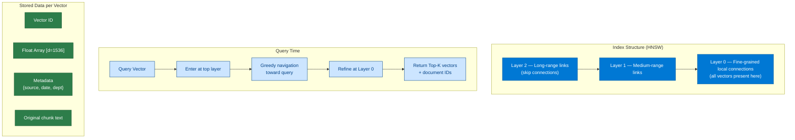

---

## 3. Chunking

### What is Chunking?

**Chunking** is the process of splitting large documents into smaller, semantically coherent segments before embedding and indexing. Since embedding models have a maximum token limit and LLMs have a limited context window, documents must be divided into chunks that are small enough to embed meaningfully but large enough to carry useful context.

---

### Q1. What are the main chunking strategies and when do you use each?

**A:**
| Strategy | How It Works | Best For |
|---|---|---|
| **Fixed-size** | Split every N characters/tokens | Simple, fast — baseline |
| **Sentence-based** | Split at sentence boundaries | Prose documents, FAQs |
| **Recursive character** | Split on `\n\n`, `\n`, `.`, ` ` in order | Mixed text — best general-purpose |
| **Semantic chunking** | Embed sentences, split where embedding similarity drops | Dense technical docs |
| **Document structure** | Split on headings (H1/H2/H3) | Markdown, HTML, PDFs with structure |
| **Agentic chunking** | LLM determines boundaries | Highest quality, highest cost |

---

### Q2. What is chunk overlap and why is it important?

**A:** **Chunk overlap** means adjacent chunks share some tokens (e.g., 50–100 tokens of overlap). Without overlap, a sentence that crosses a chunk boundary is split — the context needed to understand it is in two separate chunks, and neither retrieves fully. Overlap ensures the boundary region appears in at least one complete chunk. Typical overlap is 10–20% of chunk size.

**Example:** Chunk size = 512 tokens, overlap = 64 tokens → chunk 1 is tokens 0–511, chunk 2 is tokens 448–959.

---

### Q3. What is the chunk size vs. retrieval quality tradeoff?

**A:**
- **Too small chunks** (e.g., 64 tokens): High precision (embedding is very specific), but lack context for the LLM to generate a complete answer. Many chunks needed per question.
- **Too large chunks** (e.g., 2048 tokens): Rich context for the LLM, but the embedding vector averages over too much content — retrieval precision degrades.
- **Sweet spot:** 256–512 tokens for most text; some systems use **parent-child chunking** — embed small child chunks for precise retrieval, but pass the full parent chunk to the LLM for context.

---

### Q4. What is parent-child chunking (small-to-big retrieval)?

**A:** A two-level chunking strategy:
1. **Child chunks** (128 tokens): Used for embedding and retrieval — small = precise semantic representation
2. **Parent chunks** (512–1024 tokens): The full context window passed to the LLM — large = rich answer generation

When retrieval returns a child chunk, the system looks up the parent chunk and sends that to the LLM. This avoids the precision-vs-context tradeoff.

---

### Chunking Strategies Diagram

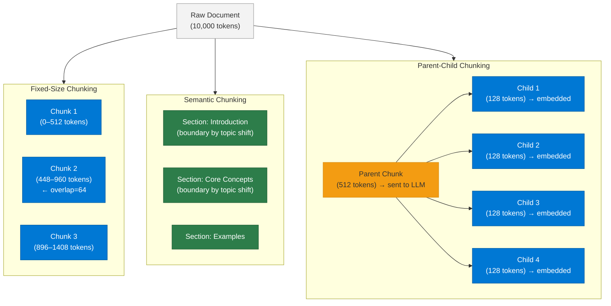

---

## 4. Similarity Search

### What is Similarity Search?

**Similarity Search** (also called vector search or semantic search) finds documents whose embedding vectors are most similar to a query vector, using a mathematical distance metric. It is the core retrieval mechanism in RAG — replacing or complementing keyword search.

---

### Q1. What are the main similarity metrics used in vector search?

**A:**
| Metric | Formula (simplified) | Best For |
|---|---|---|
| **Cosine similarity** | `cos(θ) = A·B / (|A||B|)` | Normalized text embeddings — measures angle, not magnitude |
| **Dot product** | `A·B` | When vectors are unit-normalized (equivalent to cosine) |
| **Euclidean distance (L2)** | `√Σ(Aᵢ - Bᵢ)²` | Image embeddings, exact-distance needs |
| **Manhattan distance (L1)** | `Σ|Aᵢ - Bᵢ|` | Sparse vectors |

**In RAG:** Cosine similarity is the standard for text embeddings because it measures semantic direction regardless of vector magnitude.

---

### Q2. What is the difference between exact nearest neighbor and approximate nearest neighbor (ANN)?

**A:**
- **Exact KNN:** Scans every vector, guaranteed correct answer — O(n·d) time — infeasible at millions of vectors
- **ANN:** Uses index structures (HNSW, IVF) to skip most vectors — O(log n) — 95–99% recall with 10–100x speedup

In production RAG, always use ANN. The 1–5% recall loss is acceptable because the LLM can synthesize an answer even from slightly imperfect retrieval.

---

### Q3. How do you evaluate retrieval quality in a RAG system?

**A:** Key retrieval metrics:
| Metric | What It Measures |
|---|---|
| **Recall@K** | % of relevant documents found in top-K results |
| **Precision@K** | % of top-K results that are actually relevant |
| **MRR (Mean Reciprocal Rank)** | How high the first relevant doc ranks |
| **NDCG** | Normalized discounted cumulative gain — rewards relevant docs ranked higher |

In RAG evaluation frameworks (RAGAS, TruLens), you test `context_recall` and `context_precision` specifically for the retrieval step.

---

### Q4. What is the "semantic gap" problem in similarity search?

**A:** The **semantic gap** occurs when the user's query and the relevant document use very different vocabulary — even though they mean the same thing. Example: query is "How do I terminate a contract?" but the document says "cancellation policy." Keyword search fails completely; vector search partially bridges this gap. Solutions:
1. **Hypothetical Document Embeddings (HyDE):** Ask the LLM to generate a hypothetical answer, embed that, then search — the hypothetical answer uses vocabulary closer to the documents
2. **Query expansion:** Rewrite the query with synonyms before embedding
3. **Hybrid search:** Combine vector + keyword search to cover both vocabulary and semantics

---

### Similarity Search — Cosine Similarity

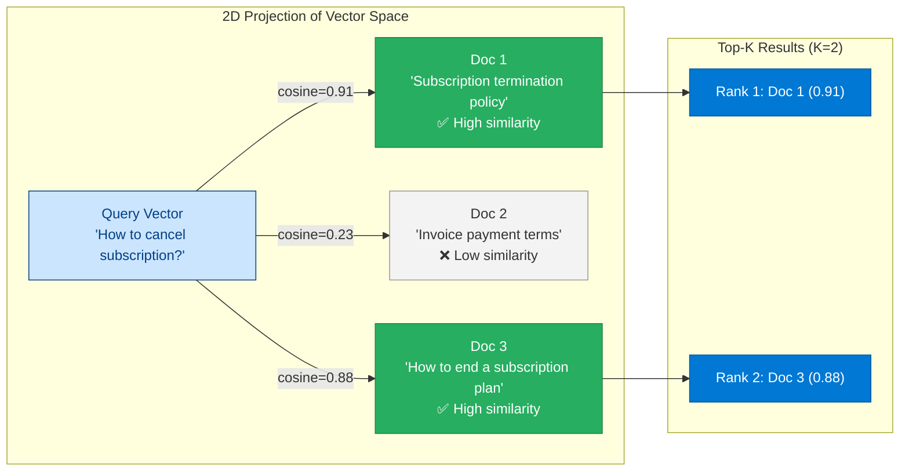

---

## 5. Retriever

### What is a Retriever?

The **Retriever** is the component in a RAG pipeline responsible for fetching relevant chunks from the knowledge base given a user query. It acts as the "search engine" layer — taking a query, running it against the vector index (and optionally keyword index), and returning the top-K most relevant passages to pass to the LLM.

---

### Q1. What are the types of retrievers in RAG?

**A:**
| Type | Mechanism | Pros | Cons |
|---|---|---|---|
| **Dense retriever** | Embeds query, ANN vector search | Semantic, handles paraphrases | Can miss exact terms |
| **Sparse retriever (BM25)** | TF-IDF keyword matching | Exact term recall, no embedding needed | No semantic understanding |
| **Hybrid retriever** | Dense + Sparse combined | Best of both | More complex, needs score fusion |
| **Multi-query retriever** | Generates N query variants, runs each | Higher recall | N× latency, N× cost |
| **Contextual compression retriever** | Retrieves top-K, then LLM extracts only relevant sentences | Less noise to LLM | Extra LLM call |
| **Self-query retriever** | LLM generates structured filter + semantic query | Precise metadata-based retrieval | Requires LLM in retrieval path |

---

### Q2. What is retrieval augmentation with metadata filtering?

**A:** Metadata filtering allows the retriever to restrict search to a subset of documents based on structured attributes (e.g., `department=legal`, `date > 2024-01-01`, `document_type=policy`). This combines **structured search** (exact match on metadata) with **semantic search** (vector similarity on content).

Example: User asks "What is the 2025 leave policy?" → retriever filters `year=2025 AND doc_type=HR_policy` then does vector search within that subset.

---

### Q3. What is a self-querying retriever and when should you use it?

**A:** A **self-querying retriever** uses an LLM as a pre-processing step to convert a natural language query into two parts:
1. A **semantic query** (for vector search)
2. A **structured filter** (for metadata filtering)

Example: "Show me legal documents about GDPR from 2024" → LLM extracts `{query: "GDPR compliance", filter: {dept: "legal", year: 2024}}`

**Use when:** Your documents have rich metadata and users ask queries that combine content and attribute constraints.

---

### Q4. What is the Lost in the Middle problem and how does retriever ordering affect it?

**A:** Research shows LLMs perform worse at using information in the **middle of a long context** — they best utilize content at the start and end. If the retriever returns 10 chunks and the most relevant chunk is at position 5, the LLM may miss it.

**Mitigations:**
1. Return fewer chunks (top-3 instead of top-10)
2. Re-rank and put highest-relevance chunks first/last
3. Use models with better long-context attention (e.g., GPT-4o with 128K context)

---

### Retriever Architecture

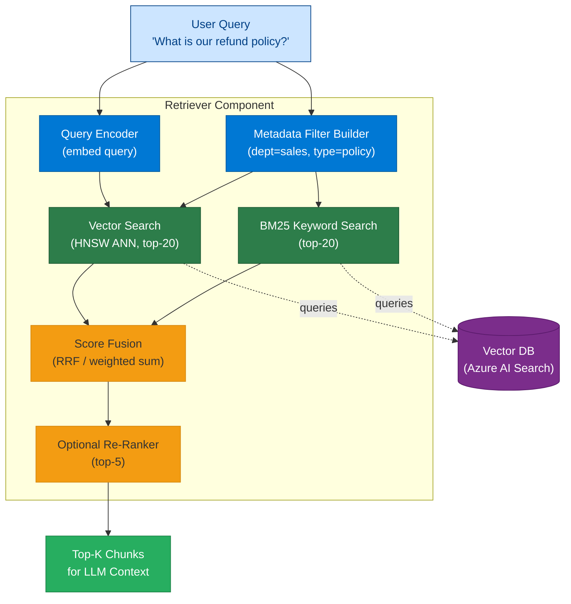

---

## 6. Generator (LLM)

### What is the Generator in RAG?

The **Generator** is the Large Language Model (LLM) component of the RAG pipeline. After the retriever fetches relevant chunks, those chunks are injected into the LLM's prompt as context. The LLM then **generates** a coherent, grounded response based on both the retrieved context and its parametric knowledge.

---

### Q1. What is the role of the LLM in RAG vs. standalone LLM usage?

**A:**
| Aspect | Standalone LLM | LLM in RAG |
|---|---|---|
| **Knowledge source** | Only training data (parametric) | Training + retrieved context (non-parametric) |
| **Knowledge freshness** | Frozen at training cutoff | Real-time (from index) |
| **Hallucination risk** | High for factual questions | Lower — grounded in retrieved text |
| **Attribution** | None | Can cite source documents |
| **Prompt structure** | Simple user message | System prompt + retrieved context + user query |
| **Cost** | Lower (fewer tokens) | Higher (context tokens add up) |

---

### Q2. What is grounding and how does the generator enforce it?

**A:** **Grounding** means the LLM's response is anchored to the retrieved context — it should answer based on what was retrieved, not from training memory alone. Enforced via:

1. **System prompt instruction:** "Answer only based on the provided context. If the context does not contain the answer, say 'I don't know.'"
2. **Citation enforcement:** Require the LLM to cite `[Source: doc_id]` for each claim
3. **Groundedness evaluation:** Post-hoc check using a separate LLM judge or tools like RAGAS `faithfulness` metric

---

### Q3. What is the generation temperature setting in RAG and what value should you use?

**A:** **Temperature** controls randomness in generation:
- `temperature=0.0` → deterministic, most likely token always selected → best for factual RAG (policies, legal, technical docs)
- `temperature=0.7–1.0` → creative, varied — good for marketing copy, not for factual retrieval

**Recommendation for RAG:** Use `temperature=0` or `0.1` for factual enterprise RAG. The LLM's job is to faithfully synthesize retrieved context, not generate novel ideas.

---

### Q4. How do you handle cases where the retrieved context does not contain the answer?

**A:** The LLM should be instructed via system prompt to respond with a fallback rather than hallucinate. Patterns:
1. **Explicit refusal:** "The provided documents do not contain information about this topic."
2. **Graceful handoff:** "Based on retrieved documents, I couldn't find this. Please contact support."
3. **Confidence threshold:** If retrieval similarity scores are below a threshold (e.g., < 0.75), skip LLM call and return a pre-written fallback response
4. **Fallback to parametric:** For low-stakes questions, allow the LLM to use training knowledge with explicit disclaimer

---

### Generator Flow

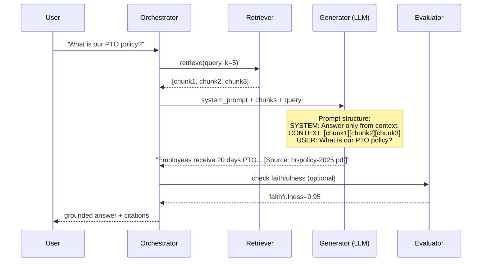

---

## 7. Context Window

### What is the Context Window?

The **context window** is the maximum number of tokens an LLM can process in a single inference call — covering both the input (prompt, retrieved chunks, conversation history) and the output (generated response). It is a hard technical constraint that shapes RAG architecture decisions.

---

### Q1. Why does context window size matter for RAG?

**A:** The context window is a shared budget for:
- System prompt (~200–500 tokens)
- Retrieved chunks (top-K × chunk_size tokens)
- Conversation history (if multi-turn)
- LLM response (reserved output tokens)

If retrieved chunks exceed the available context, either chunks are truncated (losing information) or the system errors. Architects must size chunk count × chunk size to fit within context limits with headroom.

**Example:** GPT-4o has 128K context. If chunk size = 512 tokens, you can fit up to ~200 chunks theoretically — but in practice, 5–10 high-quality chunks is the sweet spot.

---

### Q2. What is the "lost in the middle" problem related to context windows?

**A:** Research (Liu et al., 2023) shows LLMs have degraded attention to content in the middle of a long context. Performance is highest when relevant information is at the **beginning or end** of the context. For RAG:

**Solution:** Put the most relevant chunk first and second-most-relevant last. Use re-ranking to determine this order. Avoid sending 20 chunks when 5 targeted chunks are better.

---

### Q3. What is context compression in RAG?

**A:** **Context compression** reduces the tokens sent to the LLM while preserving the most relevant information. Techniques:
1. **Extractive compression:** Use a small model to extract only the sentences within each chunk that directly answer the query
2. **Abstractive compression:** Use an LLM to summarize chunks into a condensed form
3. **LLMLingua (Microsoft):** Token-level compression that removes non-essential tokens from chunks
4. **Re-ranking + truncation:** Keep only top-3 re-ranked chunks, discard the rest

Context compression reduces both cost and "lost in the middle" noise.

---

### Q4. How do you architect a multi-turn RAG system that doesn't exhaust the context window?

**A:** Multi-turn conversations accumulate history fast. Strategies:
1. **Sliding window:** Keep only the last N turns in context
2. **Summary memory:** LLM summarizes old turns into a compact summary, replace raw history with summary
3. **Entity memory:** Extract key entities and facts from history, store as structured memory
4. **Separate history store:** Keep full history in a database; retrieve only relevant past turns using vector search over conversation history

---

### Context Window Budget

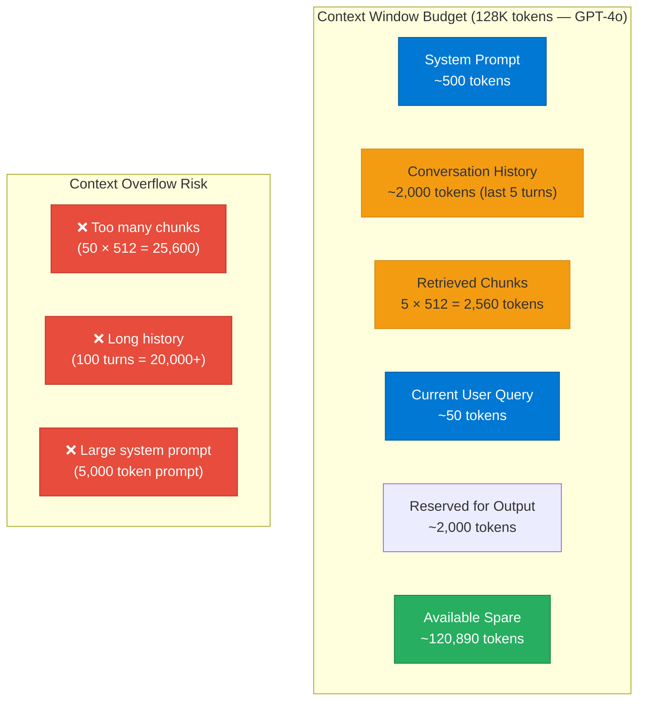

---

## 8. Prompt Augmentation

### What is Prompt Augmentation?

**Prompt Augmentation** is the process of enriching a user's original query with retrieved context before sending it to the LLM. It is the mechanism that transforms RAG from "just a search engine" into a grounded generation system — by injecting external knowledge directly into the LLM's input.

---

### Q1. What does a well-structured augmented prompt look like?

**A:** A production RAG augmented prompt has four sections:

```
SYSTEM:
You are a helpful assistant for Contoso Inc. Answer ONLY based on the context below.
If the context does not contain the answer, say "I don't have that information."
Always cite sources using [Source: filename].

CONTEXT:
[Source: hr-policy-2025.pdf, page 12]
Employees are entitled to 20 days of paid time off per year...

[Source: benefits-handbook.pdf, page 4]
PTO can be carried over to the next year up to a maximum of 5 days...

USER:
How many PTO days do I get, and can I carry them over?
```

The system prompt sets behavior, context section provides grounding, user section has the actual question.

---

### Q2. What is a prompt template and why is it critical for consistent RAG outputs?

**A:** A **prompt template** is a parameterized structure that defines the format, instructions, and variable slots for a RAG prompt. Using templates ensures:
1. **Consistent output format** (e.g., always return JSON with `answer` and `sources` fields)
2. **Reliable grounding instructions** (not forgotten across requests)
3. **Easy A/B testing** (swap template, evaluate quality difference)
4. **Separation of concerns** (prompt engineers manage templates independently of application code)

Tools: LangChain `PromptTemplate`, Semantic Kernel `KernelPromptTemplate`, Jinja2 templates for custom implementations.

---

### Q3. What is Hypothetical Document Embedding (HyDE) and how does it improve RAG?

**A:** **HyDE** addresses the mismatch between query vocabulary and document vocabulary:

1. LLM generates a **hypothetical answer** to the query (without using any retrieved docs)
2. That hypothetical answer is embedded (not the original query)
3. The hypothetical answer vector is used for similarity search

Since the hypothetical answer uses vocabulary similar to actual documents (rather than the user's brief query), retrieval quality improves significantly for short, ambiguous queries.

**Trade-off:** Adds one LLM call before retrieval — increases latency and cost.

---

### Q4. What is few-shot augmentation in RAG prompts?

**A:** **Few-shot augmentation** adds example input-output pairs to the prompt to guide the LLM's response format and style:

```
CONTEXT: [retrieved chunks]

EXAMPLES:
Q: What is the overtime policy?
A: Employees working more than 40 hours per week are eligible for 1.5× pay [Source: hr-policy.pdf].

Q: [User's actual question]
A:
```

Few-shot examples help when the LLM needs to follow a strict output format (e.g., always cite sources, always use bullet points, always include a confidence note).

---

### Prompt Augmentation Flow

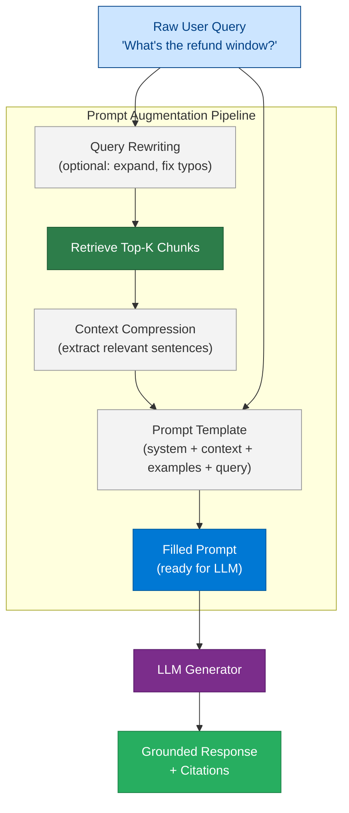

---

## 9. Re-Ranking

### What is Re-Ranking?

**Re-Ranking** is a post-retrieval step that reorders the top-K retrieved chunks by a more accurate relevance score before passing them to the LLM. The initial retrieval (ANN vector search) is optimized for speed — it returns many candidates quickly but may not rank them perfectly. The re-ranker applies a slower, more accurate model to improve the ordering.

---

### Q1. What is the difference between a bi-encoder retriever and a cross-encoder re-ranker?

**A:**
| | Bi-Encoder (Retriever) | Cross-Encoder (Re-Ranker) |
|---|---|---|
| **Architecture** | Query and document encoded separately | Query and document encoded together |
| **Speed** | Fast — pre-compute doc vectors offline | Slow — must re-run for every query-doc pair |
| **Accuracy** | Good for coarse-grained retrieval | High accuracy for fine-grained ranking |
| **Scale** | Works on millions of documents | Only practical on top-K (20–100) candidates |
| **Use in RAG** | First-stage retrieval (vector search) | Second-stage re-ranking |
| **Examples** | `text-embedding-3-large`, E5 | `ms-marco-MiniLM`, Cohere Rerank |

---

### Q2. What is Reciprocal Rank Fusion (RRF) and when is it used?

**A:** **RRF** is a score fusion algorithm used when combining results from multiple retrieval sources (e.g., vector search + keyword search). Instead of trying to normalize scores across different scales, RRF uses only the **rank** (position) of each document in each result list.

**Formula:** `RRF_score(d) = Σ 1 / (k + rank_i(d))` where k=60 typically

**When to use:** In hybrid search pipelines when you need to merge BM25 and vector search results without knowing how to calibrate their score scales. Azure AI Search implements RRF natively.

---

### Q3. What are Cohere Rerank and cross-encoder models, and how do you use them in RAG?

**A:** **Cohere Rerank** is a hosted API that takes a query and a list of documents, and returns them sorted by relevance with confidence scores. Cross-encoder models (like `ms-marco-MiniLM-L-6-v2`) are open-source alternatives.

**Usage in RAG:**
1. Retrieve top-20 candidates from vector search
2. Pass all 20 + query to Cohere Rerank or cross-encoder
3. Get back top-5 ranked by true relevance
4. Pass only those 5 to the LLM

This two-stage approach combines speed (ANN retrieval) with accuracy (cross-encoder ranking).

---

### Q4. How much does re-ranking improve RAG quality, and is it always worth the added latency?

**A:** Re-ranking typically improves NDCG@5 by 10–30% for complex queries. However:

- **Latency cost:** ~50–200ms additional for cross-encoder over 20 candidates
- **When worth it:** Technical documentation, legal/compliance queries, medical information — where the highest precision matters
- **When to skip:** Simple FAQ retrieval where top-1 vector result is almost always correct; latency-sensitive applications where 200ms is unacceptable

**Heuristic:** Implement re-ranking if your RAG evaluation shows context_precision < 0.8 and query complexity is high.

---

### Re-Ranking Pipeline

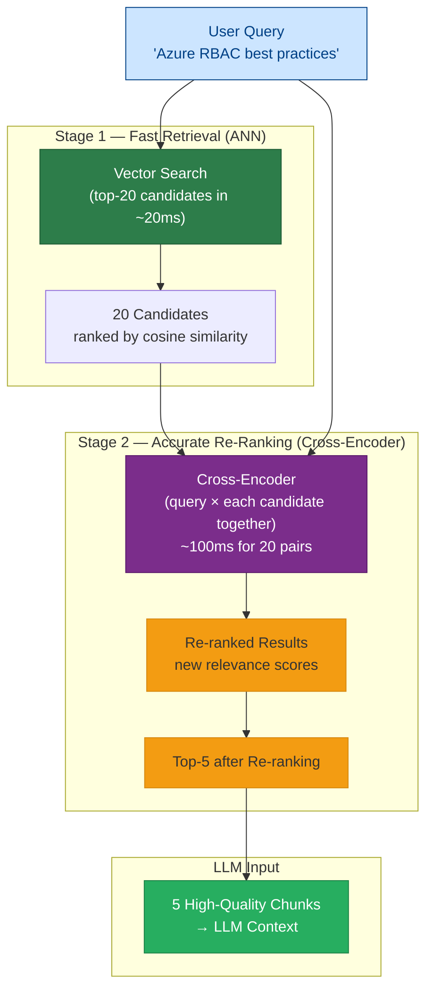

---

## 10. Hybrid Search

### What is Hybrid Search?

**Hybrid Search** combines **vector (semantic) search** and **keyword (lexical) search** in a single query to leverage the strengths of both. Vector search finds semantically similar content even with vocabulary mismatch; keyword search finds exact term matches with high precision. Hybrid search is the state-of-the-art retrieval approach for production RAG systems.

---

### Q1. Why is vector search alone insufficient for enterprise RAG?

**A:** Vector search fails on:
1. **Exact terms:** Product codes (e.g., "SKU-A7729"), error codes, proper nouns, acronyms
2. **Rare words:** Domain-specific jargon not well-represented in training data
3. **Numbers and dates:** "Q3 2024 revenue was $2.4B" — numeric queries

Keyword (BM25) search handles these cases perfectly. Vector search handles paraphrase/synonym queries that keyword search misses. Hybrid search captures both failure modes.

---

### Q2. How does BM25 work and how does it complement vector search?

**A:** **BM25** (Best Match 25) is a probabilistic relevance ranking function based on term frequency (TF) and inverse document frequency (IDF), with document length normalization.

**BM25 strengths vs. vector search:**
| Query Type | BM25 | Vector Search |
|---|---|---|
| `"error code 0x80070005"` | ✅ Exact match | ❌ Poor (rare token) |
| `"How do I fix login issues?"` | ❌ Misses "authentication problems" | ✅ Semantic match |
| `"Azure ARM template syntax"` | ✅ Exact acronyms | ✅ Also good |
| `"car vs automobile"` | ❌ Misses synonym | ✅ Same embedding space |

---

### Q3. How does Azure AI Search implement hybrid search?

**A:** Azure AI Search supports hybrid search natively:
1. **Vector search:** Uses HNSW index over embedding field
2. **Full-text search:** Uses BM25 over text field with Azure's Lucene analyzer
3. **Score fusion:** Uses Reciprocal Rank Fusion (RRF) to merge the two result lists
4. **Semantic ranker (optional):** Microsoft's cross-encoder L-model re-ranks the fused results using semantic understanding

This is a 3-stage pipeline: BM25 + Vector → RRF fusion → Semantic reranker.

---

### Q4. What is the performance vs. accuracy tradeoff in hybrid search configuration?

**A:**
| Configuration | Latency | Accuracy | Cost |
|---|---|---|---|
| Vector only | ~20ms | Good (semantic) | Low |
| BM25 only | ~10ms | Good (lexical) | Very Low |
| Hybrid (no rerank) | ~30ms | Better | Low |
| Hybrid + semantic rerank | ~80–150ms | Best | Medium |
| Hybrid + cross-encoder | ~200ms | Highest | High |

**Recommendation:** Start with hybrid (no rerank) for most use cases. Add semantic reranker if evaluation shows context precision gaps. Add cross-encoder only for high-stakes, low-traffic use cases.

---

### Hybrid Search Architecture

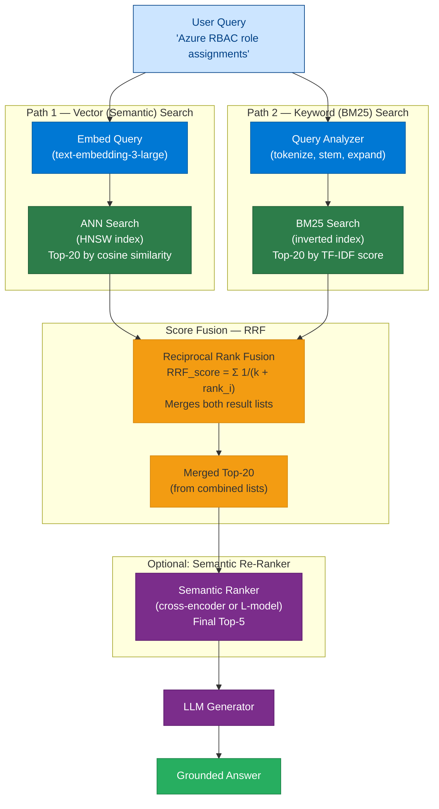

---

## Complete RAG Pipeline — All 10 Terms Integrated

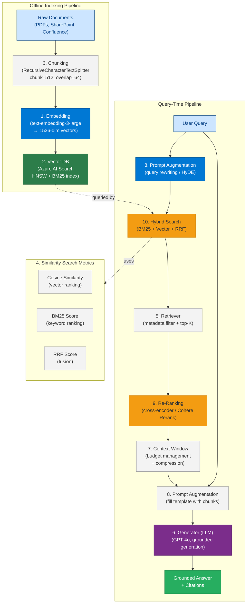

---

## Quick Reference — 10 Terms at a Glance

| # | Term | One-Line Definition | Key Metric |
|---|---|---|---|
| 1 | **Embedding** | Dense vector representation capturing semantic meaning | MTEB benchmark score |
| 2 | **Vector DB** | Store and ANN-search over high-dimensional vectors | Recall@10, p99 latency |
| 3 | **Chunking** | Split documents into embeddable, LLM-compatible segments | Chunk size, overlap % |
| 4 | **Similarity Search** | Find vectors closest to query vector by distance metric | Cosine similarity score |
| 5 | **Retriever** | Component that fetches relevant chunks from knowledge base | Context recall@K |
| 6 | **Generator (LLM)** | LLM that synthesizes grounded answer from retrieved context | Faithfulness, BLEU |
| 7 | **Context Window** | Max tokens LLM can process in one inference call | Token budget utilization |
| 8 | **Prompt Augmentation** | Injecting retrieved context into LLM prompt | Context precision |
| 9 | **Re-Ranking** | Reordering retrieved candidates by cross-encoder accuracy | NDCG@5 improvement |
| 10 | **Hybrid Search** | Combining vector + keyword search with score fusion | MRR, NDCG@10 |

---

## Interview Tips — Key Talking Points

1. **Embedding vs. Keyword Search:** "Embeddings capture semantic meaning — finding 'car' when you search 'automobile.' BM25 keyword search finds exact terms. Hybrid search combines both — that's why Azure AI Search uses RRF to fuse the two."

2. **Chunking tradeoff:** "Smaller chunks give more precise embeddings but less context for the LLM. Larger chunks give the LLM more to work with but degrade embedding precision. Parent-child chunking solves this by embedding small chunks but passing large chunks to the LLM."

3. **Re-ranking rationale:** "Bi-encoders (vector search) are fast but approximate — they compare query and document vectors separately. Cross-encoders (re-rankers) process query and document together, giving better relevance scores. We use bi-encoders for first-pass recall and cross-encoders for final precision."

4. **Context window budget:** "In production RAG, I treat the context window as a budget: system prompt gets ~500 tokens, conversation history gets ~2K, retrieved chunks get 5 × 512 = 2.5K, rest is reserved for output. Never fill the window to the limit — leave at least 20% headroom."

5. **Grounding the LLM:** "RAG without grounding instructions is just expensive keyword search. I always include: 'Answer only from the provided context. If not found, say I don't know.' This is enforced in the system prompt, not the user message, so it can't be overridden by prompt injection."
