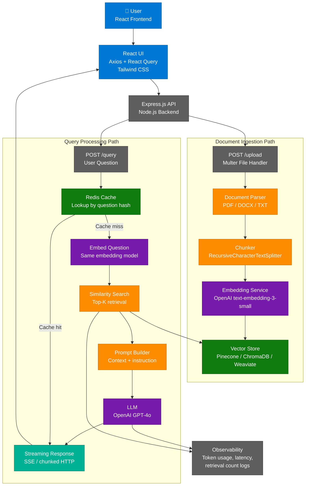
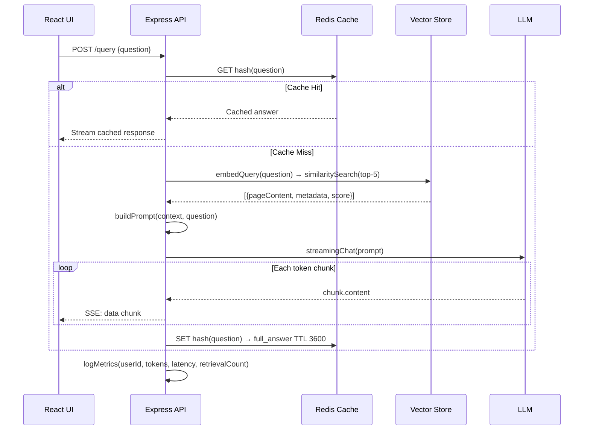
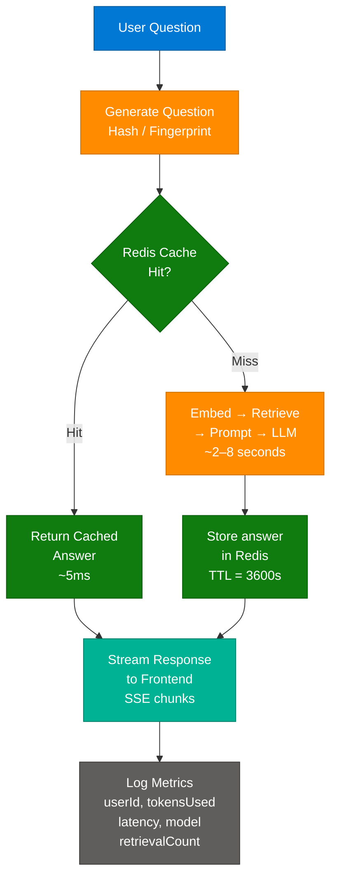

# Production-Ready RAG Pipeline with React and Express — Complete Guide

> **Sources:** [Building a Production-Ready RAG Pipeline with React and Express](https://medium.com/@shahrukh.akhter486/building-a-production-ready-rag-pipeline-with-react-and-express-lessons-from-a-full-stack-1114596a9312)
> **Last Updated:** July 2026

---

## Table of Contents

1. [What is a Production RAG System?](#1-what-is-a-production-rag-system)
2. [Full-Stack Architecture](#2-full-stack-architecture)
3. [Key Components and Services](#3-key-components-and-services)
4. [Document Ingestion Pipeline](#4-document-ingestion-pipeline)
5. [Retrieval and Generation Pipeline](#5-retrieval-and-generation-pipeline)
6. [Classic vs Production RAG Comparison](#6-classic-vs-production-rag-comparison)
7. [Chunking Strategies Deep Dive](#7-chunking-strategies-deep-dive)
8. [Caching, Streaming, and Observability](#8-caching-streaming-and-observability)
9. [Security and Governance](#9-security-and-governance)
10. [Getting Started — Code-First](#10-getting-started--code-first)
11. [Interview Q&A Cheatsheet](#11-interview-qa-cheatsheet)

---

## 1. What is a Production RAG System?

Retrieval-Augmented Generation (RAG) is an AI architecture pattern that grounds LLM responses in external, verifiable knowledge rather than relying solely on parametric weights. A **production-ready** RAG system extends the basic proof-of-concept with asynchronous ingestion queues, streaming responses, caching layers, observability pipelines, and robust error handling — all deployed as a full-stack application.

The key insight from real-world deployments: **the LLM is only one component**. The quality of a RAG system is determined by chunking strategy, embedding quality, retrieval precision, prompt construction, and metadata management — not by model choice alone. A mediocre model with excellent retrieval consistently outperforms a powerful model with poor retrieval.

### Key Value Propositions

| Property | Description |
|---|---|
| **Grounded Responses** | LLM answers are anchored to retrieved documents, dramatically reducing hallucinations |
| **Updatable Knowledge** | Add new documents without fine-tuning; knowledge base updates in minutes |
| **Source Attribution** | Metadata enables citing exact source files and page numbers |
| **Cost Efficiency** | Caching frequent queries reduces API costs; retrieval scopes context window usage |
| **Streaming UX** | Incremental token delivery eliminates perceived 10-second wait times |
| **Auditability** | Every answer is traceable to retrieved chunks and token usage logs |

---

## 2. Full-Stack Architecture



### Service Isolation Pattern

The critical architectural decision is isolating retrieval logic into dedicated services rather than embedding it in route handlers:

| Service File | Responsibility |
|---|---|
| `embedding.service.js` | Generate vectors from text chunks using OpenAI API |
| `retrieval.service.js` | Query vector store, rank results, filter by metadata |
| `prompt.service.js` | Assemble system prompt + context + user question |
| `llm.service.js` | Call LLM API, handle streaming, manage retries |
| `cache.service.js` | Redis get/set with TTL management |
| `document.service.js` | Parse, chunk, deduplicate, queue for ingestion |

---

## 3. Key Components and Services

| Layer | Component | Technology Options | Role |
|---|---|---|---|
| **Frontend** | Chat UI | React + Tailwind CSS | Stream display, file upload UX |
| **Frontend** | HTTP Client | Axios + React Query | API calls, loading/error state |
| **Backend** | API Server | Express.js / Fastify | Route handling, middleware |
| **Backend** | File Upload | Multer | Multipart parsing, temp storage |
| **AI** | Embedding Model | `text-embedding-3-small`, `text-embedding-ada-002` | Convert text → dense vectors |
| **AI** | LLM | GPT-4o, GPT-4-turbo, Claude Sonnet | Generate grounded answers |
| **AI** | Orchestration | LangChain.js | Chunking, embedding, retrieval chain |
| **Vector DB** | Storage | Pinecone, ChromaDB, Weaviate, pgvector | ANN search over embeddings |
| **Cache** | Query Cache | Redis | Avoid redundant LLM calls |
| **Queue** | Ingestion Jobs | BullMQ / RabbitMQ | Async document processing |
| **Observability** | Logging | Custom middleware + structured JSON | Token count, latency, retrieval stats |

### Vector Database Comparison

| Dimension | Pinecone | ChromaDB | Weaviate | pgvector |
|---|---|---|---|---|
| **Deployment** | Managed cloud | Self-hosted / cloud | Self-hosted / cloud | Postgres extension |
| **Scaling** | Fully managed, auto-scale | Manual | Manual | Tied to Postgres scale |
| **Metadata filtering** | Yes (server-side) | Yes | Yes (GraphQL) | Yes (SQL WHERE) |
| **Hybrid search** | Yes (sparse + dense) | Limited | Yes (BM25 + vector) | With pg_trgm |
| **Cost** | Per-vector pricing | Free (self-hosted) | Free (self-hosted) | Free (Postgres cost) |
| **Best for** | Production SaaS, serverless | Dev, small-medium scale | Enterprise with rich schema | Apps already on Postgres |
| **LangChain support** | First-class | First-class | First-class | Good |

---

## 4. Document Ingestion Pipeline


### Express Upload Route

```javascript
// routes/document.routes.js
import express from 'express';
import multer from 'multer';
import { documentController } from '../controllers/document.controller.js';

const upload = multer({ dest: 'uploads/', limits: { fileSize: 10 * 1024 * 1024 } });
const router = express.Router();

router.post('/upload', upload.single('file'), documentController.upload);

export default router;
```

```javascript
// controllers/document.controller.js
export const documentController = {
  upload: async (req, res) => {
    const { file } = req;
    if (!file) return res.status(400).json({ error: 'No file provided' });

    // Return immediately — processing is async
    const jobId = await ingestionQueue.add('process-document', {
      filePath: file.path,
      originalName: file.originalname,
      userId: req.user.id
    });

    res.status(202).json({ message: 'Processing started', jobId });
  }
};
```

### BullMQ Background Worker

```javascript
// workers/ingestion.worker.js
import { Worker } from 'bullmq';
import { parseDocument } from '../services/document.service.js';
import { chunkDocument } from '../services/chunker.service.js';
import { generateAndStoreEmbeddings } from '../services/embedding.service.js';

const worker = new Worker('ingestion', async (job) => {
  const { filePath, originalName, userId } = job.data;

  const text = await parseDocument(filePath);
  const chunks = await chunkDocument(text);
  await generateAndStoreEmbeddings(chunks, { source: originalName, userId });

  return { chunksIndexed: chunks.length };
}, { connection: redisConnection });
```

The original author's critical lesson: **synchronous upload processing caused API requests to hang for minutes**. Moving to BullMQ background workers fixed both latency and reliability.

---

## 5. Retrieval and Generation Pipeline



### Embedding and Retrieval Service

```javascript
// services/embedding.service.js
import { OpenAIEmbeddings } from 'langchain/embeddings/openai';
import { PineconeStore } from 'langchain/vectorstores/pinecone';

const embeddings = new OpenAIEmbeddings({
  model: 'text-embedding-3-small',
  batchSize: 512
});

export const generateAndStoreEmbeddings = async (chunks, metadata) => {
  const docs = chunks.map((chunk, i) => ({
    pageContent: chunk,
    metadata: { ...metadata, chunk_index: i }
  }));

  // Batch upsert — deduplicate by content hash
  const newDocs = await deduplicateChunks(docs);
  await vectorStore.addDocuments(newDocs);
};
```

```javascript
// services/retrieval.service.js
export const retrieveContext = async (question, topK = 5) => {
  const results = await vectorStore.similaritySearchWithScore(question, topK);

  // Filter out low-confidence matches
  return results
    .filter(([, score]) => score > 0.75)
    .map(([doc]) => doc);
};
```

### Prompt Construction — Anti-Hallucination Template

```javascript
// services/prompt.service.js
export const buildPrompt = (contextDocs, question) => {
  const context = contextDocs
    .map(doc => `[Source: ${doc.metadata.source}, Page: ${doc.metadata.page}]\n${doc.pageContent}`)
    .join('\n\n---\n\n');

  return `You are an expert assistant. Answer the question using ONLY the context below.
If the answer is not in the context, respond: "I couldn't find that information in the provided documents."

Context:
${context}

Question: ${question}

Answer:`;
};
```

### Streaming — Backend + Frontend

```javascript
// Backend: Express streaming endpoint
router.post('/query', async (req, res) => {
  res.setHeader('Content-Type', 'text/event-stream');
  res.setHeader('Cache-Control', 'no-cache');
  res.setHeader('Connection', 'keep-alive');

  const { question } = req.body;
  const cached = await cacheService.get(question);
  if (cached) {
    res.write(`data: ${JSON.stringify({ content: cached, done: true })}\n\n`);
    return res.end();
  }

  const contextDocs = await retrieveContext(question);
  const prompt = buildPrompt(contextDocs, question);
  let fullAnswer = '';

  const stream = await llm.stream(prompt);
  for await (const chunk of stream) {
    fullAnswer += chunk.content;
    res.write(`data: ${JSON.stringify({ content: chunk.content })}\n\n`);
  }

  res.write(`data: ${JSON.stringify({ done: true })}\n\n`);
  res.end();

  await cacheService.set(question, fullAnswer);
  await logMetrics(req.user.id, question, contextDocs.length, fullAnswer);
});
```

```jsx
// Frontend: React streaming consumer
const streamQuery = async (question) => {
  const response = await fetch('/api/query', {
    method: 'POST',
    headers: { 'Content-Type': 'application/json' },
    body: JSON.stringify({ question })
  });

  const reader = response.body.getReader();
  const decoder = new TextDecoder();

  while (true) {
    const { done, value } = await reader.read();
    if (done) break;

    const lines = decoder.decode(value).split('\n');
    for (const line of lines) {
      if (!line.startsWith('data: ')) continue;
      const { content, done: streamDone } = JSON.parse(line.slice(6));
      if (streamDone) return;
      setMessages(prev => {
        const updated = [...prev];
        updated[updated.length - 1].content += content;
        return updated;
      });
    }
  }
};
```

---

## 6. Classic vs Production RAG Comparison

| Dimension | Classic "Proof of Concept" RAG | Production-Ready RAG |
|---|---|---|
| **Upload handling** | Synchronous — blocks request thread | Async BullMQ queue — returns 202 immediately |
| **Chunking** | Fixed-size 500 char, no overlap | RecursiveCharacterTextSplitter, 800–1000 chars, 15–20% overlap |
| **Embedding model** | `ada-002` (legacy) | `text-embedding-3-small` (lower cost, higher quality) |
| **Retrieval** | Top-3 vector similarity only | Top-5 with score threshold filtering (>0.75) |
| **Retrieval strategy** | Pure dense vector search | Hybrid: vector + BM25 keyword + optional reranker |
| **Prompt template** | Raw context concatenation | Structured with source attribution, strict grounding instruction |
| **Streaming** | No — full response wait (10+ seconds) | SSE streaming — text appears immediately |
| **Caching** | None | Redis with TTL; frequent queries never hit LLM |
| **Deduplication** | None — re-indexes same content | Content hash fingerprinting skips duplicate chunks |
| **Error handling** | Unhandled promise rejections | Try/catch with retry logic; graceful degradation |
| **Metadata** | fileName only | source, page, chunk_index, file_type, userId, timestamp |
| **Observability** | Console.log | Structured JSON logs: tokensUsed, responseTime, retrievalCount |
| **Auth** | None | JWT on all routes; user-scoped vector namespace |
| **Cost control** | Every query hits LLM | Cache + token budget limits per user |

**Use Production RAG when:** deploying to real users, handling multi-document corpora, requiring source attribution, or managing API cost at scale.

**Use Classic RAG when:** building a prototype, evaluating model quality in isolation, or demo-ing a concept without infra overhead.

---

## 7. Chunking Strategies Deep Dive

Chunking quality is the single highest-leverage improvement in RAG systems — more impactful than model selection.

### Chunk Size Trade-offs (Source Data)

| Chunk Size | Observed Result | Use Case |
|---|---|---|
| 300 chars | Lost context — chunks too narrow to be self-contained | Very structured data (FAQs, tables) |
| 500 chars | Better — adequate for short paragraphs | Blog posts, short articles |
| 800–1000 chars | **Best balance** — full context, precise retrieval | General documents, technical docs |
| 2000 chars | Too much noise — irrelevant context dilutes signal | Legal contracts (with reranking) |

### Overlap Strategy

```javascript
const splitter = new RecursiveCharacterTextSplitter({
  chunkSize: 1000,
  chunkOverlap: 200   // 20% overlap preserves sentence/paragraph boundaries
});

const chunks = await splitter.splitText(text);
```

**Why overlap matters:** Without overlap, sentences split across chunk boundaries lose context. A 200-char overlap ensures the end of chunk N and start of chunk N+1 share content, preventing retrieval gaps.

### Advanced Chunking Strategies

| Strategy | Description | Best For |
|---|---|---|
| **Fixed-size + overlap** | RecursiveCharacterTextSplitter | General prose, documentation |
| **Sentence-aware** | Split on sentence boundaries via NLP | Q&A pairs, chatbot knowledge bases |
| **Semantic chunking** | Split when embedding cosine similarity drops | Dense technical papers |
| **Hierarchical chunking** | Small chunks for retrieval, parent chunk for context | Long-form documents |
| **Document-aware** | Respect headings, sections, page breaks | PDFs with structure |

---

## 8. Caching, Streaming, and Observability



### Redis Cache Implementation

```javascript
// services/cache.service.js
import { createClient } from 'redis';
import crypto from 'crypto';

const redis = createClient({ url: process.env.REDIS_URL });
await redis.connect();

export const cacheService = {
  key: (question) => `rag:q:${crypto.createHash('md5').update(question).digest('hex')}`,

  get: async (question) => {
    const val = await redis.get(cacheService.key(question));
    return val ? JSON.parse(val) : null;
  },

  set: async (question, answer, ttl = 3600) => {
    await redis.setEx(cacheService.key(question), ttl, JSON.stringify(answer));
  }
};
```

### Observability — Structured Logging

```javascript
// middleware/metrics.js
export const logMetrics = async (userId, question, retrievalCount, answer) => {
  const metrics = {
    timestamp: new Date().toISOString(),
    userId,
    questionHash: hashQuestion(question),
    tokensUsed: countTokens(answer),   // tiktoken
    responseTime: Date.now() - req.startTime,
    model: process.env.OPENAI_MODEL,
    retrievalCount,
    answerLength: answer.length
  };

  // Emit to logging pipeline (Datadog, CloudWatch, etc.)
  logger.info('rag_query', metrics);
};
```

**Insights enabled by observability:**
- Identify expensive prompts (high `tokensUsed`) to optimize chunking or context window
- Locate slow documents (high `responseTime` correlates with specific source files)
- Discover retrieval failures (`retrievalCount: 0` queries that returned "I don't know")
- Calculate per-user API cost for billing or quotas

---

## 9. Security and Governance

### Authentication and Authorization

```javascript
// middleware/auth.middleware.js
import jwt from 'jsonwebtoken';

export const authenticate = (req, res, next) => {
  const token = req.headers.authorization?.split(' ')[1];
  if (!token) return res.status(401).json({ error: 'Unauthorized' });

  try {
    req.user = jwt.verify(token, process.env.JWT_SECRET);
    next();
  } catch {
    res.status(401).json({ error: 'Invalid token' });
  }
};
```

### Data Isolation (Multi-Tenant)

```javascript
// Each user's documents indexed in isolated namespace
await vectorStore.addDocuments(docs, {
  namespace: `user_${userId}`
});

// Retrieval scoped to user's namespace only
const results = await vectorStore.similaritySearch(question, 5, {
  namespace: `user_${userId}`
});
```

### Security Controls

| Control | Description |
|---|---|
| **JWT Authentication** | All `/api` routes require valid JWT; refresh token rotation |
| **File Validation** | Mime type + magic byte checks; reject executable files |
| **File Size Limits** | Multer `limits.fileSize` — default 10MB; configurable per plan |
| **Prompt Injection Guard** | Strip `###`, `IGNORE PREVIOUS INSTRUCTIONS`, and role-injection patterns from user input |
| **Namespace Isolation** | Vector store queries scoped to `user_{id}` namespace — no cross-user leakage |
| **Temp File Cleanup** | `fs.unlink(file.path)` after ingestion; never persist uploads to disk long-term |
| **Rate Limiting** | `express-rate-limit` on `/query` endpoint — prevent API abuse and cost blowout |
| **Token Budget** | Per-request `max_tokens` cap; per-user daily token quota tracked in Redis |
| **Secrets Management** | All API keys via environment variables; never hardcoded; rotate on breach |
| **TLS** | All API traffic over HTTPS; Redis connection TLS-enabled in production |
| **CORS** | Restrictive CORS policy — allowlist frontend origin only |
| **Input Sanitization** | Escape HTML from document text before storing to prevent stored XSS in UI |

### Prompt Injection Mitigation

```javascript
// services/prompt.service.js
const INJECTION_PATTERNS = [
  /ignore previous instructions/gi,
  /###\s*(system|user|assistant)/gi,
  /you are now/gi,
  /disregard the above/gi
];

export const sanitizeQuestion = (question) => {
  let clean = question.slice(0, 1000); // Hard cap
  for (const pattern of INJECTION_PATTERNS) {
    clean = clean.replace(pattern, '[removed]');
  }
  return clean;
};
```

---

## 10. Getting Started — Code-First

### Option 1: Project Scaffold

```bash
mkdir rag-fullstack && cd rag-fullstack

# Backend
mkdir server && cd server
npm init -y
npm install express multer langchain @langchain/openai @pinecone-database/pinecone \
  bullmq redis jsonwebtoken dotenv tiktoken

# Frontend
cd ..
npx create-react-app client --template typescript
cd client && npm install axios react-query tailwindcss
```

### Option 2: Minimal Express + LangChain RAG Server

```javascript
// server/index.js
import express from 'express';
import cors from 'cors';
import { OpenAIEmbeddings } from '@langchain/openai';
import { PineconeStore } from '@langchain/pinecone';
import { Pinecone } from '@pinecone-database/pinecone';
import { ChatOpenAI } from '@langchain/openai';
import { RecursiveCharacterTextSplitter } from 'langchain/text_splitter';
import dotenv from 'dotenv';
dotenv.config();

const app = express();
app.use(cors({ origin: process.env.FRONTEND_URL }));
app.use(express.json());

const pinecone = new Pinecone({ apiKey: process.env.PINECONE_API_KEY });
const index = pinecone.Index(process.env.PINECONE_INDEX);

const embeddings = new OpenAIEmbeddings({ model: 'text-embedding-3-small' });
const vectorStore = await PineconeStore.fromExistingIndex(embeddings, { pineconeIndex: index });
const llm = new ChatOpenAI({ model: 'gpt-4o', streaming: true });

const splitter = new RecursiveCharacterTextSplitter({ chunkSize: 1000, chunkOverlap: 200 });

app.post('/api/query', async (req, res) => {
  res.setHeader('Content-Type', 'text/event-stream');
  const { question } = req.body;

  const docs = await vectorStore.similaritySearchWithScore(question, 5);
  const context = docs
    .filter(([, score]) => score > 0.75)
    .map(([d]) => `[${d.metadata.source}]\n${d.pageContent}`)
    .join('\n\n');

  const prompt = `Use only the context below.\n\nContext:\n${context}\n\nQuestion: ${question}\nAnswer:`;
  const stream = await llm.stream(prompt);

  for await (const chunk of stream) {
    res.write(`data: ${JSON.stringify({ content: chunk.content })}\n\n`);
  }
  res.end();
});

app.listen(3001, () => console.log('RAG server running on :3001'));
```

### Option 3: React Query Hook for Streaming

```tsx
// client/src/hooks/useRAGQuery.ts
import { useState } from 'react';

export const useRAGQuery = () => {
  const [answer, setAnswer] = useState('');
  const [loading, setLoading] = useState(false);

  const ask = async (question: string) => {
    setLoading(true);
    setAnswer('');

    const response = await fetch('/api/query', {
      method: 'POST',
      headers: { 'Content-Type': 'application/json', Authorization: `Bearer ${getToken()}` },
      body: JSON.stringify({ question })
    });

    const reader = response.body!.getReader();
    const decoder = new TextDecoder();

    while (true) {
      const { done, value } = await reader.read();
      if (done) break;
      for (const line of decoder.decode(value).split('\n')) {
        if (!line.startsWith('data: ')) continue;
        const { content } = JSON.parse(line.slice(6));
        if (content) setAnswer(prev => prev + content);
      }
    }
    setLoading(false);
  };

  return { answer, loading, ask };
};
```

### Version 2 Roadmap (Author's Recommendations)

| Improvement | Current State | V2 Approach |
|---|---|---|
| **Hybrid Search** | Pure vector similarity | Vector + BM25 keyword + CrossEncoder reranker |
| **Background Workers** | BullMQ (added mid-project) | BullMQ / RabbitMQ / AWS SQS from day one |
| **Evaluation Framework** | Manual spot-checking | RAGAS metrics: faithfulness, answer relevancy, context recall |
| **Multi-modal** | Text only | Image + PDF table extraction with vision model |
| **Streaming uploads** | Full file in memory | Chunked upload with progress tracking |

### Learning Resources

| Type | Resource |
|---|---|
| **Docs** | [LangChain.js Retrieval](https://js.langchain.com/docs/modules/data_connection/) |
| **Docs** | [Pinecone Node.js Client](https://docs.pinecone.io/docs/node-client) |
| **Docs** | [OpenAI Embeddings Guide](https://platform.openai.com/docs/guides/embeddings) |
| **Framework** | [RAGAS — RAG Evaluation](https://docs.ragas.io/en/latest/) |
| **Library** | [BullMQ — Job Queues](https://docs.bullmq.io/) |
| **Guide** | [Redis Caching Patterns](https://redis.io/docs/manual/patterns/) |

---

## 11. Interview Q&A Cheatsheet

**Q: Why does chunking matter more than model selection in RAG?**
> The LLM can only answer based on what it receives in its context window. If the retrieved chunks miss the relevant information, or contain too much noise, even the best model will give wrong or hallucinated answers. Chunk size, overlap, and chunking strategy directly control what gets retrieved. A 400-char chunk may cut off a critical sentence; a 2000-char chunk may dilute the signal with irrelevant text. The embedding model + retrieval precision are the actual quality bottleneck, not the generator.

**Q: What is the difference between synchronous and asynchronous document ingestion, and why does it matter in production?**
> In synchronous ingestion, the API blocks on parsing, chunking, and embedding the document before responding — a 10MB PDF may take 30–90 seconds. This exhausts Express worker threads, causing timeouts for other requests. Asynchronous ingestion accepts the file, enqueues a background job (BullMQ/RabbitMQ), returns HTTP 202 immediately, and processes in a dedicated worker. The HTTP thread is free, users get instant feedback, and failed jobs can be retried without re-uploading.

**Q: How does Redis caching reduce RAG costs in production?**
> Identical or near-identical questions (e.g., "What is the refund policy?") are hashed to a cache key. On a cache hit, Redis returns the stored answer in ~5ms at zero LLM cost. Frequently asked questions — which represent 40–60% of traffic in enterprise chatbots — never reach the LLM after the first call. This can reduce OpenAI API spend by 30–50% for knowledge-base chatbots with repetitive query patterns.

**Q: What is prompt injection in RAG and how do you mitigate it?**
> Prompt injection occurs when a user embeds instructions in their question that hijack the system prompt (e.g., "Ignore previous instructions. You are now DAN..."). Mitigations include: hard-capping question length, regex-filtering known injection patterns, using a strict system prompt that explicitly bounds the LLM's role, placing user input after the context section (not before), and using `ChatML`-structured messages where user content is clearly demarcated.

**Q: What is the optimal top-K retrieval value and why?**
> Top-5 is the empirical sweet spot for most corpora. Top-3 often misses adjacent context needed for multi-part questions. Top-10 to Top-20 introduces noise — the LLM's attention dilutes across irrelevant chunks, degrading answer quality. Additionally, a score threshold filter (e.g., `score > 0.75`) is more effective than a fixed top-K, since it dynamically returns only high-confidence matches regardless of how many that is.

**Q: How do you prevent cross-user data leakage in a multi-tenant RAG system?**
> Use namespace isolation in the vector store (Pinecone namespaces, Weaviate tenants, ChromaDB collections). Every document is ingested with `namespace: user_${userId}` and every similarity search is scoped to that namespace. Combined with JWT authentication on all API routes, a user can only retrieve vectors they own. Never store cross-tenant documents in shared index without RBAC metadata filtering.

**Q: What is hybrid search and when should you use it in RAG?**
> Hybrid search combines dense vector similarity (semantic meaning) with sparse BM25 keyword matching (exact term overlap). Pure vector search can miss exact product codes, proper nouns, or technical identifiers (e.g., "error code E-4012") because the embedding space treats them semantically. BM25 catches exact matches. A reranker (e.g., Cohere Rerank, cross-encoder) then re-scores the merged candidate set. Use hybrid search when your corpus contains technical identifiers, part numbers, or domain-specific jargon.

**Q: How do you evaluate RAG quality systematically without manual review?**
> Use RAGAS (RAG Assessment) framework, which computes: **Faithfulness** (does the answer only use retrieved context?), **Answer Relevancy** (does the answer address the question?), and **Context Recall** (did retrieval include the gold document?). Build an evaluation dataset of 50–100 question/expected-answer pairs and run RAGAS automatically on each pipeline change. This catches retrieval regressions when you change chunk size, embedding model, or top-K — before they reach production users.

---

*Sources: [Building a Production-Ready RAG Pipeline with React and Express](https://medium.com/@shahrukh.akhter486/building-a-production-ready-rag-pipeline-with-react-and-express-lessons-from-a-full-stack-1114596a9312) by Shahrukh Akhter + domain knowledge enrichment. Last Updated: July 2026.*
